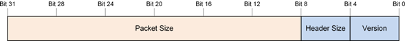
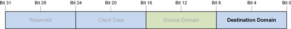
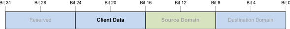
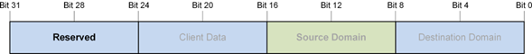
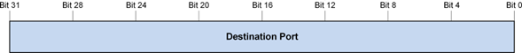
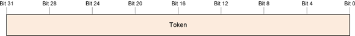
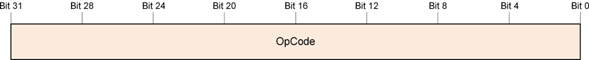
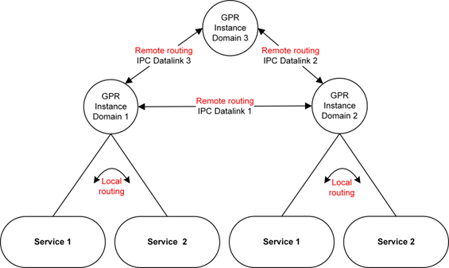
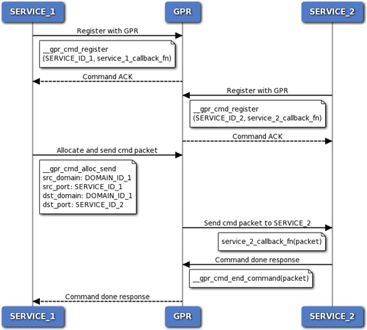

# Generic Packet Router

- Introduction
    - Purpose
- Functional Overview
    - GPR Infrastructure
    - API Messaging Model
    - GPR Protocol
    - General Operations
- Routing
    - Local Routing
    - Remote Routing
- GPR Infrastructure Interfaces
    - GPR Constants and Macros
    - Define Documentation
- GPR Status and Error Codes
    - Define Documentation
- GPR Core Packet Structure
    - Data Structure Documentation
- Callback Function Prototype
    - Typedef Documentation
- GPR Core Routines
    - Function Documentation
- GPR Fundamental Controls
    - Register a Service
    - Deregister a Service
    - Query for Registered Service
    - Query for Local or Host Domain
    - Query for Packet Pool Information
    - Send an Asynchronous Message
    - Allocate a Free Message for Delivery
    - Free a Packet from a Queue
- GPR Utility Controls
    - Allocate Part of a Message
- Allocate and Send a Message
    - Function Documentation
- Accept a Command Message
    - Function Documentation
- Send a Command Response
    - Function Documentation
    - GPR Standard Response Opcodes
- IPC Interfaces
    - GPR-to-IPC Callback Functions
    - IPC-to-GPR Virtual Function Wrapper
    - IPC Data Link Function Prototypes
    - GPR Functions for Local Routing
    - Platform-specific Configuration Wrappers
- Custom Implementations
    - Custom Platform Wrapper
    - Custom Domain ID
    - Custom IPC Data Link or Transport Layer
- Acronyms and Terms

## Introduction

### Purpose

This document describes the Generic Packet Router (GPR) API, which is intended to help developers understand and use the GPR to access or publish new services. Readers are assumed to be developers with some familiarity in packet-based and message-based protocols. This document provides the public interfaces necessary to use the features provided by the GPR API. A functional overview and information on leveraging the interface functionality are also provided.

## Functional Overview

This chapter provides an overview of the GPR infrastructure and protocol.

### GPR Infrastructure

The GPR infrastructure provides a common set of APIs across different platforms, software layers, and processor domains to enable them to communicate using asynchronous messages. The infrastructure is a memory optimized, platform agnostic layer. The following figure illustrates an example of the GPR infrastructure on different processor domains such as the Application domain, DSP domain, and so on. The GPR can also be used on different platforms such as the Arm processor and Windows operating system. Refer to GPR infrastructure on different processing domains


*GPR infrastructure on different processing domains*

The AudioReach Engine (ARE) provides the necessary framework to realize audio and voice use cases with various algorithm and framework modules (see [AudioReach Engine](arspf_design.html#arspf-design)). The Graph Service Layer (GSL) serves as the client and interacts with the ARE to provide use case configuration and calibration. The GPR is responsible for routing messages and commands between the ARE and GSL processing domains in the AudioReach framework. It achieves this remote communication by abstracting out the underlying Interprocessor communication (IPC) data link layers. Essentially, the GPR does two types of routing:

- Local routing – Communication within the same processor domain.
- Remote routing – Communication between different processor domains. The GPR interfaces with the data link layer to achieve this remote routing.

#### GPR Software Layering

The GPR infrastructure is categorized into three layers: core layer, data link layer, and platform layer. Below figure illustrates this simplified model.


*GPR layering model*

#### Core Layer

The core layer implements the core GPR functionality and can be further classified into the following functional blocks.

- Client interface
    - Implements the core GPR APIs such as send packets, allocate packets, and so on that are used by all clients.
- Packet routing layer
    - Implements the GPR packet queues.
    - Is responsible for local routing, which refers to packets that are transmitted within the same processor domain.
- Data link interface
    - Is the GPR’s interface with the data link layer.
    - Implements the GPR callback functions that are shared with every data link layer.
    - Functions are called *GPR-to-IPC* callback functions and are essential to enable remote routing (see Section GPR-to-IPC Callback Functions).

#### Data Link Layer

The GPR data link layer is responsible for remote routing, which is the routing between different processor domains. Every data link implementation has two parts:

- Core data link layer
    - Contains the actual implementation of the data link transport layer APIs and functionality that facilitates remote routing.
    - Examples of data link layers include the Generic Link (G-link) and the Shared Memory Driver (SMD).
- GPR data link plug-in
    - Wrapper to the core data link layer.
    - Implements the IPC-to-GPR callback functions (see Section IPC-to-GPR Virtual Function Wrapper) that are shared with the GPR data link interface during initialization.

#### Platform layer

The platform layer comprises all the platform specific-implementations and enables the GPR to be platform agnostic. It has two components:

- Platform-specific configuration wrappers
    - Enable each platform to instantiate the GPR with platform-specific configuration (see Section Platform-specific Configuration Wrappers).
- Common Operating System Abstraction Layer (OSAL)
    - GPR core layer uses this layer as well as the GPR data link plug-in layers.

### API Messaging Model

#### Asynchronous Messaging Design

The GPR infrastructure follows an asynchronous messaging design that can deliver unidirectional messages quickly and support messaging in the interrupt context.

#### Message Structure

The GPR infrastructure defines the GPR message send function, the message receive callback function, and the message structure. The current GPR protocol uses 4-byte aligned, little-endian messages. Any unrecognized messages will cause the GPR send message function to return an error. The sender is expected to free undelivered messages and gracefully handle return errors. **NOTE:** Messages and packets are used interchangeably in the GPR infrastructure.

### GPR Protocol

The GPR protocol is a core messaging protocol that runs on top of the GPR infrastructure and includes the following features:

- Provides a standard, real-time capable messaging protocol between client applications and software layers.
- Is a lightweight layer that has minimum protocol overhead.
- Is platform-agnostic.
- Requires the underlying data and transport layers to guarantee serial delivery.
- Assumes that clients and subsystems will recover from undelivered or late transactions.

#### Packet Details

Below figure illustrates the GPR message/packet structure (gpr_packet_t), where the numbers at the top indicate the bit positions. The following sections provide more details.


*GPR packet data structure with all fields*

#### Size and Version Fields



The following table shows the information for these fields.

| **Subfield** | **Number of bits** | **Description** |
| --- | --- | --- |
| Version | 4 | Defines the layout of the packet structure. Unless otherwise indicated, packet versions are assumed to be backward-compatible to the core format (first five header words). |
| Header Size | 4 | Number of 32-bit header words starting from the beginning of the packet. |
| Packet Size | 24 | Total packet size in bytes, including both the header and payload data. |

#### Source and Destination Domain Fields

The GPR messaging protocol uses a domain ID to define the host process, processor, or target, and it uses a service ID to define the services or modules that live within the host. Every domain must have a dedicated local GPR instance. All messages must flow through their local GPR instances. The GPR dispatches messages locally or remotely according to each message’s destination domain value. Below figure illustrates two domains, each with its own GPR instance.


*Example of interprocess communication*

The following figure illustrates the destination domain field, which represents a processor or off-target location that contains the GPR to which the packet is sent.



The following figure illustrates the source domain field, which represents a processor or off-target location that contains the GPR from which the packet is sent.


#### Client Data Field

The client data field is used for client-specific needs. By default, this field must be set to 0 when unused. The following figure illustrates the field, in which 4 bits are open for use by the client and 4 bits are reserved and are set to 0.



#### Reserved Field

The reserved field must always be set to 0.



#### Source and Destination Port Fields

The source port field represents a unique (within a given domain) ID that can be used to identify a service or module in the source domain. It is interpreted as the service ID of the source service or module instance. **NOTE:** The terms *port* and *service ID* can be used interchangeably.


The destination port field represents the unique (within a domain) ID that can be used to identify a service or module in the destination domain. It is interpreted as the service ID of the destination service or the module instance ID of the destination module.



#### Token Field

The token field no subfields. It is a transaction identifier, a sequence number, or any value that allows a client to identify which command is completed after receiving a command response message. The token field must be set to 0 when unused.



#### Opcode Field

The opcode is a GUID value that is used when selecting the operation and defining the payload structure. The operation selects the function call, and the payload contains the function arguments.



#### Payload Field

The payload field has no subfields. It contains the arguments to the function call specified in the opcode field (defined in section Opcode Field).


### General Operations

#### Addressing Scheme

The source or destination for a given GPR packet is identified by a 32-bit service ID (see section Source and Destination Port Fields) and the 8-bit processor domain to which the service belongs (see Section Packet Details). For a given service, the service ID must be unique within the domain. All services within a domain have the same domain ID.

#### Registration

To send or receive packets, each service or module must first register with the GPR. Registration can be done at any time by calling the gpr_cmd_register() function to register the packet callback function of the service. Each instance of the GPR maintains a database that stores this service ID information along with the corresponding callback function and callback argument (if non-NULL) upon registration. Every time a new service registers, an entry is added to the database. All entries in the database can be identified by their unique service IDs.

#### Deregistration

During a power-down sequence, services or modules must deregister from the GPR by calling gpr_cmd_deregister(). Each registered service ID is to be deregistered only once.

#### Send Messages

Services or modules use gpr_cmd_async_send() to send messages in the form of packets through the GPR service. Callers must check the return result of gpr_cmd_async_send() for failures, free the packet when the send function fails, and, when necessary, perform error recovery. The low-level gpr_cmd_async_send() function leaves packet allocation and error management to the caller. Utility APIs are available to make working with gpr_cmd_async_send() easier. These functions are not mandatory. The caller can use any utility library to help with packet allocation and error management.

#### Receive Messages

Services can start receiving messages immediately after registering with the GPR service. The registered packet callback routine is assumed to run in the ISR context. All the restrictions in the ISR context apply to the packet callback routine. Messages serviced in the ISR context have the highest priority possible. Any time-consuming operations must be queued to the thread context for further processing in the appropriate thread priority level. You cannot call blocking routines in the dispatch context. Blocking will cause system instability and performance problems.

## Routing

Routing refers to the GPR’s ability to send and receive data packets to and from clients or other GPR instances. Depending on the source and destination domain IDs, the GPR must do either local or remote routing. Below figure illustrates the difference between local and remote routing, which is explained in the following sections.


*Local and remote routing through GPR*

### Local Routing

Local routing refers to the transmission of packets within the same domain. The GPR determines a given routing to be local if the source domain ID and destination domain ID are the same. In this case, the GPR simply searches its database to retrieve the callback function based on the unique destination service ID. After the callback function is retrieved, the destination service’s callback routine is invoked and the packet is sent. Below figure illustrates the call flow between two service on the same domain. Both services must first register their callback functions with the GPR, and then they can exchange messages.


*Local routing call flow between two services on same domain*

### Remote Routing

Remote routing refers to the transmission of packets between different domains or processors. The GPR and IPC data link layers interact and exchange GPR-IPC callback functions during initialization (see Sections GPR-to-IPC Callback Functions and IPC-to-GPR Virtual Function Wrapper.) These callback functions are then invoked at runtime to enable remote routing. Fig: Remote routing call flow below illustrates the call flow for remote routing. Services on each domain must register with their respective GPR instances. Following is the process for sending packets to remote processors:

1. The GPR allocates a packet and calls the data link layer’s send() function, which is stored in the ipc_to_gpr_vtbl_t virtual function table (vtable).
2. After the data link layer finishes transmitting the packet, it calls the GPR’s send_done() function, which is stored in the gpr_to_ipc_vtbl_t virtual function table.

Following is the process for remote processors to receive packets:

1. The data link layer copies the contents of the remote GPR packet into one of its packets.
2. Then it calls the GPR’s receive() function, which is stored in the gpr_to_ipc_vtbl_t virtual function table. This vtable invokes the GPR’s receive() function to transmit the packet to its destination.
3. After the GPR finishes transmitting the packet, it calls the data link layer’s receive_done() function, which is stored in ipc_to_gpr_vtbl_t. This vtable invokes the data link layer’s free() function to free the packet.


*Remote routing call flow between GPR and IPC data link layer*

## GPR Infrastructure Interfaces

### GPR Constants and Macros

**GPR Core Export Macros**

- #define GPR_INTERNAL extern “C”
- #define GPR_EXTERNAL extern “C”

**GPR Domain IDs**

A domain ID is to a unique ID that identifies a process, a processor, or an off-target location that houses GPR. The transport mechanism between the published domains can vary. Domain IDs are directly used as port indices to access GPR routing arrays. Hence they have to always have values starting from 0 such as 0,1,2,3 and not Globally Unique IDs (GUIDS).

- #define GPR_IDS_DOMAIN_ID_INVALID_V 0
- #define GPR_IDS_DOMAIN_ID_MODEM_V 1
- #define GPR_IDS_DOMAIN_ID_ADSP_V 2
- #define GPR_IDS_DOMAIN_ID_APPS_V 3
- #define GPR_IDS_DOMAIN_ID_SDSP_V 4
- #define GPR_IDS_DOMAIN_ID_CDSP_V 5
- #define GPR_PL_MAX_DOMAIN_ID_V
- #define GPR_PL_NUM_TOTAL_DOMAINS_V

**GPR Packet Definitions**

- #define GPR_PKT_VERSION_V
- #define GPR_PKT_INIT_PORT_V
- #define GPR_PKT_INIT_RESERVED_V
- #define GPR_PKT_INIT_DOMAIN_ID_V
- #define GPR_PKT_HEADER_WORD_SIZE_V
- #define GPR_PKT_HEADER_BYTE_SIZE_V
- #define GPR_UNDEFINED_ID_V
- #define GPR_PKT_INIT_CLIENT_DATA_V
- #define GPR_PKT_VERSION_MASK ( 0x0000000F )
- #define GPR_PKT_VERSION_SHFT ( 0 )
- #define GPR_PKT_HEADER_SIZE_MASK ( 0x000000F0 )
- #define GPR_PKT_HEADER_SIZE_SHFT ( 4 )
- #define GPR_PKT_RESERVED_MASK ( 0xFFF00000 )
- #define GPR_PKT_RESERVED_SHFT ( 20 )
- #define GPR_PKT_PACKET_SIZE_MASK ( 0xFFFFFF00 )
- #define GPR_PKT_PACKET_SIZE_SHFT ( 8 )
- #define GPR_GET_BITMASK(mask, shift, value)
- #define GPR_SET_BITMASK(mask, shift, value)
- #define GPR_GET_FIELD(field, value)
- #define GPR_SET_FIELD(field, value)
- #define GPR_PTR_END_OF(base_ptr, offset)
- #define GPR_PKT_GET_PACKET_BYTE_SIZE(header)
- #define GPR_PKT_GET_HEADER_BYTE_SIZE(header)
- #define GPR_PKT_GET_PAYLOAD_BYTE_SIZE(header)
- #define GPR_PKT_GET_PAYLOAD(type, packet_ptr)

### Define Documentation

#### #define GPR_INTERNAL extern “C”

Export macro that indicates a function is internal to the GPR.

#### #define GPR_EXTERNAL extern “C”

Export macro that indicates an external function, which is intended for client use.

#### #define GPR_IDS_DOMAIN_ID_INVALID_V 0

Invalid domain.

#### #define GPR_IDS_DOMAIN_ID_MODEM_V 1

Modem DSP (mDSP) domain.

#### #define GPR_IDS_DOMAIN_ID_ADSP_V 2

Audio DSP (aDSP) domain.

#### #define GPR_IDS_DOMAIN_ID_APPS_V 3

Applications domain.

#### #define GPR_IDS_DOMAIN_ID_SDSP_V 4

Sensors DSP (sDSP) domain.

#### #define GPR_IDS_DOMAIN_ID_CDSP_V 5

Compute DSP (cDSP) domain.

#### #define GPR_PL_MAX_DOMAIN_ID_V

Highest domain ID.

#### #define GPR_PL_NUM_TOTAL_DOMAINS_V

Total number of domains.

#### #define GPR_PKT_VERSION_V

Defines the layout of the packet structure.

#### #define GPR_PKT_INIT_PORT_V

Uninitialized port value.

#### #define GPR_PKT_INIT_RESERVED_V

Uninitialized reserved field value.

#### #define GPR_PKT_INIT_DOMAIN_ID_V

Uninitialized domain ID value.

#### #define GPR_PKT_HEADER_WORD_SIZE_V

Header size in number of 32-bit words.

#### #define GPR_PKT_HEADER_BYTE_SIZE_V

Header size in number of bytes.

#### #define GPR_UNDEFINED_ID_V

Undefined value where a valid GUID is expected.

#### #define GPR_PKT_INIT_CLIENT_DATA_V

Uninitialized client data value.

#### #define GPR_PKT_VERSION_MASK ( 0x0000000F )

Bitmask of the version field.

#### #define GPR_PKT_VERSION_SHFT ( 0 )

Bit shift of the version field.

#### #define GPR_PKT_HEADER_SIZE_MASK ( 0x000000F0 )

Bitmask of the header size field.

#### #define GPR_PKT_HEADER_SIZE_SHFT ( 4 )

Bit shift of the header size field.

#### #define GPR_PKT_RESERVED_MASK ( 0xFFF00000 )

Bitmask of the reserved field. Includes four reserved bits from the client data field.

#### #define GPR_PKT_RESERVED_SHFT ( 20 )

Bit shift of the reserved field.

#### #define GPR_PKT_PACKET_SIZE_MASK ( 0xFFFFFF00 )

Bitmask of the packet size field.

#### #define GPR_PKT_PACKET_SIZE_SHFT ( 8 )

Bit shift of the packet size field.

#### #define GPR_GET_BITMASK( *mask, shift, value* )

Gets the value of a field, including the specified mask and shift.

#### #define GPR_SET_BITMASK( *mask, shift, value* )

Sets a value in a field, including the specified mask and shift.

#### #define GPR_GET_FIELD( *field, value* )

Gets the value of a field.

#### #define GPR_SET_FIELD( *field, value* )

Sets a value in a field.

#### #define GPR_PTR_END_OF( *base_ptr, offset* )

Returns an 8-bit aligned pointer to a base address pointer plus an offset in bytes.

#### #define GPR_PKT_GET_PACKET_BYTE_SIZE( *header* )

Given the packet header, returns the packet’s current size in bytes. The current packet byte size is the sum of the base packet structure and the used portion of the payload.

#### #define GPR_PKT_GET_HEADER_BYTE_SIZE( *header* )

Given the packet header, returns the header’s current size in bytes.

#### #define GPR_PKT_GET_PAYLOAD_BYTE_SIZE( *header* )

Given the packet header, returns the payload’s current size in bytes. The current payload byte size is the difference between the packet size and the header size.

#### #define GPR_PKT_GET_PAYLOAD( *type, packet_ptr* )

Given the packet, returns a pointer to the beginning of the packet’s payload.

## GPR Status and Error Codes

### Define Documentation

#### #define AR_EOK (0)

Success. The operation completed with no errors.

#### #define AR_EFAILED (1)

General failure.

#### #define AR_EBADPARAM (2)

Bad operation parameter.

#### #define AR_EUNSUPPORTED (3)

Unsupported routine or operation.

#### #define AR_EVERSION (4)

Unsupported version.

#### #define AR_EUNEXPECTED (5)

Unexpected problem encountered.

#### #define AR_EPANIC (6)

Unhandled problem occurred.

#### #define AR_ENORESOURCE (7)

Unable to allocate resource.

#### #define AR_EHANDLE (8)

Invalid handle.

#### #define AR_EALREADY (9)

Operation is already processed.

#### #define AR_ENOTREADY (10)

Operation is not ready to be processed.

#### #define AR_EPENDING (11)

Operation is pending completion.

#### #define AR_EBUSY (12)

Operation cannot be accepted or processed.

#### #define AR_EABORTED (13)

Operation was aborted due to an error.

#### #define AR_ECONTINUE (14)

Operation requests an intervention to complete.

#### #define AR_EIMMEDIATE (15)

Operation requests an immediate intervention to complete.

#### #define AR_ENOTIMPL (16)

Operation was not implemented.

#### #define AR_ENEEDMORE (17)

Operation needs more data or resources.

#### #define AR_ENOMEMORY (18)

Operation does not have memory.

#### #define AR_ENOTEXIST (19)

Item does not exist.

#### #define AR_ETERMINATED (20)

Operation is finished.

#### #define AR_ETIMEOUT (21)

Operation timeout.

#### #define AR_SUCCEEDED( *x* )

Macro that checks whether a result is a success.

#### #define AR_FAILED( *x* )

Macro that checks whether a result is a failure.

## GPR Core Packet Structure

### Data Structure Documentation

#### struct gpr_packet_t

Core header structure necessary to route a packet from a source to a destination.

| **Type** | **Parameter** | **Description** |
| --- | --- | --- |
| uint32_t | header | Contains the following subfield information for the header field. **version**  Bits 3 to 0 (four bits). Defines the layout of the packet structure.  **header_size**  Bits 7 to 4 (four bits). The header size is the number of 32-bit header words starting. from the beginning of the packet.  **packet_size**  Bits 31 to 8 (twenty-four bits). The total packet size in bytes. The total packet size includes both the header and payload size. |
| uint8_t | dst_domain_id | Domain ID of the destination where the packet is to be delivered.  Bits 0 to 7 (eight bits). The domain ID refers to a process, a processor, or an off-target location that houses GPR. The transport layer used may differ depending on the physical link between domains. All domain ID values are reserved by GPR. |
| uint8_t | src_domain_id | Domain ID of the source from where the packet came.  Bits 8 to 15 (eight bits). The domain ID refers to a process, a processor, or an off-target location that houses GPR. The transport layer used may differ depending on the physical link between domains. All domain ID values are reserved by the GPR. |
| uint8_t | client_data | Used for client-specific needs.  Bits 16 to 23 (eight bits). 4 bits for use by client. 4 bits are reserved and to be set to 0. Default value to be set to 0. |
| uint8_t | reserved | Reserved field.  Bits 24 to 31 (eight bits). Set the value to 0. |
| uint32_t | src_port | Unique ID of the service from where the packet came.  Bits 31 to 0 (thirty-two bits). The src_port refers to the ID that the sender service registers with the GPR. This ID must be unique to the service within a given domain. Service refers to any functional block, such as a module, that is required to send or receive packets through the GPR. |
| uint32_t | dst_port | Unique ID of the service where the packet is to be delivered.  Bits 31 to 0 (thirty-two bits). The dst_port refers to the ID that the receiver service registers with the GPR. This ID must be unique to the service within a given domain. Service refers to any functional block, fsuch as a module, that is required to send or receive packets through the GPR. |
| uint32_t | token | Client transaction ID provided by the sender. Bits 31 to 0 (thirty-two bits). |
| uint32_t | opcode | Defines both the action and the payload structure. **Supported values:**  Bits 31 to 0 (thirty-two bits). This operation code is a Globally Unique ID (GUID) and must be a valid value. |

## Callback Function Prototype

### Typedef Documentation

#### typedef uint32_t(gpr_callback_fn_t)(gpr_packet_t ∗packet, void callback_data)

Prototype of a packet callback function.

**Associated data types**

gpr_packet_t

**Parameters**

| in | *packet* | Pointer to the incoming packet. The packet is guaranteed to have a non-NULL value. |
| --- | --- | --- |
| in | *callback_data* | Client-supplied data pointer that the service provided at registration time. |

**Returns**

AR_EOK – When successful, indicates that the callee has taken ownership of the packet. Otherwise, an error (see GPR Status and Error Codes) – The packet ownership is returned to the caller.

## GPR Core Routines

### Function Documentation

#### GPR_EXTERNAL uint32_t gpr_init ( void )

Performs external initialization of the GPR infrastructure.

Each supported domain calls this function once during system bring-up or during runtime to initialize the GPR infrastructure for that domain. The GPR infrastructure must be initialized before any other GPR APIs can be called.

**Returns**

AR_EOK – When successful.

**Dependencies**

None.

**Code example**

```C
#include "gpr_api.h"

int32_t rc = gpr_init();
if ( rc )
{
    printf( "Could not initialize the GPR infrastructure" );
}
```

#### GPR_EXTERNAL uint32_t gpr_deinit ( void )

Performs external deinitialization of the GPR infrastructure. Each supported domain calls this function once during system shutdown or during runtime to deinitialize the GPR infrastructure for that domain. No functions except for gpr_init() can be called after the GPR infrastructure is deinitialized.

**Returns**

AR_EOK – When successful.

**Dependencies**

None.

**Code example**

```C
#include "gpr_api.h"

int32_t rc = gpr_deinit();
if ( rc )
{
    printf( "Could not deinitialize the GPR infrastructure" );
}
```

#### GPR_EXTERNAL uint32_t gpr_drv_init ( void )

Called from gpr_init() to initialize the GPR infrastructure. This function is defined in each platform wrapper( see Section Platform-specific Configuration Wrappers) and further calls gpr_drv_internal_init() to perform GPR internal initialization.

**Returns**

AR_EOK – When successful.

**Dependencies**

None.

#### GPR_INTERNAL uint32_t gpr_drv_deinit ( void )

Called from gpr_deinit() to deinitialize the GPR infrastructure.

**Returns**

AR_EOK – When successful.

**Dependencies**

None.

## GPR Fundamental Controls

### Register a Service

#### Function Documentation

##### static uint32_t gpr_cmd_register ( uint32_t *src_port,* gpr_callback_fn_t, void * callback_data)

Registers a service, by its unique service ID, with the GPR.

**Associated data types**

gpr_callback_fn_t

**Parameters**

| in | *src_port* | Unique ID (within a domain) of the service to be registered. |
| --- | --- | --- |
| in | *callback_fn* | Callback function of the service to be registered. |
| in | *callback_data* | Pointer to the client-supplied data pointer for the callback function. |

**Detailed description**

Services call this command once during system bring-up or runtime to register their presence with the GPR.

A service is any functional block, such as a module, that is required to send or receive GPR packets. Services must be registered with the GPR before they can send or receive any messages.

**Returns**

AR_EOK – When successful.

AR_EALREADY – Service has already been registered.

**Dependencies**

GPR initialization must be completed via gpr_init().

**Code example**

```C
#include "gpr_api_inline.h"

//Example of a test client service (with service ID GPR_TESTCLIENT_SERVICE_ID)
//trying to register with GPR.
uint32_t service_callback_fn(gpr_packet_t *packet, void *callback_data);
void * callback_data = NULL;

int main ( void )
{
  int32_t rc = __gpr_cmd_register(GPR_TESTCLIENT_SERVICE_ID,
                                  callback_fn,
                                  callback_data);
  if ( rc )
  {
    printf( "Could not register the test client service with GPR" );
  }
  return 0;
}

//Example of a callback function for a service. It is invoked by GPR
//every time a message is sent or received, to or from that service.
static int32_t service_callback_fn( gpr_packet_t* packet,
                                    void* callback_data )
{
   // Accept command by replying to the sender that the message is accepted.
   // The usage is optional.
   __gpr_cmd_accept_command( packet );

   switch ( packet->opcode )
   {
     case TEST_CLIENT_CMD_FUNCTION:
     {
       // Handle accordingly based on operation code and send response to
       // the sender that command is completed.
       __gpr_cmd_end_command( packet, AR_EOK );
       break;
     }
     case TEST_CLIENT_RSP_FUNCTION:
     {
       // Notify command completion.
       // Response may contain payload, free the packet after handling.
       __gpr_cmd_free( packet );
       break;
      }
     case GPR_IBASIC_RSP_RESULT:
     {
       // Notify command completion, response contains the error status.
       __gpr_cmd_free( packet );
       break;
     }
     default:
     {
       // Free unsupported events and command responses.
       __gpr_cmd_free( packet );
       break;
     }
   }
   return AR_EOK;
   // AR_EOK tells the caller that the packet was consumed (freed).
}
```

### Deregister a Service

#### Function Documentation

##### static uint32_t gpr_cmd_deregister ( uint32_t src_port )

Deregisters a service from the GPR.

**Parameters**

| in | *src_port* | Unique ID of the service. |
| --- | --- | --- |

**Detailed description**

Services call this function once during system teardown or runtime to deregister their presence from the GPR.

**Returns**

AR_EOK – When successful.

**Dependencies**

GPR initialization must be completed via gpr_init().

**Code example**

```C
#include "gpr_api_inline.h"

//Example of a test client service (with service ID GPR_TESTCLIENT_SERVICE_ID)
//trying to deregister from GPR.
uint32_t callback_fn(gpr_packet_t *packet, void *callback_data);
void * callback_data = NULL;

int32_t rc = __gpr_cmd_register(GPR_TESTCLIENT_SERVICE_ID,
                                callback_fn,
                                callback_data);
if ( rc )
{
  printf( "Could not register the client service with GPR" );
}
...
rc =  __gpr_cmd_deregister(GPR_TESTCLIENT_SERVICE_ID);
if ( rc )
{
  printf( "Could not deregister the client service from GPR" );
}
```

### Query for Registered Service

#### Function Documentation

**static uint32_t** **gpr_cmd_is_registered ( uint32_t port, bool_t *is_registered)**

Called by the framework to check whether a service is registered with the GPR.

**Parameters**

| in | *port* | Unique ID of the service. |
| --- | --- | --- |
| out | *is_registered* | Pointer to the client-supplied flag that returns TRUE if service is registered and FALSE if the service is not registered. |

**Returns**

AR_EOK.

**Dependencies**

GPR initialization must be completed via gpr_init().

**Code example**

```C
#include "gpr_api_inline.h"

//Example to check if test client service (with service ID GPR_TESTCLIENT_SERVICE_ID)
// is registered with GPR.
bool_t is_registered = FALSE;
__gpr_cmd_is_registered(GPR_TESTCLIENT_SERVICE_ID, &is_registered);
if(TRUE == is_registered)
{
  printf( "Client service registered with GPR" );
}
else
{
  printf( "Client service not registered with GPR" );
}
```

### Query for Local or Host Domain

#### Function Documentation

##### static uint32_t gpr_cmd_get_host_domain_id (uint32_t *host_domain_id)

Queries the GPR to get the local or host domain ID.

**Parameters**

| out | *host_domain_id* | Pointer to the GPR’s host domain ID. |
| --- | --- | --- |

**Returns**

AR_EOK always.- Returns the host domain ID

**Dependencies**

GPR initialization must be completed via gpr_init().

**Code example**

```C
#include "gpr_api_inline.h"

uint32_t host_domain_id;
__gpr_cmd_host_domain_id( &host_domain_id );
printf( "GPR is in domain ID: %d ", host_domain_id );
```

### Query for Packet Pool Information

#### Function Documentation

##### static uint32_t gpr_cmd_get_gpr_packet_info (gpr_cmd_gpr_packet_pool_info_t *args)

Queries for the GPR’s packet pool information.

**Associated data types**

gpr_cmd_gpr_packet_pool_info_t

**Parameters**

| out | *args* | Pointer to the packet pool information, such as the number and sizes of the packets. |
| --- | --- | --- |

**Detailed description**

This function returns following information:

- Minimum and maximum sizes (in bytes) of the packets allocated by the GPR.
- Maximum number of each packet.

The number of packets does not translate to the packets that are currently available. The number is the total or maximum number of packets allocated during initialization. Clients can use this information to decide whether to send inband or out-of-band commands.

**Returns**

AR_EOK – Returns the GPR packet pool information.

**Dependencies**

GPR initialization must be completed via gpr_init().

**Code example**

```C
#include "gpr_api_inline.h"

gpr_cmd_gpr_packet_pool_info_t packet_info;
__gpr_cmd_get_gpr_packet_info( &packet_info );

printf( "GPR packet pool information:
         Bytes in minimum-sized gpr packet: %d,
         Number of minimum-sized gpr packets allocated at initialization: %d,
         Bytes in maximum-sized gpr packet: %d,
         Number of maximum-sized gpr packets allocated at initialization: %d ",
         packet_info.bytes_per_min_size_packet,
         packet_info.num_min_size_packets,
         packet_info.bytes_per_max_size_packet,
         packet_info.num_max_size_packets);
```

#### struct gpr_cmd_gpr_packet_pool_info_t

Contains the packet pool information for gpr_cmd_get_gpr_packet_info().

| **Type** | **Parameter** | **Description** |
| --- | --- | --- |
| uint32_t | bytes_per_min- _size_packet | Minimum size (in bytes) of a GPR packet. |
| uint32_t | num_min_size- _packets | Number of packets of the minimum size allocated at initialization. |
| uint32_t | bytes_per_max- _size_packet | Maximum size (in bytes) of a GPR packet. |
| uint32_t | num_max_size- _packets | Number of packets of the maximum size allocated at initialization. |

### Send an Asynchronous Message

#### Function Documentation

##### static uint32_t gpr_cmd_async_send (gpr_packet_t *packet* )

Sends an asynchronous message to other services.

**Associated data types**

gpr_packet_t

**Parameters**

| in | *packet* | Pointer to the packet (message) to send. |
| --- | --- | --- |

**Detailed description**

This function provides the caller with low-level control over the sending process. For general use, consider using a simplified helper function, such as gpr_cmd_alloc_send(). Before calling this function, use gpr_cmd_alloc() or gpr_cmd_alloc_ext() to allocate free messages for sending. If delivery fails, the caller can try to resend the messages or abort and free messages.

**Notes**

The sender must always anticipate failures, even when this function returns no errors. The GPR_IBASIC_RSP_RESULT response messages are to be checked for any error statuses that are returned. The sender can locally abort any remotely pending operations by implementing timeouts. The sender must still expect and handle receipt of response messages for those aborted operations.

**Returns**

AR_EOK – When successful.

**Dependencies**

GPR initialization must be completed via gpr_init(). The source and destination services must be registered with the GPR.

**Code example**

```C
#include "gpr_api_inline.h"

int32_t rc;
gpr_packet_t* packet_ptr;
uint32_t payload_size;
uint32_t packet_size;

//Example of a payload structure that needs to be populated and sent.
test_client_cmd_function_t payload;
payload_size = sizeof( test_client_cmd_function_t );
packet_size = payload_size + GPR_PKT_HEADER_WORD_SIZE_V;

// Allocate a free packet.
rc = __gpr_cmd_alloc( payload_size, &packet );
if ( rc )
{
   return AR_ENORESOURCE;
}

// Fill in the packet details.
packet->header GPR_SET_FIELD(GPR_PKT_VERSION, GPR_PKT_VERSION_V) |
               GPR_SET_FIELD(GPR_PKT_HEADER_SIZE, GPR_PKT_HEADER_WORD_SIZE_V) |
               GPR_SET_FIELD(GPR_PKT_PACKET_SIZE, packet_size);
packet->dst_domain = GPR_CLIENT_SERVICE_DOMAIN_ID_DESTINATION;
packet->src_domain = GPR_CLIENT_SERVICE_DOMAIN_ID_SOURCE;
packet->dst_port = GPR_CLIENT_SERVICE_PORT_ID_DESTINATION;
packet->src_port = GPR_CLIENT_SERVICE_PORT_ID_SOURCE;
packet->token = 0x12345678;
packet->opcode = TEST_CLIENT_CMD_FUNCTION;

// Fill in the payload.
payload.param1 = 1;
payload.param2 = 2;
memscpy( GPR_PKT_GET_PAYLOAD( void, packet ), payload_size, payload, payload_size );

// Send the packet.
rc = __gpr_cmd_async_send( packet_ptr );
if ( rc )
{
  // Free the packet when delivery fails.
  ( void ) __gpr_cmd_free( packet_ptr );
  return rc;
}
```

### Allocate a Free Message for Delivery

#### Function Documentation

##### static uint32_t gpr_cmd_alloc ( uint32_t alloc_size, gpr_packet_t **ret_packet)

Allocates a free message for delivery.

**Associated data types**

gpr_packet_t

**Parameters**

| in | *alloc_size* | Amount of memory (in bytes) required for allocation. |
| --- | --- | --- |
| out | *ret_packet* | Double pointer to the allocated packet that is returned by this function. |

**Detailed description**

This function allocates a packet from the GPR’s free packet queue. It provides the caller with low-level control over the allocation process. For general use, consider using a simplified helper function, such as gpr_cmd_alloc_ext(). **Returns** AR_EOK – When successful.

**Dependencies**

GPR initialization must be completed via gpr_init().

**Code example**

See the code example for gpr_cmd_async_send().

### Free a Packet from a Queue

#### Function Documentation

##### static uint32_t gpr_cmd_free ( gpr_packet_t *packet)

Frees a specified GPR packet and returns it to the owner.

**Associated data types**

gpr_packet_t

**Parameters**

| in | *packet* | Pointer to the GPR packet to be freed. |
| --- | --- | --- |

**Returns**

AR_EOK – When successful.

**Dependencies**

GPR initialization must be completed via gpr_init().

**Code example**

See the code example for gpr_cmd_async_send().

## GPR Utility Controls

### Allocate Part of a Message

#### Function Documentation

##### static uint32_t gpr_cmd_alloc_ext (gpr_cmd_alloc_ext_t *args )

Allocates a formatted free packet for delivery.

**Associated data types**

gpr_cmd_alloc_ext_t

**Parameters**

| in | *args* | Pointer to the allocated packet information, such as domain and port IDs, token and opcode values, and payload size. |
| --- | --- | --- |

**Detailed description**

This helper function partially creates a packet for delivery. It performs the packet allocation and initialization, but the packet payload is dependent on the caller to fill in. This two-step process allows the caller to avoid multiple memscpy() operations on the packet payload.

**Returns**

AR_EOK – When successful.

**Dependencies**

GPR initialization must be completed via gpr_init(). The source and destination services must be registered with the GPR.

**Code example**

```C
#include "gpr_api_inline.h"

int32_t rc;
gpr_packet_t* packet_ptr;
uint32_t payload_size;

//Example payload required to be sent.
test_client_cmd_function_t * payload;

gpr_cmd_alloc_ext_t alloc_args;
alloc_args.src_domain_id = GPR_CLIENT_SERVICE_DOMAIN_ID_SOURCE;
alloc_args.src_port = GPR_CLIENT_SERVICE_PORT_ID_SOURCE;
alloc_args.dst_domain_id = GPR_CLIENT_SERVICE_DOMAIN_ID_DESTINATION;
alloc_args.dst_port = GPR_CLIENT_SERVICE_PORT_ID_DESTINATION;
alloc_args.token = 0x12345678;
alloc_args.opcode = TEST_CLIENT_CMD_FUNCTION;
alloc_args.payload_size = sizeof( test_client_cmd_function_t );
alloc_args.ret_packet = &packet_ptr;

// Allocate memory for the packet.
rc = __gpr_cmd_alloc_ext(alloc_args);
if ( rc )
{
   printf( "Packet allocation failed" );
   return AR_EFAILED;
}

// Fill in the payload.
payload = GPR_PKT_GET_PAYLOAD( test_client_cmd_function_t, packet_ptr );
payload->param1 = 1;
payload->param2 = 2;

// Send the packet.
rc = __gpr_cmd_async_send( packet_ptr );
if ( rc )
{
   printf( "Could not send the packet.\n" );
}
```

#### struct gpr_cmd_alloc_ext_t

Contains the allocated packet information for gpr_cmd_alloc_ext().

| **Type** | **Parameter** | **Description** |
| --- | --- | --- |
| uint8_t | src_domain_id | Domain ID of the sender service. |
| uint32_t | src_port | Registered unique ID of the sender service. |
| uint8_t | dst_domain_id | Domain ID of the receiver service. |
| uint32_t | dst_port | Registered unique ID of the receiver service. |
| uint8_t | client_data | Reserved for use by client. |
| uint32_t | token | Value attached by the sender to determine when command messages are processed by the receiver after they receive response messages. |
| uint32_t | opcode | Defines both the action and the payload structure to the receiver. |
| uint32_t | payload_size | Actual number of bytes required for the payload. |
| gpr_packet_t ∗∗ | ret_packet | Double pointer to the formatted packet returned by the function. |

## Allocate and Send a Message

### Function Documentation

#### static uint32_t gpr_cmd_alloc_send (gpr_cmd_alloc_send_t args )

Allocates and sends a formatted free packet.

**Associated data types**

gpr_cmd_alloc_send_t

**Parameters**

| in | *args* | Pointer to the allocated packet information, such as domain and port IDs, token and opcode values, and payload size. |
| --- | --- | --- |

**Detailed description**

This helper function fully creates the packet, and it performs the packet allocation and initialization. The caller supplies the packet payload as an input if you do not want to it use up front. For comparison, see gpr_cmd_async_send().

**Returns**

AR_EOK – When successful.

**Dependencies**

GPR initialization must be completed via gpr_init(). The source and destination services must be registered with the GPR.

**Code example**

```C
#include "gpr_api_inline.h"

int32_t rc;
gpr_packet_t* packet_ptr;
uint32_t payload_size;

//Example payload required to be sent.
test_client_cmd_function_t payload;

// Fill in the payload.
payload.param1 = 1;
payload.param2 = 2;

gpr_cmd_alloc_send_t alloc_send_args;
alloc_send_args.src_domain_id = GPR_CLIENT_SERVICE_DOMAIN_ID_SOURCE;
alloc_send_args.src_port = GPR_CLIENT_SERVICE_PORT_ID_SOURCE;
alloc_send_args.dst_domain_id = GPR_CLIENT_SERVICE_DOMAIN_ID_DESTINATION;
alloc_send_args.dst_port = GPR_CLIENT_SERVICE_PORT_ID_DESTINATION;
alloc_send_args.token = 0x12345678;
alloc_send_args.opcode = TEST_CLIENT_CMD_FUNCTION;
alloc_send_args.payload_size = sizeof( test_client_cmd_function_t );
alloc_send_args.payload = &payload;

// Create and send packet.
rc = __gpr_cmd_alloc_send(alloc_send_args);
if ( rc )
{
   printf( "Packet allocation and send failed" );
   return AR_EFAILED;
}
```

#### struct gpr_cmd_alloc_send_t

Contains the allocated packet information for gpr_cmd_alloc_send().

| **Type** | **Parameter** | **Description** |
| --- | --- | --- |
| uint8_t | src_domain_id | Domain ID of the sender service. |
| uint32_t | src_port | Registered unique ID of the sender service. |
| uint8_t | dst_domain_id | Domain ID of the receiver service. |
| uint32_t | dst_port | Registered unique ID of the receiver service. |
| uint8_t | client_data | Reserved for use by the client. |
| uint32_t | token | Value attached by the sender to determine when command messages have been processed by the receiver after having received response messages. |
| uint32_t | opcode | Operation code defines both the action and the payload structure to the receiver. |
| uint32_t | payload_size | Actual number of bytes needed for the payload. |
| void ∗ | payload | Pointer to the payload to send. |

## Accept a Command Message

### Function Documentation

#### static uint32_t gpr_cmd_accept_command (gpr_packet_t *packet)

Accepts a command packet by replying with a GPR_IBASIC_EVT_ACCEPTED message to the sender.

**Associated data types**

gpr_packet_t

**Parameters**

| in | *packet* | Pointer to the command packet to be accepted. |
| --- | --- | --- |

**Detailed description**

The required routing information is extracted from the specified packet. The same procedure can be performed manually by swapping the source and destination fields, and then inserting a GPR_IBASIC_EVT_ACCEPTED payload.

**Returns**

AR_EOK – When successful.

**Dependencies**

GPR initialization must be completed via gpr_init(). The source and destination services must be registered with the GPR.

**Code example**

See the code example for gpr_cmd_register().

## Send a Command Response

### Function Documentation

#### static uint32_t gpr_cmd_end_command ( gpr_packet_t *packet, uint32_t status )

Completes a command message by replying with a GPR_IBASIC_RSP_RESULT command response message to the sender. The indicated packet is then freed.

**Associated data types**

gpr_packet_t

**Parameters**

| in | *packet* | Pointer to the command message to complete. |
| --- | --- | --- |
| in | *status* | Completion or error status to respond to the client (see Section GPR Status and Error Codes). |

**Detailed description**

This function both sends an GPR_IBASIC_RSP_RESULT command response back to the sender and frees the specified command packet. The required routing information is extracted from the command packet. The same procedure can be done manually by swapping the source and destination fields and then inserting an GPR_IBASIC_RSP_RESULT command response payload.

**Returns**

AR_EOK – When successful. AR_EBADPARAM – When the input parameter is invalid. The packet to be delivered is not freed.

**Dependencies**

GPR initialization must be completed via gpr_init(). The source and destination services must be registered with the GPR.

**Code example**

See the code example for gpr_cmd_register().

### GPR Standard Response Opcodes

#### Define Documentation

#### #define GPR_IBASIC_RSP_RESULT ( 0x02001005 )

Response message opcode that indicates a command has completed. All services and clients must handle this response opcode.

**Payload (gpr_ibasic_rsp_result_t)**

| **Type** | **Parameter** | **Description** |
| --- | --- | --- |
| uint32_t | opcode | Command operation code that completed. |
| uint32_t | status | Completion status (see Section GPR Status and Error Codes). |

#### #define GPR_IBASIC_EVT_ACCEPTED ( 0x02001006 )

Standard message opcode that indicates a command was accepted. The generation and processing of this event is optional. Clients that do not understand this event must drop it by freeing the received packet.

**Payload (gpr_ibasic_evt_accepted_t)**

| **Type** | **Parameter** | **Description** |
| --- | --- | --- |
| uint32_t | opcode | Operation code of the command that was accepted. |

## IPC Interfaces

### GPR-to-IPC Callback Functions

To enable remote communication, both the GPR and IPC data link layers must implement and exchange callback functions during initialization.

#### Data Structure Documentation

#### struct gpr_to_ipc_vtbl_t

Table of callback functions exposed by the GPR to the IPC data link layers. The GPR sends this table to the data link layers during data link layer initialization.

**Data Fields**

- uint32_t(∗ receive )(void ∗buf, uint32_t length)
- uint32_t(∗ send_done )(void ∗buf, uint32_t length)

**Field Documentation**

**uint32_t(* gpr_to_ipc_vtbl_t::receive)(void* buf, uint32_t length)**

Prototype of the receive() callback function for the GPR.

**Parameters**

| in | *buf* | Pointer to the packet. |
| --- | --- | --- |
| in | *length* | Size of the packet. |

**Detailed description**

When the data link layer receives a packet, it calls this GPR function to handle and route the packet to its final destination.

**Returns**

AR_EOK – When successful.

**Dependencies**

None.

**uint32_t(*gpr_to_ipc_vtbl_t::send_done)(void *buf, uint32_t length)**

Prototype of the send_done() callback function for the GPR.

**Parameters**

| in | *buf* | Pointer to the packet. |
| --- | --- | --- |
| in | *length* | Size of the packet. |

**Detailed description**

When the data link layer finishes sending a packet, it uses this function to signal the GPR to free the packet.

**Returns**

AR_EOK – When successful.

**Dependencies**

None.

### IPC-to-GPR Virtual Function Wrapper

To enable remote communication, both the GPR and IPC data link layers must implement and exchange callback functions during initialization time.

#### Data Structure Documentation

#### struct ipc_to_gpr_vtbl_t

Table of functions exposed by data link layers to the GPR. The functions must be populated by every data link layer when gpr_init() calls for data link layer initialization.

**Data Fields**

- uint32_t(∗ send )(uint32_t domain_id, void ∗buf, uint32_t length)
- uint32_t(∗ receive_done )(uint32_t domain_id, void ∗buf)

**Field Documentation**

**uint32_t(*ipc_to_gpr_vtbl_t::send)(uint32_t domain_id, void *buf, uint32_t length)**

Prototype of the send() function for a data link layer.

**Parameters**

| in | *domain_id* | ID of the domain to which packet is being sent. |
| --- | --- | --- |
| in | *buf* | Pointer to the packet. |
| in | *length* | Size of the packet. |

**Detailed description**

When the GPR sends a packet to a destination domain, it calls this function of the corresponding data link layer.

**Returns**

AR_EOK – When successful.

**Dependencies**

None.

**uint32_t(*ipc_to_gpr_vtbl_t::receive_done)(uint32_t domain_id, void *buf)**

Prototype of the receive_done() function for a data link layer.

**Parameters**

| in | *domain_id* | ID of the domain from which packet was sent. |
| --- | --- | --- |
| in | *buf* | Pointer to the packet. |

**Detailed description**

When the GPR finishes processing a packet it received from the data link layer, it returns the packet to the data link layer for it to free the buffer.

**Returns**

AR_EOK – When successful.

**Dependencies**

None.

### IPC Data Link Function Prototypes

A data link layer is used for two-way communication between a given source domain and a destination domain. The source domain can set up communication with multiple destination domains through different data link layers. This section outlines the function prototypes used for initialization and de-initialization of any data link layer.

#### Typedef Documentation

#### typedef uint32_t(∗ ipc_dl_init_fn_t)(uint32_t src_domain_id, uint32_t dest_domain_id, const gpr_to_ipc_vtbl_t *p_gpr_to_ipc_vtbl, ipc_to_gpr_vtbl_t **pp_ipc_to_gpr_vtbl)

Initializes a data link or IPC layer that communicates between two domains.

**Associated data types**

gpr_to_ipc_vtbl_t ipc_to_gpr_vtbl_t

**Parameters**

| in | *src_domain_id* | Domain ID of the source. |
| --- | --- | --- |
| in | *dest_domain_id* | Domain ID of the destination with which the given src_domain_id is to establish communication. |
| in | *p_gpr_to_ipc_vtbl* | Pointer to the function table that contains the callback functions the GPR provides to each IPC data link layer during initialization. This function table argument is defined as a constant because the same GPR callback functions are sent to each data link layer. |
| out | *pp_ipc_to_gpr_vtbl* | Double pointer to the function table that contains the functions each IPC data link layer provides to the GPR. It is populated by each data link during initialization. |

**Detailed description**

This function is called for each data link layer during GPR initialization. It sets up all the necessary function handlers to receive and send packets in the GPR and data link layers. The GPR registers callback functions to each data link layer, and in turn, a data link layer registers its callback functions with the GPR.

**Returns**

AR_EOK – When successful.

**Dependencies**

None.

**Code example**

```C
#include "ipc_dl_api.h"

//Example of initializing a datalink layer to communicate between
// two domains - ADSP and APPS.

//Datalink layer entry point function.
GPR_EXTERNAL uint32_t ipc_datalink_init(uint32_t                 src_domain_id,
                                        uint32_t                 dest_domain_id,
                                        const gpr_to_ipc_vtbl_t *p_gpr_to_ipc_vtbl,
                                        ipc_to_gpr_vtbl_t **   pp_ipc_to_gpr_vtbl);

//Functions are defined in gpr.
static gpr_to_ipc_vtbl_t gpr_to_datalink_vtbl = {gpr_receive,
                                                 gpr_send_done,
                                                };

//Functions are defined inside the datalink layer and to be populated and
//sent back to gpr in the ipc_datalink_init function.
static ipc_to_gpr_vtbl_t datalink_layer_to_gpr_vtbl = {datalink_send,
                                                       datalink_receive_done,
                                                      };

int main()
{
   uint32_t src_domain_id = GPR_IDS_DOMAIN_ID_ADSP_V;
   uin32_t dest_domain_id = GPR_IDS_DOMAIN_ID_APPS_V;

   rc = ipc_datalink_init(src_domain_id,
                          dest_domain_id,
                          &gpr_to_datalink_vtbl,
                          &datalink_layer_to_gpr_vtbl);
   if (rc)
   {
      AR_MSG(DBG_ERROR_PRIO, "Initialization failed for destination domain id %lu", dest_domain_id);
   }
   return rc;
 }
```

#### typedef uint32_t(∗ ipc_dl_deinit_fn_t)(uint32_t src_domain_id, uint32_t dest_domain_id)

Deinitializes a data link or IPC layer that was set up to communicate between two domains.

**Parameters**

| in | *src_domain_id* | Domain ID of the source. |
| --- | --- | --- |
| in | *dest_domain_id* | Domain ID of the destination with which the src_domain_id must close communication. |

**Detailed description**

This function is called for each data link layer during GPR deinitialization.

**Returns**

AR_EOK – When successful.

**Dependencies**

None.

**Code example**

```C
#include "ipc_dl_api.h"

//Example of deinitializing a datalink layer to close communication between
//two domains - ADSP and APPS.

GPR_EXTERNAL uint32_t ipc_datalink_deinit (uint32_t src_domain_id,
                                           uint32_t dest_domain_id);

int main()
{
   uint32_t src_domain_id = GPR_IDS_DOMAIN_ID_ADSP_V;
   uin32_t dest_domain_id = GPR_IDS_DOMAIN_ID_APPS_V;

   rc = ipc_datalink_deinit(src_domain_id,dest_domain_id);
   if (rc)
   {
      AR_MSG(DBG_ERROR_PRIO, "Deinitialization failed for destination domain id %lu", dest_domain_id);
   }
   return rc;
}
```

### GPR Functions for Local Routing

GPR functions used for local routing, which is routing between two services on the same domain, should also follow IPC data link function prototype (see Section IPC Data Link Function Prototypes).

#### Function Documentation

##### GPR_EXTERNAL uint32_t ipc_dl_local_init ( uint32_t src_domain_id, uint32_t dest_domain_id, const gpr_to_ipc_vtbl_t *p_gpr_to_ipc_vtbl, ipc_to_gpr_vtbl_t **pp_ipc_to_gpr_vtbl )

Performs initialization of the GPR functionality used for local routing of packets.

**Associated data types**

gpr_to_ipc_vtbl_t ipc_to_gpr_vtbl_t

**Parameters**

| in | *src_domain_id* | Domain ID for the source. |
| --- | --- | --- |
| in | *dest_domain_id* | Domain ID for the destination. |
| in | *p_gpr_to_ipc_vtbl* | Pointer to the GPR-to-IPC virtual function table. |
| in | *pp_ipc_to_gpr_vtbl* | Double pointer to the IPC-to-GPR virtual function table. |

**Detailed description**

This function is of type ipc_dl_init_fn_t(). It sets up the GPR for transferring and receiving packets within the same domain or processor, when there is no need for a data link layer. This function must be specified as the initialization function for the local or host domain in the array of type ipc_dl_t in the platform-specific configuration wrappers (see Section Platform-specific Configuration Wrappers).

**Returns**

AR_EOK – When successful.

**Dependencies**

None.

**Code example**

See the code example for gpr_drv_internal_init().

**GPR_EXTERNAL uint32_t ipc_dl_local_deinit ( uint32_t src_domain_id, uint32_t dest_domain_id )**

Performs deinitialization of the GPR functionality used for local routing of packets.

**Parameters**

| in | *src_domain_id* | Domain ID for the source. |
| --- | --- | --- |
| in | *dest_domain_id* | Domain ID for the destination. |

**Detailed description**

This function is of type ipc_dl_deinit_fn_t(). It deinitializes the GPR for transferring and receiving packets within the same domain or processor. This function must be specified as the initialization function for the local or host domain in the array of type ipc_dl_t in the platform-specific configuration wrappers (see Section Platform-specific Configuration Wrappers).

**Returns**

AR_EOK – When successful.

**Dependencies**

None.

**Code example**

See the code example for gpr_drv_internal_init().

### Platform-specific Configuration Wrappers

The platform-specific configuration wrappers allow each platform to provide specific configuration and perform GPR instantiation with this configuration. GPR instantiation is done by calling gpr_drv_internal_init(). The platform wrapper provides control over the following aspects.

- Number and size of GPR packets to be allocated by the GPR instance on this platform. The GPR currently supports creation and maintenance of two such packet pools.
- Domains with which the current platform or domain wants to establish communication with and the corresponding data link layer to be used.
- This information is provided through the gpr_ipc_dl_table (see gpr_drv_internal_init()), which has multiple entries, each of type ipc_dl_t.
- The gpr_ipc_dl_table has as many entries as the domain IDs with which the given processor is to establish communication.
- The maximum size of the table is the maximum number of processor domains that are present.

#### Data Structure Documentation

##### struct ipc_dl_t

Contains the domain ID to which communication is to be established through a specified IPC data link layer. This structure includes the corresponding data link initialization and deinitialization functions to be called.

| **Type** | **Parameter** | **Description** |
| --- | --- | --- |
| uint16_t | domain_id | Domain ID to establish communication with. |
| ipc_dl_init_fn_t | init_fn | Initialization function in the IPC data link layer. |
| ipc_dl_deinit_fn_t | deinit_fn | Deinitialization function in the IPC data link layer. |

#### Function Documentation

##### GPR_EXTERNAL uint32_t gpr_drv_internal_init ( struct ipc_dl_t gpr_ipc_dl_table[ ], uint32_t num_domains, uint32_t default_domain_id, uint32_t buf_size_1, uint32_t num_packets_1, uint32_t buf_size_2, uint32_t num_packets_2 )

Performs internal initialization of the GPR infrastructure.

**Associated data types**

ipc_dl_t

**Parameters**

| in | *gpr_ipc_dl_table* | Array of domain IDs to which communication is to be established. |
| --- | --- | --- |
| in | *num_domains* | Number of domain IDs in the array. |
| in | *default_domain_id* | Host domain ID. |
| in | *buf_size_1* | Size (in bytes) of each packet to be created in the first packet pool. |
| in | *num_packets_1* | Number of packets of size buf_size_1 to be created. |
| in | *buf_size_2* | Size (in bytes) of each packet to be created in the second packet pool. |
| in | *num_packets_2* | Number of packets of size buf_size_2 to be created. |

**Detailed description**

This function must be called from all platform wrappers to perform GPR internal initialization, which sets up the entire GPR functionality.

**Returns**

AR_EOK – When successful.

**Dependencies**

None.

**Code example**

```C
//Example platform wrapper for GPR in ADSP domain.

#include "ipc_dl_api.h"
#include "gpr_api_i.h"
#include "gpr_glink.h"
#include "gpr_custom_dl.h"

GPR_EXTERNAL uint32_t ipc_dl_local_init(uint32_t                 src_domain_id,
                                        uint32_t                 dest_domain_id,
                                        const gpr_to_ipc_vtbl_t *p_gpr_to_ipc_vtbl,
                                        ipc_to_gpr_vtbl_t **   pp_ipc_to_gpr_vtbl);

GPR_EXTERNAL uint32_t ipc_dl_local_deinit(uint32_t src_domain_id, uint32_t dest_domain_id);

GPR_EXTERNAL uint32_t ipc_dl_glink_init(uint32_t                src_domain_id,
                                        uint32_t                 dest_domain_id,
                                        const gpr_to_ipc_vtbl_t *p_gpr_to_ipc_vtbl,
                                        ipc_to_gpr_vtbl_t **   pp_ipc_to_gpr_vtbl);

GPR_EXTERNAL uint32_t ipc_dl_glink_deinit(uint32_t src_domain_id,
                                           uint32_t dest_domain_id);

GPR_EXTERNAL uint32_t ipc_dl_custom_init(uint32_t                src_domain_id,
                                        uint32_t                 dest_domain_id,
                                        const gpr_to_ipc_vtbl_t *p_gpr_to_ipc_vtbl,
                                        ipc_to_gpr_vtbl_t **   pp_ipc_to_gpr_vtbl);

GPR_EXTERNAL uint32_t ipc_dl_custom_deinit(uint32_t src_domain_id,
                                           uint32_t dest_domain_id);

//This example creates the following gpr packet pools:
// 100 packets of size 512 bytes and 4 packets of size 4096 bytes.
#define GPR_NUM_PACKETS_1 ( 100 )
#define GPR_DRV_BYTES_PER_PACKET_1 ( 512 )
#define GPR_NUM_PACKETS_2 ( 4 )
#define GPR_DRV_BYTES_PER_PACKET_2 ( 4096 )

//In this example, ADSP wants to open communication with MODEM domain(through custom datalink layer),
//with APPS domain (through glink datalink layer) as well as
//set up local transmission of packets within the same domain.

//Thus the GPR IPC table has four entries, two for each domain and one for the local domain
//containing initialization, deinitialization functions for each of their datalink layers.
static struct ipc_dl_t  gpr_adsp_ipc_dl_table[GPR_PL_NUM_TOTAL_DOMAINS_V]= {
         {GPR_IDS_DOMAIN_ID_MODEM_V, ipc_dl_custom_init, ipc_dl_custom_deinit},
         {GPR_IDS_DOMAIN_ID_ADSP_V, ipc_dl_local_init, ipc_dl_local_deinit},
         {GPR_IDS_DOMAIN_ID_APPS_V, ipc_dl_glink_init, ipc_dl_glink_deinit}};

GPR_EXTERNAL uint32_t gpr_drv_init(void)
{
   uint32_t rc;
   uint32_t num_domains = sizeof(gpr_adsp_ipc_dl_table) / sizeof(ipc_dl_t);

   rc = gpr_drv_internal_init(gpr_adsp_ipc_dl_table,
                              num_domains,
                              GPR_IDS_DOMAIN_ID_ADSP_V, //host_domain_id
                              GPR_NUM_PACKETS_1,
                              GPR_DRV_BYTES_PER_PACKET_1,
                              GPR_NUM_PACKETS_2,
                              GPR_DRV_BYTES_PER_PACKET_2);

   if ( rc )
   {
      printf( "Could not initialize the GPR infrastructure and datalink layers");
   }
   return rc;
}
```

## Custom Implementations

Customize the GPR protocol by following the basic guidelines outlined in this chapter. Custom implementations include adding a custom domain ID, a custom platform wrapper, or a custom data link layer.

### Custom Platform Wrapper

A custom platform wrapper allows control of the following:

- The number of packets and size of packets the GPR is to allocate.
- Which domains a given domain is to open communication with.
- Which corresponding data link or transport layers the given domain is to use for communication. Thus, platform wrappers vary depending on the host domain or platform (see Section Platform-specific Configuration Wrappers).

### Custom Domain ID

Add a custom or new domain ID by expanding the list of existing domain IDs in the API file, gpr_domain_ids.h (see Section GPR Constants and Macros). Update the GPR_PL_MAX_DOMAIN_ID_V and GPR_PL_NUM_TOTAL_DOMAINS_V macros to reflect the new maximum domain ID and the total number of domain IDs respectively. Following are two updates that are required to ensure packet transmission to and from this custom domain.

#### For GPR on a Custom Domain or Processor

Add a new platform wrapper file that specifies the GPR packet pool information and the IPC data link function table, depending on which processing domains the host domain is to communicate with. In the IPC data link function table, the entry that corresponds to the custom domain must include the local GPR routing initialization and deinitialization functions.

**Code example of a GPR platform wrapper in a custom domain**

```C
// Example platform wrapper for GPR in Custom domain.

#include "ipc_dl_api.h"
#include "gpr_api_i.h"
#include "gpr_glink.h"
#include "gpr_custom_dl.h"

//Custom domain ID
#define GPR_IDS_DOMAIN_ID_CUSTOM_V (0x7)

GPR_EXTERNAL uint32_t ipc_dl_local_init(uint32_t src_domain_id,
                                        uint32_t  dest_domain_id,
                                        const gpr_to_ipc_vtbl_t *p_gpr_to_ipc_vtbl,
                                        ipc_to_gpr_vtbl_t **pp_ipc_to_gpr_vtbl);

GPR_EXTERNAL uint32_t ipc_dl_local_deinit(uint32_t src_domain_id,
                                          uint32_t dest_domain_id);

GPR_EXTERNAL uint32_t ipc_dl_glink_init(uint32_t src_domain_id,
                                        uint32_t  dest_domain_id,
                                        const gpr_to_ipc_vtbl_t *p_gpr_to_ipc_vtbl,
                                        ipc_to_gpr_vtbl_t **pp_ipc_to_gpr_vtbl);

GPR_EXTERNAL uint32_t ipc_dl_glink_deinit(uint32_t src_domain_id,
                                          uint32_t dest_domain_id);

GPR_EXTERNAL uint32_t ipc_dl_custom_init(uint32_t src_domain_id,
                                          uint32_t  dest_domain_id,
                                          const gpr_to_ipc_vtbl_t *p_gpr_to_ipc_vtbl,
                                          ipc_to_gpr_vtbl_t   **pp_ipc_to_gpr_vtbl);

GPR_EXTERNAL uint32_t ipc_dl_custom_deinit(uint32_t src_domain_id,
                                            uint32_t dest_domain_id);

// Custom domain wants to create 50 gpr packets of size 256 bytes and 4 packets of size 4096 bytes.
#define GPR_NUM_PACKETS_1 ( 50 )
#define GPR_DRV_BYTES_PER_PACKET_1 ( 256 )
#define GPR_NUM_PACKETS_2 ( 4 )
#define GPR_DRV_BYTES_PER_PACKET_2 ( 4096 )

/* In this example, Custom Domain wants to open communication with ADSP domain (through Glink
datalink layer), open communication with MODEM domain(through custom datalink layer) as well
as set up local transmission of packets within the same domain.
The GPR IPC table has three entries, two for each of the remote domains and one for the local
domain. Each entry contains initialization, deinitialization functions for each of their
datalink layers. */

static struct ipc_dl_t gpr_custom_domain_ipc_dl_table[GPR_PL_NUM_TOTAL_DOMAINS_V]= {
   {GPR_IDS_DOMAIN_ID_ADSP_V, ipc_dl_glink_init, ipc_dl_glink_deinit},
   {GPR_IDS_DOMAIN_ID_MODEM_V, ipc_dl_custom_init, ipc_dl_custom_deinit},
   {GPR_IDS_DOMAIN_ID_CUSTOM_V, ipc_dl_local_init, ipc_dl_local_deinit}
};

GPR_EXTERNAL uint32_t gpr_drv_init(void)
{
   uint32_t rc;
   uint32_t num_domains = sizeof(gpr_custom_domain_ipc_dl_table)/ sizeof(ipc_dl_t);

   rc = gpr_drv_internal_init(gpr_custom_domain_ipc_dl_table,
                              num_domains,
                              GPR_IDS_DOMAIN_ID_CUSTOM_V,
                              GPR_NUM_PACKETS_1,
                              GPR_DRV_BYTES_PER_PACKET_1,
                              GPR_NUM_PACKETS_2,
                              GPR_DRV_BYTES_PER_PACKET_2);
   if ( rc )
   {
      printf( "Could not initialize the GPR infrastructure on Custom" );
   }
   return rc;
}
```

#### For GPR on Another Domain or Processor

Update the platform wrapper for all other domains that are to communicate with the custom domain. Add an entry for this custom domain to the existing IPC data link function table. This entry is of type ipc_dl_t, and it specifies the custom domain ID along with the IPC data link layer initialization and deinitialization functions.

**Code example of a GPR platform wrapper on another domain opening a link to the custom domain**

```C
// Example platform wrapper for GPR in ADSP domain.

#include "ipc_dl_api.h"
#include "gpr_api_i.h"
#include "gpr_glink.h"

GPR_EXTERNAL uint32_t ipc_dl_local_init(uint32_t src_domain_id,
                                        uint32_t dest_domain_id,
                                        const gpr_to_ipc_vtbl_t *p_gpr_to_ipc_vtbl,
                                        ipc_to_gpr_vtbl_t **pp_ipc_to_gpr_vtbl);

GPR_EXTERNAL uint32_t ipc_dl_local_deinit(uint32_t src_domain_id,
                                          uint32_t dest_domain_id);

GPR_EXTERNAL uint32_t ipc_dl_glink_init(uint32_t src_domain_id,
                                        uint32_t  dest_domain_id,
                                        const gpr_to_ipc_vtbl_t *p_gpr_to_ipc_vtbl,
                                        ipc_to_gpr_vtbl_t **pp_ipc_to_gpr_vtbl);

GPR_EXTERNAL uint32_t ipc_dl_glink_deinit(uint32_t src_domain_id,
                                          uint32_t dest_domain_id);

// ADSP domain wants to create 100 GPR packets of size 512 bytes and 4 packets of size 4096 bytes.

#define GPR_NUM_PACKETS_1 ( 100 )
#define GPR_DRV_BYTES_PER_PACKET_1 ( 512 )
#define GPR_NUM_PACKETS_2 ( 4 )
#define GPR_DRV_BYTES_PER_PACKET_2 ( 4096 )

/* In this example,
ADSP domain wants to open communication with Custom domain (through Glink datalink layer)
as well as set up local transmission of packets within the same domain.
The GPR IPC table has three entries, two for each of the remote domains and one for the
local domain. Each entry contains initialization, deinitialization functions for each of
their datalink layers. */

static struct ipc_dl_t gpr_adsp_domain_ipc_dl_table[GPR_PL_NUM_TOTAL_DOMAINS_V]= {
   {GPR_IDS_DOMAIN_ID_ADSP_V, ipc_dl_local_init, ipc_dl_local_deinit},
   {GPR_IDS_DOMAIN_ID_CUSTOM_V, ipc_dl_glink_init, ipc_dl_glink_deinit}
};

GPR_EXTERNAL uint32_t gpr_drv_init(void)
{
   uint32_t rc;
   uint32_t num_domains = sizeof(gpr_adsp_domain_ipc_dl_table)/ sizeof(ipc_dl_t);

   rc = gpr_drv_internal_init(gpr_adsp_domain_ipc_dl_table,
                              num_domains,
                              GPR_IDS_DOMAIN_ID_ADSP_V,
                              GPR_NUM_PACKETS_1,
                              GPR_DRV_BYTES_PER_PACKET_1,
                              GPR_NUM_PACKETS_2,
                              GPR_DRV_BYTES_PER_PACKET_2);

   if ( rc )
   {
      printf( "Could not initialize the GPR infrastructure on ADSP" );
   }
   return rc;
}
```

### Custom IPC Data Link or Transport Layer

To communicate through custom data link layers, the GPR on both domains is to implement a custom IPC data link as follows:

1. Implement IPC data link initialization and deinitialization functions.
2. Add these functions to the corresponding entries in the IPC data link function table in the platform wrapper.
3. Implement the IPC data link-to-GPR callback functions (ipc_dl_t) and share them with the GPR. This step includes the receive_done() and send() functions.
4. Store the GPR-to-IPC data link callback functions (ipc_dl_t) in the data link layer during initialization.

This step includes the receive() and send_done() functions.

**Code example of platform wrapper using custom data link layer**

```C
// Example platform wrapper for GPR in ADSP domain.

#include "ipc_dl_api.h"
#include "gpr_api_i.h"
#include "gpr_glink.h"
#include "gpr_custom_datalink.h"

GPR_EXTERNAL uint32_t ipc_dl_local_init(uint32_t src_domain_id,
                                        uint32_t  dest_domain_id,
                                        const gpr_to_ipc_vtbl_t *p_gpr_to_ipc_vtbl,
                                        ipc_to_gpr_vtbl_t **pp_ipc_to_gpr_vtbl);

GPR_EXTERNAL uint32_t ipc_dl_local_deinit(uint32_t src_domain_id,
                                          uint32_t dest_domain_id);

//Custom datalink initialization and deintialization functions
GPR_EXTERNAL uint32_t ipc_custom_datalink_init(uint32_t src_domain_id,
                                               uint32_t  dest_domain_id,
                                               const gpr_to_ipc_vtbl_t *p_gpr_to_ipc_vtbl,
                                               ipc_to_gpr_vtbl_t **pp_ipc_to_gpr_vtbl);

GPR_EXTERNAL uint32_t ipc_custom_datalink_deinit(uint32_t src_domain_id,
                                                 uint32_t dest_domain_id);

GPR_EXTERNAL uint32_t ipc_dl_glink_init(uint32_t src_domain_id,
                                        uint32_t  dest_domain_id,
                                        const gpr_to_ipc_vtbl_t *p_gpr_to_ipc_vtbl,
                                        ipc_to_gpr_vtbl_t **pp_ipc_to_gpr_vtbl);

GPR_EXTERNAL uint32_t ipc_dl_glink_deinit(uint32_t src_domain_id,
                                          uint32_t dest_domain_id);

// ADSP wants to create 100 gpr packets of size 512 bytes and 4 packets of size 4096 bytes.
#define GPR_NUM_PACKETS_1 ( 100 )
#define GPR_DRV_BYTES_PER_PACKET_1 ( 512 )
#define GPR_NUM_PACKETS_2 ( 4 )
#define GPR_DRV_BYTES_PER_PACKET_2 ( 4096 )

/* In this example, ADSP Domain wants to open communication with APPS domain (through Glink),
open communication with MODEM domain(through custom datalink layer) as well as set up local
transmission of packets within the same domain.
The GPR IPC table has three entries, two for each of the remote domains and one for the local
domain. Each entry contains initialization, deinitialization functions for each of their
datalink layers. */

static struct ipc_dl_t gpr_adsp_domain_ipc_dl_table[GPR_PL_NUM_TOTAL_DOMAINS_V]= {
   {GPR_IDS_DOMAIN_ID_ADSP_V, ipc_dl_local_init, ipc_dl_local_deinit},
   {GPR_IDS_DOMAIN_ID_MODEM_V, ipc_custom_datalink_init, ipc_custom_datalink_deinit},
   {GPR_IDS_DOMAIN_ID_APPS_V, ipc_dl_glink_init, ipc_dl_glink_deinit}
};

GPR_EXTERNAL uint32_t gpr_drv_init(void)
{
   uint32_t rc;
   uint32_t num_domains = sizeof(gpr_adsp_domain_ipc_dl_table)/ sizeof(ipc_dl_t);

   rc = gpr_drv_internal_init(gpr_adsp_domain_ipc_dl_table,
                              num_domains,
                              GPR_IDS_DOMAIN_ID_ADSP_V,
                              GPR_NUM_PACKETS_1,
                              GPR_DRV_BYTES_PER_PACKET_1,
                              GPR_NUM_PACKETS_2,
                              GPR_DRV_BYTES_PER_PACKET_2);

   if ( rc )
   {
      printf( "Could not initialize the GPR infrastructure on ADSP" );
   }
   return rc;
}
```

## Acronyms and Terms

| **Acronym or term** | **Definition** |
| --- | --- |
| API | Application programming interface |
| APPS | Applications |
| G-link | Generic link |
| GPR | Generic Packet Router |
| GSL | Graph Service Layer |
| GUID | Globally unique identifier |
| IPC | Interprocessor communication |
| OSAL | Operating System Abstraction Layer |
| SMD | Shared Memory Driver |
| ARE | AudioReach Engine |
| SPF | Signal Processing Framework |
