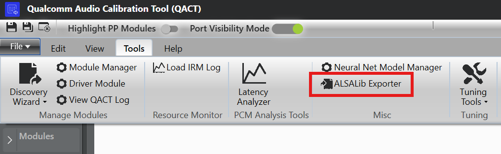
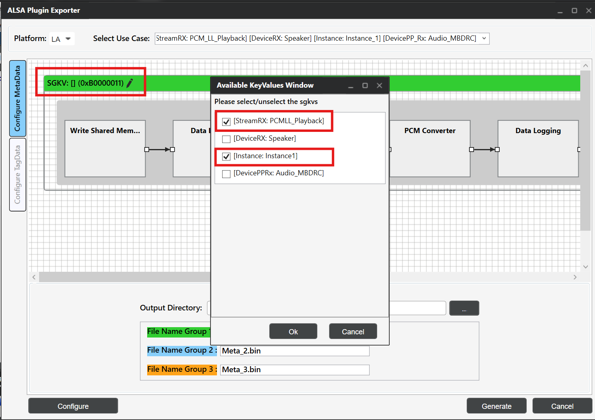
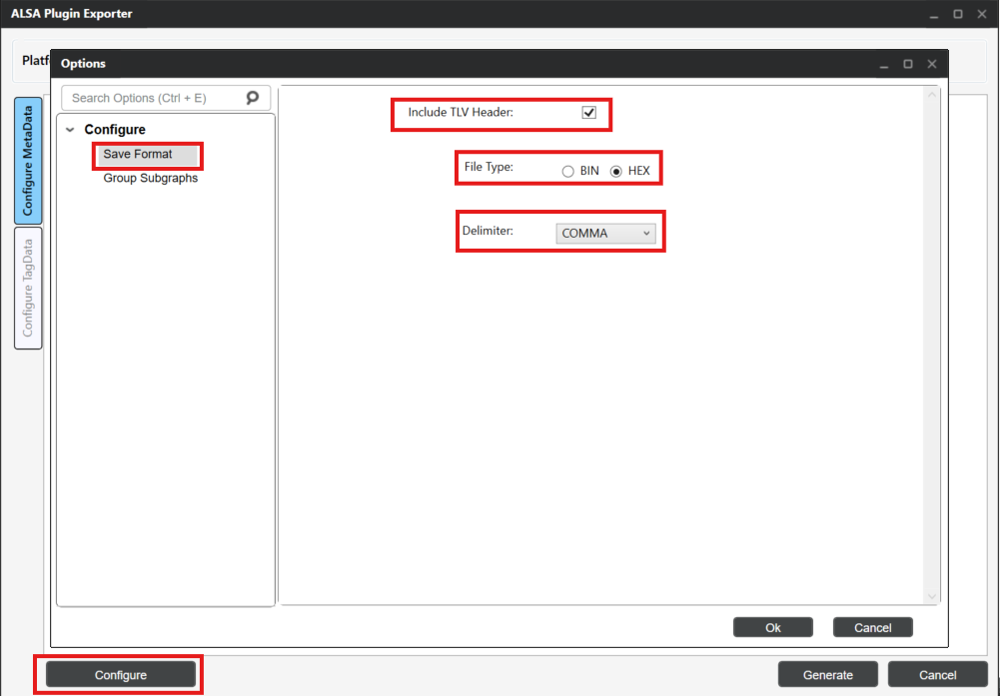
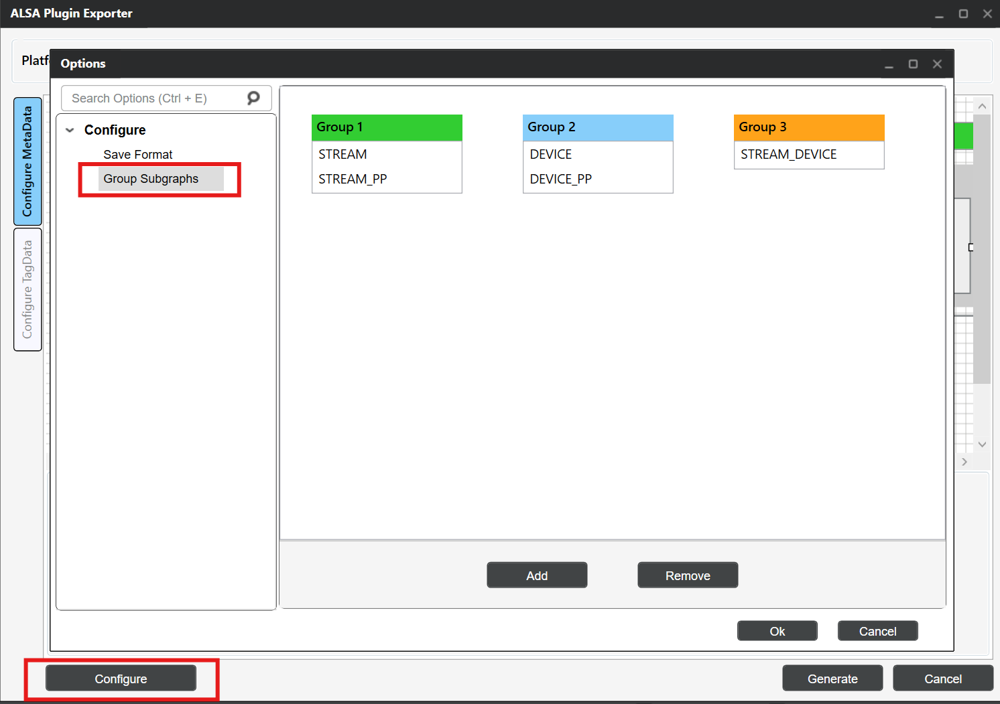
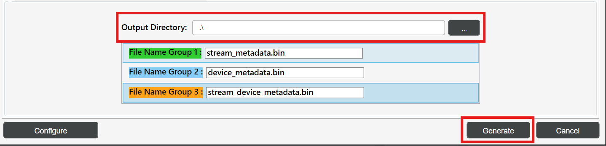

# ALSA lib using AudioReach

- ALSA lib Setup
    - Prerequisites
- Metadata Binary Files Generation using ARC
    - Required Metadata Files
    - Generate Metadata with ARC
- Running Audio Use Cases
    - General Setup
    - Using amixer
    - Using ALSA UCM
- References

This guide provides detailed information on integrating ALSA lib with AudioReach to realize audio use-cases. AudioReach provides a plugin-based architecture built around the AGM (Audio Graph Manager), a user-space service that manages the audio graph. ALSA lib integrates with AudioReach through the AGM plugin, which exposes a standard ALSA PCM and mixer interface to audio applications. The guide covers metadata generation using ARC (AudioReach Creator), ALSA plugin configuration, and examples for running audio use-cases using amixer and ALSA UCM.

## ALSA lib Setup

This section covers the installation and verification of ALSA lib packages required for AudioReach integration. The ALSA lib packages provide the necessary libraries and utilities to interface with AudioReach’s plugin-based architecture.

### Prerequisites

Before setting up for ALSA lib, verify that all AudioReach components are installed on your target platform. Refer to the relevant platform setup guide (for example, [Raspberry Pi 4](../platform/raspberry_pi4.html#raspberry-pi4) for Raspberry Pi 4).

#### ALSA Package Installation

**For Yocto-based builds**, the ALSA lib packages should be included in the Yocto build. Open the file `<yocto_build_root>/build/conf/local.conf` and add the required packages:

```bash
IMAGE_INSTALL:append = " \
alsa-lib \
alsa-utils \
alsa-tools \
alsa-state \
"
```

> **Note**
>
> For non-Yocto environments (e.g., Buildroot, Debian-based distros), install the equivalent packages using the distribution’s package manager or build system.

#### Enabling ALSA lib Plugin in AudioReach Components

The ALSA lib plugin support is disabled by default in the AudioReach build system and must be explicitly enabled in two components: `audioreach-graphmgr` and `audioreach-conf`.

| Project | Flag | Type | Default |
| --- | --- | --- | --- |
| `audioreach-graphmgr` | `--enable-alsalib` | `AC_ARG_ENABLE` | `no` |
| `audioreach-conf` | `--with-libalsa` | `AC_ARG_WITH` | `no` |

**Yocto Build**

Add the following configuration to `<yocto_build_root>/build/conf/local.conf` to enable the flags.

```bash
EXTRA_OECONF:append:pn-audioreach-graphmgr = " --enable-alsalib"
EXTRA_OECONF:append:pn-audioreach-conf = " --with-libalsa"
```

**Autotools Build**

Pass the flags directly to the `configure` script for each component:

```bash
# audioreach-graphmgr
./configure --enable-alsalib

# audioreach-conf
./configure --with-libalsa
```

#### Verify ALSA Installation

Verify the ALSA installation using below commands:

```bash
# List available sound cards
aplay -l

# List available PCM devices
aplay -L

# Check ALSA version
aplay --version
```

## Metadata Binary Files Generation using ARC

ARC is used to generate metadata binary files required for ALSA lib integration. These files define the audio graph topology and calibration data.

### Required Metadata Files

The following metadata binary files are generated for ALSA lib integration:

****Stream Metadata****

Defines audio stream properties such as sample rate, bit depth, and channel configuration.

****Device Metadata****

Contains device-specific information including hardware capabilities and routing information.

****Stream-Device Metadata****

Maps audio streams to specific devices and defines the connection topology.

### Generate Metadata with ARC

Follow these steps to generate metadata files using ARC:

**Step 1: Open ARC (QACT)**

1. Launch QACT on a Windows machine
2. Load the ACDB workspace file from `/etc/acdbdata/` (copied from target device)
  > **Note**
  >
  > The ACDB (Audio Calibration Database) workspace file contains the audio calibration and topology data for the target device. It is pre-installed on the target at `/etc/acdbdata/` as part of the AudioReach platform setup.

**Step 2: ALSA Plugin Exporter**

1. In QACT, navigate to **Tools → ALSA Plugin Exporter**


*QACT Tools Menu - ALSA Plugin Exporter*

1. Click on the **“Configuration MetaData”** tab

**Step 3: Configure Use Case**

1. Select the desired use-case from the dropdown (e.g., **playback**)


*Use Case Selection*

1. Select the appropriate **GKV (Graph Key Vector)** for each subgraph corresponding to the use-case subgraphs. **For example**, if the first subgraph has keys set as PCM_LL_Playback, Instance_1 in use-case, then select the corresponding GKV [StreamRX:PCM_LL_Playback] and [Instance: Instance1] for the subgraph.


*Use Case Subgraphs and GKV Keys*


*Subgraph GKV Selection*

**Step 4: Configure Metadata**

This step involves configuring the metadata format and grouping subgraphs for metadata generation.

**4.1: Configure Metadata Format**

1. Click the **Configure** button at the bottom left
2. Select **“Include TLV header”** option
3. Choose the appropriate file type based on your use-case:
    - **For ALSA UCM configuration**: Select File type as **bin**
    - **For amixer configuration**: Select File type as **Hex** with Delimiter as **“COMMA”**


*Configure Metadata Format*

> **Note**
>
> The TLV (Type-Length-Value) header is required for ALSA lib to properly parse and transfer metadata. For UCM-based configurations, binary files with TLV headers are used with the cset-tlv API. For amixer-based configurations, hex format with comma delimiters allows inline metadata specification.

**Generated Output**

In both cases, ARC generates `.bin` files containing the metadata.

- **UCM (bin format)**: The `.bin` file is used directly by ALSA UCM via the `cset-tlv` API. The binary content is transferred as-is to the AGM plugin.
  ```
  cset-tlv "iface=MIXER,name='PCM_RT_PROXY-RX-2 metadata' /etc/device_metadata.bin"
  ```
- **amixer (hex format)**: The `.bin` file content is exported as a comma-delimited hex string. This hex payload is passed inline to the amixer command.
  ```bash
  amixer -D agm cset iface=MIXER,name='PCM_RT_PROXY-RX-2 metadata' 0x00,0x00,0x00,0x00,0x28,0x00,0x00,0x00,...
  ```

**4.2: Configure Metadata Groups**

Based on the use-case subgraphs, configure the metadata groups by selecting **Group Subgraphs**.

- **Group1** → Stream metadata
- **Group2** → Device metadata
- **Group3** → Stream Device metadata


*Configure Group Subgraphs*

> **Note**
>
> Configure Group Subgraphs based on the selected use-case. For use-cases without stream_device pre/post processing subgraph, only stream and device bins are generated.

**Step 5: Generate Metadata Files**

1. Update the bin file names for each group:
    - Group1: `stream_metadata.bin`
    - Group2: `device_metadata.bin`
    - Group3: `stream_device_metadata.bin`


*Binary Group Naming*

1. Add the output directory path and click **“Generate”** to create the metadata binary files.


*Binary Output Directory Configuration*

**Step 6: Transfer Files to Target**

Copy the generated metadata files to the Target device:

```bash
# Copy metadata files to Target device
scp stream_metadata.bin root@<target_device_ip_address>:/etc/
scp device_metadata.bin root@<target_device_ip_address>:/etc/
scp stream_device_metadata.bin root@<target_device_ip_address>:/etc/
```

> **Note**
>
> Metadata bin files are generated on a per-use-case basis. Each use-case has its own set of metadata files.

## Running Audio Use Cases

This section demonstrates how to run audio use-cases using aplay using amixer and ALSA UCM configurations.

### General Setup

**Prerequisites**

Ensure AudioReach services are running:

```bash
# Start AGM server
agm_server &

# Verify services are running
ps aux | grep agm
```

**Required Files Setup**

Copy the audio files:

```bash
# Copy audio file
scp <clip_name>.wav root@<target_device_ip_address>:/etc/
```

### Using amixer

This section describes how to configure and run audio use-cases using amixer. The AGM plugin exposes mixer controls that allow setting PCM parameters, metadata, and device connections directly from the command line. Before running amixer commands, the AGM ALSA configuration file must be in place so that ALSA can route audio through the AGM plugin.

**AGM ALSA Configuration File**

The `agm.conf` file is the ALSA configuration file that defines the AGM plugin interface. This file is shipped as part of the `audioreach-conf` package and is located at `/etc/alsa/conf.d/` on the target device. It enables ALSA applications to use the AGM plugin for AudioReach integration.

**Configuration Overview**

The AGM configuration file defines:

- **Default PCM Device**: Sets the system-wide default audio device to use AGM
- **Parameterized PCM Device**: Allows applications to specify custom card and device numbers
- **Control Interface**: Provides mixer control access for audio parameter configuration

**Example agm.conf**

```
pcm.!default {
    type agm
    card 100
    device 100
}

pcm.agm {
    @args [ CARD DEV ]
    @args.CARD {
        type integer
        default 100
    }
    @args.DEV {
        type integer
        default 100
    }
    type agm
    card $CARD
    device $DEV
}

ctl.agm {
    type agm
    card 100
}
```

Before running the commands below, list the available mixer controls on the target to identify the correct control names for your configuration:

```bash
amixer -D agm controls
```

**Example output:**

```
numid=1,iface=MIXER,name='PCM100 metadata'
numid=2,iface=MIXER,name='PCM100 setParam'
numid=3,iface=MIXER,name='PCM100 setParamTag'
numid=4,iface=MIXER,name='PCM100 connect'
numid=5,iface=MIXER,name='PCM100 disconnect'
numid=6,iface=MIXER,name='PCM100 control'
numid=26,iface=MIXER,name='PCM_RT_PROXY-RX-2 rate ch fmt'
numid=27,iface=MIXER,name='PCM_RT_PROXY-RX-2 metadata'
...
```

**The PCM device names (e.g., `PCM100`, `PCM_RT_PROXY-RX-2`) and their associated controls**

vary by target configuration. Use the output of this command to substitute the correct names in the examples below.

With the default amixer, metadata payload must be specified directly in the command on the same line as the mixer control. The payload must be in hex format with bytes delimited by commas (e.g., `0x00,0x01,0x02,...`).

```bash
# Set PCM parameters: rate=0xbb80 (48000 Hz), ch=0x2 (stereo), bit_width=0x2 (16-bit), fmt=0x1 (SNDRV_PCM_FORMAT_S16_LE)
amixer -D agm cset iface=MIXER,name='PCM_RT_PROXY-RX-2 rate ch fmt' 0xbb80,0x2,0x2,0x1

# Set PCM control
amixer -D agm cset iface=MIXER,name='PCM100 control' PCM_RT_PROXY-RX-2

# Set device metadata with payload (example payload)
amixer -D agm cset iface=MIXER,name='PCM_RT_PROXY-RX-2 metadata' <Device metadata payload in hex>

# Set stream metadata with payload (example payload)
amixer -D agm cset iface=MIXER,name='PCM100 metadata' <Stream metadata payload in hex>

# Set stream_device metadata with payload (example payload)
amixer -D agm cset iface=MIXER,name='PCM100 metadata' <stream_device metadata payload in hex>

# Connect PCM to device
amixer -D agm cset iface=MIXER,name='PCM100 connect' PCM_RT_PROXY-RX-2
```

**Example: Setting device metadata with hex payload**

```bash
amixer -D agm cset iface=MIXER,name='PCM_RT_PROXY-RX-2 metadata' 0x00,0x00,0x00,0x00,0x28,0x00,0x00,0x00,0x02,0x00,0x00,0x00,0x00,0x00,0x00,0xA2,0x01,0x00,0x00,0xA2,0x00,0x00,0x00,0xAC,0x02,0x00,0x00,0xAC,0x00,0x00,0x00,0x00,0x10,0x00,0x00,0x08,0x02,0x00,0x00,0x00,0x02,0x00,0x00,0x00,0x05,0x00,0x00,0x00
```

Run playback:

```bash
aplay -D agm:100,100 /etc/<clip_name>.wav
```

### Using ALSA UCM

ALSA Use Case Manager (UCM) provides a higher-level interface for managing audio use-cases with AudioReach. UCM uses configuration files to define mixer control commands and automate use-case setup.

#### UCM Configuration Files

ALSA UCM discovers configuration by scanning the `/usr/share/alsa/ucm2/` directory. For physical sound cards it looks in a subdirectory named after the card; for virtual cards it scans `/usr/share/alsa/ucm2/conf.virt.d/`. For AudioReach integration, the AGM virtual sound card configuration is present on the target device in `conf.virt.d/` directory.

**AGM virtual sound card configuration file**

The AGM virtual sound card configuration file (`agmvirtualsndcard.conf`) is shipped as part of the `audioreach-conf` package and is located at `/usr/share/alsa/ucm2/conf.virt.d/` on the target device. It defines the AGM virtual sound card and its associated use-cases, and serves as the entry point for ALSA UCM to manage AudioReach-based audio routing.

Configuration file defines:

- **PCM Device Template**: Reusable PCM device configuration with parameterized card and device numbers
- **Control Device**: Mixer control interface for audio parameter management
- **Use Case Definitions**: References to specific audio scenario configurations (e.g., PCMPlayback, VoiceCall)

**Example agmvirtualsndcard.conf**

```
Syntax 4

LibraryConfig.agm.Config {
    pcm.agm {
        @args [ CARD DEV ]
        @args.CARD {
            type integer
            default 100
        }
        @args.DEV {
            type integer
            default 100
        }
        type agm
        card $CARD
        device $DEV
    }
    ctl.agm {
        type agm
        card 100
    }
}

SectionUseCase."PCMPlayback" {
    File "PCMPlayback.conf"
}
```

**Use Case Configuration File**

The `PCMPlayback.conf` file contains the mixer control commands for setting up playback. ALSA UCM supports sending .bin files for metadata mixer controls using the `cset-tlv` API. This file is located at `/usr/share/alsa/ucm2/conf.virt.d/` on the target device alongside `agmvirtualsndcard.conf`.

**Example PCMPlayback.conf Structure**

The `PCMPlayback.conf` file contain mixer control sequences similar to:

```
Syntax 2

SectionVerb {
    EnableSequence [
        cdev "agm"
        cset "iface=MIXER,name='PCM_RT_PROXY-RX-2 rate ch fmt' 0xbb80,0x2,0x2,0x1"
        cset "iface=MIXER,name='PCM100 control' PCM_RT_PROXY-RX-2"
        cset-tlv "iface=MIXER,name='PCM_RT_PROXY-RX-2 metadata' /etc/device_metadata.bin"
        cset-tlv "iface=MIXER,name='PCM100 metadata' /etc/stream_metadata.bin"
        cset-tlv "iface=MIXER,name='PCM100 metadata' /etc/stream_device_metadata.bin"
        cset "iface=MIXER,name='PCM100 connect' PCM_RT_PROXY-RX-2"
    ]

    DisableSequence [
    ]

    Value {
        PlaybackPCM "agm:100,100"
    }
}

SectionDevice."Speaker" {
    EnableSequence [
    ]

    DisableSequence [
    ]

    Value {
            PlaybackChannels "2"
    }
}
```

#### Running use-case with UCM

**Set-up Use Case**

Use alsaucm to configure the audio use-case:

```bash
# Set up playback use-case using alsaucm
alsaucm -n -b - <<EOM
open agmvirtualsndcard
set _verb PCMPlayback
EOM
```

Where:

- `agmvirtualsndcard` is the virtual sound card configuration file name
- `PCMPlayback` is the use-case Verb in the ALSA UCM, defined in the agmvirtualsndcard.conf

**Run Playback with UCM**

After setting up the use-case, run playback:

```bash
# Play audio file
aplay -D agm:100,100 /etc/<clip_name>.wav
```

## References

**AudioReach**

- [audioreach-graphmgr](https://github.com/Audioreach/audioreach-graphmgr)
- [audioreach-conf](https://github.com/Audioreach/audioreach-conf)
- [AGM ALSA lib plugin](https://github.com/AudioReach/audioreach-graphmgr/tree/master/plugins/alsalib)
- [ARC installation guide](https://audioreach.github.io/sdk_overview.html#steps-to-install-arc)

**ALSA UCM**

- [ALSA Use Case Manager (UCM) — libasound API reference](https://www.alsa-project.org/alsa-doc/alsa-lib/group__ucm.html)
- [ALSA UCM configuration repository](https://github.com/alsa-project/alsa-ucm-conf)

**amixer**

- [amixer man page](https://linux.die.net/man/1/amixer)
