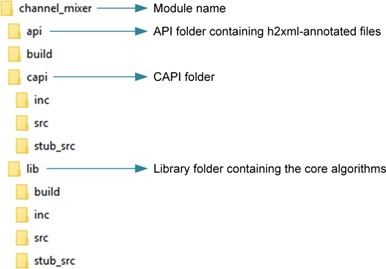
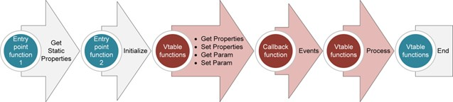
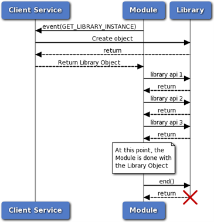
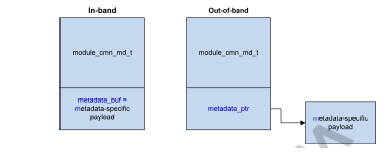
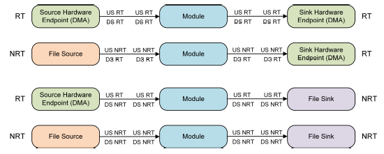

# CAPI Module Development Guide

## Introduction

### Purpose

This document describes Common Audio Processor Interface (CAPI) which is the interface between the AudioReach™ AudioReach Engine (ARE) and the audio signal processing algorithms (such as pre/postprocessing, encoders, and decoders).

## Functional Overview

Audio signal processing can be broadly categorized as follows:

- Audio processing
- Encoder
- Decoder

For example, for audio recording, the mic data is first processed with a high pass filter (HPF) to remove low frequencies such as AC noise, followed by a multi-band filter to compensate for microphone nonlinearities, followed by an Echo Canceller and Noise Suppression (ECNS) algorithm, and so on. The data is finally encoded and stored in a file. Similarly, in audio playback, data from a file or network is decoded, postprocessed using effects/filters, and rendered. Each filter, effect, and ECNS are referred to as *modules*. A series of such modules forms a *graph*. Use the ARC to draw graphs and associate them with high-level use cases. Typically, the core library of such algorithms is developed separately. To run the algorithms in the ARE, a CAPI wrapper is written. CAPI abstracts the algorithms for the framework. A CAPI-wrapped algorithm/functionality is referred to as a *CAPI module* or simply as a module. In the ARE, modules are hosted by *containers*, which provide the execution environment for the modules.

Following is a typical folder structure for a module:


*Typical folder structure for a module*

### Module

A module’s interface includes the following:

- Data ports
    - Input and output ports, where each port can support multiple channels
    - Zero to many input or output ports
    - Along with data, metadata is also transmitted through these ports
- Optional control ports for module-to-module communication
- Interface (CAPI) with the framework (container)
    - Properties, events, and extensions (which in turn contain parameters and events)
- Interface with clients (HLOS or ARC platform)
    - Parameters and events (annotated with h2xml tags)

**NOTE:** The h2xml tags are entered in the interface header file of the module. These tags are used to generate an XML file from the header file for importing the module into the ARC platform. For more information, see the ARC documentation.

In the framework, the containers assume that the entire CAPI module runs in the same thread as the container. If the module uses multithreading, it is the CAPI module’s responsibility to handle synchronization (for example, having set_param() done on the module in the main thread can cause corruption).

The following figure shows the interface view of a module.


*Interface view of a module*

### Types of Modules

- Single input-single output (SISO) modules:
    - Pre/postprocessing (PP) modules – PP algorithms such as filters, equalizers, sample rate converters, echo cancelers, and so on
    - Encoders such as the AAC encoder
    - Decoders such as the AAC decoder
    - Packetizers such as the IEC 61937 packetizer
    - Depacketizers such as the IEC 61937 depacketizer
    - Converters such as the EAC3 format-to-AC3 format converter
- Source modules – Zero data input modules such as DMA source, DTMF generator, and so on.
- Sink modules – Zero data output modules such as DMA sink, DTMF detector, and so on.
- Multiple input-multiple output (MIMO) modules such as the multi-write, multi-reader buffer, or the ECNS algorithm with microphone and playback reference inputs as well as separate EC output and NS output
- Multiple input-single output (MISO) modules such as a mixer, EC with only one output, and so on.
- Single input-multiple output (SIMO) modules such as a splitter

A *single-port module* refers to either a SISO module or a source module with one output or a sink module with one input.

A *multi-port module* refers to all non-single-port modules. The framework assumes no knowledge of routing inside multi-port modules. A two-input (A and B), two-output (C and D) module can have any possible data routing as shown in the following figure. Currently, modules must have at least one input or output port, as illustrated in the following figure.


*Input and output ports for a module*

Sample-based PP modules are PP modules that take N samples and process/return the same number of samples in a process call (for example, filters, equalizers). Fractional resampling modules or rate matching do not belong to this category. Simple PP modules are SISO PP modules. Includes all sample-based and sample rate converters including fractional resampling, rate matchers, and so on. *Simple* does not indicate that the algorithm implemented in the module is trivial. It only means that the framework interaction is simple.

### Life Cycle of a CAPI

The following figure shows the life cycle of a CAPI. Highlighted functions are used during run time. Except initialize and end, all other functions can be called multiple times.


*Life cycle of a CAPI*

CAPI has two static functions:

- capi_get_static_properties_f() – Used to query properties such as memory required by the module, stack size, required extensions, and so on.
- capi_init_f() – Called to initialize the instance of the module.

CAPI has the following dynamic functions handled through virtual function tables (vtables):

- capi_vtbl_t::process()
- capi_vtbl_t::end()
- capi_vtbl_t::set_param()
- capi_vtbl_t::get_param()
- capi_vtbl_t::set_properties()
- capi_vtbl_t::get_properties()

The vtable get_properties(), set_properties(), get_param(), set_param(), and process() functions are used multiple times during the module’s life. The capi_get_static_properties_f() function can be called multiple times. The capi_init_f() and end() functions are called only once. CAPI can also raise events using the callback function provided by framework during capi_init_f().

Following is an example of the life cycle of a CAPI.

1. The framework queries for memory required by the module by using capi_get_static_properties_f() with the CAPI_INIT_MEMORY_REQUIREMENT property ID.
2. The framework queries other static properties such as:
    - Stack size (CAPI_STACK_SIZE)
    - In-place processing capability (CAPI_IS_INPLACE)
    - Data buffering requirement (CAPI_REQUIRES_DATA_BUFFERING)
    - Supported interface extensions (CAPI_INTERFACE_EXTENSIONS)
    - Required framework extensions (CAPI_NUM_NEEDED_FRAMEWORK_EXTENSIONS, CAPI_NEEDED_FRAMEWORK_EXTENSIONS)
    - Supported interface extensions (CAPI_INTERFACE_EXTENSIONS)
  More properties will be added in future.
  Queries can be performed for one or multiple properties at the time depending on framework implementation. Typically, one property is queried when the framework needs to know the return error code per property.
3. The framework allocates memory and calls capi_init_f() on the CAPI.
    - Now other properties are passed, such as the event callback function (CAPI_EVENT_CALLBACK_INFO , the heap ID to be used for any runtime memory allocations (CAPI_HEAP_ID), and so on. The same set of properties are also passed in capi_get_static_properties_f().
    - CAPI returns the vtable.
4. More setting and getting of properties and events can happen after capi_init_f() until the end of CAPI:
    - Framework and interface extension-related properties.
    - The capi_vtbl_t::set_properties() call for media format CAPI_INPUT_MEDIA_FORMAT_V2. A module can raise an output media format event if the output media format changes (CAPI_EVENT_OUTPUT_MEDIA_FORMAT_UPDATED_V2).
    - Buffering-related properties such as CAPI_PORT_DATA_THRESHOLD or CAPI_EVENT_PORT_DATA_THRESHOLD_CHANGE.
    - Events such as KPPS (CAPI_EVENT_KPPS), bandwidth (CAPI_EVENT_BANDWIDTH), algorithmic delay (CAPI_EVENT_ALGORITHMIC_DELAY), process state (CAPI_EVENT_PROCESS_STATE), and so on.
5. The capi_vtbl_t::set_param() and capi_vtbl_t::get_param() functions can also be called at any time after capi_init_f() until capi_vtbl_t::end().
6. The capi_vtbl_t::process() function is called at runtime to process data.
7. Finally, the capi_vtbl_t::end() function is called to destroy the CAPI module.

The following table describes the differences between properties and parameters.

| **Property** | **Parameter** |
| --- | --- |
| Defined by the core CAPI interface | Defined by the modules or CAPI framework and interface extensions |
| Applicable to all modules | Applicable only to the modules that define the parameter or support the extension |
| Defines framework-module interaction | Typically, calibration- and configuration-related |
| Module developers cannot add properties | Module developers can add parameters |
| Following functions are used: capi_get_static_properties_f(), capi_vtbl_t::get_properties(), capi_vtbl_t::set_properties() | Following functions are used: capi_vtbl_t::get_param() and capi_vtbl_t::set_param() |

### Entry Point Functions

The CAPI entry point functions are capi_get_static_properties_f() and capi_init_f().

The capi_init_f() function takes in a list of properties that can be used for initialization of the module. The framework can use this list to set the properties whose values are known during initialization, and the module can use these properties to optimize its initialization sequence. For example, the module can use the properties to determine the size of some internal memory allocations, preventing the need for freeing and reallocating the memory later.

The capi_get_static_properties_f() function also takes in a list of capi_init_f() properties. The framework sends exactly the same properties as those being sent for the capi_init_f() function. Thus, the module can correctly calculate the object size that it returns.

Returning any error from capi_init_f() indicates that the module was not initialized. Therefore, a return should only be done if the module cannot proceed because of an error. The module should return CAPI_EOK if an unsupported property is set during capi_init_f(). If the module returns an error from capi_init_f(), it must ensure that all cleanup is performed because capi_vtbl_t::end() will not be called. Any static property can also be queried in capi_vtbl_t::get_properties(). Modules must use common implementation for both get_properties and capi_get_static_properties_f(). Static properties cannot rely on the instance memory of the CAPI.

### Error Codes

The error codes returned by CAPI functions are interpreted as bit fields. Multiple bits can be set at one time to indicate various errors. The CAPI_SET_ERROR helper macro can be used to set a bit in the error code, and the CAPI_IS_ERROR_CODE_SET helper macro can be used to check if a particular bit is set in the error code.

#### Errors While Setting and Getting Properties

Functions that use the capi_proplist_t structure can be used to set or get multiple property values at one time. Errors that occur when setting or getting a property from the list must be handled in the following way:

- If the property is not supported by the module, the CAPI_EUNSUPPORTED flag must be set in the error code and the actual_data_len field for that property must be set to zero.
- The rest of the properties must still be processed (rather than exiting when an unsupported property is encountered).

### Extensions

CAPI provides a mechanism for extending the functionality of the interface. The additional functionality is provided via framework and interface extensions.

These extensions are typically defined using header files that are included both by the module and the framework. Each extension is identified with a globally unique identifier (GUID). The header file then describes the behavior of the framework and module that use the extensions. Any set parameter IDs, payloads, properties, events, constant definitions, and function declarations required for an extension are also present in the header file.

#### Framework Extensions

The framework uses capi_get_static_properties_f() to query a module for the list of extensions that the framework requires.

If the framework supports these extensions, it can create the module and proceed. If not, the framework must send an error. Thus, framework extensions are not optional.

#### Interface Extensions

The framework uses capi_get_static_properties_f() to send a list of interface extensions that it supports to the module. The module can then set flags to indicate the interface extensions it is to use from this list.

If an interface extension is required by the module to operate, it can send an error at this point. The framework then inspects the list of interface extensions chosen by the module and, if it is acceptable, creates the module. Thus, interface extensions are optional.

An optional structure can be included with each interface extension to negotiate more fine-grained support. The structure must be defined in the interface extension header file.

#### Differences Between Framework and Interface Extensions

| **Framework extension** | **Interface extension** |
| --- | --- |
| Defines a behavior that the module requires the framework to support. | Can define a behavior for the framework, module, or both. |
| If a module requires a framework extension, it cannot operate if the framework does not support the framework extension. | Support can be negotiated between the framework and the module. After negotiation, the framework and module can determine if an acceptable configuration is possible. |
| A framework extension is either supported by the framework or not; there is no way to indicate partial support. | An optional structure can be used to negotiate more fine-grained capabilities. |

### Other Requirements

- All functions must be re-entrant. This means that multiple instances of the library are able to run simultaneously without any conflict. All states are stored in the instance structure that is passed as the first argument to all functions.
- The pointer to the vtable of CAPI is required to be the first element in a CAPI structure.
- We recommend size checks in get and set parameters, and NULL checks for stream data and buffers in process functions.

## Module Integration

### Workflow

Below figure illustrates the module integration workflow. Module ID and parameter IDs must use GUIDs. Each customer is allotted a range from which to choose these IDs.


*Module integration workflow*

Refer to [README](https://github.com/Audioreach/audioreach-engine?tab=readme-ov-file#adding-new-module) for more details.

### Naming Convention for Entry Point Functions

You must define functions that follow the signature of the capi_get_static_properties_f() and capi_init_f() definitions. Use these functions as entry point functions to create an instance of the module using following naming convention:

- Your capi_get_static_properties_f() function variant must be named as follows: *<*tag*>*_get_static_properties_f(), where *<*tag*>* can be any string as long as the function name remains a valid C function name.
- Your capi_init_f() function variant must be named as follows: *<*tag*>*_init, where *<*tag*>* must be the same string that is used as the tag in the name of the capi_get_static_properties_f() function variant.

An example of a valid *<*tag*>* is volume_control. With this tag, the function names are volume_control_get_static_properties_f() and volume_control_init().

The *<*tag*>* used for naming the entry point functions is used to register the module with the Audio Module Data Base (AMDB) in the ARE.

## Functional Description

### Media Format

The ARE handles a wide variety of media including fixed point PCM data, raw compressed data (such as AAC bit stream), and so on. For PCM data, additional attributes such as sampling rate and number channels are encapsulated in the media format.

- Media format contains:
    - Data format – Fixed point, packetized (such as IEC61937), raw-compressed
    - For PCM or packetized data – Sample rate, channels, channel map, bit width, and so on
    - Format ID for all data formats – Identifies whether data is PCM, AAC, MP3, and so on
- ARE has no knowledge of the output format of the module. Modules must implement the query (capi_vtbl_t::get_properties()) and event.
- Typically, before a capi_vtbl_t::process() call is made, the ARE sets the valid input media format, and the module must have raised the output media format (if not queried by the ARE).
- CAPI_INPUT_MEDIA_FORMAT_V2 – Used by the ARE to set the media format on an input data port. Data sent in a capi_vtbl_t::process() call follows this media format. The ARE never uses this media format for capi_vtbl_t::get_properties(). Modules must ensure that the media format they receive is supported (for example, some modules may not support 24-bit data or fractional sample rates).
- CAPI_OUTPUT_MEDIA_FORMAT_V2 – Used by the ARE to query the media format on an output data port. Data output by the module in the capi_vtbl_t::process() call follows this media format. It is never used for capi_vtbl_t::set_properties. The ARE provides the buffers in a process() call per the media format the module outputs.
- CAPI_EVENT_OUTPUT_MEDIA_FORMAT_UPDATED_V2 – Used by a module to raise a media format event on an output data port.

We recommend using the v2 media format properties and events. The difference between v1 and v2 is that v1 supports a maximum of only 16 channels, whereas v2 supports an unlimited number of channels.

The following table provides a summary of which functions are used for media formats.

| **Media format** | **get_property()** | **set_property()** | **Event** |
| --- | --- | --- | --- |
| Input | No | Yes | No |
| Output | Yes | No | Yes |

Typically, single-port modules are not informed of new connections because they do not implement INTF_EXTN_DATA_PORT_OPERATION. The module is assumed to raise the media format, and then the port is disconnected and reconnected. The module has no knowledge of this. However, because port memories are recreated in the ARE, previous media format information is lost. To know the media format, the containers can query the media format from the modules. Therefore, in the ARE, it is important to support both queries and events for media formats.

#### Fixed Point

A bits_per_sample field determines the word size (capi_standard_data_format_t and capi_standard_data_format_v2_t).

Although bits_per_sample determines the word size, the actual sample might be of equal or smaller width, which is determined by the bit width. The bit width can be inferred from the Q factor. If the Q factor is Q27, it stands for 24-bit data in 32-bit word.

However, to explicitly know the bit width, the PCM framework extension (FWK_EXTN_PCM_PARAM_ID_MEDIA_FORMAT_EXTN) must be used.

##### Interleaving

In interleaved and deinterleaved packed cases, the capi_vtbl_t::process() call contains only one buffer per stream. In the deinterleaved unpacked case, the process() call contains one buffer per channel per stream. The following figure illustrates PCM interleaving and deinterleaving.


*Interleaving and de-interleaving for PCM*

##### Channel Map or Channel Type

During playback, audio channels are routed to different speakers. Each speaker has a designated location (for example, left, right, center, and LFE). When different channels are processed and routed in software, the speaker must identify the data to which a channel is routed. Similarly, in the multichannel recording use case, mic data can contain noise reference vs. primary signal.

Each channel has a channel type or map associated with it. With this concept, there is no need to have a fixed order of channels in a buffer. For example, the left channel is not required to be at first position and the right channel at the second position. It is sufficient to denote each position by channel type.

For example, some decoders might provide output in this order: L, R, LFE, C, Ls, Rs. Others might provide output in this order: L, R, C, LFE, Ls, Rs (C and LFE are reversed). If LFE is to be processed with different filter coefficients, tuning a parameter on such a filter will indicate the coefficient for each channel or a group of channels.

Currently defined channel types mainly indicate speaker names. For the mic path or for more speaker names, use custom channel maps (like PCM_CUSTOM_CHANNEL_MAP_1). The system designer can assign meaning based on product requirement.

#### Floating Point

The CAPI_FLOATING_POINT data format is used for floating point data.

#### Raw Compressed

The CAPI_RAW_COMPRESSED data format is used for encoded data (for example, input of a decoder or output of an encoder).

#### Packetized Formats

CAPI supports various packetized formats such as IEC 61397, IEC 60958 nonlinear, DSD DOP, compressed-over-PCM (COP), and generic compressed. These formats also follow capi_standard_data_format_t or capi_standard_data_format_v2_t because the data looks like fixed point.

#### Deinterleaved Raw Compressed

The CAPI_DEINTERLEAVED_RAW_COMPRESSED data format is used to send different channels of encoded data in separate buffers if required, e.g. left channel on one buffer and right on another. This helps downstream modules handle left and right channels separately.

### Buffering

Buffering is dictated through CAPI_REQUIRES_DATA_BUFFERING, CAPI_PORT_DATA_THRESHOLD, and CAPI_EVENT_PORT_DATA_THRESHOLD_CHANGE. A threshold is basically the buffer size in bytes per data port. Examples:

- A module that can process any amount of data should return threshold as 1 byte.
- A fixed frame size module with 10 ms frame duration. At 48K, 2 channels, 2 bits per sample: 10 ∗ 48 ∗ 2 ∗ 2 = 1920 bytes threshold.
- A fixed frame size module with 1024 sample frame width. At 48K, 2 channels, 2 bits per sample: 1024 ∗ 2 ∗ 2 = 4096 bytes threshold.
- A decoder with a maximum input frame size of 8192 bytes.

Both input and output ports can have their own thresholds. For example:

- Encoder input can be 2048 bytes and output can be 256 bytes.
- A fixed frame size module with a 10 ms threshold at the input media format (48K, 2 channels, 2 bits per sample) and output media format (48K, 6 channels, 2 bits per sample) has an input threshold of 1920 and an output threshold of 11520 bytes.

Different ports of a multiport module can have their own thresholds. For example:

- An EC module with 5 ms frame duration can have 16K, 2 channels, 2 bits per sample mic data and 48K, 2 channels, 2 bits per sample playback reference. Thus, the first input has a threshold of 320 bytes and the second input has a threshold of 960 bytes.

Typically, the worst-case frame size for decoders is the input and output threshold. Unless data is processed, decoders cannot know the required size and, to read data, a buffer is required. A greater than 1 threshold can ensure that minimum samples (bytes) are present in the input, and minimize the empty space available in the output when capi_vtbl_t::process() is called (depending on the CAPI_REQUIRES_DATA_BUFFERING flag).

| **Requires data buffering** | **Port threshold** | **Typical modules** | **Framework behavior** |
| --- | --- | --- | --- |
| FALSE | 1 | Sample-based PP modules (N sample input produces N sample output) | For PCM, the ARE ensures that when any input is provided, the output has sufficient space for that many samples of output. |
| FALSE | > 1 | Encoders and fixed frame size modules (EC that may have fixed frame size such as 10 ms) | For PCM, assuming N is the input threshold and M is the output threshold, the ARE ensures that when a module process is called, N samples are present in the input, and M sample amount of space is available in the output. |
| TRUE | 1 | Resamplers (fractional), rate matching, buffering modules | The ARE can call the process function with any amount of input. However, there are extensions available that can optimize the calls. |
| TRUE | > 1 | Decoders, packetizers, depacketizers, and possibly encoders | The ARE can call the process function with any amount of input. |

When the CAPI_REQUIRES_DATA_BUFFERING flag is FALSE, the same buffer can be reused for multiple modules because no partial data will be left in those buffers after calling capi_vtbl_t::process() on the module. Setting the CAPI_REQUIRES_DATA_BUFFERING flag involves an extra cost, so only use it when absolutely necessary.

#### Non-buffered Data Flow Model

In the non-buffered data flow model, the CAPI_REQUIRES_DATA_BUFFERING flag is set to FALSE. The non-buffered data flow model is as follows:

- The framework must ensure that it provides the same number of samples on every input port of the module. For compressed data, the same number of bytes must be provided on every input port.
- The number of output samples provided on every output port of the module must be the same as the number of input samples. For compressed data, the number of bytes on every port must be the same as the number of input bytes. The framework code must ensure that there is enough space in the output buffer.
- The module must be able to handle any number of input samples (or input bytes in the case of compressed data).

This model incurs low overhead, so use it whenever possible. You can also use this model for modules that perform processing in fixed blocks of data (frames).

#### Buffered Data Flow Model

In the buffered data flow model, the CAPI_REQUIRES_DATA_BUFFERING flag is set to TRUE. The buffered data flow model is as follows:

- The module must define a threshold in terms of the number of bytes for every input and output port.

This threshold for any port may be queried by the framework at any time using the CAPI_PORT_DATA_THRESHOLD property. If the threshold changes, the module must raise the CAPI_EVENT_PORT_DATA_THRESHOLD_CHANGE event for each port on which the threshold changed.

- For input ports, the threshold indicates the minimum amount of data needed to guarantee that processing can be done. For example, consider an input buffer with 100 bytes of data and a threshold of 25 bytes.
    - If the module consumes more than 75 bytes, the amount of remaining data in the input buffer will be less than its threshold.
    - When this occurs, the module can stop further processing and return from capi_vtbl_t::process().

It is possible for the module to perform processing with a lesser amount of data. For example, if the module performs decoding of compressed data, this value is the worst-case compressed frame size. The module can to perform decoding with lesser data if the actual compressed frame size is smaller. In this case, it can continue processing.

- For output ports, the threshold indicates the minimum amount of free space required to guarantee that processing can be done.

For example, consider an output buffer with a maximum size of 100 bytes and a threshold of 25 bytes. If the module produces more than 75 bytes of data, the remaining free space in the output buffer will be less than the threshold. When this happens, the module can stop further processing and return from the capi_vtbl_t::process().

- The framework can provide input and output buffers of any size when calling capi_vtbl_t::process().
- When the capi_vtbl_t::process() call returns:
    - The module must have consumed enough data so the amount of valid data remaining in at least one input port is less than the threshold for that port.
    - OR, the module must have produced enough data so the amount of free space remaining in at least one output port is less than the threshold for that port.

Following are examples of thresholds that can be provided:

- Decoders:
    - Input threshold = the worst-case compressed frame size
    - Output threshold = the size of one uncompressed frame
- Encoders:
    - Input threshold = the size of one uncompressed frame
    - Output threshold = the worst-case compressed frame size
- Sample rate converter that can work on an arbitrary number of samples:
    - Input threshold = 1
    - Output threshold = 1

This model incurs high overhead, so use it only when necessary.

### Debugging

For debugging purposes, two properties are added in the ARE:

**CAPI_MODULE_INSTANCE_ID** Each module in a graph has a unique instance ID. This module instance ID is assigned by the ARC platform and is provided to the modules through this property at or immediately after capi_init_f(). The module ID is also provided here, although module ID-based logic should not be introduced.

**CAPI_LOGGING_INFO** Contains the log ID and a mask. The log ID is unique to the module instance, and it contains bits for identifying the container where the module runs. We recommend that modules print debug messages with the log ID. The mask identifies the 6 bits left for the module (this might change in the future; hence, the mask provided must be used). When EOS or some other discontinuity occurs, modules might increment these 6 bits. If a module does file logging with the log ID as the file name suffix, every discontinuity will generate a new file.


*Bit mask for the log ID*

### Data Ports

There are different types of data ports:

- Labeled ports or static data ports – The module declares the port IDs. For example, an EC module can label ports as mic input (*near end* in a voice call) and playback reference input (*far end* in a voice call).
- Dynamic ports – The ARC platform assigns the port IDs externally. For example, a mixer can support multiple inputs.

The following limits apply to the number of ports:

- Module implementation might limit the maximum number of ports it can support, or it might support an infinite number of ports.
- When a module is placed in a graph, and depending on the maximum number of concurrencies, there is a maximum number of ports.
- Depending on actual active concurrencies, there is a specific number of ports.

The maximum number of ports possible in a given instance of a module is communicated through CAPI_PORT_NUM_INFO, which is useful for memory allocations. If a module can work with or without output ports, i.e., it can act as a module with output ports or as a sink, then the module must inform this to the framework when queried with property ID CAPI_MIN_PORT_NUM_INFO . By default, the framework assumes the minimum number of output ports is 1. The same applies for modules that can work both with or without input ports (can act as source).

#### Port Indices and Port IDs

CAPI relies on port indices. For example, a capi_vtbl_t::process() call uses arrays of stream data that are indexed by the port index. For multi-port modules, port IDs are used in graph diagrams in the ARC platform. Although an index is sufficient for most modules, the index-port ID mapping might be important in some cases. For example, a parameter that includes a port ID might be exposed to the clients. The INTF_EXTN_DATA_PORT_OPERATION interface extension can be used for getting port ID-to-index mapping, and also to know when ports are opened, closed, started, or stopped. For more details, see Data Port Operation. Port indices are assigned by the framework. The maximum value of a port index is less than the number in CAPI_PORT_NUM_INFO.

### Get and Set Parameters

A module must define IDs and payload structures for all the parameters it supports. H2xml annotation is also required.

#### Alignment, Packing, and Get Parameter Requirements

Some module parameter payloads have substructures and variable length arrays. For example: struct_a { int num; struct_b arr[0]} Where arr is of length num. If the size of struct_b is not aligned to 4 bytes and it has a 4-byte element, some processors will crash due to misalignment. For this reason, the ARC platform ensures that all substructures are padded for 4-byte alignment so that arrays of such structures, or alignment of another substructure following a structure, are not broken. What about 8-byte alignment? In the above example, 8-byte alignment might also be required, but it is not supported. Eight-byte numbers must be split into two 4-byte numbers. For packing requirements, the module payloads can be manually packed to the correct alignment (at least 4-byte). The ARC platform always ensures packing, but manual packing helps with parsing inside the modules. For example: struct {int8 a; int8 b;} Must be manually padded as: struct {int8 a; int8 b; int8 reserved1; int8 reserved2}

#### Get Parameter Requirements

When a client of the ARE calls the APM_CMD_GET_CFG API, it is translated into the capi_vtbl_t::get_param() function on CAPI modules. The client does not know how much memory a parameter requires when the parameter is of variable size.

The h2xmlp_maxSize annotation can be used for annotating parameter size requirements for capi_vtbl_t::get_param().

The modules must implement the following: if the provided size is not sufficient, the module must return the CAPI_ENEEDMORE error and update the actual length with the required size (including the memory required for alignment, if any).

#### Property for Persistent Parameters

Typically, when a set_param() is issued, the module copies the payload. However, when a parameter’s payload (calibration) is huge, copying data is not preferred. A module can define certain parameters as persistent (via the h2xml tags in the header file) and, when the set_param() is issued, the module can store the pointer to the blob. Before such a set_param() is done, a capi_vtbl_t::set_properties() is done to indicate that the module must copy the pointer. If the module does not expect the parameter to be persistent or vice versa, an error might be thrown or the appropriate handling might be implemented. For details, see CAPI_PARAM_PERSISTENCE_INFO.

Older modules are to return CAPI_EUNSUPPORTED for unsupported properties; such errors are ignored. This ensures backward compatibility.

### Events

A mechanism is provided for the module to notify the framework of events that occur. Events are identified by predefined event IDs. The interface also describes the payload corresponding to each event ID. The module provides the following information to the framework when the callback function is called:

- An opaque state token that is provided by the framework when the module is created.
- The event ID.
- The port number associated with this event (optional).
- A buffer containing the payload associated with this event. The module must allocate the buffer, and it can free the buffer after the callback function returns.

All event IDs and their payloads are described in file [capi_events.h](../api/spf_capi.html#capi-events-h).

Following is a typical call flow for raising events to the framework.


*Typical call flow for raising events*

In the diagram, two events are raised in a call to capi_vtbl_t::process(). The framework takes the appropriate action within the callback function. **NOTE** The module can raise an event in any of the CAPI calls from capi_vtbl_t: init(), get_properties(), set_properties(), get_param(), set_param(), process(), and end().

#### Thread Safety

The callback function implementation is not thread safe. If the module uses separate threads internally for processing, it can only call the function within a function call made by the framework. The following call flow diagram illustrates this point.


*Thread safety call flow*

In the diagram, Module 1 uses a background thread to process data. If this thread is to raise an event, it cannot call the callback function of the framework directly. The framework thread might be in the middle of doing some other processing at that time, so this would corrupt its data. The correct approach in this case is for the background thread to internally store this event as a pending event (the data structure used here must be thread safe). When the framework calls capi_vtbl_t::process() (or any other function), the module can query this data structure from the context of the framework thread and then raise any pending events.

#### Raise Events to ARE Clients

CAPI provides a special event (CAPI_EVENT_DATA_TO_DSP_CLIENT or CAPI_EVENT_DATA_TO_DSP_CLIENT_V2) that can be used to send data to the client processor of the ARE. The module must raise this event when it is to send data and provide the following information:

- Parameter ID – Indicates the type of the payload. The values of the parameter IDs and the corresponding payloads are defined by the module developer, and the destination service on the ARE client processor must understand them.
- Token – Identifier that can be used to provide additional instance-related information. The destination service should be able to interpret this token.
- Payload – The payload that is to be sent.

CAPI events to the ARE client are supported using CAPI_REGISTER_EVENT_DATA_TO_DSP_CLIENT and CAPI_EVENT_DATA_TO_DSP_CLIENT. However, with this method, the framework must take care of the event information.

To remove this overhead and make event handling more transparent, use the following events instead:

- CAPI_REGISTER_EVENT_DATA_TO_DSP_CLIENT_V2 and CAPI_EVENT_DATA_TO_DSP_CLIENT_V2 are introduced
- CAPI_REGISTER_EVENT_DATA_TO_DSP_CLIENT_V2 takes the destination address, token, and any event configuration

The differences provided by v2 of these events are:

- Modules must manage the client address.
- The client can register with different configurations for the same event. For example, one client can register with one set of watermark levels compared to another.

In both versions, multiple clients per event is possible.

#### Common Events

| **Event** | **Description** |
| --- | --- |
| Algorithmic delay | Group delay of a filter, for example, is reported as algorithmic delay. |
| KPPS/BW | Million instruction per second (MIPS) is a standard term used for algorithm complexity. In Hexagon processor terminology, because a packet of instructions (containing at most 4 instructions) can be executed in one cycle (ideal cache), kilo packets per second (KPPS) is typically used. Bandwidth represents the amount of bus traffic the module generates. |
| Output media format | See section Media Format |
| Process state | Describes whether the module is enabled or disabled. A module might want to disable itself based on a UI setting (such as equalizer disable), calibration, or other condition. When a module is disabled, it is removed from processing. For single-port modules, the framework bypasses the module and the rest of the graph can still run. Disabling a multiport module might render an entire graph unusable (depending on the shape of the graph). |

### Process Call

The capi_vtbl_t::process() call is the most important function because it is repeatedly called for signal and data processing: capi_err_t (*process)(capi_t* _pif, capi_stream_data_v2_t* input[], capi_stream_data_v2_t* output[]); There are two stream data versions (v1 and v2); the difference is that v2 supports metadata. To access v2, cast the capi_stream_data_v2_t pointers to capi_stream_data_v2_t pointers for stream_data_version == 1 (in capi_stream_flags_t).

**NOTES:**

- There might be holes (NULL pointers) in the capi_stream_data_v2_t array for inactive (closed) ports.
- The process() function might be called with NULL input buffers (input[i] == NULL || input[ i].buf_ptr == NULL || input[i].buf_ptr[j].data_ptr == NULL) or buffers with actual_len = 0.
  This is useful if any internal memory of the CAPI module is to be given out without any new input. Modules must make the necessary NULL checks before accessing pointers.
- If a call to process() results in an event, the output buffer must not be filled in some cases. Check the event definition to see which events belong to this category.

#### Stream Data

For each port, stream data contains the following:

- Flags – timestamp validity, end-of-frame (EOF), end-of-stream (EOS), erasure, stream data version
- Timestamp
- Buffers:
    - Only one buffer for interleaved and deinterleaved packed data
    - Multiple buffers for deinterleaved unpacked data

In stream data version 1, a doubly linked list of metadata per port is present.

#### Timestamp Propagation

For SISO modules, the framework assigns an output timestamp and flags (in capi_stream_data_v2_t) before calling capi_vtbl_t::process().

For SISO modules, the framework assigns the output timestamp and flags before calling process() as follows: output timestamp = input timestamp - algorithmic delay, where algorithmic delay is reported by the module using CAPI_EVENT_ALGORITHMIC_DELAY.

If a module is to change this behavior, it must assign the appropriate value for the timestamp in the output capi_stream_data_v2_t.

For multiport modules, the association of output to input is not known to the framework. The module is responsible for routing capi_stream_data_v2_t correctly.

#### Return CAPI_ENEEDMORE in a Process Call

If the input data is not sufficient for processing a frame (in fixed frame modules), a CAPI module must check and return CAPI_ENEEDMORE.

If the EOF is set (see section EOF Handling), the module must try to process the frame with whatever it has or drop the data.

#### EOF Handling

An EOF is set by the framework when it is to force process a frame (that is, the module must process the frame with whatever data it has or drop the data).

For example, when processing in 5 ms frames, suppose 2 ms of data is left. It is possible to wait for 3 ms more data, but a media format might be received indicating that subsequent data is of a different media format. The old 2 ms and 3 ms cannot be concatenated and sent in one buffer due to the media format change. The framework sets the EOF and asks the module to process the 2 ms of data, if possible. The module can then process the 2 ms data or drop it.

**NOTE:** Do not pad 3 ms of data because it will increase the signal length and hence cause a subsequent delay in draining the data.

For another example, some decoders might wait for the next frame’s synchronization word before processing given data. To force a module to decode existing data without waiting for subsequent data, the EOF is set.

When the EOS flag is set, an EOF is also set because force-processing is implicitly required.

Timestamp discontinuities also cause an EOF to be set because two buffers with discontinuous timestamps might not be concatenated.

A module that propagates metadata must also handle an EOF by itself. Typically, an EOF is propagated when the module cannot produce any more outputs with the given input. It is preferable to output EOF at the same time as the last batch of output is sent instead of waiting for one more process call.

#### EOS Handling

An EOS is indicated through the marker_eos flag (capi_stream_flags_t)and also through MODULE_CMN_MD_ID_EOS in capi_stream_data_v2_t::metadata_list_ptr (CAPI_STREAM_V2*>*=1). A module that handles metadata must also propagate an EOS.

An EOS indicates that the stream is ending:

- Flushing – Any memory in the algorithms must be flushed
- Non-flushing – Any memory in the algorithms must not be flushed and the EOS must suffer the delay.

For example, consider two streams being mixed into one speaker. The stream-side processing must be flushed when an EOS flows so that any data left inside the algorithms can be sent out. But, when the EOS flows through the mixer, it changes to non-flushing. If it is to remain flushing, the rendered data will have gaps in the second stream’s audio as well. By keeping the EOS as non-flushing, it still flows in the path until the speaker sends a notification about EOS rendering. At this point, the application can close stream one.

An EOS sent by the ARE client is called an *external EOS*. An EOS generated by the framework for certain cases is called an *internal EOS*.

- An internal EOS is used to indicate the data flow state due to an upstream data flow stop (for example, upstream data flow of a mixer stops, the EOS is sent by the upstream data flow, and the mixer can stop waiting on that stream).
- An external EOS also indicates a data flow stop. An external EOS results in an event to the ARE client when it reaches a sink endpoint (or when it is dropped).

For more details about data flow states, see Data Flow States.

#### Erasure Handling

Erasure is set when input is not available. This can happen when a certain amount of data is expected at a certain time but, due to delays in the upstream, data was not available on time. Erasure tells the module about the absence of data. Some modules, such as decoders, can trigger packet loss concealment. Some other modules can trigger ramp down on buffered data to smooth out under-run. Most modules may not use this flag but, if they propagate metadata, then they must propagate this flag as well.

#### Metadata Propagation

Metadata including EOS propagation is performed using the INTF_EXTN_METADATA extension.

#### Raise Events in Process Context

When the following events are to be raised in a capi_vtbl_t::process() context, modules must not output data:

- CAPI_EVENT_OUTPUT_MEDIA_FORMAT_UPDATED or CAPI_EVENT_OUTPUT_MEDIA_FORMAT_UPDATED_V2
- CAPI_EVENT_PROCESS_STATE
- CAPI_EVENT_PORT_DATA_THRESHOLD_CHANGE

For example, if a process() call causes the media format to change and it outputs data, there might be some data in the old media format and some data in the new media format. It will take at most three process calls to handle this case:

- In the first process() call, output the data in the old media format.
- In the second call, raise the new media format.

The framework handles the media format event (resizes the buffers, if necessary) and calls the module back to see if it can output some data.

- In the third call, output the data in the new media format.

### Key Framework Extensions

#### Signal Triggered Module

The FWK_EXTN_STM framework extension is useful for modules that are triggered based on an interrupt (DMA) or timer. Only one such module can be present in a container. A signal, which can be set on a timer or interrupt, is given to the module. The entire graph is executed when this trigger occurs. Thus, the whole container is designated as signal- or timer-triggered.

#### Trigger Policy

The trigger policy framework extension (FWK_EXTN_TRIGGER_POLICY) is used to determine when to call a module based on triggers available at the module’s ports:

- For input ports — Containing data is a trigger
- For output ports — Containing an empty buffer is a trigger

For example, a module can be called when input or output is available, or it can be called only when both input and output are available.

A module that buffers data internally can use a trigger policy. Initially, it might block output and listen only to input. When the buffer threshold is reached, the module might set the trigger policy as input OR output. After the buffer is drained, it might set the policy as both input AND output.

For more details, see Trigger Policy.

### Key Interface Extensions

#### Data Port Operation

The data port operation interface (INTF_EXTN_DATA_PORT_OPERATION) allows modules to know when a port is opened, started, stopped, or closed. It also provides port ID-to-index mapping.

#### Inter-module Control Link (IMCL)

Inter-module communication in ARE is based on the concept of control links. The graph designer connects control ports of the modules while designing the graph.

Modules must implement INTF_EXTN_IMCL extension and also annotate the h2xml tags of the module with control ports. The modules must also define and implement the messages for communication between the modules.

IMCL allows the following:

- In-band communication within containers, across containers, and across processors.
- Messages can be sent in any direction. The module instance ID and control port IDs are used.
- No HLOS or framework is required to set up IMCL; it is set up in the ARC platform.
- Recurring or one-time communication; triggerable or non-triggerable.

For example, a keyword-detected notification can be sent to the buffering module so it can open the gate.

#### Metadata

The metadata extension (INTF_EXTN_METADATA) is used to send a metadata message in the data path in sync with the data. It only flows downstream. Modules can inject, delete, and propagate metadata. For metadata to be handled properly, modules must accurately report algorithmic delays. Garbage collection is handled in the framework.

There are different types of metadata, including sample-associated and buffer-associated metadata. For example:

- EOS
- Encoded frame’s PCM duration
- Accurate path delay measurement, which is possible by marking data with metadata (see Path Delay).
- DTMF generation parameters

#### Port Property Propagation

Some modules use the following interface extensions to propagate two port properties:

- INTF_EXTN_PROP_IS_RT_PORT_PROPERTY – Propagate the is_rt port property: real time or non-real time (intf_extn_param_id_is_rt_port_property_t)
- INTF_EXTN_PROP_PORT_DS_STATE – Propagate the downstream port state: stopped, prepared started (intf_extn_param_id_port_ds_state_t)

For details, see Port Property Propagation.

### Supporting Libraries

**NOTE:** Supporting CAPI libraries are deprecated in the ARE.

Supporting libraries for CAPI modules are provided as header files that define the library interfaces as virtual function tables. To use a library, the module must get an object that implements that library interface. Each interface has a GUID associated with it.

#### Query for a Library

A module can get an instance of a library by raising the CAPI_EVENT_GET_LIBRARY_INSTANCE. The framework returns an object that implements this interface. When the module is finished using this object, it calls the capi_library_base_t::end() function of the object to destroy it. Following is a typical call flow for getting an instance of a library.


*Library instance call flow*

#### Standard Functions in Libraries

All CAPI supporting library interfaces have the capi_library_base_t::get_interface_id() function as the first function and the capi_library_base_t::end() function as the second function. These functions can be called without knowledge of the rest of the interface.

- get_interface_id() – Returns the GUID of the interface implemented by the object.

This function can be used to identify the interface of the object without knowing its type.

- end() – Destroys the object. After this function is called, the object pointer is no longer valid.

### Data Flow States

A module such as a mixer might need to decide whether to wait for certain input. If the upstream data flow of a mixer is stopped or if the stream sends an EOS, there is no need to wait for that input. This case is handled through data flow states. There are two states:

- Data is Flowing
- Data Flow is at Gap (DFG)

Initially, all ports are at DFG. When the capi_vtbl_t::process() function is called with data on the port, it moves to the Data is Flowing state. When an internal EOS, external EOS, or explicit MODULE_CMN_MD_ID_DFG is received on the port, the data flow state switches to DFG. Most modules are not required to consider the data flow state in their implementation; the framework takes care of it. Multi-port modules might need to consider the state in their implementation.

## Data Port Operation

The Data Port Operation interface extension (INTF_EXTN_DATA_PORT_OPERATION) defines port operations (open, start, stop, close). Most simple PP modules might not be required to implement this extension. Modules such as EC, buffering modules, mixer, splitter, and so on might be required to implement it.

### Open

The open operation (INTF_EXTN_DATA_PORT_OPEN) communicates the port ID-to-index mapping that the modules might want to cache for future use. When a new data connection is made to a module, a data port is opened. This operation is set for ports that were opened immediately when the module was created as well as for any ports that are opened after module creation.

### Start

The start operation (INTF_EXTN_DATA_PORT_START) indicates that the framework started providing buffers on the given ports. On an input port, the start operation indicates that the subgraph containing the module and the upstream operations of the module on this port are all started. On an output port, the start operation indicates that the subgraph containing the module and the downstream operations of the module on this port are all started.

### Stop

The start operation (INTF_EXTN_DATA_PORT_STOP) indicates that the framework stopped providing buffers on the stopped port. On an input port, the stop operation indicates that the subgraph containing the module is stopped. Upstream stop is indicated through metadata (EOS), not through port operation. The metadata method helps to drain data instead of dropping it at once. On an output port, the stop operation indicates that the subgraph containing the module or any downstream operations of the module on this port are stopped.

### Close

The close operation (INTF_EXTN_DATA_PORT_CLOSE) is issued when a module is closing or when the connection to an input or output port is removed. If a stop was not issued before this close, a stop is also issued before the close. When an input port in the data flowing state is closed, modules that handle metadata must insert an internal EOS on all corresponding outputs. This tells downstream operations about the upstream gap. Open ports are not required to be closed for symmetry. For example, INTF_EXTN_DATA_PORT_OPEN need not be completed by INTF_EXTN_DATA_PORT_CLOSE. When the input port of a metadata handling module (which implements INTF_EXTN_METADATA) is closed, and if the data flow state of the port is not already at-gap, an internal EOS might be required to be inserted at this input port and eventually propagated to corresponding outputs. This internal EOS serves as a way to indicate upstream data flow gap. The framework takes care of this for modules that do not handle metadata.

### Data Flow State vs Port State

| **Port state** | **Data flow state** |
| --- | --- |
| Related to the data port operations: closed, opened, started, stopped, suspended. | States are: Data is Flowing and Data Flow is at Gap (DFG). |
| Directly related to the port operations. | State change is due to data arrival at a port, or EOS or DFG metadata departure from a port. |
| State change is due to an ARE client sending a subgraph management command on the self or downstream peers. | State change is due to any gap in the data flow. For example: an ARE client sends a subgraph management command on the self or upstream peers; or an EOS either comes from the client or is due to an upstream pause. |

## Intermodule Control Link (IMCL)

The INTF_EXTN_IMCL interface extension allows two modules to talk to each other. Any module that requires a control link must implement INTF_EXTN_IMCL. The framework can use this information to perform control port ID-based link handling, buffer management, queue management, and so on. IMCL is bidirectional and point-to-point.

### Intents

Although IMCL provides the pipe for communication, it does not design the parameters or protocol to be used between the modules. It is up to the modules to determine the information they want to exchange with each other. A control link can support multiple intents. An intent is an abstract concept that groups a set of interactions between two modules. Module developers can define their own intents. Intent IDs are GUIDs. For example, a timer drift intent defines the APIs required for some modules to query drifts from other modules. The protocols (when, what API is called, and so on) are completely defined within the intent. As long as the connection exists, the modules can talk to each other.

### Types of Ports

Static control ports are labeled and have fixed meaning. They support only a fixed list of intents defined in the h2xmlm_ctrlStaticPort tag. Other ports are defined through h2xmlm_ctrlDynamicPortIntent, where intents and the maximum number of possible usages of that intent are provided. Graph designers assign the appropriate intents to the links in the ARC GUI.

### Control Link Port Operations

Like data port operations, control port operations are associated with connections being created, connected, disconnected, or closed. For more information, see Intermodule Control Link (IMCL).

### Types of Messages

#### One Time vs. Repeating

Repeating messages use a queue to create a pool of buffers up front.

#### Triggerable or Polling

Most messages are required to be read only once per frame. Such messages are handled through polling. Occasionally, messages might be sent when data processing is not occurring. For such scenarios, triggerable messages are suitable. For every message, a flag can be set to help route messages appropriately.

### Typical Operation

1. Create control ports with INTF_EXTN_IMCL_PORT_OPEN, where the number of ports and required intents are mentioned.
2. The module creates the memory for the control ports after any validations.
3. After the peer is connected, the module does the following:
    1. Sends messages by first getting recurring buffers (INTF_EXTN_EVENT_ID_IMCL_GET_RECURRING_BUF) or one-time buffers (INTF_EXTN_EVENT_ID_IMCL_GET_ONE_TIME_BUF).
    2. Uses INTF_EXTN_EVENT_ID_IMCL_OUTGOING_DATA to send messages to the peer.
    3. Uses INTF_EXTN_PARAM_ID_IMCL_INCOMING_DATA to receive parameters from the peer.
4. The framework issues INTF_EXTN_IMCL_PORT_PEER_DISCONNECTED to indicate that the peer is disconnected.
5. When INTF_EXTN_IMCL_PORT_CLOSE is issued to the module, memory can be freed. All the intents cease to exist.

## Metadata

Metadata is information about the data in a buffer. The Metadata interface extension (INTF_EXTN_METADATA) must be implemented by modules that are required to inject, modify, use, or propagate metadata:

- All multi-port modules
- All buffering modules
- Any single-port modules

The framework does not help to propagate metadata for modules that implement this extension. A module implementing this extension is responsible for all metadata, not just metadata the module might be interested in. It is responsible for propagating metadata from input to output, including all flags in capi_stream_flags_t (end_of_frame, timestamp, EOS, and so on). After a capi_init_f() call, a vtable and context pointer are passed to the module that is implementing this extension. The vtable includes callback functions that help in common metadata operations. Metadata transfer is performed using doubly linked lists (module_cmn_md_list_t). Single-port modules that implement this extension must ensure that they send or destroy all the internally held metadata when they disable themselves. Sink modules that implement this extension must destroy all metadata after the metadata goes through internal algorithm delays. For most SISO modules, the framework’s default implementation should be sufficient. A SISO module implementing this extension must clear the internally held metadata before moving to the Disable Process state. When such a module is disabled, the framework propagates the metadata.

### Common Metadata Interfaces

The module_cmn_metadata.h header file defines the common metadata structures. All metadata must use the module_cmn_md_t structure. It contains a metadata ID (GUID), flags, size, offset, and either in-band or out-band data for the actual metadata.

#### Flags

Metadata flags are defined in module_cmn_md_flags_t.

##### Out-of-band

The following figure illustrates in-band and out-of-band flags.


*In-band and out-of-band flags*

- For in-band, module_cmn_md_t and the metadata-specific payload are in one contiguous memory buffer).
- For out-of-band, metadata-specific memory is elsewhere and module_cmn_md_t has a pointer to it.

Metadata-specific memory cannot contain any pointers.

##### Buffer Association

Metadata can be sample- or buffer-associated (via module_cmn_md_flags_t).

- Sample-associated metadata always sticks to the same position in the signal, even when the signal is processed by an algorithm with delay. Thus, when the signal is processed by a module, the offset is adjusted by algorithmic delay.

Sample-associated metadata suffers both algorithmic and buffering delay.

Example: EOS is sample-associated because EOS cannot be propagated ahead of the last sample. The following diagram shows metadata propagation for sample-associated metadata.


- Buffer-associated metadata does not suffer algorithmic delay, but it does suffer from any buffering delay. Buffering delay is typically zero for simple PP modules.

Some modules might have internal data buffered, which might be used to delay some metadata. In the absence of a buffering delay, even when a signal suffers delay, metadata comes out quicker.

For example, a DFG is buffer-associated metadata because it must propagate even if data is delayed by an algorithmic delay.

#### Offset

An offset in module_cmn_md_t indicates the position in the data buffer from or at which metadata is applicable. For example, when a stream gain metadata is applicable from the 50th sample onwards, the offset is 50.

#### Lists

Metadata transfers are done using doubly linked lists (via module_cmn_md_list_t).

### EOS Metadata

#### Flags

##### Flushing EOS

Flushing EOS causes all stream data to be rendered, as shown in the following figure. To send all the signals to the output, zeroes worth of algorithmic delay are pushed through the module: zeroes worth = zero samples equal to the amount of algorithmic delay.


*Stream data rendered due to flushing EOS*

When data follows the external EOS, the EOS stops it from being flushed. The incoming data itself can send data. Hence, a flushing EOS is converted to non-flushing if there is any data follows the EOS.

##### Internal EOS

Internal EOS is used to indicate data flow stoppage due to upstream stops or flushes. If any data follows the internal EOS, the internal EOS is not useful and can be dropped.

#### EOS Payload

The modules that propagate metadata must keep module_cmn_md_eos_t intact.

### DFG Metadata

DFG metadata indicates that the upstream data flow has a data flow gap (possibly due to a stream pause operation).

### Virtual Function Table

After initialization, a virtual function table (vtable) and context pointer (both in intf_extn_param_id_metadata_handler_t) are passed to the module that is implementing this extension. The vtable includes callback functions that help in common metadata operations: create, clone, destroy, propagate, and modify at DFG.

## Trigger Policy

The Trigger Policy framework extension (FWK_EXTN_TRIGGER_POLICY) determines when the capi_vtbl_t::process() function is called for a module. Most modules are called when all input ports have data and output ports have buffers (the default policy of the framework). Input data and output buffers are defined as follows:

- Data buffer, or data, refers to a buffer that has some data. In the context of a process() call, input ports have data.
- Empty buffer, or buffer, refers to a buffer that is ready to accept data. In the context of a process() call, output ports have a buffer.

For multiport and buffering modules, complex triggers are possible (for example, when process() is called because input data is available, or because an output buffer is available).

### Types of Triggers

Containers are triggered in two ways:

- Data or buffer trigger – If a container thread is awakened by data or a buffer, the current trigger for processing is called a *data trigger*.
- Signal trigger – Certain containers can have signal-triggered (timer-triggered) modules. If a container is awakened by a signal, the current trigger is called a *signal trigger*.

The policy used to call the module is based on the current trigger. If the current trigger is based on signals, the signal trigger policy is used; otherwise, the data trigger policy is used.

**NOTE** A trigger policy is only one of the conditions for calling modules. Other conditions for calling the modules (such as meeting a threshold or if ports are started) must also be satisfied independently.

A module can leave either or both policies as NULL. In this case, the default policy is used, which means all ports are mandatory:

- All input ports get input data
- All output ports get a buffer when the timer trigger causes a graph to be processed.

If input data is not present, an underrun (underflow) occurs (erasure flag is set). If output is not present, an overrun (overflow) occurs.

A signal trigger policy is not useful if there is no signal trigger module in the container. Only under special conditions is a module required to implement a signal trigger policy: when the module is used in a signal-triggered container and the default policy does not work. Typically, the default policy works for most modules, for example, a SISO module might behave as a source during calibration time.

If a module requires a data trigger policy in a signal-triggered container, the module must explicitly enable the policy through FWK_EXTN_EVENT_ID_DATA_TRIGGER_IN_ST_CNTR. Data triggers are handled in the middle of signal triggers.

The schema for defining a trigger policy is the same for both signal triggers and data triggers, but the actual callbacks are different.

### Triggerable Ports

The trigger policy is described in two levels, ports and group of ports.

**NOTE** A port in a triggerable group can belong to multiple groups.

#### Mandatory Policy

For the mandatory policy (FWK_EXTN_PORT_TRIGGER_POLICY_MANDATORY), ports in each group are ANDed. That is, all ports in the group must satisfy the trigger condition (present or absent).

Multiple groups are ORed. That is, a module process() is called as long as at least one group has a trigger. Using the ports/groups and present/absent notion, any Boolean expression can be satisfied. For example:

- The module process() might be called when either of the inputs (a or b) and output (c) are present: ac + bc, where ac forms the first group, and bc forms the second group.
- The module process() might be called in an XOR condition of inputs a^b = (!a)b + a(!b), where (!a) indicates the absence of input a.
- The module process() might be called when either inputs (a, b) or output (c) is present. There are three groups: a+b+c.

#### Optional Policy

For the optional policy (FWK_EXTN_PORT_TRIGGER_POLICY_OPTIONAL), ports in each group are ORed and multiple groups are ANDed. For example, (a+c)(b+c). Thus, the module process() is called for a module when a timer trigger occurs OR all ports in at least one group have a trigger.

The framework calls capi_vtbl_t::process() if any one of the OR conditions is satisfied. In this case, the module also must check which OR condition is actually satisfied before processing. For example, if the module asks for the (abc + def) trigger policy, when process() is called, the module must check that either abc or def is satisfied.

### Non-triggerable Ports and Blocked Ports

Apart from groups, there are optional non-triggerable ports and blocked ports. Both non-triggerable and blocked ports belong to a non-triggerable group that is ignored when the framework determines whether to call capi_vtbl_t::process() on a module.

**NOTE** A port cannot belong to both triggerable and non-triggerable groups.

#### Non-triggerable Ports

Optional non-triggerable ports never trigger a capi_vtbl_t::process() call. However, if a module is triggered due to other ports, and if these ports also have a trigger at that time, the ports carry the data and output.

#### Blocked Ports

An input or output port must not be given when calling capi_vtbl_t::process() on the module, even though buffer or data might be present.

**NOTE** Blocked ports do not apply for timer (signal) triggers.

### Default Trigger Policy

The default data or buffer trigger policy for all modules is *All ports must have triggers*. This policy is the same as having all groups in one group.

Upon an algorithm reset, port reset, or other resets, the trigger policy is not reset. Also, for module enable and disable operations, modules must explicitly issue a callback.

In a group, if a port is mandatory but it is stopped, the module will not get a call unless the stopped port is removed from the group.

## Port Property Propagation

Certain modules must propagate two port properties:

- Real-time flag
- Downstream state

Typically, multi-port modules must propagate these properties if the framework default does not work for the module.

### Real-time Flag

The INTF_EXTN_PROP_IS_RT_PORT_PROPERTY interface extension allows propagation of port properties across modules in real time or non-real time. An event from a module indicates that the upstream port is in either real time or non-real time.

When a module implements this interface extension, the framework does not automatically propagate the port property, even for SISO modules.

#### For Input Ports

A capi_vtbl_t::set_param() call indicates that the upstream port is in either real time or non-real time. An event from a module indicates that the downstream port is in either real time or non-real time.

The following figure shows upstream (US) and downstream (DS) real-time (RT)/non-real-time (NRT) values. Practical graphs can have branches, which means propagation might not be straightforward.


*Upstream and downstream values in real time or non-real time*

#### For Output Ports

A capi_vtbl_t::set_param() call indicates that the downstream port is in either real time or non-real time. An event from the module indicates that the upstream port is either real time or non-real time.

#### Usage Examples

- Modules such as multi-port modules might need to propagate this flag because the container is not aware of routing from input to output.

Also, the container is not aware of the trigger policy of the module (see Interaction Between Port Properties and Trigger Policy).

- A module that changes from real time to non-real time (such as a buffering module or a timer-triggered module) must also implement this flag.

For example, introducing a buffering module in an otherwise real-time path changes the real-time flag to FALSE. Introducing a timer-driven module in a non-real-time path changes the flag to TRUE.

#### Framework Default Settings

- Initially, all ports are non-real time.
- If a started input port of a module is marked as real time upstream (through propagation), all the output ports should be marked as real time upstream. Otherwise, they are marked as non-real time.
- If a started output port of a module is marked as real time downstream (through propagation), all the input ports should be marked as real time downstream. Otherwise, they are marked as non-real time.

### Downstream State

The INTF_EXTN_PROP_PORT_DS_STATE interface extension is used to propagate the downstream state of a port across modules. The downstream state is different from the port’s own state. The framework first propagates the downstream state and then applies the downgraded state on the port. State propagation is only from downstream to upstream. A container sets the state on the output port. A module can then propagate this state to the connected input ports (connected from that output port only for which a set parameter was done). When an event is raised from a module, it is raised on the input port, and it can be raised only in the INTF_EXTN_PARAM_ID_PORT_DS_STATE context. A port’s downstream state can only be Prepare, Start, Suspend, or Stop. This state is different from the port state itself. For example, you can propagate a Stop state and the port itself might be stopped.

#### Multi-port Modules

All multi-port modules must implement the downstream state because a container does not know the routing inside the module (unless the framework default works for the module). Unlike the real-time flag, which depends on trigger policy grouping or ports being marked as non-triggerable, the port state depends only on the connection inside the module. For example, consider a splitter that outputs data on two ports. If one of the output paths is stopped somewhere, ideally, the other path should not be affected. In this case, the stopped downstream state is propagated backwards, which indicates to the splitter that it no longer needs to wait for buffers to become available on the corresponding output port. For modules that implement the CAPI_MIN_PORT_NUM_INFO property and set minimum_output_port to zero, refer to the CAPI_MIN_PORT_NUM_INFO property documentation.

#### Framework Default Settings

The framework default assumes that all the inputs are connected to all the outputs.

- If all the output ports of a module are in the Stop state, propagate this state backwards on all the input ports.
- If an output port of a module is in the Start state, propagate this state on all the input ports.
- If an output port of a module is in the Prepare state and none of the output ports is in the Start state, propagate the Prepare state to all input ports.

The downstream state is handled through this INTF_EXTN_PROP_PORT_DS_STATE extension, but the modules are notified of the upstream state through an internal EOS, which indicates that data flow is stopped. Availability of the data indicates that data flow started. Data flow state propagation is discussed in section Data Flow States.

### Interaction Between Port Properties and Trigger Policy

At a multi-port module, there is an interaction between trigger policy, port state, and real-time flag.

- The port state is an independent variable. It can dictate changes in trigger policy and real-time flags.
- The trigger policy and real-time flags are interdependent.

For example, one input port of a mixer is real time and another port is non-real time. A reasonable trigger policy is to wait for the real-time input port before processing. When that port has data and because real-time data cannot wait, the mixer performs processing even if other input ports and the output port do not have data. If the real-time input port is stopped (data flow stop), the mixer must wait for both input and output ports before processing, and the output port will be non-real time.

Similarly, when one output port of a splitter is real-time and other ports are non-real time, the input port can consider downstream data as real time. However, if the real-time port is stopped, the input port must consider the downstream data as non-real time. Like the mixer, trigger policies can also change.

If a module implements the trigger policy extension (FWK_EXTN_TRIGGER_POLICY), it must also implement this INTF_EXTN_PROP_IS_RT_PORT_PROPERTY extension to propagate the real-time/non-real-time port property. This requirement is because the way ports are grouped can change the real-time nature on other side. In the following figure, ab and d are one group, and c and e are another group. Processing triggers when (abd + ce) is TRUE. If a has real-time upstream data, the d is real-time upstream, but e is not because it depends only on c.


*Example of port property propagation*

## Frame Duration and Threshold-related Extensions

### Threshold Configuration

In the ARE, every module belongs to a subgraph. The subgraph is characterized by a performance mode that helps to achieve power vs. latency tradeoffs. Certain modules might need to know the duration that corresponds to the performance mode. The FWK_EXTN_THRESHOLD_CONFIGURATION extension helps to achieve these tradeoffs.

During initialization, a module is notified (via a set parameter) about the threshold configuration, which is the duration that corresponds to the performance mode. Based on the media format, the module can raise a threshold event after the set parameter. For example, a module that wants to run a timer can use this extension to configure the timer.

### Container Frame Duration

A container hosts modules that can have different thresholds. The container aggregates all the thresholds to arrive at a composite frame duration, typically the least common multiple (LCM). For example, if a module is required to determine the container frame duration in order to decide a buffer length, it can implement the FWK_EXTN_CONTAINER_FRAME_DURATION extension. A set parameter is issued whenever the container frame duration changes.

The module must not raise a threshold event in response to this set parameter because container frame duration is typically a byproduct of a threshold event. Raising a threshold event in response can trigger an infinite loop.

### Container Processing Duration

Typically, a container takes as much processing time as the container frame duration itself (the worst case). However, if clock voting is bumped up, the processing duration decreases by a factor. A module can use the FWK_EXTN_CONTAINER_PROC_DURATION extension to obtain the container processing duration through a set parameter.

## Data Duration Modifying Modules and Container Handling

### DM Modules

Duration Modifying (DM) modules are modules which can change the duration of data from input to output by a small amount while processing a frame.

For example, a module that corrects clock jitter may drop one sample from input or may add an extra sample at output. Similarly, a module that converts data from one sample rate to another sample rate may not be able to generate the exact duration of output data which it consumes from input.

### DM handling in ARE

In the ARE, containers need to handle such modules carefully to avoid any unnecessary buffering within the topology. If there is a threshold module connected at the output of the DM module, then the framework must ensure that the fixed amount of output (which is the same as the threshold of the connected module) is generated from the DM module. Similarly, if the threshold module is connected at the input of the DM module, then the framework must ensure that the DM module consumes all the data provided by the input (from threshold module) to avoid any buffering in topology. Therefore, based on the topology and the positioning of threshold/STM/MIMO modules, DM modules should either work in Fixed-Input mode where they consume all input data provided by the framework and can generate a variable amount of output or work in Fixed-Output mode where they generate fixed amount of output samples requested by the container and can consume a variable amount of input data. Along with the mode of operation (Fixed-In or Fixed-Out) the module should also report the maximum buffer size requirement on the variable path so the container can size the topo buffers correctly. Since DM modules will either consume input at a variable rate or generate output at a variable rate the framework may need to add prebuffering (buffers with zero prefill) in the variable path so upstream or downstream is not impacted by the variable rate of operation. DM modules are required to use FWK_EXTN_DM . This ensures the framework sizes the topo buffers correctly, configures the mode of operation (fixed-in or fixed-out) properly, and sends the prebuffer. Mode of operation is set to the DM module via FWK_EXTN_DM_PARAM_ID_CHANGE_MODE . To ensure that the output/input buffer is allocated with sufficient size, framework sets the maximum amount of input/output data which can be given/requested at a time to/from the DM module via FWK_EXTN_DM_PARAM_ID_SET_MAX_SAMPLES and then the DM module should inform about the maximum amount of output/input data which it may generate or consume via FWK_EXTN_DM_EVENT_ID_REPORT_MAX_SAMPLES .

### Special handling for Fixed-Output mode of operation

Based on the current internal buffering, the amount of data which a Fixed-Output DM module should generate may vary from process to process. The goal is to reduce or avoid internal buffering of the data. If there is already some data stuck between a Fixed-Output DM module and a threshold module, then the framework can try to request less than container-frame-size amount of output data from the DM module. This requires the framework to set the expected amount of output data before every process to the DM module which is done via FWK_EXTN_DM_PARAM_ID_SET_SAMPLES . In turn, the DM module must inform the amount of input data it needs to generate the expected amount of output data, this is done by the DM module via FWK_EXTN_DM_EVENT_ID_REPORT_SAMPLES.

## Typical Recommendations

- Encoder input is expected to receive interleaved fixed-point data in Q15 format (for 16-bit data) and Q31 format (for 24-bit or 32-bit data). Thus, a driver can control all encoders in a uniform way.
- Pre/postprocessing modules are expected to operate on deinterleaved unpacked data in Q15 or Q27 format, which aids interoperability with other PP modules.
- Decoders are expected to implement the PARAM_ID_PCM_OUTPUT_FORMAT_CFG parameter to output PCM data in a specified format.
- If multiple versions of an operation code (opcode) are present, use the latest version (highest version number). An opcode version indicates that functionalities or features have been added to the main operation performed by that opcode.

A version is identified by a suffix, such as _V2. For example:

- Use CAPI_EVENT_OUTPUT_MEDIA_FORMAT_UPDATED_V2 instead of CAPI_EVENT_OUTPUT_MEDIA_FORMAT_UPDATED.
- Use capi_stream_data_v2_t instead of capi_stream_data_t.

## Optimization

Some features of CAPI useful for MIPS and memory optimization are:

- Use “inplace” processing when possible. Inplace can be statically set using CAPI properties ( CAPI_IS_INPLACE ) or dynamically changed using CAPI_EVENT_DYNAMIC_INPLACE_CHANGE . When a module is “inplace”, the input and output buffers can be the same. This reduces memory requirements and extra copies.
- CAPI_IS_ELEMENTARY is a property that can be used to recognize “elementary” modules such as data-logging or gain. Elementary modules are handled differently by the framework which helps reduce MIPS.
- In general, modules with zero port-threshold and requires-data-buffering set as FALSE are better from MIPS and memory perspectives. Modules that require the framework to do buffering (that is CAPI property CAPI_REQUIRES_DATA_BUFFERING = True) usually take higher MIPS overhead (e.g., decoders, rate matching modules, fractional resampling cases).

## CAPI Interfaces

### Virtual Function Table

#### Data Structure Documentation

#### struct capi_vtbl_t

Function table for plain C implementations of CAPI-compliant objects.

Objects must have a pointer to a function table as the first element in their instance structure. This structure is the function table type for all such objects.

**Data Fields**

- capi_err_t(∗ process )(capi_t ∗_pif, capi_stream_data_t ∗input[ ], capi_stream_data_t ∗output[ ])
- capi_err_t(∗ end )(capi_t ∗_pif)
- capi_err_t(∗ set_param )(capi_t ∗_pif, uint32_t param_id, const capi_port_info_t ∗port_info_ptr, capi_buf_t ∗params_ptr)
- capi_err_t(∗ get_param )(capi_t ∗_pif, uint32_t param_id, const capi_port_info_t ∗port_info_ptr, capi_buf_t ∗params_ptr)
- capi_err_t(∗ set_properties )(capi_t ∗_pif, capi_proplist_t ∗proplist_ptr)
- capi_err_t(∗ get_properties )(capi_t ∗_pif, capi_proplist_t ∗proplist_ptr)

#### struct capi_t

Plain C interface wrapper for the virtual function table, capi_vtbl_t. This capi_t structure appears to the caller as a virtual function table. The virtual function table in the instance structure is followed by other structure elements, but those are invisible to the users of the CAPI object. This capi_t structure is all that is publicly visible.

| **Type** | **Parameter** | **Description** |
| --- | --- | --- |
| const capi_vtbl_t ∗ | vtbl_ptr | Pointer to the virtual function table. |

### process()

#### Variable Documentation

#### capi_err_t(∗ capi_vtbl_t::process)(capi_t ∗_pif, capi_stream_data_t ∗input[ ], capi_stream_data_t ∗output[ ])

Generic function that processes input data on all input ports and provides output on all output ports.

**Associated data types**

capi_t capi_stream_data_t

**Parameters**

| in,out | *_pif* | Pointer to the module object. |
| --- | --- | --- |
| in,out | *input* | Array of pointers to the input data for each input port. The length of the array is the number of input ports. The client sets the number of input ports using the CAPI_PORT_NUM_INFO property. The function must modify the actual_data_len field to indicate how many bytes were consumed. Depending on stream_data_version (in capi_stream_flags_t), the actual structure can be a version of capi_stream_data_t (like capi_stream_data_t or capi_stream_data_v2_t). Some elements of input[] can be NULL. This occurs when there is mismatch between CAPI_PORT_NUM_INFO and the currently active ports. NULL elements must be ignored. |
| out | *output* | Array of pointers to the output data for each output port. The client sets the number of output ports using the CAPI_PORT_NUM_INFO property. The function sets the actual_data_len field to indicate how many bytes were generated. Depending on stream_data_version (in capi_stream_flags_t), the actual structure can be a version of capi_stream_data_t (like capi_stream_data_t or capi_stream_data_v2_t). For single input/single output modules, the framework typically assigns the output flags, timestamp, and metadata with input flags, timestamp, and metadata before calling process. Metadata is only available in capi_stream_data_v2_t and later. If the module has delay, it must reset the output capi_stream_data_t (or capi_stream_data_v2_t) and set it back after the delay is over. Some elements of output[] can be NULL. This occurs when there is mismatch between CAPI_PORT_NUM_INFO and the currently active ports. NULL elements must be ignored. |

**Detailed description**

On each call to capi_vtbl_t::process(), the behavior of the module depends on the value it returned for the CAPI_REQUIRES_DATA_BUFFERING property. For a description of the behavior, see the comments for CAPI_REQUIRES_DATA_BUFFERING.

No debug messages are allowed in this function.

Modules must make a NULL check for the following and use them only if they are not NULL:

- input
- output
- capi_buf_t in capi_stream_data_t
- data buffer in capi_buf_t

For some events that result from a capi_vtbl_t::process() call, the output buffer must not be filled. Check the event definition for this restriction.

**Returns**

CAPI_EOK – Success

Error code – Failure (see Error Codes)

**Dependencies**

A valid input media type must have been set on each input port using the CAPI_INPUT_MEDIA_FORMAT property.

### end()

#### Variable Documentation

#### capi_err_t(∗ capi_vtbl_t::end)(capi_t ∗_pif)

Frees any memory allocated by the module.

**Associated data types**

capi_t

**Parameters**

| in,out | *_pif* | Pointer to the module object. |
| --- | --- | --- |

**NOTE** After calling this function, _pif is no longer a valid CAPI object. Do not call any CAPI functions after using it.

**Returns**

CAPI_EOK – Success

Error code – Failure (see Error Codes)

**Dependencies**

None.

### set_param()

#### Variable Documentation

#### capi_err_t(∗ capi_vtbl_t::set_param)(capi_t ∗_pif, uint32_t param_id, const capi_port_info_t ∗port_info_ptr, capi_buf_t ∗params_ptr)

Sets a parameter value based on a unique parameter ID.

**Associated data types** capi_t capi_port_info_t capi_buf_t

**Parameters**

| in,out | *_pif* | Pointer to the module object. |
| --- | --- | --- |
| in | *param_id* | ID of the parameter whose value is to be set. |
| in | *port_info_ptr* | Pointer to the information about the port on which this function must operate. If a valid port index is not provided, the port index does not matter for the param_id, the param_id is applicable to all ports, or the port index might be part of the parameter payload. |
| in | *params_ptr* | Pointer to the buffer containing the value of the parameter. The format of the data in the buffer depends on the implementation. |

**Detailed description**

The actual_data_len field of the parameter pointer must be at least the size of the parameter structure. Therefore, the following check must be performed for each tuning parameter ID:

```C
if (params_ptr->actual_data_len >= sizeof(gain_struct_t))
{
:
:
}
else
{
MSG_1(MSG_SSID_QDSP6, DBG_ERROR_PRIO,"CAPI Libname Set, Bad param size
%lu",params_ptr->actual_data_len);
return AR_ENEEDMORE;
}
```

Optionally, some parameter values can be printed for tuning verification.

**NOTE** In this code sample, gain_struct is an example only. Use the correct structure based on the parameter ID.

**Returns**

CAPI_EOK – Success

Error code – Failure (see Error Codes)

**Dependencies**

None.

### get_param()

#### Variable Documentation

#### capi_err_t(∗ capi_vtbl_t::get_param)(capi_t ∗_pif, uint32_t param_id, const capi_port_info_t ∗port_info_ptr, capi_buf_t ∗params_ptr)

Gets a parameter value based on a unique parameter ID.

**Associated data types** capi_t capi_port_info_t capi_buf_t

**Parameters**

| in,out | *_pif* | Pointer to the module object. |
| --- | --- | --- |
| in | *param_id* | Parameter ID of the parameter whose value is being passed in this function. For example:  CAPI_LIBNAME_ENABLE CAPI_LIBNAME_FILTER_COEFF |
| in | *port_info_ptr* | Pointer to the information about the port on which this function must operate. If the port index is invalid, either the port index does not matter for the param_id, the param_id is applicable to all ports, or the port information might be part of the parameter payload. |
| out | *params_ptr* | Pointer to the buffer to be filled with the value of the parameter. The format depends on the implementation. |

**Detailed description** The max_data_len field of the parameter pointer must be at least the size of the parameter structure. Therefore, the following check must be performed for each tuning parameter ID.

```C
if (params_ptr->max_data_len >= sizeof(gain_struct_t))
{
:
:
}
else
{
MSG_1(MSG_SSID_QDSP6, DBG_ERROR_PRIO,"CAPI Libname Get, Bad param size
%lu",params_ptr->max_data_len);
return AR_ENEEDMORE;
}
```

Before returning, the actual_data_len field must be filled with the number of bytes written into the buffer. Optionally, some parameter values can be printed for tuning verification.

**NOTE** In this code sample, gain_struct is an example only. Use the correct structure based on the parameter ID.

**Returns** CAPI_EOK – Success

Error code – Failure (see Error Codes)

**Dependencies** None.

### set_properties()

#### Variable Documentation

#### capi_err_t(∗capi_vtbl_t::set_properties)(capi_t ∗_pif, capi_proplist_t ∗**proplist_ptr)**

Sets a list of property values. Optionally, some property values can be printed for debugging.

**Associated data types**

capi_t capi_proplist_t

**Parameters**

| in,out | *_pif* | Pointer to the module object. |
| --- | --- | --- |
| in | *proplist_ptr* | Pointer to the list of property values. |

**Returns**

CAPI_EOK – Success

Error code – Failure (see Error Codes)

Errors that occur when setting or getting a property must be handled in the following way:

- If the property is not supported by the module, the CAPI_EUNSUPPORTED flag must be set in the error code and the actual_data_len field for that property must be set to zero.
- The rest of the properties must still be processed (rather than exiting when an unsupported property is encountered).

**Dependencies**

None.

### get_properties()

#### Variable Documentation

#### capi_err_t(∗capi_vtbl_t::get_properties)(capi_t ∗_pif, capi_proplist_t ∗**proplist_ptr)**

Gets a list of property values.

**Associated data types** capi_t capi_proplist_t

**Parameters**

| in,out | *_pif* | Pointer to the module object. |
| --- | --- | --- |
| out | *proplist_ptr* | Pointer to the list of empty structures that must be filled with the appropriate property values, which are based on the property IDs provided. The client must fill some elements of the structures as input to the module. These elements must be explicitly indicated in the structure definition. |

**Returns**

CAPI_EOK – Success Error code – Failure (see Error Codes)

Errors that occur when setting or getting a property must be handled in the following way:

- If the property is not supported by the module, the CAPI_EUNSUPPORTED flag must be set in the error code and the actual_data_len field for that property must be set to zero.
- The rest of the properties must still be processed (rather than exiting when an unsupported property is encountered).

**Dependencies**

None.

### capi_get_static_properties_f()

#### Typedef Documentation

#### typedef capi_err_t(∗capi_get_static_properties_f)(capi_proplist_t ∗**init_set_proplist, capi_proplist_t** ∗**static_proplist)**

Queries for properties as follows:

- Static properties of the module that are independent of the instance
- Any property that is part of the set of properties that can be statically queried

**Associated data types**

capi_proplist_t

**Parameters**

| in | *init_set_proplist* | Pointer to the same properties that are sent in the call to capi_init_f(). |
| --- | --- | --- |
| out | *static_proplist* | Pointer to the property list structure. The client fills in the property IDs for which it needs property values. The client also allocates the memory for the payloads. The module must fill in the information in this memory. |

**Detailed description**

This function is used to query the memory requirements of the module to create an instance. The function must fill in the data for the properties in the static_proplist.

As an input to this function, the client must pass in the property list that it passes to capi_init_f(). The module can use the property values in init_set_proplist to calculate its memory requirements.

The same properties that are sent to the module in the call to capi_init_f() are also sent to this function to enable the module to calculate the memory requirement.

**Returns**

CAPI_EOK – Success

Error code – Failure (see Error Codes)

Errors that occur when setting or getting a property must be handled in the following way:

- If the property is not supported by the module, the CAPI_EUNSUPPORTED flag must be set in the error code and the actual_data_len field for that property must be set to zero.
- The rest of the properties must still be processed (rather than exiting when an unsupported property is encountered).

**Dependencies**

None.

### capi_init_f()

#### Typedef Documentation

#### typedef capi_err_t(∗ capi_init_f)(capi_t ∗_pif, capi_proplist_t ∗init_set_proplist)

Instantiates the module to set up the virtual function table, and also allocates any memory required by the module.

****Associated data types****

capi_t capi_proplist_t

**Parameters**

| in,out | *_pif* | Pointer to the module object. The memory has been allocated by the client based on the size returned in the CAPI_INIT_MEMORY_REQUIREMENT property. |
| --- | --- | --- |
| in | *init_set_proplist* | Pointer to the properties set by the service to be used while initializing. |

**Detailed description**

States within the module must be initialized at the same time. For any unsupported property ID passed in the init_set_proplist parameter, the function prints a message and continues processing other property IDs. All return codes returned by this function, except CAPI_EOK, are considered to be FATAL.

****Returns****

CAPI_EOK – Success Error code – Failure (see Error Codes)

**Dependencies**

None.

### Data Types and Payloads

Refer to [capi_types.h](../api/spf_capi.html#capi-types-h) for more details on data types and payloads.

### Error Codes

#### Define Documentation

##### #define CAPI_EOK 0

Success. The operation completed with no errors.

##### #define CAPI_EFAILED ((uint32_t)1)

General failure.

##### #define CAPI_EBADPARAM (((uint32_t)1) *<<* 1)

Invalid parameter value set.

##### #define CAPI_EUNSUPPORTED (((uint32_t)1) *<<* 2)

Unsupported routine or operation.

##### #define CAPI_ENOMEMORY (((uint32_t)1) *<<* 3)

Operation does not have memory.

##### #define CAPI_ENEEDMORE (((uint32_t)1) *<<* 4)

Operation needs more data or buffer space.

##### #define CAPI_ENOTREADY (((uint32_t)1) *<<* 5)

CAPI currently cannot perform this operation because necessary properties and parameters are not set or because of any internal state.

##### #define CAPI_EALREADY (((uint32_t)1) *<<* 6)

CAPI currently cannot perform this operation. There might be restrictions on overwriting calibration after a certain operation. For example, recalibrating the hardware interface after it is started.

##### #define CAPI_FAILED( *x* ) (CAPI_EOK != (x))

Macro that checks whether a CAPI error code has any error bits set.

##### #define CAPI_SUCCEEDED( *x* ) (CAPI_EOK == (x))

Macro that checks whether a CAPI error code represents a success case.

##### #define CAPI_SET_ERROR( error_flags, return_code ) ((error_flags) |= (return_code))

Macro that sets an error flag in a CAPI error code.

##### #define CAPI_IS_ERROR_CODE_SET( error_flags, error_code) (((error_flags) & (error_code)) != CAPI_EOK)

Macro that checks whether a specific error flag is set in a CAPI error code.

#### Typedef Documentation

##### typedef uint32_t capi_err_t

Error code type for CAPI.

### Property IDs

Properties are used to set and get information to and from the module. Properties are identified by IDs and have corresponding payloads. Their usage is similar to parameters, but parameters are module specific:

- Parameters are defined by the implementer of the module
- Parameters are used to control aspects that are specific to the underlying algorithm
- Properties are generic and are defined in the CAPI interface.

**Categories of properties**

- Properties that can be queried statically using capi_get_static_properties_f():
    - CAPI_INIT_MEMORY_REQUIREMENT
    - CAPI_STACK_SIZE
    - CAPI_MAX_METADATA_SIZE
    - CAPI_IS_INPLACE
    - CAPI_REQUIRES_DATA_BUFFERING
    - CAPI_NUM_NEEDED_FRAMEWORK_EXTENSIONS
    - CAPI_NEEDED_FRAMEWORK_EXTENSIONS
    - CAPI_INTERFACE_EXTENSIONS
    - CAPI_MAX_STATIC_PROPERTIES
    - CAPI_IS_ELEMENTARY
    - CAPI_MIN_PORT_NUM_INFO
- Properties that can be set at initialization and at any time after initialization:
    - CAPI_EVENT_CALLBACK_INFO
    - CAPI_PORT_NUM_INFO
    - CAPI_HEAP_ID
    - CAPI_INPUT_MEDIA_FORMAT
    - CAPI_LOG_CODE
    - CAPI_CUSTOM_INIT_DATA
    - CAPI_SESSION_IDENTIFIER
    - CAPI_INPUT_MEDIA_FORMAT_V2
    - CAPI_MAX_INIT_PROPERTIES
- Properties that can be set only after initialization:
    - CAPI_ALGORITHMIC_RESET
    - CAPI_EXTERNAL_SERVICE_ID
    - CAPI_REGISTER_EVENT_DATA_TO_DSP_CLIENT
    - CAPI_REGISTER_EVENT_DATA_TO_DSP_CLIENT_V2
    - CAPI_PARAM_PERSISTENCE_INFO
    - CAPI_MAX_SET_PROPERTIES
- Properties that can be queried using capi_vtbl_t::get_properties():
    - CAPI_METADATA
    - CAPI_PORT_DATA_THRESHOLD
    - CAPI_OUTPUT_MEDIA_FORMAT_SIZE
    - CAPI_MAX_GET_PROPERTIES
- Properties that can be set using capi_vtbl_t::set_properties() and queried using capi_vtbl_t::get_properties():
    - CAPI_OUTPUT_MEDIA_FORMAT
    - CAPI_CUSTOM_PROPERTY
    - CAPI_OUTPUT_MEDIA_FORMAT_V2
    - CAPI_MAX_SET_GET_PROPERTIES
    - CAPI_MAX_PROPERTY

Refer to [capi_properties.h](../api/spf_capi.html#capi-properties-h) for more details on CAPI properties.

### Events

Modules use events to send asynchronous notifications to the framework. During initialization, the framework provides a callback function and a context pointer. The module can call this function any time to raise an event. The appropriate payload must be sent based on the event ID.

The callback function is not thread safe, so it must be called from the same thread context as the interface functions unless mentioned otherwise in the event description. The payload data is copied before the function returns.

For example, raising the kilo packets per second (KPPS) change event:

```C
capi_event_KPPS_t payload;
payload.KPPS = 10000;

capi_event_info_t payload_buffer;
payload_buffer.port_info.is_valid = FALSE;
payload_buffer.payload.data_ptr = (int8_t*)(&payload);
payload_buffer.payload.actual_data_len = payload_buffer.payload.max_data_len = sizeof(payload);

capi_err_t result = event_cb_ptr(context_ptr, CAPI_EVENT_KPPS, &payload_buffer);
```

Refer to [capi_events.h](../api/spf_capi.html#capi-events-h) for more details on CAPI events.

## Framework Extensions

CAPI provides framework extensions that extend the functionality of the interface.

A framework extension is typically defined using a header file that is included by both the module and the client (the application that runs on the HLOS and invokes the DSP services). Each extension is identified by a GUID. The header file then describes how the service and module that use the extensions behave. The header file also has any set parameter IDs and payloads, constant definitions, and function declarations required for this extension. The service uses capi_get_static_properties_f() to query the module for the list of extensions that it needs. If the client supports these extensions, it can create the module and proceed. If the client does not support these extensions, it must not create the module.

### Example of Using a Framework Extension

A module performs sample removal or insertion to match the audio that goes from one clock domain to another. The module requires the clock drift information to be passed to it.

Create a framework extension for this purpose. The extension header includes the following information:

- The GUID that identifies this extension
- The parameter ID and payload format the client uses to pass the drift information to the module

A module that implements the rate matching functionality can include this header and return the GUID in the list of framework extensions it needs. The client can then perform the required set parameters to pass the drift information.

### Bluetooth Codec

The Bluetooth framework extension (FWK_EXTN_BT_CODEC) provides special events that are required to enable Bluetooth codecs.

#### Define Documentation

##### #define FWK_EXTN_BT_CODEC 0x000132e4

Unique identifier of the Bluetooth framework extension for a module. This extension supports the following events:

- CAPI_BT_CODEC_EXTN_EVENT_ID_DISABLE_PREBUFFER
- CAPI_BT_CODEC_EXTN_EVENT_ID_KPPS_SCALE_FACTOR

##### #define CAPI_BT_CODEC_EXTN_EVENT_ID_DISABLE_PREBUFFER 0x000132e5

ID of the event the encoder module uses to disable pre-buffering. This event must be raised during CAPI initialization before data processing. **Message payload (capi_bt_codec_extn_event_disable_prebuffer_t)**

| **Type** | **Parameter** | **Description** |
| --- | --- | --- |
| uint32_t | disable_prebuffering | Specifies whether to disable pre-buffering. **Supported values:**  ≥ 1 – Disable pre-buffering 0 – Enable pre-buffering |

**See also**

CAPI_EVENT_DATA_TO_DSP_SERVICE

##### #define CAPI_BT_CODEC_EXTN_EVENT_ID_KPPS_SCALE_FACTOR 0x000132e7

ID of the event the encoder module uses to set the KPPS scale factor.

This scale factor increases the clock speed so the processing time of the encoder catches up with the real time. It is the factor by which the clock speed must be increased.

This event can be raised by the module any time.

**NOTE** KPPS scaling does not scale the processing by the exact value. It will be lower than the factor due to thread pre-emptions and relative thread priorities in the system.

**Message payload (capi_bt_codec_etxn_event_kpps_scale_factor_t)**

| **Type** | **Parameter** | **Description** |
| --- | --- | --- |
| uint32_t | scale_factor | Scale factor for KPPS voting (it can be a decimal number). **Supported values:**  Bits 31 to 4 – Integral part of the decimal number Bits 0 to 3 – Fractional part of the decimal number |

**See also**

CAPI_EVENT_DATA_TO_DSP_SERVICE

### Container Frame Duration

#### Define Documentation

##### #define FWK_EXTN_CONTAINER_FRAME_DURATION 0x0A001021

Unique identifier of the framework extension that modules use to get the container frame duration from the framework (see FWK_EXTN_THRESHOLD_CONFIGURATION).

##### #define FWK_EXTN_PARAM_ID_CONTAINER_FRAME_DURATION 0x0A001022

ID of the parameter used to set the container frame duration to modules. This parameter can help with internal buffer allocations.

The modules must not raise a threshold event in response to a capi_vtbl_t::set_param() call of this parameter.

**Message payload (fwk_extn_param_id_container_frame_duration_t)**

| **Type** | **Parameter** | **Description** |
| --- | --- | --- |
| uint32_t | duration_us | Container frame duration in microseconds based on aggregation across all threshold modules. |

### Container Processing Duration

#### Define Documentation

##### #define FWK_EXTN_CONTAINER_PROC_DURATION 0x0A001043

Unique identifier of the interface extension that modules use to receive container processing duration. The modules use this extension to get the container processing delay from the framework (see FWK_EXTN_CONTAINER_FRAME_DURATION).

Typically, the container processing duration and container frame duration are the same except when a floor clock is being voted for faster processing.

##### #define FWK_EXTN_PARAM_ID_CONTAINER_PROC_DURATION 0x0A001044

ID of the parameter that sets the container processing delay to the modules.

**Message payload (fwk_extn_param_id_container_proc_duration_t)**

| **Type** | **Parameter** | **Description** |
| --- | --- | --- |
| uint32_t | proc_duration_us | Container processing delay in microseconds. |

### Data Duration Modifying Modules

The data duration modifying (DM) framework extension (FWK_EXTN_DM) is used to take care of data duration modifying modules with variable input consumption rates or output production rates.

DM modules change the duration of input data by a small amount relative to output, or vice versa. These modules do not act as buffering modules, and they always produce one output for one input. Examples include sample slipping, Asynchronous Sample Rate Converter (ASRC), and fractional resampling.

This DM extension, used for rate corrections through sample slipping/stuffing or fractional sample rate conversion, has the following requirements:

- Prebuffering
- Setting of fixed input or output mode
- Allocation of appropriately sized input and output buffers after querying the module

#### Define Documentation

##### #define FWK_EXTN_DM 0x0A001027

Unique identifier of the framework extension used to specify a data duration modifying module. This extension supports the following parameter and event IDs:

- FWK_EXTN_DM_PARAM_ID_CHANGE_MODE
- FWK_EXTN_DM_PARAM_ID_SET_SAMPLES
- FWK_EXTN_DM_EVENT_ID_REPORT_SAMPLES
- FWK_EXTN_DM_PARAM_ID_SET_MAX_SAMPLES
- FWK_EXTN_DM_EVENT_ID_REPORT_MAX_SAMPLES
- FWK_EXTN_DM_EVENT_ID_DISABLE_DM

##### #define FWK_EXTN_DM_PARAM_ID_CONSUME_PARTIAL_INPUT 0x080012EE

ID of the parameter used to inform the DM module whether it should consume partial input or keep it unconsumed while configured for Fixed Output mode.

This parameter doesn’t need to be implemented if this module won’t be placed in the same container upstream of a module implementing FWK_EXTN_SYNC.

When a DM module is placed upstream of a module implementing FWK_EXTN_SYNC, it must be configured to Fixed Output mode and it is expected to be able to process data even when less than the expected input amount is provided. When less than the expected input is provided, this module is allowed to produce for any amount of output to be generated (less than the fixed output threshold). This extra requirement is necessary for proper sync module behavior when the threshold is disabled.

This parameter allows the framework to inform the DM module of whether it should or should not consume data when less than the expected input is provided.

**Message payload (fwk_extn_dm_param_id_consume_partial_input_t)**

| **Type** | **Parameter** | **Description** |
| --- | --- | --- |
| uint32_t | should_consume_partial_input | **Supported values:**  1 – The module should consume data even if less than expected input is provided. 0 – The module should not consume data if less than expected input is provided. |

##### #define FWK_EXTN_DM_PARAM_ID_CHANGE_MODE 0x0A001028

ID of the parameter used to configure a module to run in Fixed Input or Fixed Output mode.

In Fixed Input mode, the module consumes all data on the input side but it does not necessarily fill the entire output buffer. If the output buffer passed for processing is not large enough to contain all data that is produced when consuming the entire input, the module fills the output buffer entirely, although it does not consume the entire input.

In Fixed Output mode, the module produces enough data to completely fill the output buffer but does not necessarily consume all the input data. If the input buffer passed for processing is not large enough such that enough data is produced to fill the output buffer, the module consumes all input, although it does not fill the entire output buffer.

**Message payload (fwk_extn_dm_param_id_change_mode_t)**

| **Type** | **Parameter** | **Description** |
| --- | --- | --- |
| uint32_t | dm_mode | Type of data duration modifying mode. **Supported values:**  FWK_EXTN_DM_FIXED_INPUT_MODE FWK_EXTN_DM_FIXED_OUTPUT_MODE |

##### #define FWK_EXTN_DM_PARAM_ID_SET_SAMPLES 0x0A001029

ID of the parameter used to set the number of samples that are either required on output or are provided on input to the module.

The module responds to this parameter ID with FWK_EXTN_DM_EVENT_ID_REPORT_SAMPLES.

**Message payload (fwk_extn_dm_param_id_req_samples_t)**

| **Type** | **Parameter** | **Description** |
| --- | --- | --- |
| uint16_t | is_input | Indicates whether samples are being set for input or output ports. |
| uint16_t | num_ports | Number of ports for which samples are being set. |
| fwk_extn_dm_- port_samples_t | req_samples | Array that contains the required samples. For FWK_EXTN_DM_PARAM_ID_SET_MAX_SAMPLES, input port samples are samples to be provided to the module, and output port samples are samples that are required from the module. For FWK_EXTN_DM_EVENT_ID_REPORT_MAX_SAMPLES, input port samples are samples required by the module, and output port samples indicate that output buffer space is required. |

**Message payload (fwk_extn_dm_port_samples_t)**

| **Type** | **Parameter** | **Description** |
| --- | --- | --- |
| uint32_t | port_index | Port index for which samples are being set. |
| uint32_t | samples_per_channel | Number of samples per channel for the port. |

##### #define FWK_EXTN_DM_EVENT_ID_REPORT_SAMPLES 0x0A00102A

ID of the event raised in response to FWK_EXTN_DM_PARAM_ID_SET_SAMPLES or when the sample requirement of a module changes.

For modules configured in Fixed Input mode, this event is raised for output ports. For modules configured in Fixed Output mode, this event is raised for input ports.

**Message payload (fwk_extn_dm_param_id_req_samples_t)**

| **Type** | **Parameter** | **Description** |
| --- | --- | --- |
| uint16_t | is_input | Indicates whether samples are being set for input or output ports. |
| uint16_t | num_ports | Number of ports for which samples are being set. |
| fwk_extn_dm_- port_samples_t | req_samples | Array that contains the required samples. For FWK_EXTN_DM_PARAM_ID_SET_MAX_SAMPLES, input port samples are samples to be provided to the module, and output port samples are samples that are required from the module. For FWK_EXTN_DM_EVENT_ID_REPORT_MAX_SAMPLES, input port samples are samples required by the module, and output port samples indicate that output buffer space is required. |

**Message payload (fwk_extn_dm_port_samples_t)**

| **Type** | **Parameter** | **Description** |
| --- | --- | --- |
| uint32_t | port_index | Port index for which samples are being set. |
| uint32_t | samples_per_channel | Number of samples per channel for the port. |

##### #define FWK_EXTN_DM_PARAM_ID_SET_MAX_SAMPLES 0x0A00102B

ID of the parameter used to set either the maximum number of samples that a module can provide when required on input, or the maximum space required on output. Usage depends on the mode.

The module responds to this setting with FWK_EXTN_DM_EVENT_ID_REPORT_MAX_SAMPLES.

**Message payload (fwk_extn_dm_param_id_req_samples_t)**

| **Type** | **Parameter** | **Description** |
| --- | --- | --- |
| uint16_t | is_input | Indicates whether samples are being set for input or output ports. |
| uint16_t | num_ports | Number of ports for which samples are being set. |
| fwk_extn_dm_- port_samples_t | req_samples | Array that contains the required samples. For FWK_EXTN_DM_PARAM_ID_SET_MAX_SAMPLES, input port samples are samples to be provided to the module, and output port samples are samples that are required from the module. For FWK_EXTN_DM_EVENT_ID_REPORT_MAX_SAMPLES, input port samples are samples required by the module, and output port samples indicate that output buffer space is required. |

##### #define FWK_EXTN_DM_EVENT_ID_REPORT_MAX_SAMPLES 0x0A00102C

ID of the event used in response to FWK_EXTN_DM_PARAM_ID_SET_MAX_SAMPLES.

**Message payload (fwk_extn_dm_param_id_req_samples_t)**

| **Type** | **Parameter** | **Description** |
| --- | --- | --- |
| uint16_t | is_input | Indicates whether samples are being set for input or output ports. |
| uint16_t | num_ports | Number of ports for which samples are being set. |
| fwk_extn_dm_- port_samples_t | req_samples | Array that contains the required samples. For FWK_EXTN_DM_PARAM_ID_SET_MAX_SAMPLES, input port samples are samples to be provided to the module, and output port samples are samples that are required from the module. For FWK_EXTN_DM_EVENT_ID_REPORT_MAX_SAMPLES, input port samples are samples required by the module, and output port samples indicate that output buffer space is required. |

##### #define FWK_EXTN_DM_EVENT_ID_DISABLE_DM 0x0A00102D

ID of the event a module raises to disable or enable DM mode, which the framework sets with FWK_EXTN_DM_PARAM_ID_CHANGE_MODE.

Depending on the output media configuration or input media format, the module can raise disable = 1 to indicate that it will not act as a DM module. For example, a disabled rate matching module or a resampler currently performing integer sample rate conversion.

The module can enable itself by raising disable = 0 when the it starts fractional resampling.

**Message payload (fwk_extn_dm_event_id_disable_dm_t)**

| **Type** | **Parameter** | **Description** |
| --- | --- | --- |
| uint32_t | disabled | Indicates whether the DM mode is disabled. **Supported values:**  0 – FWK_EXTN_DM_ENABLED_DM 1 – FWK_EXTN_DM_DISABLED_DM |

#### Enumeration Type Documentation

##### enum fwk_extn_dm_mode_t

Defines the data duration modifying modes.

**Enumerator:**

**FWK_EXTN_DM_INVALID_MODE**Invalid value.**FWK_EXTN_DM_FIXED_INPUT_MODE**Module runs in Fixed Input mode.**FWK_EXTN_DM_FIXED_OUTPUT_MODE**Module runs in Fixed Output mode.
##### enum event_id_disable_dm_supported_values_t

Defines the DM modes.

**Enumerator:**

**FWK_EXTN_DM_ENABLED_DM**Module can raise an event to
enable the DM mode (if it is currently in Disabled mode).By default, the module is assumed to be in Enabled mode. Once the module is enabled, it can operate in fixed in/fixed out mode as set by the framework.

**FWK_EXTN_DM_DISABLED_DM**Module does not modify data
duration in the context of input media format or output media format
configuration.
### ECNS

The ECNS framework extension (FWK_EXTN_ECNS) provides support for the echo cancellation and noise suppression (ECNS) feature.

ECNS is a fundamental part of voice uplink processing. When a person uses a phone to make a voice call, the sound played back on the speaker is echoed back to the microphone electrically and acoustically. This echo can be perceived by the far end and can vary from mildly annoying to unacceptable, depending on how much coupling exists.

EC algorithms cancel this echoed signal from the microphone input with an adaptive filter that models the path taken by the echo. When this model is combined with the signal played on the speaker, a replica of the echo can be created, which is then subtracted from the microphone signal. The noise suppressor suppresses the near-end noise.

#### Define Documentation

##### #define FWK_EXTN_ECNS 0x0A00101E

Unique identifier of the custom framework extension used by modules that support the ECNS feature.

### Multi-port Buffering

#### Define Documentation

##### #define FWK_EXTN_MULTI_PORT_BUFFERING 0x0A001010

Unique identifier of the framework extension used for multi-port buffering modules. The framework must recognize multi-port buffering.

### PCM

The PCM framework extension (FWK_EXTN_PCM) is used for specific PCM use cases. The PCM modules (such as converter, decoder, and encoder) require the framework to support extended media formats and setting performance modes.

#### Define Documentation

##### #define FWK_EXTN_PCM 0x0A001000

Unique identifier of the framework extension for PCM modules.

##### #define FWK_EXTN_PCM_PARAM_ID_MEDIA_FORMAT_EXTN 0x0A001001

ID of the parameter that defines the extension to the media format. For an input media format:

- This parameter is always set before CAPI_INPUT_MEDIA_FORMAT or CAPI_INPUT_MEDIA_FORMAT_V2.
- Information from this format and the event must be handled in tandem. For an output media format:
- This parameter is always queried after the CAPI_EVENT_OUTPUT_MEDIA_FORMAT_UPDATED or CAPI_EVENT_OUTPUT_MEDIA_FORMAT_UPDATED_V2 event, or after the CAPI_OUTPUT_MEDIA_FORMAT property query.
- Information from this format and the event or property query are handled in tandem.

**Message payload (fwk_extn_pcm_param_id_media_fmt_extn_t)**

| **Type** | **Parameter** | **Description** |
| --- | --- | --- |
| uint32_t | bit_width | Width of the sample word size. A CAPI media format has a bits_per_sample element (capi_standard_data_format_v2_t) that stands for the sample word size. For example, if the bit_width is 24 bits, the sample word size is 32 in Q27 format  24-bit bit_width data placed in 24 bits has a sample word size of 24 (packed). 24-bit bit_width data placed in 32 bits has a sample word size of 32 (unpacked).  Packing can be done in two ways: MSB aligned or LSB aligned.  For MSB-aligned, the Q factor is 31 in capi_standard_data_format_v2_t, (set q_factor to CAPI_DATA_FORMAT_INVALID_VAL).  For LSB aligned, the Q factor is 23.  If the format is Q27, the actual bits_per_sample is 24. 32-bit bit_width data can be in Q31 format.  The word size is always 32. The alignment is CAPI_DATA_FORMAT_INVALID_VAL.  16-bit bit_width data can be in Q15 format.  The word size is 16 or 32. If 16, alignment is CAPI_DATA_FORMAT_INVALID_VAL. If 32, alignment can be MSB or LSB aligned.  An invalid value = CAPI_DATA_FORMAT_INVALID_VAL. |
| uint32_t | alignment | Alignment of samples in a word. **Supported values:**  PCM_LSB_ALIGNED PCM_MSB_ALIGNED  An invalid value = CAPI_DATA_FORMAT_INVALID_VAL |
| uint32_t | endianness | Endianness of the data. **Supported values:**  PCM_LITTLE_ENDIAN PCM_BIG_ENDIAN  An invalid value = CAPI_DATA_FORMAT_INVALID_VAL |

### Signal Triggered Module

#### Define Documentation

##### #define FWK_EXTN_STM 0x0A001003

Unique identifier of the framework extension for the Signal Triggered Module (STM). This extension supports the following property and parameter IDs:

- FWK_EXTN_PROPERTY_ID_STM_TRIGGER
- FWK_EXTN_PROPERTY_ID_STM_CTRL
- FWK_EXTN_PARAM_ID_LATEST_TRIGGER_TIMESTAMP_PTR

##### #define FWK_EXTN_PROPERTY_ID_STM_TRIGGER 0x0A001004

ID of the custom property used to set a trigger.

Through this STM extension, the framework sends a signal to the modules. This signal is triggered as follows:

- Every interrupt for hardware endpoint modules
- Every time the timer completes for timer-driven modules

**Message payload (capi_prop_stm_trigger_t)**

| **Type** | **Parameter** | **Description** |
| --- | --- | --- |
| void ∗ | signal_ptr | Pointer to the signal from the framework. |
| int32_t ∗ | raised_intr_- counter_ptr | The counter pointed to by this pointer is incremented by the module whenever the signal is set/raised by an interrupt. |

##### #define FWK_EXTN_PROPERTY_ID_STM_CTRL 0x0A001005

ID of the custom property used to set the STM to a specific state.

The framework uses this property ID to tell the module to start or stop.

**Message payload (capi_prop_stm_ctrl_t)**

| **Type** | **Parameter** | **Description** |
| --- | --- | --- |
| bool_t | enable | Specifies whether to enable the STM. **Supported values:**  0 – FALSE (disable) 1 – TRUE (enable) |

##### #define FWK_EXTN_EVENT_ID_IS_SIGNAL_TRIGGERED_ACTIVE 0x0A00100D

ID of the event to update the module state to the framework (“is_signal_triggered_active”).

**Message payload (intf_extn_event_id_is_signal_triggered_active_t)**

| **Type** | **Parameter** | **Description** |
| --- | --- | --- |
| uint32_t | is_signal_- triggered_active | Specifies whether signal trigger is active **Supported values:**  0 – FALSE (disable) 1 – TRUE (enable) |

##### #define FWK_EXTN_PARAM_ID_LATEST_TRIGGER_TIMESTAMP_PTR 0x0A001050

ID of the parameter used to get the handle to query the latest latched signal trigger or interrupt timestamp from the STM module.

For hardware EP modules, this parameter corresponds to the pointer to the function which returns the latest latched hardware interface’s interrupt timestamp. If the trigger timestamp is not available, the module can return a NULL pointer or set the invalid flag.

**Message payload (capi_param_id_stm_latest_trigger_ts_ptr_t)**

| **Type** | **Parameter** | **Description** |
| --- | --- | --- |
| stm_latest_trigger_ts_t ∗ | ts_ptr | Pointer to the timestamp structure. |
| stm_get_ts_fn_ptr_t | update_stm_ts_fptr | function pointer to get the latest STM timestamp |
| void ∗ | stm_ts_ctxt_ptr | ptr to the dev handle of different ep-modules |

**Timestamp structure (stm_latest_trigger_ts_t)**

| **Type** | **Parameter** | **Description** |
| --- | --- | --- |
| bool_t | is_valid | Specifies whether the timestamp is valid. **Supported values:**  0 – Not valid 1 – Valid |
| uint64_t | timestamp | Timestamp of the latest signal trigger or interrupt (updated in the capi_vtbl_t::process() call). |

#### Typedef Documentation

##### typedef ar_result_t(∗ stm_get_ts_fn_ptr_t)(void ∗context_ptr, uint64_t ∗**intr_ts_ptr)**

Pointer to the function that updates the timestamp.

### Async Signal Triggered Module

#### Define Documentation

##### #define FWK_EXTN_ASYNC_SIGNAL_TRIGGER 0x0A001024

Unique identifier of the Async signal trigger framework extension. This extension supports the following property and parameter IDs:

- FWK_EXTN_PROPERTY_ID_ASYNC_SIGNAL_CTRL
- FWK_EXTN_PROPERTY_ID_ASYNC_SIGNAL_CALLBACK_INFO

##### #define FWK_EXTN_PROPERTY_ID_ASYNC_SIGNAL_CTRL 0x0A001047

ID of the custom property used to share the async signal handle with the module. When the module sets this signal:

1. The container will be triggered with a command signal.
2. The container issues a module callback to inform the caller that the signal is set.
3. The container calls the process after the callback is done, similar to other commands.

The async signal must not be used for periodic data trigger signals like the STM extension. Modules need this extension, to indicate if a module has dependency on a service that needs to trigger the module asynchronously.

For example:

1. If the module is waiting on a control interrupt from hardware, then the module can register an ISR to set the async signal.
2. The container is woken up.
3. The container provides its context for the module to process the async signal.

**Message payload (capi_prop_async_signal_ctrl_t)**

| **Type** | **Parameter** | **Description** |
| --- | --- | --- |
| bool_t | enable | Specifies whether to enable the async STM . **Supported values:**  0 – FALSE (disable) 1 – TRUE (enable) |
| void ∗ | async_signal_ptr | Pointer to the signal from the framework. Its valid only if enable=1 |

##### #define FWK_EXTN_PROPERTY_ID_ASYNC_SIGNAL_CALLBACK_INFO 0x0A00105A

ID of the parameter used to get the callback info from the module. The framework issues the callback when the async signal triggers the container.

The callback must be island safe and the module is responsible to exit the island from the callback if necessary.

**Message payload (capi_prop_async_signal_callback_info_t)**

| **Type** | **Parameter** | **Description** |
| --- | --- | --- |
| fwk_extn_async_- signal_callback_fn_ptr_t | module_- callback_fptr | Callback function pointer called by the framework when the async signal is set. The callback must be island safe and modules are responsible for exiting the island from the callback if necessary. |
| void ∗ | module_- context_ptr | The module handle passed to the callback as an argument. |

#### Typedef Documentation

##### typedef ar_result_t(∗fwk_extn_async_signal_callback_fn_ptr_t)(void ∗**module_context_ptr)**

Pointer to the function that updates the timestamp.

### Soft Timer

The CAPI soft timer framework extension (FWK_EXTN_SOFT_TIMER) defines the soft timers that are used to start and disable timers and send a capi_vtbl_t::set_param() to the corresponding module when the timer expires.

In this case, *soft* means the timer is not expected to be precise because it runs in the same thread as the framework capi_vtbl_t::process() call and it has a lower priority.

#### Define Documentation

##### #define FWK_EXTN_SOFT_TIMER 0x0A001008

Unique identifier of the framework extension for soft timers.

##### #define FWK_EXTN_EVENT_ID_SOFT_TIMER_START 0x0A001009

ID of the custom event used to notify the framework to start a timer.

**Message payload (fwk_extn_event_id_soft_timer_start_t)**

| **Type** | **Parameter** | **Description** |
| --- | --- | --- |
| uint32_t | timer_id | Identifies the specific timer to be started. **Supported values:** 0 to 15000 |
| uint32_t | duration_ms | Indicates the duration when the timer is to finish (in milliseconds). **Supported values:** 0 to 15000 |

##### #define FWK_EXTN_EVENT_ID_SOFT_TIMER_DISABLE 0x0A00100A

ID of the custom event used to notify the framework to disable the timer.

**Message payload (fwk_extn_event_id_soft_timer_disable_t)**

| **Type** | **Parameter** | **Description** |
| --- | --- | --- |
| uint32_t | timer_id | Identifies the specific timer to be disabled. |

##### #define FWK_EXTN_PARAM_ID_SOFT_TIMER_EXPIRED 0x0A00100B

ID of the parameter used to notify a module that the timer expired.

**Message payload (fwk_extn_param_id_soft_timer_expired_t)**

| **Type** | **Parameter** | **Description** |
| --- | --- | --- |
| uint32_t | timer_id | Identifies the specific timer that sends this parameter to the module. |

### Synchronization

The Synchronization module framework extension is required for the following purposes:

- During synchronization, the module must disable framework-layer threshold buffering.
    - The module has a synchronization error that is dependent on the amount of time between subsequent buffer arrivals. Therefore, it is imperative that the module receives input data immediately when that data arrives at its host container.
    - Once the ports are synchronized, the module no longer has this requirement and it can re-enable threshold buffering.
    - The module uses FWK_EXTN_SYNC_EVENT_ID_ENABLE_THRESHOLD_BUFFERING for enabling and disabling the buffering.
- The framework must inform the module of the threshold by using the FWK_EXTN_PARAM_ID_CONTAINER_FRAME_DURATION set parameter in the FWK_EXTN_CONTAINER_FRAME_DURATION extension.
- When an external port is started, the Synchronization module receives a FWK_EXTN_SYNC_PARAM_ID_PORT_WILL_START set parameter that indicates when that port will start.
    - This set parameter is necessary because the mere presence of input data implies data flow is starting. However, input data is not sent to the Synchronization module until the entire threshold is buffered on all ports.
    - The Synchronization module must receive this set parameter so it can tell the container to disable the threshold. Then when the first data buffer is received, the framework can immediately send that buffer to the Synchronization module.
    - When the Synchronization module receives this set parameter, it is not required to know which port was started. This command is only handled when any of the module’s ports are stopped; otherwise, the parameter is ignored.
    - This framework extension includes an FWK_EXTN_SYNC_EVENT_ID_DATA_PORT_ACTIVITY_STATE event. This event, if raised by the module, indicates that a particular port is active/inactive. The framework can use this information to optimally copy data between only the active ports and invoke capi_vtbl_t::process() on the module.
- This event should only be raised on an output port of the Sync module if and only if the input port associated with it is not opened (closed).
- By default, all ports are deemed active by the framework.
- If a module has already disabled threshold buffering and a new input port starts or an output media format is propagated then the module must raise a duplicate threshold buffering disabled event.

**NOTE** The Synchronization framework extension is specific to Synchronization module behavior. Thus, it is not expected to be required for any custom or non-synchronization modules.

#### Define Documentation

##### #define FWK_EXTN_SYNC 0x0A00101A

Unique identifier of the framework extension for the Synchronization module, which is used to synchronize data at its inputs.

This extension supports the following event and parameter IDs:

- FWK_EXTN_SYNC_EVENT_ID_ENABLE_THRESHOLD_BUFFERING
- FWK_EXTN_SYNC_PARAM_ID_PORT_WILL_START
- FWK_EXTN_SYNC_EVENT_ID_DATA_PORT_ACTIVITY_STATE

##### #define FWK_EXTN_SYNC_EVENT_ID_ENABLE_THRESHOLD_BUFFERING 0x0A00101B

ID of the custom event raised when the Synchronization module enables or disables threshold buffering.

With threshold buffering disabled, the framework invokes the topology whenever input data is received, regardless of whether the threshold amount of input data is met.

**Message payload (fwk_extn_sync_event_id_enable_threshold_buffering_t)**

| **Type** | **Parameter** | **Description** |
| --- | --- | --- |
| bool_t | enable_- threshold_buffering | Indicates whether threshold buffering is to be enabled. **Supported values:**  0 – Disabled 1 – Enabled |

##### #define FWK_EXTN_SYNC_PARAM_ID_PORT_WILL_START 0x0A00101D

ID of the custom parameter a container sends when an external input port connected to the Synchronization module moves to the Start state. The module then raises a disable threshold event to accept partial data to begin the synchronization process.

##### #define FWK_EXTN_SYNC_EVENT_ID_DATA_PORT_ACTIVITY_STATE 0x08001372

| **Type** | **Parameter** | **Description** |
| --- | --- | --- |
| uint32_t | is_inactive | Indicates whether the port state is inactive. **Supported values:**  0 – FALSE (active) 1 – TRUE (inactive) |
| uint32_t | out_port_index | Output port index, depending on the value of is_input. |

### Threshold Configuration

#### Define Documentation

##### #define FWK_EXTN_THRESHOLD_CONFIGURATION 0x0A00104D

Unique identifier of the framework extension that modules use to get the nominal frame duration (in microseconds) from the framework.

##### #define FWK_EXTN_PARAM_ID_THRESHOLD_CFG 0x0A00104E

ID of the parameter used configure the threshold based on the performance mode of the graph.

**Message payload (fwk_extn_param_id_threshold_cfg_t)**

| **Type** | **Parameter** | **Description** |
| --- | --- | --- |
| uint32_t | duration_us | Threshold configuration (in microseconds) based on the performance mode of the graph. The actual container frame duration might be different depending on other threshold modules. See FWK_EXTN_CONTAINER_FRAME_DURATION. |

### Trigger Policy

#### Define Documentation

##### #define FWK_EXTN_TRIGGER_POLICY 0x0A00103A

Unique identifier of the framework extension that modules use to decide on a trigger policy. (For more information, see Trigger Policy)

##### #define FWK_EXTN_PARAM_ID_TRIGGER_POLICY_CB_FN 0x0A00103B

ID of the parameter a module uses to decide when its process() function is to be called. **Message payload (fwk_extn_param_id_trigger_policy_cb_fn_t)**

| **Type** | **Parameter** | **Description** |
| --- | --- | --- |
| uint32_t | version | Version of this payload (currently 1). In subsequent versions, extra fields might be present, but no fields will be removed. |
| void ∗ | context_ptr | Pointer to the argument that must be passed to fwk_extn_change_trigger_policy_fn(). |
| fwk_extn_- change_trigger- _policy_fn | change_data_- trigger_policy- _cb_fn | Callback function to change the data trigger policy. The policy affects future capi_vtbl_t::process() calls. The callback can also be made from a process() call. |
| fwk_extn_- change_trigger- _policy_fn | change_signal- _trigger_policy_cb_fn | Callback function to change the signal trigger policy. The policy affects future capi_vtbl_t::process() calls. The callback can also be made from a process() call. |

##### #define FWK_EXTN_EVENT_ID_DATA_TRIGGER_IN_ST_CNTR 0x0A00104C

ID of the event the trigger policy module raises to enable or disable a data trigger if the module is in a signal-triggered container.

The module process() is called only when a signal trigger occurs and its data trigger policies are ignored.

The signal-triggered container’s topology process cannot be called with a data trigger unless a module that can buffer or drop the data is before the STM module. If the module is a buffering module or if it handles the data dropping, it can raise this event to allow process() to be called with a data trigger in the signal-triggered container.

Most module are not required to raise this event, such as a module that is to change a signal trigger policy.

For more details, see Types of Triggers.

**Message payload (fwk_extn_event_id_data_trigger_in_st_cntr_t)**

| **Type** | **Parameter** | **Description** |
| --- | --- | --- |
| uint32_t | is_enable | Indicates whether to allow a topology process with a data trigger to be in an ST container. **Supported values:**  0 – FALSE (error; do not allow topology process) 1 – TRUE (allow topology process) |
| uint32_t | needs_input_- triggers | Indicates whether this module consumes input during data triggers in STM containers. **Supported values:**  0 – FALSE; module doesn’t consume input for data triggers in STM containers 1 – TRUE; module consumes input for data triggers in STM containers |
| uint32_t | needs_output_- triggers | Indicates whether this module generates output during data triggers in STM containers. **Supported values:**  0 – FALSE; module doesn’t generate output for data triggers in STM containers 1 – TRUE; module generates output for data triggers in STM containers |

#### Data Structure Documentation

##### struct fwk_extn_port_nontrigger_group_t

Defines a non-triggerable group of ports.

| **Type** | **Parameter** | **Description** |
| --- | --- | --- |
| fwk_extn_port_nontrigger_policy_t ∗ | in_port_grp_- policy_ptr | Pointer to the array that contains a value at the input port index. This value indicates that the port belongs to the optional non-triggerable or blocked group. The array is as big as the maximum number of input ports (as indicated in CAPI_PORT_NUM_INFO). |
| fwk_extn_port_nontrigger_policy_t ∗ | out_port_grp_- policy_ptr | Pointer to the array that contains a value at the output port index. This value indicates that the port belongs to the optional non-triggerable or blocked group. The array is as big as the maximum number of output ports (as indicated in CAPI_PORT_NUM_INFO). |

##### struct fwk_extn_port_trigger_group_t

Defines a triggerable group of ports.

| **Type** | **Parameter** | **Description** |
| --- | --- | --- |
| fwk_extn_port_trigger_affinity_t ∗ | in_port_grp_- affinity_ptr | Pointer to the array that contains a value at the input port index, if the input port belongs to the group. The array is as big as the maximum number of input ports (as indicated in CAPI_PORT_NUM_INFO). |
| fwk_extn_port_trigger_affinity_t ∗ | out_port_grp_- affinity_ptr | Pointer to the array that contains a value at the output port index, if the output port belongs to the group. The array is as big as the maximum number of output ports (as indicated in CAPI_PORT_NUM_INFO). |

#### Typedef Documentation

**typedef capi_err_t(**∗ **fwk_extn_change_trigger_policy_fn)(void** ∗**context_ptr, fwk_extn_port_nontrigger_group_t** ∗**nontriggerable_ports_ptr,** **fwk_extn_port_trigger_policy_t port_trigger_policy, uint32_t num_groups, fwk_extn_port_trigger_group_t** ∗**triggerable_groups_ptr)**

Callback function that changes the trigger policy.

**Associated data types**

fwk_extn_port_nontrigger_group_t

fwk_extn_port_trigger_policy_t

fwk_extn_port_trigger_group_t

**Parameters**

| in | *context_ptr* | Pointer to the context given by the container in FWK_EXTN_PARAM_ID_TRIGGER_POLICY_CB_FN. |
| --- | --- | --- |
| in | *nontriggerable_-* *ports_ptr* | Pointer to the fwk_extn_port_nontrigger_policy_t structure that indicates which ports are optional non-triggerable and which ports are blocked. The value can be NULL if there are no nontriggerable or blocked ports. |
| in | *port_trigger_policy* | Type of trigger policy for a port: mandatory or optional. |
| in | *num_groups* | Number of elements in the array. |
| in | *triggerable_groups_-* *ptr* | Pointer to the array of length num_groups, where each element is of type fwk_extn_port_trigger_policy_t. Any call to this function replaces the previous call’s values for all ports. For the signal trigger policy, nontriggerable_ports_ptr must be NULL because non-trigger policies are not yet supported. |

Modules may require trigger control only in transient states and may not require it in steady states. In that case, a module can remove custom non-trigger and trigger policies by setting the nontriggerable_ports_ptr and triggerable_groups_ptr to NULL. In this case, the framework switches to the default policies.

Modules should try to remove policies as long as they can, as this removes overhead from the framework. Modules are also allowed to disable themselves after removing the trigger policy.

#### Enumeration Type Documentation

##### enum fwk_extn_port_trigger_policy_t

Types of trigger groups that indicate whether multiple ports in a group must be ANDED or ORed. (For more information, see Triggerable Ports.)

**Enumerator:**

**FWK_EXTN_PORT_TRIGGER_POLICY_MANDATORY** All ports in a group must satisfy the trigger specified through fwk_extn_port_trigger_affinity_t.

**FWK_EXTN_PORT_TRIGGER_POLICY_OPTIONAL** Any port in a group is sufficient to trigger a capi_vtbl_t::process() call.

##### enum fwk_extn_port_nontrigger_policy_t

Types of non-trigger groups. (For details, see Non-triggerable Ports and Blocked Ports.)

**Enumerator:**

**FWK_EXTN_PORT_NON_TRIGGER_INVALID** Invalid value (default).

**FWK_EXTN_PORT_NON_TRIGGER_OPTIONAL** Optional non-triggerable port that never triggers a capi_vtbl_t::process() call.

**FWK_EXTN_PORT_NON_TRIGGER_BLOCKED** Blocked port that does not trigger the module even if there is data or a buffer.

##### enum fwk_extn_port_trigger_affinity_t

Types of affinity modes for a port.

**Enumerator:**

**FWK_EXTN_PORT_TRIGGER_AFFINITY_NONE** Indicates that the port does not belong to this group.

**FWK_EXTN_PORT_TRIGGER_AFFINITY_PRESENT** Indicates that the presence of a trigger on the port contributes to the group trigger.

**FWK_EXTN_PORT_TRIGGER_AFFINITY_ABSENT** Currently not supported.

Indicates that the absence of a trigger on the port contributes to the group trigger (the port must still be started).

### Voice Delivery

The voice delivery framework extension (FWK_EXTN_VOICE_DELIVERY) allows a module to control the timing of its host container’s topology invocations.

This extension is required for voice use cases when data processing must begin at a precise time each VFR cycle; but, within that VFR cycle, multiple frames might need to be processed as soon as possible. To achieve this, the container must switch between timer-triggered and buffer-triggered topology invocation policies. This customized behavior is placed within a module that implements the FWK_EXTN_VOICE_DELIVERY extension.

A module that implements the FWK_EXTN_VOICE_DELIVERY extension is responsible for the following:

- Subscribing to the voice timer to receive periodic triggers when receiving the FWK_EXTN_PROPERTY_ID_VOICE_PROC_START_TRIGGER property.
- Raising the FWK_EXTN_VOICE_DELIVERY_EVENT_ID_CHANGE_CONTAINER_TRIGGER_POLICY to tell the host container when to switch between timer-triggered and buffer-triggered policies.
- Receiving FWK_EXTN_VOICE_DELIVERY_PARAM_ID_FIRST_PROC_TICK_NOTIF when the first timer trigger expires. The module can use this information as a signal to begin outputting data.

**NOTE** This framework extension is specific to the Smart Synchronization module behavior, and thus it is not expected to be required for any other module.

#### Define Documentation

##### #define FWK_EXTN_VOICE_DELIVERY 0x0A00103D

Unique identifier of the framework extension used for the Voice Delivery module. This extension supports the following property, event, and parameter IDs:

- FWK_EXTN_PROPERTY_ID_VOICE_PROC_START_TRIGGER
- FWK_EXTN_VOICE_DELIVERY_EVENT_ID_CHANGE_CONTAINER_TRIGGER_POLICY
- FWK_EXTN_VOICE_DELIVERY_PARAM_ID_FIRST_PROC_TICK_NOTIF

##### #define FWK_EXTN_PROPERTY_ID_VOICE_PROC_START_TRIGGER 0x0A00103E

ID of the custom property used to set the trigger for voice processing to start.

The framework sends a signal to the Voice Delivery module to register the voice timer for any VFR tick.

**Message payload (capi_prop_voice_proc_start_trigger_t)**

| **Type** | **Parameter** | **Description** |
| --- | --- | --- |
| void ∗ | proc_start_- signal_ptr | Pointer to a posal_signal_t that is owned by the framework. This signal should be set when the timer trigger expires. The framework timer trigger handling will occur when this signal is set. The pointer is set via the FWK_EXTN_PROPERTY_ID_VOICE_- PROC_START_TRIGGER property. |
| void ∗ | resync_signal_- ptr | Resync signal to the framework posal_signal_t. |

##### #define FWK_EXTN_VOICE_DELIVERY_EVENT_ID_CHANGE_CONTAINER_TRIGGER_POLICY 0x0A00103F

ID of the event the Voice Delivery module raises to set the container trigger policy. The container determines when to start processing based on the trigger policy.

- The module raises this event with the VOICE_TIMER_TRIGGER policy to request that the host container triggers processing based on timer expiration.
- The module raises this event with the OUTPUT_BUFFER_TRIGGER policy to request that the host container triggers processing based on the arrival of an output buffer.

**Message payload (capi_event_change_container_trigger_policy_t)**

| **Type** | **Parameter** | **Description** |
| --- | --- | --- |
| container_- trigger_policy_t | container_- trigger_policy | Trigger policy the container uses to determine when to invoke the topology. |

##### #define FWK_EXTN_VOICE_DELIVERY_PARAM_ID_FIRST_PROC_TICK_NOTIF 0x0A00104F

ID of the custom parameter used to notify the Voice Delivery module that the container received the first processing tick.

This parameter is set to the module when the first processing tick is received after any of the following occur:

- The Voice Delivery module’s subgraph switches from the Stop state to the Start state.
- The Voice Delivery module’s subgraph switches from the Suspend state to the Start state.
- A resynchronization occurs.

##### #define FWK_EXTN_VOICE_DELIVERY_PARAM_ID_RESYNC_NOTIF 0x0A001055

Custom parameter ID to inform the voice delivery module of the container’s reception of the VFR resync. This parameter has no payload.

##### #define FWK_EXTN_VOICE_DELIVERY_PARAM_ID_DATA_DROP_DURING_SYNC 0x0A001007

Custom parameter ID to inform the voice delivery module that there was upstream data drop which occurred while the voice delivery module is in the Syncing state.

##### #define FWK_EXTN_VOICE_DELIVERY_PARAM_ID_TOPO_PROCESS_NOTIF 0x0A001017

Custom parameter ID to inform the voice delivery module that topo-process is being invoked from the container. The module is only supposed to generate one cntr-frame-len worth of data per topo-process.

##### #define FWK_EXTN_VOICE_DELIVERY_EVENT_ID_UPDATE_SYNC_STATE 0x0800137E

ID of the event the Voice Delivery module raises to inform VCPM if its inputs are synced or not.

**Message payload (fwk_extn_voice_delivery_event_update_sync_state_t)**

| **Type** | **Parameter** | **Description** |
| --- | --- | --- |
| uint32_t | is_synced | Indicates if the inputs to the voice delivery module are synced or out of sync. |

#### Enumeration Type Documentation

##### enum container_trigger_policy_t

Defines the trigger policy types.

**Enumerator:**

**VOICE_TIMER_TRIGGER**Container starts a topology process with the voice timer trigger.**OUTPUT_BUFFER_TRIGGER**Container starts a topology process with the output buffer trigger.**INVALID_TRIGGER**Invalid value.
### Island Handling

#### Define Documentation

##### #define FWK_EXTN_ISLAND 0x0A001057

Unique identifier of the framework extension that modules use to exit from island.

##### #define FWK_EXTN_EVENT_ID_ISLAND_EXIT 0x0A001058

ID of the event a module uses to trigger island exit.

## Interface Extensions

### Data Port Operations

The Data Port Operation interface extension (INTF_EXTN_DATA_PORT_OPERATION) allows modules to tell the framework that they require data port state information from the framework.

#### Define Documentation

##### #define INTF_EXTN_DATA_PORT_OPERATION 0x0A001023

Unique identifier of the Data Port Operation interface extension.

##### #define INTF_EXTN_PARAM_ID_DATA_PORT_OPERATION 0x0A001031

ID of the parameter the framework uses to inform the module if there is a port state change.

**Message payload (intf_extn_data_port_operation_t)**

Following this structure is the port ID-index mapping array of size num_ports.

| **Type** | **Parameter** | **Description** |
| --- | --- | --- |
| bool_t | is_input_port | Indicates the type of port. **Supported values:**  TRUE – Input port FALSE – Output port |
| intf_extn_data- _port_opcode_t | opcode | Indicates the type of operation to be done on the input or output port: open, close, start, stop, suspend. |
| capi_buf_t | opcode_- payload_buf | CAPI buffer element specific to the opcode. One buffer is to be used per opcode for the entire port ID-to-index map. This element can contain a NULL data pointer if the operation does not require a specific payload. |
| uint32_t | num_ports | Number of elements in the array. |
| intf_extn_data- _port_id_idx_map_t | id_idx | Array of port ID-to-index mappings. This array is of variable length and depends on the number of ports to operate on. This payload has the ID-to-index couplet for each of the elements in num_ports. |

##### #define INTF_EXTN_PORT_OPCODE_INVALID_VAL AR_NON_GUID(0xFFFFFFFF)

Operation code (opcode) used in any field of intf_extn_data_port_opcode_t to indicate that the value is unspecified.

#### Data Structure Documentation

##### struct intf_extn_data_port_id_idx_map_t

ID-to-index map used in any intf_extn_data_port_operation_t instance.

| **Type** | **Parameter** | **Description** |
| --- | --- | --- |
| uint32_t | port_id | Identifies the port. **Supported values:** Port IDs exposed by the module that is visible to the ARC tools |
| uint32_t | port_index | Index that is mapped to the port ID. **Supported values:** Between 0 and the maximum number of ports as sent to the module using CAPI_PORT_NUM_INFO |

#### Enumeration Type Documentation

##### enum intf_extn_data_port_opcode_t

Valid values for the port operation code. For more information, see Data Port Operation.

**Enumerator:**

##### **INTF_EXTN_DATA_PORT_OPEN**

Port open operation on specific ID-to-index mappings.

This operation does not require a payload.

##### **INTF_EXTN_DATA_PORT_START**

Port start operation on specific ID-to-index mappings. This operation indicates that the framework starts providing buffers on the given ports.

This operation does not require a payload.

##### **INTF_EXTN_DATA_PORT_STOP**

Port stop operation on specific ID-to-index mappings. This operation indicates that the framework stops providing buffers on the stopped port.

This operation does not require a payload.

##### **INTF_EXTN_DATA_PORT_CLOSE**

Port close operation on specific ID-to-index mappings.

Open ports are not required to be closed for symmetry. For example, INTF_EXTN_DATA_PORT_CLOSE is not required to close INTF_EXTN_DATA_PORT_OPEN.

When the input port of a metadata handling module (that is, it implements INTF_EXTN_METADATA) is closed, and if the data flow state of the port is not already at-gap, an internal EOS might need to be inserted at this input port and eventually propagated to the corresponding outputs. This internal EOS is a way to indicate the upstream data flow gap. The framework takes care of this EOS for modules that do not handle metadata.

This operation does not require a payload.

##### **INTF_EXTN_DATA_PORT_SUSPEND**

Port suspend operation on specific IDs-Indices.

This operation indicates that data flow is paused and the framework will not provide buffers on the suspended ports. The module must not reset the port state at suspend.

This operation does not require a payload.

##### **INTF_EXTN_DATA_PORT_OP_INVALID**

Port operation code is not valid.

##### enum intf_extn_data_port_state_t

Types of port states.

**Enumerator:**

**DATA_PORT_STATE_CLOSED**Data port is destroyed and there is no further data flow.**DATA_PORT_STATE_OPENED**Data port is opened.**DATA_PORT_STATE_STARTED**Data port is started. It can expect incoming data or it can output data on this port.**DATA_PORT_STATE_STOPPED**Data port is stopped.**DATA_PORT_STATE_SUSPENDED**Data port is suspended.**DATA_PORT_STATE_INVALID**Data port state is not valid.
### IMCL

The Intermodule Control Link interface extension (INTF_EXTN_IMCL) allows modules to tell the framework that they support communication via IMCL.

Modules use CAPI_EVENT_DATA_TO_DSP_SERVICE to communicate with the framework. The param_id field is populated with one of the event IDs and the capi_bufs data pointer to the corresponding event payload.

#### Define Documentation

##### #define INTF_EXTN_IMCL 0x0A001012

Unique identifier of the IMCL interface extension.

This extension supports the following events and parameter IDs:

- INTF_EXTN_EVENT_ID_IMCL_RECURRING_BUF_INFO
- INTF_EXTN_EVENT_ID_IMCL_GET_RECURRING_BUF
- INTF_EXTN_EVENT_ID_IMCL_GET_ONE_TIME_BUF
- INTF_EXTN_EVENT_ID_IMCL_OUTGOING_DATA
- INTF_EXTN_PARAM_ID_IMCL_PORT_OPERATION
- INTF_EXTN_PARAM_ID_IMCL_INCOMING_DATA

##### #define INTF_EXTN_EVENT_ID_IMCL_RECURRING_BUF_INFO 0x0A001013

ID of the event a module raises to tell the framework that it requires a recurring buffer of a specific size on a specific control port. The framework will allocate the queues accordingly.

**Message payload (event_id_imcl_recurring_buf_info_t)**

| **Type** | **Parameter** | **Description** |
| --- | --- | --- |
| uint32_t | port_id | Identifies the port. **Supported values:** Control port IDs exposed by the module that is visible to the ARC tools |
| uint32_t | buf_size | Size (in bytes) of the recurring packet that the module expects on the specified port ID. |
| uint32_t | num_bufs | Number of recurring packets that the module expects on the specified port ID. |

##### #define INTF_EXTN_EVENT_ID_IMCL_GET_RECURRING_BUF 0x0A001014

ID of the event a module raises to ask the framework for a recurring buffer. The parameter provides a pointer that the framework populates from the appropriate queue.

**Message payload (event_id_imcl_get_recurring_buf_t)**

| **Type** | **Parameter** | **Description** |
| --- | --- | --- |
| uint32_t | port_id | Identifies the port. **Supported values:** Control port IDs exposed by the module that is visible to the ARC tools |
| capi_buf_t | buf | CAPI buffer for the requested buffer. The framework populates the pointer to the buffer in data_ptr, in which the module then copies the data. The framework also populates max_data_len when the buffer is returned. |

##### #define INTF_EXTN_EVENT_ID_IMCL_GET_ONE_TIME_BUF 0x0A001015

ID of the event a module raises to ask the framework for a one-time buffer. This parameter provides a pointer that the framework populates from the appropriate source, like a buffer manager.

**Message payload (event_id_imcl_get_one_time_buf_t)**

| **Type** | **Parameter** | **Description** |
| --- | --- | --- |
| uint32_t | port_id | Identifies the port. **Supported values:** Control port IDs exposed by the module that is visible to the ARC tools |
| capi_buf_t | buf | CAPI buffer for the requested buffer. The actual_data_len field contains the requested size of the one-time buffer. The framework populates data_ptr, into which the module then copies the data. |

##### #define INTF_EXTN_EVENT_ID_IMCL_OUTGOING_DATA 0x0A001016

ID of the event a module raises to inform the framework that it is ready to send data to its peer. The framework pushes the data to the module on the other end of the control link.

**Message payload (event_id_imcl_outgoing_data_t)**

| **Type** | **Parameter** | **Description** |
| --- | --- | --- |
| uint32_t | port_id | Identifies the port. **Supported values:** Control port IDs exposed by the module that is visible to the ARC tools |
| capi_buf_t | buf | CAPI buffer for the requested buffer. The module must populate the data_ptr and actual_data_len fields. |
| imcl_outgoing- _data_flag_t | flags | Flags that control the buffer destination and type of message. |

**Outgoing data control flags (imcl_outgoing_data_flag_t)**

| **Type** | **Parameter** | **Description** |
| --- | --- | --- |
| uint32_t | should_send: 1 | Indicates to the framework whether the buffer is to be sent to the peer. **Supported values:**  0 – FALSE; the buffer returns to the buffer source 1 – TRUE; the buffer is sent to the peer |
| uint32_t | is_trigger: 1 | Indicates whether the module is to send a trigger or polling message. **Supported values:**  0 – FALSE; a polling message is pushed to the destination control port buffer queue, which is handled at the processed boundary 1 – TRUE; a trigger message is pushed to the command queue of the destination container |

##### #define INTF_EXTN_PARAM_ID_IMCL_PORT_OPERATION 0x0A001018

ID of the parameter a module uses to control port operations associated with connections being created, connected, disconnected, or closed.

**Message payload (intf_extn_param_id_imcl_port_operation_t)**

| **Type** | **Parameter** | **Description** |
| --- | --- | --- |
| intf_extn_imcl- _port_opcode_t | opcode | Operation code that indicates the type of operation to be done on the control ports. |
| capi_buf_t | op_payload | CAPI buffer element specific to the operation code. One buffer is to be used per opcode. This element can contain a NULL data pointer if the operation does not require a specific payload. |

##### #define INTF_EXTN_PARAM_ID_IMCL_INCOMING_DATA 0x0A001019

ID of the parameter a module uses to receive the IMCL buffer from its peer.

The framework uses this ID and does a capi_vtbl_t::set_param() on the destination port ID. The module then parses the payload based on the intent code, which the IMCL peers understand.

This parameter follows the typical set_param() routine with the payload pointing to the data buffer sent by the IMCL Peer.

**Message payload (intf_extn_param_id_imcl_incoming_data_t)**

| **Type** | **Parameter** | **Description** |
| --- | --- | --- |
| uint32_t | port_id | Identifies the port that is receiving data. |
| uint32_t | reserved | Maintains 8-byte alignment. |
| uint64_t | buf | Array of buffers. |

#### Data Structure Documentation

##### struct intf_extn_imcl_id_intent_map_t

Contains the intents that are supported over the specified port.

| **Type** | **Parameter** | **Description** |
| --- | --- | --- |
| uint32_t | port_id | Identifies the port. **Supported values:** Control port IDs exposed by the module that is visible to the ARC tools |
| uint32_t | peer_module_- instance_id | Identifies the peer module instance. |
| uint32_t | peer_port_id | Identifies the peer port. |
| uint32_t | num_intents | Number of elements in the array. The intents are supported by the control port (port_id). |
| uint32_t | intent_arr | Array of intents of size num_intents. |

##### struct intf_extn_imcl_port_open_t

Payload for the INTF_EXTN_IMCL_PORT_OPEN operation.

| **Type** | **Parameter** | **Description** |
| --- | --- | --- |
| uint32_t | num_ports | Number of elements in the array. |
| intf_extn_imcl- _id_intent_map_t | intent_map | Array of intents (list of intf_extn_imcl_id_intent_map_t structures) supported by each opened control port. |

##### struct intf_extn_imcl_port_close_t

Payload for the INTF_EXTN_IMCL_PORT_CLOSE operation.

| **Type** | **Parameter** | **Description** |
| --- | --- | --- |
| uint32_t | num_ports | Number of elements in the array. |
| uint32_t | port_id_arr | Array of control port IDs to be closed. |

##### struct intf_extn_imcl_port_start_t

Payload for the INTF_EXTN_DATA_PORT_START operation.

| **Type** | **Parameter** | **Description** |
| --- | --- | --- |
| uint32_t | num_ports | Number of elements in the array. |
| uint32_t | port_id_arr | Array of control port IDs to be started. |

##### struct intf_extn_imcl_port_stop_t

Payload for the INTF_EXTN_DATA_PORT_STOP operation.

| **Type** | **Parameter** | **Description** |
| --- | --- | --- |
| uint32_t | num_ports | Number of elements in the array. |
| uint32_t | port_id_arr | Array of control port IDs to be stopped. |

#### Enumeration Type Documentation

##### enum intf_extn_imcl_port_opcode_t

Types of port operation codes (opcodes) used by INTF_EXTN_PARAM_ID_IMCL_PORT_OPERATION.

**Enumerator:**

##### **INTF_EXTN_IMCL_PORT_OPEN**

Indicates the port open operation on specific control port IDs.

Information provided to the modules includes the number of ports being opened, control port IDs, peer module instance IDs, peer port IDs, and the array of intents. (Each port ID can have multiple intents.)

Modules must not send any messages when the control port is in this state.

Payload: intf_extn_imcl_port_open_t

##### **INTF_EXTN_IMCL_PORT_PEER_CONNECTED**

Indicates that the peer port is connected and ready to handle incoming messages.

As soon as a control port is opened, a module might try to send a message, however, the other side might not be ready yet. The module must wait for the connected state before it can send any messages over the control link.

##### **INTF_EXTN_IMCL_PORT_PEER_DISCONNECTED**

Indicates that the peer port is stopped and is not ready to receive messages.

Modules must not send any messages when the control port is in this state.

##### **INTF_EXTN_IMCL_PORT_CLOSE**

Indicates the port close operation on specific port IDs. Each port ID can have multiple intents.

A close operation is atomic: all intents associated with the port are closed. Modules must not send any control messages when the control port is in this state.

Payload: intf_extn_imcl_port_close_t

##### **INTF_EXTN_IMCL_PORT_STATE_INVALID**

Port opcode is not valid.

### Metadata

#### Define Documentation

##### #define INTF_EXTN_METADATA 0x0A00101F

Unique identifier of the interface extension for metadata definitions and their methods.

##### #define INTF_EXTN_METADATA_HANDLER_VERSION 0x00000001

Version details of the metadata handler supported by the framework. Will be incremented for every update to the supported features.

##### #define INTF_EXTN_PARAM_ID_METADATA_HANDLER 0x0A001020

ID of the parameter the containers or services use to set the handlers for different methods of operating on metadata lists.

##### #define MODULE_CMN_MD_TRACKING_USE_SPECIFIED_HEAP_OPTIONAL 0

Specifies that it is optional to allocate the metadata tracking information in the client-specified heap.

##### #define MODULE_CMN_MD_TRACKING_USE_SPECIFIED_HEAP_MANDATORY 1

Specifies that it is mandatory to allocate the metadata tracking information in the client-specified heap.

##### #define MODULE_CMN_MD_TRACKING_DISABLE_CLONING_EVENT 0

Specifies that client does not need any cloning events.

##### #define MODULE_CMN_MD_TRACKING_ENABLE_CLONING_EVENT 1

Specifies that client requires a cloning event from the framework when the tracking MD is cloned.

##### #define MODULE_CMN_MD_TRACKING_USE_GENERIC_EVENT 0

Specifies that the tracking event uses a generic implementation.

##### #define MODULE_CMN_MD_TRACKING_USE_CUSTOM_EVENT 1

Specifies that the tracking event needs custom implementation.

**exampleEOS from the HLOS client uses custom implementation and**

EOS from OLC uses generic implementation.

##### #define MODULE_CMN_MD_OUT_OF_BAND 1

Metadata is out-of-band.

The metadata-specific memory is elsewhere and module_cmn_md_t has a pointer to it.

##### #define MODULE_CMN_MD_IN_BAND 0

Metadata is in-band.

The module_cmn_md_t structure and the metadata-specific payload are in one contiguous memory buffer.

##### #define MODULE_CMN_MD_SAMPLE_ASSOCIATED 0

Metadata is applicable at the offset at which it is inserted.

This metadata suffers both algorithmic and buffering delays. For example, EOS.

##### #define MODULE_CMN_MD_BUFFER_ASSOCIATED 1

Metadata is applicable at the offset for the buffer.

This metadata suffers buffering delays only. For example, Data Flow Gap (DFG).

##### #define MODULE_CMN_MD_IS_EXTERNAL_CLIENT_MD 1

Metadata is from an external ARE client.

##### #define MODULE_CMN_MD_IS_INTERNAL_CLIENT_MD 0

Metadata is from an internal ARE client.

##### #define MODULE_CMN_MD_TRACKING_CONFIG_DISABLE 0

Definition of a metadata tracking configuration disable.

##### #define MODULE_CMN_MD_TRACKING_CONFIG_ENABLE_FOR_DROPS_ONLY 1

Definition of a metadata tracking configuration to enable for MD drops only.

##### #define MODULE_CMN_MD_TRACKING_CONFIG_ENABLE_FOR_DROP_OR_CONSUME 2

Definition of a metadata tracking configuration to enable for MD drop or consume.

##### #define MODULE_CMN_MD_TRACKING_EVENT_POLICY_LAST 0

Definition of a metadata tracking event policy last.

##### #define MODULE_CMN_MD_TRACKING_EVENT_POLICY_EACH 1

Definition of a metadata tracking event policy each.

##### #define MODULE_CMN_MD_VERSION 0

Specifies the version of the metadata

##### #define MODULE_CMN_MD_END_ASSOCIATED_MD

Specifies that the metadata offset at the output should be at the end of the buffer.

##### #define MODULE_CMN_MD_BEGIN_ASSOCIATED_MD

Specifies that the metadata offset at the output should be at the start of the buffer.

##### #define MODULE_CMN_MD_NEEDS_PROPAGATION_TO_CLIENT_BUFFER_ENABLE 1

Definition of a metadata to enable propagation to CLIENT BUFFER

##### #define MODULE_CMN_MD_NEEDS_PROPAGATION_TO_CLIENT_BUFFER_DISABLE 0

Definition of a metadata to disable propagation to CLIENT BUFFER

##### #define MODULE_CMN_MD_INBAND_GET_REQ_SIZE(inband_size)

Macro for getting the required size for in-band metadata.

##### #define MODULE_CMN_MD_EOS_BASIC_CLIENT_CMD 0

Basic EOS command from the client.

##### #define MODULE_CMN_MD_EOS_EXTENSION_CLIENT_CMD 1

Extended EOS message from the client for addressing multi-DSP offload.

##### #define MODULE_CMN_MD_EOS_FLUSHING 1

Macro for flushing EOS.

##### #define MODULE_CMN_MD_EOS_NON_FLUSHING 0

Macro for non-flushing EOS.

##### #define MODULE_CMN_MD_ID_DFG 0x0A001025

Identifies the metadata ID for DFG.

The module_cmn_md_t structure must set the metadata_id field to this ID when the metadata is DFG. The module also must check this ID before operating on DFG structures. A data flow gap indicates that there will be a larger than steady-state gap in time between when the most recent data message was sent to this input port and when the next data message (if one exists) will be sent to this input port.

#### Data Structure Documentation

##### struct intf_extn_md_propagation_t

Defines the input and output data formats.

| **Type** | **Parameter** | **Description** |
| --- | --- | --- |
| data_format_t | df | Data format. For CAPI_RAW_COMPRESSED: bits_per_sample and sample_rate are not applicable. In all other cases (PCM and packetized), they are applicable. For PCM and packetized: all lengths are given in bytes_per_channel. For raw compressed: per_channel qualifier is not applicable. |
| uint32_t | initial_len_per- _ch_in_bytes | Amount of data in the buffer (in bytes per channel) when capi_vtbl_t::process() is entered. For inputs: after process() returns, the data remaining in the buffer = (initial_len_per_ch_in_bytes - len_per_ch_in_bytes) *>*= 0. For outputs: after process returns, the data in the output buffer = (initial_len_per_ch_in_bytes + len_per_ch_in_bytes). Also, after moving metadata to the output list, offsets are adjusted by adding initial_len_per_ch_in_bytes. |
| uint32_t | len_per_ch_in- _bytes | Length (in bytes) of data consumed for input and data produced for output per channel. For inputs and outputs, this value corresponds to the actual length after the capi_vtbl_t::process() call. |
| uint32_t | buf_delay_per- _ch_in_bytes | Delay (length in bytes) of data per channel already buffered in the input or output channel before the capi_vtbl_t::process() call. **Supported values:**  0 – For most modules Nonzero – For modules with internal buffering that is not accounted for by the algorithm delay.  This buffering delay must not be included in a module’s reported algorithm delay. It will lead to incorrect calculations in intf_extn_param_id_metadata_handler_t::metadata_propagate() for adjusting metadata offsets. |
| uint32_t | bits_per_- sample | Bits per sample if the data is PCM or packetized. **Supported values:** 16, 32 |
| uint32_t | sample_rate | Sample rate (in Hertz) if the data is PCM or packetized. |

##### struct module_cmn_md_tracking_flags_t

Specifies the control flags for tracking metadata.

| **Type** | **Parameter** | **Description** |
| --- | --- | --- |
| union module- _cmn_md_tracking_flags_t | unnamed |  |

##### union module_cmn_md_tracking_flags_t. unnamed

| **Type** | **Parameter** | **Description** |
| --- | --- | --- |
| unnamed | unnamed |  |
| uint32_t | word | Entire 32-bit word for easy access to read or write an entire word in one shot. |

##### struct module_cmn_md_tracking_flags_t. unnamed *.* unnamed

| **Type** | **Parameter** | **Description** |
| --- | --- | --- |
| uint32_t | use_only_- specified_heap: 1 | Indicates if the tracking information needs to be allocated only from the specified heap. **Supported values:**  MODULE_CMN_MD_TRACKING_USE_SPECIFIED_HEAP_OPTIONAL MODULE_CMN_MD_TRACKING_USE_SPECIFIED_HEAP_MANDATORY |
| uint32_t | enable_cloning- _event: 1 | Indicates if the client needs to be notified through an event when the tracking MD is cloned in the framework. **Supported values:**  MODULE_CMN_MD_TRACKING_DISABLE_CLONING_EVENT MODULE_CMN_MD_TRACKING_ENABLE_CLONING_EVENT |
| uint32_t | requires_- custom_event: 1 | Indicates if the metadata needs custom tracking event handling. **Supported values:**  MODULE_CMN_MD_TRACKING_USE_GENERIC_EVENT MODULE_CMN_MD_TRACKING_USE_CUSTOM_EVENT |

##### struct module_cmn_md_tracking_payload_t

Payload structure specific to the metadata tracking information.

| **Type** | **Parameter** | **Description** |
| --- | --- | --- |
| module_cmn_- md_tracking_flags_t | flags | Indicates the metadata tracking flag. |
| uint16_t | src_domain_id | Domain ID of the packet’s source. Bits 8 to 15 (eight bits) in the core header structure, gpr_packet_t (see gpr_packet.h). |
| uint16_t | dst_domain_id | Domain ID of the destination where the packet is to be delivered. Bits 0 to 7 (eight bits) in the core header structure, gpr_packet_t (see gpr_packet.h). |
| uint32_t | src_port | Identifies the service from where the packet came. Bits 31 to 0 (thirty-two bits) in the core header structure, gpr_packet_t (see gpr_packet.h). |
| uint32_t | dest_port | Identifies the service where the packet is to be delivered. Bits 31 to 0 (thirty-two bits) in the core header structure, gpr_packet_t (see gpr_packet.h). |
| uint32_t | token_lsw | Client transaction ID provided by the sender. Lower 32 bits of the token. This value is populated from the metadata header sent by the client. |
| uint32_t | token_msw | Client transaction ID provided by the sender. Higher 32 bits of the token. This value is populated from the metadata header sent by the client. |

##### struct module_cmn_md_tracking_t

The metadata can create a tracking reference based on the client configuration. The metadata tracking would have the payload to raise an event when the metadata is either dropped/rendered based on the client configuration. The payload also specifies the control flags and heap ID to create the tracking reference.

| **Type** | **Parameter** | **Description** |
| --- | --- | --- |
| module_cmn_- md_tracking_payload_t | tracking_- payload | Metadata tracking payload information. |
| capi_heap_id_t | heap_info | Specifies the heap ID for allocating the tracking payload. |

##### struct intf_extn_param_id_metadata_handler_t

Function wrapper for callback functions that help in common metadata operations. This wrapper includes the following functions:

- metadata_create()
- metadata_clone()
- metadata_destroy()
- metadata_propagate()
- metadata_modify_at_data_flow_start()
- metadata_create_with_tracking()

**Data Fields**

- uint32_t version
- void ∗ context_ptr
- capi_err_t(∗ metadata_create )(void ∗context_ptr, module_cmn_md_list_t ∗∗md_list_pptr, uint32_t size, capi_heap_id_t heap_id, bool_t is_out_band, module_cmn_md_t ∗∗md_pptr)
- capi_err_t(∗ metadata_clone )(void ∗context_ptr, module_cmn_md_t ∗md_ptr, module_cmn_md_list_t ∗∗md_list_pptr, capi_heap_id_t heap_id)
- capi_err_t(∗ metadata_destroy )(void ∗context_ptr, module_cmn_md_list_t ∗md_list_ptr, bool_t is_dropped, module_cmn_md_list_t ∗∗head_pptr)
- capi_err_t(∗ metadata_propagate )(void ∗context_ptr, capi_stream_data_v2_t ∗input_stream_ptr, capi_stream_data_v2_t ∗output_stream_ptr, module_cmn_md_list_t ∗∗internal_md_list_pptr, uint32_t algo_delay_us, intf_extn_md_propagation_t ∗input_md_info_ptr, intf_extn_md_propagation_t ∗output_md_info_ptr)
- capi_err_t(∗ metadata_modify_at_data_flow_start )(void ∗context_ptr, module_cmn_md_list_t
- capi_err_t(∗ metadata_create_with_tracking )(void ∗context_ptr, module_cmn_md_list_t ∗∗md_list-

**Field Documentation**

. **uint32_t intf_extn_param_id_metadata_handler_t::version**

Version of this structure (currently v1).

In subsequent versions, more fields might be present, but no fields will be removed.

The version supported by the framework would be configured to the module. The module should only use features supported by the specified version.

example : If the module is compiled for version 2 and framework uses version 1, the module should only use API features from version 1 specified by framework to the module.

**void**∗ **intf_extn_param_id_metadata_handler_t::conte****xt_ptr**

Context pointer passed to the module implementing this extension.

**capi_err_t(**∗ **intf_extn_param_id_metadata_handler_t::metadata_create)(void** ∗**context_ptr, module_cmn_md_list_t** ∗∗**md_list_pptr, uint32_t size, capi_heap_id_t heap_id, bool_t is_out_band, module_cmn_md_t** ∗∗**md_pptr)**

Allocates memory for metadata, creates a list node, and inserts the new list node to the tail of a given list.

**Associated data types**

capi_heap_id_t

**Parameters**

| in | *context_ptr* | Pointer to the context of the handler. |
| --- | --- | --- |
| in | *md_list_pptr* | Double pointer to the list to which the new metadata object is inserted. |
| in | *size* | Size of the metadata object to be created |
| in | *heap_id* | ID of the heap on which the metadata object is to be created. |
| in | *is_out_band* | Indicates whether the metadata object is out-of-band in the module_cmn_md_t structure. |
| in | *md_pptr* | Double pointer to the new metadata object that is inserted. |

**Detailed description**

This function handles only one metadata object per call.

The module initializes the metadata with the ID, flag, and other details.

The metadata payload cannot contain references, for example, metadata_buf or metadata_ptr, that cannot contain a pointer to another memory.

**Returns**

Error code (see Error Codes).

**capi_err_t(∗intf_extn_param_id_metadata_handler_t::metadata_clone)(void ∗context_ptr, module_cmn_md_t ∗md_ptr, module_cmn_md_list_t ∗∗md_list_pptr, capi_heap_id_t heap_id)**

Creates a clone and (deep) copies the payload contents of the given metadata (even for out-of-band, which is inherited when cloning).

**Associated data types**

capi_heap_id_t

**Parameters**

| in | *context_ptr* | Pointer to the context of the handler. |
| --- | --- | --- |
| in | *md_ptr* | Pointer to the metadata to be cloned. |
| in | *md_list_pptr* | Double pointer to the metadata list in which the cloned object is to be inserted. |
| in | *heap_id* | ID of the heap on which the metadata object is to be created when cloning. |

**Detailed description**

This function handles only one metadata object per call. For EOS and the data flow gap (DFG), special handling is automatically used.

Cloning is useful for modules such as splitters that replicate data from an input to multiple outputs.

However, cloning is costly due to mallocs. Use this function only if the input metadata list and objects cannot be reused for output. For example, the first output port can reuse metadata from input, but other output ports require clones.

The metadata payload cannot contain references, for example, metadata_buf or metadata_ptr, that cannot contain a pointer to another memory.

**Returns**

Error code (see Error Codes).

**Dependencies**

All input arguments must be valid.

**capi_err_t(**∗ **intf_extn_param_id_metadata_handler_t::metadata_destroy)(void** ∗**context_ptr, module_cmn_md_list_t** ∗**md_list_ptr, bool_t is_dropped, module_cmn_md_list_t** ∗∗**head_pptr)**

Destroys a metadata object and updates the head pointer of the stream data’s metadata list.

**Parameters**

| in | *context_ptr* | Pointer to the context of the handler. |
| --- | --- | --- |
| in | *md_list_ptr* | Pointer to the list of metadata. |
| in | *is_dropped* | Indicates whether some metadata (EOS) can result in events when not dropped. |
| in | *head_pptr* | Pointer to the metadata list head pointer. If the current head is being destroyed, it is updated with the next pointer. |

**Detailed description**

This destroy function is different from simply freeing memory. It changes reference counters and thus can affect when certain events are raised.

This function handles only one metadata per call. It updates the list when an object and list node are removed. For EOS, special handling is automatically used. For out-of-band, the payload is also freed.

If the caller is iterating over a list, the next pointer must be read before calling this function because the node will be freed by this call.

**Returns**

Error code (see Error Codes).

**Dependencies**

All input arguments must be valid.

**capi_err_t(**∗ **intf_extn_param_id_metadata_handler_t::metadata_propagate)(void**

∗**context_ptr, capi_stream_data_v2_t** ∗**input_stream_ptr, capi_stream_data_v2_t** ∗**output_stream_ptr, module_cmn_md_list_t** ∗∗**internal_md_list_pptr, uint32_t algo_delay_us, intf_extn_md_propagation_t** ∗**input_md_info_ptr, intf_extn_md_propagation_t** ∗**output_md_info_ptr)**

Propagates metadata from the input stream to an internal list and the output stream while considering algorithmic and buffering delays.

**Associated data types**

capi_stream_data_v2_t intf_extn_md_propagation_t

**Parameters**

| in | *context_ptr* | Pointer to the context of the handler. |
| --- | --- | --- |
| in | *input_stream_ptr* | Pointer to the input stream provided in the capi_vtbl_t::process() call. This function uses only capi_stream_data_v2_t::flags and metadata_list_ptr. It does not use capi_stream_data_v2_t::buf_ptr or capi_buf_t::actual_data_len. |
| in | *output_stream_ptr* | Pointer to the output stream pointer provided in the capi_vtbl_t::process() call. This function uses only capi_stream_data_v2_t::flags and capi_stream_data_v2_t::metadata_list_ptr. It does not use capi_stream_data_v2_t::buf_ptr or capi_buf_t::actual_data_len. |
| in | *internal_md_list_-* *pptr* | Double pointer to the list internal to the module. This list stores the metadata that could not get to the output due to an algorithm delay. For decoders, the internal list must be provided even if the algorithm delay is zero, because decoders must be called repeatedly during a forced capi_vtbl_t::process() call. |
| in | *algo_delay_us* | Algorithm delay in microseconds. This value must not include the buffering delay. |
| in | *input_md_info_ptr* | Pointer to the input metadata information. |
| in | *output_md_info_ptr* | Pointer to the output metadata information. |

**Detailed description**

This function handles all metadata per call. Following is the simplified algorithm:

- Metadata whose offset is within the input data being consumed is removed from the input stream metadata list and is moved to internal list.
- From the internal list, metadata whose offset is beyond the algorithmic delay (plus buffering delay) is moved to the output metadata list.
- Stream data flags except EOF are updated.

Typically, modules call this function from capi_vtbl_t::process() after the module’s algorithm is processed and the amount of input consumed and amount of output produced are known.

While adjusting metadata offsets, this function segregates the input metadata list into the output metadata list or a module internal metadata list.

This function is suitable for one-to-one or one-to-many transfers of metadata from input to output (pairwise). It is not suitable for many-to-one because the input list is cleared after the first copy.

Multiport modules can use the function input-output pairwise. Metadata handling modules must take care of EOF because this function does not propagate EOF.

This function does not propagate end_of_frame (in capi_stream_data_v2_t).

Typically, end_of_frame must be propagated only after the module cannot produce any more outputs with the given inputs.

When end_of_frame is set, the given input can also be dropped if no output can be produced (for example, the threshold modules might require fixed length input to produce any output).

For modules that generate or consume metadata, the recommended order is:

1. Consume the input metadata.
2. Propagate the rest of the metadata using this function.
3. Add new metadata for the output.

If data is dropped, this function must be called after dropping data.

**See also**

marker_eos flag (capi_stream_flags_t)

**Returns**

Error code (see Error Codes).

**Dependencies**

All input arguments must be valid.

**capi_err_t(**∗ **intf_extn_param_id_metadata_handler_t::metadata_modify_at_data_flow_start)(void** ∗**context_ptr, module_cmn_md_list_t** ∗**md_node_pptr, module_cmn_md_list_t** ∗∗**head_pptr)**

Checks and modifies any metadata when data flow starts.

**Associated data types**

module_cmn_md_list_t intf_extn_md_propagation_t

**Parameters**

| in | *context_ptr* | Pointer to the context of the handler. |
| --- | --- | --- |
| in | *md_node_pptr* | Pointer to the metadata node to be handled. |
| in | *head_pptr* | Double pointer to the head pointer to be updated. |

**Detailed description**

When data flow starts, any internal EOS or DFG in the buffer can be destroyed. Flushing EOS must be converted to non-flushing EOS. To achieve this, modules can call this function.

Only modules that modify the data flow state should implement this function. Most modules are not required to use this function because the framework typically takes care of this operation. For example, a module inserts zeroes when upstream data flow is stopped; it must call this function to change flushing EOS to non-flushing EOS. Thus, the metadata is modified as follows:

1. If it is flushing external EOS, make it non-flushing.
2. If it is flushing internal EOS, it is destroyed.
3. If it is DFG, it is destroyed.

This function handles only one metadata node and updates the head pointer if necessary.

**Returns**

Error code (see Error Codes).

**capi_err_t(**∗ **intf_extn_param_id_metadata_handler_t::metadata_create_with_tracking)(void** ∗**context_ptr, module_cmn_md_list_t** ∗∗**md_list_pptr, uint32_t size, capi_heap_id_t** **heap_id, uint32_t metadata_id, module_cmn_md_flags_t flags, module_cmn_md_tracking_t** ∗**md_tracking_ptr, module_cmn_md_t** ∗∗**md_pptr)**

Allocates memory for metadata with tracking, creates a list node, inserts the new list node to the tail of a given list, and creates a reference counter for tracking.

**Associated data types**

capi_heap_id_t

**Parameters**

| in | *context_ptr* | Pointer to the context of the handler. |
| --- | --- | --- |
| in | *md_list_pptr* | Double pointer to the list to which the new metadata object is inserted. |
| in | *size* | Size of the metadata object to be created. |
| in | *heap_id* | ID of the heap on which the metadata object is to be created. |
| in | *metadata_id* | Metadata GUID. |
| in | *flags* | Specifies the metadata flags. variable type : module_cmn_md_flags_t |
| in | *tracking_info_ptr* | Specifies the tracking information. variable type : module_cmn_md_tracking_t |
| in | *md_pptr* | Double pointer to the new metadata object that is inserted. |

**Detailed description**

This function handles only one metadata object per call.

The module initializes the metadata with the offset and other details. This create would update the metadata ID and the flags.

The metadata creates a tracking reference. The tracking reference contains the payload to raise an event when the metadata is dropped/rendered based on the configuration specified during metadata create.

The metadata payload cannot contain references, for example, metadata_buf or metadata_ptr, that cannot contain a pointer to another memory.

**Returns**

Error code (see Error Codes).

##### struct module_cmn_md_flags_t

Specifies the control flags for the various metadata features.

| **Type** | **Parameter** | **Description** |
| --- | --- | --- |
| union module_- cmn_md_flags- _t | unnamed |  |

##### union module_cmn_md_flags_t. unnamed

| **Type** | **Parameter** | **Description** |
| --- | --- | --- |
| unnamed | unnamed |  |
| uint32_t | word | Entire 32-bit word for easy access to read or write an entire word in one shot. |

##### struct module_cmn_md_flags_t. unnamed *.* unnamed

| **Type** | **Parameter** | **Description** |
| --- | --- | --- |
| uint32_t | version: 3 | Specifies the version of the internal metadata API. **Supported values:**  MODULE_CMN_MD_VERSION |
| uint32_t | is_out_of_band: 1 | Indicates whether the metadata is out-of-band. **Supported values:**  MODULE_CMN_MD_OUT_OF_BAND MODULE_CMN_MD_IN_BAND |
| uint32_t | is_client_- metadata: 1 | Specifies if the metadata is from/to the external client. **Supported values:**  MODULE_CMN_MD_IS_EXTERNAL_CLIENT_MD MODULE_CMN_MD_IS_INTERNAL_CLIENT_MD |
| uint32_t | tracking_mode: 2 | Specifies if the metadata needs to be tracked and the event is raised for drop or consumption of the metadata. **Supported values:**  MODULE_CMN_MD_TRACKING_CONFIG_DISABLE MODULE_CMN_MD_TRACKING_CONFIG_ENABLE_FOR_DROPS_ONLY MODULE_CMN_MD_TRACKING_CONFIG_ENABLE_FOR_DROP_OR_CONSUME |
| uint32_t | tracking_policy: 1 | Specifies the policy for raising the event. For every split in the path, the metadata will be cloned to both the paths. This increases the internal references for the specified metadata and can lead to multiple drops/consumptions. **Supported values:**  MODULE_CMN_MD_TRACKING_EVENT_POLICY_LAST MODULE_CMN_MD_TRACKING_EVENT_POLICY_EACH |
| uint32_t | buf_sample_- association: 1 | Indicates whether the metadata is sample- or buffer-associated. Sample-associated metadata is applicable at the offset at which it is inserted. This metadata suffers both algorithmic and buffering delays, for example, EOS. Buffer-associated metadata is applicable at the offset for the buffer. This metadata suffers buffering delays only, for example, Data Flow Gap. **Supported values:**  MODULE_CMN_MD_BUFFER_ASSOCIATED MODULE_CMN_MD_SAMPLE_ASSOCIATED |
| uint32_t | is_begin_- associated_md: 1 | Indicates whether the metadata is begin- or end-associated. This is applicable when metadata is present when the data buffer is empty. If a module produces output data when there is no input data, this field indicates whether the metadata offset at the output should be at the start or end of the buffer. The default behavior is end-associated. For example, consider TTR metadata on voice Rx path in case of erasure. The Mailbox Rx module will set the erasure flag, create TTR metadata, and provide an empty data buffer. Then, the voice decoder will insert the correct amount of zeros. During metadata propagation through the voice decoder, TTR must remain atthe beginning of the buffer. However, other metadata like EOS must remain at the end of the buffer. **Supported values:**  MODULE_CMN_MD_END_ASSOCIATED_MD MODULE_CMN_MD_BEGIN_ASSOCIATED_MD |
| uint32_t | needs_- propagation_to- _client_buffer: 1 | Specifies if the metadata needs to be propagated to client in the client buffer as well. This flag would be used to write the metadata to the Read Buffer if enabled **Supported values:**  MODULE_CMN_MD_NEEDS_PROPAGATION_TO_CLIENT_BUFFER_DISABLE MODULE_CMN_MD_NEEDS_PROPAGATION_TO_CLIENT_BUFFER_ENABLE |

##### struct module_cmn_md_t

Contains the CAPI metadata information.

In the ARE, metadata is passed in a capi_vtbl_t::process() call through capi_stream_data_v2_t. Modules can consume some metadata from the list and produce metadata that is attached to the list.

Metadata can be transferred between containers via the metadata_list_ptr field of capi_stream_data_v2_t. The metadata payload cannot contain references; that is, both metadata_buf and metadata_ptr cannot contain a pointer to another memory buffer.

If the structure of the metadata payload is similar to {element 1, element 2, pointer_to_mem}, we recommend you split this payload into two metadata payloads with elements 1 and 2 in the first payload, and pointer_to_mem in the second (out of band) payload.

All metadata is applicable for all channels. In other words, you cannot attach different metadata to different channels.

| **Type** | **Parameter** | **Description** |
| --- | --- | --- |
| uint32_t | metadata_id | Globally Unique ID (GUID) of the metadata flag. |
| module_cmn_md_flags_t | metadata_flag | Indicates the metadata flag. |
| uint32_t | actual_size | Number of valid bytes in the payload. This value starts from metadata_ptr or metadata_buf and excludes this module_cmn_md_t struct. |
| uint32_t | max_size | Total size (in bytes) of the buffer in the payload. This value starts from metadata_ptr or metadata_buf and excludes this module_cmn_md_t struct. |
| uint32_t | offset | Starting offset from which metadata is applicable. When the offset is a valid value, the following criteria apply for propagation:  For raw compressed data (CAPI_RAW_COMPRESSED), the offset is in bytes. For PCM and packetized data, the offset is in samples (per channel). For de-interleaved data, metadata is applicable from the sample at (buffer + (sample_offset ∗ bits_per_sample)). For interleaved data (most packetized formats are also  interleaved), metadata is applicable from the sample at (buffer + (sample_offset ∗ bits_per_sample ∗ num channels)).   For de-interleaved packed data, metadata is applicable from the  sample at (buffer + offset + bits_per_sample) in each channel.    The sample_offset must be less than buffer end. |
| module_cmn_md_tracking_payload_t ∗ | tracking_ptr | Metadata tracking payload, this pointer is valid only if tracking is enabled. |
| union module_cmn_md_t | unnamed |  |

##### union module_cmn_md_t. unnamed

| **Type** | **Parameter** | **Description** |
| --- | --- | --- |
| uint64_t | metadata_buf | First byte of the metadata starts here (inline). |
| void ∗ | metadata_ptr | Pointer to the metadata buffer based on the metadata ID. It can be cast according to the structure that corresponds to the metadata ID. |

##### struct module_cmn_md_list_t

Doubly linked list of metadata objects.

| **Type** | **Parameter** | **Description** |
| --- | --- | --- |
| module_cmn_md_t ∗ | obj_ptr | Pointer to the metadata object. |
| module_cmn_md_list_t ∗ | next_ptr | Pointer to the next list item. |
| module_cmn_md_list_t ∗ | prev_ptr | Pointer to the previous list item. |

##### struct module_cmn_md_eos_flags_t

Contains the metadata EOS flags.

| **Type** | **Parameter** | **Description** |
| --- | --- | --- |
| union module_- cmn_md_eos_flags_t | unnamed |  |

##### union module_cmn_md_eos_flags_t. unnamed

| **Type** | **Parameter** | **Description** |
| --- | --- | --- |
| unnamed | unnamed |  |
| uint32_t | word | Entire 32-bit word for easy access to read or write an entire word in one shot. |

| **Type** | **Parameter** | **Description** |
| --- | --- | --- |

##### struct module_cmn_md_eos_flags_t. unnamed *.* unnamed

| **Type** | **Parameter** | **Description** |
| --- | --- | --- |
| uint32_t | is_flushing_eos: 1 | Flag that indicates whether all stream data is to be rendered. **Supported values:**  MODULE_CMN_MD_EOS_FLUSHING MODULE_CMN_MD_EOS_NON_FLUSHING |
| uint32_t | is_internal_eos: 1 | Flag that indicates whether an EOS was introduced internally. **Supported values:**  TRUE (EOS was introduced internally due to an upstream gap (stop or flush) FALSE (EOS is due to some other reason) |
| uint32_t | skip_voting_- on_dfs_change: 1 | Flag that indicates if KPPS and bandwidth voting needs to be skipped when data flow stops and restarts for the modules that propagated this particular EOS. Framework does best effort to not vote if this flag is set. This can help in the cases where data flow changes within island and the use case doesnt have to exit island. If any another EOS gets propagated with this flag=false, any previous skip votings may not be honored. The same applies if any control/events get triggered, skip vote will be ignored and framework will update the votes. **Supported values:**  TRUE – KPPS and bandwidth voting can be skipped in the propagated path FALSE – Default behavior; updates the votes based on the data flow state |

##### struct module_cmn_md_eos_t

Contains the stream’s metadata

| **Type** | **Parameter** | **Description** |
| --- | --- | --- |
| module_cmn_- md_eos_flags_t | flags | EOS flags |
| void ∗ | cntr_ref_ptr | Pointer to the container reference structure, which only lives within a container. |

### Path Delay

#### Define Documentation

##### #define INTF_EXTN_PATH_DELAY 0x0A00102E

Unique identifier of the Path Delay interface extension, which modules use to get defined path delays. This module supports the following event and parameter IDs:

- INTF_EXTN_EVENT_ID_REQUEST_PATH_DELAY
- INTF_EXTN_PARAM_ID_RESPONSE_PATH_DELAY
- INTF_EXTN_PARAM_ID_DESTROY_PATH_DELAY

##### #define INTF_EXTN_EVENT_ID_REQUEST_PATH_DELAY 0x0A00102F

ID of the event to use with CAPI_EVENT_DATA_TO_DSP_SERVICE to request a service to set up the path delay mechanism.

**Message payload (intf_extn_event_id_request_path_delay_t)**

| **Type** | **Parameter** | **Description** |
| --- | --- | --- |
| uint32_t | src_module_- instance_id | Identifies the module instance that is the source of the path. |
| uint32_t | src_port_id | Identifies the port that is the source of the path. If the ID is unknown, set this field to 0. |
| uint32_t | dst_module_- instance_id | Identifies the module instance that is the destination of the path. |
| uint32_t | dst_port_id | Identifies the port that is the destination of the path. If the ID is unknown, set this field to 0. |

##### #define INTF_EXTN_PARAM_ID_RESPONSE_PATH_DELAY 0x0A001030

ID of the parameter used to set the path delay-related information.

The containers sets this parameter on the module that raised INTF_EXTN_EVENT_ID_REQUEST_PATH_DELAY.

**Message payload (intf_extn_path_delay_response_t)**

| **Type** | **Parameter** | **Description** |
| --- | --- | --- |
| uint32_t | path_id | Identifies the path assigned by the framework. |
| uint32_t | src_module_- instance_id | Identifies the module instance that is the source of the path. |
| uint32_t | src_port_id | Identifies the port that is the source of the path. |
| uint32_t | dst_module_- instance_id | Identifies the module instance that is the destination of the path. |
| uint32_t | dst_port_id | Identifies the port that is the destination of the path. |
| uint32_t | num_delay_ptrs | Number of delay pointers. |
| volatile uint32_t ∗∗ | delay_us_pptr | Pointer to the array of pointers to the delay variable created by the Audio Processing Manager (APM). |

##### #define INTF_EXTN_PARAM_ID_DESTROY_PATH_DELAY 0x0A001032

ID of the parameter used to clear the path delay-related information.

The containers set this parameter on the module that received INTF_EXTN_PARAM_ID_RESPONSE_PATH_DELAY.

Even if the destroy function is not called, the modules are to clear everything in the end function.

**Message payload (intf_extn_path_delay_destroy_t)**

| **Type** | **Parameter** | **Description** |
| --- | --- | --- |
| bool_t | is_set | Indicates whether the path delay is set. **Supported values:**  0 – FALSE (unset the delay during close or destroy operations) 1 – TRUE (set the delay in response to INTF_EXTN_EVENT_ID_REQUEST_PATH_DELAY |
| uint32_t | path_id | Identifies the path assigned by the framework. |
| uint32_t | src_module_instance_id | Identifies the module instance that is the source of the path. |
| uint32_t | src_port_id | Port ID of the source of the path. |

### Propagated Port Properties

#### Define Documentation

##### #define INTF_EXTN_PROP_IS_RT_PORT_PROPERTY 0x0A001048

Unique identifier of the interface extension used to propagate port properties across modules in real time or non-real time.

This extension supports the following parameter and event IDs:

- INTF_EXTN_PARAM_ID_IS_RT_PORT_PROPERTY
- INTF_EXTN_EVENT_ID_IS_RT_PORT_PROPERTY

##### #define INTF_EXTN_PARAM_ID_IS_RT_PORT_PROPERTY 0x0A001049

ID of the parameter a container uses to tell a module about the port property of a specified port.

Upon receiving the property, the module can either propagate the state to the connected input/output ports or ignore the parameter.

**Message payload (intf_extn_param_id_is_rt_port_property_t)**

| **Type** | **Parameter** | **Description** |
| --- | --- | --- |
| bool_t | is_rt | Indicates whether the propagated property is real time. **Supported values:**  0 – FALSE (non-real time) 1 – TRUE (real time) |
| bool_t | is_input | Indicates whether the port is an input port. **Supported values:**  0 – FALSE (output port) 1 – TRUE (input port) |
| uint32_t | port_index | Input or output port index, depending on the value of is_input. |

##### #define INTF_EXTN_EVENT_ID_IS_RT_PORT_PROPERTY 0x0A00104A

ID of the event raised by a module via CAPI_EVENT_DATA_TO_DSP_SERVICE in response to INTF_EXTN_PARAM_ID_IS_RT_PORT_PROPERTY.

**Message payload (intf_extn_param_id_is_rt_port_property_t)**

| **Type** | **Parameter** | **Description** |
| --- | --- | --- |
| bool_t | is_rt | Indicates whether the propagated property is real time. **Supported values:**  0 – FALSE (non-real time) 1 – TRUE (real time) |
| bool_t | is_input | Indicates whether the port is an input port. **Supported values:**  0 – FALSE (output port) 1 – TRUE (input port) |
| uint32_t | port_index | Input or output port index, depending on the value of is_input. |

### Propagated Port Downstream States

#### Define Documentation

##### #define INTF_EXTN_PROP_PORT_DS_STATE 0x0A001040

Unique identifier of the interface extension used to propagate the downstream state of a port. This extension supports the following parameter and event IDs:

- INTF_EXTN_PARAM_ID_PORT_DS_STATE
- INTF_EXTN_EVENT_ID_PORT_DS_STATE
- INTF_EXTN_EVENT_ID_BLOCK_PORT_DS_STATE_PROP

##### #define INTF_EXTN_PARAM_ID_PORT_DS_STATE 0x0A001041

ID of the parameter that the container uses to send the downstream state of an output port to a module. Upon receiving the state, the module can either propagate the state to connected input ports or ignore the parameter.

When a module implements this interface extension, the framework does not automatically propagate the state, even for SISO modules.

If the module chooses to ignore the downstream state, it must ignore all Prepare, Start, and Stop states.

**Message payload (intf_extn_param_id_port_ds_state_t)**

| **Type** | **Parameter** | **Description** |
| --- | --- | --- |
| uint32_t | output_port_index | Index of the output port that receives the downstream state. |
| intf_extn_prop_data_port_state_t | port_state | Downstream state of the port being propagated. **Supported values:**  INTF_EXTN_PROP_DATA_PORT_STATE_STOPPED INTF_EXTN_PROP_DATA_PORT_STATE_PREPARED INTF_EXTN_PROP_DATA_PORT_STATE_STARTED |

##### #define INTF_EXTN_EVENT_ID_PORT_DS_STATE 0x0A001042

ID of the event raised by module via CAPI_EVENT_DATA_TO_DSP_SERVICE in response to INTF_EXTN_PARAM_ID_PORT_DS_STATE.

**Message payload (intf_extn_event_id_port_ds_state_t)**

| **Type** | **Parameter** | **Description** |
| --- | --- | --- |
| uint32_t | input_port_index | Index of the input port that is providing the downstream state. |
| intf_extn_prop_data_port_state_t | port_state | Downstream state of the port being propagated. **Supported values:**  INTF_EXTN_PROP_DATA_PORT_STATE_STOPPED INTF_EXTN_PROP_DATA_PORT_STATE_PREPARED INTF_EXTN_PROP_DATA_PORT_STATE_STARTED |

##### #define INTF_EXTN_EVENT_ID_BLOCK_PORT_DS_STATE_PROP 0x0A001046

Raised on an output port to block the downstream state propagation from that port.

A module raises this event when the state of its output port is not to change because of the downstream state. This event is raised only when the output port is open, so the module also must implement INTF_EXTN_DATA_PORT_OPERATION.

**Message payload (intf_extn_event_id_block_port_ds_state_prop_t)**

| **Type** | **Parameter** | **Description** |
| --- | --- | --- |
| uint32_t | output_port_index | Index of the output port that is not to change per the downstream state propagation. |

#### Enumeration Type Documentation

##### enum intf_extn_prop_data_port_state_t

Valid values for propagated data port states.

**Enumerator:**

##### **INTF_EXTN_PROP_DATA_PORT_STATE_STOPPED**

Propagated state of the port is stopped.

##### **INTF_EXTN_PROP_DATA_PORT_STATE_PREPARED**

Propagated state of the port is prepared.

##### **INTF_EXTN_PROP_DATA_PORT_STATE_STARTED**

Propagated state of the port is started.

##### **INTF_EXTN_PROP_DATA_PORT_STATE_SUSPENDED**

Propagated state of data port is suspended.

#### **INTF_EXTN_PROP_DATA_PORT_STATE_INVALID**

Invalid propagated state.

### MIMO Modules Process States

MIMO modules that can sometimes work in SISO mode and don’t need any processing from input to output can be disabled using this extension.

If MIMO modules use the generic event (CAPI_EVENT_PROCESS_STATE) to disable then data flow is blocked at their input which may not be desirable, so this extension can be used to inform the framework that they are disabled. The framework tries to honor the modules’ request by evaluating the following conditions.

- Module must be in SISO mode. Only one active input and one active output port.
- Module must have zero algorithm/buffer delay. It should not be maintaining any delay buffer while in the Disabled state.
- Module must have valid and same media format on input and output ports.

The framework can enable the module at any time without informing the module. Usually this occurs when:

- A new port opens and module is not operating in SISO mode anymore
- Framework detects non-zero algorithm delay for the module
- Framework detects a different media format on input and output ports

Modules can also be enabled temporarily to propagate certain metadata. This is why modules must not have any algorithm delay when disabled, because its processes can be called discontinuously and if there is any delay buffer then it can get discontinuous data.

#### Define Documentation

##### #define INTF_EXTN_MIMO_MODULE_PROCESS_STATE 0x0A00101C

Unique identifier of the interface extension that the MIMO module uses to enable/disable itself. Only MIMO modules which can’t use CAPI_EVENT_PROCESS_STATE to update their enable/disable state should use this extension.

This extension supports the following events:

- INTF_EXTN_EVENT_ID_MIMO_MODULE_PROCESS_STATE

##### #define INTF_EXTN_EVENT_ID_MIMO_MODULE_PROCESS_STATE 0x0A001059

ID of the custom event raised by the module to enable/disable itself.

When the module disables itself the framework evaluates whether the module can be removed from the processing chain or not.

- If it can be removed the module’s process will not be called .
- If it can’t be removed the module is considered enabled.

Even if the module is considered disabled, the framework can still call the module’s process, usually to propagate certain metadata.

**Message payload (intf_extn_event_id_mimo_module_process_state_t)**

| **Type** | **Parameter** | **Description** |
| --- | --- | --- |
| bool_t | is_disabled | Indicates whether the module is disabled or enabled. **Supported values:**  0 – Enabled 1 – Disabled |

### Duty Cycling Island

#### Define Documentation

##### #define INTF_EXTN_PARAM_ID_CNTR_DUTY_CYCLING_ENABLED 0x0A001063

ID of the parameter a container uses to tell a module about the duty cycling mode of the container. Upon receiving the property, the gapless module raises a buffer fullness event.

**Message payload (intf_extn_param_id_cntr_duty_cycling_enabled_t)**

| **Type** | **Parameter** | **Description** |
| --- | --- | --- |
| bool_t | is_cntr_duty_cycling | Indicates whether the container is duty cycling enabled. **Supported values:**  0 – FALSE 1 – TRUE |

##### #define INTF_EXTN_EVENT_ID_ALLOW_DUTY_CYCLING 0x0A001064

ID of the event raised by a module via CAPI_EVENT_DATA_TO_DSP_SERVICE in response to INTF_EXTN_EVENT_ID_ALLOW_DUTY_CYCLING.

**Message payload (intf_extn_event_id_allow_duty_cycling_t)**

| **Type** | **Parameter** | **Description** |
| --- | --- | --- |
| bool_t | is_buffer_full_- req_dcm_to_unblock_island- _entry | Indicates whether the module buffer is full, e.g., Gapless Delay Buffer. **Supported values:**  0 – FALSE 1 – TRUE |

##### #define INTF_EXTN_EVENT_ID_ALLOW_DUTY_CYCLING_V2 0x0A001069

ID of the event raised by a module via CAPI_EVENT_DATA_TO_DSP_SERVICE in response to INTF_EXTN_EVENT_ID_ALLOW_DUTY_CYCLING_V2.

**Message payload (intf_extn_event_id_allow_duty_cycling_v2_t)**

| **Type** | **Parameter** | **Description** |
| --- | --- | --- |
| bool_t | allow_duty_cycling | Indicates whether the module allows duty cycling or not, e.g., the gapless module allows duty cycling when the buffer is full. **Supported values:**  0 – FALSE 1 – TRUE |

#### Typedef Documentation

##### typedef struct intf_extn_param_id_cntr_duty_cycling_enabled_t intf_extn_param_id_cntr_duty_cycling_enabled_t

ID of the event raised by a module via CAPI_EVENT_DATA_TO_DSP_SERVICE in response to INTF_EXTN_PARAM_ID_CNTR_DUTY_CYCLING_ENABLED.

**Message payload (intf_extn_param_id_cntr_duty_cycling_enabled_t)**

| **Type** | **Parameter** | **Description** |
| --- | --- | --- |
| bool_t | is_cntr_duty_cycling | Indicates whether the container is duty cycling enabled. **Supported values:**  0 – FALSE 1 – TRUE |

### Period Length

#### Define Documentation

##### #define INTF_EXTN_PERIOD 0x0A001060

Unique identifier to get the VFR cycle duration.

##### #define INTF_EXTN_PARAM_ID_PERIOD 0x0A001061

ID of the parameter the framework uses to inform VFR cycle duration to the module.

| **Type** | **Parameter** | **Description** |
| --- | --- | --- |
| uint32_t | period_us |  |

**Message payload (intf_extn_period_t)**

### Signal Triggered Module Timestamp

#### Define Documentation

##### #define INTF_EXTN_STM_TS 0x0A001BAF

Unique identifier of the Signal Triggered Module Timestamp interface extension.

##### #define INTF_EXTN_PARAM_ID_STM_TS 0x0A001BB0

ID of the parameter the framework uses to share the latest signal-trigger timestamp value to the module.

#### Data Structure Documentation

##### struct intf_extn_param_id_stm_ts_t

| **Type** | **Parameter** | **Description** |
| --- | --- | --- |
| stm_latest_- trigger_ts_t ∗ | ts_ptr | Pointer to store the address pointing to the latest signal trigger timestamp. |

#### Typedef Documentation

##### typedef struct stm_latest_trigger_ts_t stm_latest_trigger_ts_t

Structure used in INTF_EXTN_PARAM_ID_STM_TS

## References

### Acronyms and Terms

| **Acronym or term** | **Definition** |
| --- | --- |
| APM | Audio Processing Manager |
| ASRC | Asynchronous Sample Rate Converter |
| CAPI | Common Audio Processor Interface |
| COP | Compressed over PCM |
| DRC | Dynamic range control |
| DSD | Direct-Stream Digital |
| DTX | Discontinuous transmission |
| ECNS | Echo cancellation and noise suppression |
| EOF | End of frame |
| EOS | End of stream |
| GUID | Globally unique identifier |
| KPPS | Kilo packets per second |
| LCM | Least common multiple |
| PCM | Pulse coded modulation |
| SISO | Single input-single output |
| ARC | AudioReach Creator |
