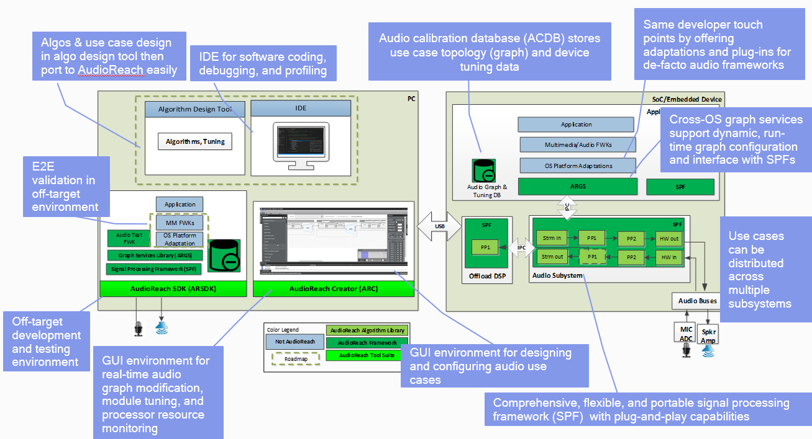
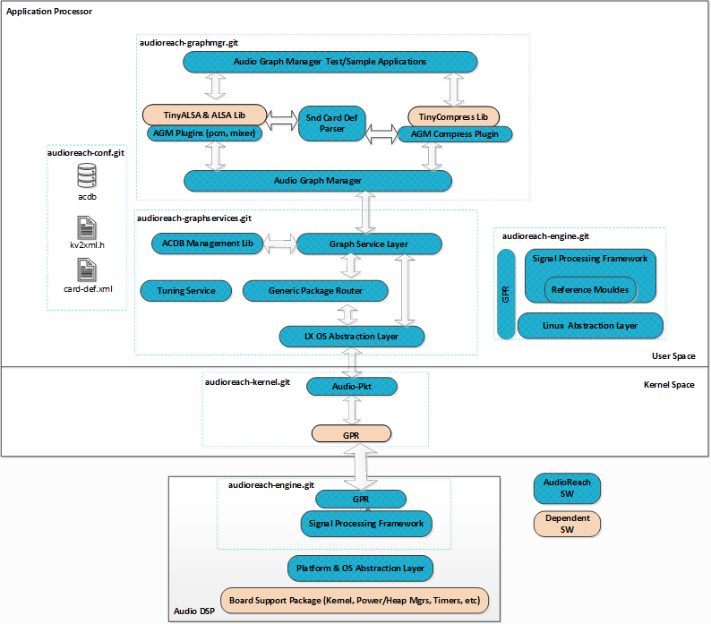
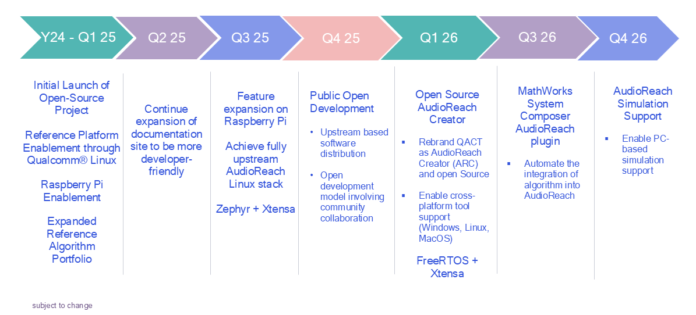

# AudioReach Project Overview

## SDK Overview

AudioReach project aims to deliver a comprehensive and complete end-to-end audio software solution to support a broad range of audio and voice use cases across a diverse set of SoC’s and product devices (handset, compute, wearables, hearables, xr, automotive telematics / infotainment, etc). The AudioReach SDK contains the essential components to support a seamless development workflow from off-target to on-target and flexibility to customize and tailor the processing to the capabilities and constraints of the SoC and product device (multiple cores, peripheral devices, etc). See diagrams below for highlights of SDK and workflow enabled by the SDK. In addition, refer to [AudioReach Architecture Overview](design/arch_overview.html#arch-overview) to learn about overall architecture as this page makes several references to key software components in the AudioReach software offering.

*SDK Highlights*

*Development Workflow Enabled by SDK*

### Platform Support

#### Operating System Support

AudioReach Engine

- Linux

OS Platform Software

Linux: two architectural flavors are offered

- Plug-in architecture is for developers looking for full feature set of what AudioReach has to offer
- ALSA/ASoC driver architecture is for developers who are accustomed to kernel ALSA/ASoC framework

#### Hardware Platform

SoCs

- Qualcomm SoCs
- SoC’s with APPs processor running linux and supports ALSA sound card.

Boards

- Qualcomm RB3 Gen2
- Raspberry Pi 4

### Tools

- AudioReach Creator(ARC), also known as Qualcomm Audio Configuration Tool (QACT) currently, is the most essential tool of entire SDK. ARC enables the entire audio system design workflow.

**NOTE**: QACT currently runs only on Windows, with future plans to support on Linux and release an open-source version.

#### Steps to install ARC

ARC public edition is available through [Qualcomm Software Center](https://softwarecenter.qualcomm.com/#/). Follow below steps to install ARC:

- Download and install **Qualcomm Software Center** on Windows host using steps [here](https://docs.qualcomm.com/bundle/publicresource/topics/80-72780-2/install_qsc.html#download-and-install-qsc-on-windows).
- Launch Qualcomm Software Center from start menu.
- Install required version of **Qualcomm Audio Calibration Tool** using steps shown [here](https://docs.qualcomm.com/bundle/publicresource/topics/80-72780-2/tools_and_sdks.html).

### Source Code Repository

At high-level, AudioReach software components resides in various git repositories. Diagram below gives visual reference to components vs. repositories mapping across processor domains. One would be able to find corresponding repositories in [GitHub project site](https://github.com/audioreach). At the time of writing, only Linux platform is supported. However, more OS platforms will be planned and announced at Roadmap section of this page.

Cross-platform Software Components

- AudioReach Graph Services
- AudioReach Engine including Signal Processing Framework(SPF) and processing modules

Linux Adaptation

Linux platform support is offered with two architectural flavors. For developers looking to utilize full feature set of what AudioReach has to offer, build the product with architecture as depicted in the diagram below. Following software components would need to be pulled from corresponding git repositories

- AudioReach Kernel Drivers
- Audio Graph Manager

*AudioReach Source Repository Diagram*

For developers looking for ALSA support at Linux kernel level, AudioReach ALSA/ASoC drivers are already available in Linux Kernel under <KERNEL>/sound/soc/qcom/qdsp6.

### Build Recipe

- The AudioReach meta layer provides the necessary recipes and configurations to build AudioReach software using the OpenEmbedded build system. This layer is curretly designed to support only Yocto.
- For detailed instructions on how to set up and use the meta layer, please refer to the [README](https://github.com/Audioreach/meta-audioreach/blob/master/README.md) file at [meta-audioreach](https://github.com/audioreach/meta-audioreach)

### Contribution & Project Governance

- Contributions are most welcome. Contribution guideline for each source repository is documented in CONTRIBUTING.md.
- AudioReach project is open for self-appointing council governance structure

### License

Project is licensed under the [BSD-3-clause License](https://spdx.org/licenses/BSD-3-Clause.html).

## Roadmap

*AudioReach Development Phases*

Feedback to help shaping AudioReach roadmap or contribution to pull in the timeline is highly welcome.
