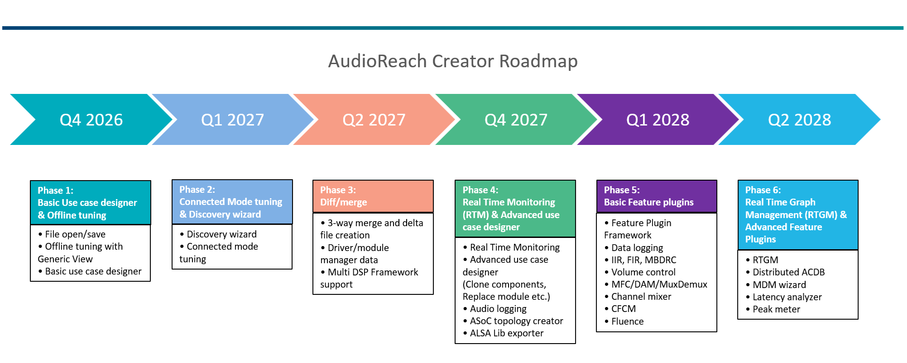
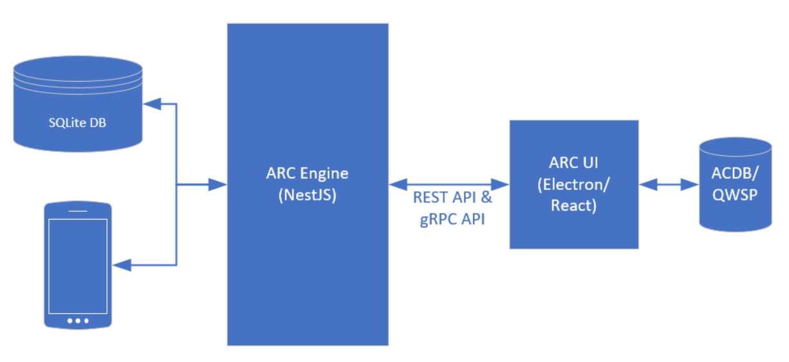
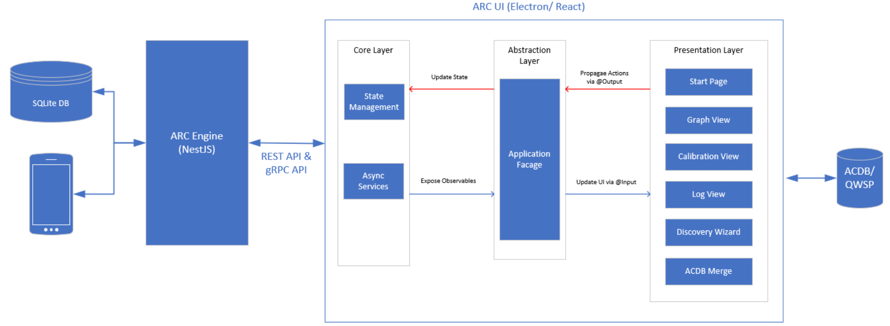
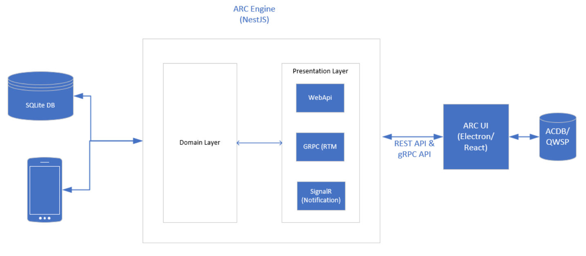

# AudioReach Creator

- 简介
- 路线图
- 架构
    - ARC UI（前端）
          - 表示层（Presentation Layer）
          - 门面层（Facade Layer）
          - 状态层（State Layer）
    - ARC Engine（后端）
          - 表示层（Presentation Layer）
          - 领域层（Domain Layer）

## 简介

AudioReach Creator（ARC），在旧版本中也称为 Qualcomm Audio Calibration Tool（QACT），是一款开源、跨平台的软件，为音频设计、软件和调参工程师提供用户界面，用于面向目标用例编排、配置、调参音频图，并将其存储到音频校准数据库（ACDB）中。

## 路线图

*AudioReach Creator（ARC）路线图*

## 架构

AudioReach Creator（ARC）架构将包含两个独立的部分：UI（前端）和 ARC Engine（后端）。

*AudioReach Creator（ARC）高层软件组件视图*

### ARC UI（前端）

前端将包含所有必需的用户界面，并使用 Electron 和 React 开发。

*AudioReach Creator（ARC）高层软件组件视图（前端）*

#### 表示层（Presentation Layer）

- 处理 UI 和用户交互的 React 组件。
- 仅与门面层（Facade）通信。
- 它们通过 @Input() 接收数据，并通过 @Output() 发出事件。

##### 主要 UI 特性

**Start Page（起始页）：** ARC 应用的入口页面，包含允许用户打开文件、连接设备等操作的按钮。

**Graph View（图视图）：** 打开文件或连接设备后，将显示所选用例的图。用户可以在图视图中修改和调参用例。

**Calibration View（校准视图）：** 对于选定的模块，可通过校准视图对其校准数据进行调参。

**Log View（日志视图）：** 将显示每次 UI 操作的所有日志消息。

**Discovery Wizard（发现向导）：** 将提供导入模块定义及一些元信息的 UI 工作流，以便这些模块能够在用例中使用。对于那些已经在某些用例中使用的模块，可通过发现向导将更新后的模块定义自动应用到用例中。

**ACDB Merge（ACDB 合并）：** 将提供比较和合并 ACDB 文件之间数据的工作流。此特性有助于用户在不同分支之间管理其文件。

#### 门面层（Facade Layer）

- 充当表示层与状态层之间的中介。
- 向组件暴露可观察对象（observables）和方法。
- 派发操作或调用服务来更新状态。

#### 状态层（State Layer）

- 使用存储（store，例如 NgRx 或自定义服务）管理应用状态。
- 处理 API 调用并相应地更新状态。
- 将状态以可观察对象的形式暴露。

### ARC Engine（后端）

ARC Engine 将作为一个 Web 服务器运行，为前端提供所有 API，以便从数据库访问 / 更新数据。它将包含表示层和领域层。

*AudioReach Creator（ARC）高层软件组件视图（后端）*

#### 表示层（Presentation Layer）

- 提供 Web REST API 以处理 http/https 请求。
- 提供 gRPC API，用于实时传输大尺寸数据，以满足高性能、低延迟需求（通常用于 RTM）。
- 通过 SignalR 提供通知机制。

#### 领域层（Domain Layer）

- 提供包含核心业务逻辑和规则的服务，用于从数据库查询 / 更新数据。
