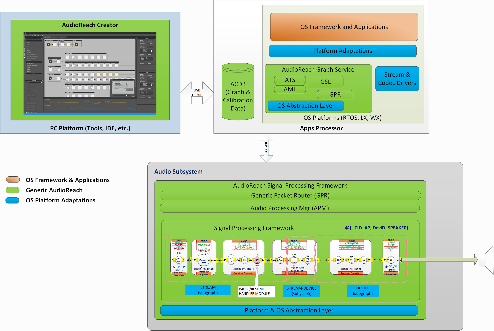

# AudioReach 架构概览

## 指导原则

在深入架构概览之前，有必要先了解那些塑造 AudioReach 设计与实现的指导原则

- 在广泛的硬件和软件平台上复用统一的软件和软件接口
- 通过数据驱动机制实现可配置性，从而最大限度地减少音频应用开发者的编码工作量
- 具备可扩展性，允许开发者将其差异化组件（独门秘籍）插入框架中以实现用例
- 具备模块化，使同一套解决方案能够向上或向下适配到更丰富或更受限的处理环境
- 在异构核心之间进行分布式处理，实现高效的计算负载管理，同时向用户屏蔽处理位置的具体细节

## 架构漫游

AudioReach 由跨越主机 PC 和嵌入式设备的平台无关软件与平台适配软件组成。AudioReach Creator（ARC），也称为 Qualcomm Audio Calibration Tool（QACT），是基于 PC 的软件，为音频系统设计者提供 GUI，用于面向目标用例编排、配置音频图，并将其存储到音频校准数据库（ACDB）中。除了用例设计之外，调参工程师还可以通过 ARC 对音频处理块进行调参，并将校准数据存储到嵌入式设备上的同一个 ACDB 中。

在嵌入式设备上，AudioReach 提供音频平台软件和 AudioReach 引擎（ARE）。如下图所示，ARE 由信号处理框架（SPF）以及参考算法组成。根据 SoC 设计的不同，音频平台软件通常驻留在运行 Linux 等高级操作系统的应用子系统上，而 ARE 驻留在运行 RTOS 的音频 DSP 子系统中。音频平台软件由一组称为 AudioReach 图服务（ARGS）的库和平台适配层组成。

在许多 OS 平台上，已经存在基于成熟 API 和音频/多媒体框架构建起来的应用生态。为满足生态需求，平台适配层被提供出来，用于将平台特定的 API 和构造进行转换，然后调用图服务。

图服务提供的服务包括：与运行在 ARE 上的音频图建立/拆除/操作/交换音频采样及校准数据。如前所述，ACDB 包含音频图定义和校准数据。图服务在收到客户端的图打开请求后，使用用例句柄和校准句柄从 ACDB 中检索音频图和校准数据，并通过通用包路由器（GPR）协议，经由物理或软数据链路将图定义和相应的校准数据下载到 ARE。在接收端，ARE 根据图定义用处理模块构成音频图，并对从音频图的源端点流向汇端点的音频数据进行处理。

请注意，图服务和 ARE 被设计为跨平台软件，为了给图服务和 ARE 提供可运行的执行环境，需要针对不同 OS 平台开发相应的平台/OS 抽象层。

*AudioReach 高层软件组件视图*
