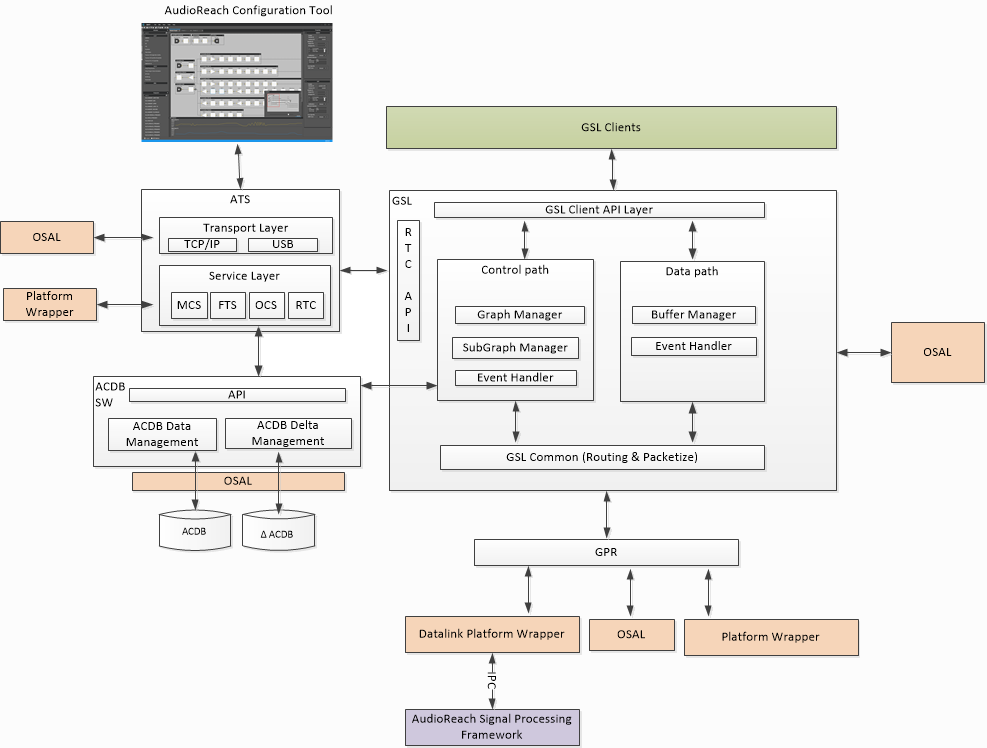

# AudioReach 图服务

## 简介

AudioReach 图服务（ARGS）是一组跨平台的软件库，它们共同提供以下服务

用例执行：

- 与 AudioReach 引擎（ARE）建立通信通道
- 为目标用例建立和拆除运行在 ARE 上的音频图
- 为客户端提供音频数据接口，以便与 ARE 交换音频数据
- 提供控制接口，允许客户端对音频图中的目标模块施加控制命令
- 对音频图应用校准

开发工作流：

- 在音频图各处不同的抽头点（tap point）记录音频采样或模块特定的数据
- 对运行在 ARE 中的音频处理模块执行实时调参
- 将新的校准数据下载到设备
- 实时监控系统和模块资源
- 从 ARC 远程启动设备上的音频用例

## 架构

### 概览

如下所示，AudioReach 图服务由四个跨平台软件组件组成：Graph Service Library（GSL）、ACDB Manager Library（AML）、Generic Packet Router（GPR）和 Audio Tuning Service（ATS）。这些组件调用由 OS 抽象层（OSAL）和平台包装器（platform wrapper）提供的实用工具并获取平台特定信息，以便在目标平台上运行。

GSL 作为客户端访问图服务和 ARE 所提供功能的入口点。通过 GSL API，客户端可以发起图的建立、交换音频数据，以及对运行在 ARE 上的音频图进行操作。GSL 使用客户端传入的 GKV、CKV 和 TKV 查询 AML，以检索图定义、校准数据和被打标签的负载。然后，GSL 将从 AML 检索到的数据打包，并调用 GPR 向 ARE 发送命令并接收其响应。如果运行在 DSP 中的模块能够生成事件（例如关键词检测），GSL 会将该检测事件转发回客户端。

除了向客户端提供服务之外，ARGS 在音频系统开发工作流中也扮演着关键角色。Audio tuning service 作为主机 PC 上的 ARC 与运行在目标侧的其余 AudioReach 软件之间的桥梁。ATS 将来自 ARC 的命令分派给各个服务处理器，这些处理器与其余 AudioReach 软件组件对接，以实现简介中所述的开发工作流用例。

*AudioReach 图服务框图*

### Graph Service Library

#### 功能

1. 通过图键向量加载和初始化子图与图。
2. 图的建立以及图内子图的动态处理
3. 数据命令管理 - 读/写缓冲区
4. 控制命令管理；处理 Pause/Resume/Start/Stop 等。
5. ARE 模块的校准（Set Config/Get Config）。

#### 组成

- API 层：GSL API 层定义并向 GSL 客户端暴露 API。它提供 API 用于从用例键向量信息查询图句柄，以及图管理等。完整的 API 列表列在 [Graph Service Layer](../api/args_gsl.md) 中。
- 控制通路：该层对 ARE 上的用例图执行控制操作。GSL 的一些控制操作包括图管理、子图管理和事件处理。这些操作的详细说明将在下一章关于 GSL 结构的部分中描述。
    - 图管理层：该层负责对 ARE 执行图级别的操作，例如打开、关闭等。GSL 图管理层与 AML 对接，以二进制 blob 格式获取图定义、模块配置和校准数据，并通过 GPR/IPC 发送到 ARE。GSL 图管理层还为当前运行在 ARE 上的每个图维护“状态”信息。
    - 子图管理层：该层负责跟踪所有在 ARE 上打开的用例图中的子图。该层为子图实现引用计数机制，以便正确处理跨用例共享的公共子图。此外，每个子图都维护一个它所连接到的子子图（child subgraph）列表。
- 数据通路：该层负责从其客户端接收音频数据缓冲区以及向其客户端发送音频数据缓冲区。GSL 为客户端提供多种传输/接收音频数据的模式。
    - 阻塞模式：在此模式下，客户端负责分配内存，并在 write/read 调用中将其提供给 GSL。GSL 会将数据从客户端的内存复制到其本地缓冲区，并在数据被复制后通知客户端。阻塞意味着 gsl_write 会一直阻塞，直到客户端发送的所有数据都被 GSL 消费（即复制到内部缓冲区）为止。
    - 非阻塞模式：此模式与阻塞模式非常相似，区别在于 gsl_write 会尽可能多地消费数据然后立即返回。一旦内部缓冲区中有足够的可用空间，GSL 就会通知客户端。
    - 共享内存模式：此模式与阻塞和非阻塞模式类似，区别在于内存由 GSL 分配并与客户端共享。
    - 推挽模式（Push-pull mode）：
- 事件处理：该层负责从 ARE 接收事件。根据接收到的事件，GSL 要么在自身内部采取行动（消费该事件），要么使用回调函数将事件传播给其客户端。示例事件包括 SSR（子系统重启）、EOS（流结束）等。
- GSL Common：提供 API 以构成将被路由到 ARE 的 GPR 包。打包层会检查路由 ID 并更新 GPR 包中的目标域，以便该包被路由到运行在不同子系统上的不同 ARE 实例。

### ACDB Management Library

AML 同时提供 get/set API，用于检索和调整 ACDB DATA 文件中的数据。它为其客户端 GSL 如何消费校准数据提供了数据抽象和组织。在设备上，有 ACDB 文件和 ACDB delta 文件。ACDB 文件以压缩的二进制形式存储 GSL 和 ARE 所需的基线校准数据。Delta 文件包含运行时由 GSL 和 ARC 设置的数据。这些文件由 AML 中相应的文件管理器管理。

### Generic Package Router

有关 GPR 的高层概览，请参阅 [Functional Overview](gpr_design.md)。

### Audio Tuning Service

当 ARC 连接到设备时，ARC 被视为处于连接模式。通过受支持的传输层（例如 TCP/IP）与 ATS 建立通信。在收到 ARC 命令后，ATS 将命令路由到负责的服务模块：

- Online Calibration Service（OCS）：在线校准服务允许 ARC 操作 AML 的部分功能
- Real Time Calibration（RTC）：该模块将保存 RTC 的所有实现，用于通过 GSL RTC API 从 ARE 获取/向 ARE 设置数据
- Media controller Service（MCS）：该模块在目标侧发起用例，以支持高级调参特性
- File Transfer Service（FTS）：该模块允许 ARC 将文件（例如 ACDB 文件）传输到已连接的设备上

ATS 除了依赖 OSAL 提供与 OS 相关的功能外，还依赖平台包装器提供平台特定的实用工具，例如 TCP/IP 连接、播放/录音 API。

### 操作系统抽象层

为了在目标 OS 平台上运行 AudioReach 图服务，OSAL 实现应提供以下功能：

- Signal、Sleep、Thread、Mutex
- Timer
- 堆分配器
- File IO
- 日志记录
- 内存操作
- 字符串操作
- 共享内存分配器：有些 SoC/硬件平台依赖共享内存作为在处理器子系统之间交换控制数据和音频数据的主要机制。共享内存分配器应实现为利用平台特定的 API 来分配共享内存并提供给图服务组件
- 服务注册表（Service registry）：在 ARE 运行于指定进程域的系统上，GSL 依赖服务注册表来获知承载 ARE 的进程域的上线与下线状态，以便在与 ARE 握手之前，或在处理子系统重启或进程域重启场景时使用。
