# AudioReach 引擎

- 引言
- 概述
    - 高层架构
    - 可能的用例
- 框架需求
    - 通用
    - 客户端接口
    - 处理链、拓扑与图
    - 媒体格式
    - 调度方法
    - 资源管理
    - 调试
- ARE 组件
    - ARE 的高层架构
    - 功能块
    - 校准与配置
    - 多实例与多核
- 定制化
    - 自定义模块
    - 自定义容器
- 用例
    - 播放
    - 采集
    - 带源模块与汇模块的用例
    - 免提配置文件（HFP）
    - 语音激活
- 图设计者 FAQ
    - 应画多少个子图？
    - 应使用多少个容器？
    - 我应该用 SC 还是 GC？
    - 如何提升效率？
- 缩略语与术语

## 引言

本页介绍在 AudioReach™ 架构语境下所使用的 AudioReach 引擎（ARE）的高层软件需求与设计细节。本页所用缩略语的定义请参见“缩略语与术语”。

## 概述

### 高层架构

ARE 遵循客户端-服务器模型，其中服务器按照客户端的需求提供各种功能，例如实现音频用例。

- 服务器框架提供了按用例需求插入并执行算法的方法。
- 客户端框架充当高层软件栈（如中间件或应用程序）与服务器框架之间的桥梁。
- 平台（硬件子系统）与操作系统（OS）抽象帮助框架在不同的处理器和硬件架构上工作。

下图展示了典型音频嵌入式系统中所使用的高层软件架构。

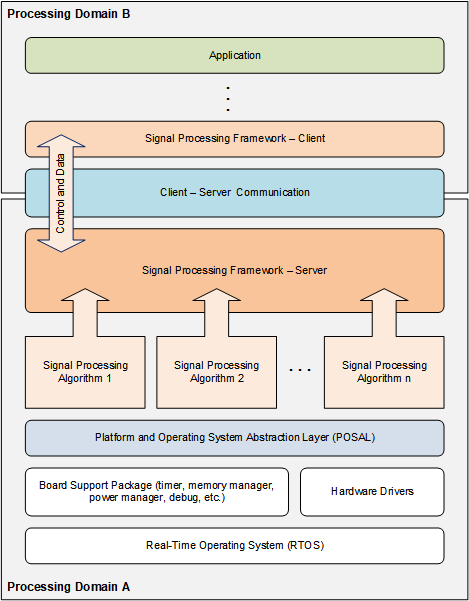
*高层音频软件架构*

### 可能的用例

ARE 可用于各种音频和语音用例。本节包括但不限于以下高层示例。详细用例在“用例”一节中说明。

#### 音频采集与录制

音频采集涉及对来自麦克风或任意实时设备（端点）的 PCM 数据进行编码。

用于编码的音频格式有：PCM、AAC、WMA std、AMRWB 等。

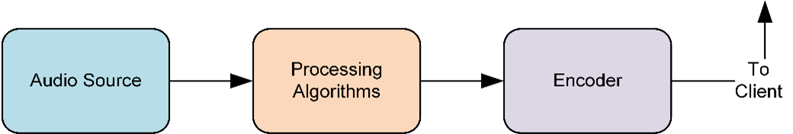

#### 音频渲染与播放

音频播放涉及对给定的音频数据进行解码，并将 PCM 在扬声器或任意实时设备上播放出来。

用于解码的典型音频格式有：PCM、MP3、AAC、FLAC、ALAC、AC3、EAC3、Vorbis、WMA std、WMA Pro、DTS、APE 等。

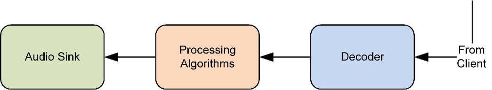

#### 网络电话（VoIP）

网络电话（Voice over Internet Protocol，VoIP）同时涉及播放通路和录制通路，用于语音通信。

编码器和解码器与主机处理器上的应用程序交互，在与远端用户对话期间通过 IP 收发数据。

用于编码和解码的典型音频格式有：PCM、AAC、A-law、µ-law 等。

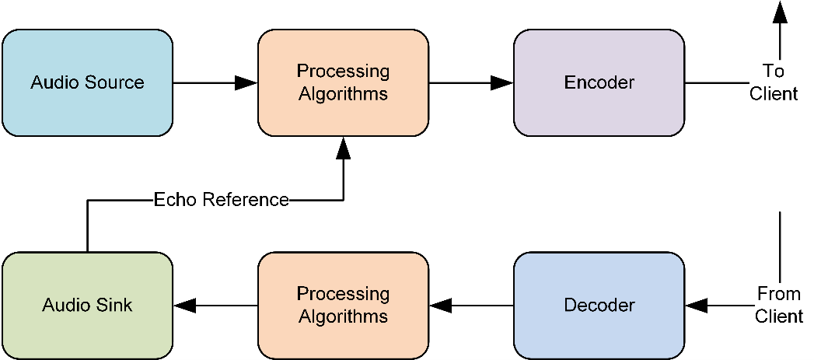

#### 音频转码

音频转码涉及将一种音频格式转换为另一种，例如从 MP3 转为 AAC。

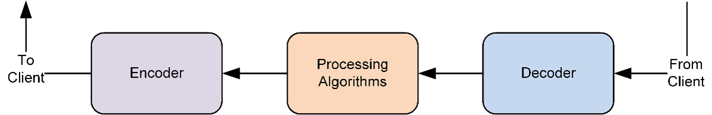

#### 音频环回

音频环回涉及从一个音频源接收数据，经过可选的处理后在一个音频汇上渲染出来。

音频环回用于各种场景，例如在 CS 语音通话中混入侧音、免提配置文件（HFP）、助听器等。

以下是一些环回用例，其中音频必须从一个设备路由到另一个设备并进行某些转换。

- PCM 到压缩打包格式。例如，从设备进来的 PCM 被编码为 DTS 并打包，然后传输到 HDMI。
- 压缩打包格式到 PCM。例如，来自 HDMI 的数据被解包、解码，然后传输到扬声器进行渲染。
- 压缩打包格式到压缩打包格式，并进行格式转换。

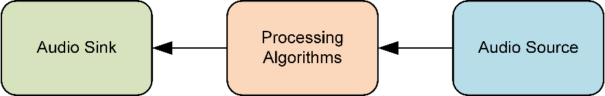

#### 音频检测

音频检测涉及从一个音频源接收数据，对其进行处理以改善信号质量，检测预期的属性或事件，并通知已注册的客户端。

音频检测用于各种场景，例如 DTMF 检测、关键词检测、音频上下文检测等。

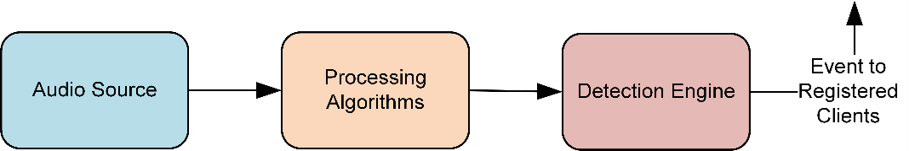

## 框架需求

### 通用

- 必须与处理器和平台无关。
- 必须与用例无关且由数据驱动。
- 必须提供内存可伸缩选项。
- 必须提供定制框架的选项。
- 必须提供支持各种性能模式的选项。
- 必须允许用例特定的定制化。
- 必须支持模块（算法与功能）与框架交互的统一接口。
- 必须可伸缩，从独立用例一直支持到高端并发。
- 应提供动态加载处理模块和算法的选项。
- 必须支持多核和多实例配置，以启用分布式音频处理。

### 客户端接口

- 必须支持同一处理器内、跨处理器或跨处理域的客户端-服务器通信。
- 必须提供跨客户端与服务器框架管理共享内存的方法。
- 必须提供通用接口（同步与异步）以在客户端与服务器框架之间交换命令、响应和事件。
- 必须提供建立、配置、启动、停止、挂起和拆除用例图的方法。
- 必须支持模块的运行时校准与监控。
- 必须提供发布框架及模块能力、配置和校准接口的方法，以支持数据驱动的用例设计。
- 应允许代理客户端处理用例特定的定制化。

### 处理链、拓扑与图

- 必须支持线性处理图（其中模块逐个顺序连接）。
- 应支持非线性处理图（其中模块以有向无环图形式连接）。
- 必须支持实时（RT）和非实时（NRT）音频源与汇。
- 必须支持基于*流*的处理图，其中每个流可以包含多个通道。
- 应提供跨处理图的元数据传播。
- 应支持具有不同帧尺寸需求的处理模块。
- 必须支持运行同一模块多个实例的选项，以及寻址各个实例进行配置或校准的能力。
- 必须支持用例图中处理模块的原地缓冲选项。
- 必须提供支持处理模块之间数据与控制通信的方法。
- 应提供图特定功能的支持，例如暂停、恢复和刷新。
- 应支持接受可变输入样本数并产生可变输出样本数的模块。
- 应提供在播放流的最后一个样本从音频汇渲染出去时通知客户端处理器的方法。

### 媒体格式

- 必须支持定点和浮点 PCM 数据格式。
- 必须支持各种标准压缩数据格式和通用（raw）压缩数据格式。
- 必须支持配置通道数、位宽、样本宽度和 Q 因子。
- 必须支持用例中跨处理模块的媒体格式传播。

### 调度方法

- 应支持不同的调度模式和不同的数据交付机制（缓冲区可用性、定时器调度触发、定时包交付、截止期驱动调度等）。
- 应提供启用自定义调度和触发策略的选项，以处理复杂场景。

### 资源管理

- 必须提供管理用例图所需处理资源（内存管理、处理器周期、带宽、线程优先级等）的方法。
- 应提供测量框架与模块处理需求的方法。
- 应提供查询所需模块之间延迟的能力。
- 必须提供基于用例或能力的可伸缩内存需求选项。

### 调试

- 必须提供记录诊断消息的方法。
- 必须提供在用例图中指定位置记录音频数据（PCM 与压缩）的选项。
- 应支持不同的调试级别（可作为特性开关），以调试复杂的时序问题、内存泄漏等。

## ARE 组件

### ARE 的高层架构

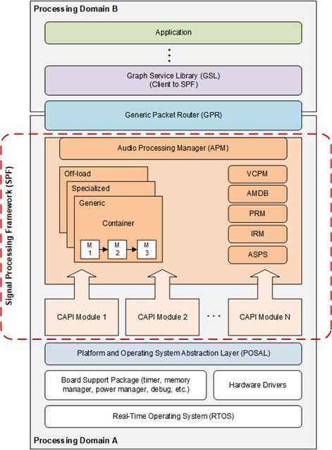
*ARE 高层架构*

### 功能块

本节提供 ARE 中所用功能块的高层概览。

#### 通用包路由器（GPR）

通用包路由器（GPR）为跨 ARE（服务器框架）与图服务库（GSL，即客户端框架）的音频消息包（控制、数据、事件、响应）提供路由功能。

GPR 抽象了平台特定的处理器间通信（IPC）传输层和协议层。

下图表示 GPR 的头部格式，它由源地址和目的地址（域和端口）、令牌（用于异步通信中匹配命令与响应）以及操作码（opcode）组成。

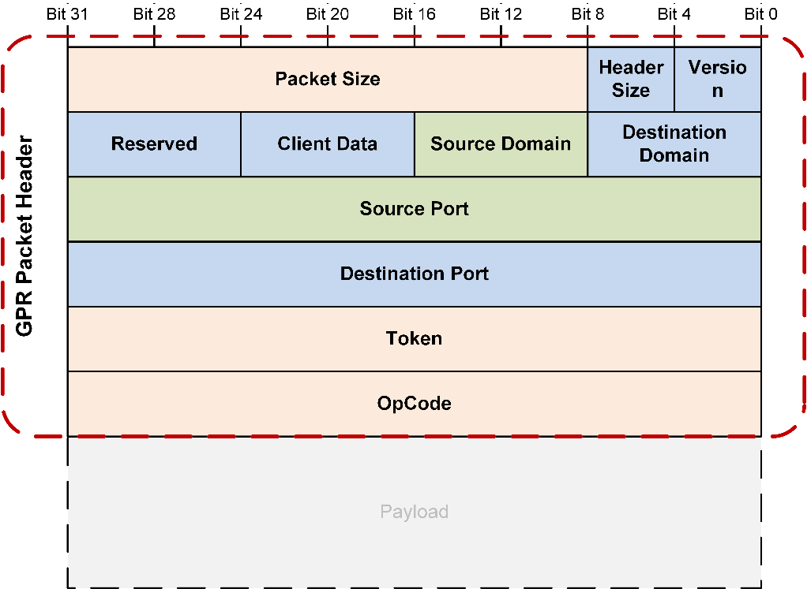
*GPR 头部格式*

##### 操作码

所有操作码都要遵循 GUID 格式。

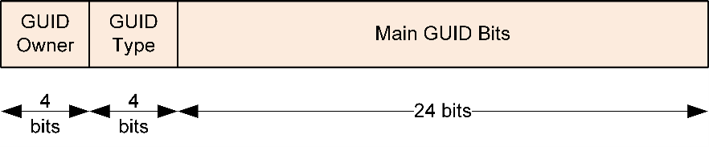

- **Owner** —— 指示 GUID 的所有者，即该 GUID 是由 ARE 定义的还是你的自定义操作码。
- **Type** —— 指示具体用途，例如控制命令、控制响应、数据命令、数据响应、事件、模块标识符、格式标识符、CAPI 操作码等。
- **Bits** —— 用于将消息类型解释为事件或响应，以及避免发送通用响应或确认。

##### ARE 与 GSL 之间的消息传递

为获得最佳系统性能，ARE 支持两种消息传递方式：带内（in-band）消息和带外（out-of-band）消息。

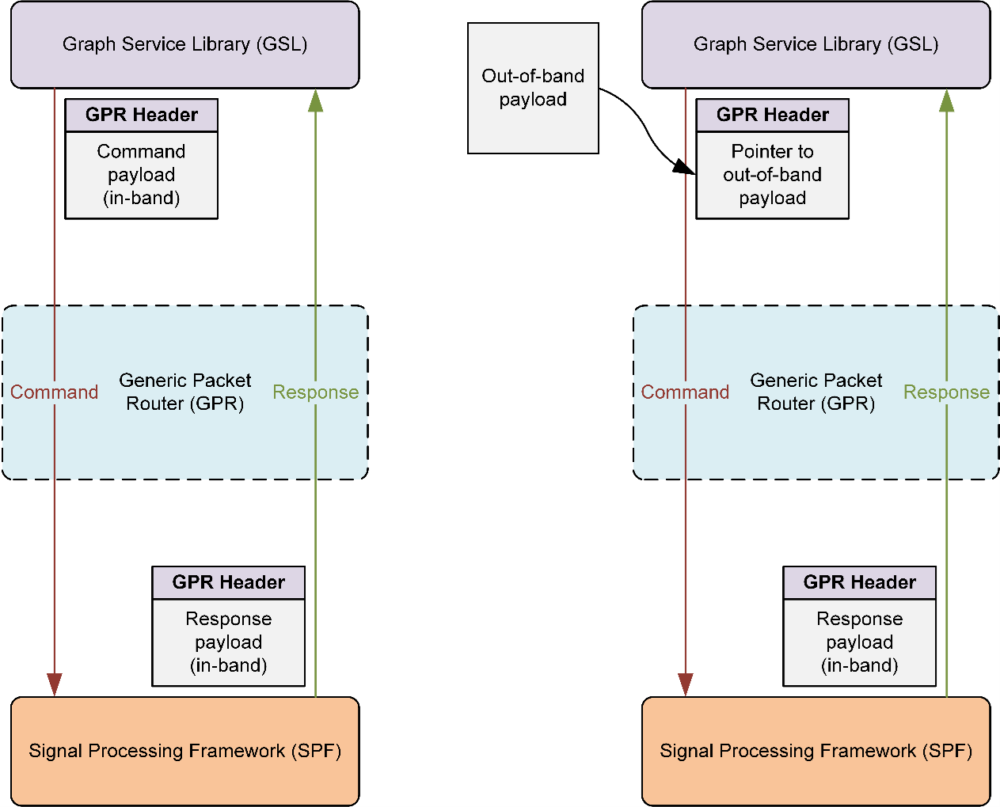
*带内与带外消息传递方式*

##### 带内消息

- 将实际负载/消息作为 GPR 负载的一部分。
- GPR 跨处理域转发完整数据包（即 GPR 头部 + 实际负载）。
- 在框架服务器与客户端之间的中间层可能存在内存拷贝（因此有大小限制以减少性能影响）。
- 通常用于小负载，例如 <512 字节（平台特定配置），如简单命令、响应、事件等。

##### 带外消息

- 使用单独的共享内存来保存实际负载/消息。
- GPR 转发带有实际负载地址的数据包（即 GPR 地址 + 实际负载地址）。
- 允许框架服务器与客户端访问共享内存，而无需在两者之间进行额外的内存拷贝。
- 通常用于较大负载，例如 >512 字节（平台特定配置），如配置、校准、数据缓冲区等。

#### 模块

模块是 ARE 中一个可寻址的*功能*。

- *module ID* 用于标识功能，在模块实例化期间很有用。
- *module instance ID* 用于标识模块的实例，在从客户端接收配置和校准信息时很有用。
- 模块实例（一个 32 位实例 ID）应向 GPR 注册回调函数，以便直接从客户端接收消息。

ARE 中使用两类模块：控制模块和数据处理模块。

##### 控制模块

控制模块向客户端（如 GSL、编解码器驱动等）提供公共接口，以控制 ARE 的资源和功能（每个模块就像一个提供特定功能的服务）。

音频处理管理器（APM）和集成资源监视器（IRM）是控制模块的几个示例。这些模块不在用例图中表示。

##### 数据处理模块

数据处理模块可以是静态的或动态的，它们通常用通用音频处理接口（CAPI）封装。CAPI 接口充当框架与核心模块功能之间的桥梁。

这些模块可以有零个或多个输入和输出端口。端口可以是控制端口或数据端口，且一次只连接一个链路（这些端口不支持隐式混合和拆分）。不支持零输入零输出端口的模块。

数据处理模块的示例包括解码器、编码器、后处理模块、硬件或软件端点、DTMF 生成器（源模块）、DTMF 检测（汇模块）、回声消除器（多端口模块）等。

有关 CAPI 接口的更多细节，请参见 [CAPI Module Development Guide](../dev/capi_mod_dev.md)。

#### 链路与连接

链路和连接用于连接数据处理模块，从而创建用例图或链。链路的起始点和终止点由端口表示。

ARE 中使用两类链路：控制链路和数据链路。

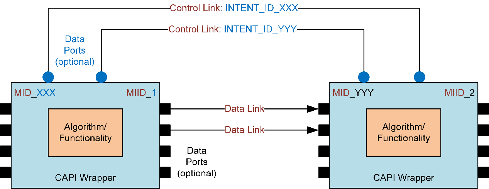
*带控制链路或数据链路的 CAPI 封装模块*

##### 控制链路

控制链路是双向的、点对点的，且可以是动态的（数量可变）或静态的（数量固定，控制端口带有特定标签）。

这些链路是可选的，用于两个模块需要在稳态下彼此通信而无需客户端参与的场合。它们用于在两个模块之间交换控制消息或意图（无需与数据同步）。

##### 数据链路

数据链路是单向的、点对点的，且可以是动态的（数量可变，例如累加器模块的输入可以是可变的），或静态的（数量固定，数据端口带有特定标签，例如回声参考端口可以被显式标记）。

这些链路用于在两个模块之间交换数据消息（需与数据缓冲区或样本同步）。每条链路承载一路数据流，其中可以包含多个通道。

数据链路不出现在源模块的输入侧和汇模块的输出侧。

#### 图与子图

*图*是一系列数据通路模块（带有输入和输出端口）的互连，用以实现端到端的用例。

*子图*类似于图，用于表示完整图的一个部分（以控制或管理单个单元）。

- 子图属性提供管理子图所需的配置。例如性能模式（如低功耗、低延迟等）、用例场景 ID（用于处理任何用例特定的定制化）等。
- ARE 客户端借助 START、STOP、SUSPEND、FLUSH 等图特定命令，以子图粒度控制用例。

对于特定用例，图和子图指的是同一个东西。

ARE 仅支持有向无环图（无反馈路径）。

#### 容器

*容器*是一种框架实现，帮助在同一个软件线程中执行一组数据处理模块。下图说明了这个概念。

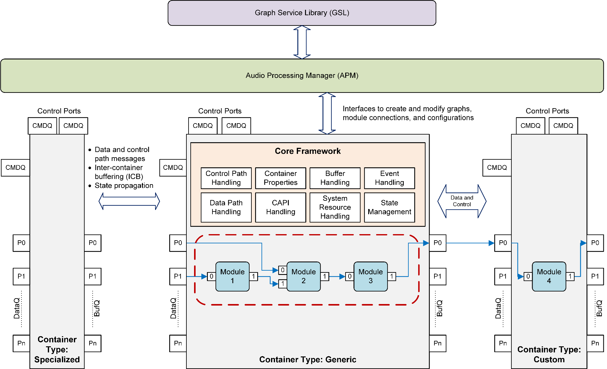
*容器*

- 每个容器实例运行在其自己的软件线程中。
- 容器属性提供容器创建和运行所需的配置。例如容器类型、栈大小、堆 ID 等。
- *Container Type* 有助于识别指定的容器并在用例建立期间（即 Graph OPEN）实例化它。
- *Container Instance ID* 用于表示容器类型的实例，在用例图定义中使用。
- 一个用例可以包含同一容器类型的不同实例，以将处理模块分布到不同的软件线程中。

根据不同用例模块所需的框架能力性质及产品需求，共有三种容器类型：

#### **通用容器（Generic container）**

- 支持硬件端点/信号触发模块、共享内存端点、编码器、解码器、打包器、解包器、转换器、简单 PP 模块（包括分数重采样和速率匹配）
- 不支持背靠背的分数重采样或速率匹配。但只要模块通过非缓冲的线性链连接到容器的外部端口，单独的分数重采样或速率匹配是支持的。
- 从 2022 年起支持优先级（EC）同步、EC 模块和通用同步。
- 支持低功耗孤岛（low power island）
- 针对运行纯信号驱动拓扑进行了优化。

通用容器中的阈值聚合如下：

- 如果容器中只有一个带阈值的模块，则使用该模块的阈值。
- 当存在多个阈值模块时，取其最小公倍数（LCM）作为阈值。
- 如果不存在阈值模块，则使用子图的性能模式来确定阈值，其中低功耗的性能模式对应 5 ms，低延迟的性能模式对应 1 ms。
- 对于 raw 压缩格式，按字节计的阈值直接使用。容器帧尺寸由图其他部分中存在的任何 PCM 格式决定。如果容器完全采用 raw 压缩格式，则无法确定以时间计的帧尺寸，线程优先级设置可能不正确（此类场景很少出现，需逐案处理）

**示例场景**

- 如果性能模式为 5 ms（低功耗），但存在一个将阈值提升到 1 ms 的端点模块，则容器阈值为 1 ms。
- 如果容器中有两个阈值模块，一个阈值为 2 ms，一个阈值为 5 ms，则容器帧尺寸为最小公倍数，即 10 ms。
- 如果子图性能模式为 5 ms 且没有阈值模块，则容器帧尺寸为 5 ms。

#### **专用容器（Specialized container）**

- 主要为 PP 模块设计，包括复杂模块（如速率匹配）和多端口模块（如 EC），这些模块对多个输入有同步需求。也支持分数重采样。
- 支持背靠背的分数重采样、速率匹配。
- 不支持端点/信号触发模块、共享内存端点、编码器、解码器、打包器、解包器和转换器。
- 针对简单 PP 模块的单输入单输出（SISO）链高度优化：
- 从拓扑链中移除已禁用的模块。
- 如果只有一个活动输入（且限幅器已禁用），从处理链中移除 sync+SAL。
- 如果所有模块都被禁用，则旁路容器。
- 当容器中无内部缓冲时，稳态检查更简单（相比 GC——GC 仅对信号触发场景做这种简化）。
- 语音通话有特殊的同步需求，仅在 SC 中支持，例如智能同步、语音处理触发等。
- 不支持低功耗孤岛（LPI）。

专用容器中的阈值聚合如下：

- 如果存在多个阈值模块，SC 仅支持阈值互为倍数的模块。如果阈值不互为倍数，则报错。如果该“倍数阈值”小于由子图性能模式导出的帧尺寸，则使用大于性能模式帧尺寸的最接近倍数。否则，直接使用该倍数。

**阈值计算的示例场景**

- 如果子图性能模式为低功耗（5 ms），且容器中唯一的阈值模块将阈值提升为 2 ms，则容器帧尺寸为 6 ms，即大于性能模式帧尺寸的、最接近的模块阈值倍数。
- 如果子图性能模式为低功耗（5 ms），且容器中存在两个阈值模块——一个阈值为 1 ms，一个提升 3 ms 阈值，则容器帧尺寸为 6 ms。这是两个模块阈值的、大于性能模式帧尺寸的最接近公倍数。
- 如果子图性能模式为低功耗（5 ms）且没有阈值模块，则容器帧尺寸为 5 ms。
- 如果容器中有两个阈值模块，一个提升阈值为 2 ms，一个提升为 3 ms，则报错，SC 将不支持该拓扑。
- 特殊情况——对于语音通话流子图使用 20 ms 阈值，对于音频播放流 PP，阈值为 10 ms。

#### **卸载容器（Off-load container）**

- 支持通过将预期模块或一组数据处理模块 offload 到不同的处理域，从而减轻本地处理域上的处理负载。这在分布式音频处理中很有用，可有效利用跨不同处理器的可用硬件资源。

容器概念支持框架定制化，如果参考容器无法以指定的性能支持所需能力，你可以创建*自定义容器*。只要遵循容器到容器的接口和行为，这类定制化就可以与参考容器互操作。

容器有助于实现以下功能：

- 管理（建立、启动、停止、拆除）由 CAPI 模块构成的处理链（拓扑）。
- 管理容器内处理图的调度和触发策略。
- 在多线程系统中并行化处理负载。
- 在该容器中运行的模块之间共享同一栈内存。
- 确保模块所需的适当资源需求（堆、线程优先级、处理器及其他基础设施时钟等）。
- 通过容器间缓冲（ICB）管理与对等容器的数据缓冲需求，以及同一容器内模块之间的数据缓冲需求。
- 承载必要的命令队列，以与 APM、对等容器、外部客户端和内部模块交互，进行控制消息传递。
- 承载数据队列和缓冲区队列，以与对等容器交换数据通路消息（数据缓冲区、元数据、流结束（EOS）、媒体格式等）。
- 这些队列在图被打开时由容器创建。
- 为位于容器边界的模块的每个输入端口创建 DataQ。
- 为位于容器边界的模块的每个输出端口创建 BufferQ。
- 通过命令队列向对等容器传播端口（数据和控制）状态信息（启动或停止）和数据流性质（实时或非实时）。此信息对于在运行时更新调度策略很有用。

下图给出了一个带容器的简单用例中所涉及的示例数据流和调度策略。

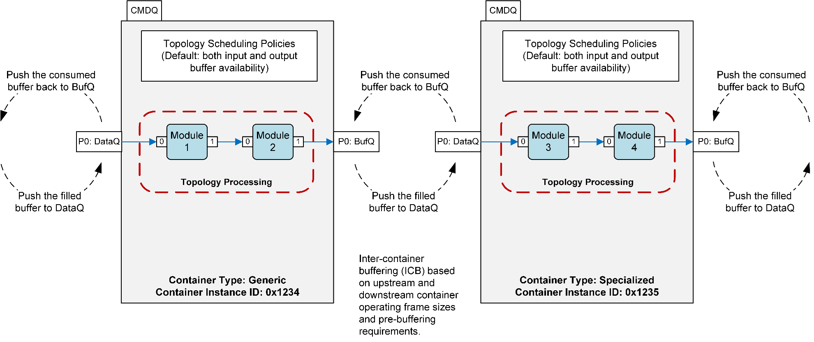
*跨容器的示例数据流*

当用例以默认触发策略启动时：

1. 当输入缓冲区（由上游填充数据）和输出缓冲区（空闲缓冲区）都可用时，容器触发或调用其拓扑处理。
2. 在拓扑处理期间，输入数据通过 CAPI 模块序列（按用例图定义）传播到输出缓冲区。
3. 在完全消费输入缓冲区后，数据被推回上游的输出队列（BufferQ）。
4. 一旦输出缓冲区被填满，数据就被交付到下游容器的输入队列（DataQ）。
5. 这些步骤在每个由缓冲区可用性驱动的容器上重复。

框架还允许模块通过触发策略框架扩展来覆盖默认触发策略。例如，某些模块可能希望在输入或输出缓冲区可用时随时被调用（例如缓冲类型的模块）。

#### 音频处理管理器（APM）

音频处理管理器（APM）负责在 ARE 中建立和管理用例图。

如图“音频处理管理器”所示，APM 向 GSL 客户端提供通用公共接口，以执行以下图操作：

- 建立和配置容器处理线程。
- 在容器内建立模块的图。
- 配置和校准每个容器内的各个模块。
- 更新运行时图，包括从图中添加和移除容器与模块。
- 管理跨容器的数据通路连接和断开。
- 提供给定容器内模块的运行时校准。
- 提供共享内存映射接口。
- 提供两个模块之间的路径延迟。
- 借助 CLOSE_ALL 命令提供全局框架复位功能。

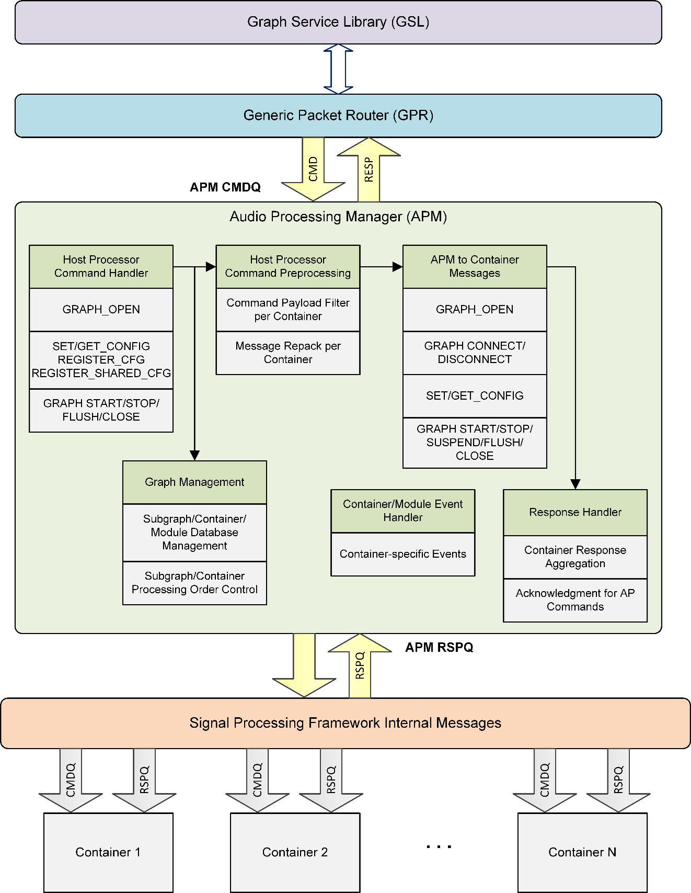
*音频处理管理器*

APM 还处理用于控制子图状态机的命令：

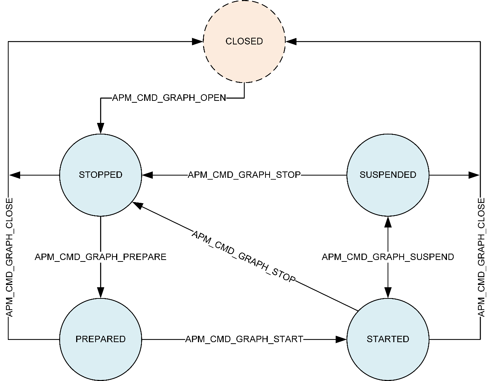
*APM 状态机*

#### **CLOSED**

- OPEN 之前和 CLOSE 之后的逻辑/不存在图状态。

#### **STOPPED**

- 图被打开后，或作为 STOP 的一部分从 STARTED 转换而来的状态。
- 对于从 START 到 STOP 的转换，模块的算法状态被复位，容器内部数据缓冲区被刷新。
- 平台特定资源（MIPS、总线带宽等）被撤销投票（de-voted）。

#### **PREPARED**

- 如果可用，媒体格式会通过模块拓扑进行传播。
- 模块应用依赖于输入媒体格式的校准。

#### **STARTED**

- 平台特定资源（MIPS、总线带宽等）被投票（voted）。
- 在适用时，数据触发、硬件端点、定时器中断被启用。
- 子图已准备好处理数据流。

#### **SUSPENDED**

- 平台特定资源（MIPS、总线带宽等）被撤销投票。
- 与 STOP 命令不同，模块的算法状态和容器内部数据缓冲区被保留而不被刷新。

除处理来自主机处理器客户端的命令外，APM 还负责以下操作：

- 根据命令类型，通过框架消息传递 API 与容器交互，以发送这些命令并处理来自容器的响应。
- 对于给定命令，聚合容器对该消息的响应，并将聚合后的确认发送回 GSL。
- 对于给定的端到端图，管理并协调容器，以处理涉及跨不同容器模块之间控制通路数据交换的用例（如速率匹配）。

这包括用于端到端容器-模块图排序（相对于从数据源到汇的数据流方向）、图搜索和遍历例程的实用工具。

#### 音频模块数据库（AMDB）

音频模块数据库（AMDB）提供 ARE 中 CAPI 封装模块（静态模块和动态模块）的数据库。

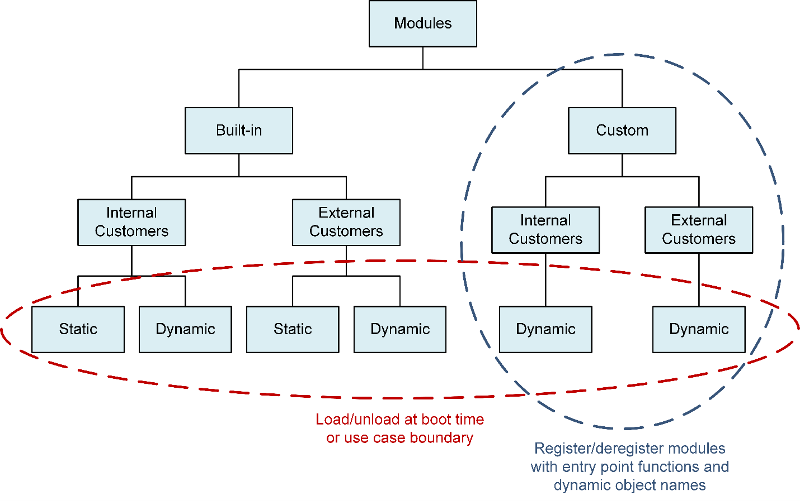
*音频模块数据库*

AMDB 负责以下操作。

- 向客户端（GSL）提供接口，以注册或注销自定义模块，并在启动时或用例边界加载或卸载动态模块。
- 与容器交互，以实例化和拆除模块。
- 使用平台特定的动态下载实用工具，将共享对象下载到指定内存（DDR、低功耗内存等）。
- 管理引用计数器，以便当模块正被活动用例使用时不会被卸载。

如图“音频模块数据库”所示

#### **内置模块**

- 与 ARE 一起构建的模块，包括静态和动态对象。
- AMDB 使用由构建系统生成的模块数据库（模块 ID、自动生成的 .c 文件中的入口点函数），因此无需单独注册或注销。

#### **自定义模块**

- 作为独立动态对象构建、而非与 ARE 一起构建的模块
- 这些模块和动态对象必须使用自定义模块集成工作流向 AudioReach 校准与配置工具（ARC）注册，进而由其向 ARE 中的 AMDB 注册。

#### **静态模块**

- 静态模块在启动时与 ARE 一起加载。

#### **动态模块**

- 根据内存和延迟的权衡，动态模块可以在启动时或用例边界加载。

#### 集成资源监视器（IRM）

集成资源监视器（IRM）为底层平台中的不同资源提供剖析度量指标。

ARC 平台为系统设计者显示资源度量指标（MIPS、带宽、堆使用等）。

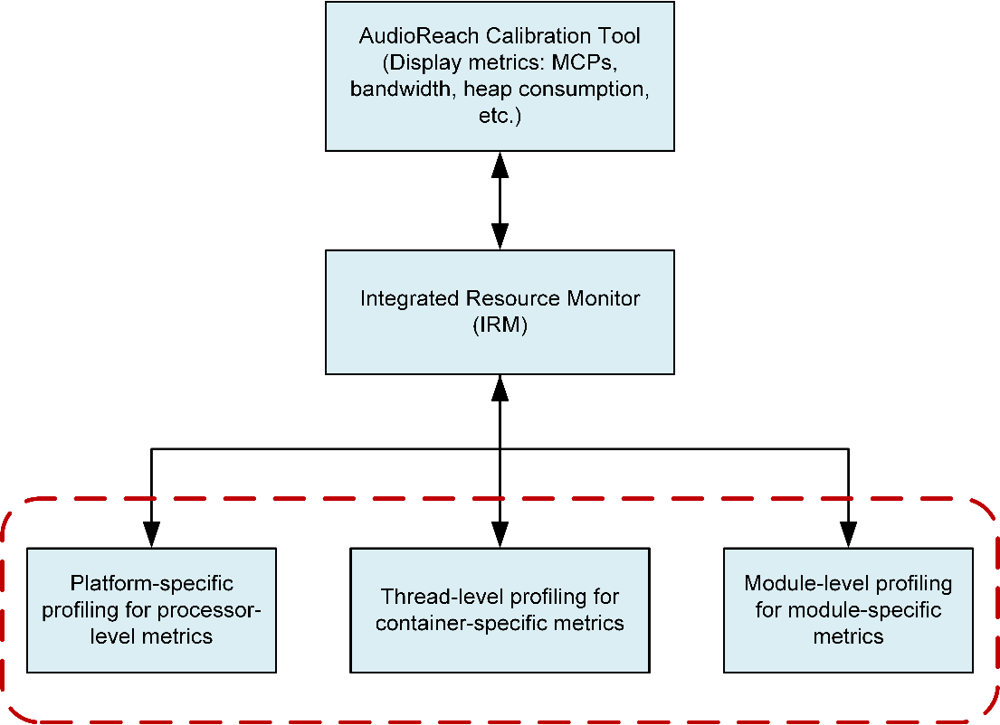
*集成资源监视器*

#### 平台与操作系统抽象层

平台与操作系统抽象层（POSAL）为框架提供必要的抽象，使其与处理器（硬件）或平台（软件）无关。

这些抽象包括但不限于以下内容：

- 电源管理
- MIPs/MCPs/MPPs 和带宽投票，以选择处理器和系统总线时钟。
- 延迟投票，可控制各种性能模式
- 自定义电源域，以实现各种功耗目标
- 处理器特定的内建函数（intrinsics），以帮助优化
- 内存管理（不同类型的堆内存、共享内存映射等）
- 缓存内存操作（清理、失效操作）
- 条件变量和原子变量
- 优先级继承和递归互斥锁、nmutex
- 信号和通道（可监听多个信号）
- 中断处理
- 定时器
- 软件线程（基于优先级的抢占式调度）
- 平台特定的线程优先级数据库
- 用于诊断目的的数据（PCM 或压缩）和消息日志记录

### 校准与配置

校准与配置由在建立时和运行时提供给模块的控制信息组成，用以控制模块的功能。

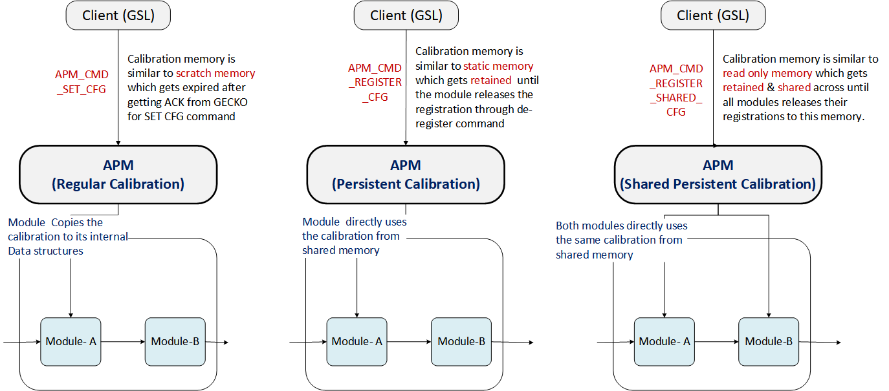
*校准模式*

以下是 AudioReach 引擎暴露的三类校准接口。

#### 常规且非共享校准

步骤：

1. 客户端向模块提供校准内存。
2. 模块将校准数据拷贝到内部缓冲区，并向客户端提供响应。
3. 客户端释放共享缓冲区。

开销：

- 额外的内存（内部缓冲区）和缓冲区拷贝开销。
- 因此，我们建议使用较小的校准尺寸。

ARE 同时支持带内和带外校准方法。

#### 持久且共享校准

步骤：

1. 客户端通过带外负载向模块提供校准内存。
2. 模块直接使用客户端共享的内存，而不将校准数据拷贝到内部缓冲区，并向客户端提供响应。
3. 如果用例处于活动状态，客户端保留模块正在使用的共享内存。
4. 一旦用例关闭，客户端就释放共享缓冲区。

由于不涉及拷贝，内存使用和处理周期都是最优的。

从模块实例的角度看，持久校准内存表现为可读写（RW）。我们推荐将此方法用于大型校准和配置块（如机器学习模型）。

仅支持带外校准。

#### 共享持久或全局共享校准

此方法类似于持久校准。但在这种情况下，同一数据被共享给多个模块，从而有助于节省更多内存。

从模块的角度看，共享持久校准内存表现为只读（RO）。它通常用于大型校准或配置块，其中同一数据可以在多个模块实例之间共享（如重采样器系数）。

仅支持带外校准。

### 多实例与多核

ARE 借助主从（Master 与 Satellite）架构，实现多核和多实例系统配置。这些能力有助于跨处理器分布音频处理负载，以实现功能和性能目标。

#### 多实例配置

使用多实例配置在不同处理域中运行互不相交且完整的用例。

要将特定用例路由到特定处理域，用例设计者必须提供提示（通过路由 ID）。GSL 使用路由信息，并与该处理域的 ARE（也称为*主框架*）交互，以实现该用例。

一个示例场景是使用多个处理器实现不同功耗档位的系统：

- 常开（Always ON）用例被路由到低功耗处理器
- 另一个高功耗用例被路由到另一个处理器

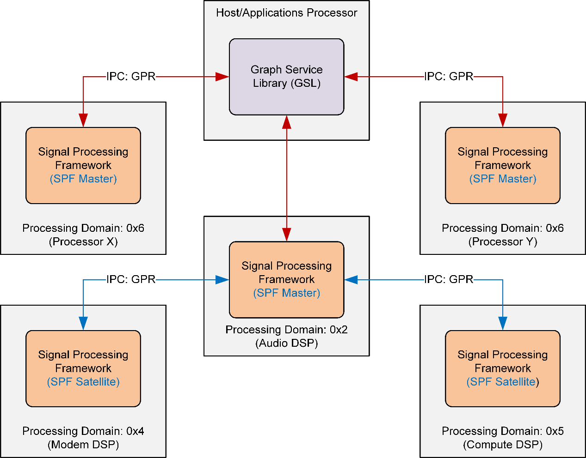
*多核和多实例配置中的 ARE*

#### 多核配置

使用多核配置将给定用例分布到多个处理域。类似于星型拓扑，每个 offload 图都以主 ARE 为起点和终点。

为避免数据或控制同步以及子系统重启机制带来的额外复杂性，各个 satellite 之间没有通信。

- 用例设计者必须为要 offload 和分布的模块提供提示（通过选择适当的处理域）。
- GSL 将此用例信息提供给 ARE（Master），后者进而与所需的 satellite 框架交互，以实现该用例。
- 分布式处理有助于有效利用系统中的处理资源，代价是可能增加延迟或功耗。因此选择用例和模块的控制权交给了用例设计者（借助 ARC）。

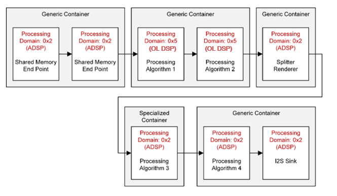
*带 offload 模块的播放——用例设计者视图*

ARE-Master 和 ARE-Satellite 都支持跨处理域的大多数能力，任何平台特定的能力或模块除外。

- 图“带 offload 模块的播放——用例设计者视图”展示了使用卸载容器将若干模块 offload 到另一处理器的简单播放用例。
- 图“带 offload 模块的播放——ARE 实现视图”表示其实现视图。
    - 带共享内存端点的卸载容器被插入到图中，以为给定的 offload 用例在主处理域和 satellite 处理域之间路由数据。
    - 由于处理器间通信开销以及卸载容器与 satellite 容器之间为启用并行处理所需的额外缓冲，这一跨处理域的额外跳转可能会增加额外的延迟。

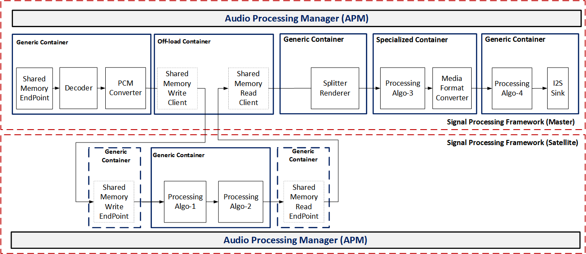
*带 offload 模块的播放——ARE 实现视图*

卸载容器可与其他参考容器互操作。它有助于跨被卸载模块传播元数据、流结束（EOS）、媒体格式和状态（START、STOP、SUSPEND）信息。

## 定制化

### 自定义模块

有关如何添加自定义模块的步骤，请参见 [How to add an Audio Module](../dev/adding_modules.md) 指南。

### 自定义容器

自定义容器的开发工作流涉及以下步骤：

1. 自定义容器必须使用在 APM 与容器之间定义的内部消息传递 API 来建立、配置、启动、停止、挂起和拆除图。
2. 自定义容器必须使用容器间消息传递，使其可与其他参考容器互操作。
3. 按上述准则开发自定义容器，并满足指定的调度策略和性能需求。
4. 用这个新的自定义容器更新受支持模块的头文件。
5. 用入口点函数更新内部容器数据库表，以便 APM 能在用例建立期间创建该容器。
6. 用新的容器类型更新 APM API 头文件，并重新生成 API XML 文件（使用 h2xml 工具）。
7. 将 API XML 文件导入 ARC 平台，以查看用于创建用例图的新容器和受支持模块。

## 用例

本节列出一些使用 AudioReach 实现的常见用例。**注意：** 这不是详尽列表。

### 播放

播放用例是最常见的音频用例，它涉及解码、后处理和渲染。AudioReach 软件是数据驱动的，不对图的形状或其内容做任何假设，因为这取决于设计者，但下图可作为示例。

图被划分为 3 个子图：流（stream）、设备 PP（device PP）和全局设备（global device）。此结构与手机产品中控制音频播放的方式相一致。全局设备子图从低功耗流以及低延迟音频流 + 语音通话获取数据。设备 PP 子图执行设备特定的处理，例如多频带 DRC。流子图包含解码器、流特定处理以及音视频同步控制。在设备切换期间，例如从听筒切换到耳机，设备子图可以被换成另一个变体。

下图还展示了 5 个处理阶段。各个阶段有助于实现流水线处理，从而将负载分布到多个线程上。这些阶段被指定为容器，每个容器运行在其自己的软件线程中。通常在低功耗配置中，所有容器都以 5 ms 帧尺寸运行，而编解码器 DMA 汇容器以 1 ms 帧尺寸运行。允许任何 ≥ 1 ms 的帧尺寸。

第一个容器涉及通过写共享内存端点从客户端接收数据，对数据进行解码（任何解码器如 AAC 或 MP3 都可以替换 PCM 解码器），随后进行 PCM 转换，例如为后续处理转换为去交织格式的位宽转换。

第二个阶段包含流特定处理，例如音量控制、媒体格式转换（如采样率转换）。可以在图中的任意位置放置数据日志记录以用于调试。软暂停（soft-pause）模块有助于在暂停或恢复期间进行渐入或渐出。

分离器渲染器（splitter renderer）可以将流同步地分离到多个设备上（如有需要），并计算用于 AV 同步的会话时间。

设备后处理是多个并发流可以被混合并进一步后处理的地方。在使用简单累加器和限幅器进行混合之前，输入先使用同步模块进行同步。在全局设备 SG 中，可以进行进一步的混合（与低延迟音频），最终数据通过编解码器 DMA 汇模块渲染出去。

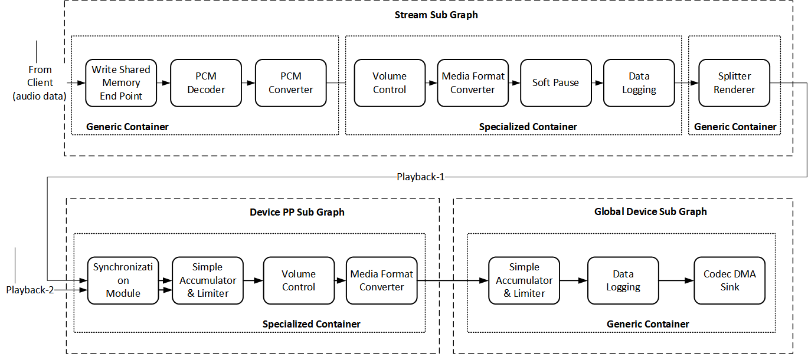

### 采集

以下采集通路包含 3 个子图和 4 个容器。通过编解码器 DMA 源从硬件接收的数据经过若干处理阶段，最终由 HLOS 通过读共享内存端点读取。

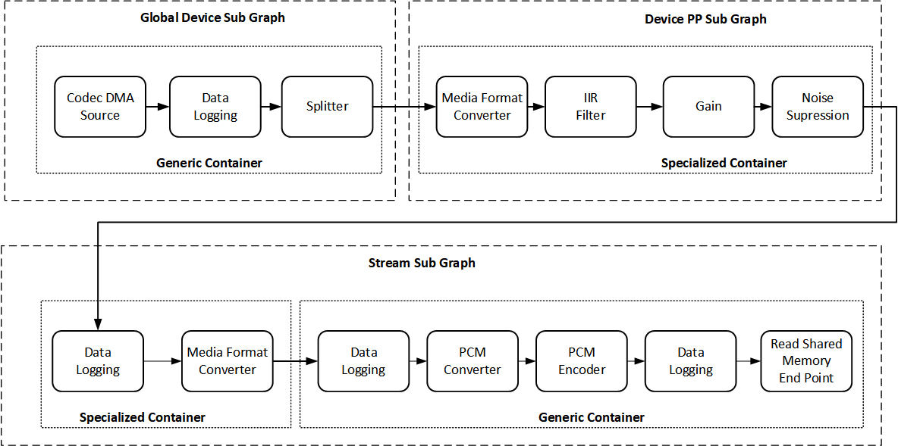

### 带源模块与汇模块的用例

以下示例图包含源模块（DTMF 生成器）和汇模块（DTMF 检测器）。

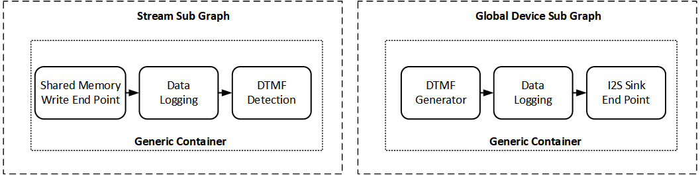

### 免提配置文件（HFP）

以下 HFP 图包含 2 个从硬件源到硬件汇的环回。还有一条用于 EC 的反馈路径。上方的图是本地设备上的麦克风通路，被发送到蓝牙（通过 I2S 连接）。下方的图是扬声器通路，其中来自 I2S 的 BT 数据在编解码器 DMA 汇上渲染。

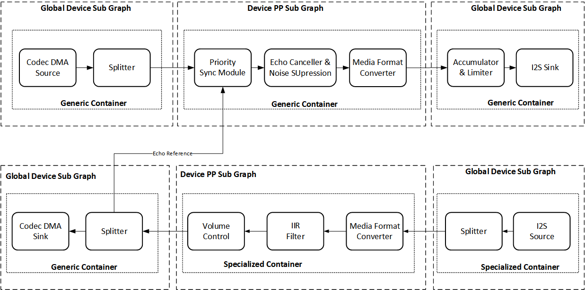

### 语音激活

语音激活用例涉及接收麦克风数据，在噪声预处理之后将其送入语音激活模块运行。历史缓冲区存储大量预滚（pre-roll）数据（> 1 秒）。每当语音激活引擎检测到关键词时，这些数据就被释放给运行在客户端上的第二阶段。这两个模块通过控制链路通信。此图既包含实时处理，也包含非实时处理。

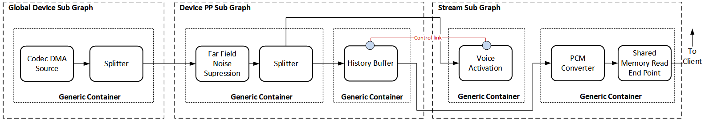

## 图设计者 FAQ

用例图必须同时满足功能需求和性能需求。图设计者通常专注于功能，而没有意识到恰当的图形状对性能的重要性。不恰当的图会消耗额外的周期开销或占用额外的内存。本章描述与图绘制相关的方面。更多信息见 [CAPI Module Development Guide](../dev/capi_mod_dev.md)。

### 应画多少个子图？

给定用例的图由一个或多个子图组成。信号处理框架（ARE）与子图无关。子图是根据客户端希望如何控制图来绘制的，例如设备切换用例要求区分流子图与设备子图。

### 应使用多少个容器？

像 GC 和 SC 这样的容器是数据处理线程（自定义容器可能有多个数据处理线程，但本指导仅考虑 GC 和 SC）。数据处理线程通常根据其帧时长周期性运行，例如端点可能每毫秒运行一次，设备 PP 可能每 5 ms 运行一次，或解码器可能每 21.33 ms 运行一次（48k 下 1024 个样本），所以使用不同容器的一个原因是处理帧时长的差异。

即使对于给定的帧时长，你也可能出于负载均衡的目的想要使用不同的容器。对于支持多个硬件线程的 Hexagon 处理器尤其如此。拥有多个容器有助于并发利用硬件线程，更快地完成工作，并允许在帧之间有更长的休眠时长。

信号触发模块是中断或定时器驱动的。目前一个容器仅支持一个信号触发模块。此外，某些模块仅在特定容器类型中受支持，例如编码器仅在 GC 中受支持。

使用大量容器会因栈、实例内存和缓冲区内存而增加内存需求。对于容器的每个阶段，通常会增加双缓冲。这可能会增加数据通路延迟。更多的容器也意味着在开销上使用更多的 MIPS。

有时子图边界可能会影响所需容器的数量，例如一个超低延迟（ULL）流在 2 个设备上渲染：听筒和扬声器。在独立用例中，可以将 ULL 流 SG 放在一个端点容器中。但是，如果有 2 个使用不同容器的端点，而我们把流 SG 放在设备容器中，那么在设备切换期间流也会被拆除；由于这不可接受，我们需要将流 SG 放在其自己的容器中。

对于非常小的帧尺寸（≤ 1 ms），当容器内没有子图边界时，周期开销可能会降低。详细来说，考虑图 [{A->B}->{C->D}]，在此图中方括号表示容器边界。花括号表示子图边界，A、B、C、D 是模块实例。此图中容器内存在子图。然而在此图中：{[A->B->C->D]}，容器内没有子图边界。此图 {[A->B]->[C->D]} 同样在容器内没有子图边界。

### 我应该用 SC 还是 GC？

某些模块仅在 GC 中受支持，某些可能仅在 SC 中可用。模块的 h2xml 指定了受支持的容器类型。

通用容器可以满足大多数需求，除了：

- 移动用例中 PP 模块链的功耗优化
- 特殊的同步需求，例如语音通话的智能同步
- 背靠背的速率匹配或分数重采样模块，即样本滑移（sample slip）> MFC 进行分数重采样

如果你只有 PP 模块（包括 sync、SAL、splitter、EC、滤波器、效果器等），推荐使用 SC。GC 对 PP 模块的支持主要在这些模块必须与其他仅 GC 支持的模块协同工作时才使用。

### 如何提升效率？

内存、MIPS（开销）和延迟是一些 KPI，除非使用高效的图，否则无法改善。一些通用准则是：

- 保持最优的容器数量
- 有些图有不服务于任何目的的额外容器。如果可能且更优，则合并容器
- 移除不必要的模块
- 图中的每个模块因其存在而增加开销（MIPS 或内存）
- 即使被禁用的模块也可能造成额外开销
- 质疑图中每个模块的必要性
- 移除模块之间任何不必要的连接
- 通过尝试重新排序模块来减少媒体格式转换
- 降低帧时长会增加 MIPS 开销。
- 仅在较小帧尺寸下保留必要的模块。如果不关心延迟，就使用较长的帧尺寸
- 信号触发容器在 MIPS 方面通常更优，因为信号触发容器中使用的调度策略
- 使用 ARC 在线模式确认在你的用例运行时只有为该用例设计的模块在运行。有时 HLOS 可能会启动一些不需要的后台图。使用 ARC IRM 工具在各个层级（整体处理器、用例或模块级）测量 MIPS 和内存

更多模块特定的准则可参考 [CAPI Module Development Guide](../dev/capi_mod_dev.md)

## 缩略语与术语

| 缩略语或术语 | 定义 |
| --- | --- |
| ACDB | Audio Calibration Data Base |
| AMDB | Audio Module Data Base |
| APM | Audio Processing Manager |
| CAPI | Common Audio Processor Interface |
| GC | Generic Container |
| GSL | Graph Service Library |
| ICB | Inter-container buffering |
| IPC | Interprocessor communication |
| IRM | Integrated Resource Monitor |
| NRT | Non-Real Time |
| OLC | Off-load Container |
| Opcode | Operation code |
| POSAL | Platform and Operating System Abstraction Layer |
| RAT | Rate Adaptive Timer |
| RT | Real Time |
| RTOS | Real Time Operating System |
| SC | Specialized Container |
| SDK | Software development kit |
| ARE | AudioReach Engine |
| ARC | AudioReach Creator |
| SPF | Signal Processing Framework |
| VoIP | Voice over IP |
