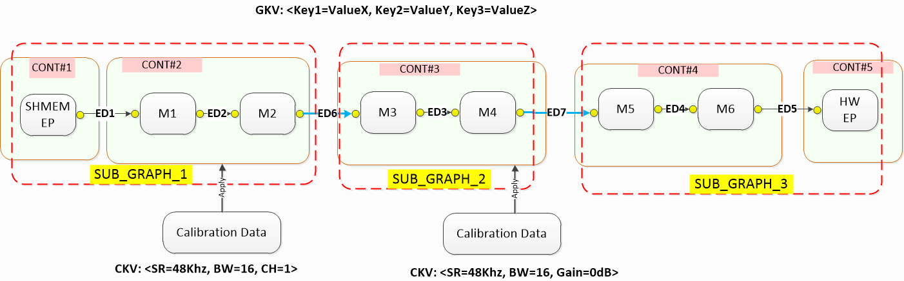
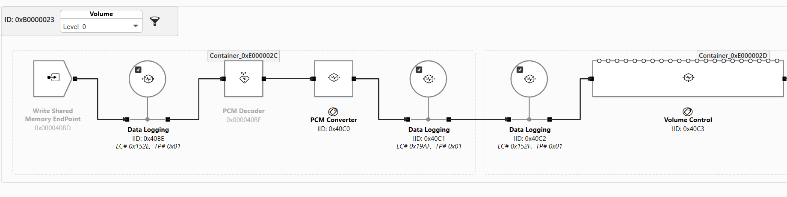
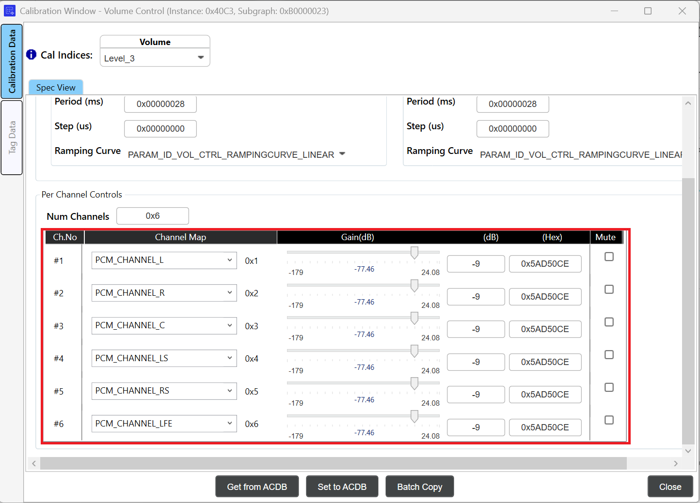
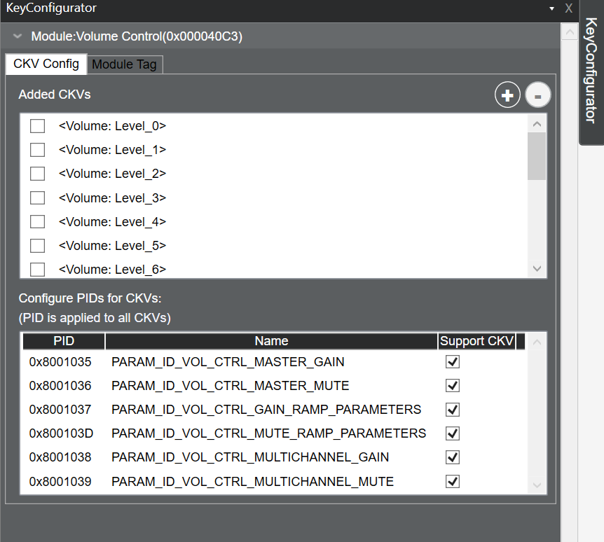
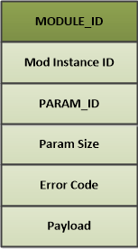
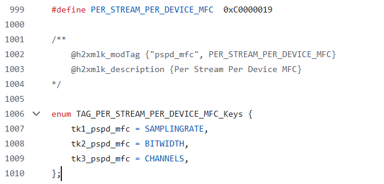
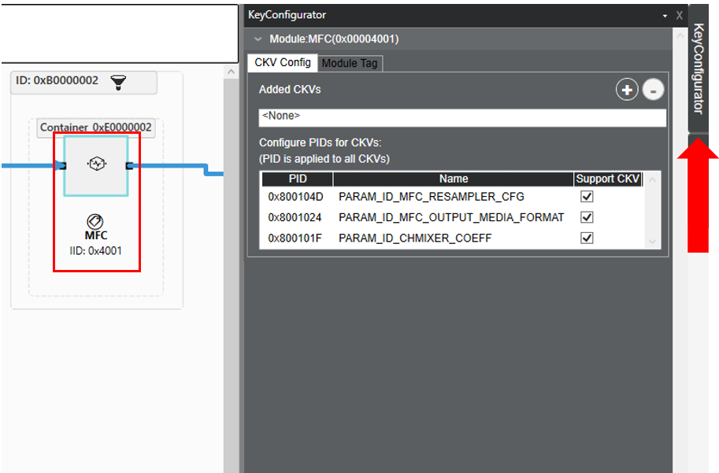
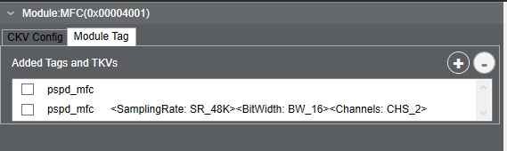
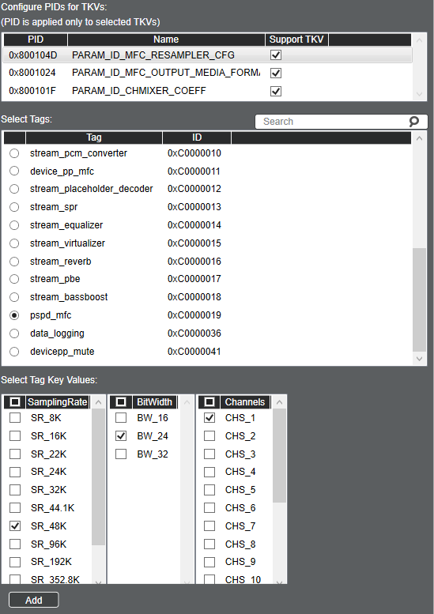
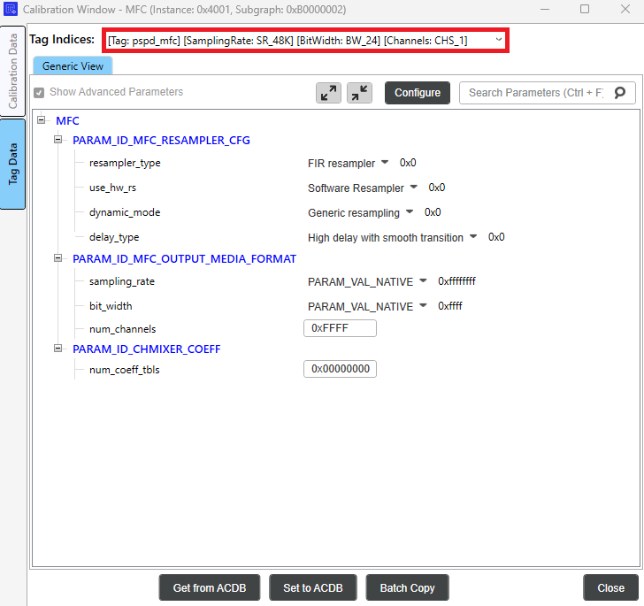

# AudioReach 概念与术语

- 简介
- 用例到音频图的映射
    - 图（Graphs）
    - 键与值（Keys and Values）
    - 图键向量（GKV）
- 用例到校准数据的映射
    - 校准键向量（CKV）
- 模块识别与配置
    - 标签键向量（TKV）
    - 数据交换模式
- 通过 H2XML 实现数据驱动

## 简介

AudioReach 软件的设计与实现围绕以下核心概念及相关术语展开。在使用 AudioReach 开发音频应用之前，开发者理解这些概念非常重要：

- 音频图
- 键向量
- 模块识别与配置
- 用例到音频图的映射
- 用例到校准数据的映射
- 通过 H2XML 实现数据驱动

本文档将提及 AudioReach 引擎（或 ARE），它是 AudioReach 的信号处理框架。有关 AudioReach 引擎的更多信息，请参阅 [AudioReach Engine](arspf_design.md) 页面。

## 用例到音频图的映射

在 AudioReach 中，用例被表示为音频图，其中包含一系列从源端点到汇端点相互连接的音频模块。以下各节将讨论 AudioReach 中音频图的不同组成部分、如何配置音频用例的各个方面，以及这些概念在 AudioReach Creator 中是如何呈现的。

### 图（Graphs）

- **图（graph）**是一个或多个连接在一起的子图组成的逻辑表示，用于实现特定用例。数据在该图中流动以实现用例。
    - 最简单的图可以是一个由单个模块组成的子图。
- **子图（Subgraphs）**是对一组连接在一起、作为单一实体进行操纵的模块的逻辑抽象。它们用于在用例切换时独立地控制图的某些部分。
    - 将用例划分为子图的目的是让图管理更容易。当用例发生变化或设备切换发生时，并不总是需要更改图中的所有模块。子图使得更新只应用于图的一部分成为可能。
    - 使用子图可以减少完成所有用例的完整设备调参所需的条目数量。
- **模块（Modules）**是 DSP 或软件中的独立块，用于完成用例的某个方面。它们是信号处理框架内最小的独立处理单元。在 AudioReach 中，从端点到端点的每一个功能都被表示为一个模块。模块的一些示例包括硬件源和汇、软件内存端点，以及诸如滤波、数据日志记录和计量等音频处理。
- **容器（Containers）**是 AudioReach 引擎特有的概念。它们允许系统设计者将音频处理模块分组，并在单个软件线程中一起执行。

有关上述每个概念的更详细信息，可在 [AudioReach Engine](arspf_design.md) 页面中找到。

下图展示了一个典型音频播放用例图的关键构造和组成，该图由多个子图组成。在每个子图内部，有多个模块，它们都被分配了唯一的 ID（实例 id），并且可以被分组到一个或多个容器中。请注意，容器不一定只与一个子图关联。

*音频播放图示例*

将音频图拆分为子图使音频系统设计者能够将音频处理模块分组为更高层的构造，例如流侧（stream-leg）和设备侧（device-leg）。然后，设计者可以开发中间件层，以流和设备的形式管理音频用例以及汇/源端点。端点可以是硬件基座（例如 I2S），也可以是软件基座（例如用于在客户端与 AudioReach 引擎之间交换音频采样的共享内存）。在状态转换期间（例如将音频输出切换到不同的汇端点时），中间件层只需拆除设备侧子图，同时保留流侧子图。然后，用例可以通过为新的汇端点实例化另一个设备侧子图并将其重新连接到流侧子图以构成新的完整图，从而恢复运行。

### 键与值（Keys and Values）

**键（key）**是一个抽象实体，包含若干个用于唯一标识音频用例某个方面的值。

**键向量（key vector，KV）**是一个通用术语，用于描述一组键值。每个 KV 可包含一个或多个键值对。通过使用不同的 KV，可以实现多种用例和校准。在 AudioReach 中，有三种 KV：

- **图键向量（GKV）** – 定义一个用例。键值被应用到用例内的子图上。图或系统设计者在从 ARC UI 画布创建子图时，会关联一组唯一的 <keys> 和 <values>。
- **标签键向量（TKV）** – 也称为模块标签（Module Tag）。应用到需要在运行时进行参数控制的单个模块上。每个模块标签可包含一个或多个键，这些键可以以 TKV 的形式按模块逐个应用。
- **校准键向量（CKV）** – 在单个用例内定义各种校准（例如采样率或音量依赖关系）。键值被应用到单个模块上。

**键值对（Key-value pairs）**是键向量中单个的键及其关联的值。例如，声音设备可以是一个键，而值可以是耳机、扬声器或其他声音设备。

AudioReach 中启用的完整键和值列表可在**音频校准数据库**（或 ACDB）中的文件 [kvh2xml.h](https://github.com/AudioReach/audioreach-conf/blob/master/linux/kvh2xml.h) 中找到。

### 图键向量（GKV）

**GKV**，也称为用例 ID，是一个键值对向量，用于唯一标识整个图。这些键值对用于选择子图的唯一组合以实现完整的用例。

#### GKV 示例

以下是一个低延迟播放图的 GKV 示例集：

- [StreamRx: PCM_LL_Playback] [DeviceRX: Speaker] [Instance: Instance_1] [DevicePP_Rx: Audio_MBDRC]

GKV 在运行时由 PAL 层（audioreach-pal）管理。当打开新流时，请求的流类型将被发送到 pal_stream_open API。这些流类型被映射到 StreamRx 键值。因此，在打开新流时，PAL 将分配所需流类型的下一个可用实例，并映射正确的实例键和值。设备类型也是如此。例如，如果 pal_stream_open 的调用者将输出设备指定为“Speaker”，PAL 会将其映射到相应的 Speaker GKV。

请注意，更改键值并不会自动更改拓扑。在进行自定义时，必须小心确保键值与其各自的子图拓扑相匹配。这四个键值合在一起构成完整的 GKV，从驱动侧的视角进行寻址。然而，从系统设计者的视角来看，这些键值可以灵活地分配给子图。每个子图都有一个 SGKV，它始终由一个或多个图键值组成。这使得系统设计者能够从一组简单的图键值中实现可能很复杂的子图配置。

## 用例到校准数据的映射

一旦图被加载到 ARE 上，下一步就是为图中的所有模块推送相应的校准数据，以便模块能为目标用例产生期望的声学输出。校准数据到用例的映射是通过用键向量（CKV）形式的校准句柄查询 ACDB 来完成的，如图“音频播放图示例”所示。

通常，所应用的校准数据高度依赖于运行时参数，例如采样率、位宽、通道数、增益等。因此，系统设计者很可能会将这些运行时参数用作键。

### 校准键向量（CKV）

**CKV** 在每个模块的层级上进行分配，以实现用例的特定校准。校准键使得在单个子图内实现多种校准成为可能。子图中的每个模块可能依赖于零个、部分或全部可用的 CKV，具体取决于系统设计者的选择。系统设计者还可以选择将某些模块参数组纳入或排除在 CKV 依赖之外。例如，一个用例可能需要针对不同采样率进行不同的模块调校。使用 CKV，用户可以指定哪些模块和模块参数依赖于采样率或与采样率无关。这简化了校准条目的总数，并减少了校准之间不必要的复制。

当为一个模块分配多个 CKV 时，校准条目的数量为 n*m，其中 n 和 m 是每个键所使用的值的数量。例如，如果一个键有 4 个值，另一个键有 6 个值，那么当两者都被分配给单个模块时，校准条目总数将为 24。

#### CKV 示例

考虑低延迟播放用例中的 Device 子图（注意：这是用于 RB3 Gen2 设备的低延迟播放图）。

该子图中使用的 CKV 以下拉菜单的形式显示在子图的顶部栏中。

通过从下拉菜单中选择 CKV，系统设计者或调参工程师可以为整个子图调用特定的校准。这可以一次影响多个模块，也可以只影响一个模块。在此例中，设置音量级别将更改 Volume Control 模块的校准。选择音量级别将更改所有通道的增益值。例如，将音量校准设置为“Level_3”将在 Volume Control 模块中把增益值提高指定的数量，如下图所示：

可以使用 Key Configurator 查看或修改 CKV。

可以使用批量复制功能将参数从一个校准复制到另一个校准。

## 模块识别与配置

一个用例可能需要在运行时启用/禁用/配置某些能力，例如可控的音频效果：均衡器、音量和回声消除。这种能力可以由音频图中的一个或多个模块来支持。不同的算法开发者可以开发支持相同能力但配置参数不同的模块。音频系统设计者可以为其产品选择其中某一个模块而非另一个。

由于实现该能力的模块在不同子图之间可能不同，而软件又不希望被硬编码为只能与固定的一组模块协同工作，因此需要一种以通用方式识别和配置这些模块的机制。AudioReach 架构将这种通用的识别和配置机制称为“打标签（tagging）”。

### 标签键向量（TKV）

模块标签，或称 **TKV**，是设置在模块上的一个标识符，用于识别并设置运行时可控的参数。

例如，一个音频应用可能需要支持在运行时打开或关闭回声消除。为此，音频系统设计者可以定义一个标签“echo cancellation”，以及键“ON”和“OFF”。然后，可以将这个标签-键对用于图中的 EC 模块。

之后，当需要启用/禁用/配置回声消除时，软件通过传入标签和键，从音频校准数据库中获取被打标签的模块信息和配置参数。这使得软件能够在运行时以通用的方式寻址配置数据，并将其打包发送到运行在 AudioReach 引擎上的目标模块。

在 AudioReach 架构中，与 ARE 交换的命令和事件始终按照下图所示的方式打包。

*模块参数结构*

这种能力可以由音频图中的一个或多个模块来支持。此外，不同的算法开发者可以开发支持相同能力但配置参数不同的模块。

每个模块标签可包含一个或多个键，这些键可以以 TKV 的形式按模块逐个应用。可以为一个模块应用多个 TKV 以对应不同的状态。其他模块标签可能没有关联的键。在这种情况下，只有标签被应用到模块上。

#### TKV 示例

考虑 Media Format Converter（或 MFC）模块，它用于转换音频流的媒体格式。在音频播放用例期间，MFC 可以将音频片段的媒体格式转换为设备端点所支持的配置。例如，如果输出流是 44.1K 采样率，但后端设备被配置为 48K，MFC 会将输出流转换为 48K 以匹配输出设备。这是通过使用标签 pspd_mfc 来实现的，该标签包含用于采样率、位宽和通道数的键。配置此标签的源代码可在 AGM 测试应用 agmplay.c 中的 [configure_mfc](https://github.com/AudioReach/audioreach-graphmgr/blob/5a78c5df2b45db3c5f024fffb12a9a83a61af4ff/plugins/tinyalsa/test/agmplay.c#L455) 函数中找到。此标签的定义列在下面的 kvh2xml.h 文件中：

可以通过 AudioReach Creator 中的“Key Configurator”选项卡将 TKV 分配给模块。查看方法：

1. 在顶部栏中，选择“View”，然后选择“Key Configurator”。右侧将出现一个 Key Configurator 选项卡
2. 在图视图中选择一个模块。
3. 选择右侧的 Key Configurator 选项卡。

1. 选择 Module Tag 选项卡。模块当前已分配的标签可在顶部看到（如果为空，则表示该模块没有分配任何标签）：

每组模块参数（称为参数 ID（PID））都可以由模块标签控制。在上面的示例中，pspd_mfc 标签被分配了三个 TKV：Sampling Rate、Bit Width 和 Channels。在 Module Tag 选项卡中，用户可以通过选择“Start Graph Modification”，然后选择 Module Tag 选项卡右上角的加号按钮，来添加带有额外一组受支持 TKV 的新标签。

下面展示了如何添加一个新的 pspd_mfc 标签索引，并带有更新后的采样率、位宽和通道值的示例：

一旦在 Key Configurator 窗口中添加了标签值，就可以为每个模块标签条目设置新的参数值。关闭 Key Configurator，并在图视图中双击该模块以打开 Calibration Window。

在左侧边栏中点击 Tag Data 以显示模块标签校准。然后点击 Tag Indices 下拉菜单，为每个标签索引设置参数。新添加的标签值可在此看到。现在，可以根据期望的输出媒体格式来选择标签索引。

### 数据交换模式

校准/配置数据可以以不同的模式应用到目标模块上。模式的选择取决于模块是否实现了该模式，同时要考虑配置数据的大小、可用于存放校准数据的内存，以及内存访问要求（只读、读写）。有关数据更改模式的更多信息，请参阅 [Calibration and configuration](arspf_design.md)。请注意，在撰写本文时，GSL 不支持共享-持久（shared-persistent）校准。

## 通过 H2XML 实现数据驱动

H2XML（Header to XML）是一个通用工具，用于从带注解的 C 头文件生成 XML 文件。注解的语法和文法与 Doxygen 类似。H2XML 在支撑数据驱动工作流方面发挥了重要作用。例如，音频算法开发者可以使用 H2XML 从模块头文件生成其处理模块的元数据（以 XML 文件的形式），并通过 ARC 工具将生成的 XML 文件导入 ACDB，从而将音频处理模块纳入用例图设计并进行配置。
