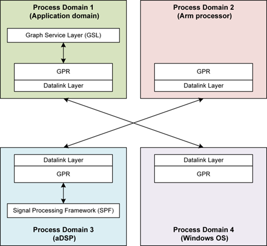
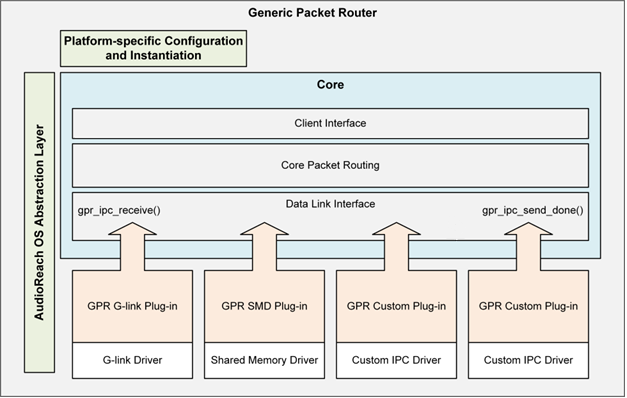
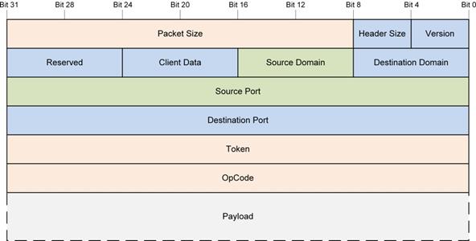
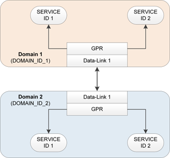
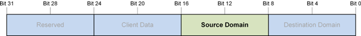
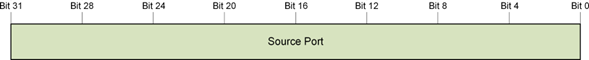
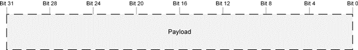
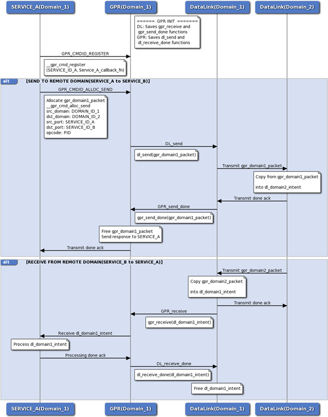

# 通用包路由器（Generic Packet Router）

- 引言
    - 目的
- 功能概述
    - GPR 基础设施
    - API 消息模型
    - GPR 协议
    - 常规操作
- 路由
    - 本地路由
    - 远程路由
- GPR 基础设施接口
    - GPR 常量与宏
    - Define 文档
- GPR 状态码与错误码
    - Define 文档
- GPR 核心包结构
    - 数据结构文档
- 回调函数原型
    - Typedef 文档
- GPR 核心例程
    - 函数文档
- GPR 基础控制
    - 注册服务
    - 注销服务
    - 查询已注册的服务
    - 查询本地域或主机域
    - 查询包池信息
    - 发送异步消息
    - 分配用于投递的空闲消息
    - 从队列中释放一个包
- GPR 实用控制
    - 分配消息的一部分
- 分配并发送消息
    - 函数文档
- 接受命令消息
    - 函数文档
- 发送命令响应
    - 函数文档
    - GPR 标准响应操作码
- IPC 接口
    - GPR 到 IPC 的回调函数
    - IPC 到 GPR 的虚函数封装
    - IPC 数据链路函数原型
    - 用于本地路由的 GPR 函数
    - 平台相关的配置封装
- 自定义实现
    - 自定义平台封装
    - 自定义域 ID
    - 自定义 IPC 数据链路或传输层
- 缩略语与术语

## 引言

### 目的

本文档描述通用包路由器（GPR）API，旨在帮助开发者理解并使用 GPR 来访问或发布新的服务。假定读者是对基于包和基于消息的协议有一定了解的开发者。本文档提供使用 GPR API 所提供的各项功能所需的公共接口，同时还给出了功能概述以及如何利用这些接口功能的相关信息。

## 功能概述

本章概述 GPR 基础设施与协议。

### GPR 基础设施

GPR 基础设施在不同的平台、软件层和处理器域之间提供一套通用的 API，使它们能够通过异步消息进行通信。该基础设施是一个内存优化、与平台无关的层。下图展示了 GPR 基础设施在不同处理器域（例如应用域、DSP 域等）上的一个示例。GPR 也可以用于不同的平台，例如 Arm 处理器和 Windows 操作系统。参见“不同处理域上的 GPR 基础设施”。


*不同处理域上的 GPR 基础设施*

AudioReach 引擎（ARE）提供了借助各种算法模块和框架模块实现音频与语音用例所需的框架（参见 [AudioReach 引擎](arspf_design.md)）。图服务层（GSL）作为客户端，与 ARE 交互以提供用例配置和校准。在 AudioReach 框架中，GPR 负责在 ARE 与 GSL 处理域之间路由消息和命令。它通过抽象出底层的处理器间通信（IPC）数据链路层来实现这种远程通信。本质上，GPR 执行两类路由：

- 本地路由——同一处理器域内的通信。
- 远程路由——不同处理器域之间的通信。GPR 通过与数据链路层交互来实现这种远程路由。

#### GPR 软件分层

GPR 基础设施分为三层：核心层、数据链路层和平台层。下图展示了这一简化模型。


*GPR 分层模型*

#### 核心层

核心层实现 GPR 的核心功能，可进一步细分为以下功能块。

- 客户端接口
    - 实现所有客户端使用的核心 GPR API，例如发送包、分配包等。
- 包路由层
    - 实现 GPR 包队列。
    - 负责本地路由，即在同一处理器域内传输的包。
- 数据链路接口
    - 是 GPR 与数据链路层之间的接口。
    - 实现与每个数据链路层共享的 GPR 回调函数。
    - 这些函数称为 *GPR-to-IPC* 回调函数，对于实现远程路由至关重要（参见“GPR 到 IPC 的回调函数”一节）。

#### 数据链路层

GPR 数据链路层负责远程路由，即不同处理器域之间的路由。每个数据链路实现都有两部分：

- 核心数据链路层
    - 包含数据链路传输层 API 及功能的实际实现，以促成远程路由。
    - 数据链路层的示例包括通用链路（Generic Link，G-link）和共享内存驱动（Shared Memory Driver，SMD）。
- GPR 数据链路插件
    - 是核心数据链路层的封装。
    - 实现 IPC-to-GPR 回调函数（参见“IPC 到 GPR 的虚函数封装”一节），这些函数在初始化期间与 GPR 数据链路接口共享。

#### 平台层

平台层包含所有与平台相关的实现，使 GPR 能够与平台无关。它由两部分组成：

- 平台相关的配置封装
    - 使每个平台能够用平台相关的配置来实例化 GPR（参见“平台相关的配置封装”一节）。
- 通用操作系统抽象层（OSAL）
    - GPR 核心层以及 GPR 数据链路插件层都使用该层。

### API 消息模型

#### 异步消息设计

GPR 基础设施采用异步消息设计，能够快速投递单向消息，并支持在中断上下文中传递消息。

#### 消息结构

GPR 基础设施定义了 GPR 消息发送函数、消息接收回调函数以及消息结构。当前的 GPR 协议使用 4 字节对齐、小端序的消息。任何无法识别的消息都会导致 GPR 发送消息函数返回错误。发送方需要负责释放未投递的消息，并妥善处理返回的错误。**注意：** 在 GPR 基础设施中，消息和包这两个术语可以互换使用。

### GPR 协议

GPR 协议是运行在 GPR 基础设施之上的核心消息协议，具有以下特性：

- 在客户端应用与软件层之间提供标准的、具备实时能力的消息协议。
- 是一个轻量层，协议开销极小。
- 与平台无关。
- 要求底层的数据层和传输层保证串行投递。
- 假定客户端和子系统能够从未投递或延迟的事务中恢复。

#### 包详情

下图展示了 GPR 消息/包结构（gpr_packet_t），其中顶部的数字表示比特位。以下各节提供更多细节。


*包含所有字段的 GPR 包数据结构*

#### 大小与版本字段


下表给出这些字段的信息。

| **子字段** | **比特数** | **描述** |
| --- | --- | --- |
| Version | 4 | 定义包结构的布局。除非另有说明，否则假定各包版本向后兼容核心格式（前五个头部字）。 |
| Header Size | 4 | 从包起始处开始的 32 位头部字的数量。 |
| Packet Size | 24 | 包的总大小（字节），包含头部和负载数据。 |

#### 源域与目的域字段

GPR 消息协议使用域 ID 来定义主机进程、处理器或目标，并使用服务 ID 来定义驻留在主机内的服务或模块。每个域都必须有一个专用的本地 GPR 实例。所有消息都必须流经其本地 GPR 实例。GPR 根据每条消息的目的域值在本地或远程分派消息。下图展示了两个域，每个域都有自己的 GPR 实例。


*进程间通信示例*

下图展示目的域字段，它表示包被发送到的、承载有 GPR 的处理器或脱机（off-target）位置。


下图展示源域字段，它表示包从中发出的、承载有 GPR 的处理器或脱机（off-target）位置。



#### 客户端数据字段

客户端数据字段用于客户端特定的需求。默认情况下，未使用时该字段必须设为 0。下图展示该字段，其中 4 位供客户端使用，4 位保留并设为 0。


#### 保留字段

保留字段必须始终设为 0。


#### 源端口与目的端口字段

源端口字段表示一个（在给定域内）唯一的 ID，可用于标识源域中的服务或模块。它被解释为源服务或模块实例的服务 ID。**注意：** 术语 *port* 和 *service ID* 可以互换使用。



目的端口字段表示一个（在域内）唯一的 ID，可用于标识目的域中的服务或模块。它被解释为目的服务的服务 ID，或目的模块的模块实例 ID。


#### 令牌字段

令牌字段没有子字段。它是一个事务标识符、序列号，或者任何允许客户端在收到命令响应消息后识别哪条命令已完成的值。未使用时，令牌字段必须设为 0。


#### 操作码字段

操作码是一个 GUID 值，用于选择操作并定义负载结构。操作选择函数调用，负载则包含函数参数。


#### 负载字段

负载字段没有子字段。它包含操作码字段（在“操作码字段”一节中定义）所指定的函数调用的参数。



### 常规操作

#### 寻址方案

给定 GPR 包的源或目的由一个 32 位的服务 ID（参见“源端口与目的端口字段”一节）以及该服务所属的 8 位处理器域（参见“包详情”一节）来标识。对于给定的服务，服务 ID 在域内必须唯一。域内所有服务具有相同的域 ID。

#### 注册

要发送或接收包，每个服务或模块都必须先向 GPR 注册。注册可以在任何时候通过调用 gpr_cmd_register() 函数来完成，以注册该服务的包回调函数。GPR 的每个实例都维护一个数据库，在注册时存储该服务 ID 信息以及对应的回调函数和回调参数（如果非 NULL）。每当有新服务注册时，就会向数据库添加一个条目。数据库中的所有条目都可以通过其唯一的服务 ID 来标识。

#### 注销

在下电序列期间，服务或模块必须通过调用 gpr_cmd_deregister() 从 GPR 注销。每个已注册的服务 ID 只能注销一次。

#### 发送消息

服务或模块使用 gpr_cmd_async_send() 通过 GPR 服务以包的形式发送消息。调用者必须检查 gpr_cmd_async_send() 的返回结果以判断是否失败，在发送函数失败时释放包，并在必要时执行错误恢复。底层的 gpr_cmd_async_send() 函数将包的分配和错误管理交由调用者处理。有一些实用 API 可用于简化 gpr_cmd_async_send() 的使用，但它们并非强制使用。调用者可以使用任何实用库来协助包分配和错误管理。

#### 接收消息

服务在向 GPR 服务注册后即可立即开始接收消息。假定已注册的包回调例程运行在 ISR 上下文中。ISR 上下文中的所有限制都适用于该包回调例程。在 ISR 上下文中处理的消息拥有尽可能高的优先级。任何耗时的操作都必须排队到线程上下文中，以便在合适的线程优先级下进一步处理。你不能在分派上下文中调用阻塞例程。阻塞会导致系统不稳定和性能问题。

## 路由

路由是指 GPR 向客户端或其他 GPR 实例发送和接收数据包的能力。根据源域 ID 和目的域 ID，GPR 必须执行本地路由或远程路由。下图展示了本地路由与远程路由之间的区别，后续各节将对此进行说明。


*通过 GPR 进行的本地路由与远程路由*

### 本地路由

本地路由是指同一域内的包传输。如果源域 ID 和目的域 ID 相同，GPR 就判定给定路由为本地路由。在这种情况下，GPR 只需根据唯一的目的服务 ID 搜索其数据库以检索回调函数。检索到回调函数后，就调用目的服务的回调例程并发送包。下图展示了同一域上两个服务之间的调用流程。两个服务都必须先向 GPR 注册各自的回调函数，然后才能交换消息。


*同一域上两个服务之间的本地路由调用流程*

### 远程路由

远程路由是指不同域或处理器之间的包传输。GPR 与 IPC 数据链路层在初始化期间进行交互并交换 GPR-IPC 回调函数（参见“GPR 到 IPC 的回调函数”和“IPC 到 GPR 的虚函数封装”两节）。随后在运行时调用这些回调函数以实现远程路由。下面的“远程路由调用流程”图展示了远程路由的调用流程。每个域上的服务都必须向各自的 GPR 实例注册。以下是向远程处理器发送包的过程：

1. GPR 分配一个包，并调用数据链路层的 send() 函数，该函数存储在 ipc_to_gpr_vtbl_t 虚函数表（vtable）中。
2. 数据链路层完成包的传输后，会调用 GPR 的 send_done() 函数，该函数存储在 gpr_to_ipc_vtbl_t 虚函数表中。

以下是远程处理器接收包的过程：

1. 数据链路层将远程 GPR 包的内容拷贝到自己的某个包中。
2. 然后它调用 GPR 的 receive() 函数，该函数存储在 gpr_to_ipc_vtbl_t 虚函数表中。该 vtable 调用 GPR 的 receive() 函数，将包传输到其目的地。
3. GPR 完成包的传输后，会调用数据链路层的 receive_done() 函数，该函数存储在 ipc_to_gpr_vtbl_t 中。该 vtable 调用数据链路层的 free() 函数以释放包。


*GPR 与 IPC 数据链路层之间的远程路由调用流程*

## GPR 基础设施接口

### GPR 常量与宏

**GPR 核心导出宏**

- #define GPR_INTERNAL extern “C”
- #define GPR_EXTERNAL extern “C”

**GPR 域 ID**

域 ID 是一个唯一 ID，用于标识承载 GPR 的进程、处理器或脱机（off-target）位置。已发布的各域之间的传输机制可能各不相同。域 ID 被直接用作访问 GPR 路由数组的端口索引。因此它们的取值必须始终从 0 开始，如 0、1、2、3，而不能是全局唯一 ID（GUID）。

- #define GPR_IDS_DOMAIN_ID_INVALID_V 0
- #define GPR_IDS_DOMAIN_ID_MODEM_V 1
- #define GPR_IDS_DOMAIN_ID_ADSP_V 2
- #define GPR_IDS_DOMAIN_ID_APPS_V 3
- #define GPR_IDS_DOMAIN_ID_SDSP_V 4
- #define GPR_IDS_DOMAIN_ID_CDSP_V 5
- #define GPR_PL_MAX_DOMAIN_ID_V
- #define GPR_PL_NUM_TOTAL_DOMAINS_V

**GPR 包定义**

- #define GPR_PKT_VERSION_V
- #define GPR_PKT_INIT_PORT_V
- #define GPR_PKT_INIT_RESERVED_V
- #define GPR_PKT_INIT_DOMAIN_ID_V
- #define GPR_PKT_HEADER_WORD_SIZE_V
- #define GPR_PKT_HEADER_BYTE_SIZE_V
- #define GPR_UNDEFINED_ID_V
- #define GPR_PKT_INIT_CLIENT_DATA_V
- #define GPR_PKT_VERSION_MASK ( 0x0000000F )
- #define GPR_PKT_VERSION_SHFT ( 0 )
- #define GPR_PKT_HEADER_SIZE_MASK ( 0x000000F0 )
- #define GPR_PKT_HEADER_SIZE_SHFT ( 4 )
- #define GPR_PKT_RESERVED_MASK ( 0xFFF00000 )
- #define GPR_PKT_RESERVED_SHFT ( 20 )
- #define GPR_PKT_PACKET_SIZE_MASK ( 0xFFFFFF00 )
- #define GPR_PKT_PACKET_SIZE_SHFT ( 8 )
- #define GPR_GET_BITMASK(mask, shift, value)
- #define GPR_SET_BITMASK(mask, shift, value)
- #define GPR_GET_FIELD(field, value)
- #define GPR_SET_FIELD(field, value)
- #define GPR_PTR_END_OF(base_ptr, offset)
- #define GPR_PKT_GET_PACKET_BYTE_SIZE(header)
- #define GPR_PKT_GET_HEADER_BYTE_SIZE(header)
- #define GPR_PKT_GET_PAYLOAD_BYTE_SIZE(header)
- #define GPR_PKT_GET_PAYLOAD(type, packet_ptr)

### Define 文档

#### #define GPR_INTERNAL extern “C”

表示某个函数是 GPR 内部函数的导出宏。

#### #define GPR_EXTERNAL extern “C”

表示某个外部函数（供客户端使用）的导出宏。

#### #define GPR_IDS_DOMAIN_ID_INVALID_V 0

无效域。

#### #define GPR_IDS_DOMAIN_ID_MODEM_V 1

调制解调器 DSP（mDSP）域。

#### #define GPR_IDS_DOMAIN_ID_ADSP_V 2

音频 DSP（aDSP）域。

#### #define GPR_IDS_DOMAIN_ID_APPS_V 3

应用域。

#### #define GPR_IDS_DOMAIN_ID_SDSP_V 4

传感器 DSP（sDSP）域。

#### #define GPR_IDS_DOMAIN_ID_CDSP_V 5

计算 DSP（cDSP）域。

#### #define GPR_PL_MAX_DOMAIN_ID_V

最高域 ID。

#### #define GPR_PL_NUM_TOTAL_DOMAINS_V

域的总数。

#### #define GPR_PKT_VERSION_V

定义包结构的布局。

#### #define GPR_PKT_INIT_PORT_V

未初始化的端口值。

#### #define GPR_PKT_INIT_RESERVED_V

未初始化的保留字段值。

#### #define GPR_PKT_INIT_DOMAIN_ID_V

未初始化的域 ID 值。

#### #define GPR_PKT_HEADER_WORD_SIZE_V

以 32 位字为单位的头部大小。

#### #define GPR_PKT_HEADER_BYTE_SIZE_V

以字节为单位的头部大小。

#### #define GPR_UNDEFINED_ID_V

期望为有效 GUID 之处的未定义值。

#### #define GPR_PKT_INIT_CLIENT_DATA_V

未初始化的客户端数据值。

#### #define GPR_PKT_VERSION_MASK ( 0x0000000F )

版本字段的位掩码。

#### #define GPR_PKT_VERSION_SHFT ( 0 )

版本字段的位移。

#### #define GPR_PKT_HEADER_SIZE_MASK ( 0x000000F0 )

头部大小字段的位掩码。

#### #define GPR_PKT_HEADER_SIZE_SHFT ( 4 )

头部大小字段的位移。

#### #define GPR_PKT_RESERVED_MASK ( 0xFFF00000 )

保留字段的位掩码。包含来自客户端数据字段的四个保留位。

#### #define GPR_PKT_RESERVED_SHFT ( 20 )

保留字段的位移。

#### #define GPR_PKT_PACKET_SIZE_MASK ( 0xFFFFFF00 )

包大小字段的位掩码。

#### #define GPR_PKT_PACKET_SIZE_SHFT ( 8 )

包大小字段的位移。

#### #define GPR_GET_BITMASK( *mask, shift, value* )

获取某个字段的值，包含指定的掩码和位移。

#### #define GPR_SET_BITMASK( *mask, shift, value* )

在某个字段中设置一个值，包含指定的掩码和位移。

#### #define GPR_GET_FIELD( *field, value* )

获取某个字段的值。

#### #define GPR_SET_FIELD( *field, value* )

在某个字段中设置一个值。

#### #define GPR_PTR_END_OF( *base_ptr, offset* )

返回一个 8 位对齐的指针，指向基地址指针加上以字节为单位的偏移量之处。

#### #define GPR_PKT_GET_PACKET_BYTE_SIZE( *header* )

给定包头部，返回该包当前的大小（字节）。当前包字节大小是基础包结构与负载已使用部分之和。

#### #define GPR_PKT_GET_HEADER_BYTE_SIZE( *header* )

给定包头部，返回该头部当前的大小（字节）。

#### #define GPR_PKT_GET_PAYLOAD_BYTE_SIZE( *header* )

给定包头部，返回该负载当前的大小（字节）。当前负载字节大小是包大小与头部大小之差。

#### #define GPR_PKT_GET_PAYLOAD( *type, packet_ptr* )

给定包，返回指向该包负载起始处的指针。

## GPR 状态码与错误码

### Define 文档

#### #define AR_EOK (0)

成功。操作已完成，没有错误。

#### #define AR_EFAILED (1)

一般性失败。

#### #define AR_EBADPARAM (2)

错误的操作参数。

#### #define AR_EUNSUPPORTED (3)

不支持的例程或操作。

#### #define AR_EVERSION (4)

不支持的版本。

#### #define AR_EUNEXPECTED (5)

遇到意外问题。

#### #define AR_EPANIC (6)

发生了未处理的问题。

#### #define AR_ENORESOURCE (7)

无法分配资源。

#### #define AR_EHANDLE (8)

无效句柄。

#### #define AR_EALREADY (9)

操作已被处理。

#### #define AR_ENOTREADY (10)

操作尚未准备好被处理。

#### #define AR_EPENDING (11)

操作正在等待完成。

#### #define AR_EBUSY (12)

操作无法被接受或处理。

#### #define AR_EABORTED (13)

操作因错误而中止。

#### #define AR_ECONTINUE (14)

操作请求介入以完成。

#### #define AR_EIMMEDIATE (15)

操作请求立即介入以完成。

#### #define AR_ENOTIMPL (16)

操作未实现。

#### #define AR_ENEEDMORE (17)

操作需要更多数据或资源。

#### #define AR_ENOMEMORY (18)

操作没有内存。

#### #define AR_ENOTEXIST (19)

项不存在。

#### #define AR_ETERMINATED (20)

操作已结束。

#### #define AR_ETIMEOUT (21)

操作超时。

#### #define AR_SUCCEEDED( *x* )

检查结果是否为成功的宏。

#### #define AR_FAILED( *x* )

检查结果是否为失败的宏。

## GPR 核心包结构

### 数据结构文档

#### struct gpr_packet_t

将包从源路由到目的所必需的核心头部结构。

| **类型** | **参数** | **描述** |
| --- | --- | --- |
| uint32_t | header | 包含头部字段的以下子字段信息。**version** 第 3 到 0 位（四位）。定义包结构的布局。**header_size** 第 7 到 4 位（四位）。头部大小是从包起始处开始的 32 位头部字的数量。**packet_size** 第 31 到 8 位（二十四位）。包的总大小（字节）。总包大小包含头部和负载大小。 |
| uint8_t | dst_domain_id | 包将被投递到的目的地的域 ID。第 0 到 7 位（八位）。域 ID 指承载 GPR 的进程、处理器或脱机（off-target）位置。所使用的传输层可能因域之间的物理链路而异。所有域 ID 值均由 GPR 保留。 |
| uint8_t | src_domain_id | 包来源的源的域 ID。第 8 到 15 位（八位）。域 ID 指承载 GPR 的进程、处理器或脱机（off-target）位置。所使用的传输层可能因域之间的物理链路而异。所有域 ID 值均由 GPR 保留。 |
| uint8_t | client_data | 用于客户端特定的需求。第 16 到 23 位（八位）。4 位供客户端使用。4 位保留并须设为 0。默认值须设为 0。 |
| uint8_t | reserved | 保留字段。第 24 到 31 位（八位）。将值设为 0。 |
| uint32_t | src_port | 包来源的服务的唯一 ID。第 31 到 0 位（三十二位）。src_port 指发送方服务向 GPR 注册的 ID。该 ID 在给定域内对于该服务必须唯一。服务指任何需要通过 GPR 发送或接收包的功能块，例如模块。 |
| uint32_t | dst_port | 包将被投递到的服务的唯一 ID。第 31 到 0 位（三十二位）。dst_port 指接收方服务向 GPR 注册的 ID。该 ID 在给定域内对于该服务必须唯一。服务指任何需要通过 GPR 发送或接收包的功能块，例如模块。 |
| uint32_t | token | 发送方提供的客户端事务 ID。第 31 到 0 位（三十二位）。 |
| uint32_t | opcode | 同时定义动作与负载结构。**支持的值：** 第 31 到 0 位（三十二位）。该操作码是一个全局唯一 ID（GUID），必须是有效值。 |

## 回调函数原型

### Typedef 文档

#### typedef uint32_t(gpr_callback_fn_t)(gpr_packet_t ∗packet, void callback_data)

包回调函数的原型。

**关联数据类型**

gpr_packet_t

**参数**

| in | *packet* | 指向传入包的指针。保证该包为非 NULL 值。 |
| --- | --- | --- |
| in | *callback_data* | 客户端提供的数据指针，由服务在注册时提供。 |

**返回值**

AR_EOK——成功时，表示被调用方已取得该包的所有权。否则返回错误（参见“GPR 状态码与错误码”）——包的所有权将返还给调用者。

## GPR 核心例程

### 函数文档

#### GPR_EXTERNAL uint32_t gpr_init ( void )

执行 GPR 基础设施的外部初始化。

每个受支持的域在系统启动期间或运行时调用该函数一次，以为该域初始化 GPR 基础设施。在调用任何其他 GPR API 之前，必须先初始化 GPR 基础设施。

**返回值**

AR_EOK——成功时。

**依赖**

无。

**代码示例**

```C
#include "gpr_api.h"

int32_t rc = gpr_init();
if ( rc )
{
    printf( "Could not initialize the GPR infrastructure" );
}
```

#### GPR_EXTERNAL uint32_t gpr_deinit ( void )

执行 GPR 基础设施的外部去初始化。每个受支持的域在系统关闭期间或运行时调用该函数一次，以为该域去初始化 GPR 基础设施。在 GPR 基础设施去初始化之后，除了 gpr_init() 之外不能调用任何函数。

**返回值**

AR_EOK——成功时。

**依赖**

无。

**代码示例**

```C
#include "gpr_api.h"

int32_t rc = gpr_deinit();
if ( rc )
{
    printf( "Could not deinitialize the GPR infrastructure" );
}
```

#### GPR_EXTERNAL uint32_t gpr_drv_init ( void )

由 gpr_init() 调用以初始化 GPR 基础设施。该函数在每个平台封装中定义（参见“平台相关的配置封装”一节），并进一步调用 gpr_drv_internal_init() 来执行 GPR 内部初始化。

**返回值**

AR_EOK——成功时。

**依赖**

无。

#### GPR_INTERNAL uint32_t gpr_drv_deinit ( void )

由 gpr_deinit() 调用以去初始化 GPR 基础设施。

**返回值**

AR_EOK——成功时。

**依赖**

无。

## GPR 基础控制

### 注册服务

#### 函数文档

##### static uint32_t gpr_cmd_register ( uint32_t *src_port,* gpr_callback_fn_t, void * callback_data)

按唯一的服务 ID 向 GPR 注册一个服务。

**关联数据类型**

gpr_callback_fn_t

**参数**

| in | *src_port* | 待注册服务的唯一 ID（在域内）。 |
| --- | --- | --- |
| in | *callback_fn* | 待注册服务的回调函数。 |
| in | *callback_data* | 指向客户端提供的、供回调函数使用的数据指针。 |

**详细描述**

服务在系统启动期间或运行时调用该命令一次，以向 GPR 注册其存在。

服务是指任何需要发送或接收 GPR 包的功能块，例如模块。服务必须先向 GPR 注册，才能发送或接收任何消息。

**返回值**

AR_EOK——成功时。

AR_EALREADY——服务已被注册。

**依赖**

必须已通过 gpr_init() 完成 GPR 初始化。

**代码示例**

```C
#include "gpr_api_inline.h"

//Example of a test client service (with service ID GPR_TESTCLIENT_SERVICE_ID)
//trying to register with GPR.
uint32_t service_callback_fn(gpr_packet_t *packet, void *callback_data);
void * callback_data = NULL;

int main ( void )
{
  int32_t rc = __gpr_cmd_register(GPR_TESTCLIENT_SERVICE_ID,
                                  callback_fn,
                                  callback_data);
  if ( rc )
  {
    printf( "Could not register the test client service with GPR" );
  }
  return 0;
}

//Example of a callback function for a service. It is invoked by GPR
//every time a message is sent or received, to or from that service.
static int32_t service_callback_fn( gpr_packet_t* packet,
                                    void* callback_data )
{
   // Accept command by replying to the sender that the message is accepted.
   // The usage is optional.
   __gpr_cmd_accept_command( packet );

   switch ( packet->opcode )
   {
     case TEST_CLIENT_CMD_FUNCTION:
     {
       // Handle accordingly based on operation code and send response to
       // the sender that command is completed.
       __gpr_cmd_end_command( packet, AR_EOK );
       break;
     }
     case TEST_CLIENT_RSP_FUNCTION:
     {
       // Notify command completion.
       // Response may contain payload, free the packet after handling.
       __gpr_cmd_free( packet );
       break;
      }
     case GPR_IBASIC_RSP_RESULT:
     {
       // Notify command completion, response contains the error status.
       __gpr_cmd_free( packet );
       break;
     }
     default:
     {
       // Free unsupported events and command responses.
       __gpr_cmd_free( packet );
       break;
     }
   }
   return AR_EOK;
   // AR_EOK tells the caller that the packet was consumed (freed).
}
```

### 注销服务

#### 函数文档

##### static uint32_t gpr_cmd_deregister ( uint32_t src_port )

从 GPR 注销一个服务。

**参数**

| in | *src_port* | 服务的唯一 ID。 |
| --- | --- | --- |

**详细描述**

服务在系统拆卸期间或运行时调用该函数一次，以从 GPR 注销其存在。

**返回值**

AR_EOK——成功时。

**依赖**

必须已通过 gpr_init() 完成 GPR 初始化。

**代码示例**

```C
#include "gpr_api_inline.h"

//Example of a test client service (with service ID GPR_TESTCLIENT_SERVICE_ID)
//trying to deregister from GPR.
uint32_t callback_fn(gpr_packet_t *packet, void *callback_data);
void * callback_data = NULL;

int32_t rc = __gpr_cmd_register(GPR_TESTCLIENT_SERVICE_ID,
                                callback_fn,
                                callback_data);
if ( rc )
{
  printf( "Could not register the client service with GPR" );
}
...
rc =  __gpr_cmd_deregister(GPR_TESTCLIENT_SERVICE_ID);
if ( rc )
{
  printf( "Could not deregister the client service from GPR" );
}
```

### 查询已注册的服务

#### 函数文档

**static uint32_t** **gpr_cmd_is_registered ( uint32_t port, bool_t *is_registered)**

由框架调用，用于检查某个服务是否已向 GPR 注册。

**参数**

| in | *port* | 服务的唯一 ID。 |
| --- | --- | --- |
| out | *is_registered* | 指向客户端提供的标志的指针，若服务已注册则返回 TRUE，若服务未注册则返回 FALSE。 |

**返回值**

AR_EOK。

**依赖**

必须已通过 gpr_init() 完成 GPR 初始化。

**代码示例**

```C
#include "gpr_api_inline.h"

//Example to check if test client service (with service ID GPR_TESTCLIENT_SERVICE_ID)
// is registered with GPR.
bool_t is_registered = FALSE;
__gpr_cmd_is_registered(GPR_TESTCLIENT_SERVICE_ID, &is_registered);
if(TRUE == is_registered)
{
  printf( "Client service registered with GPR" );
}
else
{
  printf( "Client service not registered with GPR" );
}
```

### 查询本地域或主机域

#### 函数文档

##### static uint32_t gpr_cmd_get_host_domain_id (uint32_t *host_domain_id)

查询 GPR 以获取本地域或主机域的 ID。

**参数**

| out | *host_domain_id* | 指向 GPR 主机域 ID 的指针。 |
| --- | --- | --- |

**返回值**

AR_EOK 始终返回。——返回主机域 ID。

**依赖**

必须已通过 gpr_init() 完成 GPR 初始化。

**代码示例**

```C
#include "gpr_api_inline.h"

uint32_t host_domain_id;
__gpr_cmd_host_domain_id( &host_domain_id );
printf( "GPR is in domain ID: %d ", host_domain_id );
```

### 查询包池信息

#### 函数文档

##### static uint32_t gpr_cmd_get_gpr_packet_info (gpr_cmd_gpr_packet_pool_info_t *args)

查询 GPR 的包池信息。

**关联数据类型**

gpr_cmd_gpr_packet_pool_info_t

**参数**

| out | *args* | 指向包池信息的指针，例如包的数量和大小。 |
| --- | --- | --- |

**详细描述**

该函数返回以下信息：

- GPR 分配的包的最小和最大大小（字节）。
- 每种包的最大数量。

包的数量并不代表当前可用的包数量。该数量是初始化期间分配的包的总数或最大数量。客户端可以利用该信息来决定是发送带内（inband）命令还是带外（out-of-band）命令。

**返回值**

AR_EOK——返回 GPR 包池信息。

**依赖**

必须已通过 gpr_init() 完成 GPR 初始化。

**代码示例**

```C
#include "gpr_api_inline.h"

gpr_cmd_gpr_packet_pool_info_t packet_info;
__gpr_cmd_get_gpr_packet_info( &packet_info );

printf( "GPR packet pool information:
         Bytes in minimum-sized gpr packet: %d,
         Number of minimum-sized gpr packets allocated at initialization: %d,
         Bytes in maximum-sized gpr packet: %d,
         Number of maximum-sized gpr packets allocated at initialization: %d ",
         packet_info.bytes_per_min_size_packet,
         packet_info.num_min_size_packets,
         packet_info.bytes_per_max_size_packet,
         packet_info.num_max_size_packets);
```

#### struct gpr_cmd_gpr_packet_pool_info_t

包含 gpr_cmd_get_gpr_packet_info() 的包池信息。

| **类型** | **参数** | **描述** |
| --- | --- | --- |
| uint32_t | bytes_per_min- _size_packet | GPR 包的最小大小（字节）。 |
| uint32_t | num_min_size- _packets | 初始化时分配的最小大小包的数量。 |
| uint32_t | bytes_per_max- _size_packet | GPR 包的最大大小（字节）。 |
| uint32_t | num_max_size- _packets | 初始化时分配的最大大小包的数量。 |

### 发送异步消息

#### 函数文档

##### static uint32_t gpr_cmd_async_send (gpr_packet_t *packet* )

向其他服务发送异步消息。

**关联数据类型**

gpr_packet_t

**参数**

| in | *packet* | 指向要发送的包（消息）的指针。 |
| --- | --- | --- |

**详细描述**

该函数为调用者提供对发送过程的底层控制。对于一般用途，建议使用简化的辅助函数，例如 gpr_cmd_alloc_send()。在调用该函数之前，请使用 gpr_cmd_alloc() 或 gpr_cmd_alloc_ext() 分配用于发送的空闲消息。如果投递失败，调用者可以尝试重新发送消息，或中止并释放消息。

**注意事项**

即使该函数没有返回错误，发送方也必须始终预见到失败的可能。应检查 GPR_IBASIC_RSP_RESULT 响应消息中返回的任何错误状态。发送方可以通过实现超时来在本地中止任何远程挂起的操作。发送方仍然必须预期并处理这些已中止操作的响应消息的接收。

**返回值**

AR_EOK——成功时。

**依赖**

必须已通过 gpr_init() 完成 GPR 初始化。源服务和目的服务都必须已向 GPR 注册。

**代码示例**

```C
#include "gpr_api_inline.h"

int32_t rc;
gpr_packet_t* packet_ptr;
uint32_t payload_size;
uint32_t packet_size;

//Example of a payload structure that needs to be populated and sent.
test_client_cmd_function_t payload;
payload_size = sizeof( test_client_cmd_function_t );
packet_size = payload_size + GPR_PKT_HEADER_WORD_SIZE_V;

// Allocate a free packet.
rc = __gpr_cmd_alloc( payload_size, &packet );
if ( rc )
{
   return AR_ENORESOURCE;
}

// Fill in the packet details.
packet->header GPR_SET_FIELD(GPR_PKT_VERSION, GPR_PKT_VERSION_V) |
               GPR_SET_FIELD(GPR_PKT_HEADER_SIZE, GPR_PKT_HEADER_WORD_SIZE_V) |
               GPR_SET_FIELD(GPR_PKT_PACKET_SIZE, packet_size);
packet->dst_domain = GPR_CLIENT_SERVICE_DOMAIN_ID_DESTINATION;
packet->src_domain = GPR_CLIENT_SERVICE_DOMAIN_ID_SOURCE;
packet->dst_port = GPR_CLIENT_SERVICE_PORT_ID_DESTINATION;
packet->src_port = GPR_CLIENT_SERVICE_PORT_ID_SOURCE;
packet->token = 0x12345678;
packet->opcode = TEST_CLIENT_CMD_FUNCTION;

// Fill in the payload.
payload.param1 = 1;
payload.param2 = 2;
memscpy( GPR_PKT_GET_PAYLOAD( void, packet ), payload_size, payload, payload_size );

// Send the packet.
rc = __gpr_cmd_async_send( packet_ptr );
if ( rc )
{
  // Free the packet when delivery fails.
  ( void ) __gpr_cmd_free( packet_ptr );
  return rc;
}
```

### 分配用于投递的空闲消息

#### 函数文档

##### static uint32_t gpr_cmd_alloc ( uint32_t alloc_size, gpr_packet_t **ret_packet)

分配一个用于投递的空闲消息。

**关联数据类型**

gpr_packet_t

**参数**

| in | *alloc_size* | 分配所需的内存量（字节）。 |
| --- | --- | --- |
| out | *ret_packet* | 指向本函数返回的已分配包的双重指针。 |

**详细描述**

该函数从 GPR 的空闲包队列中分配一个包。它为调用者提供对分配过程的底层控制。对于一般用途，建议使用简化的辅助函数，例如 gpr_cmd_alloc_ext()。**返回值** AR_EOK——成功时。

**依赖**

必须已通过 gpr_init() 完成 GPR 初始化。

**代码示例**

参见 gpr_cmd_async_send() 的代码示例。

### 从队列中释放一个包

#### 函数文档

##### static uint32_t gpr_cmd_free ( gpr_packet_t *packet)

释放指定的 GPR 包并将其返还给所有者。

**关联数据类型**

gpr_packet_t

**参数**

| in | *packet* | 指向要释放的 GPR 包的指针。 |
| --- | --- | --- |

**返回值**

AR_EOK——成功时。

**依赖**

必须已通过 gpr_init() 完成 GPR 初始化。

**代码示例**

参见 gpr_cmd_async_send() 的代码示例。

## GPR 实用控制

### 分配消息的一部分

#### 函数文档

##### static uint32_t gpr_cmd_alloc_ext (gpr_cmd_alloc_ext_t *args )

分配一个已格式化的、用于投递的空闲包。

**关联数据类型**

gpr_cmd_alloc_ext_t

**参数**

| in | *args* | 指向已分配包信息的指针，例如域和端口 ID、令牌和操作码值以及负载大小。 |
| --- | --- | --- |

**详细描述**

该辅助函数部分创建一个用于投递的包。它执行包的分配和初始化，但包负载需依赖调用者来填充。这种两步过程使调用者能够避免对包负载进行多次 memscpy() 操作。

**返回值**

AR_EOK——成功时。

**依赖**

必须已通过 gpr_init() 完成 GPR 初始化。源服务和目的服务都必须已向 GPR 注册。

**代码示例**

```C
#include "gpr_api_inline.h"

int32_t rc;
gpr_packet_t* packet_ptr;
uint32_t payload_size;

//Example payload required to be sent.
test_client_cmd_function_t * payload;

gpr_cmd_alloc_ext_t alloc_args;
alloc_args.src_domain_id = GPR_CLIENT_SERVICE_DOMAIN_ID_SOURCE;
alloc_args.src_port = GPR_CLIENT_SERVICE_PORT_ID_SOURCE;
alloc_args.dst_domain_id = GPR_CLIENT_SERVICE_DOMAIN_ID_DESTINATION;
alloc_args.dst_port = GPR_CLIENT_SERVICE_PORT_ID_DESTINATION;
alloc_args.token = 0x12345678;
alloc_args.opcode = TEST_CLIENT_CMD_FUNCTION;
alloc_args.payload_size = sizeof( test_client_cmd_function_t );
alloc_args.ret_packet = &packet_ptr;

// Allocate memory for the packet.
rc = __gpr_cmd_alloc_ext(alloc_args);
if ( rc )
{
   printf( "Packet allocation failed" );
   return AR_EFAILED;
}

// Fill in the payload.
payload = GPR_PKT_GET_PAYLOAD( test_client_cmd_function_t, packet_ptr );
payload->param1 = 1;
payload->param2 = 2;

// Send the packet.
rc = __gpr_cmd_async_send( packet_ptr );
if ( rc )
{
   printf( "Could not send the packet.\n" );
}
```

#### struct gpr_cmd_alloc_ext_t

包含 gpr_cmd_alloc_ext() 的已分配包信息。

| **类型** | **参数** | **描述** |
| --- | --- | --- |
| uint8_t | src_domain_id | 发送方服务的域 ID。 |
| uint32_t | src_port | 发送方服务已注册的唯一 ID。 |
| uint8_t | dst_domain_id | 接收方服务的域 ID。 |
| uint32_t | dst_port | 接收方服务已注册的唯一 ID。 |
| uint8_t | client_data | 保留供客户端使用。 |
| uint32_t | token | 由发送方附加的值，用于在收到响应消息后确定命令消息何时被接收方处理。 |
| uint32_t | opcode | 向接收方定义动作与负载结构。 |
| uint32_t | payload_size | 负载所需的实际字节数。 |
| gpr_packet_t ∗∗ | ret_packet | 指向本函数返回的已格式化包的双重指针。 |

## 分配并发送消息

### 函数文档

#### static uint32_t gpr_cmd_alloc_send (gpr_cmd_alloc_send_t args )

分配并发送一个已格式化的空闲包。

**关联数据类型**

gpr_cmd_alloc_send_t

**参数**

| in | *args* | 指向已分配包信息的指针，例如域和端口 ID、令牌和操作码值以及负载大小。 |
| --- | --- | --- |

**详细描述**

该辅助函数完整地创建包，并执行包的分配和初始化。如果你不想预先使用包负载，可将包负载作为输入提供。作为对比，参见 gpr_cmd_async_send()。

**返回值**

AR_EOK——成功时。

**依赖**

必须已通过 gpr_init() 完成 GPR 初始化。源服务和目的服务都必须已向 GPR 注册。

**代码示例**

```C
#include "gpr_api_inline.h"

int32_t rc;
gpr_packet_t* packet_ptr;
uint32_t payload_size;

//Example payload required to be sent.
test_client_cmd_function_t payload;

// Fill in the payload.
payload.param1 = 1;
payload.param2 = 2;

gpr_cmd_alloc_send_t alloc_send_args;
alloc_send_args.src_domain_id = GPR_CLIENT_SERVICE_DOMAIN_ID_SOURCE;
alloc_send_args.src_port = GPR_CLIENT_SERVICE_PORT_ID_SOURCE;
alloc_send_args.dst_domain_id = GPR_CLIENT_SERVICE_DOMAIN_ID_DESTINATION;
alloc_send_args.dst_port = GPR_CLIENT_SERVICE_PORT_ID_DESTINATION;
alloc_send_args.token = 0x12345678;
alloc_send_args.opcode = TEST_CLIENT_CMD_FUNCTION;
alloc_send_args.payload_size = sizeof( test_client_cmd_function_t );
alloc_send_args.payload = &payload;

// Create and send packet.
rc = __gpr_cmd_alloc_send(alloc_send_args);
if ( rc )
{
   printf( "Packet allocation and send failed" );
   return AR_EFAILED;
}
```

#### struct gpr_cmd_alloc_send_t

包含 gpr_cmd_alloc_send() 的已分配包信息。

| **类型** | **参数** | **描述** |
| --- | --- | --- |
| uint8_t | src_domain_id | 发送方服务的域 ID。 |
| uint32_t | src_port | 发送方服务已注册的唯一 ID。 |
| uint8_t | dst_domain_id | 接收方服务的域 ID。 |
| uint32_t | dst_port | 接收方服务已注册的唯一 ID。 |
| uint8_t | client_data | 保留供客户端使用。 |
| uint32_t | token | 由发送方附加的值，用于在收到响应消息后确定命令消息何时已被接收方处理。 |
| uint32_t | opcode | 操作码，向接收方定义动作与负载结构。 |
| uint32_t | payload_size | 负载所需的实际字节数。 |
| void ∗ | payload | 指向要发送的负载的指针。 |

## 接受命令消息

### 函数文档

#### static uint32_t gpr_cmd_accept_command (gpr_packet_t *packet)

通过向发送方回复一条 GPR_IBASIC_EVT_ACCEPTED 消息来接受一个命令包。

**关联数据类型**

gpr_packet_t

**参数**

| in | *packet* | 指向要接受的命令包的指针。 |
| --- | --- | --- |

**详细描述**

所需的路由信息从指定的包中提取。也可以手动执行相同的过程，即交换源字段和目的字段，然后插入一个 GPR_IBASIC_EVT_ACCEPTED 负载。

**返回值**

AR_EOK——成功时。

**依赖**

必须已通过 gpr_init() 完成 GPR 初始化。源服务和目的服务都必须已向 GPR 注册。

**代码示例**

参见 gpr_cmd_register() 的代码示例。

## 发送命令响应

### 函数文档

#### static uint32_t gpr_cmd_end_command ( gpr_packet_t *packet, uint32_t status )

通过向发送方回复一条 GPR_IBASIC_RSP_RESULT 命令响应消息来完成一个命令消息。随后释放所指定的包。

**关联数据类型**

gpr_packet_t

**参数**

| in | *packet* | 指向要完成的命令消息的指针。 |
| --- | --- | --- |
| in | *status* | 要回复给客户端的完成或错误状态（参见“GPR 状态码与错误码”一节）。 |

**详细描述**

该函数既会向发送方回送一条 GPR_IBASIC_RSP_RESULT 命令响应，也会释放指定的命令包。所需的路由信息从命令包中提取。也可以手动执行相同的过程，即交换源字段和目的字段，然后插入一个 GPR_IBASIC_RSP_RESULT 命令响应负载。

**返回值**

AR_EOK——成功时。AR_EBADPARAM——当输入参数无效时。待投递的包不会被释放。

**依赖**

必须已通过 gpr_init() 完成 GPR 初始化。源服务和目的服务都必须已向 GPR 注册。

**代码示例**

参见 gpr_cmd_register() 的代码示例。

### GPR 标准响应操作码

#### Define 文档

#### #define GPR_IBASIC_RSP_RESULT ( 0x02001005 )

表示某条命令已完成的响应消息操作码。所有服务和客户端都必须处理该响应操作码。

**负载（gpr_ibasic_rsp_result_t）**

| **类型** | **参数** | **描述** |
| --- | --- | --- |
| uint32_t | opcode | 已完成的命令操作码。 |
| uint32_t | status | 完成状态（参见“GPR 状态码与错误码”一节）。 |

#### #define GPR_IBASIC_EVT_ACCEPTED ( 0x02001006 )

表示某条命令已被接受的标准消息操作码。该事件的生成和处理是可选的。不理解该事件的客户端必须通过释放收到的包来丢弃它。

**负载（gpr_ibasic_evt_accepted_t）**

| **类型** | **参数** | **描述** |
| --- | --- | --- |
| uint32_t | opcode | 被接受的命令的操作码。 |

## IPC 接口

### GPR 到 IPC 的回调函数

为了实现远程通信，GPR 和 IPC 数据链路层都必须在初始化期间实现并交换回调函数。

#### 数据结构文档

#### struct gpr_to_ipc_vtbl_t

由 GPR 向 IPC 数据链路层暴露的回调函数表。GPR 在数据链路层初始化期间将该表发送给数据链路层。

**数据字段**

- uint32_t(∗ receive )(void ∗buf, uint32_t length)
- uint32_t(∗ send_done )(void ∗buf, uint32_t length)

**字段文档**

**uint32_t(* gpr_to_ipc_vtbl_t::receive)(void* buf, uint32_t length)**

GPR 的 receive() 回调函数原型。

**参数**

| in | *buf* | 指向包的指针。 |
| --- | --- | --- |
| in | *length* | 包的大小。 |

**详细描述**

当数据链路层收到一个包时，它会调用该 GPR 函数来处理包并将其路由到最终目的地。

**返回值**

AR_EOK——成功时。

**依赖**

无。

**uint32_t(*gpr_to_ipc_vtbl_t::send_done)(void *buf, uint32_t length)**

GPR 的 send_done() 回调函数原型。

**参数**

| in | *buf* | 指向包的指针。 |
| --- | --- | --- |
| in | *length* | 包的大小。 |

**详细描述**

当数据链路层完成一个包的发送时，它使用该函数向 GPR 发出信号以释放该包。

**返回值**

AR_EOK——成功时。

**依赖**

无。

### IPC 到 GPR 的虚函数封装

为了实现远程通信，GPR 和 IPC 数据链路层都必须在初始化时实现并交换回调函数。

#### 数据结构文档

#### struct ipc_to_gpr_vtbl_t

由数据链路层向 GPR 暴露的函数表。当 gpr_init() 调用数据链路层初始化时，每个数据链路层都必须填充这些函数。

**数据字段**

- uint32_t(∗ send )(uint32_t domain_id, void ∗buf, uint32_t length)
- uint32_t(∗ receive_done )(uint32_t domain_id, void ∗buf)

**字段文档**

**uint32_t(*ipc_to_gpr_vtbl_t::send)(uint32_t domain_id, void *buf, uint32_t length)**

数据链路层的 send() 函数原型。

**参数**

| in | *domain_id* | 包被发送到的域的 ID。 |
| --- | --- | --- |
| in | *buf* | 指向包的指针。 |
| in | *length* | 包的大小。 |

**详细描述**

当 GPR 向目的域发送一个包时，它会调用相应数据链路层的该函数。

**返回值**

AR_EOK——成功时。

**依赖**

无。

**uint32_t(*ipc_to_gpr_vtbl_t::receive_done)(uint32_t domain_id, void *buf)**

数据链路层的 receive_done() 函数原型。

**参数**

| in | *domain_id* | 包从中发出的域的 ID。 |
| --- | --- | --- |
| in | *buf* | 指向包的指针。 |

**详细描述**

当 GPR 完成对它从数据链路层收到的包的处理后，它将该包返还给数据链路层，以便数据链路层释放缓冲区。

**返回值**

AR_EOK——成功时。

**依赖**

无。

### IPC 数据链路函数原型

数据链路层用于给定源域与目的域之间的双向通信。源域可以通过不同的数据链路层与多个目的域建立通信。本节概述用于任何数据链路层的初始化和去初始化的函数原型。

#### Typedef 文档

#### typedef uint32_t(∗ ipc_dl_init_fn_t)(uint32_t src_domain_id, uint32_t dest_domain_id, const gpr_to_ipc_vtbl_t *p_gpr_to_ipc_vtbl, ipc_to_gpr_vtbl_t **pp_ipc_to_gpr_vtbl)

初始化在两个域之间进行通信的数据链路层或 IPC 层。

**关联数据类型**

gpr_to_ipc_vtbl_t ipc_to_gpr_vtbl_t

**参数**

| in | *src_domain_id* | 源的域 ID。 |
| --- | --- | --- |
| in | *dest_domain_id* | 给定 src_domain_id 要与之建立通信的目的的域 ID。 |
| in | *p_gpr_to_ipc_vtbl* | 指向函数表的指针，该表包含 GPR 在初始化期间提供给每个 IPC 数据链路层的回调函数。该函数表参数被定义为常量，因为相同的 GPR 回调函数会发送给每个数据链路层。 |
| out | *pp_ipc_to_gpr_vtbl* | 指向函数表的双重指针，该表包含每个 IPC 数据链路层提供给 GPR 的函数。它由每个数据链路在初始化期间填充。 |

**详细描述**

该函数在 GPR 初始化期间为每个数据链路层调用。它设置好在 GPR 和数据链路层中接收和发送包所需的所有函数处理器。GPR 向每个数据链路层注册回调函数，反过来，数据链路层也向 GPR 注册其回调函数。

**返回值**

AR_EOK——成功时。

**依赖**

无。

**代码示例**

```C
#include "ipc_dl_api.h"

//Example of initializing a datalink layer to communicate between
// two domains - ADSP and APPS.

//Datalink layer entry point function.
GPR_EXTERNAL uint32_t ipc_datalink_init(uint32_t                 src_domain_id,
                                        uint32_t                 dest_domain_id,
                                        const gpr_to_ipc_vtbl_t *p_gpr_to_ipc_vtbl,
                                        ipc_to_gpr_vtbl_t **   pp_ipc_to_gpr_vtbl);

//Functions are defined in gpr.
static gpr_to_ipc_vtbl_t gpr_to_datalink_vtbl = {gpr_receive,
                                                 gpr_send_done,
                                                };

//Functions are defined inside the datalink layer and to be populated and
//sent back to gpr in the ipc_datalink_init function.
static ipc_to_gpr_vtbl_t datalink_layer_to_gpr_vtbl = {datalink_send,
                                                       datalink_receive_done,
                                                      };

int main()
{
   uint32_t src_domain_id = GPR_IDS_DOMAIN_ID_ADSP_V;
   uin32_t dest_domain_id = GPR_IDS_DOMAIN_ID_APPS_V;

   rc = ipc_datalink_init(src_domain_id,
                          dest_domain_id,
                          &gpr_to_datalink_vtbl,
                          &datalink_layer_to_gpr_vtbl);
   if (rc)
   {
      AR_MSG(DBG_ERROR_PRIO, "Initialization failed for destination domain id %lu", dest_domain_id);
   }
   return rc;
 }
```

#### typedef uint32_t(∗ ipc_dl_deinit_fn_t)(uint32_t src_domain_id, uint32_t dest_domain_id)

去初始化为在两个域之间通信而建立的数据链路层或 IPC 层。

**参数**

| in | *src_domain_id* | 源的域 ID。 |
| --- | --- | --- |
| in | *dest_domain_id* | src_domain_id 必须与之关闭通信的目的的域 ID。 |

**详细描述**

该函数在 GPR 去初始化期间为每个数据链路层调用。

**返回值**

AR_EOK——成功时。

**依赖**

无。

**代码示例**

```C
#include "ipc_dl_api.h"

//Example of deinitializing a datalink layer to close communication between
//two domains - ADSP and APPS.

GPR_EXTERNAL uint32_t ipc_datalink_deinit (uint32_t src_domain_id,
                                           uint32_t dest_domain_id);

int main()
{
   uint32_t src_domain_id = GPR_IDS_DOMAIN_ID_ADSP_V;
   uin32_t dest_domain_id = GPR_IDS_DOMAIN_ID_APPS_V;

   rc = ipc_datalink_deinit(src_domain_id,dest_domain_id);
   if (rc)
   {
      AR_MSG(DBG_ERROR_PRIO, "Deinitialization failed for destination domain id %lu", dest_domain_id);
   }
   return rc;
}
```

### 用于本地路由的 GPR 函数

用于本地路由（即同一域上两个服务之间的路由）的 GPR 函数也应遵循 IPC 数据链路函数原型（参见“IPC 数据链路函数原型”一节）。

#### 函数文档

##### GPR_EXTERNAL uint32_t ipc_dl_local_init ( uint32_t src_domain_id, uint32_t dest_domain_id, const gpr_to_ipc_vtbl_t *p_gpr_to_ipc_vtbl, ipc_to_gpr_vtbl_t **pp_ipc_to_gpr_vtbl )

执行用于包本地路由的 GPR 功能的初始化。

**关联数据类型**

gpr_to_ipc_vtbl_t ipc_to_gpr_vtbl_t

**参数**

| in | *src_domain_id* | 源的域 ID。 |
| --- | --- | --- |
| in | *dest_domain_id* | 目的的域 ID。 |
| in | *p_gpr_to_ipc_vtbl* | 指向 GPR-to-IPC 虚函数表的指针。 |
| in | *pp_ipc_to_gpr_vtbl* | 指向 IPC-to-GPR 虚函数表的双重指针。 |

**详细描述**

该函数属于 ipc_dl_init_fn_t() 类型。当无需数据链路层时，它设置好 GPR 以便在同一域或处理器内传输和接收包。在平台相关的配置封装中，该函数必须在 ipc_dl_t 类型的数组中被指定为本地域或主机域的初始化函数（参见“平台相关的配置封装”一节）。

**返回值**

AR_EOK——成功时。

**依赖**

无。

**代码示例**

参见 gpr_drv_internal_init() 的代码示例。

**GPR_EXTERNAL uint32_t ipc_dl_local_deinit ( uint32_t src_domain_id, uint32_t dest_domain_id )**

执行用于包本地路由的 GPR 功能的去初始化。

**参数**

| in | *src_domain_id* | 源的域 ID。 |
| --- | --- | --- |
| in | *dest_domain_id* | 目的的域 ID。 |

**详细描述**

该函数属于 ipc_dl_deinit_fn_t() 类型。它去初始化用于在同一域或处理器内传输和接收包的 GPR。在平台相关的配置封装中，该函数必须在 ipc_dl_t 类型的数组中被指定为本地域或主机域的初始化函数（参见“平台相关的配置封装”一节）。

**返回值**

AR_EOK——成功时。

**依赖**

无。

**代码示例**

参见 gpr_drv_internal_init() 的代码示例。

### 平台相关的配置封装

平台相关的配置封装允许每个平台提供特定的配置，并使用该配置执行 GPR 实例化。GPR 实例化通过调用 gpr_drv_internal_init() 完成。平台封装提供对以下方面的控制。

- 本平台上 GPR 实例要分配的 GPR 包的数量和大小。GPR 目前支持创建和维护两个这样的包池。
- 当前平台或域想要与之建立通信的域，以及要使用的相应数据链路层。
- 该信息通过 gpr_ipc_dl_table（参见 gpr_drv_internal_init()）提供，该表有多个条目，每个条目均为 ipc_dl_t 类型。
- gpr_ipc_dl_table 的条目数量等于给定处理器要与之建立通信的域 ID 数量。
- 该表的最大大小是存在的处理器域的最大数量。

#### 数据结构文档

##### struct ipc_dl_t

包含要通过指定的 IPC 数据链路层与之建立通信的域 ID。该结构还包含要调用的相应数据链路初始化和去初始化函数。

| **类型** | **参数** | **描述** |
| --- | --- | --- |
| uint16_t | domain_id | 要与之建立通信的域 ID。 |
| ipc_dl_init_fn_t | init_fn | IPC 数据链路层中的初始化函数。 |
| ipc_dl_deinit_fn_t | deinit_fn | IPC 数据链路层中的去初始化函数。 |

#### 函数文档

##### GPR_EXTERNAL uint32_t gpr_drv_internal_init ( struct ipc_dl_t gpr_ipc_dl_table[ ], uint32_t num_domains, uint32_t default_domain_id, uint32_t buf_size_1, uint32_t num_packets_1, uint32_t buf_size_2, uint32_t num_packets_2 )

执行 GPR 基础设施的内部初始化。

**关联数据类型**

ipc_dl_t

**参数**

| in | *gpr_ipc_dl_table* | 要与之建立通信的域 ID 数组。 |
| --- | --- | --- |
| in | *num_domains* | 数组中域 ID 的数量。 |
| in | *default_domain_id* | 主机域 ID。 |
| in | *buf_size_1* | 第一个包池中要创建的每个包的大小（字节）。 |
| in | *num_packets_1* | 要创建的大小为 buf_size_1 的包的数量。 |
| in | *buf_size_2* | 第二个包池中要创建的每个包的大小（字节）。 |
| in | *num_packets_2* | 要创建的大小为 buf_size_2 的包的数量。 |

**详细描述**

必须从所有平台封装中调用该函数以执行 GPR 内部初始化，从而设置好整个 GPR 功能。

**返回值**

AR_EOK——成功时。

**依赖**

无。

**代码示例**

```C
//Example platform wrapper for GPR in ADSP domain.

#include "ipc_dl_api.h"
#include "gpr_api_i.h"
#include "gpr_glink.h"
#include "gpr_custom_dl.h"

GPR_EXTERNAL uint32_t ipc_dl_local_init(uint32_t                 src_domain_id,
                                        uint32_t                 dest_domain_id,
                                        const gpr_to_ipc_vtbl_t *p_gpr_to_ipc_vtbl,
                                        ipc_to_gpr_vtbl_t **   pp_ipc_to_gpr_vtbl);

GPR_EXTERNAL uint32_t ipc_dl_local_deinit(uint32_t src_domain_id, uint32_t dest_domain_id);

GPR_EXTERNAL uint32_t ipc_dl_glink_init(uint32_t                src_domain_id,
                                        uint32_t                 dest_domain_id,
                                        const gpr_to_ipc_vtbl_t *p_gpr_to_ipc_vtbl,
                                        ipc_to_gpr_vtbl_t **   pp_ipc_to_gpr_vtbl);

GPR_EXTERNAL uint32_t ipc_dl_glink_deinit(uint32_t src_domain_id,
                                           uint32_t dest_domain_id);

GPR_EXTERNAL uint32_t ipc_dl_custom_init(uint32_t                src_domain_id,
                                        uint32_t                 dest_domain_id,
                                        const gpr_to_ipc_vtbl_t *p_gpr_to_ipc_vtbl,
                                        ipc_to_gpr_vtbl_t **   pp_ipc_to_gpr_vtbl);

GPR_EXTERNAL uint32_t ipc_dl_custom_deinit(uint32_t src_domain_id,
                                           uint32_t dest_domain_id);

//This example creates the following gpr packet pools:
// 100 packets of size 512 bytes and 4 packets of size 4096 bytes.
#define GPR_NUM_PACKETS_1 ( 100 )
#define GPR_DRV_BYTES_PER_PACKET_1 ( 512 )
#define GPR_NUM_PACKETS_2 ( 4 )
#define GPR_DRV_BYTES_PER_PACKET_2 ( 4096 )

//In this example, ADSP wants to open communication with MODEM domain(through custom datalink layer),
//with APPS domain (through glink datalink layer) as well as
//set up local transmission of packets within the same domain.

//Thus the GPR IPC table has four entries, two for each domain and one for the local domain
//containing initialization, deinitialization functions for each of their datalink layers.
static struct ipc_dl_t  gpr_adsp_ipc_dl_table[GPR_PL_NUM_TOTAL_DOMAINS_V]= {
         {GPR_IDS_DOMAIN_ID_MODEM_V, ipc_dl_custom_init, ipc_dl_custom_deinit},
         {GPR_IDS_DOMAIN_ID_ADSP_V, ipc_dl_local_init, ipc_dl_local_deinit},
         {GPR_IDS_DOMAIN_ID_APPS_V, ipc_dl_glink_init, ipc_dl_glink_deinit}};

GPR_EXTERNAL uint32_t gpr_drv_init(void)
{
   uint32_t rc;
   uint32_t num_domains = sizeof(gpr_adsp_ipc_dl_table) / sizeof(ipc_dl_t);

   rc = gpr_drv_internal_init(gpr_adsp_ipc_dl_table,
                              num_domains,
                              GPR_IDS_DOMAIN_ID_ADSP_V, //host_domain_id
                              GPR_NUM_PACKETS_1,
                              GPR_DRV_BYTES_PER_PACKET_1,
                              GPR_NUM_PACKETS_2,
                              GPR_DRV_BYTES_PER_PACKET_2);

   if ( rc )
   {
      printf( "Could not initialize the GPR infrastructure and datalink layers");
   }
   return rc;
}
```

## 自定义实现

按照本章概述的基本准则来自定义 GPR 协议。自定义实现包括添加自定义域 ID、自定义平台封装或自定义数据链路层。

### 自定义平台封装

自定义平台封装允许控制以下方面：

- GPR 要分配的包的数量和大小。
- 给定域要与哪些域开启通信。
- 给定域要使用哪些相应的数据链路层或传输层进行通信。因此，平台封装会因主机域或平台的不同而不同（参见“平台相关的配置封装”一节）。

### 自定义域 ID

通过在 API 文件 gpr_domain_ids.h 中扩展现有域 ID 列表来添加自定义或新的域 ID（参见“GPR 常量与宏”一节）。更新 GPR_PL_MAX_DOMAIN_ID_V 和 GPR_PL_NUM_TOTAL_DOMAINS_V 宏，以分别反映新的最大域 ID 和域 ID 总数。以下是确保能与该自定义域之间收发包所需的两项更新。

#### 对于自定义域或处理器上的 GPR

添加一个新的平台封装文件，指定 GPR 包池信息和 IPC 数据链路函数表，具体取决于主机域要与哪些处理域通信。在 IPC 数据链路函数表中，与自定义域对应的条目必须包含本地 GPR 路由的初始化和去初始化函数。

**自定义域中 GPR 平台封装的代码示例**

```C
// Example platform wrapper for GPR in Custom domain.

#include "ipc_dl_api.h"
#include "gpr_api_i.h"
#include "gpr_glink.h"
#include "gpr_custom_dl.h"

//Custom domain ID
#define GPR_IDS_DOMAIN_ID_CUSTOM_V (0x7)

GPR_EXTERNAL uint32_t ipc_dl_local_init(uint32_t src_domain_id,
                                        uint32_t  dest_domain_id,
                                        const gpr_to_ipc_vtbl_t *p_gpr_to_ipc_vtbl,
                                        ipc_to_gpr_vtbl_t **pp_ipc_to_gpr_vtbl);

GPR_EXTERNAL uint32_t ipc_dl_local_deinit(uint32_t src_domain_id,
                                          uint32_t dest_domain_id);

GPR_EXTERNAL uint32_t ipc_dl_glink_init(uint32_t src_domain_id,
                                        uint32_t  dest_domain_id,
                                        const gpr_to_ipc_vtbl_t *p_gpr_to_ipc_vtbl,
                                        ipc_to_gpr_vtbl_t **pp_ipc_to_gpr_vtbl);

GPR_EXTERNAL uint32_t ipc_dl_glink_deinit(uint32_t src_domain_id,
                                          uint32_t dest_domain_id);

GPR_EXTERNAL uint32_t ipc_dl_custom_init(uint32_t src_domain_id,
                                          uint32_t  dest_domain_id,
                                          const gpr_to_ipc_vtbl_t *p_gpr_to_ipc_vtbl,
                                          ipc_to_gpr_vtbl_t   **pp_ipc_to_gpr_vtbl);

GPR_EXTERNAL uint32_t ipc_dl_custom_deinit(uint32_t src_domain_id,
                                            uint32_t dest_domain_id);

// Custom domain wants to create 50 gpr packets of size 256 bytes and 4 packets of size 4096 bytes.
#define GPR_NUM_PACKETS_1 ( 50 )
#define GPR_DRV_BYTES_PER_PACKET_1 ( 256 )
#define GPR_NUM_PACKETS_2 ( 4 )
#define GPR_DRV_BYTES_PER_PACKET_2 ( 4096 )

/* In this example, Custom Domain wants to open communication with ADSP domain (through Glink
datalink layer), open communication with MODEM domain(through custom datalink layer) as well
as set up local transmission of packets within the same domain.
The GPR IPC table has three entries, two for each of the remote domains and one for the local
domain. Each entry contains initialization, deinitialization functions for each of their
datalink layers. */

static struct ipc_dl_t gpr_custom_domain_ipc_dl_table[GPR_PL_NUM_TOTAL_DOMAINS_V]= {
   {GPR_IDS_DOMAIN_ID_ADSP_V, ipc_dl_glink_init, ipc_dl_glink_deinit},
   {GPR_IDS_DOMAIN_ID_MODEM_V, ipc_dl_custom_init, ipc_dl_custom_deinit},
   {GPR_IDS_DOMAIN_ID_CUSTOM_V, ipc_dl_local_init, ipc_dl_local_deinit}
};

GPR_EXTERNAL uint32_t gpr_drv_init(void)
{
   uint32_t rc;
   uint32_t num_domains = sizeof(gpr_custom_domain_ipc_dl_table)/ sizeof(ipc_dl_t);

   rc = gpr_drv_internal_init(gpr_custom_domain_ipc_dl_table,
                              num_domains,
                              GPR_IDS_DOMAIN_ID_CUSTOM_V,
                              GPR_NUM_PACKETS_1,
                              GPR_DRV_BYTES_PER_PACKET_1,
                              GPR_NUM_PACKETS_2,
                              GPR_DRV_BYTES_PER_PACKET_2);
   if ( rc )
   {
      printf( "Could not initialize the GPR infrastructure on Custom" );
   }
   return rc;
}
```

#### 对于另一域或处理器上的 GPR

更新所有其他要与自定义域通信的域的平台封装。向现有的 IPC 数据链路函数表添加一个关于该自定义域的条目。该条目为 ipc_dl_t 类型，指定自定义域 ID 以及 IPC 数据链路层的初始化和去初始化函数。

**另一域开启到自定义域链路的 GPR 平台封装的代码示例**

```C
// Example platform wrapper for GPR in ADSP domain.

#include "ipc_dl_api.h"
#include "gpr_api_i.h"
#include "gpr_glink.h"

GPR_EXTERNAL uint32_t ipc_dl_local_init(uint32_t src_domain_id,
                                        uint32_t dest_domain_id,
                                        const gpr_to_ipc_vtbl_t *p_gpr_to_ipc_vtbl,
                                        ipc_to_gpr_vtbl_t **pp_ipc_to_gpr_vtbl);

GPR_EXTERNAL uint32_t ipc_dl_local_deinit(uint32_t src_domain_id,
                                          uint32_t dest_domain_id);

GPR_EXTERNAL uint32_t ipc_dl_glink_init(uint32_t src_domain_id,
                                        uint32_t  dest_domain_id,
                                        const gpr_to_ipc_vtbl_t *p_gpr_to_ipc_vtbl,
                                        ipc_to_gpr_vtbl_t **pp_ipc_to_gpr_vtbl);

GPR_EXTERNAL uint32_t ipc_dl_glink_deinit(uint32_t src_domain_id,
                                          uint32_t dest_domain_id);

// ADSP domain wants to create 100 GPR packets of size 512 bytes and 4 packets of size 4096 bytes.

#define GPR_NUM_PACKETS_1 ( 100 )
#define GPR_DRV_BYTES_PER_PACKET_1 ( 512 )
#define GPR_NUM_PACKETS_2 ( 4 )
#define GPR_DRV_BYTES_PER_PACKET_2 ( 4096 )

/* In this example,
ADSP domain wants to open communication with Custom domain (through Glink datalink layer)
as well as set up local transmission of packets within the same domain.
The GPR IPC table has three entries, two for each of the remote domains and one for the
local domain. Each entry contains initialization, deinitialization functions for each of
their datalink layers. */

static struct ipc_dl_t gpr_adsp_domain_ipc_dl_table[GPR_PL_NUM_TOTAL_DOMAINS_V]= {
   {GPR_IDS_DOMAIN_ID_ADSP_V, ipc_dl_local_init, ipc_dl_local_deinit},
   {GPR_IDS_DOMAIN_ID_CUSTOM_V, ipc_dl_glink_init, ipc_dl_glink_deinit}
};

GPR_EXTERNAL uint32_t gpr_drv_init(void)
{
   uint32_t rc;
   uint32_t num_domains = sizeof(gpr_adsp_domain_ipc_dl_table)/ sizeof(ipc_dl_t);

   rc = gpr_drv_internal_init(gpr_adsp_domain_ipc_dl_table,
                              num_domains,
                              GPR_IDS_DOMAIN_ID_ADSP_V,
                              GPR_NUM_PACKETS_1,
                              GPR_DRV_BYTES_PER_PACKET_1,
                              GPR_NUM_PACKETS_2,
                              GPR_DRV_BYTES_PER_PACKET_2);

   if ( rc )
   {
      printf( "Could not initialize the GPR infrastructure on ADSP" );
   }
   return rc;
}
```

### 自定义 IPC 数据链路或传输层

要通过自定义数据链路层进行通信，两个域上的 GPR 都要按如下方式实现自定义 IPC 数据链路：

1. 实现 IPC 数据链路的初始化和去初始化函数。
2. 将这些函数添加到平台封装中 IPC 数据链路函数表的相应条目中。
3. 实现 IPC 数据链路到 GPR 的回调函数（ipc_dl_t）并与 GPR 共享。这一步包括 receive_done() 和 send() 函数。
4. 在初始化期间将 GPR 到 IPC 数据链路的回调函数（ipc_dl_t）存储在数据链路层中。

这一步包括 receive() 和 send_done() 函数。

**使用自定义数据链路层的平台封装的代码示例**

```C
// Example platform wrapper for GPR in ADSP domain.

#include "ipc_dl_api.h"
#include "gpr_api_i.h"
#include "gpr_glink.h"
#include "gpr_custom_datalink.h"

GPR_EXTERNAL uint32_t ipc_dl_local_init(uint32_t src_domain_id,
                                        uint32_t  dest_domain_id,
                                        const gpr_to_ipc_vtbl_t *p_gpr_to_ipc_vtbl,
                                        ipc_to_gpr_vtbl_t **pp_ipc_to_gpr_vtbl);

GPR_EXTERNAL uint32_t ipc_dl_local_deinit(uint32_t src_domain_id,
                                          uint32_t dest_domain_id);

//Custom datalink initialization and deintialization functions
GPR_EXTERNAL uint32_t ipc_custom_datalink_init(uint32_t src_domain_id,
                                               uint32_t  dest_domain_id,
                                               const gpr_to_ipc_vtbl_t *p_gpr_to_ipc_vtbl,
                                               ipc_to_gpr_vtbl_t **pp_ipc_to_gpr_vtbl);

GPR_EXTERNAL uint32_t ipc_custom_datalink_deinit(uint32_t src_domain_id,
                                                 uint32_t dest_domain_id);

GPR_EXTERNAL uint32_t ipc_dl_glink_init(uint32_t src_domain_id,
                                        uint32_t  dest_domain_id,
                                        const gpr_to_ipc_vtbl_t *p_gpr_to_ipc_vtbl,
                                        ipc_to_gpr_vtbl_t **pp_ipc_to_gpr_vtbl);

GPR_EXTERNAL uint32_t ipc_dl_glink_deinit(uint32_t src_domain_id,
                                          uint32_t dest_domain_id);

// ADSP wants to create 100 gpr packets of size 512 bytes and 4 packets of size 4096 bytes.
#define GPR_NUM_PACKETS_1 ( 100 )
#define GPR_DRV_BYTES_PER_PACKET_1 ( 512 )
#define GPR_NUM_PACKETS_2 ( 4 )
#define GPR_DRV_BYTES_PER_PACKET_2 ( 4096 )

/* In this example, ADSP Domain wants to open communication with APPS domain (through Glink),
open communication with MODEM domain(through custom datalink layer) as well as set up local
transmission of packets within the same domain.
The GPR IPC table has three entries, two for each of the remote domains and one for the local
domain. Each entry contains initialization, deinitialization functions for each of their
datalink layers. */

static struct ipc_dl_t gpr_adsp_domain_ipc_dl_table[GPR_PL_NUM_TOTAL_DOMAINS_V]= {
   {GPR_IDS_DOMAIN_ID_ADSP_V, ipc_dl_local_init, ipc_dl_local_deinit},
   {GPR_IDS_DOMAIN_ID_MODEM_V, ipc_custom_datalink_init, ipc_custom_datalink_deinit},
   {GPR_IDS_DOMAIN_ID_APPS_V, ipc_dl_glink_init, ipc_dl_glink_deinit}
};

GPR_EXTERNAL uint32_t gpr_drv_init(void)
{
   uint32_t rc;
   uint32_t num_domains = sizeof(gpr_adsp_domain_ipc_dl_table)/ sizeof(ipc_dl_t);

   rc = gpr_drv_internal_init(gpr_adsp_domain_ipc_dl_table,
                              num_domains,
                              GPR_IDS_DOMAIN_ID_ADSP_V,
                              GPR_NUM_PACKETS_1,
                              GPR_DRV_BYTES_PER_PACKET_1,
                              GPR_NUM_PACKETS_2,
                              GPR_DRV_BYTES_PER_PACKET_2);

   if ( rc )
   {
      printf( "Could not initialize the GPR infrastructure on ADSP" );
   }
   return rc;
}
```

## 缩略语与术语

| **缩略语或术语** | **定义** |
| --- | --- |
| API | 应用程序编程接口（Application programming interface） |
| APPS | 应用（Applications） |
| G-link | 通用链路（Generic link） |
| GPR | 通用包路由器（Generic Packet Router） |
| GSL | 图服务层（Graph Service Layer） |
| GUID | 全局唯一标识符（Globally unique identifier） |
| IPC | 处理器间通信（Interprocessor communication） |
| OSAL | 操作系统抽象层（Operating System Abstraction Layer） |
| SMD | 共享内存驱动（Shared Memory Driver） |
| ARE | AudioReach 引擎（AudioReach Engine） |
| SPF | 信号处理框架（Signal Processing Framework） |
