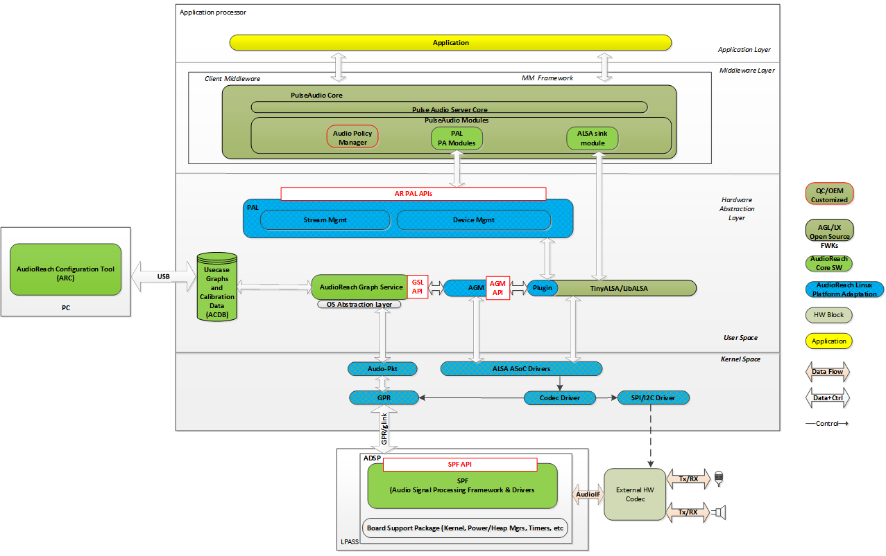
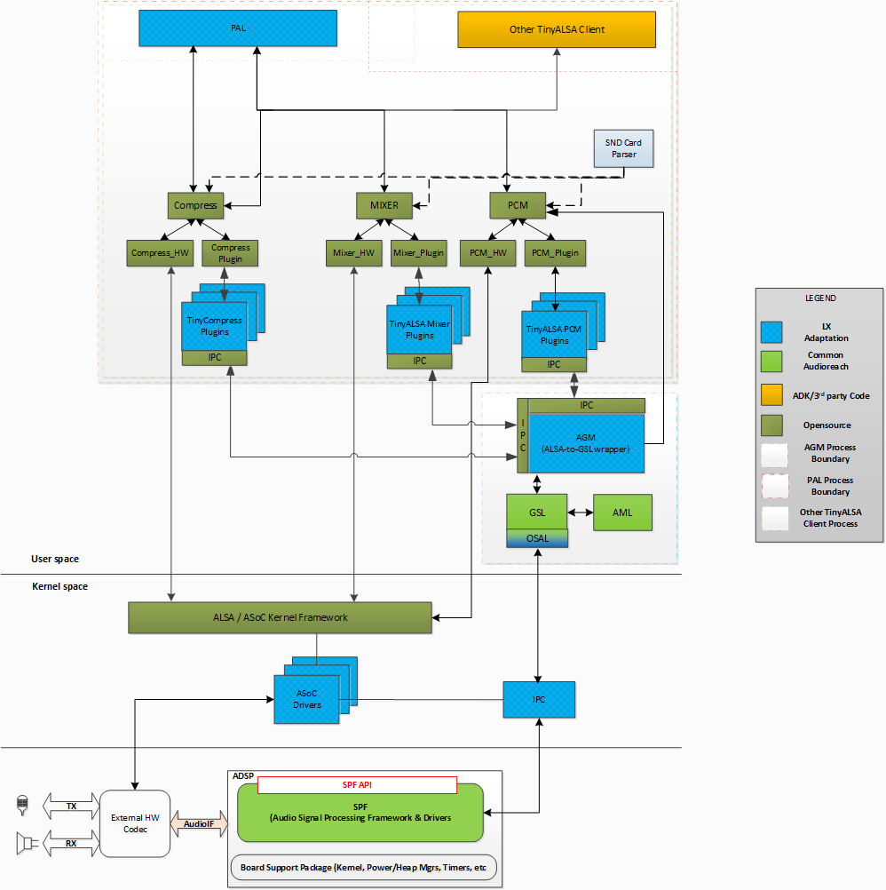
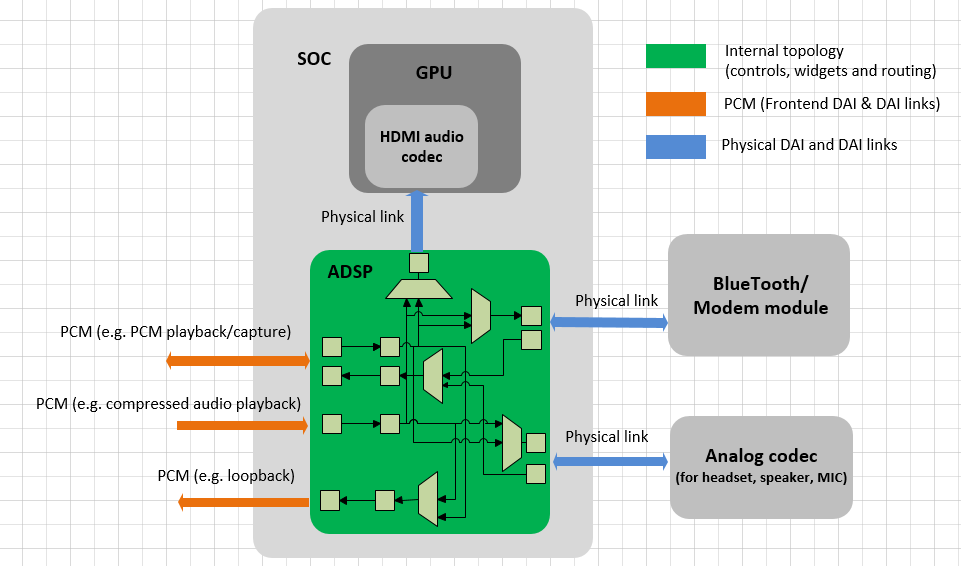
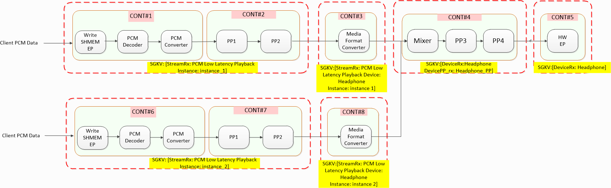
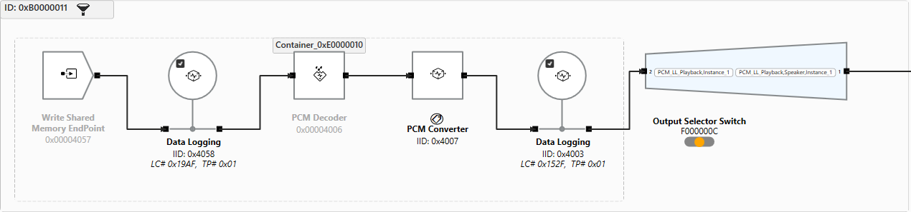
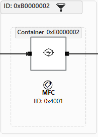
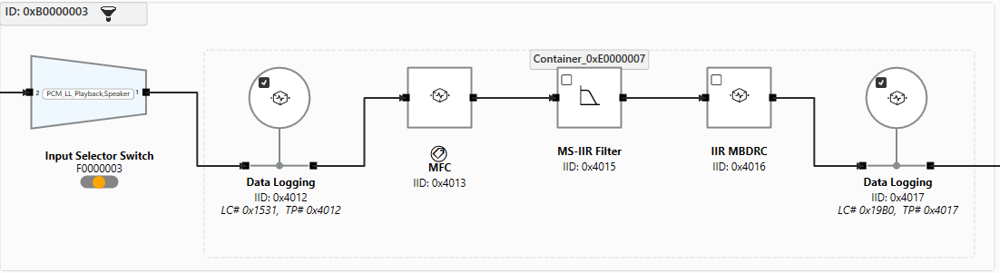
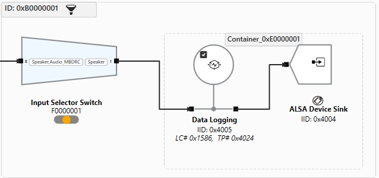
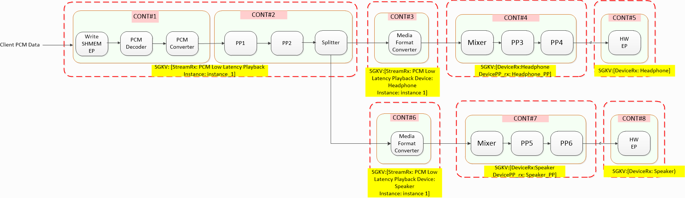
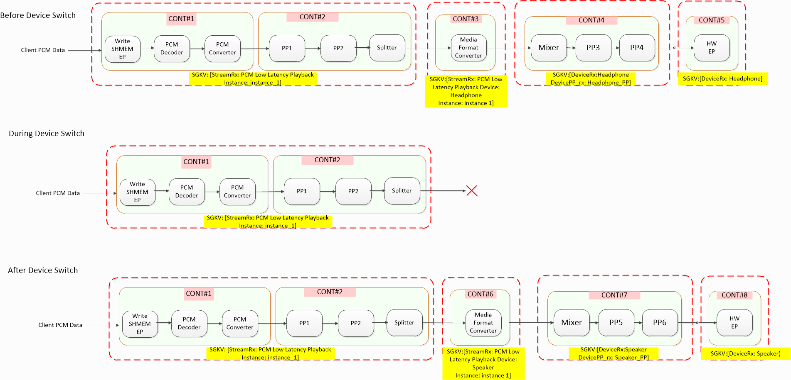

# Linux 插件架构

## 架构

### 概览

面向 Linux 的 AudioReach 插件架构旨在支持原汁原味的 AudioReach 开发工作流，并提供 AudioReach 所能带来的同样丰富的特性。与此同时，为了服务广泛的 Linux 生态需求，插件架构必须能够与业已成熟的 Linux 音频框架和 API 互操作。尤其是，ALSA 支持在几乎所有（即便不是全部）基于 Linux 的平台上都普遍存在，许多应用和中间件都是构建在 ALSA 之上运行的。尽管插件架构不会借助内核 ALSA 框架来配置 DSP，但仍会通过插件方式支持 ALSA 接口。同时，鉴于许多外设驱动是按照 ASoC CODEC 兼容驱动来开发的，插件架构仍会对接内核 ALSA/ASoC 框架，用于配置音频外设，例如混合信号 CODEC。

从高层来看，如下图所示，插件架构可以看作由五大部分组成。第一部分是一组 AudioReach 内核驱动，负责通过 IPC 驱动与音频 DSP 中的 AudioReach 引擎建立连接，并提供用户空间接口，以传递用户空间与 ARE 之间交换的命令和事件。第二部分是 OSAL 的 Linux 实现，为 AudioReach 图服务（ARGS）提供操作系统服务。OSAL 与 AR 内核驱动对接，以便与音频 DSP 中的 ARE 通信。第三部分是一组软件模块，它们插入到 tinyalsa、alsa lib 和 tinycompress 库中，将 ALSA 命令和构造转换为 ARGS 命令和构造，用于在音频 DSP 中建立和配置音频图。第四部分是平台适配层（PAL），它使客户端无需自己用 GKV/CKV/TKV 管理底层用例的建立和声音设备配置以及调用 ALSA API。最后，第五部分是适配层，用于让知名音频中间件（例如 PulseAudio）能够访问 PAL 所暴露的服务。同时，PulseAudio 对接 ALSA 库的路径仍可得到支持，其配置数据被抽象进用例管理器（UCM）文件中。


*Linux 插件架构图*

### 构成模块


*TinyALSA 插件架构图*

**PAL 及其他应用**

PAL 及其他应用是对接 TinyALSA API 的客户端。如图所示，这些模块运行在各自的进程上下文中。

**PCM、Mixer、Compress**

PCM、Mixer 和 Compress 模块是带有插件支持的增强版 TinyALSA 和 TinyCompress 库。

**SND Card Parser**

解析 card-defs.xml，该文件包含虚拟声卡和设备的定义。tinyalsa 用它来创建虚拟 mixer 控件，并获取与声卡/设备关联的插件库名。Card-defs.xml 包含不同 PCM/Compress 节点的详情，例如设备 id，以及诸如播放/录制和 session_mode 等属性。

card-defs.xml 条目示例：

```XML
<card>
        <id>100</id>
        <name>qcm6490virtualsndcard</name>
        <pcm-device>
                <id>100</id>
                <name>PCM100</name>
                <pcm_plugin>
                        <so-name>libagm_pcm_plugin.so</so-name>
                </pcm_plugin>
                <props>
                        <playback>1</playback>
                        <capture>0</capture>
                </props>
        </pcm-device>

        <pcm-device>
                <id>101</id>
                <name>PCM101</name>
                <pcm_plugin>
                        <so-name>libagm_pcm_plugin.so</so-name>
                </pcm_plugin>
                <props>
                        <playback>0</playback>
                        <capture>1</capture>
                </props>
        </pcm-device>

        <mixer>
                <id>1</id>
                <name>agm_mixer</name>
                <mixer_plugin>
                        <so-name>libagm_mixer_plugin.so</so-name>
                </mixer_plugin>
        </mixer>
</card>
```

**PCM HW、Mixer HW、Compress HW**

PCM HW、Mixer HW 和 Compress HW 模块是 TinyALSA 模块，实现了对接既有 ALSA 内核 ops 的所有 ops，并与内核 ALSA 驱动交互。

**PCM Plugin、Mixer Plugin、Compress Plugin**

PCM Plugin、Mixer Plugin 和 Compress Plugin 模块向 PCM、Mixer 和 Compress 核心框架模块注册所有 pcm、mixer 和 compressed ops 的回调。这些模块加载插件 .so 并调用 plugin_init 函数，并将来自应用的所有 pcm / mixer 调用路由到插件特定的实现。

**TinyALSA PCM Plugin、TinyALSA Mixer Plugin、TinyALSA Compress Plugin**

PCM、Mixer 和 Compress TinyALSA 插件是 TinyALSA 插件，它们将来自应用的所有 pcm、mixer 和 compress 调用路由到插件特定的实现。

**Audio Graph Manager（AGM）**

AGM 为 mixer 插件、PCM 和 Compressed API 提供用于建立音频用例的 API。它以音频服务的形式运行（通过平台特定手段，例如 init 脚本），因此可以服务多个 tinyALSA 客户端。

**GSL**

GSL 是图服务库，负责通过图键向量加载和初始化子图与图、图的建立、图内子图的动态处理、数据命令管理——读/写缓冲区，以及 ARE 模块的校准（Set Config/Get Config）。

**AML**

ACDB 管理库，也称为 ACDB SW，提供 get/set API 来检索和调整 ACDB DATA 文件中的数据。它提供数据抽象及组织方式，规定校准数据如何被音频驱动及其组件所使用。

**IPC**

GSL 通过通用包路由器（GPR）协议与 ARE 交换消息。由于 ARE 运行在不同的子系统上，GSL 必须通过 IPC 层通信。该 IPC 实现为一个设备节点，由用户空间 Linux 数据链路层打开。

**ASoC Drivers**

ASoC 驱动是 ALSA 兼容驱动，它们共同构成声卡，其中的 PCM 设备是从 ASoC dai link 枚举出来的。插件架构在音频 DSP 中的音频图建立/配置和数据接口方面绕过了 ALSA 框架。这些 dai link 意在提供对内核中管理的硬件资源的访问，如 GPIO、时钟和混合信号 CODEC。

## 通过 ALSA 实现 AudioReach

ALSA 动态 PCM 框架提供了将 PCM 前端动态连接到物理 dai link 的能力，如下所示。在以下示例中，PCM 播放和压缩播放前端会话中的任意一个或两个，都可以通过配置已发布的 mixer 控件、widget、route 等，连接到蓝牙和模拟 codec 物理链路中的任意一个或两个。


*ARE 图到 ASoC DPCM 概念图*

面向 Linux 的 AudioReach 插件架构从 ALSA DPCM 框架获得灵感，以前端和后端的形式对音频图进行建模。前端 PCM 或 compress ALSA 设备可以连接到任意物理链路，物理链路常被称为后端。关于前端和后端如何枚举的细节，将在 AGM 和 TinyALSA Plugin 文档中详细介绍。

在 AudioReach 插件架构中，音频图对于播放和录制通常被组织为以下若干段。同时，系统设计者可以在认为产品有必要时添加额外的子图类型。

- Stream（流）：该段提供数据写/读接口，如果数据是压缩的，则执行解码/编码。
- Stream Post/Pre-Processing（PP，流后/前处理）：该段包含基于流的处理模块，例如均衡器。
- Per Stream Per Device（PSPD，每流每设备）：该段用于容纳将流媒体格式转换为设备媒体格式的模块。
- Device-PP（设备 PP）：该段由用于声音设备调校的 PP 模块组成。例如，DRC 处理对扬声器设备很重要。
- Device（设备）：硬件端点，例如 I2S 端口。

这些段在 AudioReach 术语中被称为子图。前端一般代表 stream 和 stream PP 子图，而后端代表 PSPD、device-PP、device 子图。在插件架构中，与前端和后端关联的基于字节的 mixer 控件，供客户端在启动 PCM 设备和设备切换前，按需分配 GKV 和 CKV 作为所需的元数据设置。

一旦前端通过路由 mixer 控件连接到后端，就会通过拼接子图的 GKV 以及通过 mixer 控件分配的 CKV，形成完整的 GKV。在打开前端 PCM 或 compress 设备时，AGM 用拼接后的 GKV 和 CKV 调用 GSL API，以在 ARE 中建立图并应用校准。同时，AGM 打开与所连接后端对应的内核 pcm 设备，以启动音频外设建立。这一机制构成了通过 ALSA 构建 AudioReach 图的基础设计，并使得包括 SoC 和音频外设在内的完整音频通路得以实现。

## 为子图分配键向量的准则

基于上一节所述的设计，前端（FE）和后端（BE）的元数据（即 GKV 和 CKV）可以在三个段上指定。每个段关联一个元数据 mixer 控件。

- Stream（流）——包含 Stream、Stream PP 子图的 KV。同一组 KV 可用于指定 Stream 和 Stream PP。
- Device（设备）——包含 HW EP 相关子图的 KV，也可选地包含 Device PP 子图。
- Stream Device（流设备）——包含 stream 与 device 子图之间的任何子图，例如 Device pp、PSPD。

## 插件架构的图设计示例

### 多流到单设备（MSSD）播放

#### 图概览


*MSSD 场景的音频图示例*

图中描绘了 MSSD 播放场景下音频图的参考设计。在此示例中，stream 子图和 stream-PP 子图被合并为一个 stream 子图。Stream 子图由写共享内存端点、PCM 解码器、PCM 转换器组成。客户端将 PCM 采样传递给写共享内存端点。放置 PCM 转换器是为了在必要时将 PCM 采样转换为流特定后处理模块所支持的格式。Stream 子图的输出被送入 stream-device 子图，后者由媒体格式转换器（MFC）组成。放置 MFC 是为了将流侧（stream-leg）PCM 转换为设备侧（device-leg）PCM 格式。转换之后，stream-device 子图的输出被送入 device PP 子图进行设备特定的后处理。注意 mixer 被放置在子图起始处以混合输入流。Device PP 子图的输出随后被送入 device 子图，该子图包含硬件端点模块（例如 I2S 驱动），用于最终从 SoC 渲染输出。

Linux 平台的参考播放图通常由以下子图组成：

1. **Stream** —— DSP 与高层操作系统之间的软件接口。
2. **Stream-PP** —— 包含流特定的后处理（PP）模块（例如低音增强、混响等）。
3. **Stream-Device** —— 由任何每流每设备的模块组成，例如采样率/媒体格式转换。
4. **Device-PP** —— 包含硬件设备特定的 PP 模块（常见示例包括 IIR 滤波器、MBDRC 等）。
5. **Device** —— 硬件端点，最常见的是麦克风或扬声器。

Rx（音频输出）用例将遵循此顺序（Stream -> Device），而 Tx（音频输入）用例则相反（Device -> Stream）。默认情况下，会为 Stream、StreamPP、Device 和 DevicePP 定义 GKV。StreamDevice 子图没有唯一的 GKV，而是使用 Stream 与 Device GKV 的组合。

请注意，并非每个图都必须有 Stream-PP、Stream-Device 或 Device-PP 子图。最常见的情况是，子图仅为每个 Stream 或 Device 各定义一次，而不同的校准通过 PP 子图来实现。

#### 键向量设计

| **子图** | **键** |
| --- | --- |
| Stream | Key = StreamRx - 播放类型 Key = Instance - 播放实例 |
| Stream Device | Key = StreamRx - 播放类型 Key = Device - 逻辑声音设备 |
| Device PP | Key = Device - 逻辑声音设备 Key = DevicePP_rx - 设备 PP 集名称 |
| Device | Key = Device - 逻辑声音设备 |

| **元数据分组** | **KV** |
| --- | --- |
| Stream1 Metadata | StreamRX1 KVs |
| Stream2 Metadata | StreamRX2 KVs |
| Device Metadata | DeviceRX KVs |
| Stream1 + Device Metadata | StreamRX1DeviceRX KVs, DeviceRX PP KVs |
| Stream2 + Device Metadata | StreamRX2DeviceRX KVs, DeviceRX PP KVs |

下面是来自 RB3 Gen2 ACDB 文件的低延迟播放图的分解：

StreamRX 子图：



Stream-Device 子图：



Device PP 子图：



Device 子图：



**GKV**

GKV1: <StreamRX1 KVs, StreamRX2 PP KVs, StreamRX1DeviceRX KVs, DeviceRX PP KVs, DeviceRX KVs>

GKV2: <StreamRX2 KVs, StreamRX2 PP KVs, StreamRX2DeviceRX KVs, DeviceRX PP KVs, DeviceRX KVs>

### 单流到多设备（SSMD）播放

#### 图概览

图中描绘了 SSMD 播放场景下音频图的参考设计。本质上，stream 子图与 MSSD 场景几乎完全相同，只是在 stream 子图末尾额外添加了一个分离器（splitter），使得输出可以分别路由到耳机和扬声器的两个 stream-device 子图。然后，分别为耳机和扬声器提供 device PP 和 device 子图。


*SSMD 场景的音频图示例*

#### 键向量设计

子图的键向量设计与 MSSD 场景相同。

| **元数据分组** | **KV** |
| --- | --- |
| Stream Metadata | StreamRX1 KVs |
| Device1 Metadata | DeviceRX1 KVs |
| Device2 Metadata | DeviceRX2 KVs |
| Stream + Device Metadata | StreamRXDeviceRX1 KVs, DeviceRX1 PP KVs |
| Stream + Device Metadata | StreamRXDeviceRX2 KVs, DeviceRX2 PP KVs |

**GKV**

GKV1: <StreamRX KVs, StreamRX PP KVs, StreamRXDeviceRX1 KVs, DeviceRX1 PP KVs, DeviceRX1 KVs>

GKV2: <StreamRX KVs, StreamRX PP KVs, StreamRXDeviceRX2 KVs, DeviceRX2 PP KVs, DeviceRX2 KVs>

### 设备切换

设备切换描述的是这样一种场景：由于外部事件（例如终端用户拔出耳机），音频输出从一个声音设备被路由到另一个声音设备。在插件架构中，其机制是拆除音频图的设备侧，并实例化新的设备侧子图，以构成新的完整音频图。下图演示了从耳机到扬声器的设备切换。在设备切换期间，耳机的 Stream-Device、Device PP、Device 被拆除，并实例化扬声器同类型的新子图。


*设备切换示例*

## 通过 ALSA 建立用例指南

### 建立序列

1. 下发 mixer 控件以建立音频外设内部的路由
2. 下发 mixer 控件以设置后端的媒体格式
3. 下发 mixer 控件以设置 device 子图的元数据
4. 下发 mixer 控件以设置 Stream 和 Stream PP 子图的元数据
5. 下发 mixer 控件以设置 PSPD 和 Device PP 子图的元数据
6. 下发 mixer 控件以将前端连接到后端
7. 调用 tinyalsa API 以启动用例

pcm_open()pcm_prepare()pcm_start()pcm_write()/pcm_read()
### 关闭序列

pcm_stop()pcm_close() 下发 mixer 控件以断开前端与后端的连接
### Mixer 控件与负载

- 设置后端 pcm 配置：
  ```
  tinymix '<back-end name> rate ch fmt' <sample rate> <channel count> <PCM format enum value> <data format>
  ```
- 连接/断开前端与后端：
  ```
  tinymix 'PCM<#> connect' <back-end name>
  tinymix 'PCM<#> disconnect' <back-end name>
  ```
- 配置设备元数据：
  ```
  tinymix '<back-end name> metadata' <meta byte payload>
  ```
- 配置 stream 和 stream PP 子图元数据：
  ```
  tinymix 'PCM<#> control' Zero
  tinymix 'PCM<#> metadata' <meta byte payload>
  ```
- 配置 stream device 和 device PP 子图元数据：
  ```
  tinymix 'PCM<#> control' <back-end name>
  tinymix 'PCM<#> metadata' <meta byte payload>
  ```
- <PCM format enum value>：该值派生自 ALSA asound.h 中的 SNDRV_PCM_FORMAT。
- <back-end name>：该字符串由 agm 解析 /proc/asound/pcm 得到，用以获取给定单板上所有可用的硬件端点后端。
- <meta byte payload>：下面代码片段中的 agm_meta_data_gsl 结构体描绘了负载的格式。子图 KV 和子图 CKV 的传递前面已有描述。除了 GKV 和 CKV，负载中还有一部分用于传递属性 ID。目前，它仅用于辅助设备切换用例。

```C
/**
 * Key Vector
 */
struct agm_key_vector_gsl {
    size_t num_kvs;                 /**< number of key value pairs */
    struct agm_key_value *kv;       /**< array of key value pairs */
};
struct sg_prop {
    uint32_t prop_id;
    uint32_t num_values;
    uint32_t *values;
};

/**
  * Metadata Key Vectors
  */
struct agm_meta_data_gsl {
    /**
     * Used to lookup the calibration data
     */
    struct agm_key_vector_gsl gkv;

    /**
    * Used to lookup the calibration data
    */
    struct agm_key_vector_gsl ckv;
    /**
    * Used to lookup the property ids
    */
    struct sg_prop sg_props;
};
```

### 用例的 Mixer 控件设置示例

## 播放 SSSD

**建立序列**

**‘CODEC_DMA-LPAIF_WSA-RX-0 rate ch fmt’ 48000 2 2(PCM_16) 1(FIXED_POINT)**

**‘CODEC_DMA-LPAIF_WSA-RX-0 metadata’ bytes** //表示设备/可选 devicePP 的 KV 的字节

**‘PCM100 control’ Zero**// 设置开关以指示后续
mixer 控件配置针对 stream**‘PCM100 metadata’ bytes**//表示 stream、
streamPP 的 KV 的字节**‘PCM100 control’ CODEC_DMA-LPAIF_WSA-RX-0**// 设置 control 以
指示后续 mixer 控件配置针对 stream 与 device 之间的图
配置。**‘PCM100 metadata’ bytes**//表示
StreamDevice(PSPD)、DevicePP 子图的 KV 的字节**‘PCM100 getTaggedInfo’ bytes** // 用于检索为 PCM100 和 CODEC_DMA-LPAIF_WSA-RX-0 所配置的 GKV 的模块 tag、mid、iid 信息

**‘PCM100 control’ Zero**// 设置开关以指示后续
mixer 控件配置针对 stream**‘PCM100 setParam’ bytes**//表示 stream 图中模块
配置**‘PCM100 control’ CODEC_DMA-LPAIF_WSA-RX-0**// 设置 control 以
指示后续 mixer 控件配置针对 stream 与 device 之间的图
配置。**‘PCM100 setParam’ bytes**//表示 StreamDevice(PSPD)、DevicePP 子图
模块配置的字节**‘PCM100 connect’CODEC_DMA-LPAIF_WSA-RX-0** // 将 PCM100 连接到 CODEC_DMA-LPAIF_WSA-RX-0 AIF（前端到后端连接）

**pcm_open()****pcm_prepare()****pcm_start()****pcm_write()/pcm_read()****拆除序列**

**pcm_stop()**

**pcm_close()**

**‘PCM100 disconnect’ CODEC_DMA-LPAIF_WSA-RX-0 //** 将 PCM100 连接到 CODEC_DMA-LPAIF_WSA-RX-0 AIF（前端到后端连接）

### 5.2. 播放 SSMD

**‘CODEC_DMA-LPAIF_WSA-RX-0 metadata’ bytes**//表示
设备/可选 devicePP 的 KV 的字节**‘PCM100 metadata’ bytes**//表示 stream、
streamPP 的 KV 的字节**‘PCM100 control’ CODEC_DMA-LPAIF_WSA-RX-0**// 设置 control 以
指示后续 mixer 控件配置针对 stream 与 device 之间的图
配置。**‘PCM100 metadata’ bytes**//表示
StreamDevice(PSPD)、DevicePP 子图的 KV 的字节**‘PCM100 getTaggedInfo’ bytes** // 用于检索特定 GKV 的模块 tag、mid、iid 信息

**‘CODEC_DMA-LPAIF_WSA-RX-0 rate ch fmt’ 48000 2 2(PCM_16) 1(FIXED_POINT)****‘PCM100 control’ Zero**// 设置 control 以指示后续
mixer 控件配置针对 stream 与 device 之间的图
配置。**‘PCM100 setParam’ bytes**//表示 stream 图中
模块的配置**‘PCM100 control’ CODEC_DMA-LPAIF_WSA-RX-0**// 设置 control 以
指示后续 mixer 控件配置针对 stream 与 device 之间的图
配置。**‘PCM100 setParam’ bytes**//表示 StreamDevice(PSPD)、DevicePP 子图
模块配置的字节**‘PCM100 connect’ CODEC_DMA-LPAIF_WSA-RX-0** // 将 PCM100 连接到 CODEC_DMA-LPAIF_WSA-RX-0 AIF

**pcm_open()****pcm_prepare()****pcm_start()****pcm_write()/pcm_read()****‘CODEC_DMA-LPAIF_WSA-RX-1 metadata’ bytes**//表示
设备/可选 devicePP 的 KV 的字节**‘PCM100 control’ CODEC_DMA-LPAIF_WSA-RX-1**// 设置 control 以
指示后续 mixer 控件配置针对 stream 与 device 之间的图
配置。**‘PCM100 metadata’ bytes** //表示 StreamDevice(PSPD)、DevicePP 子图的 KV 的字节

**‘PCM100 getTaggedInfo’ bytes** // 用于检索特定 GKV 的模块 tag、mid、iid 信息

**‘CODEC_DMA-LPAIF_WSA-RX-1 rate ch fmt’ 96000 4 2(PCM_16) 1(FIXED_POINT)****‘PCM100 control’ CODEC_DMA-LPAIF_WSA-RX-1**// 设置 control 以
指示后续 mixer 控件配置针对 stream 与 device 之间的图
配置。**‘PCM100 setParam’ bytes** //表示 StreamDevice(PSPD)、DevicePP 子图模块配置的字节

**‘PCM100 connect’ CODEC_DMA-LPAIF_WSA-RX-1** // 将 PCM100 连接到 **CODEC_DMA-LPAIF_WSA-RX-1** AIF

### 5.3. 播放 MSSD

**‘SLIM_0_RX metadata’ bytes**//表示
设备/可选 devicePP 的 KV 的字节**‘PCM100 metadata’ bytes**//表示 stream、
streamPP 的 KV 的字节**‘PCM100 control’ SLIM_0_RX**// 设置 control 以指示
后续 mixer 控件配置针对 stream 与 device 之间的图
配置。**‘PCM100 metadata’ bytes**//表示
StreamDevice(PSPD)、DevicePP 子图的 KV 的字节**‘PCM100 getTaggedInfo’ bytes** // 用于检索特定 GKV 的模块 tag、mid、iid 信息

**‘SLIM_0_RX rate ch fmt’ 48000, 2, 2(PCM_16) 1(FIXED_POINT)****‘PCM100 control’ Zero**// 设置 control 以指示后续
mixer 控件配置针对 stream 与 device 之间的图
配置。**‘PCM100 setParam’ bytes**//表示 stream 图中
模块的配置**‘PCM100 control’ SLIM_0_RX**// 设置 control 以指示
后续 mixer 控件配置针对 stream 与 device 之间的图
配置。**‘PCM100 setParam’ bytes**//表示 StreamDevice(PSPD)、DevicePP 子图
模块配置的字节**‘PCM100 connect’ SLIM_0_RX** // 将 PCM100 连接到 SLIM_0_RX AIF

**pcm_open()****pcm_prepare()****pcm_start()****pcm_write()/pcm_read()****‘PCM101 metadata’ bytes** //表示 stream、streamPP 的 KV 的字节

**‘PCM101 control’ SLIM_0_RX**// 设置 control 以指示
后续 mixer 控件配置针对 stream 与 device 之间的图
配置。**‘PCM101 metadata’ bytes**//表示
StreamDevice(PSPD)、DevicePP 子图的 KV 的字节**‘PCM101 getTaggedInfo’ bytes** // 用于检索特定 GKV 的模块 tag、mid、iid 信息

**‘PCM101 control’ Zero**// 设置 control 以指示后续
mixer 控件配置针对 stream 与 device 之间的图
配置。**‘PCM101 setParam’ bytes**//表示 stream 图中
模块的配置**‘PCM101 control’ SLIM_0_RX**// 设置 control 以指示
后续 mixer 控件配置针对 stream 与 device 之间的图
配置。**‘PCM101 setParam’ bytes**//表示 StreamDevice(PSPD)、DevicePP 子图
模块配置的字节**‘PCM101 connect’ SLIM_0_RX** // 将 PCM101 连接到 SLIM_0_RX AIF

**pcm_open()****pcm_prepare()****pcm_start()****pcm_write()/pcm_read()**
