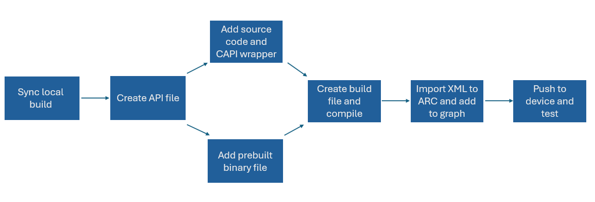

# 如何添加音频模块

1. 引言
2. 创建文件夹结构
3. 创建 API 文件
4. 添加源代码和 CAPI 封装
5. 创建构建文件
6. 添加构建该模块的条目
7. 构建模块并导入 ARC
8. 测试模块

## 引言

本指南将概述如何以**模块**的形式，通过以下基本步骤，将音频算法纳入 audioreach-engine 并进行构建和测试：

如上面的工作流示意图所示，本指南将展示如何添加带源代码的模块，或者改为添加预构建的 “.a” 二进制文件，后者将在“创建构建文件”一节中讨论。

在使用 ARC 构建模块并将其添加到用例图之后，更新后的 ACDB 和 workspace 文件可以推送到设备上的 “etc/acdbdata” 文件夹。关于如何使用 ARC（也称为 QACT）的更多信息，请参阅 ARC 用户指南。

在遵循这些步骤之前，需要记住几个前提条件：

- 这些步骤基于将模块添加到 AudioReach yocto 工程，因此需要先创建一个本地 yocto 构建。要了解如何操作，请参阅你所选平台的《平台参考指南》（例如 [Raspberry Pi 4](../platform/raspberry_pi4.md) 安装说明）。关于如何在 audioreach-engine 源码树之外构建独立模块的指南将在稍后添加。
- 了解一些关于 CMake 和 KConfig 的基本信息可能会有帮助，尽管这并非必需。
- 本指南还会引用 **h2xml**，它由 Qualcomm 创建。关于 h2xml 的一些信息可以在[这里](https://github.com/Audioreach/h2xml)找到。
- 此外，浏览一下 [Example Gain](https://github.com/Audioreach/audioreach-engine/tree/master/modules/examples/gain) 模块可能会有帮助，本指南将始终以它作为示例。

要了解如何构建 audioreach-engine 工程中已包含的模块，请参阅“添加构建该模块的条目”一节的第 3 步。

**注意：** 本指南经常会提到一个 “tmp” audioreach-engine 文件夹，它是编译 audioreach-engine 时生成的，包含本指南多个步骤中所用的重要文件。由于本指南是基于使用 yocto 构建系统编译 audioreach-engine 编写的，audioreach-engine 构建产物的确切位置可能因构建系统而异。例如，在 Raspberry Pi 4 上，该文件夹将位于 “<build_root>/build/tmp/work/cortexa7t2hf-neon-vfpv4-poky-linux-gnueabi/audioreach-engine/1.0+git/audioreach-engine-1.0+git”。

## 创建文件夹结构

- 首先，选择一个位置来创建模块文件夹。当前大多数模块都位于 [modules](https://github.com/Audioreach/audioreach-engine/tree/master/modules) 文件夹中，处于以下两个位置之一：
    - “audio” 文件夹包含音频编码器和解码器。
    - “processing” 文件夹包含音频处理模块。
- 下面是模块推荐的文件夹结构：
    - api：包含 API 文件。
    - build：包含 CMakeLists 构建文件。
    - lib：包含头文件/源代码。
    - capi：包含 CAPI 封装的头文件/源代码。
    - bin（可选）：包含二进制文件。

## 创建 API 文件

- API 文件将被 AudioReach Creator 用来获取模块的信息，例如可配置的结构体和参数、模块描述以及模块 ID。每个模块都需要一个 API 文件。
    - 例如，下图展示了 Example Gain 模块的 API 文件中所包含的部分信息：
- 编译模块时，API 会使用 h2xml 转换为 XML 文件。然后可以将该 XML 文件导入 ARC，ARC 用它来获取模块信息。此后，该模块即可在 ARC 中使用。
- 例如，API 文件将被用于构建模块的 “Calibration Window”（校准窗口），在 ARC 的 workspace 中双击某个模块即可查看该窗口。校准窗口用于设置模块的可配置参数。
- 为了更好地可视化校准窗口如何从模块的 API 文件构建而来，请注意下面 Example Gain 模块的 API 文件图片：
    - API 文件的这一部分描绘了参数 **PARAM_ID_GAIN_MODULE_GAIN**，以及包含变量 **gain** 和 **reserved** 的结构体 **param_id_module_gain_cfg_t**。此外，在参数下方还有一些 h2xml 注解。
    - API 文件中的这些参数、结构体和 h2xml 条目将被 ARC 用来构建 Example Gain 模块的校准窗口，如下所示：
- 关于如何开发 API 文件的全面概述，请参阅 [CAPI 模块开发指南](capi_mod_dev.md)的 “Module” 一节。

## 添加源代码和 CAPI 封装

- 模块的自定义算法可以使用诸如 Matlab 之类的标准工业工具进行开发和优化。
- 在开发 CAPI 封装时，有几个函数是必须实现的，包括入口点 init 函数、get_param、set_param、set_properties、get_properties、process 以及 end 函数。例如，下面是 Example Gain 模块所需 CAPI 函数的列表：
- 关于如何为模块创建 CAPI 封装的信息，请参阅 [CAPI 模块开发指南](capi_mod_dev.md)。

## 创建构建文件

- 首先，在模块的 “build” 目录下创建一个 “CMakeLists.txt” 文件。请参阅现有的构建文件，例如 [Example Gain](https://github.com/Audioreach/audioreach-engine/blob/master/modules/examples/gain/CMakeLists.txt)。
    - 如果使用预构建的二进制文件而非源文件，请参阅 [iir_mbdrc](https://github.com/Audioreach/audioreach-engine/tree/master/modules/processing/gain_control/iir_mbdrc/build) 模块的构建文件。
- 在构建文件中，添加 “sources” 和 “includes” 部分以链接模块的源文件和头文件。“sources” 和 “includes” 部分的布局应遵循以下格式：
    - 注意：如果使用二进制文件，则不需要 “sources” 部分。
- 现在添加 “spf_module_sources” 部分。这将被 AMDB（即 Audio Module DataBase，音频模块数据库）使用。在创建音频图时，AMDB 会查找各模块的 CAPI 入口点函数。作为示例，这里是 Example Gain 模块的 “spf_module_sources” 部分：
- 请注意，上述示例中展示的所有条目都是必需的。其中大部分信息将取自 API 文件。以下是每个条目及其用途的列表：
    - **KConfig：** 这将在 KConfig 文件中用于指示该模块是否会被自动生成。
    - **Name：** 模块的名称。
    - **Major/minor version：** 模块的主版本或次版本。
    - **amdb_itype：** 模块的接口类型。目前仅支持 “capi” 值。
    - **amdb_mtype：** 这是模块类型。例如，在此情况下 “PP” 代表后处理或前处理。其他可能的类型包括 “end_point”、“generic”、“decoder”、“encoder”、“packetizer”、“depacketizer”、“converter”、“detector”、“generator” 和 “framework”。
    - **amdb_mid：** 这是模块 ID。该模块 ID 应与 API 文件中的模块 ID 相同。
    - **amdb_tag：** 该 tag 将提供模块 CAPI 入口点函数的前缀。在上面展示的 Example Gain 模块中，CAPI 函数以 “capi_example_gain” 为前缀。AMDB 将使用该前缀查找入口函数；例如 “capi_example_gain_init”。
    - **amdb_mod_name：** 模块的名称。这应与 API 文件中的名称相同。
    - **srcs/includes：** 这些将链接构建文件中添加的 sources 和 includes。如果你使用二进制文件，则不需要 “srcs” 部分。
    - **h2xml_headers：** 指向 API 文件的路径。
    - **CFlags：** 构建模块所需的任何 CFlags。
- 此外，在使用二进制文件的情况下，需要添加 **STATIC_LIB_PATH** 条目。它应遵循以下格式：

## 添加构建该模块的条目

- 为确保模块被编译，需要在其他 audioreach-engine 构建文件中添加几个构建条目。在构建模块之前，请遵循以下步骤：
    1. 在 “audioreach-engine/modules/CMakeLists.txt” 中，添加下面的条目（请注意，此 CONFIG_MODULE_NAME 必须与模块构建文件中 KConfig 条目下的名称相同）：
    2. 在 “audioreach-engine/modules/KConfig” 中，添加类似下面的条目：
    3. 在 “audioreach-engine/arch/<platform>/configs/defconfig” 中，以 “CONFIG_MODULE_NAME” 格式为该模块添加一个条目。它必须与上面 modules/CMakeLists.txt 文件中添加的名称相同。设置模块条目有三个选项：
          - “y” 会将该模块链接到 audioreach-engine 库中，成为单个共享库的一部分。
          - “m” 会在 “tmp” audioreach-engine 文件夹中将该模块构建为独立的共享库。
          - “n” 则完全不构建该模块。

## 构建模块并导入 ARC

- 现在所有设置都已完成。如果使用 yocto 构建，运行 “bitbake audioreach-engine” 应该会构建该模块。
    - 为确保运行 bitbake 命令后模块被纳入编译，请检查文件 “audioreach-engine/fwk/spf/amdb/autogen/linux/spf_static_build_config.h”。该模块的 CAPI 封装入口函数应打印在这里。如果没有，请仔细检查上一步是否已完全完成。
- 编译模块时，h2xml 会将 API 转换为将要导入 ARC 的 XML 文件。它可以在 “tmp” audioreach-engine 文件夹内的 “h2xml_autogen” 文件夹中找到。该 XML 文件将与模块的 API 文件同名。
- 要在音频用例图中使用该模块，请将 XML 文件导入 ARC。有关如何操作的步骤，请参阅 ARC 指南的 4.1 节。

## 测试模块

- 首先，设置好首选设备。成功编译 “audioreach-engine” 后，可以从 yocto 构建生成完整的设备镜像，然后运行 “bitbake <image_name>” 生成完整镜像并烧录。
- 如果设备上已经烧录了镜像，也可以在不重新烧录镜像的情况下使用该模块：
    - 如果模块条目在 defconfig 中设置为 “y”，只需将 “libspf.so” 推送到设备上的 “/usr/lib” 文件夹。
          - “libspf.so” 是 audioreach-engine 库，它可以在 “tmp” audioreach-engine 文件夹中找到。
    - 如果模块条目设置为 “m”，请导航到 “tmp” audioreach-engine，找到为自定义模块生成的文件夹。这里应该有为该模块生成的 “.so” 文件。将它推送到设备上的 “/usr/lib” 文件夹。
- 在 ARC 中将该模块添加到音频用例图。保存 workspace 以更新 ACDB 文件。
- 将更新后的 ACDB 文件推送到设备上的 ACDB 文件夹，并尝试运行一个音频用例。如果该用例没有问题，那么当 ARC 以在线模式连接设备时，该模块将出现在图中。
    - 关于以在线模式连接 ARC 的步骤，请参阅相关的《平台参考指南》。
