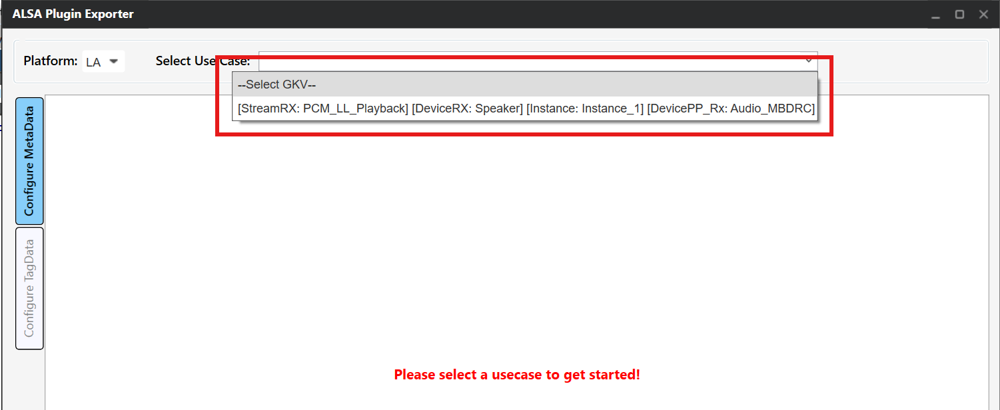
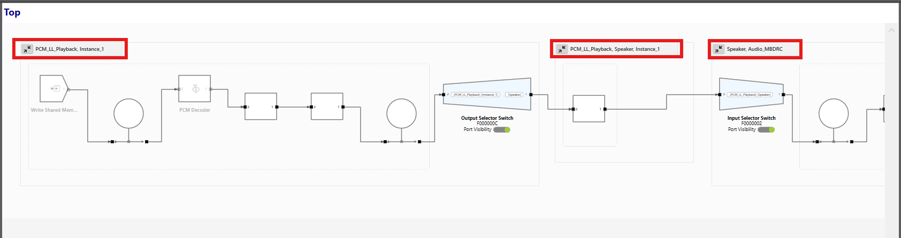
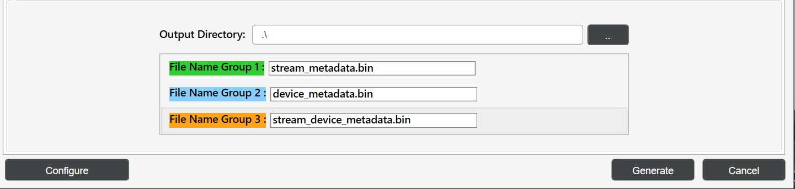

# 在 AudioReach 中使用 ALSA lib

- ALSA lib 设置
    - 前提条件
- 使用 ARC 生成元数据二进制文件
    - 所需的元数据文件
    - 用 ARC 生成元数据
- 运行音频用例
    - 通用设置
    - 使用 amixer
    - 使用 ALSA UCM
- 参考资料

本指南提供了将 ALSA lib 与 AudioReach 集成以实现音频用例的详细信息。AudioReach 提供了一种围绕 AGM（Audio Graph Manager，音频图管理器）构建的基于插件的架构，AGM 是一个管理音频图的用户空间服务。ALSA lib 通过 AGM 插件与 AudioReach 集成，该插件向音频应用暴露标准的 ALSA PCM 和 mixer 接口。本指南涵盖使用 ARC（AudioReach Creator）生成元数据、ALSA 插件配置，以及使用 amixer 和 ALSA UCM 运行音频用例的示例。

## ALSA lib 设置

本节介绍 AudioReach 集成所需的 ALSA lib 软件包的安装与验证。ALSA lib 软件包提供了对接 AudioReach 基于插件的架构所需的库和工具。

### 前提条件

在设置 ALSA lib 之前，请确认所有 AudioReach 组件都已安装在你的目标平台上。请参阅相关的平台设置指南（例如 Raspberry Pi 4 的 [Raspberry Pi 4](../platform/raspberry_pi4.md)）。

#### ALSA 软件包安装

**对于基于 Yocto 的构建**，ALSA lib 软件包应包含在 Yocto 构建中。打开文件 `<yocto_build_root>/build/conf/local.conf` 并添加所需的软件包：

```bash
IMAGE_INSTALL:append = " \
alsa-lib \
alsa-utils \
alsa-tools \
alsa-state \
"
```

> **注意**
>
> 对于非 Yocto 环境（例如 Buildroot、基于 Debian 的发行版），请使用该发行版的软件包管理器或构建系统安装等效的软件包。

#### 在 AudioReach 组件中启用 ALSA lib 插件

ALSA lib 插件支持在 AudioReach 构建系统中默认是禁用的，必须在两个组件中显式启用：`audioreach-graphmgr` 和 `audioreach-conf`。

| 工程 | 标志 | 类型 | 默认值 |
| --- | --- | --- | --- |
| `audioreach-graphmgr` | `--enable-alsalib` | `AC_ARG_ENABLE` | `no` |
| `audioreach-conf` | `--with-libalsa` | `AC_ARG_WITH` | `no` |

**Yocto 构建**

将以下配置添加到 `<yocto_build_root>/build/conf/local.conf` 以启用这些标志。

```bash
EXTRA_OECONF:append:pn-audioreach-graphmgr = " --enable-alsalib"
EXTRA_OECONF:append:pn-audioreach-conf = " --with-libalsa"
```

**Autotools 构建**

将标志直接传递给每个组件的 `configure` 脚本：

```bash
# audioreach-graphmgr
./configure --enable-alsalib

# audioreach-conf
./configure --with-libalsa
```

#### 验证 ALSA 安装

使用以下命令验证 ALSA 安装：

```bash
# List available sound cards
aplay -l

# List available PCM devices
aplay -L

# Check ALSA version
aplay --version
```

## 使用 ARC 生成元数据二进制文件

ARC 用于生成 ALSA lib 集成所需的元数据二进制文件。这些文件定义了音频图拓扑和校准数据。

### 所需的元数据文件

为 ALSA lib 集成生成以下元数据二进制文件：

****Stream Metadata（流元数据）****

定义音频流的属性，例如采样率、位深和通道配置。

****Device Metadata（设备元数据）****

包含设备特定信息，包括硬件能力和路由信息。

****Stream-Device Metadata（流-设备元数据）****

将音频流映射到特定设备，并定义连接拓扑。

### 用 ARC 生成元数据

按照以下步骤使用 ARC 生成元数据文件：

**第 1 步：打开 ARC（QACT）**

1. 在 Windows 机器上启动 QACT
2. 从 `/etc/acdbdata/` 加载 ACDB workspace 文件（从目标设备复制而来）
  > **注意**
  >
  > ACDB（音频校准数据库）workspace 文件包含目标设备的音频校准和拓扑数据。作为 AudioReach 平台设置的一部分，它已预装在目标设备的 `/etc/acdbdata/` 处。

**第 2 步：ALSA Plugin Exporter**

1. 在 QACT 中，导航至 **Tools → ALSA Plugin Exporter**


*QACT Tools 菜单 - ALSA Plugin Exporter*

1. 点击 **“Configuration MetaData”** 选项卡

**第 3 步：配置用例**

1. 从下拉菜单中选择所需的用例（例如 **playback**）


*用例选择*

1. 为每个子图选择与用例子图对应的适当 **GKV（Graph Key Vector，图键向量）**。**例如**，如果用例中第一个子图的键设置为 PCM_LL_Playback、Instance_1，则为该子图选择对应的 GKV [StreamRX:PCM_LL_Playback] 和 [Instance: Instance1]。


*用例子图与 GKV 键*


*子图 GKV 选择*

**第 4 步：配置元数据**

此步骤涉及配置元数据格式以及为元数据生成对子图进行分组。

**4.1：配置元数据格式**

1. 点击左下角的 **Configure** 按钮
2. 选择 **“Include TLV header”** 选项
3. 根据你的用例选择适当的文件类型：
    - **对于 ALSA UCM 配置**：将 File type 选择为 **bin**
    - **对于 amixer 配置**：将 File type 选择为 **Hex**，Delimiter 选择为 **“COMMA”**


*配置元数据格式*

> **注意**
>
> TLV（Type-Length-Value，类型-长度-值）头是 ALSA lib 正确解析和传输元数据所必需的。对于基于 UCM 的配置，带 TLV 头的二进制文件与 cset-tlv API 配合使用。对于基于 amixer 的配置，带逗号分隔符的十六进制格式允许内联指定元数据。

**生成的输出**

在两种情况下，ARC 都会生成包含元数据的 `.bin` 文件。

- **UCM（bin 格式）**：`.bin` 文件通过 `cset-tlv` API 被 ALSA UCM 直接使用。二进制内容会原样传输到 AGM 插件。
  ```
  cset-tlv "iface=MIXER,name='PCM_RT_PROXY-RX-2 metadata' /etc/device_metadata.bin"
  ```
- **amixer（hex 格式）**：`.bin` 文件内容被导出为逗号分隔的十六进制字符串。该十六进制负载被内联传递给 amixer 命令。
  ```bash
  amixer -D agm cset iface=MIXER,name='PCM_RT_PROXY-RX-2 metadata' 0x00,0x00,0x00,0x00,0x28,0x00,0x00,0x00,...
  ```

**4.2：配置元数据组**

根据用例子图，通过选择 **Group Subgraphs** 来配置元数据组。

- **Group1** → Stream 元数据
- **Group2** → Device 元数据
- **Group3** → Stream Device 元数据


*配置分组子图*

> **注意**
>
> 根据所选用例配置分组子图。对于没有 stream_device 前/后处理子图的用例，只生成 stream 和 device 两个 bin 文件。

**第 5 步：生成元数据文件**

1. 更新每个组的 bin 文件名：
    - Group1：`stream_metadata.bin`
    - Group2：`device_metadata.bin`
    - Group3：`stream_device_metadata.bin`


*二进制组命名*

1. 添加输出目录路径，然后点击 **“Generate”** 以创建元数据二进制文件。


*二进制输出目录配置*

**第 6 步：将文件传输到目标设备**

将生成的元数据文件复制到目标设备：

```bash
# Copy metadata files to Target device
scp stream_metadata.bin root@<target_device_ip_address>:/etc/
scp device_metadata.bin root@<target_device_ip_address>:/etc/
scp stream_device_metadata.bin root@<target_device_ip_address>:/etc/
```

> **注意**
>
> 元数据 bin 文件是按用例生成的。每个用例都有自己的一组元数据文件。

## 运行音频用例

本节演示如何使用 aplay，配合 amixer 和 ALSA UCM 配置来运行音频用例。

### 通用设置

**前提条件**

确保 AudioReach 服务正在运行：

```bash
# Start AGM server
agm_server &

# Verify services are running
ps aux | grep agm
```

**所需文件设置**

复制音频文件：

```bash
# Copy audio file
scp <clip_name>.wav root@<target_device_ip_address>:/etc/
```

### 使用 amixer

本节介绍如何使用 amixer 配置和运行音频用例。AGM 插件暴露了 mixer 控件，允许直接从命令行设置 PCM 参数、元数据和设备连接。在运行 amixer 命令之前，必须先放置好 AGM ALSA 配置文件，以便 ALSA 能够通过 AGM 插件路由音频。

**AGM ALSA 配置文件**

`agm.conf` 文件是定义 AGM 插件接口的 ALSA 配置文件。该文件作为 `audioreach-conf` 软件包的一部分随附提供，位于目标设备的 `/etc/alsa/conf.d/`。它使 ALSA 应用能够使用 AGM 插件进行 AudioReach 集成。

**配置概览**

AGM 配置文件定义了：

- **默认 PCM 设备**：将系统级的默认音频设备设置为使用 AGM
- **参数化 PCM 设备**：允许应用指定自定义的声卡号和设备号
- **控制接口**：提供 mixer 控制访问，用于音频参数配置

**agm.conf 示例**

```
pcm.!default {
    type agm
    card 100
    device 100
}

pcm.agm {
    @args [ CARD DEV ]
    @args.CARD {
        type integer
        default 100
    }
    @args.DEV {
        type integer
        default 100
    }
    type agm
    card $CARD
    device $DEV
}

ctl.agm {
    type agm
    card 100
}
```

在运行下面的命令之前，先列出目标设备上可用的 mixer 控件，以确定你的配置中正确的控件名称：

```bash
amixer -D agm controls
```

**示例输出：**

```
numid=1,iface=MIXER,name='PCM100 metadata'
numid=2,iface=MIXER,name='PCM100 setParam'
numid=3,iface=MIXER,name='PCM100 setParamTag'
numid=4,iface=MIXER,name='PCM100 connect'
numid=5,iface=MIXER,name='PCM100 disconnect'
numid=6,iface=MIXER,name='PCM100 control'
numid=26,iface=MIXER,name='PCM_RT_PROXY-RX-2 rate ch fmt'
numid=27,iface=MIXER,name='PCM_RT_PROXY-RX-2 metadata'
...
```

**PCM 设备名称（例如 `PCM100`、`PCM_RT_PROXY-RX-2`）及其关联的控件**

因目标设备配置而异。请使用此命令的输出，在下面的示例中替换为正确的名称。

使用默认的 amixer 时，元数据负载必须直接在命令中、与 mixer 控件同一行指定。负载必须为十六进制格式，字节之间以逗号分隔（例如 `0x00,0x01,0x02,...`）。

```bash
# Set PCM parameters: rate=0xbb80 (48000 Hz), ch=0x2 (stereo), bit_width=0x2 (16-bit), fmt=0x1 (SNDRV_PCM_FORMAT_S16_LE)
amixer -D agm cset iface=MIXER,name='PCM_RT_PROXY-RX-2 rate ch fmt' 0xbb80,0x2,0x2,0x1

# Set PCM control
amixer -D agm cset iface=MIXER,name='PCM100 control' PCM_RT_PROXY-RX-2

# Set device metadata with payload (example payload)
amixer -D agm cset iface=MIXER,name='PCM_RT_PROXY-RX-2 metadata' <Device metadata payload in hex>

# Set stream metadata with payload (example payload)
amixer -D agm cset iface=MIXER,name='PCM100 metadata' <Stream metadata payload in hex>

# Set stream_device metadata with payload (example payload)
amixer -D agm cset iface=MIXER,name='PCM100 metadata' <stream_device metadata payload in hex>

# Connect PCM to device
amixer -D agm cset iface=MIXER,name='PCM100 connect' PCM_RT_PROXY-RX-2
```

**示例：使用十六进制负载设置设备元数据**

```bash
amixer -D agm cset iface=MIXER,name='PCM_RT_PROXY-RX-2 metadata' 0x00,0x00,0x00,0x00,0x28,0x00,0x00,0x00,0x02,0x00,0x00,0x00,0x00,0x00,0x00,0xA2,0x01,0x00,0x00,0xA2,0x00,0x00,0x00,0xAC,0x02,0x00,0x00,0xAC,0x00,0x00,0x00,0x00,0x10,0x00,0x00,0x08,0x02,0x00,0x00,0x00,0x02,0x00,0x00,0x00,0x05,0x00,0x00,0x00
```

运行播放：

```bash
aplay -D agm:100,100 /etc/<clip_name>.wav
```

### 使用 ALSA UCM

ALSA 用例管理器（UCM）为使用 AudioReach 管理音频用例提供了更高层的接口。UCM 使用配置文件来定义 mixer 控制命令并自动化用例设置。

#### UCM 配置文件

ALSA UCM 通过扫描 `/usr/share/alsa/ucm2/` 目录来发现配置。对于物理声卡，它会在以声卡命名的子目录中查找；对于虚拟声卡，它会扫描 `/usr/share/alsa/ucm2/conf.virt.d/`。对于 AudioReach 集成，AGM 虚拟声卡配置存在于目标设备的 `conf.virt.d/` 目录中。

**AGM 虚拟声卡配置文件**

AGM 虚拟声卡配置文件（`agmvirtualsndcard.conf`）作为 `audioreach-conf` 软件包的一部分随附提供，位于目标设备的 `/usr/share/alsa/ucm2/conf.virt.d/`。它定义了 AGM 虚拟声卡及其关联的用例，并充当 ALSA UCM 管理基于 AudioReach 的音频路由的入口点。

配置文件定义了：

- **PCM 设备模板**：可复用的 PCM 设备配置，带有参数化的声卡号和设备号
- **控制设备**：用于音频参数管理的 mixer 控制接口
- **用例定义**：对特定音频场景配置的引用（例如 PCMPlayback、VoiceCall）

**agmvirtualsndcard.conf 示例**

```
Syntax 4

LibraryConfig.agm.Config {
    pcm.agm {
        @args [ CARD DEV ]
        @args.CARD {
            type integer
            default 100
        }
        @args.DEV {
            type integer
            default 100
        }
        type agm
        card $CARD
        device $DEV
    }
    ctl.agm {
        type agm
        card 100
    }
}

SectionUseCase."PCMPlayback" {
    File "PCMPlayback.conf"
}
```

**用例配置文件**

`PCMPlayback.conf` 文件包含用于建立播放的 mixer 控制命令。ALSA UCM 支持使用 `cset-tlv` API 为元数据 mixer 控件发送 .bin 文件。该文件与 `agmvirtualsndcard.conf` 一起位于目标设备的 `/usr/share/alsa/ucm2/conf.virt.d/`。

**PCMPlayback.conf 结构示例**

`PCMPlayback.conf` 文件包含类似如下的 mixer 控制序列：

```
Syntax 2

SectionVerb {
    EnableSequence [
        cdev "agm"
        cset "iface=MIXER,name='PCM_RT_PROXY-RX-2 rate ch fmt' 0xbb80,0x2,0x2,0x1"
        cset "iface=MIXER,name='PCM100 control' PCM_RT_PROXY-RX-2"
        cset-tlv "iface=MIXER,name='PCM_RT_PROXY-RX-2 metadata' /etc/device_metadata.bin"
        cset-tlv "iface=MIXER,name='PCM100 metadata' /etc/stream_metadata.bin"
        cset-tlv "iface=MIXER,name='PCM100 metadata' /etc/stream_device_metadata.bin"
        cset "iface=MIXER,name='PCM100 connect' PCM_RT_PROXY-RX-2"
    ]

    DisableSequence [
    ]

    Value {
        PlaybackPCM "agm:100,100"
    }
}

SectionDevice."Speaker" {
    EnableSequence [
    ]

    DisableSequence [
    ]

    Value {
            PlaybackChannels "2"
    }
}
```

#### 使用 UCM 运行用例

**建立用例**

使用 alsaucm 配置音频用例：

```bash
# Set up playback use-case using alsaucm
alsaucm -n -b - <<EOM
open agmvirtualsndcard
set _verb PCMPlayback
EOM
```

其中：

- `agmvirtualsndcard` 是虚拟声卡配置文件名
- `PCMPlayback` 是 ALSA UCM 中的用例 Verb，定义在 agmvirtualsndcard.conf 中

**使用 UCM 运行播放**

建立用例后，运行播放：

```bash
# Play audio file
aplay -D agm:100,100 /etc/<clip_name>.wav
```

## 参考资料

**AudioReach**

- [audioreach-graphmgr](https://github.com/Audioreach/audioreach-graphmgr)
- [audioreach-conf](https://github.com/Audioreach/audioreach-conf)
- [AGM ALSA lib plugin](https://github.com/AudioReach/audioreach-graphmgr/tree/master/plugins/alsalib)
- [ARC installation guide](https://audioreach.github.io/sdk_overview.html#steps-to-install-arc)

**ALSA UCM**

- [ALSA Use Case Manager (UCM) — libasound API reference](https://www.alsa-project.org/alsa-doc/alsa-lib/group__ucm.html)
- [ALSA UCM configuration repository](https://github.com/alsa-project/alsa-ucm-conf)

**amixer**

- [amixer man page](https://linux.die.net/man/1/amixer)
