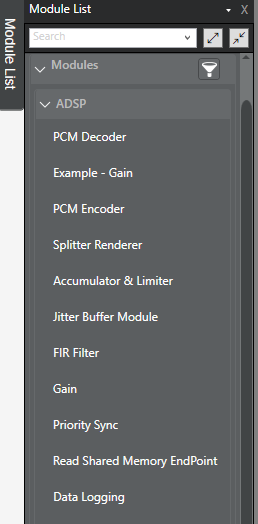

# 可用音频模块

本页快速概览了 AudioReach 上当前所有可用的音频算法（即模块）。这些模块已在 Raspberry Pi 4 上完成验证。

有关这些模块的可配置参数和能力的更多信息，可在 AudioReach Creator 中找到。要查看这些信息，请克隆 audioreach-conf 仓库中的参考 ACDB 文件，然后在 ARC 中打开它。在顶部栏中，找到 View -> Module List。模块列表将显示在左侧。（请注意，并非 Module List 中所有可用的模块都已被添加到开源项目中）。

| **模块名称** | **描述** | **源代码路径** | **依赖** | **二进制/源码** |
| --- | --- | --- | --- | --- |
| PCM Converter | PCM 转换器用于转换 PCM 流的属性，例如字节序、交织、位宽、通道数、数据格式转换器等。PCM converter、MFC、PCM decoder 和 PCM encoder 编译在一起。不过，它们可以在 AudioReach Creator 中作为独立模块使用。 | modules/cmn/pcm_mf_cnv | IIR 与动态重采样器、通道混合器 | Source |
| Accumulator & Limiter | Accumulator & Limiter 也称为 SAL（simple accumulator limiter）。它可用于混合并发的 PCM 流。使用 SAL 时，你必须确保所有输入流都是相同的数据格式。 | modules/cmn/simple_accumulator_limiter | Limiter | Binary 32-bit ARM |
| PCM Decoder | PCM decoder 和 encoder 模块位于“modules/audio”文件夹下，但它们是在 PCM converter 的构建文件中编译的。不过，它们在 ARC 中是独立的模块。 | modules/audio/pcm_decoder | None | Source |
| PCM Encoder | 对 PCM 流进行编码。 | modules/audio/pcm_encoder | None | Source |
| MFC | MFC 代表 Media Format Converter（媒体格式转换器）。它作为 PCM converter 的一部分编译，但 MFC 的源代码不可用。不过，你可以在 ARC 中将 MFC 作为独立模块使用。MFC 在 ARC 中有许多可配置属性。它允许你对流进行重采样、更改通道混合器系数，以及设置输出媒体格式（采样率、bit_width 和通道数）。MFC 具备 channel_mixer、iir resampler 和 dynamic resampler 模块的全部功能。 | modules/cmn/pcm_mf_cnv | IIR 与动态重采样器、通道混合器 | None |
| Bass Boost | bass boost 模块用于增强音频播放的低音。 | modules/processing/bassboost | Limiter、DRC、MS-IIR Filter | Source |
| Channel Mixer | 通道混合器将根据配置的系数对通道进行上混或下混。 | modules/processing/channel_mixer | None | Source |
| FIR Filter | FIR 代表“Finite Impulse Response”（有限脉冲响应）调参滤波器模块。它支持多通道滤波。 | modules/processing/filters/fir | None | Source |
| MS-IIR Filter | MS-IIR 代表 multi-stage IIR Filter（多级 IIR 滤波器）。这是一个多通道调参滤波器模块。 | modules/processing/filters/multi_stage_iir | None | Source |
| Dynamic Range Control | 用于压缩音频信号的范围，减小最低与最高信号之间的范围。它在 ARC 中不是独立模块，因为其所有功能都已包含在 IIR_MBDRC 模块中。 | modules/processing/gain_control/drc | None | Binary 32-bit ARM |
| IIR_MBDRC | MBDRC 代表 multiband dynamic range control（多频段动态范围控制）。它在实时校准模式下具备多种能力，例如设置增益、压缩/扩展以及配置限幅器。它还包含 DRC 模块的全部功能。 | modules/processing/gain_control/iir_mbdrc | DRC、Limiter | Binary 32-bit ARM |
| Limiter | Limiter 不能在 ARC 中作为独立模块使用。不过，它是其他模块（例如 SAL 和 IIR_MBDRC）的依赖项。 | modules/processing/gain_control/limiter | None | Source |
| Popless Equalizer | 一个基础的调参和均衡模块。 | modules/processing/PoplessEqualizer | MS-IIR Filter | Source |
| Dynamic Resampler | 动态重采样器可用于将 PCM 流转换为任意采样率。动态重采样器在 ARC 中没有独立模块，但可以通过 MFC 模块使用。 | modules/processing/resamplers/dynamic_resampler | None | Binary 32-bit ARM |
| IIR Resampler | IIR resampler 是一个基础的软件重采样器，采用基于 IIR 滤波器的高效实现。它在 ARC 中同样没有独立模块，但可以通过 MFC 模块使用。 | modules/processing/resamplers/iir_resampler | None | Binary 32-bit ARM |
| Shoebox | shoebox 模块用于减少立方体房间中的混响效果。Shoebox 和 reverb 在 ARC 中是两个不同的模块；不过，它们共享相同的源代码。可以设置多个变量来优化 shoebox 模块，例如房间大小、房间所用的材质等。 | modules/processing/shoebox_reverb | None | Binary 32-bit ARM |
| Reverb | reverb 模块与 shoebox 类似，但它针对环境类型（例如竞技场、城市、走廊等）提供了预设。 | modules/processing/shoebox_reverb | None | Binary 32-bit ARM |
| Virtualizer | Virtualizer 可用于配置环绕声。 | modules/processing/Virtualizer | MS-IIR Filter、Limiter | Binary 32-bit ARM |
| Gain | Gain 模块用于增大和减小流的音量。gain 和 volume control 两者的布局略有不同。gain 的构建文件位于“processing/volume_control/capi/gain/build”下。不过，gain 和 soft volume 两个模块的源代码都在“volume_control/lib”下。 | modules/processing/volume_control/capi/gain | None | Source |
| Volume Control | Volume Control 包含基础的音量控制，例如增益和静音。它还可用于更改每个单独通道的音量，或者提供一个“master gain”选项，可一次性设置所有通道的增益。 | modules/processing/volume_control/capi/soft_vol | None | Source |
