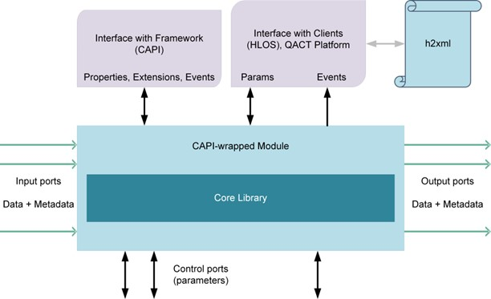
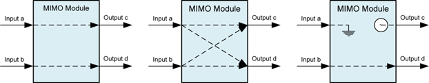
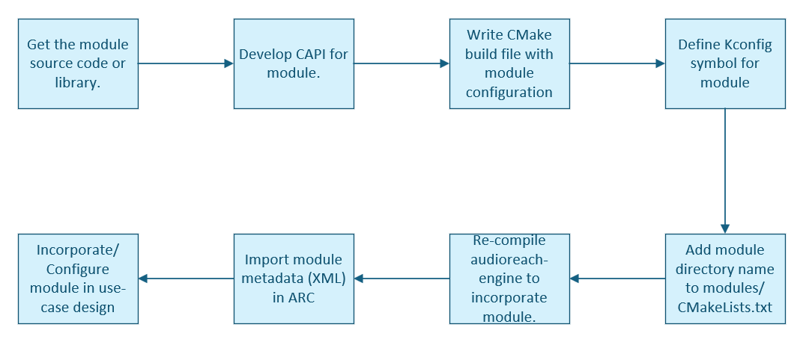
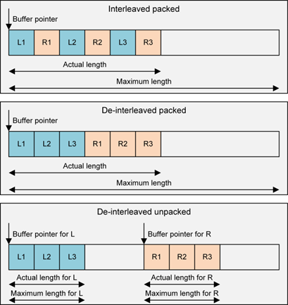
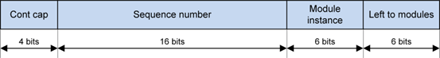
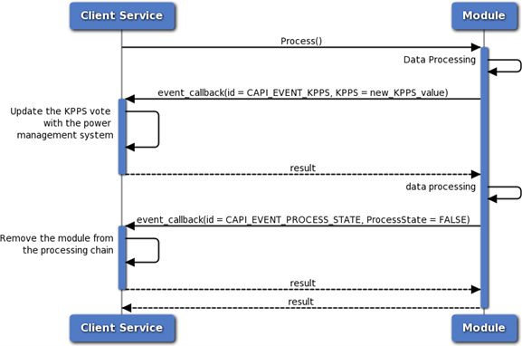
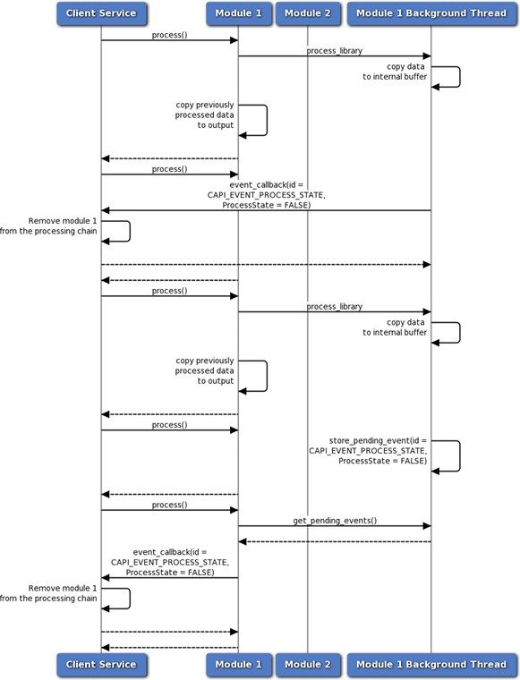
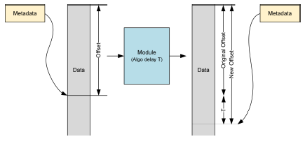
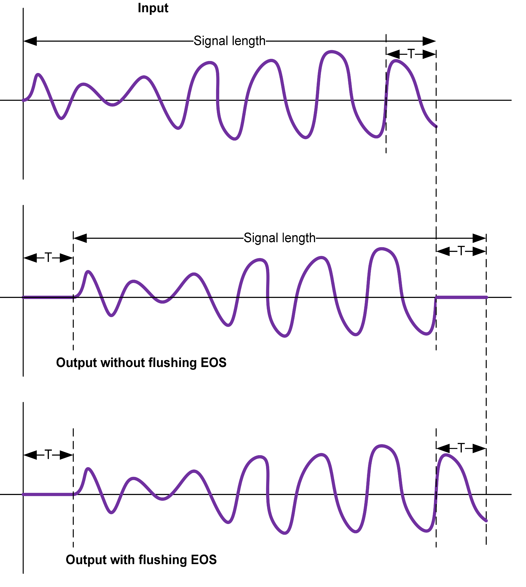
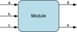

# CAPI 模块开发指南

## 简介

### 目的

本文档介绍 Common Audio Processor Interface（CAPI），它是 AudioReach™ AudioReach 引擎（ARE）与音频信号处理算法（例如前/后处理、编码器和解码器）之间的接口。

## 功能概述

音频信号处理大致可分为以下几类：

- 音频处理
- 编码器
- 解码器

例如，对于音频录制，麦克风数据首先经过高通滤波器（HPF）处理以去除诸如交流噪声之类的低频，接着经过多频带滤波器以补偿麦克风的非线性，然后经过回声消除与噪声抑制（ECNS）算法，等等。数据最终被编码并存储到文件中。同样，在音频回放中，来自文件或网络的数据被解码、使用效果器/滤波器进行后处理，然后进行渲染。每个滤波器、效果器和 ECNS 都被称为*模块*。一系列此类模块构成一个*图*。使用 ARC 来绘制图，并将其与高层用例关联起来。通常，此类算法的核心库是单独开发的。为了在 ARE 中运行这些算法，需要编写一个 CAPI 包装器。CAPI 为框架抽象了这些算法。经过 CAPI 包装的算法/功能被称为 *CAPI 模块*，或简称为模块。在 ARE 中，模块由*容器*托管，容器为模块提供执行环境。

以下是一个模块的典型文件夹结构：


*模块的典型文件夹结构*

### 模块

一个模块的接口包括以下内容：

- 数据端口
    - 输入和输出端口，每个端口可以支持多个通道
    - 零个到多个输入或输出端口
    - 除数据外，元数据也通过这些端口传输
- 用于模块间通信的可选控制端口
- 与框架（容器）之间的接口（CAPI）
    - 属性、事件和扩展（扩展中又包含参数和事件）
- 与客户端（HLOS 或 ARC 平台）之间的接口
    - 参数和事件（用 h2xml 标签注解）

**NOTE：** h2xml 标签在模块的接口头文件中填写。这些标签用于从头文件生成一个 XML 文件，以便将模块导入 ARC 平台。更多信息请参阅 ARC 文档。

在框架中，容器假定整个 CAPI 模块运行在与容器相同的线程中。如果模块使用了多线程，那么处理同步是 CAPI 模块自身的责任（例如，在主线程中对模块执行 set_param() 可能会导致数据损坏）。

下图展示了模块的接口视图。


*模块的接口视图*

### 模块类型

- 单输入单输出（SISO）模块：
    - 前/后处理（PP）模块——PP 算法，如滤波器、均衡器、采样率转换器、回声消除器等
    - 编码器，例如 AAC 编码器
    - 解码器，例如 AAC 解码器
    - 打包器，例如 IEC 61937 打包器
    - 解包器，例如 IEC 61937 解包器
    - 转换器，例如 EAC3 格式到 AC3 格式的转换器
- 源模块——零数据输入模块，例如 DMA 源、DTMF 发生器等。
- 汇模块——零数据输出模块，例如 DMA 汇、DTMF 检测器等。
- 多输入多输出（MIMO）模块，例如多写、多读缓冲区，或带有麦克风和回放参考输入以及独立 EC 输出和 NS 输出的 ECNS 算法
- 多输入单输出（MISO）模块，例如混音器、只有一个输出的 EC 等。
- 单输入多输出（SIMO）模块，例如分路器

*单端口模块*指的是 SISO 模块，或带有一个输出的源模块，或带有一个输入的汇模块。

*多端口模块*指的是所有非单端口模块。框架并不了解多端口模块内部的路由。一个两输入（A 和 B）、两输出（C 和 D）的模块可以有下图所示的任意可能的数据路由。目前，模块必须至少具有一个输入或输出端口，如下图所示。


*模块的输入和输出端口*

基于采样的 PP 模块是这样一类 PP 模块：在一次 process 调用中，接收 N 个采样并处理/返回相同数量的采样（例如滤波器、均衡器）。分数重采样模块或速率匹配不属于此类。简单 PP 模块是 SISO PP 模块。包括所有基于采样的模块以及采样率转换器，包括分数重采样、速率匹配器等。*简单*并不表示模块中实现的算法是简单的，它只表示与框架的交互是简单的。

### CAPI 的生命周期

下图展示了一个 CAPI 的生命周期。高亮的函数在运行时使用。除了 initialize 和 end 之外，其余所有函数都可以被多次调用。


*CAPI 的生命周期*

CAPI 有两个静态函数：

- capi_get_static_properties_f()——用于查询属性，例如模块所需的内存、栈大小、所需的扩展等。
- capi_init_f()——被调用以初始化模块的实例。

CAPI 具有以下通过虚函数表（vtable）处理的动态函数：

- capi_vtbl_t::process()
- capi_vtbl_t::end()
- capi_vtbl_t::set_param()
- capi_vtbl_t::get_param()
- capi_vtbl_t::set_properties()
- capi_vtbl_t::get_properties()

vtable 中的 get_properties()、set_properties()、get_param()、set_param() 和 process() 函数在模块的生命周期内会被多次使用。capi_get_static_properties_f() 函数可以被多次调用。capi_init_f() 和 end() 函数只被调用一次。CAPI 还可以使用框架在 capi_init_f() 期间提供的回调函数来触发事件。

以下是一个 CAPI 生命周期的示例。

1. 框架通过带 CAPI_INIT_MEMORY_REQUIREMENT 属性 ID 的 capi_get_static_properties_f() 查询模块所需的内存。
2. 框架查询其他静态属性，例如：
    - 栈大小（CAPI_STACK_SIZE）
    - 原地处理能力（CAPI_IS_INPLACE）
    - 数据缓冲需求（CAPI_REQUIRES_DATA_BUFFERING）
    - 支持的接口扩展（CAPI_INTERFACE_EXTENSIONS）
    - 所需的框架扩展（CAPI_NUM_NEEDED_FRAMEWORK_EXTENSIONS、CAPI_NEEDED_FRAMEWORK_EXTENSIONS）
    - 支持的接口扩展（CAPI_INTERFACE_EXTENSIONS）
  未来还会添加更多属性。
  根据框架实现的不同，查询可以一次针对一个或多个属性进行。通常，当框架需要知道每个属性各自的返回错误码时，会一次查询一个属性。
3. 框架分配内存并对 CAPI 调用 capi_init_f()。
    - 此时会传入其他属性，例如事件回调函数（CAPI_EVENT_CALLBACK_INFO）、用于任何运行时内存分配的堆 ID（CAPI_HEAP_ID）等。同一组属性也会在 capi_get_static_properties_f() 中传入。
    - CAPI 返回 vtable。
4. 在 capi_init_f() 之后、直到 CAPI 结束之前，还可以进行更多属性和事件的设置与获取：
    - 与框架和接口扩展相关的属性。
    - 针对媒体格式 CAPI_INPUT_MEDIA_FORMAT_V2 的 capi_vtbl_t::set_properties() 调用。如果输出媒体格式发生变化，模块可以触发一个输出媒体格式事件（CAPI_EVENT_OUTPUT_MEDIA_FORMAT_UPDATED_V2）。
    - 与缓冲相关的属性，例如 CAPI_PORT_DATA_THRESHOLD 或 CAPI_EVENT_PORT_DATA_THRESHOLD_CHANGE。
    - 各种事件，例如 KPPS（CAPI_EVENT_KPPS）、带宽（CAPI_EVENT_BANDWIDTH）、算法延迟（CAPI_EVENT_ALGORITHMIC_DELAY）、处理状态（CAPI_EVENT_PROCESS_STATE）等。
5. capi_vtbl_t::set_param() 和 capi_vtbl_t::get_param() 函数也可以在 capi_init_f() 之后、直到 capi_vtbl_t::end() 之前的任何时候被调用。
6. capi_vtbl_t::process() 函数在运行时被调用以处理数据。
7. 最后，调用 capi_vtbl_t::end() 函数以销毁 CAPI 模块。

下表描述了属性（property）与参数（parameter）之间的区别。

| **Property** | **Parameter** |
| --- | --- |
| 由核心 CAPI 接口定义 | 由模块或 CAPI 框架及接口扩展定义 |
| 适用于所有模块 | 仅适用于定义了该参数或支持该扩展的模块 |
| 定义框架与模块之间的交互 | 通常与校准和配置相关 |
| 模块开发者不能添加属性 | 模块开发者可以添加参数 |
| 使用以下函数：capi_get_static_properties_f()、capi_vtbl_t::get_properties()、capi_vtbl_t::set_properties() | 使用以下函数：capi_vtbl_t::get_param() 和 capi_vtbl_t::set_param() |

### 入口点函数

CAPI 的入口点函数是 capi_get_static_properties_f() 和 capi_init_f()。

capi_init_f() 函数接收一个可用于初始化模块的属性列表。框架可以使用此列表来设置那些在初始化期间已知其值的属性，而模块可以利用这些属性来优化其初始化序列。例如，模块可以利用这些属性来确定某些内部内存分配的大小，从而避免后续释放和重新分配内存的需要。

capi_get_static_properties_f() 函数也接收一个 capi_init_f() 属性列表。框架发送的属性与为 capi_init_f() 函数发送的属性完全相同。因此，模块可以正确计算其返回的对象大小。

从 capi_init_f() 返回任何错误都表示模块未被初始化。因此，只有当模块因错误而无法继续时才应返回错误。如果在 capi_init_f() 期间设置了不支持的属性，模块应返回 CAPI_EOK。如果模块从 capi_init_f() 返回错误，它必须确保执行所有清理工作，因为 capi_vtbl_t::end() 不会被调用。任何静态属性也可以在 capi_vtbl_t::get_properties() 中被查询。模块必须为 get_properties 和 capi_get_static_properties_f() 二者使用同一套通用实现。静态属性不能依赖 CAPI 的实例内存。

### 错误码

CAPI 函数返回的错误码被解释为位域（bit field）。可以同时设置多个位以指示各种错误。CAPI_SET_ERROR 辅助宏可用于在错误码中设置某个位，而 CAPI_IS_ERROR_CODE_SET 辅助宏可用于检查错误码中是否设置了某个特定位。

#### 设置和获取属性时的错误

使用 capi_proplist_t 结构的函数可以一次设置或获取多个属性值。在从列表中设置或获取属性时发生的错误必须按以下方式处理：

- 如果模块不支持该属性，则必须在错误码中设置 CAPI_EUNSUPPORTED 标志，并且该属性的 actual_data_len 字段必须设置为零。
- 其余属性仍必须继续处理（而不是在遇到不支持的属性时就退出）。

### 扩展

CAPI 提供了一种扩展接口功能的机制。这些附加功能通过框架扩展和接口扩展提供。

这些扩展通常使用头文件来定义，这些头文件同时被模块和框架包含。每个扩展都由一个全局唯一标识符（GUID）标识。头文件随后描述使用这些扩展的框架和模块的行为。扩展所需的任何 set 参数 ID、负载、属性、事件、常量定义和函数声明也都存在于该头文件中。

#### 框架扩展

框架使用 capi_get_static_properties_f() 向模块查询框架所需的扩展列表。

如果框架支持这些扩展，它就可以创建模块并继续。否则，框架必须发送错误。因此，框架扩展不是可选的。

#### 接口扩展

框架使用 capi_get_static_properties_f() 向模块发送它所支持的接口扩展列表。模块随后可以设置标志，以指示它将从该列表中使用哪些接口扩展。

如果模块运行需要某个接口扩展，它可以在此时发送错误。框架随后检查模块所选择的接口扩展列表，如果可以接受，就创建模块。因此，接口扩展是可选的。

每个接口扩展都可以包含一个可选结构，用于协商更细粒度的支持。该结构必须在接口扩展头文件中定义。

#### 框架扩展与接口扩展之间的区别

| **框架扩展** | **接口扩展** |
| --- | --- |
| 定义一种模块要求框架支持的行为。 | 可以为框架、模块或二者定义某种行为。 |
| 如果模块需要某个框架扩展，那么在框架不支持该框架扩展时，模块无法运行。 | 支持情况可以在框架与模块之间协商。协商之后，框架和模块可以确定是否有可能达成一种可接受的配置。 |
| 框架扩展要么被框架支持，要么不被支持；没有办法指示部分支持。 | 可以使用一个可选结构来协商更细粒度的能力。 |

### 其他要求

- 所有函数都必须是可重入的。这意味着库的多个实例能够同时运行而不产生任何冲突。所有状态都存储在实例结构中，该结构作为第一个参数传递给所有函数。
- CAPI 的 vtable 指针必须是 CAPI 结构中的第一个元素。
- 我们建议在 get 和 set 参数中进行大小检查，并在 process 函数中对流数据和缓冲区进行 NULL 检查。

## 模块集成

### 工作流

下图说明了模块集成工作流。模块 ID 和参数 ID 必须使用 GUID。每个客户都会被分配一个范围，从中选取这些 ID。


*模块集成工作流*

更多细节请参阅 [README](https://github.com/Audioreach/audioreach-engine?tab=readme-ov-file#adding-new-module)。

### 入口点函数的命名约定

你必须定义遵循 capi_get_static_properties_f() 和 capi_init_f() 定义签名的函数。使用这些函数作为入口点函数来创建模块的实例，命名约定如下：

- 你的 capi_get_static_properties_f() 函数变体必须按如下方式命名：*<*tag*>*_get_static_properties_f()，其中 *<*tag*>* 可以是任意字符串，只要函数名仍然是有效的 C 函数名即可。
- 你的 capi_init_f() 函数变体必须按如下方式命名：*<*tag*>*_init，其中 *<*tag*>* 必须与用作 capi_get_static_properties_f() 函数变体名称中 tag 的字符串相同。

一个有效的 *<*tag*>* 示例是 volume_control。使用该 tag，函数名分别为 volume_control_get_static_properties_f() 和 volume_control_init()。

用于命名入口点函数的 *<*tag*>* 用于将模块注册到 ARE 中的 Audio Module Data Base（AMDB）。

## 功能描述

### 媒体格式

ARE 处理各种各样的媒体，包括定点 PCM 数据、原始压缩数据（例如 AAC 比特流）等。对于 PCM 数据，诸如采样率和通道数之类的额外属性被封装在媒体格式中。

- 媒体格式包含：
    - 数据格式——定点、打包（例如 IEC61937）、原始压缩
    - 对于 PCM 或打包数据——采样率、通道数、通道映射、位宽等
    - 所有数据格式的格式 ID——用于标识数据是 PCM、AAC、MP3 等
- ARE 并不了解模块的输出格式。模块必须实现查询（capi_vtbl_t::get_properties()）和事件。
- 通常，在进行 capi_vtbl_t::process() 调用之前，ARE 会设置有效的输入媒体格式，并且模块必须已经触发了输出媒体格式（如果 ARE 未进行查询的话）。
- CAPI_INPUT_MEDIA_FORMAT_V2——由 ARE 用于在输入数据端口上设置媒体格式。在 capi_vtbl_t::process() 调用中发送的数据遵循此媒体格式。ARE 从不将此媒体格式用于 capi_vtbl_t::get_properties()。模块必须确保它们所接收的媒体格式是受支持的（例如，某些模块可能不支持 24 位数据或分数采样率）。
- CAPI_OUTPUT_MEDIA_FORMAT_V2——由 ARE 用于查询输出数据端口上的媒体格式。模块在 capi_vtbl_t::process() 调用中输出的数据遵循此媒体格式。它从不用于 capi_vtbl_t::set_properties。ARE 在 process() 调用中按照模块所输出的媒体格式提供缓冲区。
- CAPI_EVENT_OUTPUT_MEDIA_FORMAT_UPDATED_V2——由模块用于在输出数据端口上触发媒体格式事件。

我们建议使用 v2 版本的媒体格式属性和事件。v1 与 v2 的区别在于，v1 最多只支持 16 个通道，而 v2 支持无限数量的通道。

下表汇总了媒体格式所使用的函数。

| **媒体格式** | **get_property()** | **set_property()** | **事件** |
| --- | --- | --- | --- |
| 输入 | 否 | 是 | 否 |
| 输出 | 是 | 否 | 是 |

通常，单端口模块不会被告知新的连接，因为它们不实现 INTF_EXTN_DATA_PORT_OPERATION。系统假定模块会触发媒体格式，然后端口被断开再重新连接。模块对此并不知情。然而，由于端口内存在 ARE 中被重新创建，先前的媒体格式信息会丢失。为了获知媒体格式，容器可以向模块查询媒体格式。因此，在 ARE 中，同时支持媒体格式的查询和事件非常重要。

#### 定点

一个 bits_per_sample 字段决定字长（capi_standard_data_format_t 和 capi_standard_data_format_v2_t）。

尽管 bits_per_sample 决定字长，但实际采样可能具有相等或更小的宽度，这由位宽决定。位宽可以从 Q 因子推断出来。如果 Q 因子为 Q27，它表示 32 位字中的 24 位数据。

然而，要明确获知位宽，必须使用 PCM 框架扩展（FWK_EXTN_PCM_PARAM_ID_MEDIA_FORMAT_EXTN）。

##### 交织

在交织和去交织打包（packed）的情形下，capi_vtbl_t::process() 调用中每个流只包含一个缓冲区。在去交织非打包（unpacked）的情形下，process() 调用中每个流的每个通道都包含一个缓冲区。下图说明了 PCM 的交织和去交织。


*PCM 的交织和去交织*

##### 通道映射或通道类型

在回放期间，音频通道被路由到不同的扬声器。每个扬声器都有一个指定的位置（例如左、右、中置和 LFE）。当不同的通道在软件中被处理和路由时，扬声器必须识别某个通道被路由到哪些数据。同样，在多通道录制用例中，麦克风数据可能包含噪声参考信号与主信号。

每个通道都有一个与之关联的通道类型或映射。有了这个概念，就不需要在缓冲区中固定通道的顺序。例如，左通道不必位于第一个位置、右通道不必位于第二个位置。用通道类型来标记每个位置就足够了。

例如，某些解码器可能按此顺序提供输出：L、R、LFE、C、Ls、Rs。而另一些可能按此顺序提供输出：L、R、C、LFE、Ls、Rs（C 和 LFE 互换了）。如果要用不同的滤波器系数处理 LFE，那么在这样的滤波器上调参会指明每个通道或每组通道的系数。

当前定义的通道类型主要表示扬声器名称。对于麦克风通路或更多扬声器名称，请使用自定义通道映射（例如 PCM_CUSTOM_CHANNEL_MAP_1）。系统设计者可以根据产品需求赋予其含义。

#### 浮点

CAPI_FLOATING_POINT 数据格式用于浮点数据。

#### 原始压缩

CAPI_RAW_COMPRESSED 数据格式用于编码数据（例如解码器的输入或编码器的输出）。

#### 打包格式

CAPI 支持各种打包格式，例如 IEC 61397、IEC 60958 非线性、DSD DOP、compressed-over-PCM（COP）和通用压缩。这些格式也遵循 capi_standard_data_format_t 或 capi_standard_data_format_v2_t，因为其数据看起来像定点。

#### 去交织原始压缩

CAPI_DEINTERLEAVED_RAW_COMPRESSED 数据格式用于在需要时将编码数据的不同通道放在各自独立的缓冲区中发送，例如左通道放在一个缓冲区、右通道放在另一个缓冲区。这有助于下游模块分别处理左右通道。

### 缓冲

缓冲通过 CAPI_REQUIRES_DATA_BUFFERING、CAPI_PORT_DATA_THRESHOLD 和 CAPI_EVENT_PORT_DATA_THRESHOLD_CHANGE 来决定。阈值基本上就是每个数据端口以字节为单位的缓冲区大小。示例：

- 能够处理任意数据量的模块应将阈值返回为 1 字节。
- 帧时长为 10 ms 的固定帧大小模块。在 48K、2 通道、每采样 2 字节的情况下：10 ∗ 48 ∗ 2 ∗ 2 = 1920 字节阈值。
- 帧宽为 1024 采样的固定帧大小模块。在 48K、2 通道、每采样 2 字节的情况下：1024 ∗ 2 ∗ 2 = 4096 字节阈值。
- 最大输入帧大小为 8192 字节的解码器。

输入端口和输出端口都可以有各自的阈值。例如：

- 编码器输入可以是 2048 字节，输出可以是 256 字节。
- 一个固定帧大小模块，在输入媒体格式（48K、2 通道、每采样 2 字节）下具有 10 ms 阈值，在输出媒体格式（48K、6 通道、每采样 2 字节）下，其输入阈值为 1920 字节，输出阈值为 11520 字节。

一个多端口模块的不同端口可以有各自的阈值。例如：

- 一个帧时长为 5 ms 的 EC 模块，其麦克风数据可以是 16K、2 通道、每采样 2 字节，回放参考可以是 48K、2 通道、每采样 2 字节。因此，第一个输入的阈值为 320 字节，第二个输入的阈值为 960 字节。

通常，解码器的最坏情况帧大小即为输入和输出阈值。在数据被处理之前，解码器无法得知所需的大小，而要读取数据就需要一个缓冲区。大于 1 的阈值可以确保输入中存在最少的采样（字节），并在调用 capi_vtbl_t::process() 时最小化输出中可用的空闲空间（取决于 CAPI_REQUIRES_DATA_BUFFERING 标志）。

| **需要数据缓冲** | **端口阈值** | **典型模块** | **框架行为** |
| --- | --- | --- | --- |
| FALSE | 1 | 基于采样的 PP 模块（N 采样输入产生 N 采样输出） | 对于 PCM，ARE 确保当提供任何输入时，输出有足够的空间容纳同样多采样量的输出。 |
| FALSE | > 1 | 编码器和固定帧大小模块（例如可能具有固定帧大小如 10 ms 的 EC） | 对于 PCM，假设 N 是输入阈值、M 是输出阈值，ARE 确保当模块的 process 被调用时，输入中存在 N 个采样，并且输出中有 M 个采样量的空间可用。 |
| TRUE | 1 | 重采样器（分数）、速率匹配、缓冲模块 | ARE 可以用任意数量的输入调用 process 函数。不过，也有一些扩展可以优化这些调用。 |
| TRUE | > 1 | 解码器、打包器、解包器，以及可能的编码器 | ARE 可以用任意数量的输入调用 process 函数。 |

当 CAPI_REQUIRES_DATA_BUFFERING 标志为 FALSE 时，同一个缓冲区可以被多个模块重用，因为在对模块调用 capi_vtbl_t::process() 之后，这些缓冲区中不会留下部分数据。设置 CAPI_REQUIRES_DATA_BUFFERING 标志会带来额外的开销，因此只有在绝对必要时才使用它。

#### 非缓冲数据流模型

在非缓冲数据流模型中，CAPI_REQUIRES_DATA_BUFFERING 标志被设置为 FALSE。非缓冲数据流模型如下：

- 框架必须确保它在模块的每个输入端口上提供相同数量的采样。对于压缩数据，必须在每个输入端口上提供相同数量的字节。
- 模块每个输出端口上提供的输出采样数必须与输入采样数相同。对于压缩数据，每个端口上的字节数必须与输入字节数相同。框架代码必须确保输出缓冲区中有足够的空间。
- 模块必须能够处理任意数量的输入采样（在压缩数据的情况下为输入字节）。

此模型开销较低，因此应尽可能使用它。你也可以将此模型用于按固定数据块（帧）进行处理的模块。

#### 缓冲数据流模型

在缓冲数据流模型中，CAPI_REQUIRES_DATA_BUFFERING 标志被设置为 TRUE。缓冲数据流模型如下：

- 模块必须为每个输入和输出端口定义一个以字节数表示的阈值。

框架可以随时使用 CAPI_PORT_DATA_THRESHOLD 属性查询任何端口的这个阈值。如果阈值发生变化，模块必须为每个阈值发生变化的端口触发 CAPI_EVENT_PORT_DATA_THRESHOLD_CHANGE 事件。

- 对于输入端口，阈值表示保证能够进行处理所需的最小数据量。例如，考虑一个具有 100 字节数据、阈值为 25 字节的输入缓冲区。
    - 如果模块消耗了超过 75 字节，则输入缓冲区中剩余的数据量将小于其阈值。
    - 当这种情况发生时，模块可以停止进一步处理并从 capi_vtbl_t::process() 返回。

模块有可能用更少的数据量进行处理。例如，如果模块执行压缩数据的解码，那么这个值就是最坏情况下的压缩帧大小。如果实际的压缩帧大小更小，模块就可以用更少的数据来执行解码。在这种情况下，它可以继续处理。

- 对于输出端口，阈值表示保证能够进行处理所需的最小空闲空间。

例如，考虑一个最大大小为 100 字节、阈值为 25 字节的输出缓冲区。如果模块产生了超过 75 字节的数据，则输出缓冲区中剩余的空闲空间将小于阈值。当这种情况发生时，模块可以停止进一步处理并从 capi_vtbl_t::process() 返回。

- 框架在调用 capi_vtbl_t::process() 时可以提供任意大小的输入和输出缓冲区。
- 当 capi_vtbl_t::process() 调用返回时：
    - 模块必须已经消耗了足够的数据，使得至少一个输入端口中剩余的有效数据量小于该端口的阈值。
    - 或者，模块必须已经产生了足够的数据，使得至少一个输出端口中剩余的空闲空间小于该端口的阈值。

以下是可以提供的阈值示例：

- 解码器：
    - 输入阈值 = 最坏情况下的压缩帧大小
    - 输出阈值 = 一个未压缩帧的大小
- 编码器：
    - 输入阈值 = 一个未压缩帧的大小
    - 输出阈值 = 最坏情况下的压缩帧大小
- 可处理任意数量采样的采样率转换器：
    - 输入阈值 = 1
    - 输出阈值 = 1

此模型开销较高，因此仅在必要时使用它。

### 调试

出于调试目的，ARE 中添加了两个属性：

**CAPI_MODULE_INSTANCE_ID** 图中的每个模块都有一个唯一的实例 ID。这个模块实例 ID 由 ARC 平台分配，并在 capi_init_f() 时或紧随其后通过此属性提供给模块。这里也提供了模块 ID，不过不应引入基于模块 ID 的逻辑。

**CAPI_LOGGING_INFO** 包含日志 ID 和一个掩码。日志 ID 对于每个模块实例是唯一的，它包含用于标识模块运行所在容器的位。我们建议模块用日志 ID 打印调试消息。掩码标识了留给模块的 6 个位（这在未来可能会改变；因此，必须使用所提供的掩码）。当发生 EOS 或其他某些不连续时，模块可以递增这 6 个位。如果模块以日志 ID 作为文件名后缀进行文件日志记录，那么每一次不连续都会生成一个新文件。


*日志 ID 的位掩码*

### 数据端口

数据端口有不同类型：

- 有标签端口或静态数据端口——模块声明端口 ID。例如，一个 EC 模块可以将端口标记为麦克风输入（语音通话中的*近端*）和回放参考输入（语音通话中的*远端*）。
- 动态端口——ARC 平台在外部分配端口 ID。例如，混音器可以支持多个输入。

以下限制适用于端口的数量：

- 模块实现可能会限制它能支持的最大端口数，也可能支持无限数量的端口。
- 当模块被放置在图中时，取决于最大并发数，会存在一个最大端口数。
- 取决于实际的活动并发数，会存在一个具体的端口数。

模块某个给定实例中可能的最大端口数通过 CAPI_PORT_NUM_INFO 传达，这对于内存分配很有用。如果一个模块既可以带输出端口工作也可以不带输出端口工作，即它可以充当带输出端口的模块或充当汇，那么当框架用属性 ID CAPI_MIN_PORT_NUM_INFO 查询时，模块必须将此情况告知框架。默认情况下，框架假定最小输出端口数为 1。同样的情况适用于既可以带输入端口也可以不带输入端口工作（可充当源）的模块。

#### 端口索引和端口 ID

CAPI 依赖端口索引。例如，capi_vtbl_t::process() 调用使用按端口索引进行索引的流数据数组。对于多端口模块，端口 ID 用于 ARC 平台中的图示。虽然索引对于大多数模块来说就足够了，但在某些情况下索引与端口 ID 的映射可能很重要。例如，一个包含端口 ID 的参数可能会被暴露给客户端。INTF_EXTN_DATA_PORT_OPERATION 接口扩展可用于获取端口 ID 到索引的映射，也可用于获知端口何时被打开、关闭、启动或停止。更多细节请参阅 Data Port Operation。端口索引由框架分配。端口索引的最大值小于 CAPI_PORT_NUM_INFO 中的数量。

### 获取和设置参数

模块必须为它所支持的所有参数定义 ID 和负载结构。还需要 H2xml 注解。

#### 对齐、打包和获取参数的要求

某些模块参数负载具有子结构和变长数组。例如：struct_a { int num; struct_b arr[0]}，其中 arr 的长度为 num。如果 struct_b 的大小未对齐到 4 字节且它有一个 4 字节的元素，某些处理器会因未对齐而崩溃。因此，ARC 平台确保所有子结构都被填充为 4 字节对齐，以便此类结构的数组，或者跟在某个结构之后的另一个子结构的对齐，不会被破坏。那么 8 字节对齐呢？在上面的例子中，可能也需要 8 字节对齐，但这不受支持。8 字节的数必须拆分成两个 4 字节的数。对于打包要求，模块负载可以手动打包到正确的对齐（至少 4 字节）。ARC 平台始终确保打包，但手动打包有助于模块内部的解析。例如：struct {int8 a; int8 b;} 必须手动填充为：struct {int8 a; int8 b; int8 reserved1; int8 reserved2}

#### 获取参数的要求

当 ARE 的客户端调用 APM_CMD_GET_CFG API 时，它会被转换为对 CAPI 模块的 capi_vtbl_t::get_param() 函数调用。当参数是可变大小时，客户端并不知道该参数需要多少内存。

h2xmlp_maxSize 注解可用于为 capi_vtbl_t::get_param() 注解参数的大小要求。

模块必须实现以下逻辑：如果所提供的大小不足，模块必须返回 CAPI_ENEEDMORE 错误，并用所需大小（包括对齐所需的内存，如果有的话）更新实际长度。

#### 持久化参数的属性

通常，当发出一次 set_param() 时，模块会复制负载。然而，当一个参数的负载（校准数据）非常庞大时，复制数据并不可取。模块可以将某些参数定义为持久化的（通过头文件中的 h2xml 标签），当发出 set_param() 时，模块可以存储指向该数据块的指针。在执行这样一次 set_param() 之前，会先执行一次 capi_vtbl_t::set_properties() 以指明模块必须复制该指针。如果模块并不期望该参数是持久化的，或者情况相反，那么可以抛出错误或实现相应的处理。详情请参阅 CAPI_PARAM_PERSISTENCE_INFO。

对于不支持的属性，较旧的模块应返回 CAPI_EUNSUPPORTED；此类错误会被忽略。这确保了向后兼容性。

### 事件

系统为模块提供了一种机制，用于将发生的事件通知框架。事件由预定义的事件 ID 标识。接口还描述了与每个事件 ID 对应的负载。当回调函数被调用时，模块向框架提供以下信息：

- 一个不透明的状态令牌，它是在模块被创建时由框架提供的。
- 事件 ID。
- 与此事件关联的端口号（可选）。
- 一个包含与此事件关联的负载的缓冲区。模块必须分配该缓冲区，并且它可以在回调函数返回后释放该缓冲区。

所有事件 ID 及其负载都在文件 [capi_events.h](../api/spf_capi.md) 中描述。

以下是向框架触发事件的典型调用流程。


*触发事件的典型调用流程*

在图中，在一次 capi_vtbl_t::process() 调用中触发了两个事件。框架在回调函数内采取相应的动作。**NOTE** 模块可以在来自 capi_vtbl_t 的任何 CAPI 调用中触发事件：init()、get_properties()、set_properties()、get_param()、set_param()、process() 和 end()。

#### 线程安全

回调函数的实现不是线程安全的。如果模块内部使用独立的线程进行处理，它只能在框架发起的一次函数调用内部调用该回调函数。以下调用流程图说明了这一点。


*线程安全调用流程*

在图中，Module 1 使用一个后台线程来处理数据。如果这个线程要触发一个事件，它不能直接调用框架的回调函数。此时框架线程可能正处于执行其他某些处理的过程中，因此这样做会损坏其数据。这种情况下的正确做法是：后台线程在内部将此事件存储为待处理事件（此处使用的数据结构必须是线程安全的）。当框架调用 capi_vtbl_t::process()（或任何其他函数）时，模块可以在框架线程的上下文中查询此数据结构，然后触发任何待处理的事件。

#### 向 ARE 客户端触发事件

CAPI 提供了一个特殊事件（CAPI_EVENT_DATA_TO_DSP_CLIENT 或 CAPI_EVENT_DATA_TO_DSP_CLIENT_V2），可用于向 ARE 的客户端处理器发送数据。当模块要发送数据时，必须触发此事件并提供以下信息：

- 参数 ID——指示负载的类型。参数 ID 的值及其对应的负载由模块开发者定义，ARE 客户端处理器上的目标服务必须能够理解它们。
- 令牌（Token）——一个可用于提供额外的实例相关信息的标识符。目标服务应能够解释这个令牌。
- 负载——要发送的负载。

向 ARE 客户端发送的 CAPI 事件通过 CAPI_REGISTER_EVENT_DATA_TO_DSP_CLIENT 和 CAPI_EVENT_DATA_TO_DSP_CLIENT 来支持。然而，采用这种方法时，框架必须负责处理事件信息。

为消除这种开销并使事件处理更加透明，请改用以下事件：

- 引入了 CAPI_REGISTER_EVENT_DATA_TO_DSP_CLIENT_V2 和 CAPI_EVENT_DATA_TO_DSP_CLIENT_V2
- CAPI_REGISTER_EVENT_DATA_TO_DSP_CLIENT_V2 接收目标地址、令牌和任何事件配置

这些事件的 v2 版本所提供的区别在于：

- 模块必须管理客户端地址。
- 客户端可以为同一事件用不同的配置进行注册。例如，一个客户端可以用一组水位（watermark）级别进行注册，而另一个客户端用另一组。

在两个版本中，每个事件都可以有多个客户端。

#### 常见事件

| **事件** | **描述** |
| --- | --- |
| 算法延迟 | 例如，滤波器的群延迟被报告为算法延迟。 |
| KPPS/BW | 每秒百万指令数（MIPS）是用于衡量算法复杂度的一个标准术语。在 Hexagon 处理器术语中，由于一个指令包（最多包含 4 条指令）可以在一个周期内执行（理想缓存情况），因此通常使用每秒千包数（KPPS）。带宽表示模块产生的总线流量的大小。 |
| 输出媒体格式 | 参见 媒体格式 一节 |
| 处理状态 | 描述模块是启用还是禁用。模块可能希望基于 UI 设置（例如均衡器禁用）、校准或其他条件来禁用自身。当模块被禁用时，它会被从处理中移除。对于单端口模块，框架会绕过该模块，图的其余部分仍可运行。禁用一个多端口模块可能会导致整个图无法使用（取决于图的形态）。 |

### Process 调用

capi_vtbl_t::process() 调用是最重要的函数，因为它会被反复调用以进行信号和数据处理：capi_err_t (*process)(capi_t* _pif, capi_stream_data_v2_t* input[], capi_stream_data_v2_t* output[]);。有两个流数据版本（v1 和 v2）；区别在于 v2 支持元数据。要访问 v2，当 stream_data_version == 1（在 capi_stream_flags_t 中）时，将 capi_stream_data_v2_t 指针转换为 capi_stream_data_v2_t 指针。

**NOTES：**

- 对于非活动（已关闭）端口，capi_stream_data_v2_t 数组中可能存在空洞（NULL 指针）。
- process() 函数可能被以 NULL 输入缓冲区（input[i] == NULL || input[ i].buf_ptr == NULL || input[i].buf_ptr[j].data_ptr == NULL）或 actual_len = 0 的缓冲区调用。
  当需要在没有任何新输入的情况下输出 CAPI 模块的某些内部内存时，这很有用。模块在访问指针之前必须进行必要的 NULL 检查。
- 如果对 process() 的调用产生了一个事件，那么在某些情况下不得填充输出缓冲区。请检查事件定义，以了解哪些事件属于此类别。

#### 流数据

对于每个端口，流数据包含以下内容：

- 标志——时间戳有效性、帧结束（EOF）、流结束（EOS）、擦除（erasure）、流数据版本
- 时间戳
- 缓冲区：
    - 对于交织和去交织打包数据，只有一个缓冲区
    - 对于去交织非打包数据，有多个缓冲区

在流数据版本 1 中，每个端口都存在一个元数据的双向链表。

#### 时间戳传播

对于 SISO 模块，框架在调用 capi_vtbl_t::process() 之前分配一个输出时间戳和标志（在 capi_stream_data_v2_t 中）。

对于 SISO 模块，框架在调用 process() 之前按如下方式分配输出时间戳和标志：output timestamp = input timestamp - algorithmic delay，其中算法延迟由模块使用 CAPI_EVENT_ALGORITHMIC_DELAY 报告。

如果模块要改变这一行为，它必须在输出 capi_stream_data_v2_t 中为时间戳分配适当的值。

对于多端口模块，输出与输入之间的关联对框架来说是未知的。模块负责正确地路由 capi_stream_data_v2_t。

#### 在 Process 调用中返回 CAPI_ENEEDMORE

如果输入数据不足以处理一帧（在固定帧模块中），CAPI 模块必须进行检查并返回 CAPI_ENEEDMORE。

如果设置了 EOF（参见 EOF 处理 一节），模块必须尝试用它所拥有的任何数据来处理该帧，或者丢弃这些数据。

#### EOF 处理

当框架要强制处理一帧时（即模块必须用它所拥有的任何数据来处理该帧，或者丢弃这些数据），框架会设置 EOF。

例如，当以 5 ms 帧进行处理时，假设还剩下 2 ms 的数据。可以再等待 3 ms 更多数据，但可能会收到一个媒体格式，表明后续数据具有不同的媒体格式。由于媒体格式发生了变化，旧的 2 ms 和这 3 ms 不能被拼接在一起放到一个缓冲区中发送。框架设置 EOF 并要求模块尽可能处理这 2 ms 的数据。模块随后可以处理这 2 ms 数据或将其丢弃。

**NOTE：** 不要填充这 3 ms 的数据，因为这会增加信号长度，从而在排空数据时造成后续延迟。

再举一个例子，某些解码器可能会在处理给定数据之前等待下一帧的同步字。为了强制模块解码现有数据而不等待后续数据，会设置 EOF。

当设置了 EOS 标志时，也会设置 EOF，因为强制处理是隐式要求的。

时间戳不连续也会导致设置 EOF，因为两个时间戳不连续的缓冲区可能无法被拼接。

传播元数据的模块也必须自己处理 EOF。通常，当模块无法用给定输入产生更多输出时，就会传播 EOF。最好在发送最后一批输出的同时输出 EOF，而不是再等待一次 process 调用。

#### EOS 处理

EOS 通过 marker_eos 标志（capi_stream_flags_t）指示，也通过 capi_stream_data_v2_t::metadata_list_ptr 中的 MODULE_CMN_MD_ID_EOS 指示（CAPI_STREAM_V2*>*=1）。处理元数据的模块也必须传播 EOS。

EOS 表示流正在结束：

- 刷新（Flushing）——算法中的任何内存都必须被刷新
- 非刷新（Non-flushing）——算法中的任何内存都不得被刷新，且 EOS 必须承受该延迟。

例如，考虑两个流被混音到一个扬声器中。当 EOS 流过时，流侧的处理必须被刷新，以便算法内部剩余的任何数据都能被送出。但是，当 EOS 流过混音器时，它会变为非刷新。如果它要保持为刷新，那么渲染出的数据在第二个流的音频中也会出现间隙。通过将 EOS 保持为非刷新，它仍会在该通路中流动，直到扬声器发送关于 EOS 渲染的通知。此时，应用程序可以关闭第一个流。

由 ARE 客户端发送的 EOS 被称为*外部 EOS*。由框架在某些情况下生成的 EOS 被称为*内部 EOS*。

- 内部 EOS 用于指示由于上游数据流停止而导致的数据流状态（例如，混音器的上游数据流停止了，EOS 由上游数据流发送，混音器就可以停止在该流上的等待）。
- 外部 EOS 也表示数据流停止。当外部 EOS 到达汇端点时（或当它被丢弃时），它会导致向 ARE 客户端发出一个事件。

有关数据流状态的更多细节，请参阅 Data Flow States。

#### 擦除处理

当输入不可用时，会设置擦除（erasure）。当在某个时刻预期有一定量的数据，但由于上游的延迟，数据未能及时到达时，就会发生这种情况。擦除告知模块数据的缺失。某些模块（例如解码器）可以触发丢包隐藏。另一些模块可以触发对已缓冲数据的斜降（ramp down），以平滑欠载（under-run）。大多数模块可能不使用此标志，但如果它们传播元数据，那么它们也必须传播此标志。

#### 元数据传播

包括 EOS 传播在内的元数据传播使用 INTF_EXTN_METADATA 扩展来执行。

#### 在 Process 上下文中触发事件

当要在 capi_vtbl_t::process() 上下文中触发以下事件时，模块不得输出数据：

- CAPI_EVENT_OUTPUT_MEDIA_FORMAT_UPDATED 或 CAPI_EVENT_OUTPUT_MEDIA_FORMAT_UPDATED_V2
- CAPI_EVENT_PROCESS_STATE
- CAPI_EVENT_PORT_DATA_THRESHOLD_CHANGE

例如，如果一次 process() 调用导致媒体格式发生变化并且它输出了数据，那么可能会有一些数据是旧媒体格式、一些数据是新媒体格式。处理这种情况最多需要三次 process 调用：

- 在第一次 process() 调用中，输出旧媒体格式的数据。
- 在第二次调用中，触发新的媒体格式。

框架处理媒体格式事件（必要时调整缓冲区大小），并回调模块以查看它是否能输出一些数据。

- 在第三次调用中，输出新媒体格式的数据。

### 关键框架扩展

#### 信号触发模块

FWK_EXTN_STM 框架扩展对于基于中断（DMA）或定时器触发的模块很有用。一个容器中只能存在一个这样的模块。一个可以基于定时器或中断设置的信号被提供给模块。当此触发发生时，整个图会被执行。因此，整个容器被指定为信号触发或定时器触发。

#### 触发策略

触发策略框架扩展（FWK_EXTN_TRIGGER_POLICY）用于根据模块端口上可用的触发来决定何时调用模块：

- 对于输入端口——含有数据即为一个触发
- 对于输出端口——含有一个空缓冲区即为一个触发

例如，一个模块可以在有输入或输出可用时被调用，或者它可以仅在输入和输出都可用时才被调用。

在内部缓冲数据的模块可以使用触发策略。最初，它可能阻止输出而只监听输入。当达到缓冲区阈值时，模块可以将触发策略设置为输入 OR 输出。在缓冲区被排空后，它可以将策略设置为输入 AND 输出二者。

更多细节请参阅 Trigger Policy。

### 关键接口扩展

#### 数据端口操作

数据端口操作接口（INTF_EXTN_DATA_PORT_OPERATION）允许模块获知端口何时被打开、启动、停止或关闭。它还提供端口 ID 到索引的映射。

#### 模块间控制链路（IMCL）

ARE 中的模块间通信基于控制链路（control link）的概念。图设计者在设计图时连接各模块的控制端口。

模块必须实现 INTF_EXTN_IMCL 扩展，并且还要用控制端口注解模块的 h2xml 标签。模块还必须定义并实现用于模块间通信的消息。

IMCL 允许以下功能：

- 容器内、跨容器以及跨处理器的带内（in-band）通信。
- 消息可以在任何方向上发送。使用模块实例 ID 和控制端口 ID。
- 无需 HLOS 或框架来建立 IMCL；它在 ARC 平台中建立。
- 周期性或一次性通信；可触发或不可触发。

例如，可以向缓冲模块发送一个"检测到关键词"的通知，以便它可以打开闸门。

#### 元数据

元数据扩展（INTF_EXTN_METADATA）用于在数据通路中与数据同步地发送元数据消息。它只向下游流动。模块可以注入、删除和传播元数据。为使元数据得到正确处理，模块必须准确报告算法延迟。垃圾回收在框架中处理。

元数据有不同的类型，包括采样关联和缓冲区关联的元数据。例如：

- EOS
- 编码帧的 PCM 时长
- 精确的通路延迟测量，这可以通过用元数据标记数据来实现（参见 Path Delay）。
- DTMF 生成参数

#### 端口属性传播

一些模块使用以下接口扩展来传播两种端口属性：

- INTF_EXTN_PROP_IS_RT_PORT_PROPERTY——传播 is_rt 端口属性：实时或非实时（intf_extn_param_id_is_rt_port_property_t）
- INTF_EXTN_PROP_PORT_DS_STATE——传播下游端口状态：stopped、prepared、started（intf_extn_param_id_port_ds_state_t）

详情请参阅 Port Property Propagation。

### 支持库

**NOTE：** ARE 中的 CAPI 支持库已被弃用。

CAPI 模块的支持库以头文件的形式提供，这些头文件将库接口定义为虚函数表。要使用一个库，模块必须获取一个实现了该库接口的对象。每个接口都有一个与之关联的 GUID。

#### 查询库

模块可以通过触发 CAPI_EVENT_GET_LIBRARY_INSTANCE 来获取一个库的实例。框架返回一个实现了该接口的对象。当模块使用完此对象后，它调用该对象的 capi_library_base_t::end() 函数来销毁它。以下是获取库实例的典型调用流程。


*库实例调用流程*

#### 库中的标准函数

所有 CAPI 支持库接口都将 capi_library_base_t::get_interface_id() 函数作为第一个函数，将 capi_library_base_t::end() 函数作为第二个函数。这些函数可以在不了解接口其余部分的情况下被调用。

- get_interface_id()——返回该对象所实现接口的 GUID。

此函数可用于在不知道对象类型的情况下识别对象的接口。

- end()——销毁该对象。此函数被调用后，对象指针不再有效。

### 数据流状态

诸如混音器之类的模块可能需要决定是否要等待某个输入。如果混音器的上游数据流停止，或者流发送了 EOS，就没有必要等待该输入了。这种情况通过数据流状态来处理。有两种状态：

- 数据正在流动（Data is Flowing）
- 数据流处于间隙（Data Flow is at Gap，DFG）

最初，所有端口都处于 DFG。当带有数据的 capi_vtbl_t::process() 函数在该端口上被调用时，它会转移到"数据正在流动"状态。当在该端口上接收到内部 EOS、外部 EOS 或显式的 MODULE_CMN_MD_ID_DFG 时，数据流状态切换到 DFG。大多数模块无需在其实现中考虑数据流状态；框架会处理它。多端口模块可能需要在其实现中考虑该状态。

## 数据端口操作（Data Port Operation）

数据端口操作接口扩展（INTF_EXTN_DATA_PORT_OPERATION）定义了端口操作（open、start、stop、close）。大多数简单的 PP 模块可能不需要实现该扩展。而 EC、缓冲模块、mixer、splitter 等模块则可能需要实现它。

### Open

open 操作（INTF_EXTN_DATA_PORT_OPEN）用于传达端口 ID 到索引的映射，模块可能希望缓存这些映射以备后用。当一个新的数据连接建立到某模块时，就会打开一个数据端口。该操作既会在模块创建时立即打开的端口上下发，也会在模块创建之后打开的任意端口上下发。

### Start

start 操作（INTF_EXTN_DATA_PORT_START）表示框架开始在给定端口上提供缓冲区。对于输入端口，start 操作表示包含该模块的子图以及该端口上模块的上游操作都已启动。对于输出端口，start 操作表示包含该模块的子图以及该端口上模块的下游操作都已启动。

### Stop

start 操作（INTF_EXTN_DATA_PORT_STOP）表示框架停止在已停止的端口上提供缓冲区。对于输入端口，stop 操作表示包含该模块的子图已停止。上游停止是通过元数据（EOS）指示的，而不是通过端口操作。元数据方式有助于将数据排空（drain），而不是一次性丢弃它。对于输出端口，stop 操作表示包含该模块的子图或该端口上模块的任意下游操作已停止。

### Close

close 操作（INTF_EXTN_DATA_PORT_CLOSE）在模块正在关闭时，或在与输入/输出端口的连接被移除时下发。如果在此 close 之前没有下发 stop，则也会在 close 之前下发一个 stop。当一个处于数据流动状态的输入端口被关闭时，处理元数据的模块必须在所有相应的输出上插入一个内部 EOS。这会告知下游操作有关上游的间隙（gap）。已打开的端口不要求为了对称性而被关闭。例如，INTF_EXTN_DATA_PORT_OPEN 无需由 INTF_EXTN_DATA_PORT_CLOSE 来对应完成。当处理元数据的模块（实现了 INTF_EXTN_METADATA）的输入端口被关闭时，如果该端口的数据流状态尚未处于 at-gap，则可能需要在该输入端口插入一个内部 EOS，并最终传播到相应的输出。该内部 EOS 用作指示上游数据流间隙的一种方式。对于不处理元数据的模块，框架会负责处理这一点。

### 数据流状态 vs 端口状态（Data Flow State vs Port State）

| **端口状态（Port state）** | **数据流状态（Data flow state）** |
| --- | --- |
| 与数据端口操作相关：closed、opened、started、stopped、suspended。 | 状态包括：数据正在流动（Data is Flowing）以及数据流处于间隙（Data Flow is at Gap，DFG）。 |
| 直接与端口操作相关。 | 状态变化是由于数据到达某端口，或 EOS 或 DFG 元数据离开某端口。 |
| 状态变化是由于 ARE 客户端向自身或下游对端发送子图管理命令。 | 状态变化是由于数据流中的任何间隙。例如：ARE 客户端向自身或上游对端发送子图管理命令；或者 EOS 来自客户端，或由于上游暂停导致。 |

## 模块间控制链路（Intermodule Control Link，IMCL）

INTF_EXTN_IMCL 接口扩展允许两个模块相互通信。任何需要控制链路的模块都必须实现 INTF_EXTN_IMCL。框架可以利用该信息来执行基于控制端口 ID 的链路处理、缓冲区管理、队列管理等。IMCL 是双向且点对点的。

### 意图（Intents）

尽管 IMCL 提供了通信的管道，但它并不设计模块之间要使用的参数或协议。由模块自行决定它们希望彼此交换的信息。一条控制链路可以支持多个意图（intent）。意图是一个抽象概念，它将两个模块之间的一组交互进行分组。模块开发者可以定义自己的意图。意图 ID 是 GUID。例如，一个时钟漂移（timer drift）意图定义了某些模块从其他模块查询漂移所需的 API。协议（何时、调用什么 API 等）完全在意图内部定义。只要连接存在，模块就可以相互通信。

### 端口类型（Types of Ports）

静态控制端口（Static control ports）带有标签且具有固定含义。它们仅支持在 h2xmlm_ctrlStaticPort 标签中定义的固定意图列表。其他端口通过 h2xmlm_ctrlDynamicPortIntent 定义，其中提供了意图以及该意图可能的最大使用次数。图设计者在 ARC GUI 中为链路分配适当的意图。

### 控制链路端口操作（Control Link Port Operations）

与数据端口操作类似，控制端口操作与正在被创建、连接、断开或关闭的连接相关联。更多信息请参见模块间控制链路（IMCL）。

### 消息类型（Types of Messages）

#### 一次性 vs. 重复（One Time vs. Repeating）

重复消息使用队列来预先创建一个缓冲区池。

#### 可触发或轮询（Triggerable or Polling）

大多数消息每帧只需读取一次。此类消息通过轮询处理。偶尔，消息可能在数据处理未进行时发送。对于此类场景，可触发消息比较合适。对于每条消息，可以设置一个标志以帮助适当地路由消息。

### 典型操作（Typical Operation）

1. 使用 INTF_EXTN_IMCL_PORT_OPEN 创建控制端口，其中会说明端口的数量和所需的意图。
2. 模块在完成任何验证后为控制端口创建内存。
3. 在对端连接之后，模块执行以下操作：
    1. 首先获取重复缓冲区（INTF_EXTN_EVENT_ID_IMCL_GET_RECURRING_BUF）或一次性缓冲区（INTF_EXTN_EVENT_ID_IMCL_GET_ONE_TIME_BUF）来发送消息。
    2. 使用 INTF_EXTN_EVENT_ID_IMCL_OUTGOING_DATA 向对端发送消息。
    3. 使用 INTF_EXTN_PARAM_ID_IMCL_INCOMING_DATA 从对端接收参数。
4. 框架下发 INTF_EXTN_IMCL_PORT_PEER_DISCONNECTED 以指示对端已断开连接。
5. 当向模块下发 INTF_EXTN_IMCL_PORT_CLOSE 时，可以释放内存。所有意图不再存在。

## 元数据（Metadata）

元数据是关于缓冲区中数据的信息。元数据接口扩展（INTF_EXTN_METADATA）必须由需要注入、修改、使用或传播元数据的模块实现：

- 所有多端口模块
- 所有缓冲模块
- 任何单端口模块

对于实现了该扩展的模块，框架不会帮助传播元数据。实现该扩展的模块负责处理所有元数据，而不仅仅是该模块可能感兴趣的元数据。它负责将元数据从输入传播到输出，包括 capi_stream_flags_t 中的所有标志（end_of_frame、timestamp、EOS 等）。在 capi_init_f() 调用之后，会向实现该扩展的模块传递一个 vtable 和上下文指针。该 vtable 包含有助于执行常见元数据操作的回调函数。元数据传输使用双向链表（module_cmn_md_list_t）来完成。实现该扩展的单端口模块必须确保在禁用自身时发送或销毁所有内部持有的元数据。实现该扩展的 sink 模块必须在元数据经过内部算法延迟之后销毁所有元数据。对于大多数 SISO 模块，框架的默认实现应该就足够了。实现该扩展的 SISO 模块必须在进入 Disable Process 状态之前清除内部持有的元数据。当此类模块被禁用时，框架会传播元数据。

### 通用元数据接口（Common Metadata Interfaces）

module_cmn_metadata.h 头文件定义了通用元数据结构。所有元数据都必须使用 module_cmn_md_t 结构。它包含一个元数据 ID（GUID）、标志、大小、偏移量，以及用于实际元数据的带内（in-band）或带外（out-band）数据。

#### 标志（Flags）

元数据标志在 module_cmn_md_flags_t 中定义。

##### 带外（Out-of-band）

下图说明了带内和带外标志。


*带内和带外标志*

- 对于带内（in-band），module_cmn_md_t 和元数据专属负载位于一块连续的内存缓冲区中。
- 对于带外（out-of-band），元数据专属内存位于别处，而 module_cmn_md_t 持有一个指向它的指针。

元数据专属内存不能包含任何指针。

##### 缓冲区关联（Buffer Association）

元数据可以是样本关联（sample-associated）或缓冲区关联（buffer-associated）的（通过 module_cmn_md_flags_t）。

- 样本关联元数据始终附着在信号中的同一位置，即使信号被带有延迟的算法处理也是如此。因此，当信号被某模块处理时，偏移量会根据算法延迟进行调整。

样本关联元数据同时承受算法延迟和缓冲延迟。

示例：EOS 是样本关联的，因为 EOS 不能被传播到最后一个样本之前。下图展示了样本关联元数据的元数据传播。



- 缓冲区关联元数据不承受算法延迟，但确实会承受任何缓冲延迟。对于简单的 PP 模块，缓冲延迟通常为零。

某些模块可能在内部缓冲了数据，这可能被用于延迟某些元数据。在没有缓冲延迟的情况下，即使信号承受延迟，元数据也会更快地输出。

例如，DFG 是缓冲区关联元数据，因为即使数据被算法延迟所延迟，它也必须传播。

#### 偏移量（Offset）

module_cmn_md_t 中的偏移量指示元数据在数据缓冲区中从何处开始或在何处适用的位置。例如，当一个流增益元数据从第 50 个样本起适用时，偏移量为 50。

#### 链表（Lists）

元数据传输使用双向链表（通过 module_cmn_md_list_t）完成。

### EOS 元数据（EOS Metadata）

#### 标志（Flags）

##### 刷新 EOS（Flushing EOS）

刷新 EOS 会导致所有流数据被渲染，如下图所示。为了将所有信号发送到输出，会将相当于算法延迟长度的零值推送通过该模块：零值长度 = 等于算法延迟量的零样本数。


*由于刷新 EOS 而被渲染的流数据*

当有数据跟随外部 EOS 时，EOS 会阻止其被刷新。传入的数据本身可以发送数据。因此，如果有任何数据跟随 EOS，刷新 EOS 会被转换为非刷新 EOS。

##### 内部 EOS（Internal EOS）

内部 EOS 用于指示由于上游停止或刷新而导致的数据流停止。如果有任何数据跟随内部 EOS，则该内部 EOS 无用，可以被丢弃。

#### EOS 负载（EOS Payload）

传播元数据的模块必须保持 module_cmn_md_eos_t 完整无损。

### DFG 元数据（DFG Metadata）

DFG 元数据指示上游数据流存在数据流间隙（可能是由于流暂停操作）。

### 虚函数表（Virtual Function Table）

初始化之后，会向实现该扩展的模块传递一个虚函数表（vtable）和上下文指针（两者都在 intf_extn_param_id_metadata_handler_t 中）。该 vtable 包含有助于执行常见元数据操作的回调函数：create、clone、destroy、propagate 以及 modify at DFG。

## 触发策略（Trigger Policy）

触发策略框架扩展（FWK_EXTN_TRIGGER_POLICY）决定了何时为某模块调用 capi_vtbl_t::process() 函数。大多数模块在所有输入端口都有数据且输出端口都有缓冲区时被调用（框架的默认策略）。输入数据和输出缓冲区的定义如下：

- 数据缓冲区（data buffer），或数据（data），指的是有数据的缓冲区。在 process() 调用的上下文中，输入端口拥有数据。
- 空缓冲区（empty buffer），或缓冲区（buffer），指的是准备好接收数据的缓冲区。在 process() 调用的上下文中，输出端口拥有一个缓冲区。

对于多端口和缓冲模块，可以有复杂的触发（例如，因为输入数据可用而调用 process()，或者因为输出缓冲区可用而调用 process()）。

### 触发类型（Types of Triggers）

容器有两种触发方式：

- 数据或缓冲区触发（Data or buffer trigger）——如果容器线程被数据或缓冲区唤醒，则当前用于处理的触发称为*数据触发（data trigger）*。
- 信号触发（Signal trigger）——某些容器可以有信号触发（定时器触发）的模块。如果容器被信号唤醒，则当前触发称为*信号触发（signal trigger）*。

调用模块所用的策略基于当前触发。如果当前触发基于信号，则使用信号触发策略；否则使用数据触发策略。

**注意** 触发策略只是调用模块的条件之一。调用模块的其他条件（例如满足阈值或端口已启动）也必须独立地被满足。

模块可以将其中一个或两个策略保留为 NULL。在这种情况下，会使用默认策略，这意味着所有端口都是强制性的：

- 所有输入端口都获得输入数据
- 当定时器触发导致某个图被处理时，所有输出端口都获得一个缓冲区。

如果输入数据不存在，则会发生欠载（underrun/underflow）（erasure 标志被置位）。如果输出不存在，则会发生过载（overrun/overflow）。

如果容器中没有信号触发模块，则信号触发策略没有用处。只有在特殊条件下，模块才需要实现信号触发策略：当模块被用于信号触发容器中且默认策略不起作用时。通常，默认策略对大多数模块都有效，例如，一个 SISO 模块在校准期间可能表现为一个源（source）。

如果模块在信号触发容器中需要数据触发策略，则该模块必须通过 FWK_EXTN_EVENT_ID_DATA_TRIGGER_IN_ST_CNTR 显式启用该策略。数据触发在信号触发的中间被处理。

定义触发策略的模式（schema）对于信号触发和数据触发是相同的，但实际的回调是不同的。

### 可触发端口（Triggerable Ports）

触发策略在两个层级上进行描述：端口以及端口组。

**注意** 一个可触发组中的端口可以属于多个组。

#### 强制策略（Mandatory Policy）

对于强制策略（FWK_EXTN_PORT_TRIGGER_POLICY_MANDATORY），每个组中的端口进行 AND（与）运算。也就是说，组中的所有端口都必须满足触发条件（存在或缺失）。

多个组进行 OR（或）运算。也就是说，只要至少有一个组有触发，就会调用模块的 process()。使用端口/组以及存在/缺失的概念，可以满足任何布尔表达式。例如：

- 当任意一个输入（a 或 b）和输出（c）都存在时，可以调用模块的 process()：ac + bc，其中 ac 构成第一组，bc 构成第二组。
- 在输入 a^b = (!a)b + a(!b) 的 XOR（异或）条件下，可以调用模块的 process()，其中 (!a) 表示输入 a 的缺失。
- 当输入（a、b）或输出（c）中的任意一个存在时，可以调用模块的 process()。有三个组：a+b+c。

#### 可选策略（Optional Policy）

对于可选策略（FWK_EXTN_PORT_TRIGGER_POLICY_OPTIONAL），每个组中的端口进行 OR（或）运算，多个组进行 AND（与）运算。例如，(a+c)(b+c)。因此，当定时器触发发生时，或者当至少一个组中的所有端口都有触发时，模块的 process() 会被调用。

如果满足任意一个 OR 条件，框架就会调用 capi_vtbl_t::process()。在这种情况下，模块在处理之前还必须检查究竟哪个 OR 条件被实际满足。例如，如果模块请求 (abc + def) 触发策略，那么当 process() 被调用时，模块必须检查满足的是 abc 还是 def。

### 非可触发端口和阻塞端口（Non-triggerable Ports and Blocked Ports）

除了组之外，还有可选的非可触发端口（non-triggerable ports）和阻塞端口（blocked ports）。非可触发端口和阻塞端口都属于一个非可触发组，在框架判断是否对某模块调用 capi_vtbl_t::process() 时会忽略该组。

**注意** 一个端口不能同时属于可触发组和非可触发组。

#### 非可触发端口（Non-triggerable Ports）

可选的非可触发端口永远不会触发 capi_vtbl_t::process() 调用。然而，如果一个模块由于其他端口而被触发，并且这些端口在此时也有触发，则这些端口会携带数据和输出。

#### 阻塞端口（Blocked Ports）

在对模块调用 capi_vtbl_t::process() 时，不得给出该输入或输出端口，即使缓冲区或数据可能存在。

**注意** 阻塞端口不适用于定时器（信号）触发。

### 默认触发策略（Default Trigger Policy）

所有模块的默认数据或缓冲区触发策略是*所有端口都必须有触发*。该策略等同于将所有组放入一个组中。

在算法复位、端口复位或其他复位时，触发策略不会被复位。此外，对于模块的启用和禁用操作，模块必须显式下发回调。

在一个组中，如果某个端口是强制性的但它被停止了，那么除非将停止的端口从组中移除，否则该模块不会收到调用。

## 端口属性传播（Port Property Propagation）

某些模块必须传播两种端口属性：

- 实时标志（Real-time flag）
- 下游状态（Downstream state）

通常，如果框架默认对模块不起作用，多端口模块必须传播这些属性。

### 实时标志（Real-time Flag）

INTF_EXTN_PROP_IS_RT_PORT_PROPERTY 接口扩展允许跨模块以实时或非实时的方式传播端口属性。来自模块的事件指示上游端口处于实时或非实时状态。

当模块实现该接口扩展时，框架不会自动传播端口属性，即使对于 SISO 模块也是如此。

#### 对于输入端口（For Input Ports）

capi_vtbl_t::set_param() 调用指示上游端口处于实时或非实时状态。来自模块的事件指示下游端口处于实时或非实时状态。

下图展示了上游（US）和下游（DS）的实时（RT）/非实时（NRT）值。实际的图可能有分支，这意味着传播可能并不直接。


*上游和下游的实时或非实时值*

#### 对于输出端口（For Output Ports）

capi_vtbl_t::set_param() 调用指示下游端口处于实时或非实时状态。来自模块的事件指示上游端口处于实时或非实时状态。

#### 使用示例（Usage Examples）

- 多端口模块之类的模块可能需要传播此标志，因为容器并不知道从输入到输出的路由。

此外，容器也不知道模块的触发策略（参见端口属性与触发策略之间的交互）。

- 从实时变为非实时的模块（例如缓冲模块或定时器触发模块）也必须实现此标志。

例如，在一条原本是实时的通路中引入一个缓冲模块会将实时标志改为 FALSE。在一条非实时通路中引入一个定时器驱动的模块会将标志改为 TRUE。

#### 框架默认设置（Framework Default Settings）

- 初始时，所有端口都是非实时的。
- 如果模块的某个已启动的输入端口被标记为上游实时（通过传播），则所有输出端口都应被标记为上游实时。否则，它们被标记为非实时。
- 如果模块的某个已启动的输出端口被标记为下游实时（通过传播），则所有输入端口都应被标记为下游实时。否则，它们被标记为非实时。

### 下游状态（Downstream State）

INTF_EXTN_PROP_PORT_DS_STATE 接口扩展用于跨模块传播端口的下游状态。下游状态与端口自身的状态不同。框架首先传播下游状态，然后在端口上应用降级后的状态。状态传播只从下游到上游。容器在输出端口上设置状态。然后模块可以将此状态传播到所连接的输入端口（仅传播到从该输出端口连接、且对其做过参数设置的那些输入端口）。当从某模块引发一个事件时，它在输入端口上引发，并且只能在 INTF_EXTN_PARAM_ID_PORT_DS_STATE 上下文中引发。一个端口的下游状态只能是 Prepare、Start、Suspend 或 Stop。此状态与端口状态本身不同。例如，你可以传播一个 Stop 状态，而端口本身可能是已停止的。

#### 多端口模块（Multi-port Modules）

所有多端口模块都必须实现下游状态，因为容器不知道模块内部的路由（除非框架默认对该模块有效）。与实时标志不同（实时标志取决于触发策略分组或端口是否被标记为非可触发），端口状态仅取决于模块内部的连接。例如，考虑一个在两个端口上输出数据的 splitter。如果其中一条输出路径在某处被停止，理想情况下，另一条路径不应受影响。在这种情况下，停止的下游状态被向后传播，这向 splitter 指示它不再需要等待相应输出端口上的缓冲区变为可用。对于实现了 CAPI_MIN_PORT_NUM_INFO 属性并将 minimum_output_port 设置为零的模块，请参考 CAPI_MIN_PORT_NUM_INFO 属性文档。

#### 框架默认设置（Framework Default Settings）

框架默认假设所有输入都连接到所有输出。

- 如果模块的所有输出端口都处于 Stop 状态，则在所有输入端口上向后传播此状态。
- 如果模块的某个输出端口处于 Start 状态，则在所有输入端口上传播此状态。
- 如果模块的某个输出端口处于 Prepare 状态且没有任何输出端口处于 Start 状态，则向所有输入端口传播 Prepare 状态。

下游状态通过这个 INTF_EXTN_PROP_PORT_DS_STATE 扩展来处理，但模块是通过内部 EOS 得知上游状态的，内部 EOS 指示数据流已停止。数据的可用性表示数据流已开始。数据流状态传播在“数据流状态（Data Flow States）”一节中讨论。

### 端口属性与触发策略之间的交互（Interaction Between Port Properties and Trigger Policy）

在一个多端口模块处，触发策略、端口状态和实时标志之间存在交互。

- 端口状态是一个独立变量。它可以决定触发策略和实时标志的变化。
- 触发策略和实时标志是相互依赖的。

例如，mixer 的一个输入端口是实时的，另一个端口是非实时的。一个合理的触发策略是在处理之前等待实时输入端口。当该端口有数据时，由于实时数据不能等待，mixer 会执行处理，即使其他输入端口和输出端口没有数据。如果实时输入端口被停止（数据流停止），mixer 必须在处理之前等待输入端口和输出端口，并且输出端口将变为非实时。

类似地，当 splitter 的一个输出端口是实时的而其他端口是非实时的时，输入端口可以将下游数据视为实时。然而，如果实时端口被停止，输入端口必须将下游数据视为非实时。与 mixer 一样，触发策略也可以改变。

如果模块实现了触发策略扩展（FWK_EXTN_TRIGGER_POLICY），它还必须实现这个 INTF_EXTN_PROP_IS_RT_PORT_PROPERTY 扩展来传播实时/非实时端口属性。这一要求是因为端口分组的方式可以改变另一侧的实时性质。在下图中，ab 和 d 是一组，c 和 e 是另一组。当 (abd + ce) 为 TRUE 时触发处理。如果 a 有实时上游数据，那么 d 就是上游实时，但 e 不是，因为它只取决于 c。


*端口属性传播示例*

## 帧时长和阈值相关的扩展（Frame Duration and Threshold-related Extensions）

### 阈值配置（Threshold Configuration）

在 ARE 中，每个模块都属于一个子图。子图的特征由一个性能模式（performance mode）来刻画，该模式有助于实现功耗与延迟的权衡。某些模块可能需要知道对应于该性能模式的时长。FWK_EXTN_THRESHOLD_CONFIGURATION 扩展有助于实现这些权衡。

在初始化期间，会（通过设置参数）通知模块阈值配置，即对应于性能模式的时长。基于媒体格式，模块可以在设置参数之后引发一个阈值事件。例如，一个想要运行定时器的模块可以使用该扩展来配置定时器。

### 容器帧时长（Container Frame Duration）

一个容器承载着可能具有不同阈值的模块。容器聚合所有阈值以得出一个复合帧时长，通常是最小公倍数（LCM）。例如，如果某模块需要确定容器帧时长以便决定缓冲区长度，它可以实现 FWK_EXTN_CONTAINER_FRAME_DURATION 扩展。每当容器帧时长发生变化时，都会下发一个设置参数。

模块不得响应此设置参数而引发阈值事件，因为容器帧时长通常是阈值事件的副产品。响应它而引发阈值事件可能触发无限循环。

### 容器处理时长（Container Processing Duration）

通常，容器所花的处理时间与容器帧时长本身一样多（最坏情况）。然而，如果时钟投票（clock voting）被提高，处理时长会按一定倍数减少。模块可以使用 FWK_EXTN_CONTAINER_PROC_DURATION 扩展通过一个设置参数来获取容器处理时长。

## 修改数据时长的模块及容器处理（Data Duration Modifying Modules and Container Handling）

### DM 模块（DM Modules）

时长修改（Duration Modifying，DM）模块是在处理一帧时能够将数据的时长从输入到输出改变一小部分的模块。

例如，一个校正时钟抖动（clock jitter）的模块可能会从输入丢弃一个样本，或者在输出添加一个额外的样本。类似地，一个将数据从一种采样率转换为另一种采样率的模块可能无法生成与它从输入消耗的数据完全相同时长的输出数据。

### ARE 中的 DM 处理（DM handling in ARE）

在 ARE 中，容器需要小心处理此类模块，以避免拓扑内部出现任何不必要的缓冲。如果 DM 模块的输出连接了一个阈值模块，那么框架必须确保从 DM 模块生成固定量的输出（与所连接模块的阈值相同）。类似地，如果阈值模块连接在 DM 模块的输入端，那么框架必须确保 DM 模块消耗输入（来自阈值模块）提供的所有数据，以避免拓扑中出现任何缓冲。因此，根据拓扑以及阈值/STM/MIMO 模块的位置，DM 模块应当要么以固定输入（Fixed-Input）模式工作——在该模式下它们消耗框架提供的所有输入数据，并且可以生成可变量的输出；要么以固定输出（Fixed-Output）模式工作——在该模式下它们生成容器请求的固定量输出样本，并且可以消耗可变量的输入数据。除了操作模式（Fixed-In 或 Fixed-Out）之外，模块还应报告可变路径上的最大缓冲区大小需求，以便容器能够正确地确定拓扑缓冲区的大小。由于 DM 模块要么以可变速率消耗输入，要么以可变速率生成输出，框架可能需要在可变路径中添加预缓冲（prebuffering，即以零值预填充的缓冲区），从而使上游或下游不受可变速率操作的影响。DM 模块需要使用 FWK_EXTN_DM。这可确保框架正确地确定拓扑缓冲区的大小、正确地配置操作模式（fixed-in 或 fixed-out），并发送预缓冲。操作模式通过 FWK_EXTN_DM_PARAM_ID_CHANGE_MODE 设置到 DM 模块。为了确保输出/输入缓冲区被分配了足够的大小，框架通过 FWK_EXTN_DM_PARAM_ID_SET_MAX_SAMPLES 设置一次可以给到/请求自 DM 模块的最大输入/输出数据量，然后 DM 模块应通过 FWK_EXTN_DM_EVENT_ID_REPORT_MAX_SAMPLES 告知它可能生成或消耗的最大输出/输入数据量。

### 固定输出操作模式的特殊处理（Special handling for Fixed-Output mode of operation）

基于当前的内部缓冲情况，固定输出 DM 模块应生成的数据量可能因每次处理而异。目标是减少或避免数据的内部缓冲。如果在固定输出 DM 模块和阈值模块之间已经有一些数据滞留，那么框架可以尝试从 DM 模块请求少于容器帧大小（container-frame-size）的输出数据量。这要求框架在每次处理之前将预期的输出数据量设置到 DM 模块，这是通过 FWK_EXTN_DM_PARAM_ID_SET_SAMPLES 完成的。相应地，DM 模块必须告知它生成预期输出数据量所需的输入数据量，这是由 DM 模块通过 FWK_EXTN_DM_EVENT_ID_REPORT_SAMPLES 完成的。

## 典型建议（Typical Recommendations）

- 编码器输入预期接收交织的定点数据，格式为 Q15（对于 16 位数据）和 Q31（对于 24 位或 32 位数据）。这样，驱动程序可以以统一的方式控制所有编码器。
- 前处理/后处理模块预期以 Q15 或 Q27 格式对去交织的非打包（unpacked）数据进行操作，这有助于与其他 PP 模块的互操作性。
- 解码器预期实现 PARAM_ID_PCM_OUTPUT_FORMAT_CFG 参数，以指定格式输出 PCM 数据。
- 如果存在某个操作码（opcode）的多个版本，请使用最新版本（版本号最高的）。opcode 版本表示已向该 opcode 执行的主操作添加了功能或特性。

版本由后缀标识，例如 _V2。例如：

- 使用 CAPI_EVENT_OUTPUT_MEDIA_FORMAT_UPDATED_V2 而不是 CAPI_EVENT_OUTPUT_MEDIA_FORMAT_UPDATED。
- 使用 capi_stream_data_v2_t 而不是 capi_stream_data_t。

## 优化（Optimization）

CAPI 中一些对 MIPS 和内存优化有用的特性包括：

- 尽可能使用“inplace”处理。inplace 可以使用 CAPI 属性（CAPI_IS_INPLACE）静态设置，或使用 CAPI_EVENT_DYNAMIC_INPLACE_CHANGE 动态改变。当一个模块是“inplace”时，输入和输出缓冲区可以相同。这减少了内存需求和额外的拷贝。
- CAPI_IS_ELEMENTARY 是一个可用于识别“基本（elementary）”模块（例如数据日志或增益模块）的属性。基本模块被框架以不同的方式处理，这有助于减少 MIPS。
- 一般来说，端口阈值为零且 requires-data-buffering 设置为 FALSE 的模块从 MIPS 和内存的角度来看更好。需要框架进行缓冲的模块（即 CAPI 属性 CAPI_REQUIRES_DATA_BUFFERING = True）通常会占用更高的 MIPS 开销（例如解码器、速率匹配模块、分数重采样情形）。

## CAPI 接口（CAPI Interfaces）

### 虚函数表（Virtual Function Table）

#### 数据结构文档（Data Structure Documentation）

#### struct capi_vtbl_t

用于 CAPI 兼容对象的纯 C 实现的函数表。

对象必须在其实例结构中将一个指向函数表的指针作为第一个元素。此结构是所有此类对象的函数表类型。

**数据字段（Data Fields）**

- capi_err_t(∗ process )(capi_t ∗_pif, capi_stream_data_t ∗input[ ], capi_stream_data_t ∗output[ ])
- capi_err_t(∗ end )(capi_t ∗_pif)
- capi_err_t(∗ set_param )(capi_t ∗_pif, uint32_t param_id, const capi_port_info_t ∗port_info_ptr, capi_buf_t ∗params_ptr)
- capi_err_t(∗ get_param )(capi_t ∗_pif, uint32_t param_id, const capi_port_info_t ∗port_info_ptr, capi_buf_t ∗params_ptr)
- capi_err_t(∗ set_properties )(capi_t ∗_pif, capi_proplist_t ∗proplist_ptr)
- capi_err_t(∗ get_properties )(capi_t ∗_pif, capi_proplist_t ∗proplist_ptr)

#### struct capi_t

用于虚函数表 capi_vtbl_t 的纯 C 接口包装器。这个 capi_t 结构在调用者看来是一个虚函数表。实例结构中的虚函数表后面还跟着其他结构元素，但这些对 CAPI 对象的使用者是不可见的。这个 capi_t 结构是唯一公开可见的部分。

| **类型（Type）** | **参数（Parameter）** | **描述（Description）** |
| --- | --- | --- |
| const capi_vtbl_t ∗ | vtbl_ptr | 指向虚函数表的指针。 |

### process()

#### 变量文档（Variable Documentation）

#### capi_err_t(∗ capi_vtbl_t::process)(capi_t ∗_pif, capi_stream_data_t ∗input[ ], capi_stream_data_t ∗output[ ])

在所有输入端口上处理输入数据并在所有输出端口上提供输出的通用函数。

**关联数据类型（Associated data types）**

capi_t capi_stream_data_t

**参数（Parameters）**

| in,out | *_pif* | 指向模块对象的指针。 |
| --- | --- | --- |
| in,out | *input* | 指向每个输入端口的输入数据的指针数组。数组的长度即输入端口的数量。客户端使用 CAPI_PORT_NUM_INFO 属性设置输入端口的数量。该函数必须修改 actual_data_len 字段以指示消耗了多少字节。根据 stream_data_version（在 capi_stream_flags_t 中），实际结构可以是 capi_stream_data_t 的某个版本（如 capi_stream_data_t 或 capi_stream_data_v2_t）。input[] 的某些元素可以是 NULL。这发生在 CAPI_PORT_NUM_INFO 与当前活动端口之间不匹配时。NULL 元素必须被忽略。 |
| out | *output* | 指向每个输出端口的输出数据的指针数组。客户端使用 CAPI_PORT_NUM_INFO 属性设置输出端口的数量。该函数设置 actual_data_len 字段以指示生成了多少字节。根据 stream_data_version（在 capi_stream_flags_t 中），实际结构可以是 capi_stream_data_t 的某个版本（如 capi_stream_data_t 或 capi_stream_data_v2_t）。对于单输入/单输出模块，框架通常在调用 process 之前将输出的标志、时间戳和元数据分别用输入的标志、时间戳和元数据进行赋值。元数据仅在 capi_stream_data_v2_t 及更高版本中可用。如果模块有延迟，它必须复位输出的 capi_stream_data_t（或 capi_stream_data_v2_t），并在延迟结束后将其设置回去。output[] 的某些元素可以是 NULL。这发生在 CAPI_PORT_NUM_INFO 与当前活动端口之间不匹配时。NULL 元素必须被忽略。 |

**详细描述（Detailed description）**

在每次调用 capi_vtbl_t::process() 时，模块的行为取决于它为 CAPI_REQUIRES_DATA_BUFFERING 属性返回的值。有关该行为的描述，请参见 CAPI_REQUIRES_DATA_BUFFERING 的注释。

此函数中不允许有调试消息。

模块必须对以下各项进行 NULL 检查，并且只有在它们不为 NULL 时才使用它们：

- input
- output
- capi_stream_data_t 中的 capi_buf_t
- capi_buf_t 中的数据缓冲区

对于某些由 capi_vtbl_t::process() 调用引发的事件，不得填充输出缓冲区。请查看事件定义以了解此限制。

**返回值（Returns）**

CAPI_EOK – 成功

Error code – 失败（参见 Error Codes）

**依赖项（Dependencies）**

必须已使用 CAPI_INPUT_MEDIA_FORMAT 属性在每个输入端口上设置了有效的输入媒体类型。

### end()

#### 变量文档（Variable Documentation）

#### capi_err_t(∗ capi_vtbl_t::end)(capi_t ∗_pif)

释放模块分配的任何内存。

**关联数据类型（Associated data types）**

capi_t

**参数（Parameters）**

| in,out | *_pif* | 指向模块对象的指针。 |
| --- | --- | --- |

**注意** 调用此函数后，_pif 不再是有效的 CAPI 对象。使用它之后不要调用任何 CAPI 函数。

**返回值（Returns）**

CAPI_EOK – 成功

Error code – 失败（参见 Error Codes）

**依赖项（Dependencies）**

无。

### set_param()

#### 变量文档（Variable Documentation）

#### capi_err_t(∗ capi_vtbl_t::set_param)(capi_t ∗_pif, uint32_t param_id, const capi_port_info_t ∗port_info_ptr, capi_buf_t ∗params_ptr)

基于唯一的参数 ID 设置一个参数值。

**关联数据类型（Associated data types）** capi_t capi_port_info_t capi_buf_t

**参数（Parameters）**

| in,out | *_pif* | 指向模块对象的指针。 |
| --- | --- | --- |
| in | *param_id* | 其值将被设置的参数的 ID。 |
| in | *port_info_ptr* | 指向关于此函数必须操作的端口的信息的指针。如果未提供有效的端口索引，则表示端口索引对该 param_id 无关紧要、该 param_id 适用于所有端口，或者端口索引可能是参数负载的一部分。 |
| in | *params_ptr* | 指向包含参数值的缓冲区的指针。缓冲区中数据的格式取决于具体实现。 |

**详细描述（Detailed description）**

参数指针的 actual_data_len 字段必须至少为参数结构的大小。因此，必须对每个调参参数 ID 执行以下检查：

```C
if (params_ptr->actual_data_len >= sizeof(gain_struct_t))
{
:
:
}
else
{
MSG_1(MSG_SSID_QDSP6, DBG_ERROR_PRIO,"CAPI Libname Set, Bad param size
%lu",params_ptr->actual_data_len);
return AR_ENEEDMORE;
}
```

可选地，可以打印一些参数值以进行调参验证。

**注意** 在此代码示例中，gain_struct 仅为示例。请根据参数 ID 使用正确的结构。

**返回值（Returns）**

CAPI_EOK – 成功

Error code – 失败（参见 Error Codes）

**依赖项（Dependencies）**

无。

### get_param()

#### 变量文档（Variable Documentation）

#### capi_err_t(∗ capi_vtbl_t::get_param)(capi_t ∗_pif, uint32_t param_id, const capi_port_info_t ∗port_info_ptr, capi_buf_t ∗params_ptr)

基于唯一的参数 ID 获取一个参数值。

**关联数据类型（Associated data types）** capi_t capi_port_info_t capi_buf_t

**参数（Parameters）**

| in,out | *_pif* | 指向模块对象的指针。 |
| --- | --- | --- |
| in | *param_id* | 在此函数中传递其值的参数的参数 ID。例如：CAPI_LIBNAME_ENABLE CAPI_LIBNAME_FILTER_COEFF |
| in | *port_info_ptr* | 指向关于此函数必须操作的端口的信息的指针。如果端口索引无效，则表示端口索引对该 param_id 无关紧要、该 param_id 适用于所有端口，或者端口信息可能是参数负载的一部分。 |
| out | *params_ptr* | 指向将被填充参数值的缓冲区的指针。格式取决于具体实现。 |

**详细描述（Detailed description）** 参数指针的 max_data_len 字段必须至少为参数结构的大小。因此，必须对每个调参参数 ID 执行以下检查。

```C
if (params_ptr->max_data_len >= sizeof(gain_struct_t))
{
:
:
}
else
{
MSG_1(MSG_SSID_QDSP6, DBG_ERROR_PRIO,"CAPI Libname Get, Bad param size
%lu",params_ptr->max_data_len);
return AR_ENEEDMORE;
}
```

在返回之前，必须用写入缓冲区的字节数填充 actual_data_len 字段。可选地，可以打印一些参数值以进行调参验证。

**注意** 在此代码示例中，gain_struct 仅为示例。请根据参数 ID 使用正确的结构。

**返回值（Returns）** CAPI_EOK – 成功

Error code – 失败（参见 Error Codes）

**依赖项（Dependencies）** 无。

### set_properties()

#### 变量文档（Variable Documentation）

#### capi_err_t(∗capi_vtbl_t::set_properties)(capi_t ∗_pif, capi_proplist_t ∗**proplist_ptr)**

设置一系列属性值。可选地，可以打印一些属性值以进行调试。

**关联数据类型（Associated data types）**

capi_t capi_proplist_t

**参数（Parameters）**

| in,out | *_pif* | 指向模块对象的指针。 |
| --- | --- | --- |
| in | *proplist_ptr* | 指向属性值列表的指针。 |

**返回值（Returns）**

CAPI_EOK – 成功

Error code – 失败（参见 Error Codes）

在设置或获取属性时发生的错误必须以如下方式处理：

- 如果该属性不被模块支持，则必须在错误码中设置 CAPI_EUNSUPPORTED 标志，并且该属性的 actual_data_len 字段必须设置为零。
- 其余属性仍必须被处理（而不是在遇到不支持的属性时退出）。

**依赖项（Dependencies）**

无。

### get_properties()

#### 变量文档（Variable Documentation）

#### capi_err_t(∗capi_vtbl_t::get_properties)(capi_t ∗_pif, capi_proplist_t ∗**proplist_ptr)**

获取一系列属性值。

**关联数据类型（Associated data types）** capi_t capi_proplist_t

**参数（Parameters）**

| in,out | *_pif* | 指向模块对象的指针。 |
| --- | --- | --- |
| out | *proplist_ptr* | 指向空结构列表的指针，这些结构必须被填充为基于所提供的属性 ID 的适当属性值。客户端必须填充结构的某些元素作为对模块的输入。这些元素必须在结构定义中明确指出。 |

**返回值（Returns）**

CAPI_EOK – 成功 Error code – 失败（参见 Error Codes）

在设置或获取属性时发生的错误必须以如下方式处理：

- 如果该属性不被模块支持，则必须在错误码中设置 CAPI_EUNSUPPORTED 标志，并且该属性的 actual_data_len 字段必须设置为零。
- 其余属性仍必须被处理（而不是在遇到不支持的属性时退出）。

**依赖项（Dependencies）**

无。

### capi_get_static_properties_f()

#### 类型定义文档（Typedef Documentation）

#### typedef capi_err_t(∗capi_get_static_properties_f)(capi_proplist_t ∗**init_set_proplist, capi_proplist_t** ∗**static_proplist)**

按如下方式查询属性：

- 与实例无关的模块静态属性
- 属于可静态查询的属性集合中的任何属性

**关联数据类型（Associated data types）**

capi_proplist_t

**参数（Parameters）**

| in | *init_set_proplist* | 指向与在调用 capi_init_f() 时发送的相同属性的指针。 |
| --- | --- | --- |
| out | *static_proplist* | 指向属性列表结构的指针。客户端填入它需要属性值的属性 ID。客户端还为负载分配内存。模块必须在此内存中填入信息。 |

**详细描述（Detailed description）**

此函数用于查询模块创建一个实例的内存需求。该函数必须为 static_proplist 中的属性填入数据。

作为此函数的输入，客户端必须传入它传递给 capi_init_f() 的属性列表。模块可以使用 init_set_proplist 中的属性值来计算其内存需求。

与在调用 capi_init_f() 时发送给模块的相同属性也会发送给此函数，以使模块能够计算内存需求。

**返回值（Returns）**

CAPI_EOK – 成功

Error code – 失败（参见 Error Codes）

在设置或获取属性时发生的错误必须以如下方式处理：

- 如果该属性不被模块支持，则必须在错误码中设置 CAPI_EUNSUPPORTED 标志，并且该属性的 actual_data_len 字段必须设置为零。
- 其余属性仍必须被处理（而不是在遇到不支持的属性时退出）。

**依赖项（Dependencies）**

无。

### capi_init_f()

#### 类型定义文档（Typedef Documentation）

#### typedef capi_err_t(∗ capi_init_f)(capi_t ∗_pif, capi_proplist_t ∗init_set_proplist)

实例化模块以建立虚函数表，同时还分配模块所需的任何内存。

****关联数据类型（Associated data types）****

capi_t capi_proplist_t

**参数（Parameters）**

| in,out | *_pif* | 指向模块对象的指针。内存已由客户端根据 CAPI_INIT_MEMORY_REQUIREMENT 属性返回的大小分配。 |
| --- | --- | --- |
| in | *init_set_proplist* | 指向由服务设置的、在初始化期间使用的属性的指针。 |

**详细描述（Detailed description）**

模块内的状态必须同时被初始化。对于在 init_set_proplist 参数中传入的任何不支持的属性 ID，该函数会打印一条消息并继续处理其他属性 ID。此函数返回的除 CAPI_EOK 之外的所有返回码都被视为 FATAL（致命）。

****返回值（Returns）****

CAPI_EOK – 成功 Error code – 失败（参见 Error Codes）

**依赖项（Dependencies）**

无。

### 数据类型和负载（Data Types and Payloads）

有关数据类型和负载的更多详情，请参阅 [capi_types.h](../api/spf_capi.md)。

### 错误码（Error Codes）

#### 宏定义文档（Define Documentation）

##### #define CAPI_EOK 0

成功。操作完成，无错误。

##### #define CAPI_EFAILED ((uint32_t)1)

一般性失败。

##### #define CAPI_EBADPARAM (((uint32_t)1) *<<* 1)

设置了无效的参数值。

##### #define CAPI_EUNSUPPORTED (((uint32_t)1) *<<* 2)

不支持的例程或操作。

##### #define CAPI_ENOMEMORY (((uint32_t)1) *<<* 3)

操作没有内存。

##### #define CAPI_ENEEDMORE (((uint32_t)1) *<<* 4)

操作需要更多数据或缓冲区空间。

##### #define CAPI_ENOTREADY (((uint32_t)1) *<<* 5)

CAPI 当前无法执行此操作，因为必要的属性和参数未被设置，或者由于任何内部状态。

##### #define CAPI_EALREADY (((uint32_t)1) *<<* 6)

CAPI 当前无法执行此操作。在某个操作之后覆盖校准可能存在限制。例如，在硬件接口启动之后对其重新校准。

##### #define CAPI_FAILED( *x* ) (CAPI_EOK != (x))

检查 CAPI 错误码是否设置了任何错误位的宏。

##### #define CAPI_SUCCEEDED( *x* ) (CAPI_EOK == (x))

检查 CAPI 错误码是否表示成功情形的宏。

##### #define CAPI_SET_ERROR( error_flags, return_code ) ((error_flags) |= (return_code))

在 CAPI 错误码中设置一个错误标志的宏。

##### #define CAPI_IS_ERROR_CODE_SET( error_flags, error_code) (((error_flags) & (error_code)) != CAPI_EOK)

检查 CAPI 错误码中是否设置了特定错误标志的宏。

#### 类型定义文档（Typedef Documentation）

##### typedef uint32_t capi_err_t

CAPI 的错误码类型。

### 属性 ID（Property IDs）

属性用于向模块设置信息以及从模块获取信息。属性由 ID 标识并具有相应的负载。它们的用法类似于参数，但参数是特定于模块的：

- 参数由模块的实现者定义
- 参数用于控制特定于底层算法的方面
- 属性是通用的，并在 CAPI 接口中定义。

**属性的类别（Categories of properties）**

- 可使用 capi_get_static_properties_f() 静态查询的属性：
    - CAPI_INIT_MEMORY_REQUIREMENT
    - CAPI_STACK_SIZE
    - CAPI_MAX_METADATA_SIZE
    - CAPI_IS_INPLACE
    - CAPI_REQUIRES_DATA_BUFFERING
    - CAPI_NUM_NEEDED_FRAMEWORK_EXTENSIONS
    - CAPI_NEEDED_FRAMEWORK_EXTENSIONS
    - CAPI_INTERFACE_EXTENSIONS
    - CAPI_MAX_STATIC_PROPERTIES
    - CAPI_IS_ELEMENTARY
    - CAPI_MIN_PORT_NUM_INFO
- 可在初始化时以及初始化之后的任何时间设置的属性：
    - CAPI_EVENT_CALLBACK_INFO
    - CAPI_PORT_NUM_INFO
    - CAPI_HEAP_ID
    - CAPI_INPUT_MEDIA_FORMAT
    - CAPI_LOG_CODE
    - CAPI_CUSTOM_INIT_DATA
    - CAPI_SESSION_IDENTIFIER
    - CAPI_INPUT_MEDIA_FORMAT_V2
    - CAPI_MAX_INIT_PROPERTIES
- 只能在初始化之后设置的属性：
    - CAPI_ALGORITHMIC_RESET
    - CAPI_EXTERNAL_SERVICE_ID
    - CAPI_REGISTER_EVENT_DATA_TO_DSP_CLIENT
    - CAPI_REGISTER_EVENT_DATA_TO_DSP_CLIENT_V2
    - CAPI_PARAM_PERSISTENCE_INFO
    - CAPI_MAX_SET_PROPERTIES
- 可使用 capi_vtbl_t::get_properties() 查询的属性：
    - CAPI_METADATA
    - CAPI_PORT_DATA_THRESHOLD
    - CAPI_OUTPUT_MEDIA_FORMAT_SIZE
    - CAPI_MAX_GET_PROPERTIES
- 可使用 capi_vtbl_t::set_properties() 设置并使用 capi_vtbl_t::get_properties() 查询的属性：
    - CAPI_OUTPUT_MEDIA_FORMAT
    - CAPI_CUSTOM_PROPERTY
    - CAPI_OUTPUT_MEDIA_FORMAT_V2
    - CAPI_MAX_SET_GET_PROPERTIES
    - CAPI_MAX_PROPERTY

有关 CAPI 属性的更多详情，请参阅 [capi_properties.h](../api/spf_capi.md)。

### 事件（Events）

模块使用事件向框架发送异步通知。在初始化期间，框架提供一个回调函数和一个上下文指针。模块可以在任何时候调用此函数来引发一个事件。必须根据事件 ID 发送适当的负载。

该回调函数不是线程安全的，因此除非在事件描述中另有说明，否则它必须从与接口函数相同的线程上下文中调用。负载数据在函数返回之前会被拷贝。

例如，引发每秒千包数（kilo packets per second，KPPS）变化事件：

```C
capi_event_KPPS_t payload;
payload.KPPS = 10000;

capi_event_info_t payload_buffer;
payload_buffer.port_info.is_valid = FALSE;
payload_buffer.payload.data_ptr = (int8_t*)(&payload);
payload_buffer.payload.actual_data_len = payload_buffer.payload.max_data_len = sizeof(payload);

capi_err_t result = event_cb_ptr(context_ptr, CAPI_EVENT_KPPS, &payload_buffer);
```

有关 CAPI 事件的更多详情，请参阅 [capi_events.h](../api/spf_capi.md)。

## 框架扩展（Framework Extensions）

CAPI 提供了框架扩展，用于扩展接口的功能。

框架扩展通常通过一个头文件来定义，该头文件同时被模块和客户端（运行在 HLOS 上并调用 DSP 服务的应用程序）包含。每个扩展都由一个 GUID 标识。头文件随后描述使用这些扩展的服务和模块的行为方式。头文件还包含该扩展所需的任何 set parameter ID 及其负载、常量定义和函数声明。服务使用 capi_get_static_properties_f() 来向模块查询它所需的扩展列表。如果客户端支持这些扩展，就可以创建该模块并继续；如果客户端不支持这些扩展，则必须不创建该模块。

### 使用框架扩展的示例

某模块执行采样点的删除或插入，以匹配从一个时钟域切换到另一个时钟域的音频。该模块需要将时钟漂移（clock drift）信息传递给它。

为此目的创建一个框架扩展。该扩展头文件包含以下信息：

- 标识此扩展的 GUID
- 客户端用来将漂移信息传递给模块的 parameter ID 和负载格式

实现速率匹配功能的模块可以包含此头文件，并在它所需的框架扩展列表中返回该 GUID。随后客户端便可以执行相应的 set parameter，以传递漂移信息。

### 蓝牙编解码器（Bluetooth Codec）

蓝牙框架扩展（FWK_EXTN_BT_CODEC）提供了启用蓝牙编解码器所需的特殊事件。

#### 宏定义文档

##### #define FWK_EXTN_BT_CODEC 0x000132e4

模块的蓝牙框架扩展的唯一标识符。此扩展支持以下事件：

- CAPI_BT_CODEC_EXTN_EVENT_ID_DISABLE_PREBUFFER
- CAPI_BT_CODEC_EXTN_EVENT_ID_KPPS_SCALE_FACTOR

##### #define CAPI_BT_CODEC_EXTN_EVENT_ID_DISABLE_PREBUFFER 0x000132e5

编码器模块用来禁用预缓冲（pre-buffering）的事件 ID。此事件必须在 CAPI 初始化期间、数据处理之前触发。**消息负载（capi_bt_codec_extn_event_disable_prebuffer_t）**

| **Type** | **Parameter** | **Description** |
| --- | --- | --- |
| uint32_t | disable_prebuffering | 指定是否禁用预缓冲。**支持的取值：** ≥ 1 – 禁用预缓冲 0 – 启用预缓冲 |

**另请参阅**

CAPI_EVENT_DATA_TO_DSP_SERVICE

##### #define CAPI_BT_CODEC_EXTN_EVENT_ID_KPPS_SCALE_FACTOR 0x000132e7

编码器模块用来设置 KPPS 缩放因子（scale factor）的事件 ID。

此缩放因子会提高时钟速度，使编码器的处理时间赶上实时进度。它是时钟速度必须提高的倍数。

模块可以在任意时刻触发此事件。

**注意** KPPS 缩放不会按精确数值来缩放处理性能。由于系统中的线程抢占和相对线程优先级，实际结果会低于该因子。

**消息负载（capi_bt_codec_etxn_event_kpps_scale_factor_t）**

| **Type** | **Parameter** | **Description** |
| --- | --- | --- |
| uint32_t | scale_factor | 用于 KPPS 投票的缩放因子（可以是小数）。**支持的取值：** Bits 31 到 4 – 该小数的整数部分 Bits 0 到 3 – 该小数的小数部分 |

**另请参阅**

CAPI_EVENT_DATA_TO_DSP_SERVICE

### 容器帧时长（Container Frame Duration）

#### 宏定义文档

##### #define FWK_EXTN_CONTAINER_FRAME_DURATION 0x0A001021

模块用来从框架获取容器帧时长的框架扩展的唯一标识符（参见 FWK_EXTN_THRESHOLD_CONFIGURATION）。

##### #define FWK_EXTN_PARAM_ID_CONTAINER_FRAME_DURATION 0x0A001022

用于向模块设置容器帧时长的 parameter ID。此参数有助于内部缓冲区分配。

模块必须不在响应此参数的 capi_vtbl_t::set_param() 调用时触发阈值（threshold）事件。

**消息负载（fwk_extn_param_id_container_frame_duration_t）**

| **Type** | **Parameter** | **Description** |
| --- | --- | --- |
| uint32_t | duration_us | 基于所有阈值模块聚合得出的容器帧时长（以微秒为单位）。 |

### 容器处理时长（Container Processing Duration）

#### 宏定义文档

##### #define FWK_EXTN_CONTAINER_PROC_DURATION 0x0A001043

模块用来接收容器处理时长的接口扩展的唯一标识符。模块使用此扩展从框架获取容器处理延迟（参见 FWK_EXTN_CONTAINER_FRAME_DURATION）。

通常，容器处理时长与容器帧时长相同，除非为了加快处理而投票使用了 floor clock（下限时钟）。

##### #define FWK_EXTN_PARAM_ID_CONTAINER_PROC_DURATION 0x0A001044

向模块设置容器处理延迟的 parameter ID。

**消息负载（fwk_extn_param_id_container_proc_duration_t）**

| **Type** | **Parameter** | **Description** |
| --- | --- | --- |
| uint32_t | proc_duration_us | 容器处理延迟（以微秒为单位）。 |

### 数据时长修改模块（Data Duration Modifying Modules）

数据时长修改（DM）框架扩展（FWK_EXTN_DM）用于处理具有可变输入消耗速率或输出产生速率的数据时长修改模块。

DM 模块会相对于输出将输入数据的时长改变一个较小的量，反之亦然。这些模块不充当缓冲模块，且它们始终为一个输入产生一个输出。示例包括 sample slipping、异步采样率转换器（Asynchronous Sample Rate Converter，ASRC）和分数重采样（fractional resampling）。

此 DM 扩展用于通过 sample slipping/stuffing 或分数采样率转换进行速率校正，具有以下要求：

- 预缓冲（Prebuffering）
- 设置固定输入或固定输出模式
- 在查询模块后分配尺寸合适的输入和输出缓冲区

#### 宏定义文档

##### #define FWK_EXTN_DM 0x0A001027

用于指定数据时长修改模块的框架扩展的唯一标识符。此扩展支持以下 parameter ID 和 event ID：

- FWK_EXTN_DM_PARAM_ID_CHANGE_MODE
- FWK_EXTN_DM_PARAM_ID_SET_SAMPLES
- FWK_EXTN_DM_EVENT_ID_REPORT_SAMPLES
- FWK_EXTN_DM_PARAM_ID_SET_MAX_SAMPLES
- FWK_EXTN_DM_EVENT_ID_REPORT_MAX_SAMPLES
- FWK_EXTN_DM_EVENT_ID_DISABLE_DM

##### #define FWK_EXTN_DM_PARAM_ID_CONSUME_PARTIAL_INPUT 0x080012EE

用于告知 DM 模块在配置为 Fixed Output 模式时，应当消耗部分输入还是保持其未被消耗的 parameter ID。

如果该模块不会被放置在实现 FWK_EXTN_SYNC 的模块上游的同一容器中，则无需实现此参数。

当 DM 模块被放置在实现 FWK_EXTN_SYNC 的模块上游时，它必须配置为 Fixed Output 模式，并被期望在提供的输入少于预期数量时也能处理数据。当提供的输入少于预期时，允许该模块产生任意数量的输出（少于固定输出阈值）。当阈值被禁用时，为使 sync 模块行为正确，这一额外要求是必要的。

此参数允许框架告知 DM 模块：当提供的输入少于预期时，它是否应当消耗数据。

**消息负载（fwk_extn_dm_param_id_consume_partial_input_t）**

| **Type** | **Parameter** | **Description** |
| --- | --- | --- |
| uint32_t | should_consume_partial_input | **支持的取值：** 1 – 即使提供的输入少于预期，模块也应消耗数据。 0 – 如果提供的输入少于预期，模块不应消耗数据。 |

##### #define FWK_EXTN_DM_PARAM_ID_CHANGE_MODE 0x0A001028

用于将模块配置为以 Fixed Input 或 Fixed Output 模式运行的 parameter ID。

在 Fixed Input 模式下，模块消耗输入侧的所有数据，但不一定填满整个输出缓冲区。如果传入以供处理的输出缓冲区不够大，无法容纳消耗全部输入时所产生的所有数据，模块会完全填满输出缓冲区，尽管此时它不会消耗全部输入。

在 Fixed Output 模式下，模块产生足够的数据以完全填满输出缓冲区，但不一定消耗全部输入数据。如果传入以供处理的输入缓冲区不够大，以至于产生的数据不足以填满输出缓冲区，模块会消耗全部输入，尽管此时它不会填满整个输出缓冲区。

**消息负载（fwk_extn_dm_param_id_change_mode_t）**

| **Type** | **Parameter** | **Description** |
| --- | --- | --- |
| uint32_t | dm_mode | 数据时长修改模式的类型。**支持的取值：** FWK_EXTN_DM_FIXED_INPUT_MODE FWK_EXTN_DM_FIXED_OUTPUT_MODE |

##### #define FWK_EXTN_DM_PARAM_ID_SET_SAMPLES 0x0A001029

用于设置模块在输出侧所需、或在输入侧所提供的采样点数量的 parameter ID。

模块以 FWK_EXTN_DM_EVENT_ID_REPORT_SAMPLES 响应此 parameter ID。

**消息负载（fwk_extn_dm_param_id_req_samples_t）**

| **Type** | **Parameter** | **Description** |
| --- | --- | --- |
| uint16_t | is_input | 指示正在为输入端口还是输出端口设置采样点。 |
| uint16_t | num_ports | 正在为其设置采样点的端口数量。 |
| fwk_extn_dm_- port_samples_t | req_samples | 包含所需采样点的数组。对于 FWK_EXTN_DM_PARAM_ID_SET_MAX_SAMPLES，输入端口采样点是要提供给模块的采样点，输出端口采样点是从模块所需的采样点。对于 FWK_EXTN_DM_EVENT_ID_REPORT_MAX_SAMPLES，输入端口采样点是模块所需的采样点，输出端口采样点表示所需的输出缓冲区空间。 |

**消息负载（fwk_extn_dm_port_samples_t）**

| **Type** | **Parameter** | **Description** |
| --- | --- | --- |
| uint32_t | port_index | 正在为其设置采样点的端口索引。 |
| uint32_t | samples_per_channel | 该端口每通道的采样点数量。 |

##### #define FWK_EXTN_DM_EVENT_ID_REPORT_SAMPLES 0x0A00102A

在响应 FWK_EXTN_DM_PARAM_ID_SET_SAMPLES 时、或当模块的采样点需求发生变化时所触发的事件 ID。

对于配置为 Fixed Input 模式的模块，此事件针对输出端口触发。对于配置为 Fixed Output 模式的模块，此事件针对输入端口触发。

**消息负载（fwk_extn_dm_param_id_req_samples_t）**

| **Type** | **Parameter** | **Description** |
| --- | --- | --- |
| uint16_t | is_input | 指示正在为输入端口还是输出端口设置采样点。 |
| uint16_t | num_ports | 正在为其设置采样点的端口数量。 |
| fwk_extn_dm_- port_samples_t | req_samples | 包含所需采样点的数组。对于 FWK_EXTN_DM_PARAM_ID_SET_MAX_SAMPLES，输入端口采样点是要提供给模块的采样点，输出端口采样点是从模块所需的采样点。对于 FWK_EXTN_DM_EVENT_ID_REPORT_MAX_SAMPLES，输入端口采样点是模块所需的采样点，输出端口采样点表示所需的输出缓冲区空间。 |

**消息负载（fwk_extn_dm_port_samples_t）**

| **Type** | **Parameter** | **Description** |
| --- | --- | --- |
| uint32_t | port_index | 正在为其设置采样点的端口索引。 |
| uint32_t | samples_per_channel | 该端口每通道的采样点数量。 |

##### #define FWK_EXTN_DM_PARAM_ID_SET_MAX_SAMPLES 0x0A00102B

用于设置以下两者之一的 parameter ID：模块在输入侧被要求时可提供的最大采样点数量，或输出侧所需的最大空间。具体用法取决于模式。

模块以 FWK_EXTN_DM_EVENT_ID_REPORT_MAX_SAMPLES 响应此设置。

**消息负载（fwk_extn_dm_param_id_req_samples_t）**

| **Type** | **Parameter** | **Description** |
| --- | --- | --- |
| uint16_t | is_input | 指示正在为输入端口还是输出端口设置采样点。 |
| uint16_t | num_ports | 正在为其设置采样点的端口数量。 |
| fwk_extn_dm_- port_samples_t | req_samples | 包含所需采样点的数组。对于 FWK_EXTN_DM_PARAM_ID_SET_MAX_SAMPLES，输入端口采样点是要提供给模块的采样点，输出端口采样点是从模块所需的采样点。对于 FWK_EXTN_DM_EVENT_ID_REPORT_MAX_SAMPLES，输入端口采样点是模块所需的采样点，输出端口采样点表示所需的输出缓冲区空间。 |

##### #define FWK_EXTN_DM_EVENT_ID_REPORT_MAX_SAMPLES 0x0A00102C

在响应 FWK_EXTN_DM_PARAM_ID_SET_MAX_SAMPLES 时使用的事件 ID。

**消息负载（fwk_extn_dm_param_id_req_samples_t）**

| **Type** | **Parameter** | **Description** |
| --- | --- | --- |
| uint16_t | is_input | 指示正在为输入端口还是输出端口设置采样点。 |
| uint16_t | num_ports | 正在为其设置采样点的端口数量。 |
| fwk_extn_dm_- port_samples_t | req_samples | 包含所需采样点的数组。对于 FWK_EXTN_DM_PARAM_ID_SET_MAX_SAMPLES，输入端口采样点是要提供给模块的采样点，输出端口采样点是从模块所需的采样点。对于 FWK_EXTN_DM_EVENT_ID_REPORT_MAX_SAMPLES，输入端口采样点是模块所需的采样点，输出端口采样点表示所需的输出缓冲区空间。 |

##### #define FWK_EXTN_DM_EVENT_ID_DISABLE_DM 0x0A00102D

模块用来禁用或启用 DM 模式的事件 ID，框架则通过 FWK_EXTN_DM_PARAM_ID_CHANGE_MODE 来设置该模式。

根据输出媒体配置或输入媒体格式，模块可以触发 disable = 1 来表明它将不充当 DM 模块。例如，一个被禁用的速率匹配模块，或一个当前执行整数采样率转换的重采样器。

当模块开始进行分数重采样时，它可以通过触发 disable = 0 来启用自身。

**消息负载（fwk_extn_dm_event_id_disable_dm_t）**

| **Type** | **Parameter** | **Description** |
| --- | --- | --- |
| uint32_t | disabled | 指示 DM 模式是否被禁用。**支持的取值：** 0 – FWK_EXTN_DM_ENABLED_DM 1 – FWK_EXTN_DM_DISABLED_DM |

#### 枚举类型文档

##### enum fwk_extn_dm_mode_t

定义数据时长修改模式。

**枚举值：**

**FWK_EXTN_DM_INVALID_MODE** 无效值。**FWK_EXTN_DM_FIXED_INPUT_MODE** 模块以 Fixed Input 模式运行。**FWK_EXTN_DM_FIXED_OUTPUT_MODE** 模块以 Fixed Output 模式运行。
##### enum event_id_disable_dm_supported_values_t

定义 DM 模式。

**枚举值：**

**FWK_EXTN_DM_ENABLED_DM** 模块可以触发一个事件来
启用 DM 模式（如果它当前处于 Disabled 模式）。默认情况下，模块被假定为处于 Enabled 模式。一旦模块被启用，它就可以按框架所设置的方式以固定输入/固定输出模式运行。

**FWK_EXTN_DM_DISABLED_DM** 模块在输入媒体格式或输出媒体格式
配置的上下文中不修改数据
时长。
### ECNS

ECNS 框架扩展（FWK_EXTN_ECNS）为回声消除和噪声抑制（echo cancellation and noise suppression，ECNS）功能提供支持。

ECNS 是语音上行处理的基础部分。当一个人使用电话拨打语音通话时，扬声器上播放的声音会通过电气和声学方式回传到麦克风。这种回声会被远端感知，其影响可能从轻微恼人到无法接受不等，具体取决于存在多少耦合。

EC 算法通过一个对回声所经路径进行建模的自适应滤波器，从麦克风输入中消除这个回声信号。将该模型与扬声器上播放的信号相结合，就可以生成回声的副本，随后从麦克风信号中减去它。噪声抑制器则抑制近端噪声。

#### 宏定义文档

##### #define FWK_EXTN_ECNS 0x0A00101E

支持 ECNS 功能的模块所使用的自定义框架扩展的唯一标识符。

### 多端口缓冲（Multi-port Buffering）

#### 宏定义文档

##### #define FWK_EXTN_MULTI_PORT_BUFFERING 0x0A001010

用于多端口缓冲模块的框架扩展的唯一标识符。框架必须能够识别多端口缓冲。

### PCM

PCM 框架扩展（FWK_EXTN_PCM）用于特定的 PCM 用例。PCM 模块（例如转换器、解码器和编码器）要求框架支持扩展的媒体格式以及性能模式的设置。

#### 宏定义文档

##### #define FWK_EXTN_PCM 0x0A001000

用于 PCM 模块的框架扩展的唯一标识符。

##### #define FWK_EXTN_PCM_PARAM_ID_MEDIA_FORMAT_EXTN 0x0A001001

定义媒体格式扩展的 parameter ID。对于输入媒体格式：

- 此参数总是在 CAPI_INPUT_MEDIA_FORMAT 或 CAPI_INPUT_MEDIA_FORMAT_V2 之前设置。
- 来自此格式和该事件的信息必须协同处理。对于输出媒体格式：
- 此参数总是在 CAPI_EVENT_OUTPUT_MEDIA_FORMAT_UPDATED 或 CAPI_EVENT_OUTPUT_MEDIA_FORMAT_UPDATED_V2 事件之后、或在 CAPI_OUTPUT_MEDIA_FORMAT 属性查询之后查询。
- 来自此格式和该事件或属性查询的信息将协同处理。

**消息负载（fwk_extn_pcm_param_id_media_fmt_extn_t）**

| **Type** | **Parameter** | **Description** |
| --- | --- | --- |
| uint32_t | bit_width | 采样字长（sample word size）的宽度。CAPI 媒体格式有一个 bits_per_sample 元素（capi_standard_data_format_v2_t），代表采样字长。例如，如果 bit_width 为 24 位，则采样字长在 Q27 格式下为 32。 放置在 24 位中的 24 位 bit_width 数据其采样字长为 24（packed，紧凑）。放置在 32 位中的 24 位 bit_width 数据其采样字长为 32（unpacked，非紧凑）。 打包可以通过两种方式完成：MSB 对齐或 LSB 对齐。 对于 MSB 对齐，在 capi_standard_data_format_v2_t 中 Q factor 为 31（将 q_factor 设置为 CAPI_DATA_FORMAT_INVALID_VAL）。 对于 LSB 对齐，Q factor 为 23。 如果格式为 Q27，则实际的 bits_per_sample 为 24。32 位 bit_width 数据可以是 Q31 格式。 字长始终为 32。对齐方式为 CAPI_DATA_FORMAT_INVALID_VAL。 16 位 bit_width 数据可以是 Q15 格式。 字长为 16 或 32。如果为 16，对齐方式为 CAPI_DATA_FORMAT_INVALID_VAL。如果为 32，对齐方式可以是 MSB 或 LSB 对齐。 无效值 = CAPI_DATA_FORMAT_INVALID_VAL。 |
| uint32_t | alignment | 采样点在一个字中的对齐方式。**支持的取值：** PCM_LSB_ALIGNED PCM_MSB_ALIGNED 无效值 = CAPI_DATA_FORMAT_INVALID_VAL |
| uint32_t | endianness | 数据的字节序（endianness）。**支持的取值：** PCM_LITTLE_ENDIAN PCM_BIG_ENDIAN 无效值 = CAPI_DATA_FORMAT_INVALID_VAL |

### 信号触发模块（Signal Triggered Module）

#### 宏定义文档

##### #define FWK_EXTN_STM 0x0A001003

信号触发模块（Signal Triggered Module，STM）的框架扩展的唯一标识符。此扩展支持以下 property ID 和 parameter ID：

- FWK_EXTN_PROPERTY_ID_STM_TRIGGER
- FWK_EXTN_PROPERTY_ID_STM_CTRL
- FWK_EXTN_PARAM_ID_LATEST_TRIGGER_TIMESTAMP_PTR

##### #define FWK_EXTN_PROPERTY_ID_STM_TRIGGER 0x0A001004

用于设置触发器的自定义 property ID。

通过此 STM 扩展，框架向模块发送一个信号。此信号按如下方式触发：

- 对于硬件端点模块，每次中断触发
- 对于定时器驱动的模块，每次定时器完成时触发

**消息负载（capi_prop_stm_trigger_t）**

| **Type** | **Parameter** | **Description** |
| --- | --- | --- |
| void ∗ | signal_ptr | 指向来自框架的信号的指针。 |
| int32_t ∗ | raised_intr_- counter_ptr | 每当信号被中断置位/触发时，模块会递增此指针所指向的计数器。 |

##### #define FWK_EXTN_PROPERTY_ID_STM_CTRL 0x0A001005

用于将 STM 设置为特定状态的自定义 property ID。

框架使用此 property ID 来告知模块启动或停止。

**消息负载（capi_prop_stm_ctrl_t）**

| **Type** | **Parameter** | **Description** |
| --- | --- | --- |
| bool_t | enable | 指定是否启用 STM。**支持的取值：** 0 – FALSE（禁用） 1 – TRUE（启用） |

##### #define FWK_EXTN_EVENT_ID_IS_SIGNAL_TRIGGERED_ACTIVE 0x0A00100D

用于向框架更新模块状态（“is_signal_triggered_active”）的事件 ID。

**消息负载（intf_extn_event_id_is_signal_triggered_active_t）**

| **Type** | **Parameter** | **Description** |
| --- | --- | --- |
| uint32_t | is_signal_- triggered_active | 指定信号触发是否处于活动状态。**支持的取值：** 0 – FALSE（禁用） 1 – TRUE（启用） |

##### #define FWK_EXTN_PARAM_ID_LATEST_TRIGGER_TIMESTAMP_PTR 0x0A001050

用于获取句柄的 parameter ID，通过该句柄可从 STM 模块查询最新锁存的信号触发或中断时间戳。

对于硬件 EP 模块，此参数对应于一个函数指针，该函数返回最新锁存的硬件接口的中断时间戳。如果触发时间戳不可用，模块可以返回 NULL 指针或置位无效标志。

**消息负载（capi_param_id_stm_latest_trigger_ts_ptr_t）**

| **Type** | **Parameter** | **Description** |
| --- | --- | --- |
| stm_latest_trigger_ts_t ∗ | ts_ptr | 指向时间戳结构体的指针。 |
| stm_get_ts_fn_ptr_t | update_stm_ts_fptr | 用于获取最新 STM 时间戳的函数指针 |
| void ∗ | stm_ts_ctxt_ptr | 指向不同 ep-module 的 dev handle 的指针 |

**时间戳结构体（stm_latest_trigger_ts_t）**

| **Type** | **Parameter** | **Description** |
| --- | --- | --- |
| bool_t | is_valid | 指定时间戳是否有效。**支持的取值：** 0 – 无效 1 – 有效 |
| uint64_t | timestamp | 最新信号触发或中断的时间戳（在 capi_vtbl_t::process() 调用中更新）。 |

#### Typedef 文档

##### typedef ar_result_t(∗ stm_get_ts_fn_ptr_t)(void ∗context_ptr, uint64_t ∗**intr_ts_ptr)**

指向更新时间戳的函数的指针。

### 异步信号触发模块（Async Signal Triggered Module）

#### 宏定义文档

##### #define FWK_EXTN_ASYNC_SIGNAL_TRIGGER 0x0A001024

异步信号触发框架扩展的唯一标识符。此扩展支持以下 property ID 和 parameter ID：

- FWK_EXTN_PROPERTY_ID_ASYNC_SIGNAL_CTRL
- FWK_EXTN_PROPERTY_ID_ASYNC_SIGNAL_CALLBACK_INFO

##### #define FWK_EXTN_PROPERTY_ID_ASYNC_SIGNAL_CTRL 0x0A001047

用于与模块共享异步信号句柄的自定义 property ID。当模块置位此信号时：

1. 容器将被一个命令信号触发。
2. 容器发出一个模块回调，以通知调用方该信号已被置位。
3. 回调完成后，容器像处理其他命令一样调用 process。

异步信号必须不用于像 STM 扩展那样的周期性数据触发信号。当模块依赖某个需要异步触发该模块的服务时，模块需要此扩展来表明这一点。

例如：

1. 如果模块正在等待来自硬件的控制中断，那么模块可以注册一个 ISR 来置位异步信号。
2. 容器被唤醒。
3. 容器提供其上下文，供模块处理该异步信号。

**消息负载（capi_prop_async_signal_ctrl_t）**

| **Type** | **Parameter** | **Description** |
| --- | --- | --- |
| bool_t | enable | 指定是否启用异步 STM。**支持的取值：** 0 – FALSE（禁用） 1 – TRUE（启用） |
| void ∗ | async_signal_ptr | 指向来自框架的信号的指针。仅当 enable=1 时有效 |

##### #define FWK_EXTN_PROPERTY_ID_ASYNC_SIGNAL_CALLBACK_INFO 0x0A00105A

用于从模块获取回调信息的 parameter ID。当异步信号触发容器时，框架会发出该回调。

回调必须是 island 安全的，并且模块负责在必要时从回调中退出 island。

**消息负载（capi_prop_async_signal_callback_info_t）**

| **Type** | **Parameter** | **Description** |
| --- | --- | --- |
| fwk_extn_async_- signal_callback_fn_ptr_t | module_- callback_fptr | 当异步信号被置位时，由框架调用的回调函数指针。回调必须是 island 安全的，并且模块负责在必要时从回调中退出 island。 |
| void ∗ | module_- context_ptr | 作为参数传递给回调的模块句柄。 |

#### Typedef 文档

##### typedef ar_result_t(∗fwk_extn_async_signal_callback_fn_ptr_t)(void ∗**module_context_ptr)**

指向更新时间戳的函数的指针。

### 软定时器（Soft Timer）

CAPI 软定时器框架扩展（FWK_EXTN_SOFT_TIMER）定义了用于启动和禁用定时器的软定时器，并在定时器到期时向相应模块发送 capi_vtbl_t::set_param()。

在此情形下，*soft*（软）意味着定时器不期望是精确的，因为它与框架的 capi_vtbl_t::process() 调用运行在同一线程中，且具有较低的优先级。

#### 宏定义文档

##### #define FWK_EXTN_SOFT_TIMER 0x0A001008

用于软定时器的框架扩展的唯一标识符。

##### #define FWK_EXTN_EVENT_ID_SOFT_TIMER_START 0x0A001009

用于通知框架启动定时器的自定义事件 ID。

**消息负载（fwk_extn_event_id_soft_timer_start_t）**

| **Type** | **Parameter** | **Description** |
| --- | --- | --- |
| uint32_t | timer_id | 标识要启动的具体定时器。**支持的取值：** 0 到 15000 |
| uint32_t | duration_ms | 指示定时器到期的时长（以毫秒为单位）。**支持的取值：** 0 到 15000 |

##### #define FWK_EXTN_EVENT_ID_SOFT_TIMER_DISABLE 0x0A00100A

用于通知框架禁用定时器的自定义事件 ID。

**消息负载（fwk_extn_event_id_soft_timer_disable_t）**

| **Type** | **Parameter** | **Description** |
| --- | --- | --- |
| uint32_t | timer_id | 标识要禁用的具体定时器。 |

##### #define FWK_EXTN_PARAM_ID_SOFT_TIMER_EXPIRED 0x0A00100B

用于通知模块定时器已到期的 parameter ID。

**消息负载（fwk_extn_param_id_soft_timer_expired_t）**

| **Type** | **Parameter** | **Description** |
| --- | --- | --- |
| uint32_t | timer_id | 标识向模块发送此参数的具体定时器。 |

### 同步（Synchronization）

同步模块框架扩展在以下场景中是必需的：

- 在同步期间，模块必须禁用框架层的阈值缓冲。
    - 模块存在一个同步误差，它取决于后续缓冲区到达之间的时间量。因此，模块必须在数据到达其宿主容器时立即接收到输入数据，这一点至关重要。
    - 端口一旦完成同步，模块便不再有此要求，此时它可以重新启用阈值缓冲。
    - 模块使用 FWK_EXTN_SYNC_EVENT_ID_ENABLE_THRESHOLD_BUFFERING 来启用和禁用缓冲。
- 框架必须通过 FWK_EXTN_CONTAINER_FRAME_DURATION 扩展中的 FWK_EXTN_PARAM_ID_CONTAINER_FRAME_DURATION set parameter 来告知模块阈值。
- 当一个外部端口启动时，同步模块会收到一个 FWK_EXTN_SYNC_PARAM_ID_PORT_WILL_START set parameter，用于指示该端口何时启动。
    - 此 set parameter 是必需的，因为仅仅存在输入数据就意味着数据流正在启动。然而，直到所有端口上都缓冲了完整的阈值，输入数据才会被发送到同步模块。
    - 同步模块必须收到此 set parameter，以便它能够告知容器禁用阈值。这样，当收到第一个数据缓冲区时，框架就能立即将该缓冲区发送给同步模块。
    - 当同步模块收到此 set parameter 时，它无需知道是哪个端口被启动。此命令仅在该模块的任意端口处于停止状态时才被处理；否则，该参数将被忽略。
    - 此框架扩展包含一个 FWK_EXTN_SYNC_EVENT_ID_DATA_PORT_ACTIVITY_STATE 事件。如果模块触发了此事件，则表明某个特定端口处于活动/非活动状态。框架可以利用此信息，仅在活动端口之间以最优方式复制数据，并对模块调用 capi_vtbl_t::process()。
- 仅当与某个输出端口相关联的输入端口未被打开（已关闭）时，才应在 Sync 模块的该输出端口上触发此事件。
- 默认情况下，框架将所有端口视为活动。
- 如果模块已经禁用了阈值缓冲，而此时一个新的输入端口启动，或者一个输出媒体格式被传播，那么模块必须再次触发一个重复的“阈值缓冲已禁用”事件。

**注意** 同步框架扩展是同步模块行为所特有的。因此，任何自定义模块或非同步模块都不应需要它。

#### 宏定义文档

##### #define FWK_EXTN_SYNC 0x0A00101A

同步模块的框架扩展的唯一标识符，用于在其各输入端同步数据。

此扩展支持以下 event ID 和 parameter ID：

- FWK_EXTN_SYNC_EVENT_ID_ENABLE_THRESHOLD_BUFFERING
- FWK_EXTN_SYNC_PARAM_ID_PORT_WILL_START
- FWK_EXTN_SYNC_EVENT_ID_DATA_PORT_ACTIVITY_STATE

##### #define FWK_EXTN_SYNC_EVENT_ID_ENABLE_THRESHOLD_BUFFERING 0x0A00101B

当同步模块启用或禁用阈值缓冲时所触发的自定义事件 ID。

在阈值缓冲被禁用时，框架会在收到输入数据时立即调用拓扑，而不论是否达到阈值量的输入数据。

**消息负载（fwk_extn_sync_event_id_enable_threshold_buffering_t）**

| **Type** | **Parameter** | **Description** |
| --- | --- | --- |
| bool_t | enable_- threshold_buffering | 指示是否要启用阈值缓冲。**支持的取值：** 0 – 禁用 1 – 启用 |

##### #define FWK_EXTN_SYNC_PARAM_ID_PORT_WILL_START 0x0A00101D

当连接到同步模块的外部输入端口进入 Start 状态时，容器发送的自定义 parameter ID。随后模块触发一个“禁用阈值”事件以接受部分数据，从而开始同步过程。

##### #define FWK_EXTN_SYNC_EVENT_ID_DATA_PORT_ACTIVITY_STATE 0x08001372

| **Type** | **Parameter** | **Description** |
| --- | --- | --- |
| uint32_t | is_inactive | 指示端口状态是否为非活动。**支持的取值：** 0 – FALSE（活动） 1 – TRUE（非活动） |
| uint32_t | out_port_index | 输出端口索引，取决于 is_input 的值。 |

### 阈值配置（Threshold Configuration）

#### 宏定义文档

##### #define FWK_EXTN_THRESHOLD_CONFIGURATION 0x0A00104D

模块用来从框架获取标称帧时长（以微秒为单位）的框架扩展的唯一标识符。

##### #define FWK_EXTN_PARAM_ID_THRESHOLD_CFG 0x0A00104E

用于基于图的性能模式来配置阈值的 parameter ID。

**消息负载（fwk_extn_param_id_threshold_cfg_t）**

| **Type** | **Parameter** | **Description** |
| --- | --- | --- |
| uint32_t | duration_us | 基于图的性能模式的阈值配置（以微秒为单位）。实际的容器帧时长可能因其他阈值模块而有所不同。参见 FWK_EXTN_CONTAINER_FRAME_DURATION。 |

### 触发策略（Trigger Policy）

#### 宏定义文档

##### #define FWK_EXTN_TRIGGER_POLICY 0x0A00103A

模块用来决定触发策略的框架扩展的唯一标识符。（更多信息，请参见 Trigger Policy）

##### #define FWK_EXTN_PARAM_ID_TRIGGER_POLICY_CB_FN 0x0A00103B

模块用来决定何时调用其 process() 函数的 parameter ID。**消息负载（fwk_extn_param_id_trigger_policy_cb_fn_t）**

| **Type** | **Parameter** | **Description** |
| --- | --- | --- |
| uint32_t | version | 此负载的版本（当前为 1）。在后续版本中可能会存在额外字段，但不会移除任何字段。 |
| void ∗ | context_ptr | 指向必须传递给 fwk_extn_change_trigger_policy_fn() 的参数的指针。 |
| fwk_extn_- change_trigger- _policy_fn | change_data_- trigger_policy- _cb_fn | 用于更改数据触发策略的回调函数。该策略影响未来的 capi_vtbl_t::process() 调用。此回调也可以从 process() 调用中发起。 |
| fwk_extn_- change_trigger- _policy_fn | change_signal- _trigger_policy_cb_fn | 用于更改信号触发策略的回调函数。该策略影响未来的 capi_vtbl_t::process() 调用。此回调也可以从 process() 调用中发起。 |

##### #define FWK_EXTN_EVENT_ID_DATA_TRIGGER_IN_ST_CNTR 0x0A00104C

当模块处于信号触发容器中时，触发策略模块用来启用或禁用数据触发的事件 ID。

仅当发生信号触发时才会调用该模块的 process()，其数据触发策略会被忽略。

信号触发容器的拓扑 process 不能以数据触发的方式被调用，除非在 STM 模块之前存在一个能够缓冲或丢弃数据的模块。如果该模块是缓冲模块，或者它处理数据丢弃，它可以触发此事件，以允许在信号触发容器中以数据触发的方式调用 process()。

大多数模块无需触发此事件，例如那些用于更改信号触发策略的模块。

更多细节，请参见 Types of Triggers。

**消息负载（fwk_extn_event_id_data_trigger_in_st_cntr_t）**

| **Type** | **Parameter** | **Description** |
| --- | --- | --- |
| uint32_t | is_enable | 指示是否允许在 ST 容器中进行数据触发的拓扑 process。**支持的取值：** 0 – FALSE（错误；不允许拓扑 process） 1 – TRUE（允许拓扑 process） |
| uint32_t | needs_input_- triggers | 指示此模块在 STM 容器中的数据触发期间是否消耗输入。**支持的取值：** 0 – FALSE；模块在 STM 容器中的数据触发时不消耗输入 1 – TRUE；模块在 STM 容器中的数据触发时消耗输入 |
| uint32_t | needs_output_- triggers | 指示此模块在 STM 容器中的数据触发期间是否生成输出。**支持的取值：** 0 – FALSE；模块在 STM 容器中的数据触发时不生成输出 1 – TRUE；模块在 STM 容器中的数据触发时生成输出 |

#### 数据结构文档

##### struct fwk_extn_port_nontrigger_group_t

定义一组不可触发的端口。

| **Type** | **Parameter** | **Description** |
| --- | --- | --- |
| fwk_extn_port_nontrigger_policy_t ∗ | in_port_grp_- policy_ptr | 指向一个数组的指针，该数组在输入端口索引处包含一个值。此值表明该端口属于可选的不可触发组或被阻塞组。该数组的大小等于输入端口的最大数量（如 CAPI_PORT_NUM_INFO 中所指示）。 |
| fwk_extn_port_nontrigger_policy_t ∗ | out_port_grp_- policy_ptr | 指向一个数组的指针，该数组在输出端口索引处包含一个值。此值表明该端口属于可选的不可触发组或被阻塞组。该数组的大小等于输出端口的最大数量（如 CAPI_PORT_NUM_INFO 中所指示）。 |

##### struct fwk_extn_port_trigger_group_t

定义一组可触发的端口。

| **Type** | **Parameter** | **Description** |
| --- | --- | --- |
| fwk_extn_port_trigger_affinity_t ∗ | in_port_grp_- affinity_ptr | 指向一个数组的指针，如果输入端口属于该组，则该数组在输入端口索引处包含一个值。该数组的大小等于输入端口的最大数量（如 CAPI_PORT_NUM_INFO 中所指示）。 |
| fwk_extn_port_trigger_affinity_t ∗ | out_port_grp_- affinity_ptr | 指向一个数组的指针，如果输出端口属于该组，则该数组在输出端口索引处包含一个值。该数组的大小等于输出端口的最大数量（如 CAPI_PORT_NUM_INFO 中所指示）。 |

#### Typedef 文档

**typedef capi_err_t(**∗ **fwk_extn_change_trigger_policy_fn)(void** ∗**context_ptr, fwk_extn_port_nontrigger_group_t** ∗**nontriggerable_ports_ptr,** **fwk_extn_port_trigger_policy_t port_trigger_policy, uint32_t num_groups, fwk_extn_port_trigger_group_t** ∗**triggerable_groups_ptr)**

用于更改触发策略的回调函数。

**关联的数据类型**

fwk_extn_port_nontrigger_group_t

fwk_extn_port_trigger_policy_t

fwk_extn_port_trigger_group_t

**参数**

| in | *context_ptr* | 指向容器在 FWK_EXTN_PARAM_ID_TRIGGER_POLICY_CB_FN 中给出的上下文的指针。 |
| --- | --- | --- |
| in | *nontriggerable_-* *ports_ptr* | 指向 fwk_extn_port_nontrigger_policy_t 结构体的指针，该结构体指示哪些端口是可选的不可触发端口，哪些端口是被阻塞的端口。如果没有不可触发或被阻塞的端口，该值可以为 NULL。 |
| in | *port_trigger_policy* | 端口的触发策略类型：mandatory（强制）或 optional（可选）。 |
| in | *num_groups* | 数组中的元素数量。 |
| in | *triggerable_groups_-* *ptr* | 指向长度为 num_groups 的数组的指针，其中每个元素的类型为 fwk_extn_port_trigger_policy_t。对此函数的任何调用都会替换上一次调用为所有端口设置的值。对于信号触发策略，nontriggerable_ports_ptr 必须为 NULL，因为尚不支持非触发策略。 |

模块可能仅在瞬态状态下需要触发控制，而在稳态下可能不需要。在这种情况下，模块可以通过将 nontriggerable_ports_ptr 和 triggerable_groups_ptr 设置为 NULL 来移除自定义的非触发和触发策略。此时，框架会切换到默认策略。

模块应尽可能地移除策略，因为这样可以减轻框架的开销。模块也可以在移除触发策略之后禁用自身。

#### 枚举类型文档

##### enum fwk_extn_port_trigger_policy_t

触发组的类型，用于指示一个组中的多个端口是必须进行 AND（与）运算还是 OR（或）运算。（更多信息，请参见 Triggerable Ports。）

**枚举值：**

**FWK_EXTN_PORT_TRIGGER_POLICY_MANDATORY** 组中的所有端口都必须满足通过 fwk_extn_port_trigger_affinity_t 指定的触发。

**FWK_EXTN_PORT_TRIGGER_POLICY_OPTIONAL** 组中任意一个端口即足以触发一次 capi_vtbl_t::process() 调用。

##### enum fwk_extn_port_nontrigger_policy_t

非触发组的类型。（详情请参见 Non-triggerable Ports 和 Blocked Ports。）

**枚举值：**

**FWK_EXTN_PORT_NON_TRIGGER_INVALID** 无效值（默认）。

**FWK_EXTN_PORT_NON_TRIGGER_OPTIONAL** 可选的不可触发端口，永不触发 capi_vtbl_t::process() 调用。

**FWK_EXTN_PORT_NON_TRIGGER_BLOCKED** 被阻塞的端口，即使存在数据或缓冲区也不触发模块。

##### enum fwk_extn_port_trigger_affinity_t

端口的亲和性模式类型。

**枚举值：**

**FWK_EXTN_PORT_TRIGGER_AFFINITY_NONE** 表示该端口不属于此组。

**FWK_EXTN_PORT_TRIGGER_AFFINITY_PRESENT** 表示该端口上触发的存在对组触发有贡献。

**FWK_EXTN_PORT_TRIGGER_AFFINITY_ABSENT** 当前不支持。

表示该端口上触发的缺失对组触发有贡献（该端口仍必须处于启动状态）。

### 语音投递（Voice Delivery）

语音投递框架扩展（FWK_EXTN_VOICE_DELIVERY）允许模块控制其宿主容器的拓扑调用的时机。

对于语音用例，当数据处理必须在每个 VFR 周期的精确时刻开始时，需要此扩展；但在该 VFR 周期内，可能需要尽快处理多个帧。为实现这一点，容器必须在“定时器触发”和“缓冲区触发”这两种拓扑调用策略之间切换。这种定制化行为被置于实现 FWK_EXTN_VOICE_DELIVERY 扩展的模块中。

实现 FWK_EXTN_VOICE_DELIVERY 扩展的模块负责以下事项：

- 在收到 FWK_EXTN_PROPERTY_ID_VOICE_PROC_START_TRIGGER 属性时订阅语音定时器（voice timer），以接收周期性触发。
- 触发 FWK_EXTN_VOICE_DELIVERY_EVENT_ID_CHANGE_CONTAINER_TRIGGER_POLICY，以告知宿主容器何时在“定时器触发”和“缓冲区触发”策略之间切换。
- 在第一个定时器触发到期时接收 FWK_EXTN_VOICE_DELIVERY_PARAM_ID_FIRST_PROC_TICK_NOTIF。模块可以将此信息作为开始输出数据的信号。

**注意** 此框架扩展是 Smart Synchronization 模块行为所特有的，因此任何其他模块都不应需要它。

#### 宏定义文档

##### #define FWK_EXTN_VOICE_DELIVERY 0x0A00103D

用于语音投递模块的框架扩展的唯一标识符。此扩展支持以下 property ID、event ID 和 parameter ID：

- FWK_EXTN_PROPERTY_ID_VOICE_PROC_START_TRIGGER
- FWK_EXTN_VOICE_DELIVERY_EVENT_ID_CHANGE_CONTAINER_TRIGGER_POLICY
- FWK_EXTN_VOICE_DELIVERY_PARAM_ID_FIRST_PROC_TICK_NOTIF

##### #define FWK_EXTN_PROPERTY_ID_VOICE_PROC_START_TRIGGER 0x0A00103E

用于设置语音处理开始触发器的自定义 property ID。

框架向语音投递模块发送一个信号，以针对任意 VFR tick 注册语音定时器。

**消息负载（capi_prop_voice_proc_start_trigger_t）**

| **Type** | **Parameter** | **Description** |
| --- | --- | --- |
| void ∗ | proc_start_- signal_ptr | 指向由框架拥有的 posal_signal_t 的指针。当定时器触发到期时应置位该信号。当此信号被置位时，将进行框架的定时器触发处理。该指针通过 FWK_EXTN_PROPERTY_ID_VOICE_- PROC_START_TRIGGER 属性设置。 |
| void ∗ | resync_signal_- ptr | 发往框架 posal_signal_t 的重同步（resync）信号。 |

##### #define FWK_EXTN_VOICE_DELIVERY_EVENT_ID_CHANGE_CONTAINER_TRIGGER_POLICY 0x0A00103F

语音投递模块触发的、用于设置容器触发策略的事件 ID。容器根据触发策略决定何时开始处理。

- 模块以 VOICE_TIMER_TRIGGER 策略触发此事件，以请求宿主容器基于定时器到期来触发处理。
- 模块以 OUTPUT_BUFFER_TRIGGER 策略触发此事件，以请求宿主容器基于输出缓冲区的到达来触发处理。

**消息负载（capi_event_change_container_trigger_policy_t）**

| **Type** | **Parameter** | **Description** |
| --- | --- | --- |
| container_- trigger_policy_t | container_- trigger_policy | 容器用来决定何时调用拓扑的触发策略。 |

##### #define FWK_EXTN_VOICE_DELIVERY_PARAM_ID_FIRST_PROC_TICK_NOTIF 0x0A00104F

用于通知语音投递模块容器已收到第一个处理 tick 的自定义 parameter ID。

在发生以下任一情况后收到第一个处理 tick 时，此参数会被设置到模块：

- 语音投递模块的子图从 Stop 状态切换到 Start 状态。
- 语音投递模块的子图从 Suspend 状态切换到 Start 状态。
- 发生了一次重同步。

##### #define FWK_EXTN_VOICE_DELIVERY_PARAM_ID_RESYNC_NOTIF 0x0A001055

用于告知语音投递模块容器已收到 VFR 重同步的自定义 parameter ID。此参数没有负载。

##### #define FWK_EXTN_VOICE_DELIVERY_PARAM_ID_DATA_DROP_DURING_SYNC 0x0A001007

用于告知语音投递模块：在语音投递模块处于 Syncing 状态时发生了上游数据丢弃的自定义 parameter ID。

##### #define FWK_EXTN_VOICE_DELIVERY_PARAM_ID_TOPO_PROCESS_NOTIF 0x0A001017

用于告知语音投递模块容器正在调用 topo-process 的自定义 parameter ID。模块每次 topo-process 只应生成一个 cntr-frame-len（容器帧长度）大小的数据。

##### #define FWK_EXTN_VOICE_DELIVERY_EVENT_ID_UPDATE_SYNC_STATE 0x0800137E

语音投递模块触发的、用于告知 VCPM 其输入是否已同步的事件 ID。

**消息负载（fwk_extn_voice_delivery_event_update_sync_state_t）**

| **Type** | **Parameter** | **Description** |
| --- | --- | --- |
| uint32_t | is_synced | 指示语音投递模块的各输入是已同步还是失去同步。 |

#### 枚举类型文档

##### enum container_trigger_policy_t

定义触发策略类型。

**枚举值：**

**VOICE_TIMER_TRIGGER** 容器以语音定时器触发来启动拓扑 process。**OUTPUT_BUFFER_TRIGGER** 容器以输出缓冲区触发来启动拓扑 process。**INVALID_TRIGGER** 无效值。
### Island 处理（Island Handling）

#### 宏定义文档

##### #define FWK_EXTN_ISLAND 0x0A001057

模块用来退出 island 的框架扩展的唯一标识符。

##### #define FWK_EXTN_EVENT_ID_ISLAND_EXIT 0x0A001058

模块用来触发 island 退出的事件 ID。

## 接口扩展

### Data Port Operations

数据端口操作接口扩展（INTF_EXTN_DATA_PORT_OPERATION）允许模块告知框架：它们需要从框架获取数据端口状态信息。

#### Define Documentation

##### #define INTF_EXTN_DATA_PORT_OPERATION 0x0A001023

数据端口操作接口扩展的唯一标识符。

##### #define INTF_EXTN_PARAM_ID_DATA_PORT_OPERATION 0x0A001031

框架用于在端口状态发生变化时通知模块的参数 ID。

**消息负载（intf_extn_data_port_operation_t）**

紧随该结构之后的是大小为 num_ports 的端口 ID-索引映射数组。

| **Type** | **Parameter** | **Description** |
| --- | --- | --- |
| bool_t | is_input_port | 指示端口的类型。**支持的取值：** TRUE – 输入端口 FALSE – 输出端口 |
| intf_extn_data- _port_opcode_t | opcode | 指示要在输入或输出端口上执行的操作类型：open、close、start、stop、suspend。 |
| capi_buf_t | opcode_- payload_buf | 特定于 opcode 的 CAPI 缓冲区元素。整个端口 ID 到索引映射的每个 opcode 使用一个缓冲区。如果该操作不需要特定负载，此元素可以包含 NULL 数据指针。 |
| uint32_t | num_ports | 数组中的元素数量。 |
| intf_extn_data- _port_id_idx_map_t | id_idx | 端口 ID 到索引映射的数组。该数组为可变长度，取决于要操作的端口数量。此负载为 num_ports 中的每个元素包含 ID 到索引的映射对。 |

##### #define INTF_EXTN_PORT_OPCODE_INVALID_VAL AR_NON_GUID(0xFFFFFFFF)

在 intf_extn_data_port_opcode_t 的任意字段中使用的操作码（opcode），用于指示该值未指定。

#### Data Structure Documentation

##### struct intf_extn_data_port_id_idx_map_t

在任意 intf_extn_data_port_operation_t 实例中使用的 ID 到索引映射。

| **Type** | **Parameter** | **Description** |
| --- | --- | --- |
| uint32_t | port_id | 标识端口。**支持的取值：** 模块暴露的、对 ARC 工具可见的端口 ID |
| uint32_t | port_index | 映射到端口 ID 的索引。**支持的取值：** 介于 0 与使用 CAPI_PORT_NUM_INFO 发送给模块的最大端口数之间 |

#### Enumeration Type Documentation

##### enum intf_extn_data_port_opcode_t

端口操作码的有效取值。更多信息参见 Data Port Operation。

**枚举值：**

##### **INTF_EXTN_DATA_PORT_OPEN**

在特定 ID 到索引映射上的端口 open 操作。

此操作不需要负载。

##### **INTF_EXTN_DATA_PORT_START**

在特定 ID 到索引映射上的端口 start 操作。此操作表示框架开始在给定端口上提供缓冲区。

此操作不需要负载。

##### **INTF_EXTN_DATA_PORT_STOP**

在特定 ID 到索引映射上的端口 stop 操作。此操作表示框架停止在已停止的端口上提供缓冲区。

此操作不需要负载。

##### **INTF_EXTN_DATA_PORT_CLOSE**

在特定 ID 到索引映射上的端口 close 操作。

已打开的端口并不要求为了对称而必须关闭。例如，INTF_EXTN_DATA_PORT_CLOSE 并不要求用于关闭 INTF_EXTN_DATA_PORT_OPEN。

当一个处理元数据的模块（即它实现了 INTF_EXTN_METADATA）的输入端口被关闭，且该端口的数据流状态尚未处于 at-gap 时，可能需要在此输入端口插入一个内部 EOS，并最终传播到相应的输出。此内部 EOS 是一种指示上游数据流间隙的方式。对于不处理元数据的模块，框架会负责处理该 EOS。

此操作不需要负载。

##### **INTF_EXTN_DATA_PORT_SUSPEND**

在特定 ID-索引上的端口 suspend 操作。

此操作表示数据流被暂停，框架将不会在已挂起的端口上提供缓冲区。模块在挂起时不得重置端口状态。

此操作不需要负载。

##### **INTF_EXTN_DATA_PORT_OP_INVALID**

端口操作码无效。

##### enum intf_extn_data_port_state_t

端口状态的类型。

**枚举值：**

**DATA_PORT_STATE_CLOSED** 数据端口已销毁，不再有数据流。**DATA_PORT_STATE_OPENED** 数据端口已打开。**DATA_PORT_STATE_STARTED** 数据端口已启动。它可以预期接收数据，或在此端口上输出数据。**DATA_PORT_STATE_STOPPED** 数据端口已停止。**DATA_PORT_STATE_SUSPENDED** 数据端口已挂起。**DATA_PORT_STATE_INVALID** 数据端口状态无效。
### IMCL

模块间控制链路接口扩展（INTF_EXTN_IMCL）允许模块告知框架：它们支持通过 IMCL 进行通信。

模块使用 CAPI_EVENT_DATA_TO_DSP_SERVICE 与框架通信。param_id 字段填入其中一个事件 ID，capi_bufs 数据指针指向相应的事件负载。

#### Define Documentation

##### #define INTF_EXTN_IMCL 0x0A001012

IMCL 接口扩展的唯一标识符。

此扩展支持以下事件和参数 ID：

- INTF_EXTN_EVENT_ID_IMCL_RECURRING_BUF_INFO
- INTF_EXTN_EVENT_ID_IMCL_GET_RECURRING_BUF
- INTF_EXTN_EVENT_ID_IMCL_GET_ONE_TIME_BUF
- INTF_EXTN_EVENT_ID_IMCL_OUTGOING_DATA
- INTF_EXTN_PARAM_ID_IMCL_PORT_OPERATION
- INTF_EXTN_PARAM_ID_IMCL_INCOMING_DATA

##### #define INTF_EXTN_EVENT_ID_IMCL_RECURRING_BUF_INFO 0x0A001013

模块为告知框架其在特定控制端口上需要特定大小的循环缓冲区（recurring buffer）而抛出的事件的 ID。框架会据此分配队列。

**消息负载（event_id_imcl_recurring_buf_info_t）**

| **Type** | **Parameter** | **Description** |
| --- | --- | --- |
| uint32_t | port_id | 标识端口。**支持的取值：** 模块暴露的、对 ARC 工具可见的控制端口 ID |
| uint32_t | buf_size | 模块在指定端口 ID 上期望的循环数据包的大小（以字节计）。 |
| uint32_t | num_bufs | 模块在指定端口 ID 上期望的循环数据包数量。 |

##### #define INTF_EXTN_EVENT_ID_IMCL_GET_RECURRING_BUF 0x0A001014

模块为向框架请求一个循环缓冲区而抛出的事件的 ID。该参数提供一个指针，框架从相应队列中填充它。

**消息负载（event_id_imcl_get_recurring_buf_t）**

| **Type** | **Parameter** | **Description** |
| --- | --- | --- |
| uint32_t | port_id | 标识端口。**支持的取值：** 模块暴露的、对 ARC 工具可见的控制端口 ID |
| capi_buf_t | buf | 用于所请求缓冲区的 CAPI 缓冲区。框架在 data_ptr 中填充指向缓冲区的指针，随后模块将数据复制到其中。缓冲区返回时框架也会填充 max_data_len。 |

##### #define INTF_EXTN_EVENT_ID_IMCL_GET_ONE_TIME_BUF 0x0A001015

模块为向框架请求一个一次性缓冲区（one-time buffer）而抛出的事件的 ID。该参数提供一个指针，框架从合适的来源（如缓冲区管理器）填充它。

**消息负载（event_id_imcl_get_one_time_buf_t）**

| **Type** | **Parameter** | **Description** |
| --- | --- | --- |
| uint32_t | port_id | 标识端口。**支持的取值：** 模块暴露的、对 ARC 工具可见的控制端口 ID |
| capi_buf_t | buf | 用于所请求缓冲区的 CAPI 缓冲区。actual_data_len 字段包含一次性缓冲区的请求大小。框架填充 data_ptr，随后模块将数据复制到其中。 |

##### #define INTF_EXTN_EVENT_ID_IMCL_OUTGOING_DATA 0x0A001016

模块为通知框架其已准备好向对端发送数据而抛出的事件的 ID。框架将数据推送到控制链路另一端的模块。

**消息负载（event_id_imcl_outgoing_data_t）**

| **Type** | **Parameter** | **Description** |
| --- | --- | --- |
| uint32_t | port_id | 标识端口。**支持的取值：** 模块暴露的、对 ARC 工具可见的控制端口 ID |
| capi_buf_t | buf | 用于所请求缓冲区的 CAPI 缓冲区。模块必须填充 data_ptr 和 actual_data_len 字段。 |
| imcl_outgoing- _data_flag_t | flags | 控制缓冲区目的地和消息类型的标志。 |

**发出数据控制标志（imcl_outgoing_data_flag_t）**

| **Type** | **Parameter** | **Description** |
| --- | --- | --- |
| uint32_t | should_send: 1 | 向框架指示是否要将缓冲区发送给对端。**支持的取值：** 0 – FALSE；缓冲区返回到缓冲区来源 1 – TRUE；缓冲区被发送给对端 |
| uint32_t | is_trigger: 1 | 指示模块要发送触发（trigger）消息还是轮询（polling）消息。**支持的取值：** 0 – FALSE；轮询消息被推送到目标控制端口的缓冲区队列，在处理边界（processed boundary）进行处理 1 – TRUE；触发消息被推送到目标容器的命令队列 |

##### #define INTF_EXTN_PARAM_ID_IMCL_PORT_OPERATION 0x0A001018

模块用于控制与连接的创建、连通、断开或关闭相关的端口操作的参数 ID。

**消息负载（intf_extn_param_id_imcl_port_operation_t）**

| **Type** | **Parameter** | **Description** |
| --- | --- | --- |
| intf_extn_imcl- _port_opcode_t | opcode | 指示要在控制端口上执行的操作类型的操作码。 |
| capi_buf_t | op_payload | 特定于该操作码的 CAPI 缓冲区元素。每个 opcode 使用一个缓冲区。如果该操作不需要特定负载，此元素可以包含 NULL 数据指针。 |

##### #define INTF_EXTN_PARAM_ID_IMCL_INCOMING_DATA 0x0A001019

模块用于从其对端接收 IMCL 缓冲区的参数 ID。

框架使用此 ID 并在目标端口 ID 上执行 capi_vtbl_t::set_param()。随后模块根据 intent 码解析负载，该 intent 码为 IMCL 对端所理解。

此参数遵循典型的 set_param() 流程，负载指向由 IMCL 对端发送的数据缓冲区。

**消息负载（intf_extn_param_id_imcl_incoming_data_t）**

| **Type** | **Parameter** | **Description** |
| --- | --- | --- |
| uint32_t | port_id | 标识正在接收数据的端口。 |
| uint32_t | reserved | 维持 8 字节对齐。 |
| uint64_t | buf | 缓冲区数组。 |

#### Data Structure Documentation

##### struct intf_extn_imcl_id_intent_map_t

包含指定端口上所支持的各个 intent。

| **Type** | **Parameter** | **Description** |
| --- | --- | --- |
| uint32_t | port_id | 标识端口。**支持的取值：** 模块暴露的、对 ARC 工具可见的控制端口 ID |
| uint32_t | peer_module_- instance_id | 标识对端模块实例。 |
| uint32_t | peer_port_id | 标识对端端口。 |
| uint32_t | num_intents | 数组中的元素数量。这些 intent 由该控制端口（port_id）支持。 |
| uint32_t | intent_arr | 大小为 num_intents 的 intent 数组。 |

##### struct intf_extn_imcl_port_open_t

INTF_EXTN_IMCL_PORT_OPEN 操作的负载。

| **Type** | **Parameter** | **Description** |
| --- | --- | --- |
| uint32_t | num_ports | 数组中的元素数量。 |
| intf_extn_imcl- _id_intent_map_t | intent_map | 每个已打开的控制端口所支持的 intent 数组（intf_extn_imcl_id_intent_map_t 结构的列表）。 |

##### struct intf_extn_imcl_port_close_t

INTF_EXTN_IMCL_PORT_CLOSE 操作的负载。

| **Type** | **Parameter** | **Description** |
| --- | --- | --- |
| uint32_t | num_ports | 数组中的元素数量。 |
| uint32_t | port_id_arr | 要关闭的控制端口 ID 数组。 |

##### struct intf_extn_imcl_port_start_t

INTF_EXTN_DATA_PORT_START 操作的负载。

| **Type** | **Parameter** | **Description** |
| --- | --- | --- |
| uint32_t | num_ports | 数组中的元素数量。 |
| uint32_t | port_id_arr | 要启动的控制端口 ID 数组。 |

##### struct intf_extn_imcl_port_stop_t

INTF_EXTN_DATA_PORT_STOP 操作的负载。

| **Type** | **Parameter** | **Description** |
| --- | --- | --- |
| uint32_t | num_ports | 数组中的元素数量。 |
| uint32_t | port_id_arr | 要停止的控制端口 ID 数组。 |

#### Enumeration Type Documentation

##### enum intf_extn_imcl_port_opcode_t

INTF_EXTN_PARAM_ID_IMCL_PORT_OPERATION 使用的端口操作码（opcode）的类型。

**枚举值：**

##### **INTF_EXTN_IMCL_PORT_OPEN**

指示在特定控制端口 ID 上的端口 open 操作。

提供给模块的信息包括：正在打开的端口数量、控制端口 ID、对端模块实例 ID、对端端口 ID 以及 intent 数组。（每个端口 ID 可以有多个 intent。）

当控制端口处于此状态时，模块不得发送任何消息。

负载：intf_extn_imcl_port_open_t

##### **INTF_EXTN_IMCL_PORT_PEER_CONNECTED**

指示对端端口已连接并准备好处理传入的消息。

一旦控制端口被打开，模块可能会尝试发送消息，然而对端可能尚未就绪。模块必须等待 connected 状态后才能通过控制链路发送任何消息。

##### **INTF_EXTN_IMCL_PORT_PEER_DISCONNECTED**

指示对端端口已停止且未准备好接收消息。

当控制端口处于此状态时，模块不得发送任何消息。

##### **INTF_EXTN_IMCL_PORT_CLOSE**

指示在特定端口 ID 上的端口 close 操作。每个端口 ID 可以有多个 intent。

close 操作是原子的：与该端口关联的所有 intent 都会被关闭。当控制端口处于此状态时，模块不得发送任何控制消息。

负载：intf_extn_imcl_port_close_t

##### **INTF_EXTN_IMCL_PORT_STATE_INVALID**

端口操作码无效。

### Metadata

#### Define Documentation

##### #define INTF_EXTN_METADATA 0x0A00101F

用于元数据定义及其方法的接口扩展的唯一标识符。

##### #define INTF_EXTN_METADATA_HANDLER_VERSION 0x00000001

框架所支持的元数据处理器（metadata handler）的版本详情。每次对所支持特性进行更新时都会递增。

##### #define INTF_EXTN_PARAM_ID_METADATA_HANDLER 0x0A001020

容器或服务用于设置操作元数据列表各方法的处理器的参数 ID。

##### #define MODULE_CMN_MD_TRACKING_USE_SPECIFIED_HEAP_OPTIONAL 0

指定在客户端指定的堆中分配元数据跟踪信息为可选。

##### #define MODULE_CMN_MD_TRACKING_USE_SPECIFIED_HEAP_MANDATORY 1

指定在客户端指定的堆中分配元数据跟踪信息为强制。

##### #define MODULE_CMN_MD_TRACKING_DISABLE_CLONING_EVENT 0

指定客户端不需要任何克隆事件。

##### #define MODULE_CMN_MD_TRACKING_ENABLE_CLONING_EVENT 1

指定当跟踪 MD 被克隆时，客户端需要来自框架的克隆事件。

##### #define MODULE_CMN_MD_TRACKING_USE_GENERIC_EVENT 0

指定跟踪事件使用通用实现。

##### #define MODULE_CMN_MD_TRACKING_USE_CUSTOM_EVENT 1

指定跟踪事件需要自定义实现。

**示例：来自 HLOS 客户端的 EOS 使用自定义实现，而**

来自 OLC 的 EOS 使用通用实现。

##### #define MODULE_CMN_MD_OUT_OF_BAND 1

元数据为带外（out-of-band）。

元数据专用的内存位于别处，module_cmn_md_t 有一个指向它的指针。

##### #define MODULE_CMN_MD_IN_BAND 0

元数据为带内（in-band）。

module_cmn_md_t 结构与元数据专用负载位于同一块连续内存缓冲区中。

##### #define MODULE_CMN_MD_SAMPLE_ASSOCIATED 0

元数据在其被插入的偏移处适用。

此元数据会同时受到算法延迟和缓冲延迟的影响。例如 EOS。

##### #define MODULE_CMN_MD_BUFFER_ASSOCIATED 1

元数据在缓冲区的偏移处适用。

此元数据仅受缓冲延迟的影响。例如数据流间隙（DFG）。

##### #define MODULE_CMN_MD_IS_EXTERNAL_CLIENT_MD 1

元数据来自外部 ARE 客户端。

##### #define MODULE_CMN_MD_IS_INTERNAL_CLIENT_MD 0

元数据来自内部 ARE 客户端。

##### #define MODULE_CMN_MD_TRACKING_CONFIG_DISABLE 0

元数据跟踪配置禁用的定义。

##### #define MODULE_CMN_MD_TRACKING_CONFIG_ENABLE_FOR_DROPS_ONLY 1

仅在 MD 被丢弃时启用的元数据跟踪配置的定义。

##### #define MODULE_CMN_MD_TRACKING_CONFIG_ENABLE_FOR_DROP_OR_CONSUME 2

在 MD 被丢弃或消费时启用的元数据跟踪配置的定义。

##### #define MODULE_CMN_MD_TRACKING_EVENT_POLICY_LAST 0

元数据跟踪事件策略 last 的定义。

##### #define MODULE_CMN_MD_TRACKING_EVENT_POLICY_EACH 1

元数据跟踪事件策略 each 的定义。

##### #define MODULE_CMN_MD_VERSION 0

指定元数据的版本。

##### #define MODULE_CMN_MD_END_ASSOCIATED_MD

指定输出处的元数据偏移应位于缓冲区末尾。

##### #define MODULE_CMN_MD_BEGIN_ASSOCIATED_MD

指定输出处的元数据偏移应位于缓冲区起始处。

##### #define MODULE_CMN_MD_NEEDS_PROPAGATION_TO_CLIENT_BUFFER_ENABLE 1

启用向 CLIENT BUFFER 传播的元数据的定义。

##### #define MODULE_CMN_MD_NEEDS_PROPAGATION_TO_CLIENT_BUFFER_DISABLE 0

禁用向 CLIENT BUFFER 传播的元数据的定义。

##### #define MODULE_CMN_MD_INBAND_GET_REQ_SIZE(inband_size)

用于获取带内元数据所需大小的宏。

##### #define MODULE_CMN_MD_EOS_BASIC_CLIENT_CMD 0

来自客户端的基本 EOS 命令。

##### #define MODULE_CMN_MD_EOS_EXTENSION_CLIENT_CMD 1

来自客户端、用于处理多 DSP offload 的扩展 EOS 消息。

##### #define MODULE_CMN_MD_EOS_FLUSHING 1

用于 flushing EOS 的宏。

##### #define MODULE_CMN_MD_EOS_NON_FLUSHING 0

用于 non-flushing EOS 的宏。

##### #define MODULE_CMN_MD_ID_DFG 0x0A001025

标识 DFG 的元数据 ID。

当元数据为 DFG 时，module_cmn_md_t 结构必须将 metadata_id 字段设置为此 ID。模块在对 DFG 结构进行操作之前也必须检查此 ID。数据流间隙表示：在最近一条数据消息被发送到该输入端口的时刻，与下一条数据消息（若存在）被发送到该输入端口的时刻之间，会有一段比稳态更大的时间间隙。

#### Data Structure Documentation

##### struct intf_extn_md_propagation_t

定义输入和输出数据格式。

| **Type** | **Parameter** | **Description** |
| --- | --- | --- |
| data_format_t | df | 数据格式。对于 CAPI_RAW_COMPRESSED：bits_per_sample 和 sample_rate 不适用。在所有其他情况下（PCM 和 packetized），它们适用。对于 PCM 和 packetized：所有长度均以 bytes_per_channel 给出。对于 raw compressed：per_channel 限定符不适用。 |
| uint32_t | initial_len_per- _ch_in_bytes | 进入 capi_vtbl_t::process() 时缓冲区中的数据量（以每通道字节数计）。对于输入：process() 返回后，缓冲区中剩余的数据 = (initial_len_per_ch_in_bytes - len_per_ch_in_bytes) *>*= 0。对于输出：process 返回后，输出缓冲区中的数据 = (initial_len_per_ch_in_bytes + len_per_ch_in_bytes)。此外，将元数据移动到输出列表后，偏移量通过加上 initial_len_per_ch_in_bytes 进行调整。 |
| uint32_t | len_per_ch_in- _bytes | 输入端消费的数据以及输出端产生的数据（每通道）的长度（以字节计）。对于输入和输出，此值对应 capi_vtbl_t::process() 调用之后的实际长度。 |
| uint32_t | buf_delay_per- _ch_in_bytes | 在 capi_vtbl_t::process() 调用之前已在输入或输出通道中缓冲的每通道数据的延迟（长度，以字节计）。**支持的取值：** 0 – 对于大多数模块 非零 – 对于具有算法延迟未涵盖的内部缓冲的模块。此缓冲延迟不得包含在模块所报告的算法延迟中。它会导致 intf_extn_param_id_metadata_handler_t::metadata_propagate() 在调整元数据偏移量时计算错误。 |
| uint32_t | bits_per_- sample | 若数据为 PCM 或 packetized，则为每样本位数。**支持的取值：** 16、32 |
| uint32_t | sample_rate | 若数据为 PCM 或 packetized，则为采样率（以赫兹计）。 |

##### struct module_cmn_md_tracking_flags_t

指定用于跟踪元数据的控制标志。

| **Type** | **Parameter** | **Description** |
| --- | --- | --- |
| union module- _cmn_md_tracking_flags_t | unnamed |  |

##### union module_cmn_md_tracking_flags_t. unnamed

| **Type** | **Parameter** | **Description** |
| --- | --- | --- |
| unnamed | unnamed |  |
| uint32_t | word | 整个 32 位字，便于一次性读取或写入整个字。 |

##### struct module_cmn_md_tracking_flags_t. unnamed *.* unnamed

| **Type** | **Parameter** | **Description** |
| --- | --- | --- |
| uint32_t | use_only_- specified_heap: 1 | 指示跟踪信息是否仅需从指定的堆分配。**支持的取值：** MODULE_CMN_MD_TRACKING_USE_SPECIFIED_HEAP_OPTIONAL MODULE_CMN_MD_TRACKING_USE_SPECIFIED_HEAP_MANDATORY |
| uint32_t | enable_cloning- _event: 1 | 指示当跟踪 MD 在框架中被克隆时，是否需要通过事件通知客户端。**支持的取值：** MODULE_CMN_MD_TRACKING_DISABLE_CLONING_EVENT MODULE_CMN_MD_TRACKING_ENABLE_CLONING_EVENT |
| uint32_t | requires_- custom_event: 1 | 指示元数据是否需要自定义的跟踪事件处理。**支持的取值：** MODULE_CMN_MD_TRACKING_USE_GENERIC_EVENT MODULE_CMN_MD_TRACKING_USE_CUSTOM_EVENT |

##### struct module_cmn_md_tracking_payload_t

特定于元数据跟踪信息的负载结构。

| **Type** | **Parameter** | **Description** |
| --- | --- | --- |
| module_cmn_- md_tracking_flags_t | flags | 指示元数据跟踪标志。 |
| uint16_t | src_domain_id | 数据包源的域 ID。核心头结构 gpr_packet_t 中的第 8 到 15 位（八位）（参见 gpr_packet.h）。 |
| uint16_t | dst_domain_id | 数据包要交付到的目标的域 ID。核心头结构 gpr_packet_t 中的第 0 到 7 位（八位）（参见 gpr_packet.h）。 |
| uint32_t | src_port | 标识数据包来源的服务。核心头结构 gpr_packet_t 中的第 31 到 0 位（三十二位）（参见 gpr_packet.h）。 |
| uint32_t | dest_port | 标识数据包要交付到的服务。核心头结构 gpr_packet_t 中的第 31 到 0 位（三十二位）（参见 gpr_packet.h）。 |
| uint32_t | token_lsw | 发送方提供的客户端事务 ID。token 的低 32 位。此值从客户端发送的元数据头填充。 |
| uint32_t | token_msw | 发送方提供的客户端事务 ID。token 的高 32 位。此值从客户端发送的元数据头填充。 |

##### struct module_cmn_md_tracking_t

元数据可以基于客户端配置创建一个跟踪引用。元数据跟踪将持有负载，以便在元数据被丢弃/渲染时（依据客户端配置）抛出事件。该负载还指定用于创建跟踪引用的控制标志和堆 ID。

| **Type** | **Parameter** | **Description** |
| --- | --- | --- |
| module_cmn_- md_tracking_payload_t | tracking_- payload | 元数据跟踪负载信息。 |
| capi_heap_id_t | heap_info | 指定用于分配跟踪负载的堆 ID。 |

##### struct intf_extn_param_id_metadata_handler_t

用于帮助进行常见元数据操作的回调函数的函数包装器。此包装器包含以下函数：

- metadata_create()
- metadata_clone()
- metadata_destroy()
- metadata_propagate()
- metadata_modify_at_data_flow_start()
- metadata_create_with_tracking()

**数据字段**

- uint32_t version
- void ∗ context_ptr
- capi_err_t(∗ metadata_create )(void ∗context_ptr, module_cmn_md_list_t ∗∗md_list_pptr, uint32_t size, capi_heap_id_t heap_id, bool_t is_out_band, module_cmn_md_t ∗∗md_pptr)
- capi_err_t(∗ metadata_clone )(void ∗context_ptr, module_cmn_md_t ∗md_ptr, module_cmn_md_list_t ∗∗md_list_pptr, capi_heap_id_t heap_id)
- capi_err_t(∗ metadata_destroy )(void ∗context_ptr, module_cmn_md_list_t ∗md_list_ptr, bool_t is_dropped, module_cmn_md_list_t ∗∗head_pptr)
- capi_err_t(∗ metadata_propagate )(void ∗context_ptr, capi_stream_data_v2_t ∗input_stream_ptr, capi_stream_data_v2_t ∗output_stream_ptr, module_cmn_md_list_t ∗∗internal_md_list_pptr, uint32_t algo_delay_us, intf_extn_md_propagation_t ∗input_md_info_ptr, intf_extn_md_propagation_t ∗output_md_info_ptr)
- capi_err_t(∗ metadata_modify_at_data_flow_start )(void ∗context_ptr, module_cmn_md_list_t
- capi_err_t(∗ metadata_create_with_tracking )(void ∗context_ptr, module_cmn_md_list_t ∗∗md_list-

**字段说明**

. **uint32_t intf_extn_param_id_metadata_handler_t::version**

此结构的版本（当前为 v1）。

在后续版本中，可能会出现更多字段，但不会移除任何字段。

框架支持的版本会被配置到模块。模块应只使用指定版本所支持的特性。

示例：如果模块针对版本 2 编译而框架使用版本 1，则模块应只使用框架向模块指定的版本 1 中的 API 特性。

**void**∗ **intf_extn_param_id_metadata_handler_t::conte****xt_ptr**

传递给实现此扩展的模块的上下文指针。

**capi_err_t(**∗ **intf_extn_param_id_metadata_handler_t::metadata_create)(void** ∗**context_ptr, module_cmn_md_list_t** ∗∗**md_list_pptr, uint32_t size, capi_heap_id_t heap_id, bool_t is_out_band, module_cmn_md_t** ∗∗**md_pptr)**

为元数据分配内存，创建一个列表节点，并将新列表节点插入到给定列表的尾部。

**关联数据类型**

capi_heap_id_t

**参数**

| in | *context_ptr* | 指向处理器上下文的指针。 |
| --- | --- | --- |
| in | *md_list_pptr* | 指向要插入新元数据对象的列表的双重指针。 |
| in | *size* | 要创建的元数据对象的大小。 |
| in | *heap_id* | 要在其上创建元数据对象的堆的 ID。 |
| in | *is_out_band* | 指示元数据对象在 module_cmn_md_t 结构中是否为带外。 |
| in | *md_pptr* | 指向被插入的新元数据对象的双重指针。 |

**详细说明**

此函数每次调用只处理一个元数据对象。

模块使用 ID、标志及其他细节初始化元数据。

元数据负载不能包含引用，例如 metadata_buf 或 metadata_ptr，它们不能包含指向另一块内存的指针。

**返回值**

错误码（参见 Error Codes）。

**capi_err_t(∗intf_extn_param_id_metadata_handler_t::metadata_clone)(void ∗context_ptr, module_cmn_md_t ∗md_ptr, module_cmn_md_list_t ∗∗md_list_pptr, capi_heap_id_t heap_id)**

创建一个克隆并（深度）复制给定元数据的负载内容（即使对于带外，克隆时也会继承它）。

**关联数据类型**

capi_heap_id_t

**参数**

| in | *context_ptr* | 指向处理器上下文的指针。 |
| --- | --- | --- |
| in | *md_ptr* | 指向要克隆的元数据的指针。 |
| in | *md_list_pptr* | 指向要插入克隆对象的元数据列表的双重指针。 |
| in | *heap_id* | 克隆时要在其上创建元数据对象的堆的 ID。 |

**详细说明**

此函数每次调用只处理一个元数据对象。对于 EOS 和数据流间隙（DFG），会自动使用特殊处理。

克隆对于诸如分离器（splitter）之类将数据从一个输入复制到多个输出的模块很有用。

然而，克隆因涉及 malloc 而代价高昂。只有在输入元数据列表和对象不能被输出复用时才使用此函数。例如，第一个输出端口可以复用输入的元数据，但其他输出端口需要克隆。

元数据负载不能包含引用，例如 metadata_buf 或 metadata_ptr，它们不能包含指向另一块内存的指针。

**返回值**

错误码（参见 Error Codes）。

**依赖**

所有输入参数必须有效。

**capi_err_t(**∗ **intf_extn_param_id_metadata_handler_t::metadata_destroy)(void** ∗**context_ptr, module_cmn_md_list_t** ∗**md_list_ptr, bool_t is_dropped, module_cmn_md_list_t** ∗∗**head_pptr)**

销毁一个元数据对象，并更新流数据元数据列表的头指针。

**参数**

| in | *context_ptr* | 指向处理器上下文的指针。 |
| --- | --- | --- |
| in | *md_list_ptr* | 指向元数据列表的指针。 |
| in | *is_dropped* | 指示某些元数据（EOS）在未被丢弃时是否可以产生事件。 |
| in | *head_pptr* | 指向元数据列表头指针的指针。如果当前头正在被销毁，则用 next 指针更新它。 |

**详细说明**

此销毁函数与单纯释放内存不同。它会改变引用计数器，因此可能影响某些事件何时被抛出。

此函数每次调用只处理一个元数据。当一个对象和列表节点被移除时，它会更新列表。对于 EOS，会自动使用特殊处理。对于带外，负载也会被释放。

如果调用方正在遍历列表，必须在调用此函数之前读取 next 指针，因为该节点将被此调用释放。

**返回值**

错误码（参见 Error Codes）。

**依赖**

所有输入参数必须有效。

**capi_err_t(**∗ **intf_extn_param_id_metadata_handler_t::metadata_propagate)(void**

∗**context_ptr, capi_stream_data_v2_t** ∗**input_stream_ptr, capi_stream_data_v2_t** ∗**output_stream_ptr, module_cmn_md_list_t** ∗∗**internal_md_list_pptr, uint32_t algo_delay_us, intf_extn_md_propagation_t** ∗**input_md_info_ptr, intf_extn_md_propagation_t** ∗**output_md_info_ptr)**

在考虑算法延迟和缓冲延迟的情况下，将元数据从输入流传播到内部列表和输出流。

**关联数据类型**

capi_stream_data_v2_t intf_extn_md_propagation_t

**参数**

| in | *context_ptr* | 指向处理器上下文的指针。 |
| --- | --- | --- |
| in | *input_stream_ptr* | 指向 capi_vtbl_t::process() 调用中提供的输入流的指针。此函数只使用 capi_stream_data_v2_t::flags 和 metadata_list_ptr。它不使用 capi_stream_data_v2_t::buf_ptr 或 capi_buf_t::actual_data_len。 |
| in | *output_stream_ptr* | 指向 capi_vtbl_t::process() 调用中提供的输出流指针的指针。此函数只使用 capi_stream_data_v2_t::flags 和 capi_stream_data_v2_t::metadata_list_ptr。它不使用 capi_stream_data_v2_t::buf_ptr 或 capi_buf_t::actual_data_len。 |
| in | *internal_md_list_-* *pptr* | 指向模块内部列表的双重指针。此列表存储因算法延迟而无法到达输出的元数据。对于解码器，即使算法延迟为零也必须提供内部列表，因为在强制的 capi_vtbl_t::process() 调用期间必须反复调用解码器。 |
| in | *algo_delay_us* | 以微秒计的算法延迟。此值不得包含缓冲延迟。 |
| in | *input_md_info_ptr* | 指向输入元数据信息的指针。 |
| in | *output_md_info_ptr* | 指向输出元数据信息的指针。 |

**详细说明**

此函数每次调用处理所有元数据。以下是简化的算法：

- 偏移量位于正在被消费的输入数据之内的元数据，会从输入流元数据列表中移除并移动到内部列表。
- 在内部列表中，偏移量超出算法延迟（加上缓冲延迟）的元数据，会被移动到输出元数据列表。
- 除 EOF 外的流数据标志会被更新。

通常，模块在模块算法处理完毕、且已知输入消费量和输出产生量之后，从 capi_vtbl_t::process() 中调用此函数。

在调整元数据偏移量的同时，此函数将输入元数据列表分离到输出元数据列表或模块内部元数据列表中。

此函数适用于从输入到输出的一对一或一对多（成对）元数据传输。它不适用于多对一，因为输入列表在第一次复制后会被清空。

多端口模块可以按输入-输出成对使用此函数。处理元数据的模块必须自行处理 EOF，因为此函数不传播 EOF。

此函数不传播 end_of_frame（在 capi_stream_data_v2_t 中）。

通常，只有在模块无法用给定输入产生更多输出之后，才必须传播 end_of_frame。

当 end_of_frame 被设置时，如果无法产生任何输出，给定的输入也可以被丢弃（例如，阈值模块可能需要固定长度的输入才能产生任何输出）。

对于生成或消费元数据的模块，推荐的顺序为：

1. 消费输入元数据。
2. 使用此函数传播其余元数据。
3. 为输出添加新的元数据。

如果数据被丢弃，则必须在丢弃数据之后调用此函数。

**另见**

marker_eos 标志（capi_stream_flags_t）

**返回值**

错误码（参见 Error Codes）。

**依赖**

所有输入参数必须有效。

**capi_err_t(**∗ **intf_extn_param_id_metadata_handler_t::metadata_modify_at_data_flow_start)(void** ∗**context_ptr, module_cmn_md_list_t** ∗**md_node_pptr, module_cmn_md_list_t** ∗∗**head_pptr)**

在数据流开始时检查并修改任何元数据。

**关联数据类型**

module_cmn_md_list_t intf_extn_md_propagation_t

**参数**

| in | *context_ptr* | 指向处理器上下文的指针。 |
| --- | --- | --- |
| in | *md_node_pptr* | 指向要处理的元数据节点的指针。 |
| in | *head_pptr* | 指向要更新的头指针的双重指针。 |

**详细说明**

当数据流开始时，缓冲区中任何内部 EOS 或 DFG 都可以被销毁。Flushing EOS 必须转换为 non-flushing EOS。为实现这一点，模块可以调用此函数。

只有修改数据流状态的模块才应实现此函数。大多数模块不需要使用此函数，因为框架通常会负责此操作。例如，某模块在上游数据流停止时插入零；它必须调用此函数将 flushing EOS 改为 non-flushing EOS。因此，元数据会按如下方式被修改：

1. 如果是 flushing 的外部 EOS，将其改为 non-flushing。
2. 如果是 flushing 的内部 EOS，将其销毁。
3. 如果是 DFG，将其销毁。

此函数只处理一个元数据节点，并在必要时更新头指针。

**返回值**

错误码（参见 Error Codes）。

**capi_err_t(**∗ **intf_extn_param_id_metadata_handler_t::metadata_create_with_tracking)(void** ∗**context_ptr, module_cmn_md_list_t** ∗∗**md_list_pptr, uint32_t size, capi_heap_id_t** **heap_id, uint32_t metadata_id, module_cmn_md_flags_t flags, module_cmn_md_tracking_t** ∗**md_tracking_ptr, module_cmn_md_t** ∗∗**md_pptr)**

为带跟踪的元数据分配内存，创建一个列表节点，将新列表节点插入到给定列表的尾部，并创建一个用于跟踪的引用计数器。

**关联数据类型**

capi_heap_id_t

**参数**

| in | *context_ptr* | 指向处理器上下文的指针。 |
| --- | --- | --- |
| in | *md_list_pptr* | 指向要插入新元数据对象的列表的双重指针。 |
| in | *size* | 要创建的元数据对象的大小。 |
| in | *heap_id* | 要在其上创建元数据对象的堆的 ID。 |
| in | *metadata_id* | 元数据 GUID。 |
| in | *flags* | 指定元数据标志。变量类型：module_cmn_md_flags_t |
| in | *tracking_info_ptr* | 指定跟踪信息。变量类型：module_cmn_md_tracking_t |
| in | *md_pptr* | 指向被插入的新元数据对象的双重指针。 |

**详细说明**

此函数每次调用只处理一个元数据对象。

模块使用偏移量及其他细节初始化元数据。此 create 会更新元数据 ID 和标志。

该元数据会创建一个跟踪引用。跟踪引用包含负载，以便在元数据被丢弃/渲染时（依据元数据创建期间指定的配置）抛出事件。

元数据负载不能包含引用，例如 metadata_buf 或 metadata_ptr，它们不能包含指向另一块内存的指针。

**返回值**

错误码（参见 Error Codes）。

##### struct module_cmn_md_flags_t

指定各种元数据特性的控制标志。

| **Type** | **Parameter** | **Description** |
| --- | --- | --- |
| union module_- cmn_md_flags- _t | unnamed |  |

##### union module_cmn_md_flags_t. unnamed

| **Type** | **Parameter** | **Description** |
| --- | --- | --- |
| unnamed | unnamed |  |
| uint32_t | word | 整个 32 位字，便于一次性读取或写入整个字。 |

##### struct module_cmn_md_flags_t. unnamed *.* unnamed

| **Type** | **Parameter** | **Description** |
| --- | --- | --- |
| uint32_t | version: 3 | 指定内部元数据 API 的版本。**支持的取值：** MODULE_CMN_MD_VERSION |
| uint32_t | is_out_of_band: 1 | 指示元数据是否为带外。**支持的取值：** MODULE_CMN_MD_OUT_OF_BAND MODULE_CMN_MD_IN_BAND |
| uint32_t | is_client_- metadata: 1 | 指定元数据是否来自/发往外部客户端。**支持的取值：** MODULE_CMN_MD_IS_EXTERNAL_CLIENT_MD MODULE_CMN_MD_IS_INTERNAL_CLIENT_MD |
| uint32_t | tracking_mode: 2 | 指定元数据是否需要被跟踪，并在元数据被丢弃或消费时抛出事件。**支持的取值：** MODULE_CMN_MD_TRACKING_CONFIG_DISABLE MODULE_CMN_MD_TRACKING_CONFIG_ENABLE_FOR_DROPS_ONLY MODULE_CMN_MD_TRACKING_CONFIG_ENABLE_FOR_DROP_OR_CONSUME |
| uint32_t | tracking_policy: 1 | 指定抛出事件的策略。对于路径中的每次分裂，元数据都会被克隆到两条路径上。这会增加指定元数据的内部引用，并可能导致多次丢弃/消费。**支持的取值：** MODULE_CMN_MD_TRACKING_EVENT_POLICY_LAST MODULE_CMN_MD_TRACKING_EVENT_POLICY_EACH |
| uint32_t | buf_sample_- association: 1 | 指示元数据是与样本关联还是与缓冲区关联。与样本关联的元数据在其被插入的偏移处适用。此元数据会同时受到算法延迟和缓冲延迟的影响，例如 EOS。与缓冲区关联的元数据在缓冲区的偏移处适用。此元数据仅受缓冲延迟的影响，例如数据流间隙。**支持的取值：** MODULE_CMN_MD_BUFFER_ASSOCIATED MODULE_CMN_MD_SAMPLE_ASSOCIATED |
| uint32_t | is_begin_- associated_md: 1 | 指示元数据是与起始关联还是与末尾关联。这在数据缓冲区为空时元数据存在的情况下适用。如果模块在没有输入数据时产生输出数据，此字段指示输出处的元数据偏移应位于缓冲区的起始还是末尾。默认行为是与末尾关联。例如，考虑擦除（erasure）情况下语音 Rx 路径上的 TTR 元数据。Mailbox Rx 模块将设置擦除标志、创建 TTR 元数据并提供一个空数据缓冲区。然后，语音解码器将插入正确数量的零。在通过语音解码器传播元数据期间，TTR 必须保持在缓冲区的起始处。然而，诸如 EOS 之类的其他元数据必须保持在缓冲区的末尾。**支持的取值：** MODULE_CMN_MD_END_ASSOCIATED_MD MODULE_CMN_MD_BEGIN_ASSOCIATED_MD |
| uint32_t | needs_- propagation_to- _client_buffer: 1 | 指定元数据是否也需要在客户端缓冲区中传播给客户端。如果启用，此标志将用于把元数据写入 Read Buffer。**支持的取值：** MODULE_CMN_MD_NEEDS_PROPAGATION_TO_CLIENT_BUFFER_DISABLE MODULE_CMN_MD_NEEDS_PROPAGATION_TO_CLIENT_BUFFER_ENABLE |

##### struct module_cmn_md_t

包含 CAPI 元数据信息。

在 ARE 中，元数据通过 capi_stream_data_v2_t 在 capi_vtbl_t::process() 调用中传递。模块可以从列表中消费一些元数据，并产生附加到列表的元数据。

元数据可以通过 capi_stream_data_v2_t 的 metadata_list_ptr 字段在容器之间传递。元数据负载不能包含引用；也就是说，metadata_buf 和 metadata_ptr 都不能包含指向另一块内存缓冲区的指针。

如果元数据负载的结构类似于 {element 1, element 2, pointer_to_mem}，我们建议你将此负载拆分为两个元数据负载：第一个负载包含 element 1 和 element 2，第二个（带外）负载包含 pointer_to_mem。

所有元数据都适用于所有通道。换句话说，你不能把不同的元数据附加到不同的通道上。

| **Type** | **Parameter** | **Description** |
| --- | --- | --- |
| uint32_t | metadata_id | 元数据标志的全局唯一 ID（GUID）。 |
| module_cmn_md_flags_t | metadata_flag | 指示元数据标志。 |
| uint32_t | actual_size | 负载中的有效字节数。此值从 metadata_ptr 或 metadata_buf 开始计算，不包括此 module_cmn_md_t 结构。 |
| uint32_t | max_size | 负载中缓冲区的总大小（以字节计）。此值从 metadata_ptr 或 metadata_buf 开始计算，不包括此 module_cmn_md_t 结构。 |
| uint32_t | offset | 元数据开始适用的起始偏移量。当偏移量为有效值时，传播适用以下标准：对于 raw compressed 数据（CAPI_RAW_COMPRESSED），偏移量以字节计。对于 PCM 和 packetized 数据，偏移量以样本（每通道）计。对于非交织（de-interleaved）数据，元数据从 (buffer + (sample_offset ∗ bits_per_sample)) 处的样本开始适用。对于交织（interleaved）数据（大多数 packetized 格式也是交织的），元数据从 (buffer + (sample_offset ∗ bits_per_sample ∗ num channels)) 处的样本开始适用。对于非交织的紧凑（de-interleaved packed）数据，元数据在每个通道中从 (buffer + offset + bits_per_sample) 处的样本开始适用。sample_offset 必须小于缓冲区末尾。 |
| module_cmn_md_tracking_payload_t ∗ | tracking_ptr | 元数据跟踪负载，仅当启用跟踪时此指针才有效。 |
| union module_cmn_md_t | unnamed |  |

##### union module_cmn_md_t. unnamed

| **Type** | **Parameter** | **Description** |
| --- | --- | --- |
| uint64_t | metadata_buf | 元数据的第一个字节从此处开始（内联）。 |
| void ∗ | metadata_ptr | 基于元数据 ID 指向元数据缓冲区的指针。可以根据对应元数据 ID 的结构对其进行强制类型转换。 |

##### struct module_cmn_md_list_t

元数据对象的双向链表。

| **Type** | **Parameter** | **Description** |
| --- | --- | --- |
| module_cmn_md_t ∗ | obj_ptr | 指向元数据对象的指针。 |
| module_cmn_md_list_t ∗ | next_ptr | 指向下一个列表项的指针。 |
| module_cmn_md_list_t ∗ | prev_ptr | 指向上一个列表项的指针。 |

##### struct module_cmn_md_eos_flags_t

包含元数据 EOS 标志。

| **Type** | **Parameter** | **Description** |
| --- | --- | --- |
| union module_- cmn_md_eos_flags_t | unnamed |  |

##### union module_cmn_md_eos_flags_t. unnamed

| **Type** | **Parameter** | **Description** |
| --- | --- | --- |
| unnamed | unnamed |  |
| uint32_t | word | 整个 32 位字，便于一次性读取或写入整个字。 |

| **Type** | **Parameter** | **Description** |
| --- | --- | --- |

##### struct module_cmn_md_eos_flags_t. unnamed *.* unnamed

| **Type** | **Parameter** | **Description** |
| --- | --- | --- |
| uint32_t | is_flushing_eos: 1 | 指示是否要渲染所有流数据的标志。**支持的取值：** MODULE_CMN_MD_EOS_FLUSHING MODULE_CMN_MD_EOS_NON_FLUSHING |
| uint32_t | is_internal_eos: 1 | 指示 EOS 是否由内部引入的标志。**支持的取值：** TRUE（EOS 由上游间隙（停止或刷新）在内部引入） FALSE（EOS 由其他某种原因引起） |
| uint32_t | skip_voting_- on_dfs_change: 1 | 指示当数据流停止并重启时，对于传播了此特定 EOS 的模块，是否需要跳过 KPPS 和带宽投票的标志。如果设置了此标志，框架会尽力不进行投票。这在数据流在 island 内变化、且用例不必退出 island 的情况下会有帮助。如果有另一个 EOS 以此标志=false 传播，则之前的任何跳过投票可能不会被遵守。同样，如果有任何控制/事件被触发，跳过投票将被忽略，框架将更新投票。**支持的取值：** TRUE – 在传播路径上可以跳过 KPPS 和带宽投票 FALSE – 默认行为；根据数据流状态更新投票 |

##### struct module_cmn_md_eos_t

包含流的元数据。

| **Type** | **Parameter** | **Description** |
| --- | --- | --- |
| module_cmn_- md_eos_flags_t | flags | EOS 标志 |
| void ∗ | cntr_ref_ptr | 指向容器引用结构的指针，该结构只存在于容器内部。 |

### Path Delay

#### Define Documentation

##### #define INTF_EXTN_PATH_DELAY 0x0A00102E

路径延迟接口扩展的唯一标识符，模块用它来获取已定义的路径延迟。此模块支持以下事件和参数 ID：

- INTF_EXTN_EVENT_ID_REQUEST_PATH_DELAY
- INTF_EXTN_PARAM_ID_RESPONSE_PATH_DELAY
- INTF_EXTN_PARAM_ID_DESTROY_PATH_DELAY

##### #define INTF_EXTN_EVENT_ID_REQUEST_PATH_DELAY 0x0A00102F

与 CAPI_EVENT_DATA_TO_DSP_SERVICE 一起使用、请求某个服务设置路径延迟机制的事件的 ID。

**消息负载（intf_extn_event_id_request_path_delay_t）**

| **Type** | **Parameter** | **Description** |
| --- | --- | --- |
| uint32_t | src_module_- instance_id | 标识作为路径源的模块实例。 |
| uint32_t | src_port_id | 标识作为路径源的端口。如果 ID 未知，将此字段设置为 0。 |
| uint32_t | dst_module_- instance_id | 标识作为路径目标的模块实例。 |
| uint32_t | dst_port_id | 标识作为路径目标的端口。如果 ID 未知，将此字段设置为 0。 |

##### #define INTF_EXTN_PARAM_ID_RESPONSE_PATH_DELAY 0x0A001030

用于设置路径延迟相关信息的参数 ID。

容器在抛出了 INTF_EXTN_EVENT_ID_REQUEST_PATH_DELAY 的模块上设置此参数。

**消息负载（intf_extn_path_delay_response_t）**

| **Type** | **Parameter** | **Description** |
| --- | --- | --- |
| uint32_t | path_id | 标识框架分配的路径。 |
| uint32_t | src_module_- instance_id | 标识作为路径源的模块实例。 |
| uint32_t | src_port_id | 标识作为路径源的端口。 |
| uint32_t | dst_module_- instance_id | 标识作为路径目标的模块实例。 |
| uint32_t | dst_port_id | 标识作为路径目标的端口。 |
| uint32_t | num_delay_ptrs | 延迟指针的数量。 |
| volatile uint32_t ∗∗ | delay_us_pptr | 指向由音频处理管理器（APM）创建的延迟变量的指针数组的指针。 |

##### #define INTF_EXTN_PARAM_ID_DESTROY_PATH_DELAY 0x0A001032

用于清除路径延迟相关信息的参数 ID。

容器在收到了 INTF_EXTN_PARAM_ID_RESPONSE_PATH_DELAY 的模块上设置此参数。

即使未调用 destroy 函数，模块也要在 end 函数中清除所有内容。

**消息负载（intf_extn_path_delay_destroy_t）**

| **Type** | **Parameter** | **Description** |
| --- | --- | --- |
| bool_t | is_set | 指示是否已设置路径延迟。**支持的取值：** 0 – FALSE（在关闭或销毁操作期间取消设置延迟） 1 – TRUE（响应 INTF_EXTN_EVENT_ID_REQUEST_PATH_DELAY 设置延迟） |
| uint32_t | path_id | 标识框架分配的路径。 |
| uint32_t | src_module_instance_id | 标识作为路径源的模块实例。 |
| uint32_t | src_port_id | 路径源的端口 ID。 |

### Propagated Port Properties

#### Define Documentation

##### #define INTF_EXTN_PROP_IS_RT_PORT_PROPERTY 0x0A001048

用于在模块之间以实时或非实时方式传播端口属性的接口扩展的唯一标识符。

此扩展支持以下参数和事件 ID：

- INTF_EXTN_PARAM_ID_IS_RT_PORT_PROPERTY
- INTF_EXTN_EVENT_ID_IS_RT_PORT_PROPERTY

##### #define INTF_EXTN_PARAM_ID_IS_RT_PORT_PROPERTY 0x0A001049

容器用于告知模块某个指定端口的端口属性的参数 ID。

收到该属性后，模块可以将该状态传播到连接的输入/输出端口，或忽略此参数。

**消息负载（intf_extn_param_id_is_rt_port_property_t）**

| **Type** | **Parameter** | **Description** |
| --- | --- | --- |
| bool_t | is_rt | 指示所传播的属性是否为实时。**支持的取值：** 0 – FALSE（非实时） 1 – TRUE（实时） |
| bool_t | is_input | 指示端口是否为输入端口。**支持的取值：** 0 – FALSE（输出端口） 1 – TRUE（输入端口） |
| uint32_t | port_index | 输入或输出端口索引，取决于 is_input 的值。 |

##### #define INTF_EXTN_EVENT_ID_IS_RT_PORT_PROPERTY 0x0A00104A

模块通过 CAPI_EVENT_DATA_TO_DSP_SERVICE 响应 INTF_EXTN_PARAM_ID_IS_RT_PORT_PROPERTY 而抛出的事件的 ID。

**消息负载（intf_extn_param_id_is_rt_port_property_t）**

| **Type** | **Parameter** | **Description** |
| --- | --- | --- |
| bool_t | is_rt | 指示所传播的属性是否为实时。**支持的取值：** 0 – FALSE（非实时） 1 – TRUE（实时） |
| bool_t | is_input | 指示端口是否为输入端口。**支持的取值：** 0 – FALSE（输出端口） 1 – TRUE（输入端口） |
| uint32_t | port_index | 输入或输出端口索引，取决于 is_input 的值。 |

### Propagated Port Downstream States

#### Define Documentation

##### #define INTF_EXTN_PROP_PORT_DS_STATE 0x0A001040

用于传播端口下游状态的接口扩展的唯一标识符。此扩展支持以下参数和事件 ID：

- INTF_EXTN_PARAM_ID_PORT_DS_STATE
- INTF_EXTN_EVENT_ID_PORT_DS_STATE
- INTF_EXTN_EVENT_ID_BLOCK_PORT_DS_STATE_PROP

##### #define INTF_EXTN_PARAM_ID_PORT_DS_STATE 0x0A001041

容器用于向模块发送某个输出端口下游状态的参数 ID。收到该状态后，模块可以将该状态传播到连接的输入端口，或忽略此参数。

当模块实现此接口扩展时，框架不会自动传播该状态，即使对于 SISO 模块也是如此。

如果模块选择忽略下游状态，它必须忽略所有 Prepare、Start 和 Stop 状态。

**消息负载（intf_extn_param_id_port_ds_state_t）**

| **Type** | **Parameter** | **Description** |
| --- | --- | --- |
| uint32_t | output_port_index | 接收下游状态的输出端口的索引。 |
| intf_extn_prop_data_port_state_t | port_state | 正在传播的端口的下游状态。**支持的取值：** INTF_EXTN_PROP_DATA_PORT_STATE_STOPPED INTF_EXTN_PROP_DATA_PORT_STATE_PREPARED INTF_EXTN_PROP_DATA_PORT_STATE_STARTED |

##### #define INTF_EXTN_EVENT_ID_PORT_DS_STATE 0x0A001042

模块通过 CAPI_EVENT_DATA_TO_DSP_SERVICE 响应 INTF_EXTN_PARAM_ID_PORT_DS_STATE 而抛出的事件的 ID。

**消息负载（intf_extn_event_id_port_ds_state_t）**

| **Type** | **Parameter** | **Description** |
| --- | --- | --- |
| uint32_t | input_port_index | 提供下游状态的输入端口的索引。 |
| intf_extn_prop_data_port_state_t | port_state | 正在传播的端口的下游状态。**支持的取值：** INTF_EXTN_PROP_DATA_PORT_STATE_STOPPED INTF_EXTN_PROP_DATA_PORT_STATE_PREPARED INTF_EXTN_PROP_DATA_PORT_STATE_STARTED |

##### #define INTF_EXTN_EVENT_ID_BLOCK_PORT_DS_STATE_PROP 0x0A001046

在某个输出端口上抛出，以阻止从该端口进行下游状态传播。

当模块的某个输出端口的状态不应因下游状态而改变时，模块抛出此事件。此事件仅在该输出端口打开时抛出，因此模块还必须实现 INTF_EXTN_DATA_PORT_OPERATION。

**消息负载（intf_extn_event_id_block_port_ds_state_prop_t）**

| **Type** | **Parameter** | **Description** |
| --- | --- | --- |
| uint32_t | output_port_index | 不应随下游状态传播而改变的输出端口的索引。 |

#### Enumeration Type Documentation

##### enum intf_extn_prop_data_port_state_t

所传播数据端口状态的有效取值。

**枚举值：**

##### **INTF_EXTN_PROP_DATA_PORT_STATE_STOPPED**

端口的传播状态为已停止。

##### **INTF_EXTN_PROP_DATA_PORT_STATE_PREPARED**

端口的传播状态为已准备。

##### **INTF_EXTN_PROP_DATA_PORT_STATE_STARTED**

端口的传播状态为已启动。

##### **INTF_EXTN_PROP_DATA_PORT_STATE_SUSPENDED**

数据端口的传播状态为已挂起。

#### **INTF_EXTN_PROP_DATA_PORT_STATE_INVALID**

无效的传播状态。

### MIMO Modules Process States

有时能以 SISO 模式工作、且不需要对输入到输出进行任何处理的 MIMO 模块，可以使用此扩展被禁用。

如果 MIMO 模块使用通用事件（CAPI_EVENT_PROCESS_STATE）来禁用，那么数据流会在其输入处被阻塞，这可能并不理想，因此可以使用此扩展来告知框架它们已被禁用。框架会通过评估以下条件来尽力满足模块的请求。

- 模块必须处于 SISO 模式。只有一个活动的输入端口和一个活动的输出端口。
- 模块必须具有零算法/缓冲延迟。它在 Disabled 状态下不应维护任何延迟缓冲区。
- 模块必须在输入和输出端口上具有有效且相同的媒体格式。

框架可以在任何时候启用模块而不通知模块。这通常发生在：

- 有新端口打开，模块不再以 SISO 模式运行
- 框架检测到模块存在非零的算法延迟
- 框架检测到输入和输出端口上的媒体格式不同

模块也可以被临时启用以传播某些元数据。这就是为什么模块在被禁用时不得有任何算法延迟，因为它的 process 可能被不连续地调用，如果存在任何延迟缓冲区，它就可能获得不连续的数据。

#### Define Documentation

##### #define INTF_EXTN_MIMO_MODULE_PROCESS_STATE 0x0A00101C

MIMO 模块用于启用/禁用自身的接口扩展的唯一标识符。只有无法使用 CAPI_EVENT_PROCESS_STATE 来更新其启用/禁用状态的 MIMO 模块才应使用此扩展。

此扩展支持以下事件：

- INTF_EXTN_EVENT_ID_MIMO_MODULE_PROCESS_STATE

##### #define INTF_EXTN_EVENT_ID_MIMO_MODULE_PROCESS_STATE 0x0A001059

模块抛出以启用/禁用自身的自定义事件的 ID。

当模块禁用自身时，框架会评估该模块能否从处理链中移除。

- 如果可以移除，则不会调用模块的 process。
- 如果无法移除，则该模块被视为已启用。

即使模块被视为已禁用，框架仍可以调用模块的 process，通常是为了传播某些元数据。

**消息负载（intf_extn_event_id_mimo_module_process_state_t）**

| **Type** | **Parameter** | **Description** |
| --- | --- | --- |
| bool_t | is_disabled | 指示模块是被禁用还是被启用。**支持的取值：** 0 – 启用 1 – 禁用 |

### Duty Cycling Island

#### Define Documentation

##### #define INTF_EXTN_PARAM_ID_CNTR_DUTY_CYCLING_ENABLED 0x0A001063

容器用于告知模块该容器占空比（duty cycling）模式的参数 ID。收到该属性后，gapless 模块会抛出一个缓冲区充满度（buffer fullness）事件。

**消息负载（intf_extn_param_id_cntr_duty_cycling_enabled_t）**

| **Type** | **Parameter** | **Description** |
| --- | --- | --- |
| bool_t | is_cntr_duty_cycling | 指示容器是否启用了占空比。**支持的取值：** 0 – FALSE 1 – TRUE |

##### #define INTF_EXTN_EVENT_ID_ALLOW_DUTY_CYCLING 0x0A001064

模块通过 CAPI_EVENT_DATA_TO_DSP_SERVICE 响应 INTF_EXTN_EVENT_ID_ALLOW_DUTY_CYCLING 而抛出的事件的 ID。

**消息负载（intf_extn_event_id_allow_duty_cycling_t）**

| **Type** | **Parameter** | **Description** |
| --- | --- | --- |
| bool_t | is_buffer_full_- req_dcm_to_unblock_island- _entry | 指示模块缓冲区是否已满，例如 Gapless Delay Buffer。**支持的取值：** 0 – FALSE 1 – TRUE |

##### #define INTF_EXTN_EVENT_ID_ALLOW_DUTY_CYCLING_V2 0x0A001069

模块通过 CAPI_EVENT_DATA_TO_DSP_SERVICE 响应 INTF_EXTN_EVENT_ID_ALLOW_DUTY_CYCLING_V2 而抛出的事件的 ID。

**消息负载（intf_extn_event_id_allow_duty_cycling_v2_t）**

| **Type** | **Parameter** | **Description** |
| --- | --- | --- |
| bool_t | allow_duty_cycling | 指示模块是否允许占空比，例如 gapless 模块在缓冲区已满时允许占空比。**支持的取值：** 0 – FALSE 1 – TRUE |

#### Typedef Documentation

##### typedef struct intf_extn_param_id_cntr_duty_cycling_enabled_t intf_extn_param_id_cntr_duty_cycling_enabled_t

模块通过 CAPI_EVENT_DATA_TO_DSP_SERVICE 响应 INTF_EXTN_PARAM_ID_CNTR_DUTY_CYCLING_ENABLED 而抛出的事件的 ID。

**消息负载（intf_extn_param_id_cntr_duty_cycling_enabled_t）**

| **Type** | **Parameter** | **Description** |
| --- | --- | --- |
| bool_t | is_cntr_duty_cycling | 指示容器是否启用了占空比。**支持的取值：** 0 – FALSE 1 – TRUE |

### Period Length

#### Define Documentation

##### #define INTF_EXTN_PERIOD 0x0A001060

用于获取 VFR 周期时长的唯一标识符。

##### #define INTF_EXTN_PARAM_ID_PERIOD 0x0A001061

框架用于将 VFR 周期时长告知模块的参数 ID。

| **Type** | **Parameter** | **Description** |
| --- | --- | --- |
| uint32_t | period_us |  |

**消息负载（intf_extn_period_t）**

### Signal Triggered Module Timestamp

#### Define Documentation

##### #define INTF_EXTN_STM_TS 0x0A001BAF

信号触发模块时间戳（Signal Triggered Module Timestamp）接口扩展的唯一标识符。

##### #define INTF_EXTN_PARAM_ID_STM_TS 0x0A001BB0

框架用于将最新的信号触发时间戳值共享给模块的参数 ID。

#### Data Structure Documentation

##### struct intf_extn_param_id_stm_ts_t

| **Type** | **Parameter** | **Description** |
| --- | --- | --- |
| stm_latest_- trigger_ts_t ∗ | ts_ptr | 用于存储指向最新信号触发时间戳的地址的指针。 |

#### Typedef Documentation

##### typedef struct stm_latest_trigger_ts_t stm_latest_trigger_ts_t

在 INTF_EXTN_PARAM_ID_STM_TS 中使用的结构。

## References

### Acronyms and Terms

| **首字母缩写或术语** | **定义** |
| --- | --- |
| APM | Audio Processing Manager |
| ASRC | Asynchronous Sample Rate Converter |
| CAPI | Common Audio Processor Interface |
| COP | Compressed over PCM |
| DRC | Dynamic range control |
| DSD | Direct-Stream Digital |
| DTX | Discontinuous transmission |
| ECNS | Echo cancellation and noise suppression |
| EOF | End of frame |
| EOS | End of stream |
| GUID | Globally unique identifier |
| KPPS | Kilo packets per second |
| LCM | Least common multiple |
| PCM | Pulse coded modulation |
| SISO | Single input-single output |
| ARC | AudioReach Creator |
