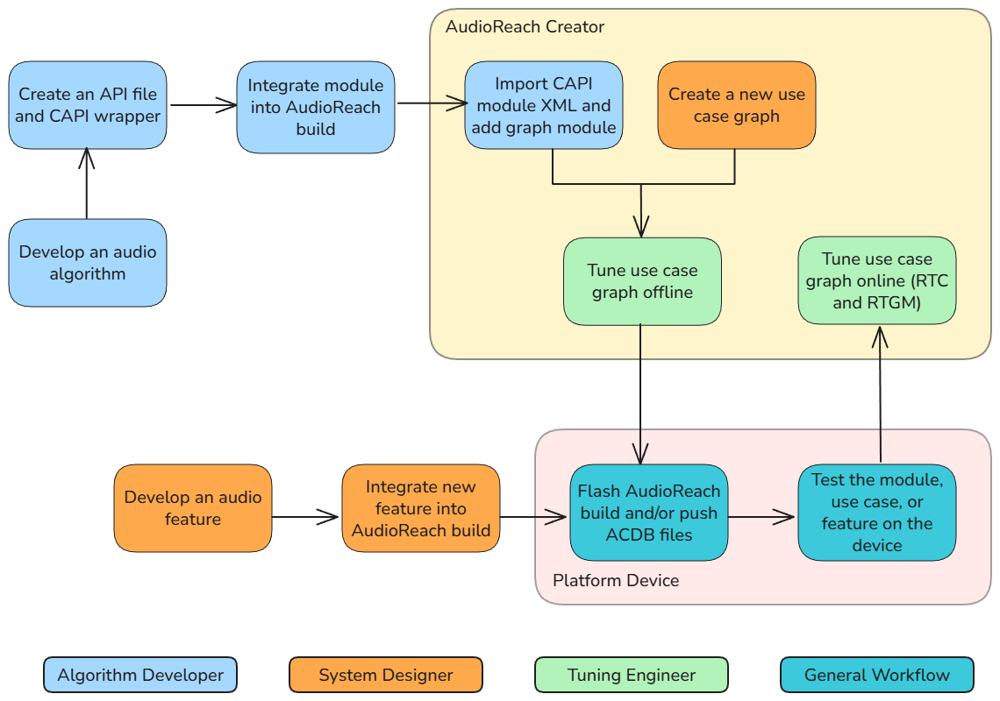

# 开发工作流

AudioReach 项目设想了三类不同的音频产品开发者：

- **算法开发者（Algorithm Developer）：** 开发音频算法，并通过将其转换为模块的方式集成到 AudioReach 中。
- **调参工程师（Tuning Engineer）：** 将 AudioReach 中现有的音频用例调校到其确切的规格。
- **系统集成者（System Integrator）：** 用必要的模块设计音频图，并在 AudioReach 中开发软件组件，以实现音频用例以及与用例相关的操作，例如暂停、跳转、音量控制等。

*用颜色区分各类开发者工作流的工作流示意图。*

AudioReach SDK 和工具提供了功能丰富的能力来支持这些类型的音频开发者。例如，开发者可以使用 **AudioReach Creator** 程序来修改和调参音频用例，以及向用例图中添加自定义模块。AudioReach Creator 是 AudioReach 不可或缺的组成部分，也是上述所有工作流类型的必备工具。有关如何安装 AudioReach Creator 的步骤，请参阅 [AudioReach Project Overview](../sdk_overview.md) 页面中的“Steps to install ARC”一节。

- 注意：要访问 AudioReach Creator 指南，请在安装并打开程序后，在启动窗口上选择“User Guide”选项。

此外，AudioReach 开发者可以使用受支持的平台设备（例如 Raspberry Pi 4 或 RB3 Gen2）来测试新模块、用例或特性。请参阅可用平台，了解如何为首选设备搭建 AudioReach 构建并运行一个基本用例的步骤。

下面描述了每种类型的开发者，以及他们在入门时应查看哪些文档页面或资源。

**算法开发者**

算法开发者可以将自定义音频算法以**模块**的形式集成到 AudioReach 中。一旦开发出自定义模块，就可以将其编译到 AudioReach 构建中，然后在 AudioReach Creator 中将其添加到用例图。之后，可以通过将用例（或 ACDB）文件推送到平台设备并运行用例来测试该模块。有关如何将自定义模块集成到 AudioReach 并进行测试的更深入指南，请参阅 [How to add an Audio Module](adding_modules.md) 页面。

[Available Audio Modules](available_modules.md) 页面包含 AudioReach 上当前可用的音频模块列表。

**调参工程师**

音频调参工程师将充分利用 AudioReach Creator 的全部能力，通过更改音量、音频滤波、媒体格式等模块属性，将音频用例调校到其确切规格。调参工程师可以同时利用“离线”和“在线”两种调参方式。

在离线调参中，开发者可以在 AudioReach Creator 中更改模块属性（例如音量或媒体格式），并以 ACDB 文件的形式保存用例。这些 ACDB 文件随后将包含带有更新后模块属性的用例，可以加载到平台设备上以测试新的校准。

在在线调参中，开发者可以在平台设备上运行音频用例，并在用例运行时直接调参模块属性，这被称为**实时校准（Real-time Calibration，RTC）**。为此，设备必须首先连接到 AudioReach Creator 的“在线模式”。一旦 AudioReach Creator 连接成功，在设备上运行用例就会使相应的音频用例图出现在 AudioReach Creator 的图视图中。之后，开发者可以直接在 AudioReach Creator 中更新模块属性，并实时听到更新后的效果。例如，开发者可以启动一个播放用例，使用“Volume Control”模块提高音量，应用更改，并在音频片段播放过程中听到音量的变化。

在某些情况下，模块也可以在用例运行时从用例图中添加和移除，这被称为**实时图修改（Real-time Graph Modification，RTGM）**。在线调参使开发者能够在无需重新上传 ACDB 文件和重启设备的情况下修改用例属性。开发者还可以在在线调参模式下使用集成资源监控（IRM）来查看延迟和性能测量数据。

调参工程师很可能希望充分利用 AudioReach Creator 中的校准工具。为此，请参阅 AudioReach Creator 指南的第 5 节。

**系统集成者**

系统集成者负责开发和集成软件组件，这些组件利用 AudioReach 的构造和 API 来实现新的音频用例及其相关操作，例如暂停、跳转和音量控制。该角色可能还涉及创建新的用例图，用例软件将在这些图上运行。为了成功地将新特性和功能扩展到目标产品中，系统集成者必须对 AudioReach 的构造、软件设计以及相关工具具备深入的了解。

要了解系统集成者工作流，请参阅 [System Integrator Workflow](system_workflow.md) 指南。有关系统集成者工作流的更多信息，包括对 AudioReach 中如何设置音频操作校准的说明，请查看 AudioReach Creator 指南的第 4 节。要了解 AudioReach 的完整设计，请参阅 [AudioReach Designs](../design/index.md) 页面。
