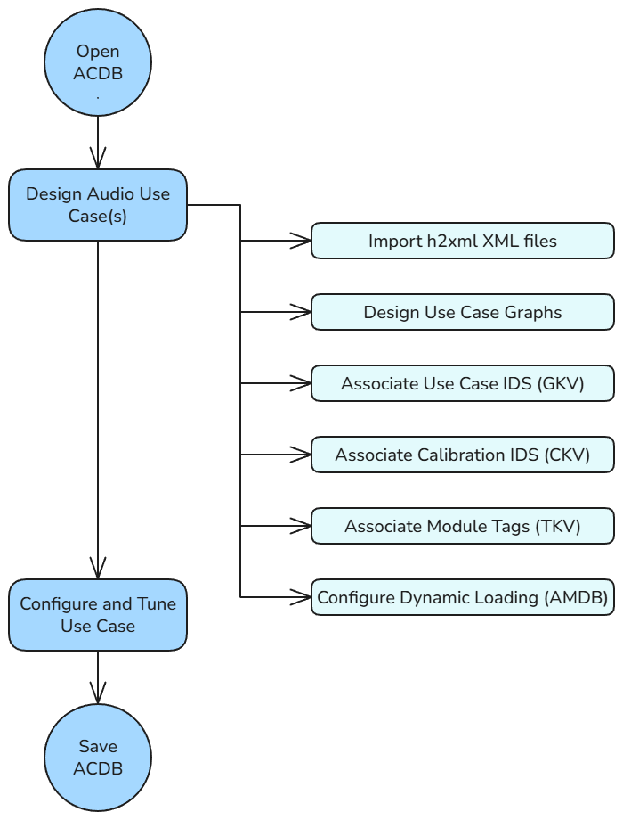
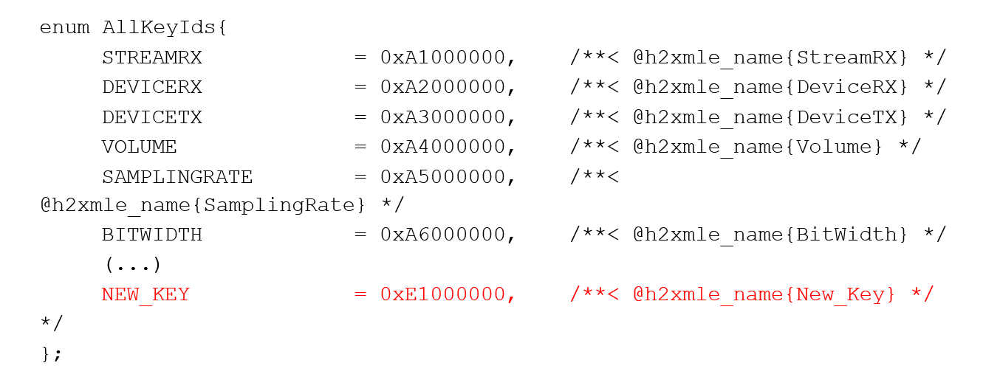
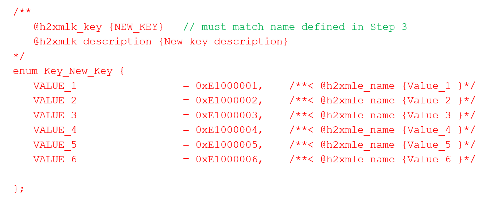
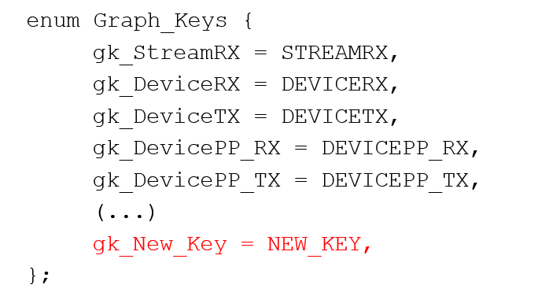
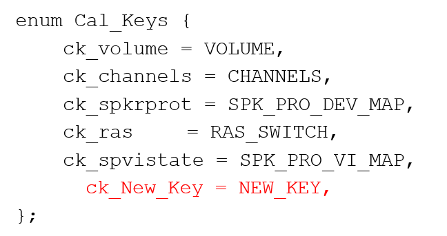
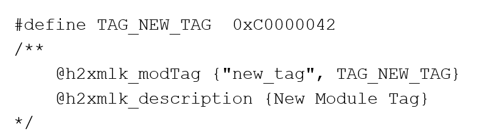
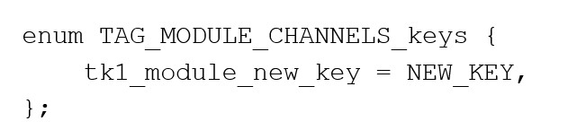

# 系统集成者工作流

- 简介
- 工作流概览
    - 导入 H2XML XML 文件
    - 设计用例图
    - 关联 GKV、CKV、TKV
    - 配置动态加载
- 使用 KVH2XML 自定义 KV
    - KVH2XML 概览
    - 添加通用键
    - 添加图键或校准键
    - 添加模块标签

## 简介

本文档是对系统集成者工作流的高层概览。系统集成者利用 AudioReach 来设计音频用例图，并开发软件以对用例图进行操作。在继续阅读本文档其余部分之前，系统集成者首先理解 AudioReach 图的基本构成以及用例构造非常重要。有关这些概念的高层概览以及一些示例，请参阅 [AudioReach Concepts and Terminology](../design/design_concept.md) 页面。

## 工作流概览

*系统集成者工作流示意图*

### 导入 H2XML XML 文件

在 AudioReach 中，H2XML 定义用于生成元数据，这些元数据可在 ARC 中被利用来创建用例。H2XML 文件通过 API 文件中的注解生成。H2XML 元数据的一些示例包括：

- CAPI 模块定义
- 键值和模块标签，定义于 kvh2xml.h 中
- 容器属性
- 驱动属性

### 设计用例图

系统设计者的核心任务是创建一套能够满足产品特定用例需求的图系统。系统设计者应对设备的调参需求有一定了解，以便为特定用例选用最佳的信号处理拓扑。在许多情况下，参考实现可能已经足够。

### 关联 GKV、CKV、TKV

为了满足驱动侧的逻辑，系统设计者必须关联 GKV、CKV 和 TKV，以便用最少的校准条目来复用图和模块。这需要一定的调参知识（例如，哪些模块应当依赖采样率（在分配 CKV 时很有用））。如有必要，系统设计者还可以使用 KVH2XML 头文件创建新的键值。

### 配置动态加载

系统设计者可以选择性地配置每个模块是在启动时还是在运行时加载。

## 使用 KVH2XML 自定义 KV

### KVH2XML 概览

AudioReach 定义了一种数据驱动的用例处理方法。使用 KVH2XML.h、H2XML 工具以及 ARC 中的 Discovery Wizard，系统设计者可以定义和管理自定义的键和值。添加或修改键 / 键值的一般步骤为：

1. 更新驱动软件，加入一个新的键 / 键值以关联到新的用例。

1. 在 ARC 中，导入更新后的键定义并将其关联到新的用例。

### 添加通用键

在 KVH2XML 中，键首先被定义为通用键，随后再添加为图键、校准键或模块标签。下方图片是 Qualcomm 专用的示例。添加通用键：

1. 打开位于 audioreach-conf 仓库中的 kvh2xml.h。
2. 向 AllKeyIds 枚举中添加一个新的键 ID：

键 ID 值将遵循 0xFF000000 的格式。

1. 定义键值：

### 添加图键或校准键

要将该键添加为图键或校准键（在添加为通用键之后）：

1. 使用键 ID，将通用键添加到 Graph_Keys 枚举中：

否则，如果该新键是校准键，则将其添加到 CAL-Keys 枚举中：

1. 更新驱动侧逻辑，为新键创建用例映射。

3. 重新编译后，会自动生成输出 XML 文件。使用 Discovery Wizard 导入新的 KVH2XML xml 文件。详情请参阅 ARC 指南的第 4.1 节。

### 添加模块标签

要将该键添加为模块标签（在添加为通用键之后）：

1. 打开 [kvh2xml.h](https://github.com/Audioreach/audioreach-conf/blob/master/qcom/kvh2xml.h)。
2. 在 kvh2xml.h 中将新标签添加为一个 define。标签值遵循 0xC00000FF 的格式：

1. 添加一个或多个键以关联到该模块标签：

1. 更新驱动侧逻辑以使用该新标签。

5. 重新编译后，会自动生成输出 XML 文件。使用 Discovery Wizard 导入新的 KVH2XML xml 文件。详情请参阅 ARC 指南的第 4.1 节。
