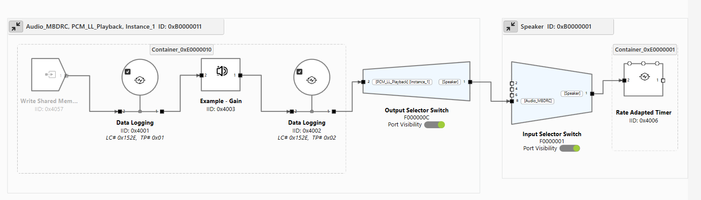

# NXP IMX8M Plus

- 架构概览
- 步骤 1：创建 Yocto 镜像
    - 集成 AudioReach 组件
- 步骤 2：创建 Zephyr 镜像
    - 安装依赖
    - 设置 West 工作区
    - 应用补丁
    - 构建 Zephyr 镜像
    - 构建产物
- 步骤 3：设置设备
    - 烧录并上电
    - 配置设备树
    - 连接到网络
    - 将文件推送到设备
- 步骤 4：运行一个 AudioReach 用例
    - 启动 DSP
    - 启用实时校准模式
    - 开始播放

本指南提供 NXP IMX8M Plus 平台上的 AudioReach 架构概览，并逐步介绍如何创建集成了 AudioReach 的 Yocto 镜像、为 HiFi ADSP 创建 Zephyr 镜像、设置设备以及运行一个 AudioReach 用例。

## 架构概览


上面的架构图展示了在 NXP IMX8M Plus 上使用 AudioReach 的模拟播放用例。该平台采用异构多处理器设计：AudioReach 引擎（ARE）在 Zephyr OS 下运行于 HiFi ADSP 上，而 AudioReach 栈的其余部分——AudioReach 图服务（ARGS）、Audio Graph Manager（AGM）和 ACDB——在 Linux 下运行于 APPS 处理器上。

当 ARGS 从客户端（`agmplay`）收到图打开请求时，ARGS 会使用用例句柄和校准句柄从音频校准数据库（ACDB）中检索音频图和校准数据。然后它通过通用包路由器（GPR）协议将图定义和校准数据提供给 ADSP 上的 ARE。

GPR 消息使用 RPMsg 框架在两个处理器之间传输，该框架构建于共享内存上的 Virtio 环（vrings）之上。控制通路（图打开、关闭和参数设置命令）使用基于 RPMsg 的 GPR，而音频数据则通过映射到两个处理器的共享内存区域在 APPS 处理器和 ADSP 之间交换。

在收到图定义后，ADSP 上的 ARE 会构建出一个音频处理图。在当前的模拟播放用例中，Rate-Adapted Timer 模块会周期性地向 APPS 处理器发出信号，以便向流水线中馈入更多数据。目前尚没有针对 NXP 开发板的硬件端点模块，因此不会有音频被渲染到物理输出设备。端点模块目前正在开发中。

在活动用例期间，可以使用基于 PC 的 GUI 工具 AudioReach Creator（ARC，也称为 QACT）实时可视化图拓扑。



上图展示了当前为 NXP IMX8M Plus 启用的用例图。

## 步骤 1：创建 Yocto 镜像

要创建 Yocto 镜像，请按照 [NXP 官方 GitHub 页面](https://github.com/nxp-imx/meta-imx/tree/scarthgap-6.6.52-2.2.2) 上的指南操作。AudioReach 目前在 NXP 开发板上支持 scarthgap 版本的 Yocto。

> **注意**
>
> 如果在 repo init 步骤中出现错误，请将以下标志追加到 repo init 命令中：
>
>
> ```bash
> --no-repo-verify --repo-url=http://android.googlesource.com/tools/repo
> ```

对于 IMX 8M Plus，使用以下 setup 命令来创建构建文件夹。请在将作为 `<yocto_build_root>` 的目录中运行此命令——即包含 `sources/` 和 `build/` 文件夹的根目录：

```bash
MACHINE=imx8mpevk DISTRO=fsl-imx-wayland source ./imx-setup-release.sh -b ./build
```

一旦构建同步完成且 setup 结束，运行以下命令生成完整构建：

```bash
bitbake imx-image-multimedia
```

> **注意**
>
> 如果 bitbake 命令报 `umask` 错误，请运行 `umask 022` 然后重试。

### 集成 AudioReach 组件

进入 `<yocto_build_root>/sources` 并克隆 meta-audioreach 仓库：

```bash
git clone https://github.com/AudioReach/meta-audioreach.git -b scarthgap
```

打开 `<yocto_build_root>/build/conf/bblayers.conf`，在 `BBLAYERS ?= " \` 部分下追加以下行，以集成 AudioReach meta-layer：

```
<yocto_build_root>/sources/meta-audioreach \
```

打开 `<yocto_build_root>/build/conf/local.conf`，追加以下行，以将 AudioReach 组件包含到完整的 Yocto 构建中：

```bash
IMAGE_INSTALL:append = "audioreach-graphservices tinyalsa audioreach-graphmgr audioreach-conf audioreach-kernel"
PACKAGECONFIG:pn-audioreach-graphmgr = "use_default_acdb_path"
EXTRA_OECONF:append:pn-audioreach-conf = " --with-nxp"
```

配置完成后，运行以下命令生成包含已集成 AudioReach 组件的完整构建：

```bash
bitbake imx-image-multimedia
```

## 步骤 2：创建 Zephyr 镜像

此步骤会生成一个 Zephyr 固件镜像，其中集成了作为 DSP 组件、运行于 HiFi ADSP 上的 AudioReach 引擎（ARE）。ARE 作为一个 west 模块被添加到 Zephyr 构建中，在工作区清单（manifest）中注册，并作为 Zephyr 构建系统的一部分进行构建。`audioreach-engine` 仓库中的 `zephyr/module.yml` 文件将其声明为一个 Zephyr 模块，向 Zephyr 构建系统暴露其 Kconfig 选项和 CMake 构建目标。

`audioreach-engine` 模块以 Zephyr 兼容库的形式提供核心信号处理框架（SPF）、平台与操作系统抽象层（POSAL）以及通用包路由器（GPR）。`audioreach-engine/app/` 下的一个 Zephyr 示例应用演示了该模块的用法。此应用会初始化三个核心组件——POSAL、GPR 和 ARE 框架——并作为运行于 ADSP 上的 Zephyr 固件镜像的入口点。

下面的步骤涵盖安装依赖、设置 west 工作区、应用补丁以及构建镜像。

### 安装依赖

在设置工作区之前，先安装所需的依赖。请根据你的操作系统，参照 [Zephyr 入门指南](https://docs.zephyrproject.org/latest/develop/getting_started/index.html) 中的相关章节操作：

#### 主机工具依赖

按照 Zephyr 入门指南中的 [Install dependencies](https://docs.zephyrproject.org/latest/develop/getting_started/index.html#install-dependencies) 部分，为你的操作系统安装所需的主机工具（CMake、Python、DTC）。

#### Python 依赖与 West

按照 Zephyr 入门指南中的 [Get Zephyr and install Python dependencies](https://docs.zephyrproject.org/latest/develop/getting_started/index.html#get-zephyr-and-install-python-dependencies) 部分，设置 Python 虚拟环境并安装 `west`。

> **注意**
>
> 每次开始工作时都要激活虚拟环境：
>
>
> ```bash
> source ~/zephyrproject/.venv/bin/activate
> ```

#### Zephyr SDK

安装 Zephyr SDK **0.17.0** 版，它与 AudioReach 所用的 Zephyr 版本兼容。请参考 Zephyr 入门指南中的 [Install the Zephyr SDK](https://docs.zephyrproject.org/latest/develop/getting_started/index.html#install-the-zephyr-sdk) 部分，并使用以下命令安装该特定版本：

```bash
west sdk install --version 0.17.0
```

> **注意**
>
> 使用 `west sdk install --help` 可查看其他选项，例如指定安装目标位置或选择特定架构的工具链。

### 设置 West 工作区

创建一个目录作为 west 工作区根目录，并将 `audioreach-engine` 仓库克隆到其中：

```bash
mkdir <workspace_dir> && cd <workspace_dir>
git clone https://github.com/AudioReach/audioreach-engine.git
```

`audioreach-engine` 仓库在 `zephyr/` 子目录下包含一个 `west.yml` 清单文件（`zephyr/west.yml`）。此清单定义了所有必需的依赖，包括 Zephyr RTOS。当运行 `west update` 时，west 会将清单中定义的所有项目——包括 Zephyr RTOS 本身——作为 `<workspace_dir>` 的子目录抓取下来。

使用克隆下来的仓库作为清单源来初始化 west 工作区：

```bash
west init -l ./audioreach-engine/ --mf zephyr/west.yml
```

然后抓取清单中定义的所有项目，包括 Zephyr：

```bash
west update
```

### 应用补丁

在运行 `west init` 和 `west update` 之后，向工作区应用所需的补丁：

```bash
west patch apply
```

要撤销补丁并将工作区重置为固定状态（例如，将 `zephyr/` 重置到固定的提交）：

```bash
west patch clean
```

### 构建 Zephyr 镜像

要为 NXP IMX8M Plus ADSP 目标构建 Zephyr 镜像，运行以下命令：

```bash
west build -p always --build-dir <build_dir_path> -b imx8mp_evk/mimx8ml8/adsp ./audioreach-engine/app
```

命令中使用的参数说明如下：

- `-p always` — 启用纯净（pristine）构建，在构建前清理构建目录，以避免残留自先前构建的陈旧产物。
- `--build-dir <build_dir_path>` — 指定构建产物的输出目录。将 `<build_dir_path>` 替换为所需的路径。
- `-b imx8mp_evk/mimx8ml8/adsp` — 指定目标开发板。`imx8mp_evk` 是 NXP IMX8M Plus 评估套件，`mimx8ml8` 是 SoC 变体，`adsp` 是所针对的 DSP 核心。
- `./audioreach-engine/app` — 要构建的 AudioReach 应用源码的路径。

### 构建产物

如果构建成功，构建产物会生成在 `<build_dir_path>/zephyr/` 目录下。关键的输出文件有：

- `zephyr.elf` — 为 DSP 编译出的固件镜像。这是通过 remoteproc 加载到 NXP 开发板上以启动 AudioReach DSP 组件的文件。
- `.config` — 构建期间生成的 Kconfig 配置文件。它反映了所有构建时选项和已启用的模块，可用于验证生成该固件所用的配置。

## 步骤 3：设置设备

### 烧录并上电

进入 `<yocto_build_root>/build/tmp/deploy/images/imx8mpevk`，找到文件 `imx-image-multimedia-imx8mpevk.rootfs.wic.zst`。这就是步骤 1 中生成的完整 Yocto 镜像。

使用 [Balena Etcher](https://etcher.balena.io) 将此镜像烧录到一张 micro SD 卡上。烧录完成后，将卡插入 NXP 开发板。

将设备左上方的启动开关设为 `0011` 以选择 SD 卡启动。将串口线连接到串口，为开发板接通电源，并按下 `PWR` 开关上电。关于开发板上启动开关、串口和电源接口的位置，请参考 [Getting Started with the i.MX 8M Plus EVK](https://www.nxp.com/document/guide/getting-started-with-the-i-mx-8m-plus-evk:GS-iMX-8M-Plus-EVK)。

### 配置设备树

在开发板上电过程中，串口会显示一个中断启动的提示。按任意键中断，然后运行以下命令来设置并持久化设备树：

```
=> editenv fdtfile
edit: imx8mp-evk-dsp.dtb
=> saveenv
=> boot
```

> **注意**
>
> `saveenv` 会将更新后的 `fdtfile` 变量写入 eMMC 上一个专用的环境分区。这会跨重启持久保存，使得 DSP 设备树在每次启动时都会被自动选中，无需手动干预。注意，运行 `env default -a` 或重新烧录 eMMC 会重置已保存的环境，需要重新执行此步骤。

### 连接到网络

开发板启动后，使用以太网或 WiFi 将其连接到互联网。

> **注意**
>
> 关于 WiFi 设置说明，请参考 [用于在 i.MX8MP 上连接 WiFi 的 NXP 社区指南](https://community.nxp.com/t5/i-MX-Processors-Knowledge-Base/How-to-connect-to-a-Wi-Fi-network-on-i-MX8MP/ta-p/1376634)。

### 将文件推送到设备

将步骤 2 中生成的 `zephyr.elf` 镜像和一个 `.wav` 音频文件复制到设备上的某个位置，例如 `/etc`：

```bash
scp zephyr.elf root@<board_ip_address>:/etc/
scp <clip_name>.wav root@<board_ip_address>:/etc/
```

## 步骤 4：运行一个 AudioReach 用例

### 启动 DSP

使用 remoteproc 接口加载 `zephyr.elf` 固件并启动 AudioReach DSP：

```bash
echo -n /etc/zephyr.elf > /sys/class/remoteproc/remoteproc0/firmware
echo start > /sys/class/remoteproc/remoteproc0/state
```

> **注意**
>
> 要检查当前 DSP 状态，运行 `cat /sys/class/remoteproc/remoteproc0/state`。要停止 DSP，运行 `echo stop > /sys/class/remoteproc/remoteproc0/state`。

### 启用实时校准模式

ARC（AudioReach Creator）是一个用于创建和编辑音频用例图、并在活动用例期间实时编辑音频配置的工具。关于 ARC 的更多信息，请参考 [AudioReach Creator](../arc/index.md) 页面。

> **注意**
>
> AudioReach Creator 目前仅在 Windows 上可用。

下面的步骤演示如何将 ARC 连接到 NXP 开发板。运行 AudioReach 用例并不要求连接 ARC。

**在 NXP 开发板上：**

- 使用以太网或 WiFi 将 NXP 开发板连接到互联网。
- 在串口上或通过 SSH，运行：
  ```bash
  ats_gateway <IP address> 5558
  ```
  > **注意**
  >
  > 在启动 `ats_gateway` 之前，DSP 必须已在运行。如果尚未完成，请参考上面的启动 DSP。

**在本地计算机上：**

- 使用 [Steps to install ARC](../sdk_overview.md) 在一台 Windows 主机上安装 ARC（也称为 QACT）。需要 QACT 8.1 或更高版本。
- 打开 ARC 并点击 **Connection configuration**。
- 在 TCP/IP 部分输入 `<IP address>:5558`，将 NXP 开发板添加为一个设备。
- 刷新 **Available Devices** 列表。NXP 开发板的 IP 地址应会出现。
  > **注意**
  >
  > 如果开发板未出现，请确认 `ats_gateway` 命令仍在开发板上运行。
- 选中该条目并点击 **Connect**。

### 开始播放

使用 `agmplay` 启动模拟播放：

```bash
agmplay /<path_to_audio_file>/[clip_name].wav -D 100 -d 100 -i PCM_RT_PROXY-RX-2
```

> **注意**
>
> `-D 100` 和 `-d 100` 参数分别指定声卡索引和设备索引。声卡 ID `100` 标识 AGM 虚拟声卡（`virtualsndcard`），设备 ID `100` 指的是 `PCM100`，即播放 PCM 设备。`-i PCM_RT_PROXY-RX-2` 参数指定 RT proxy 后端设备（设备 ID `200`）。这些 ID 是在 [card-defs.xml](https://github.com/AudioReach/audioreach-conf/blob/master/nxp/reference/card-defs.xml) 中为 NXP 平台定义的，该文件是安装在设备上的 `audioreach-conf` 包的一部分。

播放现在正在运行。如果 NXP 开发板已连接到 ARC，当前用例图将出现在图视图中。用例的系统日志保存到 `/var/log/syslog`。
