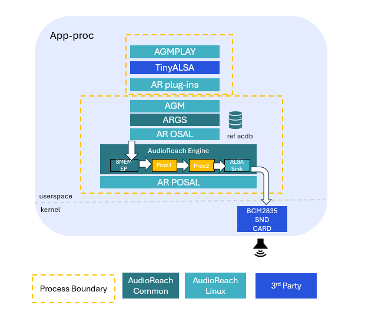
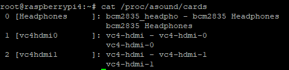
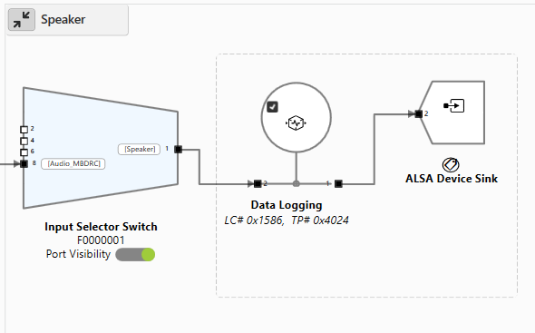
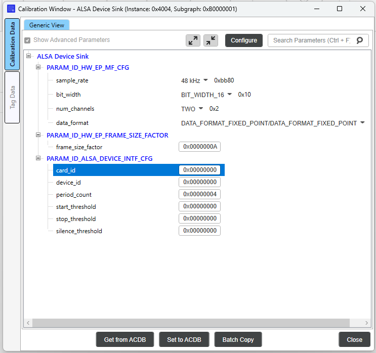

# Raspberry Pi 4

1. 架构概述
2. 创建 Yocto 镜像
3. 设置 Raspberry Pi
4. 运行 AudioReach 用例
5. 在 AudioReach 中使用 ALSA lib
6. 故障排除

本指南介绍了 Raspberry Pi 平台上的 AudioReach 架构概述，并逐步讲解如何创建一个集成 AudioReach 的 Yocto 镜像、将该镜像加载到 Raspberry Pi4 设备上，然后运行一个 AudioReach 用例。

## 架构概述



上面的架构图展示了在 Raspberry Pi 上使用 AudioReach 的播放用例。在此设置中，agmplay 测试应用被用来播放一段音频片段，声音输出通过扬声器或耳机等输出设备来呈现。

在这里，当 AudioReach 图服务（ARGS）从客户端收到打开图的请求时，ARGS 会使用用例句柄和校准句柄从音频校准数据库（ACDB）中检索音频图和校准数据。然后，它通过通用包路由器（GPR）协议，经由物理或软数据链路，将图定义和相应的校准数据提供给 AudioReach 引擎（ARE）。

在收到数据后，ARE 会根据图定义使用处理模块构建一个音频图。它处理从源端点经管道传送到 ALSA 汇端点的音频数据，随后这些数据通过 BCM2835 声卡呈现。尽管 ARE 允许开发者设计其用例图并支持在异构核心间进行分布式处理，但鉴于 Raspberry Pi 没有 DSP，ARE 在用户空间的 APPS 处理器上运行。

此外，在播放用例期间，可以使用一个名为 AudioReach Creator（ARC，也称为 QACT）的基于 PC 的 GUI 工具实时可视化图拓扑。

## 创建 Yocto 镜像

第一步是将 AudioReach 组件集成到一个可以加载到 Raspberry Pi 设备上的 Yocto 构建中。这涉及同步一个 Yocto 构建，然后集成 meta-audioreach 层，该层目前以 Github 仓库的形式提供。

在按照这些步骤操作之前，先了解如何使用 Yocto 项目的基础知识会有所帮助。为此，请参阅 Yocto 官方文档站点：[https://docs.yoctoproject.org/5.0.12/brief-yoctoprojectqs/index.html](https://docs.yoctoproject.org/5.0.12/brief-yoctoprojectqs/index.html)

### 步骤 1：创建 Yocto 构建

按照以下步骤设置 Yocto 构建：

- 为你的 Yocto 构建创建一个目录，并在此目录内创建另一个名为 “sources” 的目录。
- 在 “sources” 目录中，克隆以下仓库：

```bash
git clone git://git.yoctoproject.org/poky -b scarthgap
git clone git://git.yoctoproject.org/meta-raspberrypi -b scarthgap
git clone https://git.openembedded.org/meta-openembedded -b scarthgap
```

- 返回 Yocto 根目录并运行以下命令来设置构建环境（这将自动创建一些必要的配置文件，以及一个 “build” 目录）：
- 导航到文件 “<yocto_build_root>/build/conf/local.conf” 并添加以下行：
- 导航到 “build/conf/bblayers.conf” 文件，并如下所示编辑该文件以添加必要的 meta 层：

```bash
# POKY_BBLAYERS_CONF_VERSION is increased each time build/conf/bblayers.con
# changes incompatibly
POKY_BBLAYERS_CONF_VERSION = "2"

BBPATH = "${TOPDIR}"
BBFILES ?= ""

BBLAYERS ?= " \
   <path_to_build>/sources/poky/meta \
   <path_to_build>/sources/poky/meta-poky \
   <path_to_build>/sources/poky/meta-yocto-bsp \
   <path_to_build>/sources/meta-raspberrypi \
   <path_to_build>/sources/meta-openembedded/meta-oe \
   <path_to_build>/sources/meta-openembedded/meta-multimedia \
   <path_to_build>/sources/meta-openembedded/meta-networking \
   <path_to_build>/sources/meta-openembedded/meta-python \
  "
```

**注意：** AudioReach 项目当前使用 Yocto 的 “scarthgap” 版本。请确保 Yocto scarthgap 构建所需的所有实用工具都满足最低版本号，这些版本号列在 Yocto 文档站点上：[https://docs.yoctoproject.org/5.0.12/ref-manual/system-requirements.html#required-git-tar-python-make-and-gcc-versions](https://docs.yoctoproject.org/5.0.12/ref-manual/system-requirements.html#required-git-tar-python-make-and-gcc-versions)。

如果不满足，请按照上述链接中第 1.5.1 节的步骤来安装和设置 buildtools。

### 步骤 2：获取 AudioReach Meta 层

AudioReach meta 层包含 AudioReach 所需的构建 recipe。将 meta-audioreach 仓库克隆到 “sources” 文件夹中：

```bash
cd <yocto_build_root>/sources
git clone https://github.com/Audioreach/meta-audioreach.git
```

现在导航到文件 “<yocto_build_root>/build/conf/bblayers.conf”，并在 **BBLAYERS ?= “ \** 部分下追加以下行以集成 AudioReach meta 层：

```bash
<path_to_build>/sources/meta-audioreach \
```

### 步骤 3：将 AudioReach 添加到系统镜像

为确保 AudioReach 系统镜像作为完整 Yocto 构建的一部分被编译，导航到文件 “<yocto_build_root>/build/conf/local.conf” 并追加以下行：

```bash
IMAGE_INSTALL:append = "audioreach-graphservices tinyalsa audioreach-graphmgr audioreach-engine audioreach-conf"
```

要启用 ALSA lib 支持，将以下 ALSA 软件包添加到 “local.conf” 文件中：

```bash
IMAGE_INSTALL:append = " \
alsa-lib \
alsa-utils \
alsa-tools \
alsa-state \
"
```

Raspberry Pi 设备没有 DSP，因此必须改为启用对 APPS 处理器上 ARE（AudioReach 引擎）的支持。为此，将这些额外的行添加到 “local.conf” 文件中：

```bash
PACKAGECONFIG:pn-audioreach-graphmgr = "are_on_apps use_default_acdb_path"
PACKAGECONFIG:pn-audioreach-graphservices = "are_on_apps"
```

### 步骤 4：编译镜像

现在构建设置已经完成，可以生成完整的 Yocto 镜像了。导航到 “build” 目录并运行以下命令来生成镜像：

```bash
bitbake core-image-sato
```

- 如果 bitbake 命令报出 “umask” 错误，运行命令 **umask 022** 后再试。
- 如果出现 “restricted license” 错误，导航到 “<yocto_build_root>/build/conf/local.conf” 文件并追加以下行：

编译成功后，将生成 Yocto 镜像。导航到文件夹 “<yocto_build_root>/build/tmp/deploy/images/raspberrypi4” 并找到 zip 文件 “core-image-sato-raspberrypi4.rootfs.wic.bz2”。它包含可以烧录到 Raspberry Pi 设备上的 “.wic” 镜像。解压 “.bz2” 文件以获得镜像。

### 步骤 5：烧录 Yocto 镜像

生成的 Yocto 镜像可以使用 Raspberry Pi Imager 烧录到 SD 卡。它可以从 raspberrypi.com/software 安装，或者在 Linux 终端上运行 **sudo apt install rpi-imager** 来安装。然后按照以下步骤烧录设备：

- 打开 Raspberry Pi Imager，如果有 “Choose Device” 选项，选择 “RaspberryPi4” 作为设备类型。
- 在 “Choose OS” 选项下，选择 “Use custom”。确保搜索所有文件类型。然后导航到 “.wic” 文件并选中它。
- 在 “Storage” 下，选择所需的 SD 卡。
- 点击 “Flash” 开始烧录镜像。

烧录完成后，SD 卡将包含 Yocto 镜像。

## 设置 Raspberry Pi

如果尚未完成，请先在 Raspberry Pi 上设置好硬件。为此，请参阅 Raspberry Pi 官方文档页面上的步骤：[https://www.raspberrypi.com/documentation/computers/getting-started.html](https://www.raspberrypi.com/documentation/computers/getting-started.html)

按照步骤操作，直到 “Install an operating system” 一节。

### 配置启动设置

接下来，请完成以下步骤以启用音频并更新日志设置。如果设备连接了外接显示器，可以直接在 Raspberry Pi 4 界面上更新下述文件，也可以通过本地计算机使用 SCP 更新。

- 注意：用户也可以通过打开到 “root@<Raspberry PI IP 地址>” 的连接经由 SSH 连接到 Raspberry Pi。默认情况下，连接 SSH 无需密码。

要启用声卡：

- 导航到文件 “/boot/config.txt”
- 找到行 **#dtparam=audio=off**
- 将此行改为 **dtparam=audio=on**
    - 更新时务必取消对此行的注释。

可选步骤：在文件 /boot/config.txt 中，如果 Raspberry Pi 将连接到显示器，也可以禁用 HDMI 音频输出。这很有帮助，因为如果 HDMI 声卡被枚举，它可能会更改 Headphones 设备的声卡 ID，这将需要在 ARC 中更新声卡 ID。

- 导航到文件 “/boot/config.txt”
- 找到行 **dtoverlay=vc4-kms-v3d**
- 将此行改为 **dtoverlay=vc4-kms-v3d,noaudio**

默认情况下，运行 Raspberry Pi 用例时打印的系统日志会很短。应更新系统日志设置，以捕获 AudioReach 将打印的额外用例日志：

- 导航到文件 “/etc/syslog-startup.conf”
- 取消对行 **Rotate size (ROTATESIZE)** 和 **Rotate Generations (ROTATEGENS)** 的注释
- 将 **ROTATESIZE** 设为 1000000。
    - 此 rotate size 字段表示生成新日志文件之前的最大日志文件大小。
- 将 **ROTATEGENS** 设为 20。
    - 这表示可以生成的最大日志文件数量。
- 保存文件。

要应用更新后的配置设置，通过主屏幕关闭 Raspberry Pi，或在终端中运行以下命令：

```bash
shutdown -r -time "now"
```

### 启用实时校准模式

ARC（AudioReach Creator）是一个工具，允许用户执行若干与音频用例相关的功能，包括创建和编辑音频用例图，以及在实时运行音频用例时编辑音频配置。有关 ARC 的更多信息，请参阅 [AudioReach Creator](../arc/index.md) 页面。

- 请注意，目前 AudioReach Creator 仅在 Windows 上可用。

以下步骤将演示如何将 ARC 连接到 Raspberry Pi，以便实时查看用例图。

在 Raspberry Pi 上：

- 使用以太网或 Wifi 将 Raspberry Pi 连接到互联网。
    - 以太网
          - 将以太网线缆插入 Raspberry Pi 的以太网端口。
    - Wifi
          - 在屏幕右上角点击时间旁边的图标，并选择 “Preferences”。
          - 在左侧找到 “Wireless Network” 选项以选择网络。
- 打开终端并运行命令 **ifconfig** 以查找当前的 IP 地址。
- 在终端上，运行命令 **ats_gateway <IP 地址> 5558**
- 打开另一个终端，运行命令 **agm_server**

在本地计算机上：

- 使用 [安装 ARC 的步骤](../sdk_overview.md) 在 Windows 主机上安装 ARC（也称为 QACT）。你至少需要 QACT 8.1
- 打开 ARC，点击 “Connection configuration” 选项。
- 通过在 TCP/IP 部分下添加条目 **<Raspberry PI IP 地址>:5558** 将 Raspberry Pi 添加为设备
- 刷新 “Available Devices” 列表。Raspberry Pi 的 IP 地址应出现在列表中。
    - 如果没有出现，请确保 **ats_gateway** 和 **agm_server** 命令仍在运行。
- 选择该条目并点击 connect。

## 运行 AudioReach 用例

完成上述所有设置后，按照以下步骤运行音频用例：

- 将一个 “.wav” 文件推送到 Raspberry Pi 上的某个位置，例如 “/etc” 文件夹。重启系统使更改生效。
- 将外接音频设备（如扬声器或耳机）连接到 Raspberry Pi 的音频端口。
- 打开终端并运行命令 **agm_server**（如果尚未运行）。
- 打开另一个终端窗口并运行以下命令以启动播放用例：

现在 “.wav” 文件应通过外接音频设备播放。如果 Raspberry Pi 已连接到 ARC，当前用例图将出现在图视图中。该用例的系统日志将保存在文件 “/var/log/messages” 中。

## 在 AudioReach 中使用 ALSA lib

ALSA lib 为 Raspberry Pi 上的音频播放和采集提供了一个替代接口。Yocto 构建中包含的 ALSA lib 软件包提供了可与 AudioReach 一同使用的额外音频实用程序和工具。

有关 ALSA lib 与 AudioReach 集成的详细信息，包括元数据生成、配置和高级用例，请参阅 [在 AudioReach 中使用 ALSA lib](../dev/alsalib_using_audioreach.md)。

### 使用 aplay 进行音频播放

**aplay** 是一个 ALSA lib 测试应用，可作为 **agmplay** 的替代方案用于音频播放。要在 AudioReach 中使用 aplay：

- 确保 **agm_server** 在某个终端中运行：
- 在另一个终端中，使用 aplay 播放一个音频文件：

> **注意**
>
> 参数 `agm:100,100` 对应于 AGM 虚拟声卡配置中定义的 `CARD=100` 和 `DEV=100`。声卡 ID `100` 标识 AGM 虚拟声卡（`virtualsndcard`），设备 ID `100` 指的是 `PCM100`，即该声卡下定义的播放 PCM 设备。对于采集，则会改用设备 ID `101`（`PCM101`）。这些 ID 并非由插件本身固定——它们是在虚拟声卡定义文件中定义的，且必须相应匹配。

## 故障排除

如果运行用例时出现一些问题，请参阅下面建议的修复方法：

### 检查声卡

在 Raspberry Pi 终端上，运行以下命令：

```bash
cat /proc/asound/cards
```

这应输出可用的声卡。如果输出反而显示 “no sound cards available”，那么你很可能忘记启用声卡（参见“配置启动设置”一节）。



### 检查声卡 ID

如果 Raspberry Pi 连接到显示器，基于 HDMI 的声卡可能会在文件 “/proc/asound/cards” 中被枚举，从而导致 Headphones 的声卡 ID 发生变化。要解决此问题，你需要在一台辅助计算机上安装 ARC（参见“启用实时校准模式”一节）。

1. 将 ACDB 和 workspace 文件从 Raspberry Pi 复制到你的本地计算机。这些文件可以在文件夹 “/etc/acdbdata” 下找到。
    - 注意：这可以通过在 Linux 终端上使用 “scp” 命令，或使用诸如 “WinScp” 之类的程序来完成。
2. 通过选择 “Open ACDB File on Disk” 选项以离线模式打开 ARC。这将提示你选择一个 workspace 文件。选择从 Raspberry Pi 复制过来的 workspace 文件。
3. 在左上角显示用例的下拉菜单中，选择任何使用 “Speaker” 的用例。
4. 双击下面所示的 “ALSA Device Sink” 模块 [](../_images/alsa_sink_module.png)
5. 这将打开 Configure 窗口。检查这里的 “card_id” 字段。card_id 应与 Raspberry Pi 上 “/proc/asound/cards” 文件中对应 Headphones 条目的 ID 相同。[](../_images/alsa_configure_window.png)
  如果不相同，请更新该值，并点击底部的 “Set to ACDB” 使更改生效。
6. 在 ARC 菜单上，点击左上角的 “Save” 以更新 ACDB 文件。
7. 将更新后的 ACDB 文件复制回 Raspberry Pi（建议先删除当前位于 “/etc/acdbdata” 文件夹中的文件，以确保更改生效）
8. 关闭系统使更改生效。然后，再次尝试运行该用例。
