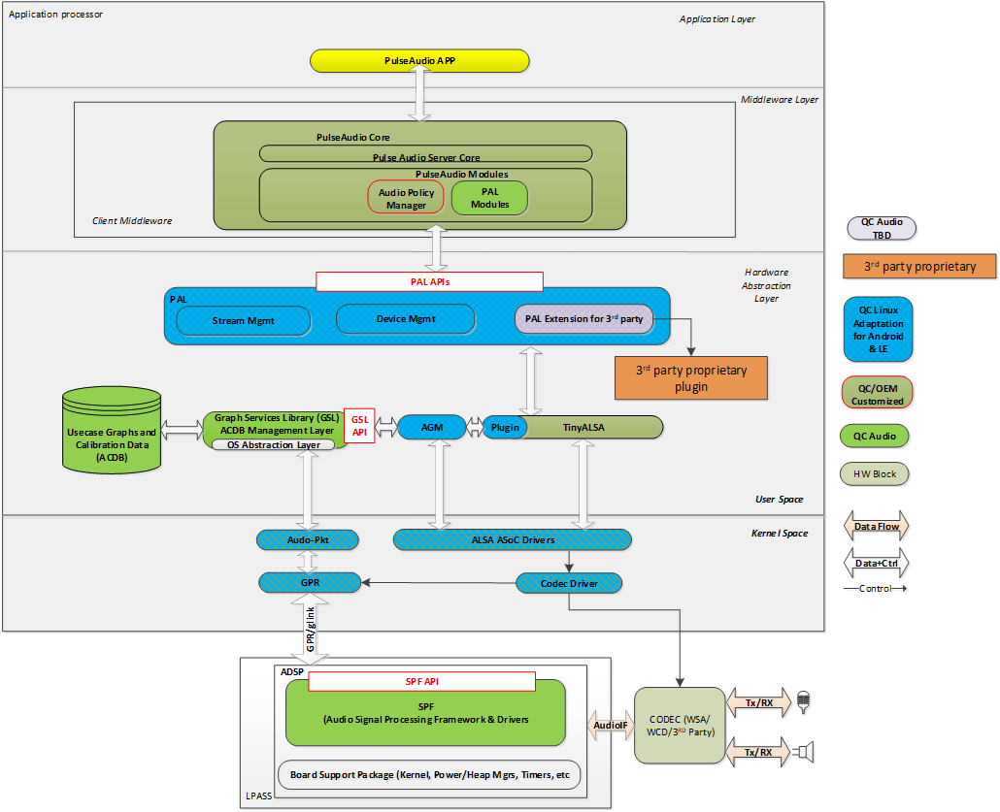

# RB3 Gen2

1. 架构概览
2. 创建 Yocto 镜像
3. 烧录 Yocto 镜像
4. 设置 RB3
5. 运行一个 AudioReach 用例
6. 后续步骤
7. 故障排查

本指南概述了 AudioReach 在 RB3（机器人）平台上的架构，并逐步介绍如何创建一个集成了 AudioReach 的 Yocto 镜像、把该镜像加载到 RB3 Gen2 设备上，然后运行一个 AudioReach 用例。

## 架构概览

上面的架构图展示了在 RB3 Gen2 上使用 AudioReach 的播放/录制用例。在该配置中，使用 PulseAudio 测试应用来播放/录制一段音频片段，声音通过麦克风和扬声器等设备渲染/采集。更多细节请参见[此处](../design/linux_plug-in_arch.md)。

> **注意**
>
> AudioReach 目前正从 PulseAudio 迁移到 PipeWire 作为主要的音频服务器。本文档会随着迁移的推进而更新。

## 创建 Yocto 镜像

第一步是把 AudioReach 组件集成到一个可以加载到 RB3 设备上的 Yocto 构建中。这需要先同步一个 Yocto 构建，然后集成 meta-audioreach 层，该层目前以 Github 仓库形式提供。

在执行这些步骤之前，最好先了解如何使用 Yocto 工程的基础知识。为此，请参考官方 [Yocto](https://docs.yoctoproject.org/) 文档站点。

构建一个包含 AudioReach 组件的 Yocto 镜像有两种方式。一种是使用 Qualcomm Linux 构建，另一种是直接使用 meta 层。

### 使用 Qualcomm Linux 构建（已发布的 CRM 构建）

关于如何搭建包含 AudioReach 组件的 Yocto 构建，请参考 [build guide](https://docs.qualcomm.com/bundle/publicresource/topics/80-70020-254/build_landing_page.html?vproduct=1601111740013072&version=1.5)。

构建搭建过程因你的 Qualcomm 访问级别而异。关于不同访问级别的详细信息，请访问 [Working with Qualcomm](https://www.qualcomm.com/support/working-with-qualcomm) 页面。**重要提示：** 虽然未注册用户可以访问用于烧录的基础镜像，但要进行有实际意义的 AudioReach 开发，至少需要注册用户的访问级别。注册用户可以获得诸如 AudioReach Creator（ARC）等必备开发工具的访问权限。我们强烈建议你在 Qualcomm 注册，以解锁完整的 AudioReach 开发体验。

**注意：**

- RB3 平台基于 QCS6490 芯片组，支持的 machine 名称为 qcs6490-rb3gen2-core-kit 和 qcs6490-rb3gen2-vision-kit。
- 要访问 ADSP 固件源代码，你必须注册为 Qualcomm 的授权（Authorized）用户。
- Qualcomm Linux 为应用开发支持不同的版本。[Software Architecture Guide](https://docs.qualcomm.com/bundle/publicresource/topics/80-70020-252/qualcomm-linux-sw-overview.html) 提供了关于这些版本的详细信息：
    - Base 版本是一个上游的开源软件栈，不包含 Qualcomm 专有软件。
    - Custom 版本包含下游的 Qualcomm 专有软件，附带额外的 SDK 以及更优的功耗性能。对于基于 AudioReach 的方案，你应使用 Custom 变体。

### 直接使用 meta 层拉取（AudioReach 最新源代码）

当前面向 RB3 的 Qualcomm Linux 构建使用来自 Code Linaro 代码库的组件。我们正在积极推进从上游 GitHub 仓库直接集成，这将使开发者能够直接获取最新的 AudioReach 源代码。

## 烧录 Yocto 镜像

要把 Yocto 镜像烧录到你的 RB3 Gen2 设备上，请按照 [Flashing Guide](https://docs.qualcomm.com/bundle/publicresource/topics/80-70020-254/flash_images.html?vproduct=1601111740013072&version=1.5#flash-images) 中提供的说明操作。

## 设置 RB3 Gen2

请使用 [Qualcomm Linux documentation](https://docs.qualcomm.com/bundle/publicresource/topics/80-70020-251/set_up_the_device.html#panel-0-V2luZG93cyBob3N0) 设置 RB3 硬件。

按照下面各小节的步骤为本指南设置设备：

- 给设备上电
- 设置调试 UART
- 验证 Qualcomm Linux 版本
- 连接到网络

### 设置音频硬件

按照[此处](https://docs.qualcomm.com/bundle/publicresource/topics/80-70020-16/enable-audio.html#enable-audio)“Set up audio hardware”一节中的步骤，激活板上的数字麦克风接口（DMIC）。

### 检查声卡

- 检查声卡是否已枚举：

### 检查 PulseAudio 服务

- 检查 PulseAudio 服务是否正在运行

### 启用实时校准模式

ARC（AudioReach Creator）是一款工具，允许用户执行与音频用例相关的若干功能，包括创建和编辑音频用例图，以及在实时运行音频用例时编辑音频配置。关于 ARC 的更多信息，请参考 [AudioReach Creator](../arc/index.md) 页面。

**注意：** ARC 目前仅在 Windows 主机上受支持。

下面的步骤将演示如何把 ARC 连接到 RB3，以便实时查看用例图。

- 将 Type C 线缆的一端连接到 RB3，USB 线缆连接到 Windows 主机。
- 使用 [Steps to install ARC](../sdk_overview.md) 在 Windows 主机上安装 ARC（也称为 QACT）。你至少需要 QACT 8.1。
- 打开 ARC，点击“Connect to Device”。

## 运行一个 AudioReach 用例

在上述所有设置完成后，我们就可以在 RB3 上运行音频用例了。下面一节列出了使用 PulseAudio 运行播放和录制用例的步骤。要了解更多，请查看 [Enable Audio use-cases using PulseAudio](https://docs.qualcomm.com/bundle/publicresource/topics/80-70020-16/enable-audio.html#enable-audio-with-pulseaudio)。

### 播放

- 将一个“.wav”文件推送到 RB3 上的某个位置，例如“/etc”文件夹。
    - 通过 UART 控制台连接串口 shell，找到 RB3 设备的 IP 地址。
    - 使用 scp（安全复制协议）把一个 wav 文件从主机复制到 RB3 设备。
- 如果尚未连接，请将外部音频设备（例如扬声器或耳机）连接到 RB3 的音频端口。
- 在主机上打开串口 shell 终端窗口，运行下面的命令来启动播放用例：

现在“.wav”文件应该会通过外部音频设备播放。如果 RB3 已连接到 ARC，当前用例图会出现在图视图中。该用例的系统日志会保存在文件“/var/log/messages”中。

### 录制

- 在主机上打开串口 shell 终端窗口，运行下面的命令来启动录制用例：

上面的命令会把录制的 .wav 文件存储在指定路径。

## 后续步骤

### 在 QCLINUX 构建中探索 AudioReach 组件

- AudioReach 组件的配方（recipe）位于路径：<WORKSPACE_ROOT>/workspace/layers/meta-qcom-hwe/recipes-multimedia/audio/。
- 要修改现有代码，请按照下面的步骤操作：
    - 从上述路径查找配方名称。
    - 使用 [devtool](https://docs.yoctoproject.org/ref-manual/devtool-reference.html) 按如下方式获取源代码：
    - 这会把源代码提取到路径 <BUILD_ROOT>/workspace/build-qcom-wayland/workspace/source/qcom-agm/ 目录。
    - **注意：** 下表将 Qualcomm Linux 项目名称映射到 [AudioReach](https://github.com/Audioreach/) GitHub 仓库名称：
      | Downstream Name | Upstream Project Name |
      | --- | --- |
      | qcom-agm | audioreach-graphmgr |
      | qcom-pal | audioreach-pal |
      | qcom-acdbdata | audioreach-conf |
      | qcom-args | audioreach-graphservices |
      | pulseaudio-plugin | audioreach-pulseaudio-plugin |

### 向 ADSP 镜像添加新模块

- ADSP 源代码仅对授权（Authorized）用户开放。
- 如果你拥有授权访问权限，请参考 [Adding a Custom Module in SPF](https://docs.qualcomm.com/bundle/80-VN500-28/resource/80-VN500-28_REV_AE_CAPI_Custom_Module_Integration_Into_SPF_for_OEMS_User_Guide.pdf) 指南，将新模块集成到 ADSP 镜像中。
- 或者，你可以使用 Hexagon SDK 为你在 ADSP 上的自定义模块编译一个独立的 .so 文件。Hexagon SDK 可从 [Qualcomm Developer Network](https://www.qualcomm.com/developer/software/hexagon-npu-sdk) 下载。

## 故障排查

关于音频日志记录与调试，请查看 [Audio Troubleshooting](https://docs.qualcomm.com/bundle/publicresource/topics/80-70020-16/troubleshoot.html) 指南。
