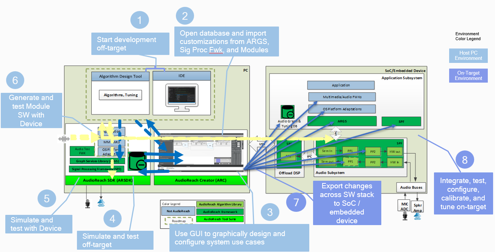

# AudioReach 项目概览

## SDK 概览

AudioReach 项目旨在提供一套全面而完整的端到端音频软件解决方案，以支持跨多种 SoC 和产品设备（手机、计算设备、可穿戴设备、可听设备、xr、汽车车联网 / 信息娱乐等）的广泛音频与语音用例。AudioReach SDK 包含了必要的组件，用于支持从脱机（off-target）到在机（on-target）的无缝开发工作流，并具备灵活性，可根据 SoC 和产品设备的能力与约束（多核、外设等）来定制和裁剪处理流程。SDK 及其所支持工作流的亮点可参阅下方的示意图。此外，请参阅 [AudioReach Architecture Overview](design/arch_overview.md) 来了解整体架构，因为本页会多次引用 AudioReach 软件方案中的关键软件组件。

*SDK 亮点*

*SDK 支持的开发工作流*

### 平台支持

#### 操作系统支持

AudioReach 引擎（ARE）

- Linux

OS 平台软件

Linux：提供两种架构风格

- 插件架构面向希望获得 AudioReach 全部特性集的开发者
- ALSA/ASoC 驱动架构面向习惯于内核 ALSA/ASoC 框架的开发者

#### 硬件平台

SoC

- Qualcomm SoC
- 应用处理器运行 Linux 并支持 ALSA 声卡的 SoC。

开发板

- Qualcomm RB3 Gen2
- Raspberry Pi 4

### 工具

- AudioReach Creator（ARC），目前也称为 Qualcomm Audio Configuration Tool（QACT），是整个 SDK 中最核心的工具。ARC 支撑起了整个音频系统设计工作流。

**注意**：QACT 目前仅在 Windows 上运行，未来计划支持 Linux 并发布开源版本。

#### 安装 ARC 的步骤

ARC 公开版可通过 [Qualcomm Software Center](https://softwarecenter.qualcomm.com/#/) 获取。请按以下步骤安装 ARC：

- 按照[此处](https://docs.qualcomm.com/bundle/publicresource/topics/80-72780-2/install_qsc.html#download-and-install-qsc-on-windows)的步骤在 Windows 主机上下载并安装 **Qualcomm Software Center**。
- 从开始菜单启动 Qualcomm Software Center。
- 按照[此处](https://docs.qualcomm.com/bundle/publicresource/topics/80-72780-2/tools_and_sdks.html)所示的步骤安装所需版本的 **Qualcomm Audio Calibration Tool**。

### 源代码仓库

从高层来看，AudioReach 的软件组件分布在多个 git 仓库中。下图直观展示了跨处理器域的组件与仓库映射关系。你可以在 [GitHub project site](https://github.com/audioreach) 上找到相应的仓库。在撰写本文时，仅支持 Linux 平台。不过，会在本页的 Roadmap 章节中规划并公布更多 OS 平台。

跨平台软件组件

- AudioReach 图服务（ARGS）
- 包含信号处理框架（SPF）和处理模块的 AudioReach 引擎（ARE）

Linux 适配

Linux 平台支持提供两种架构风格。对于希望利用 AudioReach 全部特性集的开发者，请按下图所示的架构来构建产品。需要从相应的 git 仓库中拉取以下软件组件：

- AudioReach 内核驱动
- Audio Graph Manager

*AudioReach 源代码仓库示意图*

对于希望在 Linux 内核层获得 ALSA 支持的开发者，AudioReach ALSA/ASoC 驱动已经在 Linux 内核中提供，位于 <KERNEL>/sound/soc/qcom/qdsp6。

### 构建配方

- AudioReach meta layer 提供了必要的配方和配置，用于通过 OpenEmbedded 构建系统来构建 AudioReach 软件。该层目前仅设计为支持 Yocto。
- 有关如何设置和使用 meta layer 的详细说明，请参阅 [meta-audioreach](https://github.com/audioreach/meta-audioreach) 中的 [README](https://github.com/Audioreach/meta-audioreach/blob/master/README.md) 文件。

### 贡献与项目治理

- 非常欢迎贡献。每个源代码仓库的贡献指南都记录在 CONTRIBUTING.md 中。
- AudioReach 项目对自主任命的理事会治理结构持开放态度

### 许可证

本项目采用 [BSD-3-clause License](https://spdx.org/licenses/BSD-3-Clause.html) 许可。

## 路线图

*AudioReach 开发阶段*

我们非常欢迎有助于塑造 AudioReach 路线图的反馈，或有助于提前完成时间线的贡献。
