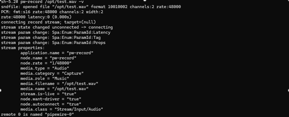
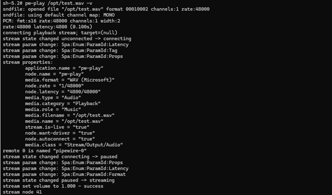

# 启用音频

本章介绍如何配置麦克风与扬声器的硬件连接，并给出验证基础音频用例的步骤。

> 以下按开发板平台分别说明。整体搭建流程如下图所示。


*搭建流程*

## 平台：QCS6490

**前置条件**

- 按照 [Qualcomm Linux 构建指南](https://docs.qualcomm.com/doc/80-70030-254/topic/introduction.html) 搭建好基础环境。
- 将最新的软件版本刷写到开发板。
- 建立 SSH 连接：

   1. 以 Permissive 模式启用 SSH。具体步骤见 [Use SSH](https://docs.qualcomm.com/doc/80-70030-254/topic/how_to.html#use-ssh)。
   2. 运行以下命令连接设备。例如设备 IP 为 10.92.160.222 时，运行下面第二条命令：

      ```shell
      ssh root@<device_IP_address>
      ```

      ```shell
      ssh root@10.92.160.222
      ```

**搭建音频硬件**

1. 要在开发板上激活数字麦克风接口（Digital Microphone Interface，DMIC），使用 DIP 开关 2，把 PIN 2 拨到 ON 位置。

   
2. 按下图所示将扬声器连接到开发板。

   

## 平台：IQ-9075

**前置条件**

- 按照 [Qualcomm Linux 构建指南](https://docs.qualcomm.com/doc/80-70030-254/topic/introduction.html) 搭建好基础环境。
- 将最新的软件版本刷写到开发板。
- 建立 SSH 连接：

   1. 以 Permissive 模式启用 SSH。具体步骤见 [Use SSH](https://docs.qualcomm.com/doc/80-70030-254/topic/how_to.html#use-ssh)。
   2. 运行以下命令连接设备。例如设备 IP 为 10.92.160.222 时，运行下面第二条命令：

      ```shell
      ssh root@<device_IP_address>
      ```

      ```shell
      ssh root@10.92.160.222
      ```

**搭建音频硬件**

按下图所示将扬声器连接到开发板。


> **注意**
>
> EVT 版本的开发板需要进行硬件改板（rework），音频功能才能正常工作。

## 平台：IQ-8275

**前置条件**

- 按照 [Qualcomm Linux 构建指南](https://docs.qualcomm.com/doc/80-70030-254/topic/introduction.html) 搭建好基础环境。
- 将最新的软件版本刷写到开发板。
- 建立 SSH 连接：

   1. 以 Permissive 模式启用 SSH。具体步骤见 [Use SSH](https://docs.qualcomm.com/doc/80-70030-254/topic/how_to.html#use-ssh)。
   2. 运行以下命令连接设备。例如设备 IP 为 10.92.160.222 时，运行下面第二条命令：

      ```shell
      ssh root@<device_IP_address>
      ```

      ```shell
      ssh root@10.92.160.222
      ```

**搭建音频硬件**

按下图所示将扬声器连接到开发板。


## 使用 GStreamer 启用音频

要使用 GStreamer 应用解码音频，请参考：

- [音频解码示例](https://docs.qualcomm.com/doc/80-70030-50/topic/gst-audio-decode-sample.html)

要使用 GStreamer 应用编码音频，请按以下步骤操作：

- 设置 PipeWire 的默认输入设备。用 `wpctl status` 命令列出可用节点，再运行 `wpctl set-default` 把源（source）节点设为手柄麦克风（handset mic）。

   ```shell
   wpctl status
   ```

   ```shell
   wpctl set-default <handset mic node>
   ```
- [音频编码示例](https://docs.qualcomm.com/doc/80-70030-50/topic/gst-audio-encode-example-without-flac.html)

> **注意**
>
> 要查看不同芯片组对应的 GStreamer 应用，参见 [多媒体示例应用的源码信息](https://docs.qualcomm.com/doc/80-70030-50/topic/example-applications.html#multimedia-sample-applications)。

GStreamer 是一个开源多媒体框架。Qualcomm 以 Qualcomm IM SDK 的形式提供了一系列 GStreamer 插件。

### GStreamer 插件

- 音频解码器和编码器的 GStreamer 插件包含在 Qualcomm IM SDK 中。下载完整的 Qualcomm IM SDK 即可使用 [pulsesrc](https://docs.qualcomm.com/doc/80-70030-50/topic/pulsesrc.html) 和 [pulsesink](https://docs.qualcomm.com/doc/80-70030-50/topic/pulsesink.html)。
- [Qualcomm IM SDK 快速入门指南](https://docs.qualcomm.com/doc/80-70030-51/topic/introduction.html) 介绍了如何下载并构建 Qualcomm IM SDK。

### GStreamer 示例应用

面向音频用例的 [GStreamer 示例应用](https://docs.qualcomm.com/doc/80-70030-50/topic/audio-sample-applications.html) 同样包含在 Qualcomm IM SDK 中。运行示例应用前，需满足这些[前置条件](https://docs.qualcomm.com/doc/80-70030-50/topic/mm_sample_apps_prerequisites.html)。

可以用命令行或 GST 应用来运行音频用例。

#### 用 GStreamer 应用播放和录制音频

参考 [音频播放/采集](https://docs.qualcomm.com/doc/80-70030-50/topic/audio-use-cases.html) 中给出的 GST 参考命令。

## 使用 PipeWire 启用音频

PipeWire 是一个基于图（graph）的处理框架，用于处理多媒体数据。PipeWire 的源码位于 `build-qcom-wayland/workspace/sources/pipewire`。

更多信息以及可用 API 的详细说明，参见 [PipeWire 开源文档](https://docs.pipewire.org/page_api.html)。

> **注意**
>
> PipeWire 仅支持对 .wav 文件进行播放和录制。

### PipeWire 录制

> 适用平台：QCS6490 / IQ-9075 / IQ-8275

1. 搭建 PipeWire 录制：用 `wpctl status` 命令列出可用节点，再运行 `wpctl set-default` 把源节点设为手柄麦克风。命令行输出应类似下图：

   ```shell
   wpctl status
   ```

   ```shell
   wpctl set-default <handset mic node>
   ```

   ```shell
   pw-record --rate=48000 --format=s16 --channels=2 /opt/test.wav -v
   ```

   
2. 按 Ctrl + C 停止录制。支持的格式有 s16le、s24le、s32le、s24-32le；采样率（rate）可取 8000、16000、22050、24000、32000、44100、48000、88200、96000、176400、192000、352800、384000、705600、768000；声道数（channels）可取 1 到最多 8。

### 录制音量设置

> 适用平台：QCS6490 / IQ-9075 / IQ-8275

1. 用 `pw-record` 工具开始音频采集。
2. 并行打开一个新的命令行窗口，通过 `ssh root@ip-addr` 进入设备，运行以下命令设置音量级别。命令中的 0.8 表示 80% 音量，可按需要调整该值：

   ```shell
   wpctl set-volume @DEFAULT_AUDIO_SOURCE@ 0.8
   ```

### PipeWire 播放

> 适用平台：QCS6490 / IQ-9075 / IQ-8275

1. 把待播放的 .wav 音频文件推送到设备：

   ```shell
   scp test.wav root@[ip-addr]:/opt/
   ```
2. 推送完 test.wav 后，用 `ssh root@ip-addr` 进入设备 shell。
3. 用下面的命令设置默认的 sink 模式，在两种 sink 模式中二选一：一种是低延迟（Low Latency，LL），另一种是深缓冲（Deep Buffer，DB）。

   ```shell
   wpctl status
   ```

   ```shell
   wpctl set-default <sink node>
   ```
4. 用以下命令开始播放。命令行输出应类似下图：

   ```shell
   pw-play /opt/test.wav -v
   ```

   

### 播放音量设置

> 适用平台：QCS6490 / IQ-9075 / IQ-8275

1. 用 `pw-play` 工具在扬声器上开始音频播放。
2. 并行打开一个新的命令行窗口，通过 `ssh root@ip-addr` 进入设备，运行以下命令设置音量级别。命令中的 0.8 表示 80% 音量，可按需要调整该值：

   ```shell
   wpctl set-volume @DEFAULT_AUDIO_SINK@ 0.8
   ```
