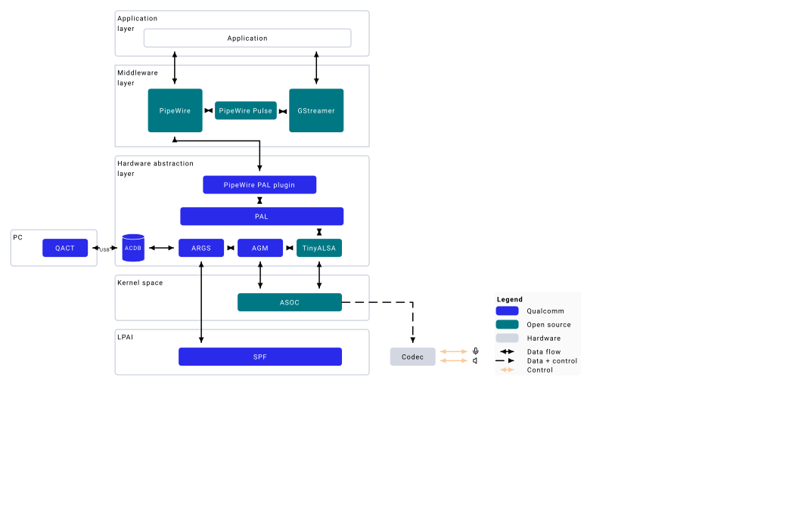

# 音频概览

由低功耗 AI（Low-Power AI，LPAI）驱动的音频子系统负责提供语音 UI 与各类音频体验。它使用专用的硬件 AI 加速器来完成基于机器学习的工作。

*音频组件概览*

音频系统包含以下部分：

- **应用处理器（Application processor）** —— 负责音频处理任务的 CPU，具体包括：

   - 管理音频的录制与播放
   - 解码各类音频格式
   - 利用 LPAI 完成后处理任务
- **低功耗 AI（Low-Power AI，LPAI）** —— 运行音频播放/录制以及语音唤醒（Voice-Activation，VA）算法的子系统。它集成了一颗专用的 Qualcomm® Hexagon™ 处理器（QDSP6）和一个低功耗孤岛（Low-Power Island，LPI）。
- **音频编解码器（Audio codec）** —— 相关硬件，负责将模拟音频转换为数字信号，或反向转换，包括：

   - 模数转换器（Analog-to-Digital Converter，ADC）
   - 数模转换器（Digital-to-Analog Converter，DAC）
- **扬声器功放（Speaker AMP）与麦克风** —— 通过 I2S/TDM/SoundWire 接口连接的设备。

## 架构

下图展示了高层次的音频软件架构。

*高层次音频软件架构*

音频软件架构的主要组件如下：

**[PipeWire](enable-audio.md#使用-pipewire-启用音频)**

PipeWire 是 Linux 上的多媒体服务器，负责在应用与硬件之间路由音频。它取代了 PulseAudio，为应用提供低延迟、安全且灵活的媒体处理能力。

**[平台抽象层（Platform Abstraction Layer，PAL）](pal.md)**

对上层提供音频专用的 API，用于访问音频硬件与驱动，从而启用各类音频特性。

**[音频图管理器（Audio Graph Manager，AGM）](agm.md)**

提供接口，使基于 TinyALSA 的混音器控件（mixer control）与 PCM/压缩音频插件能够相互交互，进而启用音频特性。

**[AudioReach 图服务（AudioReach Graph Service，ARGS）](agm.md#audioreach-图服务args)**

由图服务层（Graph Service Layer，GSL）、通用数据包路由器（Generic Packet Router，GPR）和 acdb 管理层（acdb Management Layer，AML）等模块组成。负责图的初始化与创建，以及构造数据包，向信号处理框架（Signal Processing Framework，SPF）下发一系列命令。

**[音频校准数据库（Audio Calibration Database，acdb）](agm.md)**

包含各类音频用例的信息，例如图、模块校准数据等。应用处理器解析 acdb 文件，获取 SPF 启用用例时所需的图信息。

**[信号处理框架（Signal Processing Framework，SPF）](agm.md)**

运行在 LPAI DSP 上的模块化框架。它负责为各类音频特性搭建、配置并运行信号处理模块。
