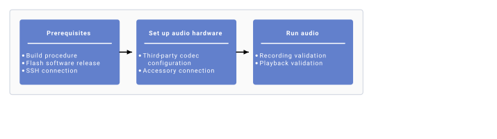
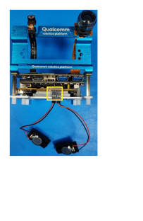

# Enable audio

This section shows how to configure hardware for
microphone and speaker connections and gives steps to verify basic audio
use cases.

**平台 QCS6490**



*Setup flow*

**Prerequisites**

- Set up your infrastructure as described in the [Qualcomm Linux Build Guide](https://docs.qualcomm.com/doc/80-70030-254/topic/introduction.html)
- Flash the latest software release to the development board.
- Set up an SSH connection:

   1. Enable SSH in Permissive mode. For instructions, see [Use SSH](https://docs.qualcomm.com/doc/80-70030-254/topic/how_to.html#use-ssh).
   2. Connect to the device by running the following command: For example, if the IP address of the device is 10.92.160.222, run the following command:

      ```xml
      ssh root@<device_IP_address>
      ```

      ```css
      ssh root@10.92.160.222
      ```

**Set up audio hardware**

1. To activate the digital microphone interface (DMIC) on the board, use DIP 2. Switch PIN 2 to the ON position. 
2. Connect the speaker to the board as follows. 

**平台 IQ-9075**


*Setup flow*

**Prerequisites**

- Set up your infrastructure as described in the [Qualcomm Linux Build Guide](https://docs.qualcomm.com/doc/80-70030-254/topic/introduction.html)
- Flash the latest software release to the development board.
- Set up an SSH connection:

   1. Enable SSH in Permissive mode. For instructions, see [Use SSH](https://docs.qualcomm.com/doc/80-70030-254/topic/how_to.html#use-ssh)
   2. Connect to the device by running the following command: For example, if the IP address of the device is 10.92.160.222, run the following command:

      ```xml
      ssh root@<device_IP_address>
      ```

      ```css
      ssh root@10.92.160.222
      ```

**Set up audio hardware**

Connect the speaker to the board as follows.


> **Note**
>
> EVT boards need hardware rework for audio functions to work.

**平台 IQ-8275**


*Setup flow*

**Prerequisites**

- Set up your infrastructure as described in the [Qualcomm Linux Build Guide](https://docs.qualcomm.com/doc/80-70030-254/topic/introduction.html)
- Flash the latest software release to the development board.
- Set up an SSH connection.

   1. Enable SSH in Permissive mode. For instructions, see [Use SSH](https://docs.qualcomm.com/doc/80-70030-254/topic/how_to.html#use-ssh)
   2. Connect to the device by running the following command: For example, if the IP address of the device is 10.92.160.222, run the following command:

      ```xml
      ssh root@<device_IP_address>
      ```

      ```css
      ssh root@10.92.160.222
      ```

**Set up audio hardware**

Connect the speaker to the board as follows.


## Enable audio with GStreamer

To decode audio using GStreamer apps, see the following.

- [Audio decode example](https://docs.qualcomm.com/doc/80-70030-50/topic/gst-audio-decode-sample.html)

To encode audio using GStreamer apps, use the following instructions.

- Set the default input device for PipeWire. Use the `wpctl status` command to list available nodes. Run `wpctl set-default` to set the source node to the handset mic.

   ```
   wpctl status
   ```

   ```cpp
   wpctl set-default <handset mic node>
   ```
- [Audio encode example](https://docs.qualcomm.com/doc/80-70030-50/topic/gst-audio-encode-example-without-flac.html)

> **Note**
>
> To check the GStreamer app for different chipsets, see [Source information for multimedia sample applications](https://docs.qualcomm.com/doc/80-70030-50/topic/example-applications.html#multimedia-sample-applications).

GStreamer is an open source multimedia framework. Qualcomm provides
GStreamer plug-ins as part of the Qualcomm IM SDK.

### GStreamer plug-ins

- GStreamer plug-ins for audio decoder and encoder are part of Qualcomm IM SDK. Download the entire Qualcomm IM SDK to use [pulsesrc](https://docs.qualcomm.com/doc/80-70030-50/topic/pulsesrc.html) and [pulsesink](https://docs.qualcomm.com/doc/80-70030-50/topic/pulsesink.html).
- The [Qualcomm IM SDK Quick Start Guide](https://docs.qualcomm.com/doc/80-70030-51/topic/introduction.html) describes how to download and build the Qualcomm IM SDK.

### GStreamer sample apps

[Sample GStreamer apps for
audio](https://docs.qualcomm.com/doc/80-70030-50/topic/audio-sample-applications.html)
use cases are part of the Qualcomm IM SDK. Before running sample apps, meet
these [prerequisites](https://docs.qualcomm.com/doc/80-70030-50/topic/mm_sample_apps_prerequisites.html).

Run audio use cases with either command line or the GST app.

#### Play and record audio with the GStreamer app

Use the reference GST commands mentioned in [audio playback/capture](https://docs.qualcomm.com/doc/80-70030-50/topic/audio-use-cases.html).

## Enable audio with PipeWire

PipeWire is a graph-based processing framework that handles multimedia data.
Find the source code for PipeWire at `build-qcom-wayland/workspace/sources/pipewire`.

For more information, see the [PipeWire open source documentation](https://docs.pipewire.org/page_api.html) for detailed APIs available.

> **Note**
>
> PipeWire supports playback and record with .wav files only.

### PipeWire record

**平台 QCS6490 / IQ-9075 / IQ-8275**

1. Set up PipeWire recording: Use the `wpctl status` command to list available nodes. Run `wpctl set-default` to set the source node to the handset mic. The command shell should resemble the following:

   ```
   wpctl status
   ```

   ```cpp
   wpctl set-default <handset mic node>
   ```

   ```python
   pw-record --rate=48000 --format=s16 --channels=2 /opt/test.wav -v
   ```

   
2. Select Ctrl + C to stop the recording. Supported formats are s16le, s24le, s32le, s24-32le, rate can be 8000, 16000, 22050, 24000, 32000, 44100, 48000, 88200, 96000, 176400, 192000, 352800, 384000, 705600, and 768000, and channels can range from 1 to a maximum of 8.

### Volume settings for recording

**平台 QCS6490 / IQ-9075 / IQ-8275**

1. Start audio capture using the `pw-record` utility.
2. Open a new command prompt in parallel. Open `ssh root@ip-addr` and run the following command to set the volume level: In the above command, a value of 0.8 represents 80% volume. Adjust this value according to the desired volume level.

   ```cpp
   wpctl set-volume @DEFAULT_AUDIO_SOURCE@ 0.8
   ```

### PipeWire playback

**平台 QCS6490 / IQ-9075 / IQ-8275**

1. Push the .wav audio file to the device for playback:

   ```typescript
   scp test.wav root@[ip-addr]:/opt/
   ```
2. After pushing the test.wav file, enter the device shell using `ssh root@ip-addr`.
3. Set the default sink mode for playback using the below command and choose between two sink modes: one for low latency (LL) and another for deep buffer (DB).

   ```
   wpctl status
   ```

   ```cpp
   wpctl set-default <sink node>
   ```
4. Use the following command to start playback: The command shell should resemble the following:

   ```
   pw-play /opt/test.wav -v
   ```

   

### Volume settings for playback

**平台 QCS6490 / IQ-9075 / IQ-8275**

1. Start audio playback on the speakers using the `pw-play` utility.
2. Open a new command prompt in parallel. Open `ssh root@ip-addr` and run the following commands to set the volume level: In the above command, a value of 0.8 represents 80% volume. Adjust this value according to the desired volume level.

   ```cpp
   wpctl set-volume @DEFAULT_AUDIO_SINK@ 0.8
   ```
