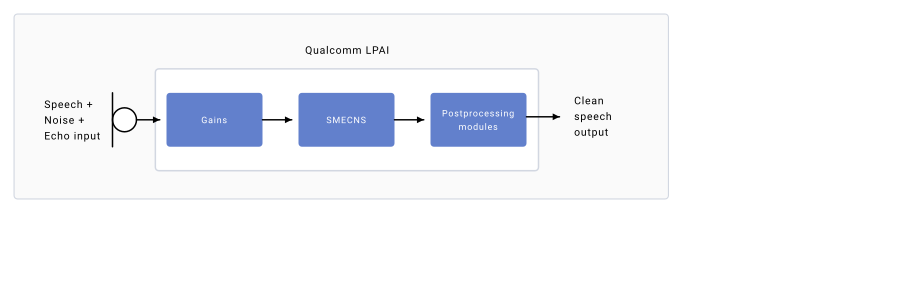

# Advanced audio features

## Minimize echo and noise

Echo and noise problems are common in VoIP systems. Speech
comes from the far-end speaker and echoes back with a time delay,
causing perception problems. Echo cancellation decreases the echo from the
far-end speaker during communication. Noise suppression
decreases the noise from the microphone channel.
The Fluence echo cancellation and noise suppression (ECNS) algorithm
provides stationary and nonstationary noise suppression and echo
cancellation.

Acoustic echo is when echoes occur due to the acoustic path (acoustic
coupling) between the loudspeaker and microphone of a device.
It’s important for hands-free and teleconferencing
applications.

The following figure shows the acoustic echo path and how acoustic echo occurs between
loudspeakers and microphones.


*Noise and acoustic echo*

- **Echo Canceller** – An adaptive filter that self-adjusts coefficients to cancel out echo. Every echo has an echo path, and is characterized by an impulse response. The echo canceller adapts to the network echo path such that it cancels out the echo.
- **Noise Suppression** – Single mic echo canceller and noise suppressor (SMECNS) helps to suppress the surrounding stationary noise when using devices in noisy locations.

### Enable SMECNS for recording

When recording, Fluence keeps speech quality in the
recording path by suppressing background noise captured by the
microphone.

For single-microphone recordings, only
stationary noise suppression is possible. Stationary noise is where the frequency
doesn’t change over time, for example, road noise or white noise.

The following figure shows how gains, SMECNS, and postprocessing modules are used to remove
outside noise and echo to output clean speech.



*SMECNS software block for recording*

To enable the SMECNS in the recording path:

1. Use the `wpctl status` command to list available nodes.

   ```
   wpctl status
   ```
2. Run `wpctl set-default` to set the source node to the handset mic.

   ```cpp
   wpctl set-default <handset mic node>
   ```
3. Run `pw-record` to start recording. The following example runs in verbose mode and saves the recording to `/opt/test.wav`.

   ```
   pw-record /opt/test.wav -v
   ```

### Enable SMECNS for VoIP

Fluence reduces noise and eliminates echo in VoIP communication. It also suppresses noise and acoustic echo on the microphone signal.

The SDK supports a PipeWire VoIP source and sink, which
you can use when developing applications.

The following figure shows the flow of input speech to output speech when gains, Fluence, and
postprocessing modules are applied for VoIP communication.


*SMECNS software block for VoIP*

To enable the SMECNS in the VoIP path:

| **Set record source** | pw-record /opt/record_voip.wav -v --target=voip-tx0 |
| --- | --- |
| **Set playback sink** | pw-play /opt/test.wav -v --target=voip-rx0 |

> **Note**
>
> Be sure to push a PCM file (`<FileName>.wav`) to the `/opt/` folder.

### Enable compress offload playback

Enable audio playback through a low-power offload path, where decoding and postprocessing are handled by the DSP. This approach reduces power consumption while improving performance compared to the standard playback path.

1. Push the MP3 file to the device.

   ```typescript
   adb push <test.mp3> /opt/
   ```
2. List available audio nodes.

   ```
   wpctl status
   ```
3. Set the default compress node.

   ```cpp
   wpctl set-default <Compress-Number>
   ```
4. Start playback.

   ```xml
   pw-encplay /opt/<test.mp3>
   ```

> **Note**
>
> Only MP3 is supported in the compress offload path.
