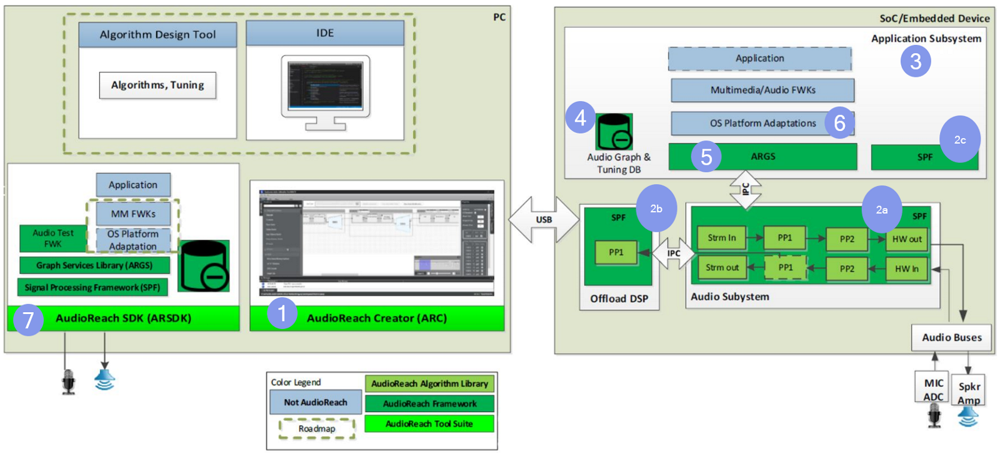
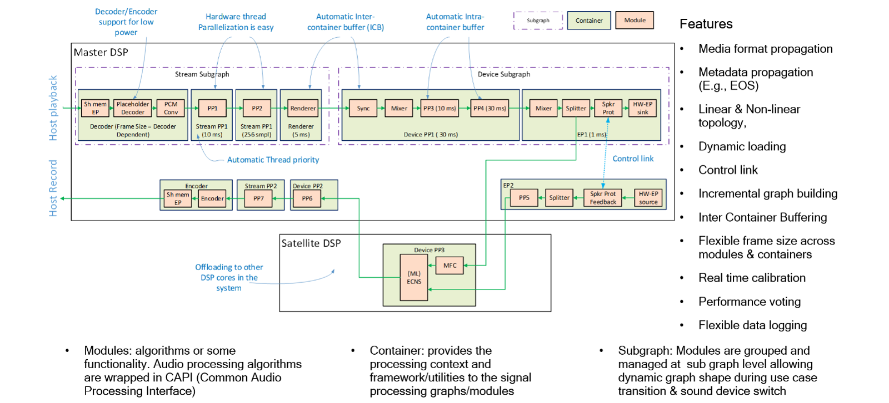
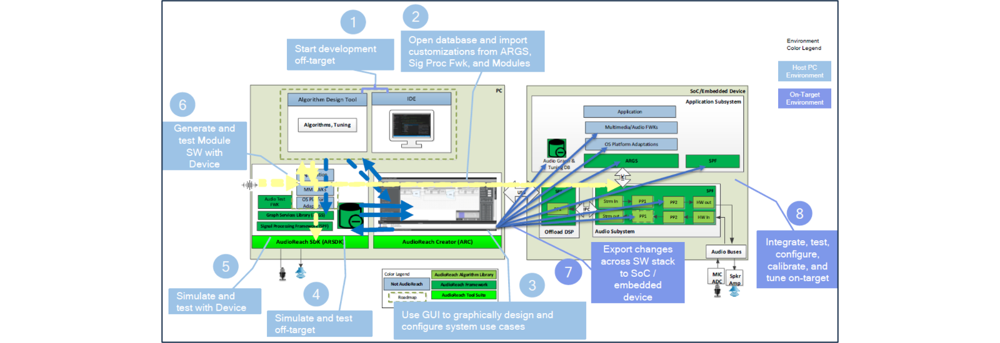
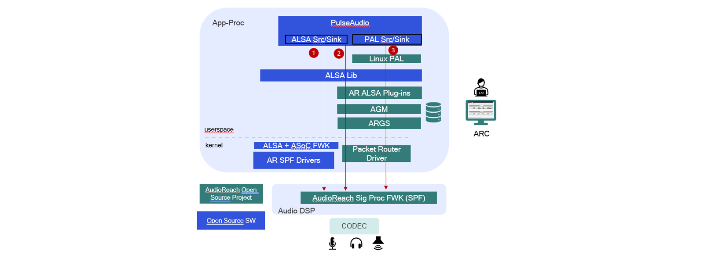

# 高通开源 AudioReach：端到端音频软件解决方案

> **作者：** Patrick Lai，首席工程师  
> **首发时间：** 2024 年 10 月  
> **原文链接：** <https://www.qualcomm.com/developer/blog/2024/10/qualcomm-open-sourcing-audio-reach-end-to-end-audio-software>  

---

如果你自己设计和搭建音频用例（use case），大概早就碰过这几块绊脚石：

- 找不到一个统一、集成的环境来开发自己的用例。
- 缺少完整的调参（tuning）和用例配置基础设施。
- 想跨多个处理器端到端地实现用例，就得同时套用多套软件框架。
- 开源框架里没有对异构分布式处理的原生支持。
- 没法在低功耗子系统和高性能子系统这个粒度上独立控制用例（信号流图，signal flow graph）。

这些障碍让当前音频处理领域的开源生态出现了一些让人头疼的空档——无论对音频处理厂商、调参工程师，还是系统集成商 / OEM / ODM 都一样。

为了补上这些空档，高通（Qualcomm Technologies, Inc.）把内部自研的 [AudioReach](https://github.com/Audioreach) 信号处理框架作为端到端音频开发方案正式开源。AudioReach 已经在高通 SoC 驱动的各类产品上规模商用，覆盖可穿戴设备、汽车、手机、XR（扩展现实）设备和计算硬件。从旗舰 CPU 一路到内存小、功耗低的处理器，AudioReach 都能跑起来。

不止于高通自家芯片，我们的愿景是把 AudioReach 发展成一个社区驱动的项目，服务全行业的厂商——首先从树莓派（Raspberry Pi）和 Xtensa DSP（数字信号处理器）开始。

本文将带你走一遍 AudioReach SDK，看看它为 PC 主机和手机、车载、XR/VR、智能音箱、摄像头和视频会议等嵌入式设备准备的那些软件组件。

（这是我在 Linaro Connect 上演讲《AudioReach Open Source Project》的摘要，详情和链接见文末。）

### 高通的开源实践

AudioReach 是高通最近开源的项目之一，所以我们期待社区给予指引和参与。

AudioReach 开源项目覆盖音频方案开发流程的四个主要环节：

- 脱机（off-target）开发——做音频产品的开发者可以直接在 PC 主机上开始动手。
- 基于 GUI 工具的图形化设计与配置。
- 设计完成后的完整测试与仿真套件。
- 通往目标设备的便捷部署路径，含集成测试与调参。

我们相信 AudioReach 能拉低音频软硬件整体的开发与维护成本。

- 在它的 GUI IDE 里，你可以实时设计、仿真（脱机和在机都行）并调参信号流图。
- 它面向互操作性设计，兼容标准 API、专业配置工具，以及 Gstreamer、PulseAudio 等产品。
- 我们让脱机开发足够顺手，之后再平滑迁移到在机（on-target）开发。
- AudioReach 高度可移植，无论 SoC / 硬件和 OS 平台如何，你都能享受同一套开发环境和工作流。
- 从内存和算力受限的可穿戴设备，到高性能车载应用，全覆盖。

前面也说了，我们希望 AudioReach 能远远超出高通硬件的范围。AudioReach 采用 [3-Clause BSD License（“BSD-3-Clause-Clear”）](https://opensource.org/license/BSD-3-clause)授权。我们期待围绕 AudioReach 成长出一个社区，由活跃贡献者和指导委员会协同共建项目。

### AudioReach SDK 里有什么？

下图展示 SDK 的主要组件：

*图 1：AudioReach 的主要组件*

左侧那个大的米色框是 PC 主机环境；右侧的是在机环境（跑在嵌入式设备的 SoC 上）。

#### 1. AudioReach Creator

AudioReach Creator 是提供 GUI 环境的主工具，你在里面设计和配置音频用例。可以用拖拽的方式把处理模块搭成系统用例，支持离线和在线两种模式。Creator 里有几个很有价值的能力：

- 运行时改图——设计用例图的过程中，可以直接在 AudioReach Creator 里把图跑起来。一旦发现缺了哪个模块，不用停掉用例就能插入新模块或删掉某个模块。[集成的可视化调试工具](https://www.youtube.com/watch?v=HgR2hiZNf_0&t=26m38s)含实时 PCM（脉冲编码调制）查看器和实时性能监视器。
- 模块调参——用例在 Creator 里跑着的时候，你可以挑某个模块进去改系数或运行时参数，全程不停用例。针对各模块的调参视图是依据模块 API 自动生成并导入到 Creator 里的。
- 处理器资源监控——按模块、按线程、按核观察 DSP 占用，可以看到平均和峰值 CPU 负载。
- 如果处理器被吃满了，可以把任务卸载（offload）到其他 DSP。

#### 2. 信号处理框架（SPF）

SPF 是一个轻量、强能力、灵活、可扩展的框架。信号处理模块只要包装进 CAPI（Common Audio Processing Interface，通用音频处理接口）就能轻松集成进框架。框架高度模块化，支持多种信号流图、线程配置和端点类型。SPF 能力面很宽，让方案能覆盖一大片形态各异的产品。如下图所示，AudioReach 支持以下特性：

- 定点和浮点 PCM 数据格式，以及各种标准压缩数据格式
- PCM 与非 PCM 媒体格式并发，支持转码（transcoding）和重采样（resampling）
- 多种调度模式与数据投递机制
- 跨异构 CPU、MCU 和 DSP 核运行多个（相互独立或相互依赖的）SPF 实例，组成逻辑信号流图，并把负载按核切分
- 媒体格式沿信号流图的处理模块传播
- 元数据沿信号流图传播（如 end-of-stream 事件的传播）
- 线性与非线性拓扑都支持
- 模块和整张信号流图都可以动态加载
- 模块间的控制链路（control link），用于交换消息、意图（intent）或其他元数据
- 信号流图的增量式构建
- 模块间和容器间缓冲
- 跨模块和容器灵活可配的帧大小（frame sizing）
- 实时校准与处理数据监控（信号、周期、内存等），即集成资源监控（IRM）
- 时钟投票（clock voting）以优化性能与功耗
- 灵活可配的数据日志

*图 2：信号处理框架细节*

#### 3. 音频校准数据库（ACDB）

ACDB 存放所有用例拓扑与图定义，以及用例的调参数据。

#### 4. AudioReach graph services

AudioReach graph services 是一组跨 OS 的图服务库，里面是与 SPF 交互的控制软件。它对外提供 API，让客户端搭建用例图，并与跑在不同子系统 SPF 上的用例图交互。graph services 还会从 ACDB 取回并下发用例与设备的图定义和调参数据。

#### 5. OS 平台适配

确保 AudioReach 支持既有生态框架和 API 是我们的优先事项。通过平台适配和插件，你在 PulseAudio 这类既有音频框架里会看到一样的开发者接触点。

#### 6. AudioReach SDK

AudioReach SDK 在脱机仿真模式下跑的就是嵌入式设备上那一套软件组件。设计和开发人员可以把用例先在仿真里跑起来，再部署到设备上。

### AudioReach 开发工作流

下图展示我们为这个开源项目设想的工作流：

*图 3：AudioReach 开发工作流*

虽然 AudioReach 开源项目（OSP）还很年轻，但我们正朝着下面这些步骤推进。

#### 在 PC 主机环境里

1. 用例设计师用 MATLAB、Simulink 这类标准工业工具开始算法开发。
2. 初步开发后，可以把定制内容和数据文件导入到 AudioReach Creator。
3. 在 GUI 环境里设计和配置系统用例。
4. 设计好的用例可以跑在脱机仿真平台上。音频数据可以接回比如 MATLAB 处理，再回到脱机仿真里。
5. 脱机环境验证通过后，我们设想把测试从设计工具搬到真实目标上。设计师可以在特定硬件平台上验证自己的算法，这一步与 AudioReach 解耦。
6. 测试完成后，工具可以自动生成已经包装进 AudioReach 模块接口、并针对特定处理器架构优化过的算法模块。
   在在机环境里
   接下来，希望能把配置导出到 SoC 上软件栈的各个组件。
   然后开发者就可以在目标设备上做集成、测试、配置和调参。

一句话，我们的目标是让整个开发工作流都通过工具打通。

### AudioReach 在 Linux 上

前面提过，AudioReach 已经在高通 SoC 驱动的一大票产品上商用。作为 Linux 开发者，你有三条启用 AudioReach 的路径可选，架构图如下：

*图 4：Linux 上的 AudioReach 开发*

1. link ALSA 内核驱动——这个驱动已经上游化。注意目前只支持基本的播放（rendering）和录音（capture）。

2. 用户态架构——想要完整特性集，这是更合适的路径。它走的是典型 Linux 音频软件栈：PulseAudio 跑在 libALSA 之上。底层由 AudioReach SDK 提供插件去对接通用 AudioReach 组件。PulseAudio 直接连到一个叫 libALSA 的随机弹出的库。SDK 也有插件去对接通用 AudioReach 组件。

3. 平台适配层（PAL）——我们路线图上还有一条与 Linux PAL（相当于中间件）交互的路径。这层提供开箱即用的逻辑，能管理一大堆用例和声音设备。

#### 设备部署愿景

把音频功能部署到设备上（这里以 Yocto 拼装为例），你会走下面这条流程：

- 买一块被 AudioReach OSP 和 Yocto 支持的参考硬件。
- 同步 Yocto 工程，拉入必要的 meta-layer。
- 把板子带起来，验证音频用例。
- 用 AudioReach Creator 针对形态调参。
- 从 Qualcomm Developer 下载 AudioReach Creator，设计用例图。
- 构建 BSP（板级支持包）和 AudioReach 软件。
- 部署。

高通已经为 AudioReach 开发了 meta-layer，所有内容都能从各 OSP 拉到。

### AudioReach 路线图

自 AudioReach 起步以来，这是它首次登陆非高通平台：树莓派 4。我们已经贡献了首批音频处理模块，并上线了文档站点。

图 5 标出未来几个季度路线图上的主要活动和贡献。

2025 Q2：

- 文档站点上线首批内容，聚焦项目概览和整体软件设计。后续会陆续发布更多内容，带开发者一步步用 AudioReach SDK 搭产品。

2025 Q3：

- Xtensa 的 Hifi DSP 是一种常被集成进 SoC、作为整体音频方案一部分的 DSP 架构。我们想把 AudioReach 移植到跑 Zephyr RTOS 的 Hifi DSP 上，把触角伸向更广的开发者社区。
- 目前 AudioReach 在树莓派 4 上只支持播放。我们想再加上录音。
- 我们正积极把 AudioReach IPC 内核驱动上游化，凑齐完整的 AudioReach Linux 栈。

2025 Q4：

- 为了让社区更深度参与，高通正在翻新工作流和 CI/CD 基础设施，转向公开开发。

2026 Q1：

我们设想在 2026 Q1 把整体方案的主组件 AudioReach Creator 彻底开源。

*图 5：AudioReach 路线图*

#### 下一步

你的一砖一瓦、你的参与，都能帮我们把路线图打磨得更好。欢迎到 [github.com/audioreach](https://github.com/audioreach) 看项目、下 SDK，告诉我们你想要什么。也欢迎加入我们的 [Discord 开源讨论](https://discord.com/invite/qualcommdevelopernetwork)，认识各路专家、交换想法，并得到我们技术团队的快速支持。

我们相信 AudioReach 开源项目能帮助应用开发者和算法方案开发者降低开发与维护成本，也给 OEM 和芯片厂商带来希望——他们可以把 AudioReach 装到自家硬件平台上。

更多细节，可以看我在 Linaro Connect 2024 上的演讲《AudioReach Open Source Project》。视频末尾有两分钟的 AudioReach Creator 现场演示。

---

## 关于作者

Patrick Lai 是高通首席工程师，音频软件团队成员，专攻 Linux 音频，也是 AudioReach 开源项目的首席维护者。

---

*本文 Markdown 由 Qualcomm Developer Network 博客原文翻译而来。原文为 React 单页应用，内容从 Adobe Experience Manager 内容模型的 JSON 中提取并转为 Markdown；所有图片已下载到本地，便于离线阅读和 GitHub 同步。*
