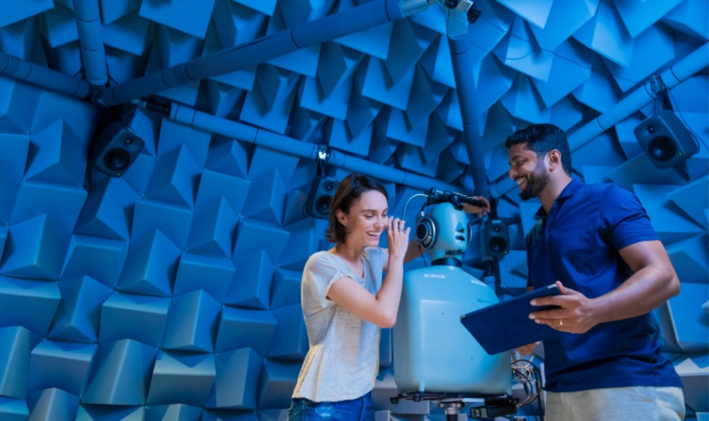

# Qualcomm Technologies, Inc. is open-sourcing AudioReach, its end-to-end audio software solution

> **Author:** Patrick Lai, Principal Engineer
> **Originally published:** October 2024  
> **Source:** <https://www.qualcomm.com/developer/blog/2024/10/qualcomm-open-sourcing-audio-reach-end-to-end-audio-software>

---

If you design and build your own audio use cases, you’ve probably found a few big obstacles on the development landscape:

- You can’t find a single, integrated environment for developing your use cases.
- There’s no comprehensive infrastructure for tuning and use case configuration.
- If you want to implement use cases end-to-end, across multiple processors, you have to use multiple software frameworks.
- There’s no native support for heterogenous distributed processing in open-source frameworks.
- You can’t independently control use cases (signal flow graphs) at the level of low-power or high-performance subsystems.

Those obstacles have created annoying gaps in the current open-source landscape for audio processing vendors, tuning engineers and system integrators/OEMs/ODMs.

To fill those gaps, Qualcomm Technologies, Inc. is open-sourcing [AudioReach](https://github.com/Audioreach) Signal Processing Framework, an SDK it has developed in house as an end-to-end approach to audio development. AudioReach has already been commercialized on a wide range of products powered by Qualcomm Technologies’ system-on-chips (SoCs), such as wearables, automobiles, handsets, extended reality (XR) devices and computing hardware. AudioReach runs on products all across the spectrum of computing resources, from premium CPUs down to processors with small on-board memory and low power consumption.

Going beyond Qualcomm Technologies’ silicon, we envision growing AudioReach into a community-driven project that supports vendors across the industry – starting with Raspberry Pi and Xtensa DSP (digital signal processor).

This post explores the AudioReach SDK, including the software components made for host PCs and embedded devices like phones, automotive gear, XR/VR, smart speakers, cameras and video conference hardware.

(This is a summary of my presentation “[AudioReach Open Source Project](https://resources.linaro.org/en/resource/cQVJgqaPFngjW4yDLsMpUt)” at Linaro Connect. See below for details and links.)

### Qualcomm Technologies’ open-source effort

AudioReach is one of the company's most recent open-source projects, so we look to the community for guidance and participation.

The AudioReach open-source project enables 4 main parts of the workflow in audio solution development:

- Off-target development, in which developers working on an audio product can start their effort from the host PC
- Graphical design and configuration using GUI-based tools
- A comprehensive suite for testing and simulations, once design is finished
- An easy deployment path onto target devices, with integration tests and tuning

We believe AudioReach can lower the overall cost of developing and maintaining audio software and hardware.

- In its GUI-based IDE, you can design, simulate (both off and on target) and tune signal flow graphs in real time.
- It’s designed for interoperability with standard APIs, specialized configuration tools, and products like Gstreamer and PulseAudio.
- We’ve made it easy to work off target, then migrate your projects to on-target development.
- AudioReach is designed to be highly portable so you can enjoy the same development environment and workflow regardless of SoC/hardware and OS platforms.
- You can use it in a full range of hardware products from memory- and compute-constrained wearables to high-performance automotive applications.

As I mentioned, we look forward to seeing AudioReach grow far beyond hardware powered by Qualcomm Technologies. The license structure for AudioReach will be the [3-Clause BSD License (“BSD-3-Clause-Clear”)](https://opensource.org/license/BSD-3-clause). We envision that a community will grow around AudioReach, with contributions from active participants and steering committees that collaborate on building out projects.

### What’s in the AudioReach SDK?

The diagram below shows the main components of the SDK:

*Figure 1: Main components of AudioReach*

The large, beige box on the left depicts the host PC environment; the one on the right shows the on-target environment (running on the SoC in an embedded device).

#### 1. AudioReach Creator

AudioReach Creator is the main tool that provides the GUI environment in which you design and configure audio use cases. You use it to drag and drop the processing modules that form the use cases for your systems in off-line and on-line modes. You’ll find several valuable capabilities in the AudioReach Creator:

- Run-time audio graph modification – While still working on their use case graph, designers can run the graph in AudioReach Creator. If they realize that a module is missing, they can insert new modules or delete a module without stopping the use case. [Integrated visual debugging tools](https://www.youtube.com/watch?v=HgR2hiZNf_0&t=26m38s) include a real-time pulse-code modulation (PCM) viewer and a real-time performance monitor.
- Module tuning – While the use case is running in AudioReach Creator, you can pick and poke modules to change the coefficients or runtimes without stopping the use case. The tuning views that are specific to the modules are automatically generated from module APIs and imported into AudioReach Creator.
- Processor resource monitoring – Keep an eye on your DSP utilization with resource monitoring - per module, per thread and per core. You can see average and peak CPU load.
- If you’re maxing out the processor, you can choose to offload the tasks to other DSPs.

#### 2. Signal processing framework (SPF)

The SPF is a lightweight, highly capable, flexible, extensible framework. Signal processing modules are easily integrated into the framework by wrapping into the Common Audio Processing Interface (CAPI). The framework is modularized to support many different types of signal flow graphs, threading configurations and endpoint types. SPF is equipped with an extensive range of capabilities, allowing the solution to span across a broad set of diverse products. As depicted in the diagram below, Audio Reach supports the following:

- Fixed- and floating point PCM data format, and various standard compressed data formats
- Concurrent PCM and non-PCM media formats, enabling transcoding and resampling
- Multiple scheduling modes and data delivery mechanisms
- Multiple (independent or interdependent) instances of SPF across heterogenous CPU, MCU, and DSP cores to form logical signal flow graph with workload being partitioned across cores
- Media format propagation across the processing modules in the signal flow graph
- Metadata propagation across the signal flow graph (e.g., propagation of end-of-stream event)
- Both linear and non-linear topologies
- Dynamic loading of modules and entire signal flow graphs
- Control link across modules to exchange messages, intents or other meta-data
- Incremental signal flow graph construction
- Inter-module and -container buffering
- Flexible and configurable frame sizing across modules and containers
- Real-time calibration and processing data monitoring (signal, cycle, memory, etc.) or integrated resource monitoring (IRM)
- Clock voting to optimize performance and power
- Flexible and configurable data logging

*Figure 2: Details of Signal Processing Framework*

#### 3. Audio calibration database (ACDB)

The ACDB is where all the use case topology and graph definitions are stored, along with the tuning data for your use cases.

#### 4. AudioReach graph services

AudioReach graph services is set of cross-OS graph service libraries containing the control software that interacts with the SPF. It provides the API to the client to set up a use case graph and interacts with that use case graph running on the SPF of different subsystems. AudioReach graph services fetches and downloads graph definitions and tuning data for the use cases and devices from ACDB.

#### 5. OS platform adaptations

It’s our priority to make sure that AudioReach supports the established ecosystem framework and APIs. Through platform adaptations and plug-ins you’ll find the same developer touch points for existing audio frameworks like PulseAudio.

#### 6. AudioReach SDK

The AudioReach SDK runs the same software components as the ones on the embedded device, in off-target simulation mode. Designers and developers can run their use cases in simulation before deploying to the device.

### AudioReach development workflow

The diagram below illustrates the workflow we envision for this open-source project:

*Figure 3: AudioReach development workflow*

Although the AudioReach open-source project (OSP) is still in its infancy, we’re working toward the following steps.

#### In the host PC environment

1. Use case designers will start algorithm development using standard industrial tools such as MATLAB and Simulink.
2. After initial development they can take import customizations and data files to the AudioReach Creator.
3. In the GUl environment, they can design and configure system use cases.
4. The designed use cases can then be run on off-target simulation platforms. Audio data can be piped back into, say, MATLAB for processing, then back into off-target simulation.
5. After validation in the off-target environment, we envision deploying the testing from the design tool onto the actual target. Designers can validate their algorithm running on the particular hardware platform agnostically from AudioReach.
6. Once testing is finished, the tools can auto-generate the algorithm modules wrapped in the AudioReach module interface and already optimized for a particular processor architecture.
   In the on-target environment
   Next, we'd like to be able to export configurations to different components in the software stack running on the SOC itself.
   From there, the developer can integrate, test, configure and tune on the target device.

In short, our goal is to enable the whole development workflow through the tool.

### AudioReach on Linux

As I mentioned above, AudioReach has already been commercialized on a wide range of products powered by Qualcomm Technologies’ SoCs. As a Linux developer, you have 3 optional paths for enabling AudioReach, as shown in the architecture diagram below:

*Figure 4: AudioReach development on Linux*

1. The link ALSA kernel – This driver is already upstreamed. Note that it currently supports only basic renderings and captures.

2. User-mode architecture – This is a better path for the full feature set. This path follows a typical Linux audio software stack that PulseAudio runs on top of libALSA. Underneath, the AudioReach SDK provides plug-ins to interact with generic AudioReach components. PulseAudio connects directly to a random pop-up called libALSA. The SDK also has plug-ins to interact with generic AudioReach components.

3. Platfrom Adaptation Layer (PAL) - on our roadmap is a path for interacting with the Linux PAL (which serves like a middleware). This layer provides ready to use logic to manage a wide variety of use cases and sound devices.

#### Vision for device deployment

Here’s the workflow you would follow to deploy audio functions to a device (put together with Yocto, in this case):

- Purchase reference hardware supported by the AudioReach OSP and Yocto.
- Sync the Yocto project and pull in necessary meta-layers
- Bring up the board and verify audio use cases.
- Tune form factor with AudioReach Creator.
- Download AudioReach Creator from Qualcomm Developer and design use case graphs.
- Build board support package (BSP) and AudioReach software.
- Deploy.

Qualcomm Technologies, Inc. has already developed the meta-layers for AudioReach, which will allow for everything to be pulled from the OSPs.

### The roadmap for AudioReach

Since the inception of AudioReach, this is its first availability on a non-Qualcomm platform: Rasbperry Pi 4. We have contributed an initial set of audio processing modules and launched a documentation site.

Figure 5 highlights the main activities and contributions on our roadmap for upcoming quarters.

Q2 2025:

- Initial content in the documentation site focused on project overview and overall software design. Our plan is to publish additional content to walk developers through the steps to build products using the AudioReach SDK.

Q3 2025:

- Hifi DSP from Xtensa is a DSP architecture that is often integrated into SoCs as part of the overall audio solution. We would like to port AudioReach onto Hifi DSP running Zephyr RTOS to extend reach to a wider developer community.
- So far, AudioReach supports only playback on Raspberry Pi 4. We would like to add recording.
- We are actively working on upstreaming the AudioReach IPC kernel driver for a complete AudioReach stack on Linux.

Q4 2025:

- To enable broader community involvement in the project, Qualcomm is overhauling workflow and CI/CD infrastructure to develop in public.

Q1 2026:

We envision making AudioReach Creator, the main component of our overall solution completely open source by Q1 2026.

*Figure 5: AudioReach roadmap*

#### Next steps

You can help us refine our roadmap with your constructive contributions and participation. Visit the project at [github.com/audioreach](https://github.com/audioreach) to download the SDK and give us feedback on what you’d like to see. You are also welcome to join our [open source chat on Discord](https://discord.com/invite/qualcommdevelopernetwork) to meet fellow experts, exchange your ideas and get prompt support from out technical team.

We believe that the AudioReach open-source project will help lower the development and maintenance costs for application developers and algorithm solution developers. And it holds promise for the OEMs and silicon vendors who can ship AudioReach on their hardware platforms.

For more details, watch my presentation “[AudioReach Open Source Project](https://resources.linaro.org/en/resource/cQVJgqaPFngjW4yDLsMpUt)” at Linaro Connect 2024. At the end of the video is a two-minute on-screen walkthrough of AudioReach Creator.

---

## About the author

Patrick Lai is Principal Engineer at Qualcomm Technologies Inc. and member of audio software team. He specializes in Linux audio and has been a lead maintainer of AudioReach Open Source Project.

---

*This Markdown was generated from the Qualcomm Developer Network blog post. The original page is a React single-page app whose content was extracted from the Adobe Experience Manager content model JSON and converted to Markdown; all images were downloaded locally for offline reading and GitHub sync.*
